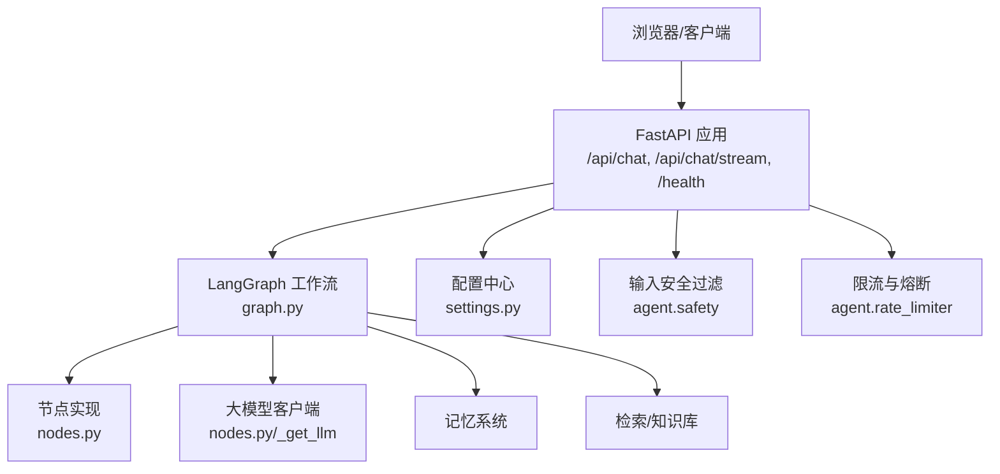
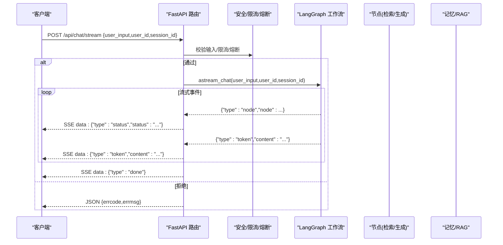
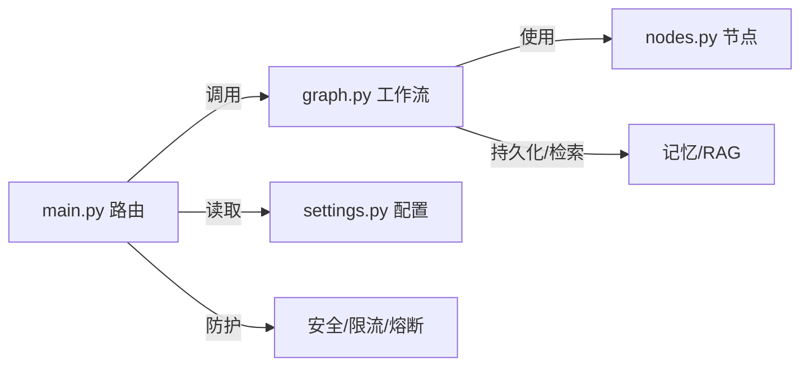

# API接口参考

<cite>
**本文引用的文件**
- [main.py](file://main.py)
- [settings.py](file://config/settings.py)
- [index.html](file://static/index.html)
- [graph.py](file://agent/graph.py)
- [nodes.py](file://agent/nodes.py)
</cite>

## 目录
1. [简介](#简介)
2. [项目结构](#项目结构)
3. [核心组件](#核心组件)
4. [架构总览](#架构总览)
5. [详细接口说明](#详细接口说明)
6. [依赖关系分析](#依赖关系分析)
7. [性能与可靠性](#性能与可靠性)
8. [故障排查指南](#故障排查指南)
9. [结论](#结论)
10. [附录：客户端集成示例](#附录客户端集成示例)

## 简介
本参考文档面向开发者，提供钉钉AI智能体助手服务的RESTful API完整规范。重点覆盖：
- Web聊天标准模式（一次性返回）
- Web聊天流式模式（SSE事件流）
- 健康检查端点
- 请求/响应格式、错误码、连接管理与超时策略
- 前端调用示例与最佳实践

服务基于FastAPI构建，默认监听端口为8000。启动后访问根路径可加载内置Web聊天界面。

## 项目结构
本项目通过单一入口暴露HTTP接口，核心路由定义在入口文件中；配置集中管理；前端静态页面用于演示和调试。

图表来源
- [main.py:145-326](file://main.py#L145-L326)
- [graph.py:197-230](file://agent/graph.py#L197-L230)
- [settings.py:19-49](file://config/settings.py#L19-L49)
- [nodes.py:23-48](file://agent/nodes.py#L23-L48)

章节来源
- [main.py:1-387](file://main.py#L1-L387)
- [settings.py:1-216](file://config/settings.py#L1-L216)

## 核心组件
- FastAPI应用与路由：定义Web聊天、流式聊天与健康检查端点
- 配置管理：集中化环境变量与默认值，包括LLM、RAG、流式超时等
- LangGraph工作流：编排意图识别、检索、生成、记忆更新等节点
- 输入安全与限流熔断：关键词黑名单、注入检测、滑动窗口限流、熔断器
- 前端示例：内置HTML页面演示SSE流式消费

章节来源
- [main.py:145-326](file://main.py#L145-L326)
- [settings.py:19-49](file://config/settings.py#L19-L49)
- [graph.py:197-230](file://agent/graph.py#L197-L230)
- [nodes.py:23-48](file://agent/nodes.py#L23-L48)

## 架构总览
下图展示一次流式聊天请求从客户端到后端各组件的交互流程，包括状态提示、增量token输出与结束标记。

图表来源
- [main.py:228-314](file://main.py#L228-L314)
- [graph.py:208-230](file://agent/graph.py#L208-L230)

## 详细接口说明

### 通用约定
- 基础地址：http://localhost:8000（部署时替换为实际域名/IP）
- 字符编码：UTF-8
- 鉴权：当前接口无鉴权（生产环境建议增加网关或鉴权中间件）
- 会话标识：
  - user_id：用户标识，用于限流与上下文隔离
  - session_id：会话标识，用于多轮对话状态管理

### 1) 获取Web聊天页面
- 方法：GET
- 路径：/
- 请求参数：无
- 响应：HTML页面（包含内置聊天UI）
- 用途：快速体验与服务可用性验证

章节来源
- [main.py:145-151](file://main.py#L145-L151)

### 2) 健康检查
- 方法：GET
- 路径：/health
- 请求参数：无
- 响应体字段：
  - status: 字符串，固定为 "ok"
  - service: 字符串，服务名
  - checkpointer: 字符串，当前检查点类型
- 用途：服务存活探测、负载均衡健康检查

章节来源
- [main.py:317-326](file://main.py#L317-L326)

### 3) Web聊天（标准模式）
- 方法：POST
- 路径：/api/chat
- 请求头：Content-Type: application/json
- 请求体：
  - user_input: 字符串，必填，用户问题
  - user_id: 字符串，可选，默认 "web-user"
  - session_id: 字符串，可选，默认 "web-session"
- 成功响应（HTTP 200）：
  - errcode: 整数，0表示成功
  - errmsg: 字符串，"ok"
  - answer: 字符串，最终回答内容
- 失败响应：
  - HTTP 403：输入安全拦截（errcode=403）
  - HTTP 429：触发限流（errcode=429）
  - HTTP 503：熔断保护（errcode=503）
  - HTTP 500：服务端异常（errcode=500）
- 处理流程要点：
  - 空输入直接返回错误
  - 输入安全过滤（关键词黑名单、prompt注入检测）
  - 限流（按user_id滑动窗口）
  - 熔断（连续失败阈值）
  - 调用LangGraph工作流同步执行并返回answer

章节来源
- [main.py:138-209](file://main.py#L138-L209)

### 4) Web聊天（流式模式，SSE）
- 方法：POST
- 路径：/api/chat/stream
- 请求头：Content-Type: application/json
- 请求体：同“标准模式”
- 响应：Server-Sent Events（text/event-stream），逐条推送事件
- 事件类型：
  - type=status：节点进度提示（如“预检查中”“检索中”“生成中”）
  - type=token：增量文本片段
  - type=error：异常信息（包含errmsg）
  - type=done：流结束标记
- 连接与超时：
  - 整体超时由配置项 stream_timeout 控制（秒），超时后停止拉取并返回已生成的token
  - 响应头包含 Cache-Control: no-cache、Connection: keep-alive、X-Accel-Buffering: no
- 错误处理：
  - 空输入：JSON错误响应（errcode=1）
  - 安全拦截：HTTP 403（errcode=403）
  - 限流：HTTP 429（errcode=429）
  - 熔断：HTTP 503（errcode=503）
  - 流内异常：推送 error 事件并记录失败计数
- 事件序列示例（概念性）：
  - status → token* → done
  - 若未产生token且超时：推送一条提示token + done
  - 若发生异常：推送 error + done

章节来源
- [main.py:223-314](file://main.py#L223-L314)
- [settings.py:47-48](file://config/settings.py#L47-L48)

### 5) 事件与状态映射
- 节点状态提示（部分）：
  - pre_check：预检查中（缓存匹配+意图识别）
  - load_memory：加载长期记忆中
  - retrieve：检索知识库中
  - web_search：联网搜索中
  - generate：生成回答中
  - memory_background：更新记忆中
- 这些状态通过 status 事件推送，便于前端显示“思考中”等提示

章节来源
- [main.py:212-220](file://main.py#L212-L220)

## 依赖关系分析
- 路由层（main.py）负责：
  - 请求校验与安全过滤
  - 限流与熔断
  - 调用工作流（同步/异步）
  - 封装SSE事件流
- 工作流层（graph.py）负责：
  - 编译图、流式迭代
  - 将节点更新与消息增量转换为统一事件
- 节点层（nodes.py）负责：
  - 获取LLM实例（含重试与超时）
  - 工具调用与结果格式化
- 配置层（settings.py）负责：
  - 全局参数（模型、检索、流式超时、限流阈值等）

图表来源
- [main.py:154-314](file://main.py#L154-L314)
- [graph.py:197-230](file://agent/graph.py#L197-L230)
- [nodes.py:23-48](file://agent/nodes.py#L23-L48)
- [settings.py:19-49](file://config/settings.py#L19-L49)

章节来源
- [main.py:154-314](file://main.py#L154-L314)
- [graph.py:197-230](file://agent/graph.py#L197-L230)
- [nodes.py:23-48](file://agent/nodes.py#L23-L48)
- [settings.py:19-49](file://config/settings.py#L19-L49)

## 性能与可靠性
- 首请求优化：启动时预热LLM连接（TLS握手、DNS解析、连接池建立），降低首次延迟
- 向量库预热：启动时检查并自动重建/增量更新知识库，避免首请求阻塞
- 流式超时：通过 stream_timeout 控制整体流式超时，防止连接长时间占用
- 限流与熔断：按用户维度限流；连续失败达到阈值后熔断，保障服务稳定性
- 代理兼容：响应头禁用Nginx缓冲，确保SSE实时性

章节来源
- [main.py:45-135](file://main.py#L45-L135)
- [main.py:262-314](file://main.py#L262-L314)
- [settings.py:47-49](file://config/settings.py#L47-L49)

## 故障排查指南
- 403 输入安全拦截：检查是否命中敏感词或Prompt注入检测
- 429 限流：确认user_id频率是否超过限制，调整 rate_limit_per_minute
- 503 熔断：检查下游服务稳定性，等待冷却时间后重试
- 500 服务端异常：查看日志定位具体异常堆栈
- SSE未收到事件：
  - 检查网络代理是否支持SSE（禁用缓冲）
  - 确认客户端正确解析 data: 行并以 \n\n 分隔事件
  - 关注整体超时设置，必要时增大 stream_timeout

章节来源
- [main.py:163-209](file://main.py#L163-L209)
- [main.py:238-314](file://main.py#L238-L314)

## 结论
本API提供简洁易用的Web聊天能力，涵盖标准与流式两种模式，配合安全过滤、限流熔断与流式超时机制，满足高可用与良好用户体验的需求。开发者可基于SSE事件流实现即时反馈的前端体验，并通过会话标识维护多轮对话上下文。

## 附录：客户端集成示例

### 标准模式调用示例（JavaScript fetch）
- 目标：POST /api/chat，获取最终回答
- 关键点：
  - 设置 Content-Type: application/json
  - 传入 user_input、user_id、session_id
  - 解析响应中的 answer 字段

章节来源
- [main.py:154-209](file://main.py#L154-L209)

### 流式模式调用示例（JavaScript fetch + ReadableStream）
- 目标：POST /api/chat/stream，接收SSE事件流
- 关键点：
  - 使用 fetch 发起请求，读取 resp.body.getReader()
  - 以 TextDecoder 解码字节流
  - 按 \n\n 分割事件，逐行解析以 "data:" 开头的JSON
  - 根据 type 字段处理：
    - status：显示“思考中”状态
    - token：追加到回复气泡
    - error：显示错误信息
    - done：结束渲染
- 前端参考实现见内置页面

章节来源
- [index.html:255-324](file://static/index.html#L255-L324)
- [main.py:228-314](file://main.py#L228-L314)

### 连接管理与超时
- 客户端应合理设置超时与重连策略
- 服务端整体超时由 stream_timeout 控制，可在配置中调整
- 代理层需保持长连接并禁用缓冲

章节来源
- [settings.py:47-48](file://config/settings.py#L47-L48)
- [main.py:306-314](file://main.py#L306-L314)