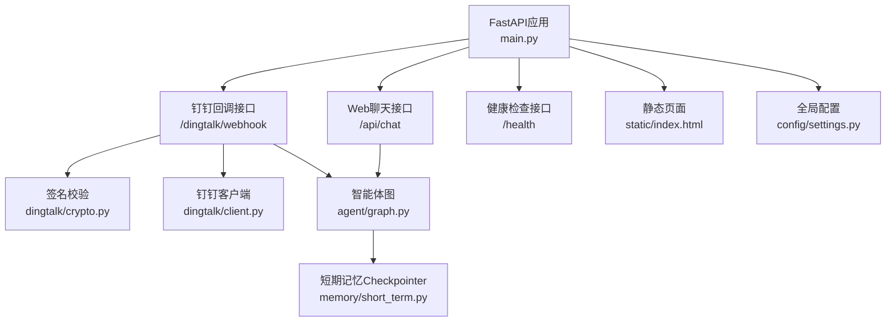
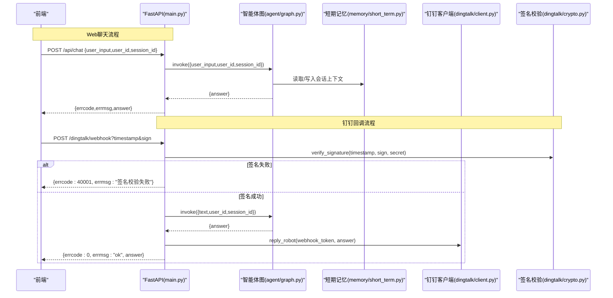
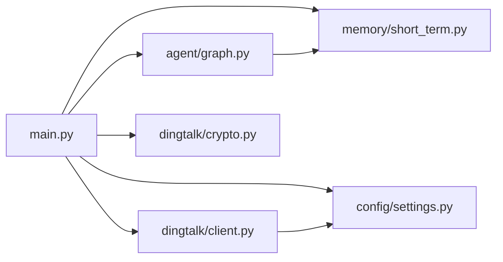

# API接口文档

<cite>
**本文引用的文件**   
- [main.py](file://main.py)
- [config/settings.py](file://config/settings.py)
- [dingtalk/client.py](file://dingtalk/client.py)
- [dingtalk/crypto.py](file://dingtalk/crypto.py)
- [agent/graph.py](file://agent/graph.py)
- [memory/short_term.py](file://memory/short_term.py)
- [static/index.html](file://static/index.html)
- [requirements.txt](file://requirements.txt)
- [tests/test_smoke.py](file://tests/test_smoke.py)
</cite>

## 目录
1. [简介](#简介)
2. [项目结构](#项目结构)
3. [核心组件](#核心组件)
4. [架构总览](#架构总览)
5. [详细接口说明](#详细接口说明)
6. [依赖关系分析](#依赖关系分析)
7. [性能与限流](#性能与限流)
8. [故障排查指南](#故障排查指南)
9. [结论](#结论)
10. [附录：前端集成与测试](#附录前端集成与测试)

## 简介
本文件为“钉钉AI智能体助手”的API接口文档，覆盖以下能力：
- Web聊天接口（POST /api/chat）：面向Web前端的无鉴权聊天端点。
- 钉钉回调接口（POST /dingtalk/webhook）：接收钉钉机器人Outgoing Webhook消息，完成签名校验、智能体问答与消息回复。
- 健康检查接口（GET /health）：服务状态监控。
- 认证机制、错误码定义、调试方法与前端集成示例。

## 项目结构
系统采用FastAPI作为Web框架，结合LangGraph构建智能体工作流，使用DingTalk客户端进行消息收发，配置通过pydantic-settings集中管理。

图表来源
- [main.py:36-103](file://main.py#L36-L103)
- [dingtalk/crypto.py:14-62](file://dingtalk/crypto.py#L14-L62)
- [dingtalk/client.py:16-140](file://dingtalk/client.py#L16-L140)
- [agent/graph.py:25-82](file://agent/graph.py#L25-L82)
- [memory/short_term.py:13-28](file://memory/short_term.py#L13-L28)
- [static/index.html:359-402](file://static/index.html#L359-L402)
- [config/settings.py:16-93](file://config/settings.py#L16-L93)

章节来源
- [main.py:1-103](file://main.py#L1-L103)
- [config/settings.py:16-93](file://config/settings.py#L16-L93)

## 核心组件
- FastAPI应用与路由：提供根路径HTML、Web聊天、健康检查、钉钉回调等端点。
- 智能体工作流：基于LangGraph的状态图，包含情感分析、路由判断、RAG检索、生成回答、记忆更新等节点。
- 钉钉客户端：封装access_token获取、文本/Markdown发送、机器人webhook回复。
- 签名校验：HMAC-SHA256签名生成与验证，支持时间戳有效期校验。
- 短期记忆：进程内MemorySaver，按thread_id维护会话上下文。
- 配置管理：从环境变量或.env加载LLM、向量库、记忆、钉钉等参数。

章节来源
- [agent/graph.py:25-82](file://agent/graph.py#L25-L82)
- [dingtalk/client.py:16-140](file://dingtalk/client.py#L16-L140)
- [dingtalk/crypto.py:14-62](file://dingtalk/crypto.py#L14-L62)
- [memory/short_term.py:13-28](file://memory/short_term.py#L13-L28)
- [config/settings.py:16-93](file://config/settings.py#L16-L93)

## 架构总览
下图展示请求在系统中的流转过程，包括Web聊天与钉钉回调两条主线。

图表来源
- [main.py:58-91](file://main.py#L58-L91)
- [main.py:106-176](file://main.py#L106-L176)
- [agent/graph.py:76-82](file://agent/graph.py#L76-L82)
- [memory/short_term.py:13-28](file://memory/short_term.py#L13-L28)
- [dingtalk/client.py:104-127](file://dingtalk/client.py#L104-L127)
- [dingtalk/crypto.py:33-62](file://dingtalk/crypto.py#L33-L62)

## 详细接口说明

### 通用约定
- 内容类型：application/json
- 响应格式统一包含字段：
  - errcode：整数，0表示成功，非0表示错误
  - errmsg：字符串，错误描述
  - 业务字段：如answer（回答文本）

章节来源
- [main.py:58-91](file://main.py#L58-L91)
- [main.py:106-176](file://main.py#L106-L176)

### GET /health — 健康检查
- 方法：GET
- URL：/health
- 功能：返回服务状态与checkpointer类型，用于健康监控。
- 请求参数：无
- 响应体：
  - status：字符串，固定为"ok"
  - service：字符串，固定为"dingtalk-ai-agent"
  - checkpointer：字符串，当前短期记忆后端类型标识（如"memory"）
- 成功示例：
  - {"status":"ok","service":"dingtalk-ai-agent","checkpointer":"memory"}
- 失败场景：
  - 服务未启动或端口不可达时HTTP层报错；否则该端点始终返回200与上述JSON。

章节来源
- [main.py:94-103](file://main.py#L94-L103)
- [memory/short_term.py:23-28](file://memory/short_term.py#L23-L28)

### POST /api/chat — Web聊天接口
- 方法：POST
- URL：/api/chat
- 功能：直接调用智能体生成回答，无需鉴权。
- 请求体（ChatRequest）：
  - user_input：字符串，必填，用户输入文本
  - user_id：字符串，可选，默认"web-user"
  - session_id：字符串，可选，默认"web-session"
- 参数校验：
  - user_input为空或仅空白字符将返回错误响应。
- 处理逻辑：
  - 获取编译后的LangGraph图实例
  - 以session_id作为thread_id维护短期上下文
  - 调用图执行，提取answer字段
- 响应体：
  - 成功：{"errcode":0,"errmsg":"ok","answer":"..."}
  - 空输入：{"errcode":1,"errmsg":"empty input"}
  - 异常：{"errcode":500,"errmsg":"具体错误信息"}
- 成功示例：
  - 请求：{"user_input":"你好","user_id":"u1","session_id":"s1"}
  - 响应：{"errcode":0,"errmsg":"ok","answer":"您好！有什么可以帮您？"}
- 失败示例：
  - 请求：{"user_input":""}
  - 响应：{"errcode":1,"errmsg":"empty input"}

章节来源
- [main.py:42-46](file://main.py#L42-L46)
- [main.py:58-91](file://main.py#L58-L91)
- [agent/graph.py:76-82](file://agent/graph.py#L76-L82)

### POST /dingtalk/webhook — 钉钉回调接口
- 方法：POST
- URL：/dingtalk/webhook
- 功能：接收钉钉Outgoing Webhook回调，完成签名校验、智能体问答与消息回复。
- 查询参数：
  - timestamp：秒级时间戳（字符串）
  - sign：HMAC-SHA256签名字符串（base64编码）
- 请求体（body）：
  - text.content：字符串，消息正文（优先）
  - content：字符串，备用消息正文
  - senderStaffId/senderId：字符串，发送者ID
  - conversationId：字符串，会话ID
  - sessionWebhook：字符串，机器人webhook token（优先），否则回退到配置的dingtalk_robot_token
- 签名校验：
  - 若配置了dingtalk_robot_secret则启用签名校验
  - 校验失败返回403与错误码40001
- 处理逻辑：
  - 解析timestamp与sign，调用verify_signature校验
  - 提取text内容、sender_id、session_id、webhook_token
  - 调用智能体图生成answer
  - 优先通过机器人webhook回复群消息，否则回退到工作通知发送文本
- 响应体：
  - 成功：{"errcode":0,"errmsg":"ok","answer":"..."}
  - 空文本：{"errcode":0,"errmsg":"empty text"}
  - 签名失败：{"errcode":40001,"errmsg":"签名校验失败"}
  - 异常：{"errcode":500,"errmsg":"具体错误信息"}
- 成功示例：
  - 请求URL：/dingtalk/webhook?timestamp=1700000000&sign=xxx
  - 请求体：{"text":{"content":"产品如何使用"},"senderStaffId":"u1","conversationId":"c1","sessionWebhook":"token123"}
  - 响应：{"errcode":0,"errmsg":"ok","answer":"请查看帮助文档..."}
- 失败示例：
  - 签名错误：{"errcode":40001,"errmsg":"签名校验失败"}
  - 空文本：{"errcode":0,"errmsg":"empty text"}

章节来源
- [main.py:106-176](file://main.py#L106-L176)
- [dingtalk/crypto.py:33-62](file://dingtalk/crypto.py#L33-L62)
- [dingtalk/client.py:104-127](file://dingtalk/client.py#L104-L127)
- [config/settings.py:49-55](file://config/settings.py#L49-L55)

### 根路径 GET / — 前端页面
- 方法：GET
- URL：/
- 功能：返回静态HTML聊天页面（static/index.html）。
- 响应：HTMLResponse，若页面不存在返回404 HTML。

章节来源
- [main.py:49-55](file://main.py#L49-L55)
- [static/index.html:1-414](file://static/index.html#L1-L414)

## 依赖关系分析
- main.py依赖：
  - agent.graph.get_compiled_graph：获取编译后的LangGraph图
  - config.settings.get_settings：获取全局配置
  - dingtalk.crypto.verify_signature：签名校验
  - dingtalk.client.get_client：钉钉客户端单例
  - memory.short_term.get_checkpointer_type：健康检查中返回checkpointer类型
- 钉钉客户端依赖：
  - httpx：HTTP客户端
  - config.settings：访问钉钉相关配置（app_key、app_secret、robot_token、api_base等）
- 智能体图依赖：
  - langgraph.checkpoint.memory.MemorySaver：短期记忆后端
  - agent.nodes.*：各节点实现（情感分析、路由、检索、生成、记忆更新）

图表来源
- [main.py:58-91](file://main.py#L58-L91)
- [main.py:106-176](file://main.py#L106-L176)
- [dingtalk/client.py:16-140](file://dingtalk/client.py#L16-L140)
- [agent/graph.py:25-82](file://agent/graph.py#L25-L82)
- [memory/short_term.py:13-28](file://memory/short_term.py#L13-L28)

章节来源
- [main.py:58-176](file://main.py#L58-L176)
- [dingtalk/client.py:16-140](file://dingtalk/client.py#L16-L140)
- [agent/graph.py:25-82](file://agent/graph.py#L25-L82)

## 性能与限流
- 并发模型：FastAPI基于异步事件循环，但/api/chat使用同步def以避免阻塞事件循环，由FastAPI线程池执行。
- 短期记忆：进程内MemorySaver，按thread_id隔离会话上下文，避免外部依赖开销。
- 访问令牌缓存：钉钉access_token本地缓存并设置过期时间，减少重复请求。
- 限流策略：当前代码未实现显式限流中间件；如需限流可在FastAPI层引入速率限制中间件（例如slowapi）。
- 超时控制：httpx请求设置timeout=10s，避免长时间阻塞。

章节来源
- [main.py:58-91](file://main.py#L58-L91)
- [dingtalk/client.py:25-56](file://dingtalk/client.py#L25-L56)
- [dingtalk/client.py:58-102](file://dingtalk/client.py#L58-L102)

## 故障排查指南
- 常见问题定位：
  - 签名校验失败：检查timestamp与sign是否正确，确认secret配置一致且时间戳在有效期内。
  - 空输入：确保user_input不为空或仅空白字符。
  - 网络异常：检查httpx请求是否超时或钉钉API不可达。
  - 智能体调用失败：查看日志中的异常堆栈，确认LangGraph图编译与节点执行正常。
- 调试方法：
  - 本地REPL模式：python main.py --repl，交互式测试智能体问答。
  - 冒烟测试：python tests/test_smoke.py，验证模块导入与基础功能。
  - 健康检查：curl http://localhost:8000/health，确认服务状态。
- 日志输出：
  - 签名校验失败、智能体调用异常、钉钉消息发送异常均有日志记录。

章节来源
- [main.py:179-210](file://main.py#L179-L210)
- [tests/test_smoke.py:41-52](file://tests/test_smoke.py#L41-L52)
- [main.py:86-91](file://main.py#L86-L91)
- [main.py:163-176](file://main.py#L163-L176)

## 结论
本系统提供了完整的Web聊天、钉钉回调与健康检查接口，具备签名校验、智能体问答、消息回复与短期记忆管理能力。建议在生产环境增加限流与更严格的鉴权机制，并完善错误码分类与监控告警。

## 附录：前端集成与测试

### 前端集成示例（JavaScript）
- 调用方式：使用fetch发起POST请求至/api/chat，携带user_input、user_id、session_id。
- 成功处理：errcode为0且存在answer字段时显示回答。
- 失败处理：errcode非0或网络异常时提示错误信息。
- 会话管理：前端维护sessionId，支持重置会话。

章节来源
- [static/index.html:359-402](file://static/index.html#L359-L402)

### API测试工具与方法
- curl命令示例：
  - 健康检查：curl http://localhost:8000/health
  - Web聊天：curl -X POST http://localhost:8000/api/chat -H "Content-Type: application/json" -d '{"user_input":"你好","user_id":"u1","session_id":"s1"}'
  - 钉钉回调：curl -X POST "http://localhost:8000/dingtalk/webhook?timestamp=1700000000&sign=xxx" -H "Content-Type: application/json" -d '{"text":{"content":"测试"},"senderStaffId":"u1","conversationId":"c1","sessionWebhook":"token123"}'
- 单元测试：运行tests/test_smoke.py验证签名校验与模块导入。

章节来源
- [tests/test_smoke.py:41-52](file://tests/test_smoke.py#L41-L52)
- [main.py:212-231](file://main.py#L212-L231)