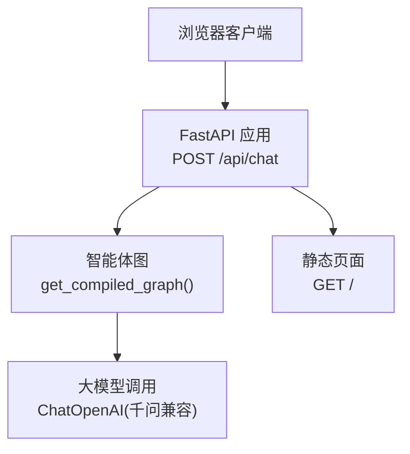
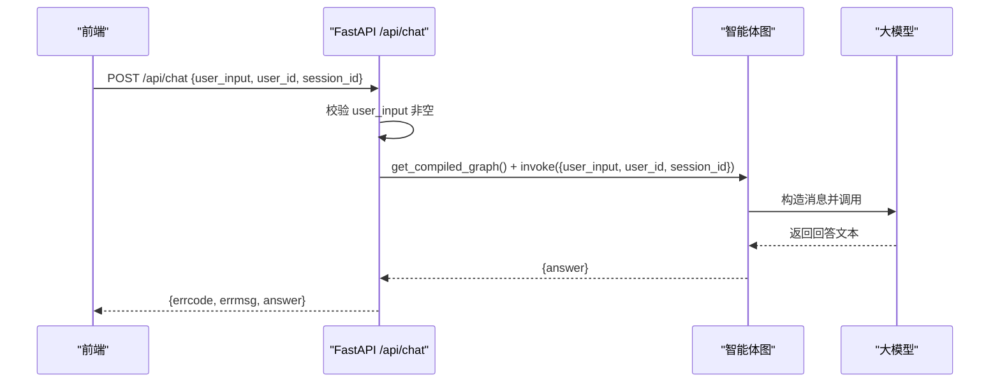
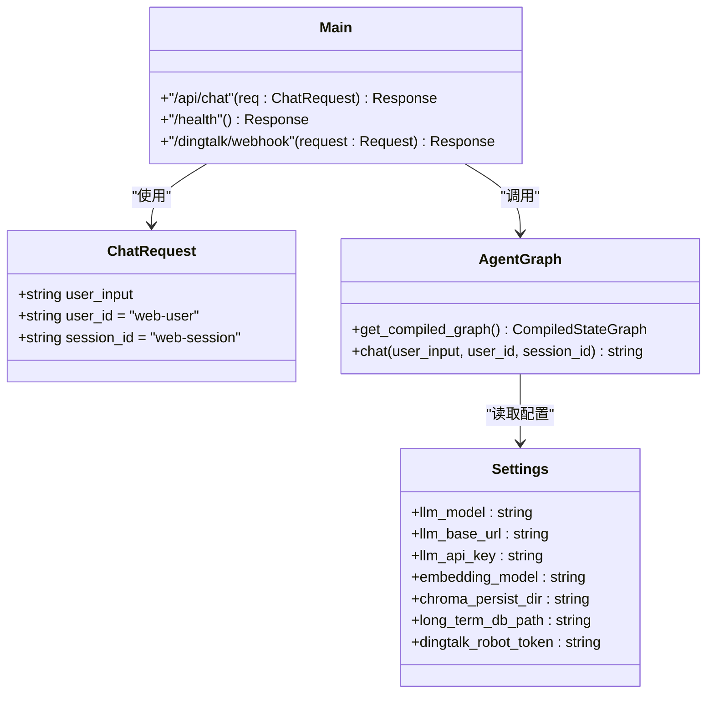

# Web聊天接口

<cite>
**本文引用的文件**   
- [main.py](file://main.py)
- [static/index.html](file://static/index.html)
- [agent/graph.py](file://agent/graph.py)
- [config/settings.py](file://config/settings.py)
</cite>

## 目录
1. [简介](#简介)
2. [项目结构](#项目结构)
3. [核心组件](#核心组件)
4. [架构总览](#架构总览)
5. [详细组件分析](#详细组件分析)
6. [依赖关系分析](#依赖关系分析)
7. [性能考量](#性能考量)
8. [故障排查指南](#故障排查指南)
9. [结论](#结论)
10. [附录](#附录)

## 简介
本文件为 Web 聊天接口的 API 文档，重点说明 POST /api/chat 端点的功能、请求参数与响应格式。该接口面向浏览器前端，无需鉴权，直接调用智能体生成回答。同时提供完整的请求/响应示例、错误处理说明，以及前端 JavaScript 集成示例与错误处理代码片段路径。文末对比了与钉钉回调接口的差异与使用场景。

## 项目结构
本项目基于 FastAPI 提供 Web 服务，包含：
- Web 聊天入口与路由定义（main.py）
- 前端静态页面与交互逻辑（static/index.html）
- 智能体工作流构建与执行（agent/graph.py）
- 全局配置管理（config/settings.py）

图表来源
- [main.py:58-91](file://main.py#L58-L91)
- [agent/graph.py:76-106](file://agent/graph.py#L76-L106)

章节来源
- [main.py:1-120](file://main.py#L1-L120)
- [static/index.html:285-414](file://static/index.html#L285-L414)
- [agent/graph.py:1-106](file://agent/graph.py#L1-L106)
- [config/settings.py:1-93](file://config/settings.py#L1-L93)

## 核心组件
- ChatRequest 模型：定义 Web 聊天请求体字段及默认值
- /api/chat 接口：接收请求、校验输入、调用智能体并返回结果
- 智能体图：按会话 thread_id 维护短期上下文，结合长期记忆与 RAG 生成回答
- 前端页面：通过 fetch 调用 /api/chat，展示对话与错误信息

章节来源
- [main.py:42-91](file://main.py#L42-L91)
- [agent/graph.py:76-106](file://agent/graph.py#L76-L106)
- [static/index.html:370-414](file://static/index.html#L370-L414)

## 架构总览
Web 聊天接口的工作流程如下：
- 前端发送 POST 请求到 /api/chat，携带 user_input、user_id、session_id
- 后端校验 user_input 非空
- 获取编译后的智能体图，以 session_id 作为 thread_id 维护短期上下文
- 调用智能体图生成 answer
- 返回统一 JSON 响应（errcode、errmsg、answer）

图表来源
- [main.py:58-91](file://main.py#L58-L91)
- [agent/graph.py:76-106](file://agent/graph.py#L76-L106)

## 详细组件分析

### POST /api/chat 接口规范
- 方法：POST
- 路径：/api/chat
- 鉴权：无需鉴权
- 内容类型：application/json

请求体模型 ChatRequest
- user_input（必填，字符串）：用户输入的文本
- user_id（可选，字符串，默认 web-user）：用户标识
- session_id（可选，字符串，默认 web-session）：会话标识（用于短期上下文隔离）

成功响应
- 状态码：200
- 响应体字段：
  - errcode：整数，成功时为 0
  - errmsg：字符串，成功时为 "ok"
  - answer：字符串，智能体的回答

失败响应
- 空输入：返回 errcode=1，errmsg="empty input"
- 内部异常：返回状态码 500，errcode=500，errmsg 为异常信息

请求示例
- 请求体：{ "user_input": "你好，请介绍一下产品功能", "user_id": "web-user", "session_id": "web-session" }
- 成功响应：{ "errcode": 0, "errmsg": "ok", "answer": "..." }
- 空输入响应：{ "errcode": 1, "errmsg": "empty input" }
- 异常响应：{ "errcode": 500, "errmsg": "具体错误信息" }

章节来源
- [main.py:42-91](file://main.py#L42-L91)

### 前端 JavaScript 集成示例与错误处理
- 使用 fetch 发起 POST 请求到 /api/chat
- 设置 Content-Type: application/json
- 请求体包含 user_input、user_id、session_id
- 根据 errcode 判断成功或错误，并在 UI 中显示 answer 或 errmsg
- 网络异常时捕获错误并提示连接失败

参考实现位置
- 前端发送请求与错误处理逻辑位于 static/index.html 的脚本部分

章节来源
- [static/index.html:370-414](file://static/index.html#L370-L414)

### 与钉钉回调接口的区别与使用场景
- /api/chat（Web 聊天）
  - 用途：面向浏览器前端的纯 Web 聊天
  - 鉴权：无需鉴权
  - 返回：直接返回智能体回答
  - 适用场景：网页嵌入聊天窗口、H5 页面等

- /dingtalk/webhook（钉钉回调）
  - 用途：钉钉机器人 Outgoing Webhook 回调
  - 鉴权：支持签名校验（可配置 secret）
  - 返回：调用智能体后通过钉钉客户端回复消息（优先 webhook，回退工作通知）
  - 适用场景：企业微信/钉钉群内机器人自动回复

章节来源
- [main.py:58-91](file://main.py#L58-L91)
- [main.py:106-176](file://main.py#L106-L176)

## 依赖关系分析
- main.py 中的 /api/chat 依赖 agent/graph.py 的 get_compiled_graph() 和 graph.invoke()
- agent/graph.py 构建 LangGraph StateGraph，节点包括 emotion、route、load_memory、retrieve、generate、memory_update
- config/settings.py 提供 LLM、Embedding、向量库、记忆、钉钉等配置项

图表来源
- [main.py:42-91](file://main.py#L42-L91)
- [agent/graph.py:76-106](file://agent/graph.py#L76-L106)
- [config/settings.py:1-93](file://config/settings.py#L1-L93)

章节来源
- [main.py:1-236](file://main.py#L1-L236)
- [agent/graph.py:1-106](file://agent/graph.py#L1-L106)
- [config/settings.py:1-93](file://config/settings.py#L1-L93)

## 性能考量
- 接口使用普通 def 而非 async def，因为 graph.invoke() 是同步阻塞调用；FastAPI 会自动将其放入线程池执行，避免阻塞事件循环
- 智能体图在模块级单例缓存，避免重复构建
- 短期上下文通过 thread_id（session_id）隔离，减少跨会话干扰
- 建议在高并发场景下关注线程池大小与 LLM 调用延迟

章节来源
- [main.py:58-91](file://main.py#L58-L91)
- [agent/graph.py:72-81](file://agent/graph.py#L72-L81)

## 故障排查指南
- 空输入错误：检查前端是否传递了非空的 user_input
- 内部异常：查看服务端日志，确认智能体图构建与大模型调用是否正常
- 网络连接问题：确保前端能访问 /api/chat，且后端服务已启动
- 健康检查：通过 GET /health 验证服务状态与 checkpointer 类型

章节来源
- [main.py:58-91](file://main.py#L58-L91)
- [main.py:94-103](file://main.py#L94-L103)

## 结论
POST /api/chat 提供了简洁、无鉴权的 Web 聊天能力，适合前端快速集成。通过统一的请求/响应格式与清晰的错误处理，便于前端稳定展示智能体回答。与钉钉回调接口相比，Web 聊天更适用于网页场景，而钉钉回调则面向企业即时通讯平台的消息自动化回复。

## 附录
- 前端完整交互逻辑与错误处理请参考 static/index.html 的脚本部分
- 智能体工作流与状态流转请参考 agent/graph.py 与相关节点实现
- 全局配置项请参考 config/settings.py

章节来源
- [static/index.html:285-414](file://static/index.html#L285-L414)
- [agent/graph.py:1-106](file://agent/graph.py#L1-L106)
- [config/settings.py:1-93](file://config/settings.py#L1-L93)