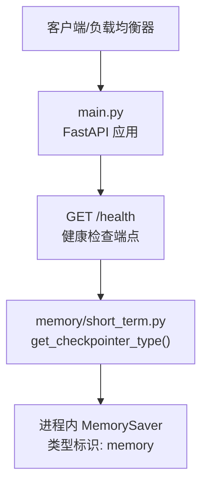
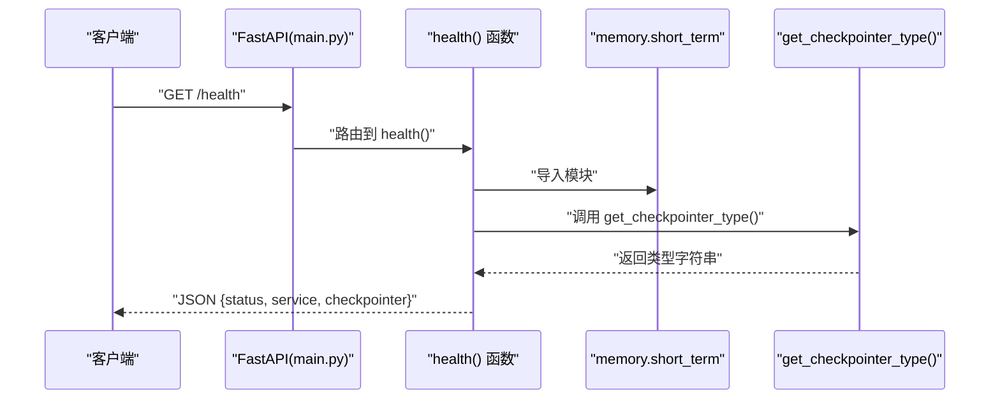
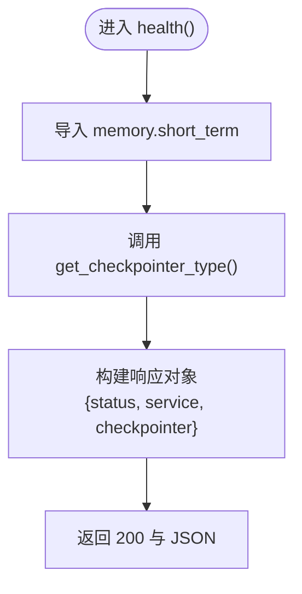
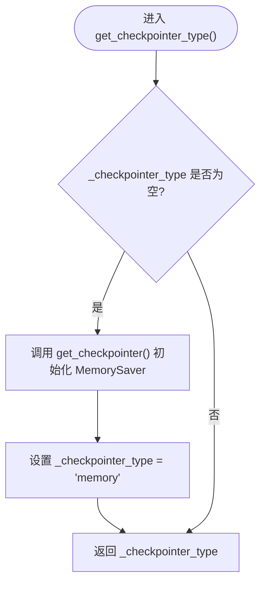

# 健康检查接口

<cite>
**本文引用的文件**   
- [main.py](file://main.py)
- [short_term.py](file://memory/short_term.py)
- [long_term.py](file://memory/long_term.py)
- [settings.py](file://config/settings.py)
</cite>

## 目录
1. [简介](#简介)
2. [项目结构](#项目结构)
3. [核心组件](#核心组件)
4. [架构总览](#架构总览)
5. [详细组件分析](#详细组件分析)
6. [依赖关系分析](#依赖关系分析)
7. [性能考虑](#性能考虑)
8. [故障排查指南](#故障排查指南)
9. [结论](#结论)
10. [附录：API 定义与示例](#附录api-定义与示例)

## 简介
本章节为健康检查接口的 API 文档，聚焦 GET /health 端点。该端点用于负载均衡器的健康检查与容器编排系统的存活探针，返回服务状态、服务名称以及当前使用的记忆存储（checkpointer）类型，便于运维监控与告警。

## 项目结构
健康检查功能由主应用入口统一暴露，并在内存短期记忆中动态获取 checkpointer 类型标识。关键文件如下：
- main.py：FastAPI 应用入口，定义 /health 端点
- memory/short_term.py：短期记忆模块，提供 get_checkpointer_type() 以返回当前 checkpointer 类型
- memory/long_term.py：长期记忆模块（SQLite），与健康检查无直接耦合，但体现系统记忆能力
- config/settings.py：全局配置管理，不直接影响 /health 响应内容

图表来源
- [main.py:94-103](file://main.py#L94-L103)
- [short_term.py:23-27](file://memory/short_term.py#L23-L27)

章节来源
- [main.py:94-103](file://main.py#L94-L103)
- [short_term.py:1-28](file://memory/short_term.py#L1-L28)

## 核心组件
- 健康检查端点：GET /health
  - 功能：返回服务运行状态、服务名与当前 checkpointer 类型
  - 用途：负载均衡健康检查、Kubernetes 存活探针等
- Checkpointer 类型获取：memory.short_term.get_checkpointer_type()
  - 行为：首次调用时初始化进程内 MemorySaver，并记录类型为 "memory"；后续直接返回该类型字符串

章节来源
- [main.py:94-103](file://main.py#L94-L103)
- [short_term.py:13-27](file://memory/short_term.py#L13-L27)

## 架构总览
健康检查请求的调用链如下：
- 客户端发起 HTTP GET /health
- FastAPI 路由到 health() 函数
- 函数从 memory.short_term 导入并调用 get_checkpointer_type()
- 返回包含 status、service、checkpointer 字段的 JSON

图表来源
- [main.py:94-103](file://main.py#L94-L103)
- [short_term.py:23-27](file://memory/short_term.py#L23-L27)

## 详细组件分析

### 健康检查端点 GET /health
- 方法：GET
- 路径：/health
- 鉴权：无需鉴权
- 请求体：无
- 响应体：JSON，包含以下字段
  - status：固定为 "ok"
  - service：固定为 "dingtalk-ai-agent"
  - checkpointer：当前使用的记忆存储类型（动态获取，默认 "memory"）
- 成功状态码：200
- 错误处理：端点内部未捕获异常，若依赖模块加载失败将返回 500

图表来源
- [main.py:94-103](file://main.py#L94-L103)
- [short_term.py:23-27](file://memory/short_term.py#L23-L27)

章节来源
- [main.py:94-103](file://main.py#L94-L103)

### Checkpointer 类型获取逻辑
- 模块：memory.short_term
- 函数：get_checkpointer_type()
- 行为说明
  - 若尚未初始化，则通过 get_checkpointer() 创建进程内 MemorySaver 实例，并将 _checkpointer_type 设置为 "memory"
  - 若已初始化，直接返回 _checkpointer_type
  - 兜底返回 "memory"，确保始终有可用类型标识

图表来源
- [short_term.py:23-27](file://memory/short_term.py#L23-L27)
- [short_term.py:13-20](file://memory/short_term.py#L13-L20)

章节来源
- [short_term.py:13-27](file://memory/short_term.py#L13-L27)

### 长期记忆（参考）
- 模块：memory.long_term
- 作用：基于 SQLite 的长期记忆持久化，与健康检查无直接耦合
- 特点：WAL 模式提升并发读性能，线程锁保证写串行

章节来源
- [long_term.py:1-244](file://memory/long_term.py#L1-L244)

## 依赖关系分析
- main.py 中的 /health 依赖 memory.short_term.get_checkpointer_type()
- memory.short_term 依赖 langgraph.checkpoint.memory.MemorySaver（进程内存储）
- 配置模块 config.settings.py 不直接影响 /health 响应内容

图表来源
- [main.py:94-103](file://main.py#L94-L103)
- [short_term.py:23-27](file://memory/short_term.py#L23-L27)

章节来源
- [main.py:94-103](file://main.py#L94-L103)
- [short_term.py:1-28](file://memory/short_term.py#L1-L28)

## 性能考虑
- 健康检查为轻量级接口，无外部 I/O 阻塞，响应时间极短
- checkpointer 类型获取在首次调用时初始化 MemorySaver，后续为 O(1) 读取
- 建议健康检查间隔不宜过短（如 5-10 秒），避免对启动阶段造成压力

## 故障排查指南
- 常见问题
  - 500 错误：可能由于模块导入失败或依赖库缺失
  - checkpointer 类型非预期：确认是否修改了 memory.short_term 的实现或引入了新的 checkpointer
- 排查步骤
  - 检查服务日志中是否有导入错误或异常堆栈
  - 验证 memory.short_term.get_checkpointer_type() 返回值是否符合预期
  - 确认进程内 MemorySaver 是否正常初始化
- 建议
  - 在健康检查中加入更详细的诊断信息（如依赖可用性、数据库连接状态）
  - 增加可观测性指标（如健康检查耗时、失败次数）

章节来源
- [main.py:94-103](file://main.py#L94-L103)
- [short_term.py:13-27](file://memory/short_term.py#L13-L27)

## 结论
GET /health 提供了简洁可靠的健康检查能力，适用于负载均衡与容器编排场景。其响应结构清晰，checkpointer 类型动态获取，便于运维监控与告警。建议结合日志与指标完善可观测性，以提升故障定位效率。

## 附录：API 定义与示例

### 接口定义
- 方法：GET
- 路径：/health
- 鉴权：无
- 请求参数：无
- 响应字段
  - status：string，固定为 "ok"
  - service：string，固定为 "dingtalk-ai-agent"
  - checkpointer：string，当前使用的记忆存储类型（默认 "memory"）

### 请求示例
- 使用 curl
  - curl http://localhost:8000/health

### 响应示例
- 成功响应（HTTP 200）
  - {
      "status": "ok",
      "service": "dingtalk-ai-agent",
      "checkpointer": "memory"
    }

### 监控与告警建议
- 健康检查频率：每 5-10 秒一次
- 告警阈值
  - 连续 3 次健康检查失败触发告警
  - 响应时间超过 1 秒触发慢查询告警
- 指标采集
  - 健康检查成功率
  - 健康检查平均耗时
  - checkpointer 类型变化事件

章节来源
- [main.py:94-103](file://main.py#L94-L103)
- [short_term.py:23-27](file://memory/short_term.py#L23-L27)