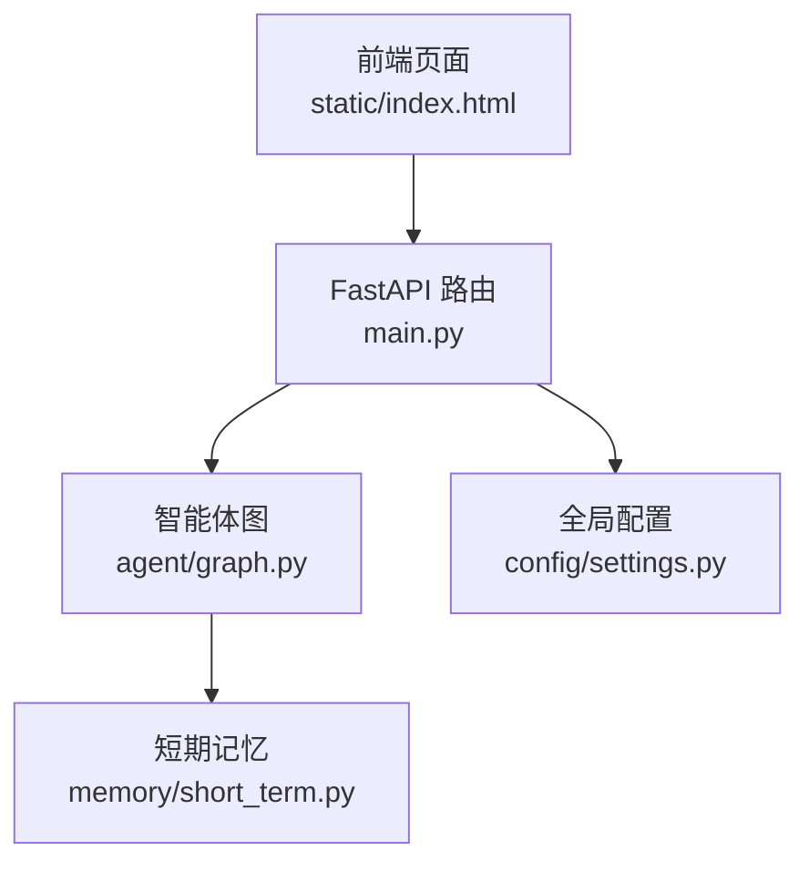
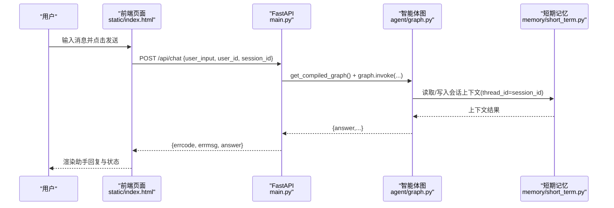
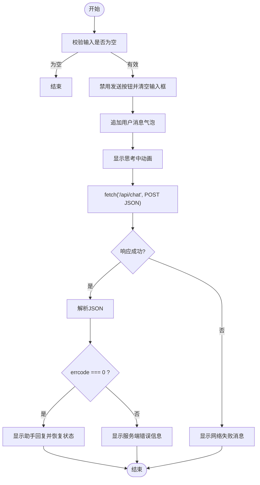
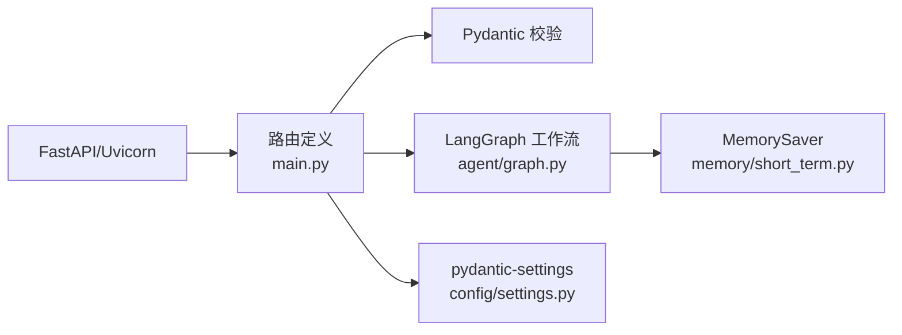

# 前端集成指南

<cite>
**本文引用的文件**   
- [main.py](file://main.py)
- [static/index.html](file://static/index.html)
- [config/settings.py](file://config/settings.py)
- [requirements.txt](file://requirements.txt)
- [agent/graph.py](file://agent/graph.py)
- [memory/short_term.py](file://memory/short_term.py)
</cite>

## 目录
1. [简介](#简介)
2. [项目结构](#项目结构)
3. [核心组件](#核心组件)
4. [架构总览](#架构总览)
5. [详细组件分析](#详细组件分析)
6. [依赖分析](#依赖分析)
7. [性能考虑](#性能考虑)
8. [故障排查指南](#故障排查指南)
9. [结论](#结论)
10. [附录](#附录)

## 简介
本指南面向前端开发者，说明如何在前端页面中集成该项目的 Web 聊天能力。根路径 / 返回一个完整的 HTML 聊天界面，内置响应式样式与基础交互逻辑；同时提供 POST /api/chat 接口用于发送消息并获取智能体回答。文档涵盖：
- 根路径返回的 HTML 结构与功能说明
- 使用 fetch API 调用 /api/chat 的完整示例（含错误处理、输入校验、响应展示）
- 跨域配置与 CORS 设置建议
- 响应式设计与移动端适配建议
- WebSocket 实时通信扩展方案与最佳实践
- 调试工具与浏览器开发者工具使用指南

## 项目结构
本项目基于 FastAPI 提供 Web 服务，静态页面位于 static/index.html，主入口在 main.py，配置集中在 config/settings.py，智能体工作流由 agent/graph.py 编排，短期记忆通过 memory/short_term.py 管理。

图表来源
- [main.py:49-91](file://main.py#L49-L91)
- [static/index.html:285-411](file://static/index.html#L285-L411)
- [agent/graph.py:76-106](file://agent/graph.py#L76-L106)
- [memory/short_term.py:13-28](file://memory/short_term.py#L13-L28)
- [config/settings.py:16-92](file://config/settings.py#L16-L92)

章节来源
- [main.py:1-10](file://main.py#L1-L10)
- [static/index.html:1-10](file://static/index.html#L1-L10)
- [config/settings.py:1-10](file://config/settings.py#L1-L10)
- [requirements.txt:1-10](file://requirements.txt#L1-L10)

## 核心组件
- 根路径返回的聊天页面：GET / 返回 static/index.html，包含聊天容器、消息列表、输入框、状态栏等，内联 CSS 与 JS 实现基础交互。
- Web 聊天接口：POST /api/chat，接收 JSON 请求体 user_input、user_id、session_id，返回 errcode、errmsg、answer。
- 健康检查：GET /health，返回服务状态与 checkpointer 类型。
- 配置管理：config/settings.py 集中管理 LLM、向量库、记忆、钉钉等参数，支持环境变量与 .env 文件。
- 智能体工作流：agent/graph.py 构建 LangGraph StateGraph，按 thread_id(session_id) 维护会话上下文。
- 短期记忆：memory/short_term.py 使用进程内 MemorySaver，无需外部服务。

章节来源
- [main.py:49-103](file://main.py#L49-L103)
- [static/index.html:255-283](file://static/index.html#L255-L283)
- [config/settings.py:16-92](file://config/settings.py#L16-L92)
- [agent/graph.py:25-82](file://agent/graph.py#L25-L82)
- [memory/short_term.py:13-28](file://memory/short_term.py#L13-L28)

## 架构总览
下图展示了从前端到后端再到智能体的调用链路，以及会话上下文与记忆的参与方式。

图表来源
- [static/index.html:359-402](file://static/index.html#L359-L402)
- [main.py:58-91](file://main.py#L58-L91)
- [agent/graph.py:76-106](file://agent/graph.py#L76-L106)
- [memory/short_term.py:13-28](file://memory/short_term.py#L13-L28)

## 详细组件分析

### 根路径返回的 HTML 聊天界面
- 结构要点
  - 头部：标题与“重置会话”按钮
  - 主体：消息列表区域，支持用户与助手两类消息气泡
  - 底部：多行文本输入框与发送按钮，状态栏显示连接状态
- 交互要点
  - Enter 发送，Shift+Enter 换行
  - 自动调整输入框高度
  - 发送时显示“思考中”动画，完成后替换为真实回复
  - 重置会话会生成新的 sessionId 并提示系统消息
- 响应式与移动端适配
  - 使用 viewport meta 与弹性布局，最大宽度限制与居中显示
  - 触摸友好的按钮尺寸与间距
  - 长文本自动换行与滚动

章节来源
- [static/index.html:255-283](file://static/index.html#L255-L283)
- [static/index.html:285-411](file://static/index.html#L285-L411)

### Web 聊天接口 /api/chat
- 请求体字段
  - user_input: 必填，用户输入文本
  - user_id: 可选，默认 web-user
  - session_id: 可选，默认 web-session，用于短期记忆隔离
- 响应体字段
  - errcode: 0 表示成功，非 0 表示异常
  - errmsg: 描述信息
  - answer: 智能体回答文本
- 错误处理
  - 空输入直接返回 errcode=1
  - 智能体调用异常返回 500 与错误详情
- 并发与阻塞
  - 使用同步 def，FastAPI 自动放入线程池执行，避免阻塞事件循环

章节来源
- [main.py:42-47](file://main.py#L42-L47)
- [main.py:58-91](file://main.py#L58-L91)

### 前端 JavaScript 客户端调用示例
- 使用 fetch API 发起 POST 请求到 /api/chat
- 请求头 Content-Type: application/json
- 请求体包含 user_input、user_id、session_id
- 错误处理：网络异常捕获、服务端错误码判断
- 输入验证：trim 去空白、防重复发送
- 响应显示：追加用户消息、显示“思考中”、替换为助手回复、更新状态栏

图表来源
- [static/index.html:359-402](file://static/index.html#L359-L402)

章节来源
- [static/index.html:359-402](file://static/index.html#L359-L402)

### 跨域配置与 CORS 设置
- 当前实现未显式启用 CORS 中间件，前后端同域部署时可正常工作
- 若需跨域访问（例如前端与后端不在同一域名或端口），需在 FastAPI 中添加 CORS 中间件，允许来源、方法与头
- 生产环境建议仅放行必要来源，避免开放所有域

章节来源
- [main.py:36-39](file://main.py#L36-L39)

### 响应式设计与移动端适配建议
- 使用 viewport 与弹性布局确保在不同屏幕尺寸下自适应
- 控制最大宽度与居中显示，提升桌面端阅读体验
- 增大触摸目标尺寸，优化移动端操作体验
- 长文本自动换行与滚动，避免溢出
- 键盘事件处理：Enter 发送、Shift+Enter 换行，符合常见聊天应用习惯

章节来源
- [static/index.html:1-10](file://static/index.html#L1-L10)
- [static/index.html:255-283](file://static/index.html#L255-L283)

### WebSocket 实时通信扩展方案与最佳实践
- 现状：当前项目未实现 WebSocket，前端通过 HTTP 轮询或一次性请求获取回答
- 扩展思路
  - 新增 /ws/chat 端点，建立 WebSocket 连接
  - 前端连接后发送初始消息，服务端流式返回 token 或分块内容
  - 前端逐步拼接输出，提升用户体验
- 最佳实践
  - 心跳保活与断线重连机制
  - 消息序列号与去重，防止乱序与重复
  - 错误码统一与友好提示
  - 限流与鉴权（如需）

[本节为概念性扩展建议，不直接分析具体代码文件]

### 调试工具与浏览器开发者工具使用指南
- Network 面板
  - 查看 /api/chat 的请求与响应，确认请求体与响应体结构
  - 检查状态码与错误信息
- Console 面板
  - 查看前端脚本抛出的异常与日志
- Sources 面板
  - 在 index.html 的 script 部分打断点，单步调试 sendMessage 流程
- Performance 面板
  - 观察页面渲染与交互耗时，定位卡顿点
- 健康检查
  - 访问 /health 确认服务状态与 checkpointer 类型

章节来源
- [main.py:94-103](file://main.py#L94-L103)
- [static/index.html:359-402](file://static/index.html#L359-L402)

## 依赖分析
- 框架与运行时
  - FastAPI、Uvicorn 提供 Web 服务与路由
  - Pydantic 用于请求体校验
- 智能体与工作流
  - LangChain/LangGraph 构建状态图与节点
  - MemorySaver 作为短期记忆后端
- 配置与环境
  - pydantic-settings 加载环境变量与 .env
- 其他
  - httpx 用于钉钉 API 调用（Webhook 场景）

图表来源
- [requirements.txt:18-26](file://requirements.txt#L18-L26)
- [main.py:26-28](file://main.py#L26-L28)
- [agent/graph.py:10-22](file://agent/graph.py#L10-L22)
- [memory/short_term.py:7-10](file://memory/short_term.py#L7-L10)
- [config/settings.py:10-11](file://config/settings.py#L10-L11)

章节来源
- [requirements.txt:1-31](file://requirements.txt#L1-31)
- [main.py:26-28](file://main.py#L26-L28)

## 性能考虑
- 前端
  - 避免频繁 DOM 操作，批量更新消息列表
  - 节流发送按钮，防止重复提交
  - 图片与资源懒加载（如未来扩展头像）
- 后端
  - 合理设置超时与重试策略（LLM 调用可能较慢）
  - 使用线程池执行阻塞调用，避免阻塞事件循环
  - 缓存热数据（如模型加载、向量检索索引）

[本节为通用性能建议，不直接分析具体代码文件]

## 故障排查指南
- 常见问题
  - 空输入导致 errcode=1：前端应校验输入后再发送
  - 网络请求失败：检查跨域、代理、服务器是否启动
  - 服务端异常：查看 /api/chat 响应中的 errmsg，定位后端日志
- 定位方法
  - 使用 Network 面板查看请求与响应
  - 使用 Console 面板查看前端异常
  - 访问 /health 确认服务状态
- 日志与调试
  - 后端使用 logging 记录错误，可通过控制台或日志文件查看
  - 前端可添加 console.log 辅助调试关键步骤

章节来源
- [main.py:68-91](file://main.py#L68-L91)
- [main.py:94-103](file://main.py#L94-L103)
- [static/index.html:359-402](file://static/index.html#L359-L402)

## 结论
本项目提供了开箱即用的 Web 聊天界面与接口，前端可直接通过 /api/chat 进行消息交互。通过合理的跨域配置、响应式设计、错误处理与调试手段，可实现稳定且友好的用户体验。未来可扩展 WebSocket 以支持流式输出与实时通信。

[本节为总结性内容，不直接分析具体代码文件]

## 附录
- 启动服务
  - 运行 uvicorn main:app --host 0.0.0.0 --port 8000 --reload
- 健康检查
  - 访问 http://localhost:8000/health
- 钉钉回调
  - 配置 webhook 地址为 http://localhost:8000/dingtalk/webhook

章节来源
- [main.py:1-10](file://main.py#L1-L10)
- [main.py:94-103](file://main.py#L94-L103)