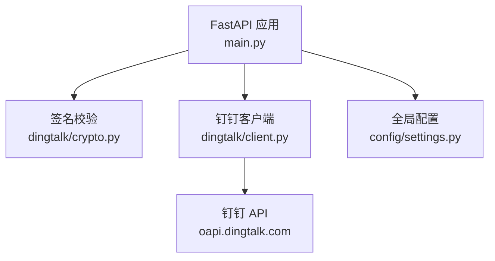
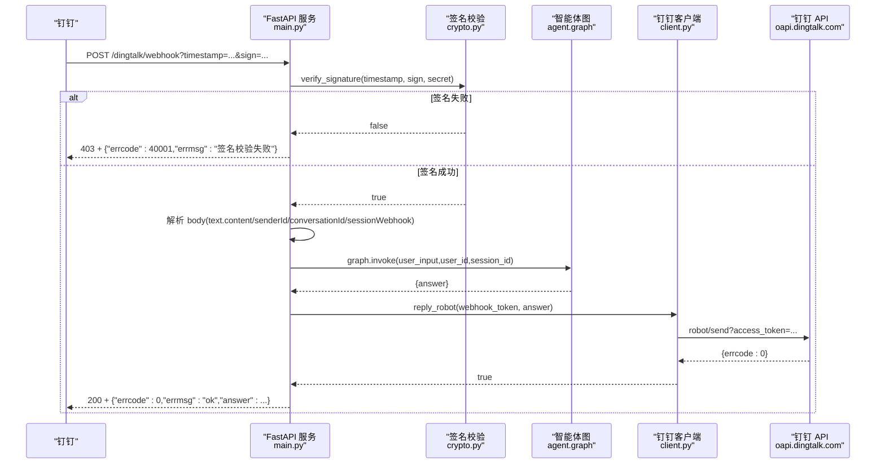
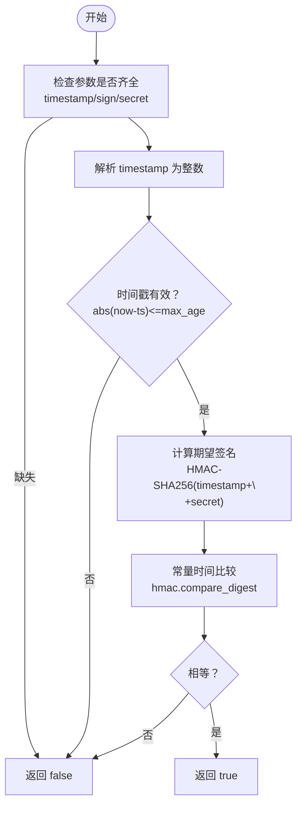
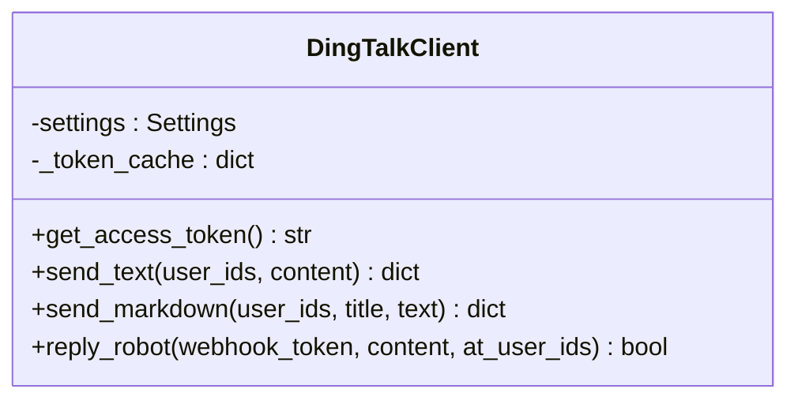
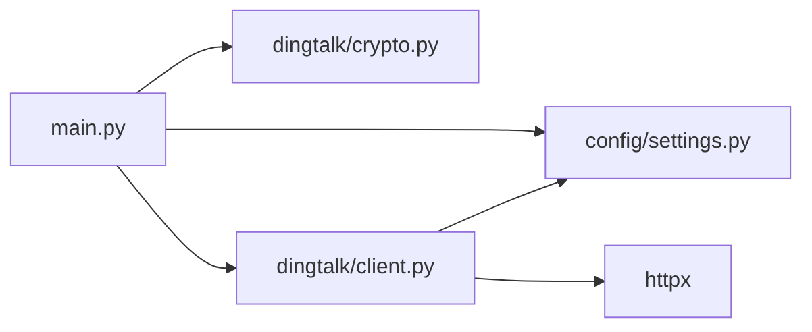

# 钉钉回调接口

<cite>
**本文引用的文件**   
- [main.py](file://main.py)
- [dingtalk/crypto.py](file://dingtalk/crypto.py)
- [dingtalk/client.py](file://dingtalk/client.py)
- [config/settings.py](file://config/settings.py)
- [README.md](file://README.md)
- [data/docs/产品说明.txt](file://data/docs/产品说明.txt)
</cite>

## 目录
1. [简介](#简介)
2. [项目结构](#项目结构)
3. [核心组件](#核心组件)
4. [架构总览](#架构总览)
5. [详细组件分析](#详细组件分析)
6. [依赖关系分析](#依赖关系分析)
7. [性能考量](#性能考量)
8. [故障排查指南](#故障排查指南)
9. [结论](#结论)
10. [附录：配置与使用指南](#附录配置与使用指南)

## 简介
本文件为“钉钉机器人回调接口”的完整 API 文档，聚焦 POST /dingtalk/webhook 端点。内容涵盖：
- 功能与安全机制（HMAC-SHA256 签名校验）
- 签名验证流程（timestamp、sign、secret）
- 钉钉消息体关键字段（text.content、senderId/senderStaffId、conversationId、sessionWebhook 等）
- 消息处理逻辑（签名失败返回 403、空消息处理、智能体调用异常处理）
- 请求/响应示例与错误码定义
- 钉钉开放平台配置与 Webhook URL 设置方法

## 项目结构
本项目基于 FastAPI 提供 Webhook 回调入口，并通过 dingtalk/crypto 模块完成签名校验，通过 dingtalk/client 模块实现消息回复；配置由 config/settings.py 统一管理。

**图表来源** 
- [main.py:106-176](file://main.py#L106-L176)
- [dingtalk/crypto.py:33-63](file://dingtalk/crypto.py#L33-L63)
- [dingtalk/client.py:16-139](file://dingtalk/client.py#L16-L139)
- [config/settings.py:16-56](file://config/settings.py#L16-L56)

**章节来源**
- [main.py:1-236](file://main.py#L1-L236)
- [config/settings.py:1-93](file://config/settings.py#L1-L93)

## 核心组件
- 回调入口：POST /dingtalk/webhook，负责接收钉钉 Outgoing Webhook 回调、签名校验、消息解析、智能体调用与回复。
- 签名校验：HMAC-SHA256，对 timestamp+"\n"+secret 进行签名并比较，支持时间戳有效期校验防重放。
- 钉钉客户端：封装 access_token 获取、工作通知发送、机器人 webhook 回复群消息。
- 配置管理：集中管理钉钉相关参数（AppKey/AppSecret、Robot Token/Secret、API Base URL）。

**章节来源**
- [main.py:106-176](file://main.py#L106-L176)
- [dingtalk/crypto.py:14-63](file://dingtalk/crypto.py#L14-L63)
- [dingtalk/client.py:16-139](file://dingtalk/client.py#L16-L139)
- [config/settings.py:49-56](file://config/settings.py#L49-L56)

## 架构总览
下图展示一次完整的钉钉回调处理流程：从请求进入、签名校验、消息解析、智能体生成回答到最终回复用户。

**图表来源** 
- [main.py:106-176](file://main.py#L106-L176)
- [dingtalk/crypto.py:33-63](file://dingtalk/crypto.py#L33-L63)
- [dingtalk/client.py:104-127](file://dingtalk/client.py#L104-L127)

## 详细组件分析

### 端点：POST /dingtalk/webhook
- 功能概述
  - 接收钉钉自定义机器人的 Outgoing Webhook 回调。
  - 可选启用 HMAC-SHA256 签名校验（当配置了 secret 时）。
  - 解析消息体，提取文本内容与会话上下文。
  - 调用智能体生成回答，并通过机器人 webhook 或工作通知回复。
- 安全机制
  - 若配置了 dingtalk_robot_secret，则必须通过 verify_signature 校验，否则返回 403。
  - 签名算法：HMAC-SHA256，对字符串 timestamp+"\n"+secret 计算签名，并进行 base64 编码。
  - 时间戳有效性校验：默认最大有效期 1 小时，防止重放攻击。
- 消息体字段
  - text.content：消息正文（优先读取），若为空则回退到 content 字段。
  - senderStaffId 或 senderId：发送者 ID（优先取 staffId，其次 Id）。
  - conversationId：会话 ID（用于区分不同会话）。
  - sessionWebhook：机器人令牌（优先使用请求中的值，否则回退到配置的 dingtalk_robot_token）。
- 处理逻辑
  - 签名失败：返回 HTTP 403，errcode 40001。
  - 空消息：返回 200，errcode 0，errmsg 提示 empty text。
  - 智能体异常：捕获异常并记录日志，构造友好错误信息作为 answer。
  - 回复策略：优先使用 sessionWebhook 通过机器人 webhook 回复群消息；若无 token，则回退到工作通知发送文本消息给 senderId。
- 请求示例
  - 请求头：Content-Type: application/json
  - Query 参数：timestamp=秒级时间戳, sign=base64(HMAC-SHA256(timestamp+"\n"+secret))
  - Body（JSON）：包含 text.content、senderId/senderStaffId、conversationId、sessionWebhook 等字段
- 响应示例
  - 成功：HTTP 200，{"errcode":0,"errmsg":"ok","answer":"..."}
  - 签名失败：HTTP 403，{"errcode":40001,"errmsg":"签名校验失败"}
  - 空消息：HTTP 200，{"errcode":0,"errmsg":"empty text"}

**章节来源**
- [main.py:106-176](file://main.py#L106-L176)
- [dingtalk/crypto.py:33-63](file://dingtalk/crypto.py#L33-L63)
- [dingtalk/client.py:104-127](file://dingtalk/client.py#L104-L127)
- [config/settings.py:49-56](file://config/settings.py#L49-L56)

### 签名校验模块：dingtalk/crypto.py
- 关键函数
  - sign(secret, timestamp)：生成签名字符串（base64 编码）。
  - verify_signature(timestamp, sign_value, secret, max_age_seconds=3600)：校验签名合法性与时间戳有效期。
- 算法细节
  - 待签名字符串：timestamp+"\n"+secret
  - 摘要算法：HMAC-SHA256
  - 输出：base64 编码的签名
  - 防重放：时间戳差值不超过 max_age_seconds（默认 1 小时）
  - 时序安全：使用 hmac.compare_digest 避免时序攻击
- 使用方式
  - 在回调入口中，当 settings.dingtalk_robot_secret 非空时调用 verify_signature 进行校验。

**图表来源** 
- [dingtalk/crypto.py:14-63](file://dingtalk/crypto.py#L14-L63)

**章节来源**
- [dingtalk/crypto.py:14-63](file://dingtalk/crypto.py#L14-L63)

### 钉钉客户端：dingtalk/client.py
- 能力概览
  - 获取企业 access_token（带本地缓存，过期前 60 秒刷新）。
  - 发送工作通知文本/Markdown 消息。
  - 通过机器人 webhook 回复群消息（支持 at 用户）。
- 关键方法
  - get_access_token()：从 oapi.dingtalk.com/gettoken 获取 token，缓存 expires_in。
  - send_text(user_ids, content)：调用 corpconversation/asyncsend_v2 发送文本。
  - send_markdown(user_ids, title, text)：发送 Markdown 消息。
  - reply_robot(webhook_token, content, at_user_ids=None)：通过 robot/send?access_token=webhook_token 回复群消息。
- 错误处理
  - 网络异常或 API 错误均记录日志并返回错误对象或布尔值。

**图表来源** 
- [dingtalk/client.py:16-139](file://dingtalk/client.py#L16-L139)

**章节来源**
- [dingtalk/client.py:16-139](file://dingtalk/client.py#L16-L139)

### 配置管理：config/settings.py
- 钉钉相关配置项
  - dingtalk_app_key：企业应用 AppKey
  - dingtalk_app_secret：企业应用 AppSecret
  - dingtalk_robot_token：机器人令牌（用于回复群消息）
  - dingtalk_robot_secret：机器人加签密钥（用于签名校验）
  - dingtalk_robot_code：机器人 agent_id（工作通知发送时使用）
  - dingtalk_api_base：钉钉 API 基础地址（默认 https://oapi.dingtalk.com）
- 加载优先级
  - 环境变量 > .env 文件
  - 大小写不敏感，忽略多余字段

**章节来源**
- [config/settings.py:49-56](file://config/settings.py#L49-L56)

## 依赖关系分析
- main.py 依赖：
  - config/settings.py：读取钉钉配置（secret、token、API Base）
  - dingtalk/crypto.py：签名校验
  - dingtalk/client.py：消息回复
  - agent.graph：智能体图（生成回答）
- dingtalk/client.py 依赖：
  - config/settings.py：读取 API Base、AppKey/Secret、Robot Code
  - httpx：HTTP 客户端
- dingtalk/crypto.py 无外部业务依赖，仅标准库

**图表来源** 
- [main.py:106-176](file://main.py#L106-L176)
- [dingtalk/client.py:16-139](file://dingtalk/client.py#L16-L139)
- [config/settings.py:16-56](file://config/settings.py#L16-L56)

**章节来源**
- [main.py:106-176](file://main.py#L106-L176)
- [dingtalk/client.py:16-139](file://dingtalk/client.py#L16-L139)
- [config/settings.py:16-56](file://config/settings.py#L16-L56)

## 性能考量
- 签名校验开销极低（HMAC-SHA256 + base64），可忽略不计。
- access_token 本地缓存减少频繁请求，过期前 60 秒刷新，降低延迟与限流风险。
- 智能体调用为同步阻塞（def 而非 async def），FastAPI 自动放入线程池执行，避免阻塞事件循环。
- 建议在高并发场景下关注：
  - 网络超时与重试策略（当前 httpx 超时 10s）
  - 日志级别与采样（避免 I/O 瓶颈）
  - 会话隔离（thread_id=session_id）保证状态独立

[本节为通用性能讨论，无需特定文件引用]

## 故障排查指南
- 常见错误与定位
  - 403 签名校验失败：检查 timestamp、sign、secret 是否正确；确认时间戳差值未超过 1 小时。
  - 空消息：确保 body.text.content 或 body.content 非空。
  - 智能体调用异常：查看日志中的异常堆栈，确认模型与 RAG 配置正确。
  - 无法回复消息：检查 sessionWebhook 或 dingtalk_robot_token 是否配置；确认 access_token 获取成功。
- 调试建议
  - 启用 INFO 级别日志，观察回调入口与客户端调用过程。
  - 使用健康检查 GET /health 验证服务状态。
  - 本地 REPL 模式快速验证智能体链路。

**章节来源**
- [main.py:106-176](file://main.py#L106-L176)
- [dingtalk/client.py:25-56](file://dingtalk/client.py#L25-L56)
- [dingtalk/client.py:104-127](file://dingtalk/client.py#L104-L127)

## 结论
POST /dingtalk/webhook 提供了安全可靠的钉钉机器人回调能力，结合 HMAC-SHA256 签名校验与灵活的回复策略，能够稳定地将智能体回答返回给用户。通过合理的配置与监控，可在生产环境中获得良好的用户体验与系统稳定性。

[本节为总结性内容，无需特定文件引用]

## 附录：配置与使用指南

### 钉钉开放平台配置要点
- 创建自定义机器人（Outgoing Webhook）
  - 在钉钉开放平台创建机器人，启用 Outgoing Webhook。
  - 配置回调地址为服务的公网可达地址，例如：https://your-domain/dingtalk/webhook
  - 开启签名校验，记录 Secret 并填入环境变量 DINGTALK_ROBOT_SECRET
- 企业应用与工作通知（可选）
  - 如需通过工作通知主动发消息，需配置 AppKey/AppSecret 与 Robot Code
  - 服务端将自动获取 access_token 并调用 corpconversation/asyncsend_v2

### Webhook URL 设置方法
- 在钉钉机器人设置中填写回调地址：
  - 路径：/dingtalk/webhook
  - 协议：HTTPS（推荐）
  - 域名：需公网可达且证书有效
- 签名校验开关：
  - 开启后必须在请求中携带 timestamp 与 sign
  - 服务端根据 DINGTALK_ROBOT_SECRET 进行校验

### 环境变量与 .env 配置
- 必要变量
  - DINGTALK_APP_KEY、DINGTALK_APP_SECRET（工作通知）
  - DINGTALK_ROBOT_TOKEN（机器人令牌）
  - DINGTALK_ROBOT_SECRET（签名密钥）
  - DINGTALK_API_BASE（默认 https://oapi.dingtalk.com）
- 参考示例
  - 见 README.md 中的 .env 片段

**章节来源**
- [README.md:53-63](file://README.md#L53-L63)
- [config/settings.py:49-56](file://config/settings.py#L49-L56)
- [data/docs/产品说明.txt:37-39](file://data/docs/产品说明.txt#L37-L39)