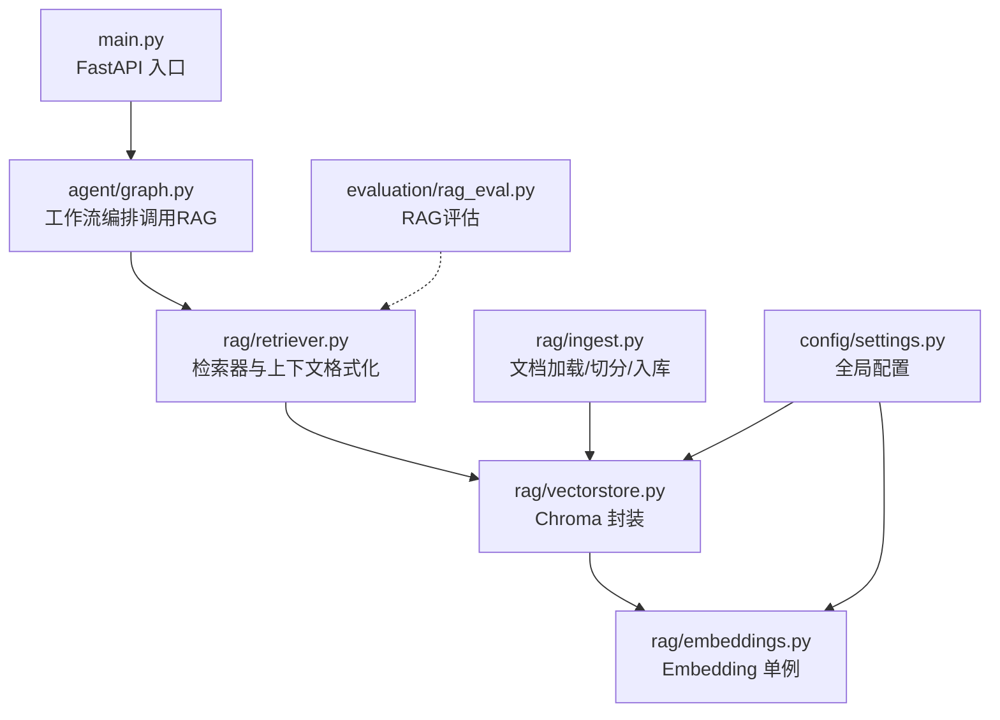
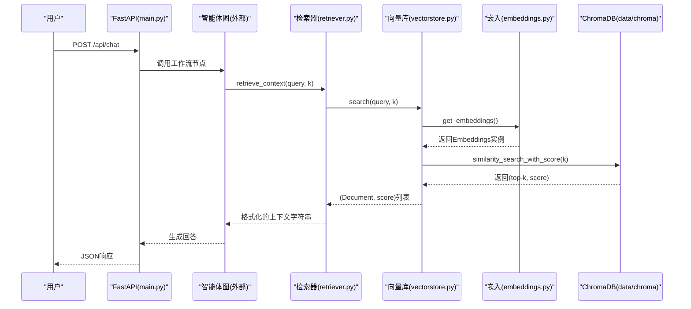
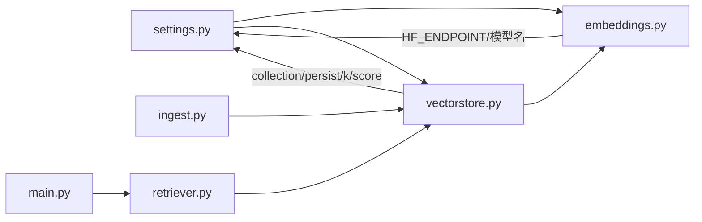
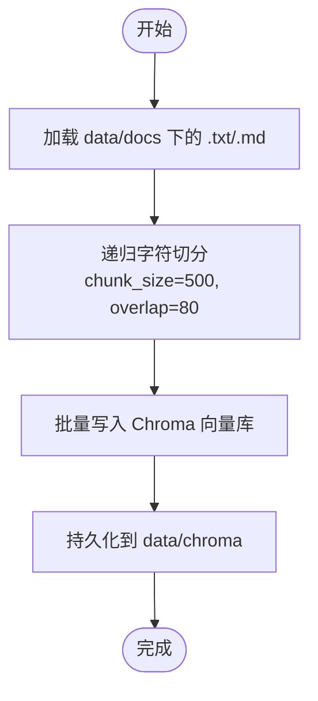

# RAG检索增强系统

<cite>
**本文引用的文件**   
- [main.py](file://main.py)
- [config/settings.py](file://config/settings.py)
- [rag/embeddings.py](file://rag/embeddings.py)
- [rag/vectorstore.py](file://rag/vectorstore.py)
- [rag/ingest.py](file://rag/ingest.py)
- [rag/retriever.py](file://rag/retriever.py)
- [requirements.txt](file://requirements.txt)
- [data/docs/产品说明.txt](file://data/docs/产品说明.txt)
- [evaluation/rag_eval.py](file://evaluation/rag_eval.py)
</cite>

## 目录
1. [简介](#简介)
2. [项目结构](#项目结构)
3. [核心组件](#核心组件)
4. [架构总览](#架构总览)
5. [详细组件分析](#详细组件分析)
6. [依赖关系分析](#依赖关系分析)
7. [性能与优化建议](#性能与优化建议)
8. [故障排除指南](#故障排除指南)
9. [结论](#结论)
10. [附录](#附录)

## 简介
本技术文档面向RAG（检索增强生成）子系统，系统性阐述从“文档入库”到“语义检索”再到“上下文组装”的完整流程。重点覆盖：
- 文档向量化与向量数据库（ChromaDB）的配置、索引管理与查询优化
- 嵌入模型（HuggingFace Sentence Transformers）的选择与配置、模型切换策略
- 文档入库处理：文本预处理、分块策略、批量向量化
- 检索效果优化：相似度阈值、检索数量控制、结果重排序思路
- 故障排除与性能调优建议

## 项目结构
RAG相关代码集中在 rag/ 目录，并通过 config/settings.py 统一配置；入口 main.py 提供Web服务与调试模式；评估模块 evaluation/ 提供RAG质量评测能力。

图表来源
- [main.py:1-236](file://main.py#L1-L236)
- [rag/retriever.py:1-38](file://rag/retriever.py#L1-L38)
- [rag/vectorstore.py:1-75](file://rag/vectorstore.py#L1-L75)
- [rag/embeddings.py:1-41](file://rag/embeddings.py#L1-L41)
- [rag/ingest.py:1-79](file://rag/ingest.py#L1-L79)
- [config/settings.py:1-93](file://config/settings.py#L1-L93)
- [evaluation/rag_eval.py:1-121](file://evaluation/rag_eval.py#L1-L121)

章节来源
- [main.py:1-236](file://main.py#L1-L236)
- [config/settings.py:1-93](file://config/settings.py#L1-L93)

## 核心组件
- 嵌入模型管理：基于 HuggingFace Embeddings，默认使用本地中文模型，支持镜像与离线缓存
- 向量库封装：ChromaDB 持久化集合，提供 add_documents、similarity_search_with_score、as_retriever
- 检索器：语义检索 + 上下文格式化，输出带来源与相关度的结构化字符串
- 文档入库：读取 .txt/.md，递归字符切分，批量入库并持久化
- 配置中心：pydantic-settings 统一管理 LLM、Embedding、Chroma、记忆等参数

章节来源
- [rag/embeddings.py:1-41](file://rag/embeddings.py#L1-L41)
- [rag/vectorstore.py:1-75](file://rag/vectorstore.py#L1-L75)
- [rag/retriever.py:1-38](file://rag/retriever.py#L1-L38)
- [rag/ingest.py:1-79](file://rag/ingest.py#L1-L79)
- [config/settings.py:1-93](file://config/settings.py#L1-L93)

## 架构总览
下图展示一次用户查询从接口到RAG检索与上下文组装的关键调用链。

图表来源
- [main.py:58-91](file://main.py#L58-L91)
- [rag/retriever.py:13-37](file://rag/retriever.py#L13-L37)
- [rag/vectorstore.py:48-68](file://rag/vectorstore.py#L48-L68)
- [rag/embeddings.py:21-40](file://rag/embeddings.py#L21-L40)

## 详细组件分析

### 嵌入模型管理（embeddings.py）
- 功能要点
  - 通过环境变量设置 HF_ENDPOINT 镜像加速下载，尊重用户已设值
  - 使用 lru_cache 返回 Embeddings 单例，避免重复初始化
  - 兼容 langchain_huggingface 与 langchain_community 两种导入路径
  - 默认模型名由 settings.embedding_model 提供，设备为 CPU，编码时归一化
- 复杂度与性能
  - 首次调用会下载模型权重到本地缓存，后续复用缓存，显著降低网络开销
  - 归一化嵌入可提升余弦相似度稳定性
- 错误处理
  - 导入失败回退到社区版实现，保证兼容性
- 扩展性
  - 可通过修改 settings.embedding_model 切换不同模型（如更大尺寸或英文模型）

章节来源
- [rag/embeddings.py:1-41](file://rag/embeddings.py#L1-L41)
- [config/settings.py:34-36](file://config/settings.py#L34-L36)

### 向量库封装（vectorstore.py）
- 功能要点
  - get_vectorstore：按 collection_name、embedding_function、persist_directory 初始化 Chroma
  - add_documents：批量添加文档，兼容旧版本显式 persist
  - search：语义检索返回 (Document, score)，并按 rag_score_filter 过滤低相关度结果
  - get_retriever：返回 LangChain retriever 对象，便于在链中使用
- 数据流
  - 查询 -> similarity_search_with_score -> 分数过滤 -> 返回结果
- 性能与优化
  - 使用持久化目录 data/chroma，避免重启后丢失索引
  - 过滤阈值 rag_score_filter 用于剔除噪声片段，提高下游生成质量
- 注意事项
  - Chroma 0.5.x 需要显式 persist，但新版本可能自动持久化，代码做了兼容

章节来源
- [rag/vectorstore.py:14-75](file://rag/vectorstore.py#L14-L75)
- [config/settings.py:37-42](file://config/settings.py#L37-L42)

### 检索器（retriever.py）
- 功能要点
  - retrieve：调用 vectorstore.search 获取 (Document, score) 列表
  - format_context：将结果拼接为带来源、标题、相关度的可读字符串
  - retrieve_context：一站式检索+格式化，供上层直接消费
- 输出格式
  - 每个片段包含来源文件名、可选标题、相关度（由距离转换而来），便于人类阅读与调试
- 适用场景
  - 作为智能体节点的输入上下文，提升答案忠实度与相关性

章节来源
- [rag/retriever.py:1-38](file://rag/retriever.py#L1-L38)

### 文档入库（ingest.py）
- 功能要点
  - load_files：遍历 data/docs/*.txt 与 *.md，读取文本并构造 Document（含 source/title 元数据）
  - split_documents：使用 RecursiveCharacterTextSplitter，chunk_size=500，chunk_overlap=80，多分隔符切分
  - ingest：支持 --rebuild 清空旧索引后重建；统计文件数与 chunk 数
  - CLI：python -m rag.ingest [--rebuild]
- 分块策略
  - 优先按段落/句子边界切分，兼顾语义完整性与检索粒度
- 批量向量化
  - add_documents 内部调用 Chroma 的批量写入，减少IO与模型调用次数

章节来源
- [rag/ingest.py:19-79](file://rag/ingest.py#L19-L79)
- [rag/vectorstore.py:28-45](file://rag/vectorstore.py#L28-L45)

### 配置管理（settings.py）
- 关键配置项
  - embedding_model：嵌入模型名称（默认中文模型）
  - chroma_persist_dir、chroma_collection：向量库持久化目录与集合名
  - rag_top_k、rag_score_filter：检索数量与分数阈值
  - docs_dir：知识文档目录（data/docs）
- 路径处理
  - 相对路径自动转换为绝对路径，并自动创建目录
- 优先级
  - 环境变量 > .env 文件 > 默认值

章节来源
- [config/settings.py:16-93](file://config/settings.py#L16-L93)

### RAG评估（rag_eval.py）
- 评估维度
  - 检索相关性、忠实度（groundedness）、帮助度、答案相关性
- 实现方式
  - 使用 OpenEvals 的 LLM-as-Judge 与预置提示模板
  - 支持批量评估，返回评分与推理过程
- 集成点
  - 可与 ingested 数据结合，自动化评测检索与生成质量

章节来源
- [evaluation/rag_eval.py:1-121](file://evaluation/rag_eval.py#L1-L121)

## 依赖关系分析

图表来源
- [config/settings.py:16-93](file://config/settings.py#L16-L93)
- [rag/embeddings.py:1-41](file://rag/embeddings.py#L1-L41)
- [rag/vectorstore.py:1-75](file://rag/vectorstore.py#L1-L75)
- [rag/ingest.py:1-79](file://rag/ingest.py#L1-L79)
- [rag/retriever.py:1-38](file://rag/retriever.py#L1-L38)
- [main.py:1-236](file://main.py#L1-L236)

章节来源
- [requirements.txt:1-31](file://requirements.txt#L1-L31)

## 性能与优化建议
- 嵌入模型选择与切换
  - 默认使用本地中文模型，适合离线与内网环境；如需更强语义能力，可在 settings.embedding_model 切换更大模型
  - 首次运行需下载模型权重，建议提前缓存或使用镜像端点
- 向量库优化
  - 合理设置 rag_top_k：过小影响召回，过大增加LLM上下文长度与成本
  - 调整 rag_score_filter：提高阈值可减少噪声，但可能漏掉相关片段
  - 使用持久化目录避免重复构建索引
- 分块策略
  - chunk_size=500、overlap=80 是通用起点；可根据领域文本长度与语义边界微调
  - 对长文档建议先做段落/标题分割，再按句切分，提升检索精度
- 检索与重排序
  - 当前采用相似度分数过滤；可引入重排序模型（cross-encoder）对 top-k 进行二次打分
  - 针对特定领域可训练或选择专用嵌入模型以提升召回率
- 并发与批处理
  - 批量 add_documents 减少模型调用与IO；在高吞吐场景下可考虑异步队列
- 资源利用
  - 嵌入模型默认 CPU 运行；若GPU可用，可调整 device 以加速

[本节为通用指导，不直接分析具体文件]

## 故障排除指南
- 无法访问 huggingface.co
  - 现象：模型下载失败或超时
  - 解决：确保设置了 HF_ENDPOINT 镜像地址；或在已有缓存时设置离线模式
  - 参考位置：[rag/embeddings.py:16-18](file://rag/embeddings.py#L16-L18)、[main.py:12-18](file://main.py#L12-L18)
- 向量库为空或检索结果为空
  - 现象：search 返回空或全部被过滤
  - 排查：确认 data/docs 下有 .txt/.md 文件；执行 python -m rag.ingest 完成入库；检查 rag_score_filter 是否过高
  - 参考位置：[rag/ingest.py:46-65](file://rag/ingest.py#L46-L65)、[rag/vectorstore.py:48-68](file://rag/vectorstore.py#L48-L68)
- 索引未持久化或重启后丢失
  - 现象：重启后集合为空
  - 解决：确认 persist_directory 存在且可写；Chroma 0.5.x 需显式 persist（代码已兼容）
  - 参考位置：[rag/vectorstore.py:37-45](file://rag/vectorstore.py#L37-L45)
- 检索速度慢
  - 现象：search 耗时较长
  - 优化：减小 rag_top_k；减少无关文档；升级硬件或启用GPU；必要时引入重排序以减少候选集
  - 参考位置：[rag/vectorstore.py:48-68](file://rag/vectorstore.py#L48-L68)
- 中文检索效果不佳
  - 现象：top-k 不相关
  - 优化：更换更合适的中文嵌入模型；调整分块策略；引入领域语料微调或选择专用模型
  - 参考位置：[rag/embeddings.py:21-40](file://rag/embeddings.py#L21-L40)、[rag/ingest.py:36-43](file://rag/ingest.py#L36-L43)

章节来源
- [rag/embeddings.py:16-18](file://rag/embeddings.py#L16-L18)
- [main.py:12-18](file://main.py#L12-L18)
- [rag/ingest.py:46-65](file://rag/ingest.py#L46-L65)
- [rag/vectorstore.py:37-45](file://rag/vectorstore.py#L37-L45)
- [rag/vectorstore.py:48-68](file://rag/vectorstore.py#L48-L68)

## 结论
本RAG子系统以“本地嵌入 + ChromaDB 向量库”为核心，实现了从文档入库、语义检索到上下文组装的完整链路。通过统一的配置管理与清晰的模块划分，系统具备良好的可扩展性与可维护性。在生产环境中，建议结合业务数据特点持续优化分块策略、检索阈值与模型选择，并可引入重排序进一步提升检索质量。

[本节为总结性内容，不直接分析具体文件]

## 附录

### 快速上手步骤
- 准备文档：将 .txt/.md 放入 data/docs
- 构建索引：python -m rag.ingest [--rebuild]
- 启动服务：uvicorn main:app --host 0.0.0.0 --port 8000
- 测试接口：POST /api/chat，传入 user_input、user_id、session_id

章节来源
- [rag/ingest.py:68-79](file://rag/ingest.py#L68-L79)
- [main.py:212-236](file://main.py#L212-L236)

### 关键配置项速查
- embedding_model：嵌入模型名称（默认中文模型）
- chroma_persist_dir：向量库持久化目录
- chroma_collection：集合名
- rag_top_k：检索数量
- rag_score_filter：分数阈值（越小越相关）
- docs_dir：知识文档目录

章节来源
- [config/settings.py:34-42](file://config/settings.py#L34-L42)

### 检索流程图（算法视角）

图表来源
- [rag/ingest.py:19-65](file://rag/ingest.py#L19-L65)
- [rag/vectorstore.py:28-45](file://rag/vectorstore.py#L28-L45)