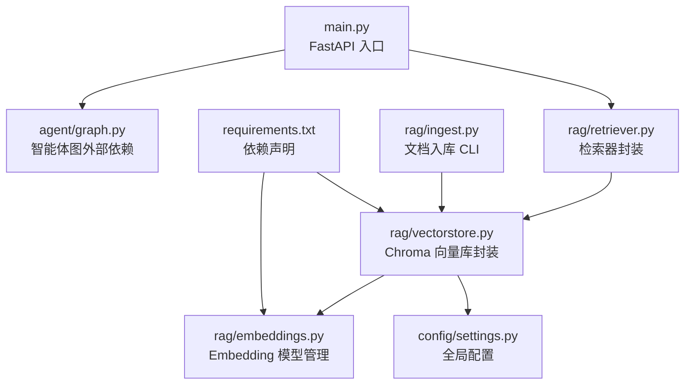
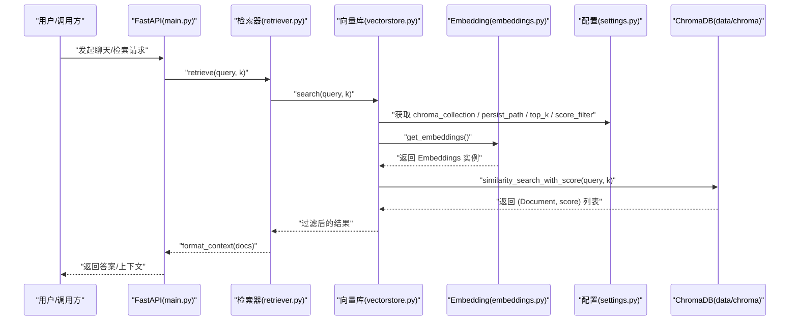
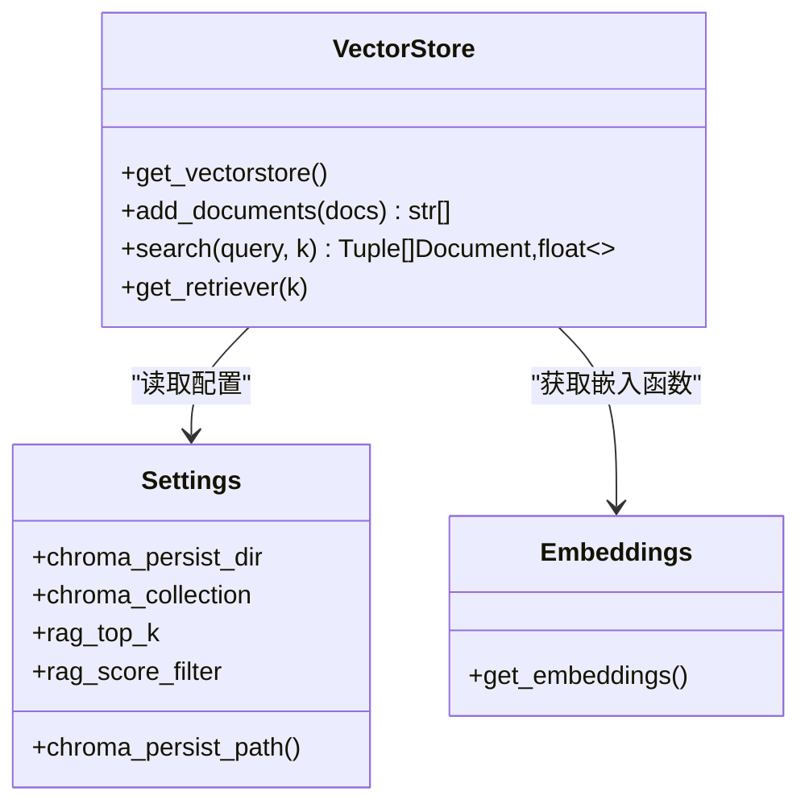
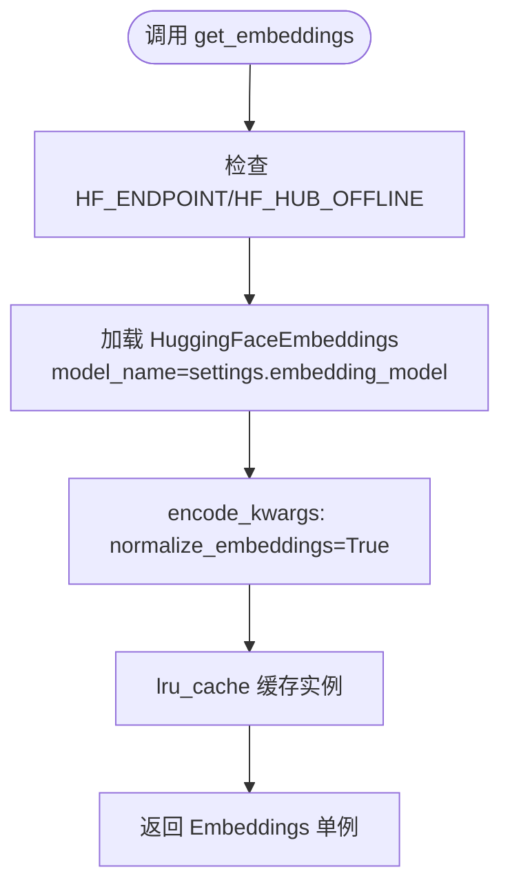
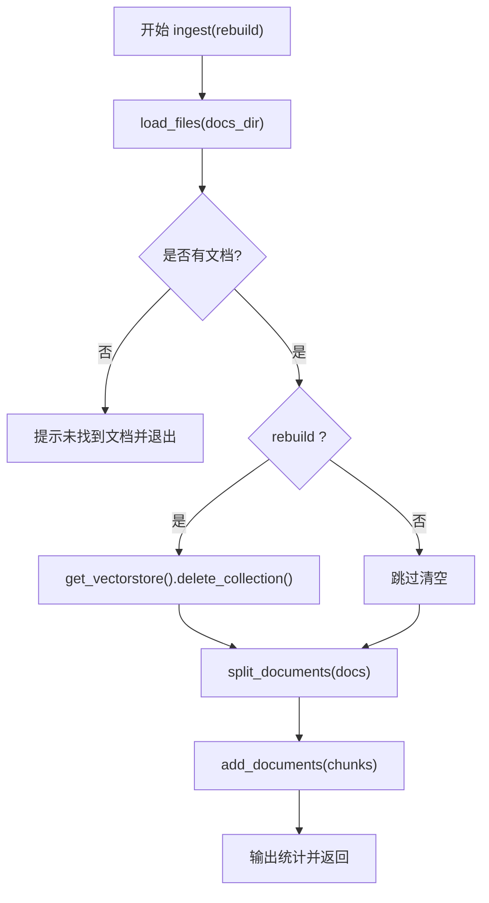
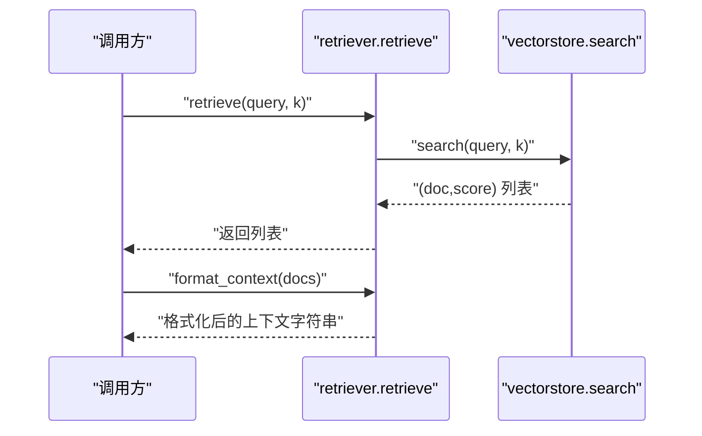
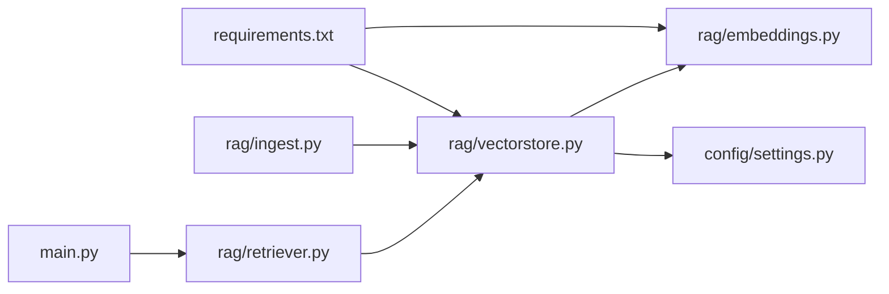

# 向量数据库管理

<cite>
**本文引用的文件**   
- [rag/vectorstore.py](file://rag/vectorstore.py)
- [rag/embeddings.py](file://rag/embeddings.py)
- [rag/ingest.py](file://rag/ingest.py)
- [rag/retriever.py](file://rag/retriever.py)
- [config/settings.py](file://config/settings.py)
- [main.py](file://main.py)
- [requirements.txt](file://requirements.txt)
</cite>

## 目录
1. [简介](#简介)
2. [项目结构](#项目结构)
3. [核心组件](#核心组件)
4. [架构总览](#架构总览)
5. [详细组件分析](#详细组件分析)
6. [依赖关系分析](#依赖关系分析)
7. [性能考量与调优](#性能考量与调优)
8. [故障排查指南](#故障排查指南)
9. [结论](#结论)
10. [附录](#附录)

## 简介
本技术文档聚焦于向量数据库管理模块，围绕 ChromaDB 的初始化配置、集合管理与索引策略展开，详细说明向量的存储结构、元数据设计与查询优化技术。文档还覆盖搜索函数的实现原理（相似度计算、结果排序与过滤）、向量数据的增删改查操作（含批量导入、更新与删除），并提供性能调优建议（索引参数、内存管理与查询缓存策略）以及与 LangChain 的集成方式与最佳实践。

## 项目结构
本项目采用按功能域划分的模块化组织方式，RAG 相关代码集中在 rag 目录下，配置集中管理在 config 目录，主入口与 Web 服务在 main.py，依赖版本定义在 requirements.txt。

图表来源
- [main.py:1-236](file://main.py#L1-L236)
- [rag/retriever.py:1-38](file://rag/retriever.py#L1-L38)
- [rag/vectorstore.py:1-75](file://rag/vectorstore.py#L1-L75)
- [rag/embeddings.py:1-41](file://rag/embeddings.py#L1-L41)
- [rag/ingest.py:1-79](file://rag/ingest.py#L1-L79)
- [config/settings.py:1-93](file://config/settings.py#L1-L93)
- [requirements.txt:1-31](file://requirements.txt#L1-L31)

章节来源
- [main.py:1-236](file://main.py#L1-L236)
- [rag/vectorstore.py:1-75](file://rag/vectorstore.py#L1-L75)
- [rag/embeddings.py:1-41](file://rag/embeddings.py#L1-L41)
- [rag/ingest.py:1-79](file://rag/ingest.py#L1-L79)
- [rag/retriever.py:1-38](file://rag/retriever.py#L1-L38)
- [config/settings.py:1-93](file://config/settings.py#L1-L93)
- [requirements.txt:1-31](file://requirements.txt#L1-L31)

## 核心组件
- 向量库封装：提供 ChromaDB 单例化、持久化、文档入库与语义检索能力。
- Embedding 管理：基于本地 HuggingFace 中文嵌入模型，支持镜像加速与离线缓存。
- 文档入库：从 data/docs 目录加载 .txt/.md 文件，切分为 chunk 后批量入库。
- 检索器：对查询进行语义检索并格式化上下文字符串，便于下游 LLM 使用。
- 配置管理：统一通过 pydantic-settings 读取环境变量与 .env，集中管理 ChromaDB、Embedding、RAG 等参数。

章节来源
- [rag/vectorstore.py:1-75](file://rag/vectorstore.py#L1-L75)
- [rag/embeddings.py:1-41](file://rag/embeddings.py#L1-L41)
- [rag/ingest.py:1-79](file://rag/ingest.py#L1-L79)
- [rag/retriever.py:1-38](file://rag/retriever.py#L1-L38)
- [config/settings.py:1-93](file://config/settings.py#L1-L93)

## 架构总览
整体流程如下：用户或系统触发检索/入库请求，经由 FastAPI 或 CLI 进入 RAG 模块；Embedding 模块将文本转换为向量；ChromaDB 负责向量与元数据的持久化存储与相似性检索；检索结果经格式化为上下文字符串供 LLM 消费。

图表来源
- [main.py:58-91](file://main.py#L58-L91)
- [rag/retriever.py:13-37](file://rag/retriever.py#L13-L37)
- [rag/vectorstore.py:48-74](file://rag/vectorstore.py#L48-L74)
- [rag/embeddings.py:21-41](file://rag/embeddings.py#L21-L41)
- [config/settings.py:37-42](file://config/settings.py#L37-L42)

## 详细组件分析

### ChromaDB 向量库封装（vectorstore.py）
- 初始化与单例：通过 get_vectorstore() 创建 Chroma 实例，使用 collection_name、embedding_function、persist_directory 完成初始化与持久化。
- 文档入库：add_documents() 接收 Document 列表，调用底层 add_documents，并尝试显式 persist 以兼容不同版本行为。
- 语义检索：search() 调用 similarity_search_with_score，结合 settings.rag_top_k 与 rag_score_filter 进行 Top-K 与阈值过滤，保证低相关度结果被剔除。
- LangChain 集成：get_retriever() 暴露 as_retriever，便于在 LangChain 链中直接使用。

图表来源
- [rag/vectorstore.py:14-74](file://rag/vectorstore.py#L14-L74)
- [config/settings.py:37-70](file://config/settings.py#L37-L70)
- [rag/embeddings.py:21-41](file://rag/embeddings.py#L21-L41)

章节来源
- [rag/vectorstore.py:14-74](file://rag/vectorstore.py#L14-L74)
- [config/settings.py:37-70](file://config/settings.py#L37-L70)

### Embedding 模型管理（embeddings.py）
- 模型选择：默认使用 BAAI/bge-small-zh-v1.5，适合中文检索，离线可用。
- 网络与缓存：优先设置 HF_ENDPOINT 为国内镜像，支持 HF_HUB_OFFLINE=1 启用离线模式。
- 单例与参数：通过 lru_cache 缓存 Embeddings 实例，避免重复加载；encode_kwargs 开启 normalize_embeddings 提升相似度稳定性。

图表来源
- [rag/embeddings.py:16-41](file://rag/embeddings.py#L16-L41)
- [config/settings.py:34-36](file://config/settings.py#L34-L36)

章节来源
- [rag/embeddings.py:16-41](file://rag/embeddings.py#L16-L41)
- [config/settings.py:34-36](file://config/settings.py#L34-L36)

### 文档入库与切分（ingest.py）
- 文件加载：递归扫描 data/docs 下的 .txt/.md 文件，编码容错（UTF-8 失败回退 GBK）。
- 文本切分：使用 RecursiveCharacterTextSplitter，chunk_size=500，chunk_overlap=80，按多分隔符切分。
- 入库流程：可选重建索引（delete_collection），然后 split -> add_documents -> persist。

图表来源
- [rag/ingest.py:19-65](file://rag/ingest.py#L19-L65)
- [rag/vectorstore.py:28-45](file://rag/vectorstore.py#L28-L45)

章节来源
- [rag/ingest.py:19-65](file://rag/ingest.py#L19-L65)
- [rag/vectorstore.py:28-45](file://rag/vectorstore.py#L28-L45)

### 检索器与上下文格式化（retriever.py）
- 检索接口：retrieve() 直接调用 vectorstore.search()，返回 (Document, score) 列表。
- 上下文格式化：format_context() 将结果拼接为带来源、标题与相关度的字符串，便于 LLM 理解。
- 一站式方法：retrieve_context() 组合检索与格式化，直接返回上下文字符串。

图表来源
- [rag/retriever.py:13-37](file://rag/retriever.py#L13-L37)
- [rag/vectorstore.py:48-68](file://rag/vectorstore.py#L48-L68)

章节来源
- [rag/retriever.py:13-37](file://rag/retriever.py#L13-L37)
- [rag/vectorstore.py:48-68](file://rag/vectorstore.py#L48-L68)

### 配置管理（settings.py）
- 配置项：涵盖 LLM、Embedding、ChromaDB、记忆、钉钉、LangSmith 等。
- 向量库相关：chroma_persist_dir、chroma_collection、rag_top_k、rag_score_filter。
- 路径处理：chroma_persist_path 自动转为绝对路径并创建目录。

章节来源
- [config/settings.py:16-70](file://config/settings.py#L16-L70)

## 依赖关系分析
- 向量库封装依赖配置与 Embedding 模块，Embedding 模块依赖 HuggingFace 与 langchain-community/huggingface。
- 检索器依赖向量库封装，CLI 入库依赖向量库与文本切分器。
- 主入口通过 FastAPI 暴露接口，间接调用检索器与向量库。

图表来源
- [main.py:58-91](file://main.py#L58-L91)
- [rag/retriever.py:1-38](file://rag/retriever.py#L1-L38)
- [rag/vectorstore.py:1-75](file://rag/vectorstore.py#L1-L75)
- [rag/embeddings.py:1-41](file://rag/embeddings.py#L1-L41)
- [rag/ingest.py:1-79](file://rag/ingest.py#L1-L79)
- [config/settings.py:1-93](file://config/settings.py#L1-L93)
- [requirements.txt:1-31](file://requirements.txt#L1-L31)

章节来源
- [main.py:58-91](file://main.py#L58-L91)
- [rag/retriever.py:1-38](file://rag/retriever.py#L1-L38)
- [rag/vectorstore.py:1-75](file://rag/vectorstore.py#L1-L75)
- [rag/embeddings.py:1-41](file://rag/embeddings.py#L1-L41)
- [rag/ingest.py:1-79](file://rag/ingest.py#L1-L79)
- [config/settings.py:1-93](file://config/settings.py#L1-L93)
- [requirements.txt:1-31](file://requirements.txt#L1-L31)

## 性能考量与调优
- 索引与相似度
  - 调整 rag_top_k 控制返回数量，平衡召回与延迟。
  - 调整 rag_score_filter 过滤低相关度结果，减少噪声。
  - 使用 normalize_embeddings 提升相似度稳定性。
- 内存与缓存
  - Embedding 单例通过 lru_cache 复用，避免重复加载模型权重。
  - ChromaDB 持久化到 data/chroma，避免每次启动重新构建索引。
- 查询优化
  - 优先使用 as_retriever(search_kwargs={"k": k}) 在 LangChain 链中复用检索器。
  - 合理设置 chunk_size 与 chunk_overlap，提高检索精度与上下文连贯性。
- 网络与下载
  - 设置 HF_ENDPOINT 为国内镜像，缩短模型下载时间。
  - 使用 HF_HUB_OFFLINE=1 完全离线运行，依赖本地缓存。

[本节为通用指导，不直接分析具体文件]

## 故障排查指南
- 无法访问 HuggingFace
  - 现象：首次加载 Embedding 时下载失败。
  - 解决：设置 HF_ENDPOINT 为 https://hf-mirror.com，或启用 HF_HUB_OFFLINE=1。
- 向量库持久化异常
  - 现象：add_documents 后数据未落盘。
  - 解决：确保 persist_directory 存在且可写；必要时显式调用 persist()。
- 检索结果为空或过低
  - 现象：search 返回空或分数过高。
  - 解决：降低 rag_score_filter，增大 rag_top_k；检查文档是否成功入库。
- 重建索引失败
  - 现象：delete_collection 抛出异常。
  - 解决：忽略异常继续入库；确认集合名称一致。

章节来源
- [rag/embeddings.py:16-41](file://rag/embeddings.py#L16-L41)
- [rag/vectorstore.py:28-45](file://rag/vectorstore.py#L28-L45)
- [rag/vectorstore.py:48-68](file://rag/vectorstore.py#L48-L68)
- [rag/ingest.py:54-61](file://rag/ingest.py#L54-L61)

## 结论
本模块以 ChromaDB 为核心，结合本地中文 Embedding 模型与统一的配置管理，提供了稳定高效的向量检索能力。通过合理的切分策略、相似度阈值与持久化机制，实现了良好的检索质量与性能表现。与 LangChain 的良好集成使得在智能体工作流中便捷地注入 RAG 上下文成为可能。

[本节为总结，不直接分析具体文件]

## 附录

### 向量数据存储结构与元数据设计
- 存储结构
  - 向量：由 Embedding 模型生成，维度与归一化由 encode_kwargs 控制。
  - 元数据：每个 Document 包含 page_content 与 metadata（source、title）。
- 元数据字段
  - source：文件名，用于溯源。
  - title：文件主名，便于展示。
- 索引策略
  - 使用 ChromaDB 内置索引；可通过 collection_name 隔离不同知识库。
  - 持久化目录 data/chroma 保存索引与数据。

章节来源
- [rag/ingest.py:27-33](file://rag/ingest.py#L27-L33)
- [rag/vectorstore.py:21-25](file://rag/vectorstore.py#L21-L25)
- [config/settings.py:37-42](file://config/settings.py#L37-L42)

### 搜索函数实现原理
- 相似度计算
  - 使用 similarity_search_with_score，返回 (Document, score)，score 越小越相关。
- 结果排序
  - 底层按距离升序排序，Top-K 由 k 或 settings.rag_top_k 决定。
- 过滤与分页
  - 通过 rag_score_filter 过滤低相关度结果；当前未实现分页，可通过上层逻辑限制返回数量。

章节来源
- [rag/vectorstore.py:48-68](file://rag/vectorstore.py#L48-L68)
- [rag/retriever.py:13-37](file://rag/retriever.py#L13-L37)

### 向量数据增删改查操作指南
- 批量导入
  - 使用 rag.ingest.main() 或 python -m rag.ingest --rebuild 执行。
  - 内部流程：load_files -> split_documents -> add_documents -> persist。
- 更新
  - 先 delete_collection() 清空旧索引，再重新入库。
- 删除
  - 目前未提供逐条删除接口；如需细粒度删除，可在上层扩展 Chroma 的 delete 方法。
- 查询
  - 使用 search(query, k) 或 retriever.retrieve(query, k)。

章节来源
- [rag/ingest.py:46-65](file://rag/ingest.py#L46-L65)
- [rag/vectorstore.py:28-45](file://rag/vectorstore.py#L28-L45)
- [rag/retriever.py:13-37](file://rag/retriever.py#L13-L37)

### 与 LangChain 的集成与最佳实践
- 集成方式
  - 通过 get_retriever(k) 返回 LangChain Retriever，便于在链中使用。
  - 在 as_retriever 中传入 search_kwargs={"k": k} 控制检索数量。
- 最佳实践
  - 使用统一的 embedding_function 保证向量空间一致性。
  - 合理设置 k 与 score_filter 平衡召回与噪声。
  - 利用 format_context 将检索结果结构化，提升 LLM 理解效果。

章节来源
- [rag/vectorstore.py:71-74](file://rag/vectorstore.py#L71-L74)
- [rag/retriever.py:18-31](file://rag/retriever.py#L18-L31)

### 性能调优建议
- 索引参数
  - 调整 chunk_size 与 chunk_overlap 提升检索精度。
  - 适当增大 rag_top_k 以提高召回率。
- 内存管理
  - 使用 Embedding 单例与持久化索引，减少重复加载。
- 查询缓存
  - 在上层对高频查询做缓存（如 Redis/Memcached），降低重复检索开销。
- 网络优化
  - 使用 HF 镜像与离线模式，避免下载瓶颈。

[本节为通用指导，不直接分析具体文件]