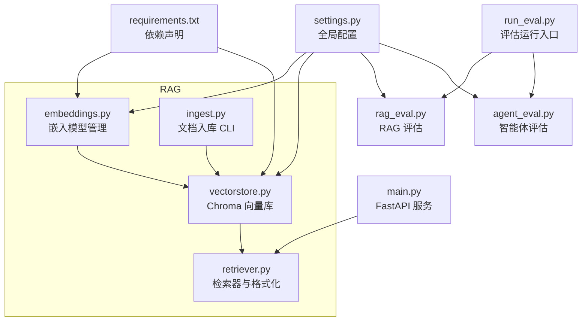
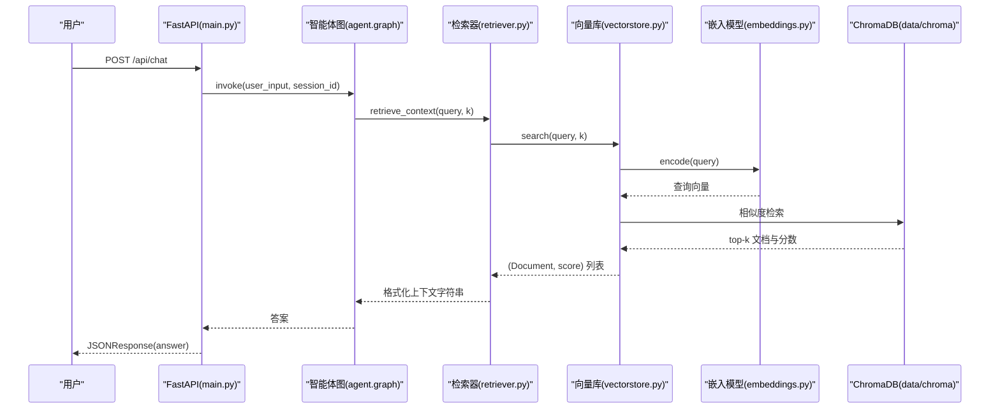
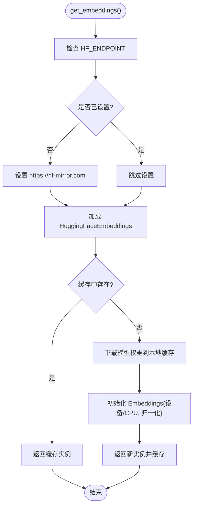
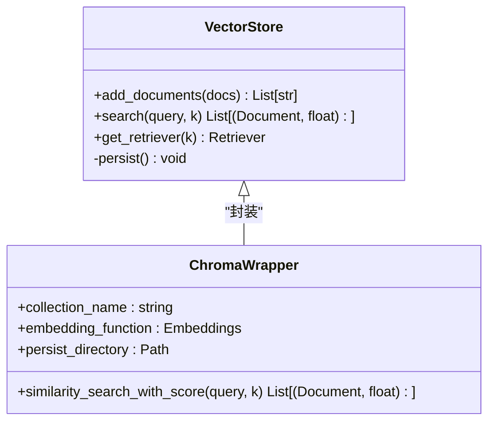
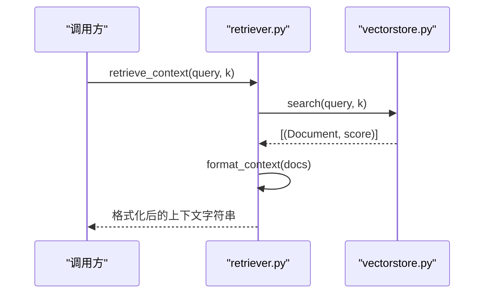
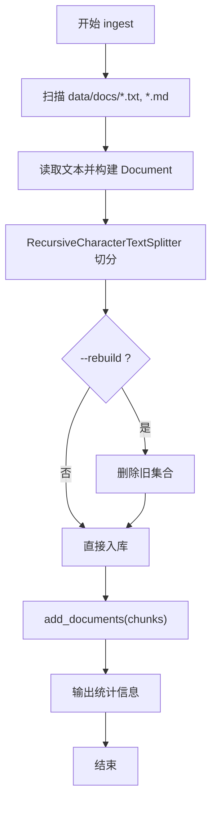
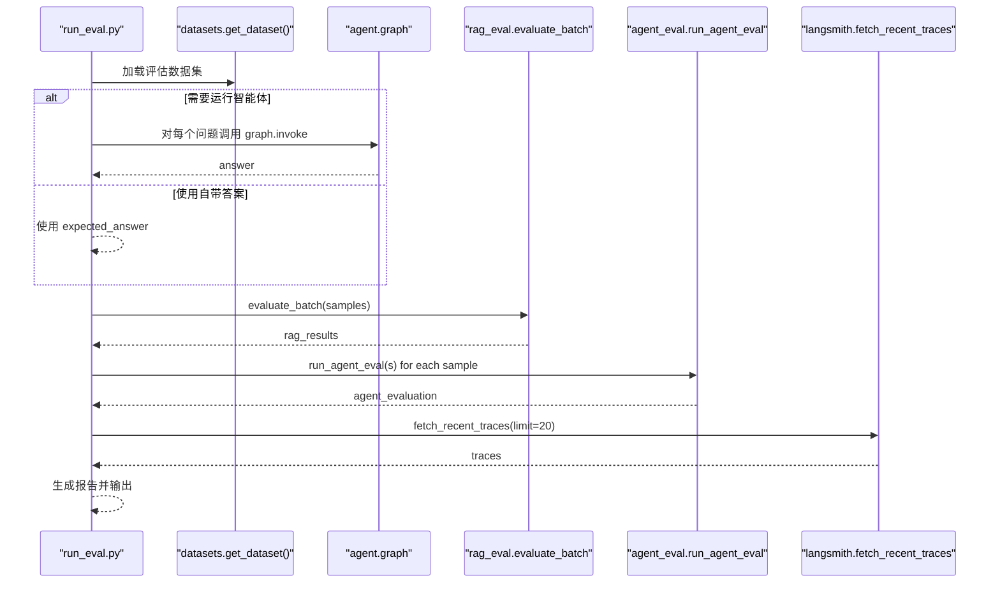
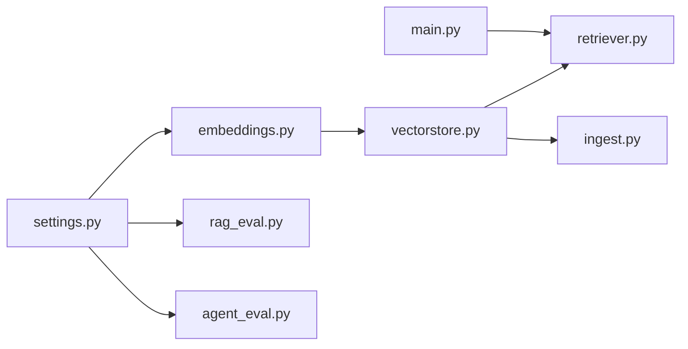

# 嵌入模型引擎

<cite>
**本文引用的文件**   
- [rag/embeddings.py](file://rag/embeddings.py)
- [rag/vectorstore.py](file://rag/vectorstore.py)
- [rag/retriever.py](file://rag/retriever.py)
- [rag/ingest.py](file://rag/ingest.py)
- [config/settings.py](file://config/settings.py)
- [evaluation/rag_eval.py](file://evaluation/rag_eval.py)
- [evaluation/agent_eval.py](file://evaluation/agent_eval.py)
- [evaluation/run_eval.py](file://evaluation/run_eval.py)
- [main.py](file://main.py)
- [requirements.txt](file://requirements.txt)
</cite>

## 目录
1. [简介](#简介)
2. [项目结构](#项目结构)
3. [核心组件](#核心组件)
4. [架构总览](#架构总览)
5. [详细组件分析](#详细组件分析)
6. [依赖关系分析](#依赖关系分析)
7. [性能与优化](#性能与优化)
8. [故障排查指南](#故障排查指南)
9. [结论](#结论)
10. [附录](#附录)

## 简介
本技术文档面向“嵌入模型引擎”，聚焦文本向量化的工作原理、HuggingFace Sentence Transformers 的配置与使用、不同嵌入模型的对比与选择策略（含中文支持、向量维度与性能特征）、模型加载机制（本地缓存、GPU加速、批量处理优化）、自定义模型接入（格式转换与接口适配）、模型评估方法与效果测试工具，以及向量质量对检索效果的影响和优化技巧。

本项目默认采用本地 HuggingFace 嵌入模型（BAAI/bge-small-zh-v1.5），通过 LangChain 的 HuggingFaceEmbeddings 进行封装，结合 ChromaDB 实现离线可用的中文语义检索。

## 项目结构
- RAG 子模块负责嵌入、向量化、入库与检索：
  - embeddings.py：嵌入模型管理与单例获取
  - vectorstore.py：Chroma 向量库封装与持久化
  - retriever.py：检索器与上下文格式化
  - ingest.py：文档加载、切分与入库 CLI
- 配置管理：
  - settings.py：全局配置（LLM、Embedding、向量库、记忆、钉钉、LangSmith）
- 评估体系：
  - rag_eval.py：RAG 质量评估（OpenEvals）
  - agent_eval.py：智能体评估（OpenEvals + LangSmith）
  - run_eval.py：评估运行入口（CLI）
- 服务入口：
  - main.py：FastAPI Web 服务与钉钉回调
- 依赖声明：
  - requirements.txt：核心框架、模型与向量库、Web 服务、配置与评估依赖

图表来源
- [rag/embeddings.py:1-41](file://rag/embeddings.py#L1-L41)
- [rag/vectorstore.py:1-75](file://rag/vectorstore.py#L1-L75)
- [rag/retriever.py:1-38](file://rag/retriever.py#L1-L38)
- [rag/ingest.py:1-79](file://rag/ingest.py#L1-L79)
- [config/settings.py:1-93](file://config/settings.py#L1-L93)
- [evaluation/rag_eval.py:1-121](file://evaluation/rag_eval.py#L1-L121)
- [evaluation/agent_eval.py:1-139](file://evaluation/agent_eval.py#L1-L139)
- [evaluation/run_eval.py:1-156](file://evaluation/run_eval.py#L1-L156)
- [main.py:1-236](file://main.py#L1-L236)
- [requirements.txt:1-31](file://requirements.txt#L1-L31)

章节来源
- [rag/embeddings.py:1-41](file://rag/embeddings.py#L1-L41)
- [rag/vectorstore.py:1-75](file://rag/vectorstore.py#L1-L75)
- [rag/retriever.py:1-38](file://rag/retriever.py#L1-L38)
- [rag/ingest.py:1-79](file://rag/ingest.py#L1-L79)
- [config/settings.py:1-93](file://config/settings.py#L1-L93)
- [evaluation/rag_eval.py:1-121](file://evaluation/rag_eval.py#L1-L121)
- [evaluation/agent_eval.py:1-139](file://evaluation/agent_eval.py#L1-L139)
- [evaluation/run_eval.py:1-156](file://evaluation/run_eval.py#L1-L156)
- [main.py:1-236](file://main.py#L1-L236)
- [requirements.txt:1-31](file://requirements.txt#L1-L31)

## 核心组件
- 嵌入模型管理（embeddings.py）
  - 使用 langchain_huggingface.HuggingFaceEmbeddings（或兼容的 langchain_community.embeddings.HuggingFaceEmbeddings）
  - 默认模型为 BAAI/bge-small-zh-v1.5，设备设置为 CPU，编码时启用 normalize_embeddings
  - 通过 lru_cache 返回单例，避免重复初始化
  - 自动设置 HF_ENDPOINT 镜像端点以加速下载；支持 HF_HUB_OFFLINE=1 离线模式
- 向量库封装（vectorstore.py）
  - 基于 ChromaDB，持久化到 data/chroma 目录
  - add_documents 支持显式 persist（兼容不同版本）
  - search 提供 similarity_search_with_score，并支持分数阈值过滤
  - get_retriever 返回 LangChain Retriever 对象
- 检索器（retriever.py）
  - retrieve 调用底层 search
  - format_context 将结果格式化为带来源、标题与相关度的字符串
  - retrieve_context 一站式检索+格式化
- 文档入库（ingest.py）
  - 读取 data/docs 下 .txt/.md 文件，构建 Document
  - 使用 RecursiveCharacterTextSplitter 按 chunk_size=500、chunk_overlap=80 切分
  - 支持 --rebuild 清空旧索引后重建
- 配置管理（settings.py）
  - 使用 pydantic-settings 从环境变量与 .env 加载
  - embedding_model、chroma_persist_dir、chroma_collection、rag_top_k、rag_score_filter 等关键参数
  - 提供 chroma_persist_path、long_term_db_file、docs_dir 属性确保路径存在

章节来源
- [rag/embeddings.py:1-41](file://rag/embeddings.py#L1-L41)
- [rag/vectorstore.py:1-75](file://rag/vectorstore.py#L1-L75)
- [rag/retriever.py:1-38](file://rag/retriever.py#L1-L38)
- [rag/ingest.py:1-79](file://rag/ingest.py#L1-L79)
- [config/settings.py:1-93](file://config/settings.py#L1-L93)

## 架构总览
下图展示嵌入模型在 RAG 流程中的位置与数据流：用户查询经检索器调用向量库相似度搜索，嵌入模型负责将文本转换为向量，ChromaDB 存储并检索，最终由 LLM 生成回答。

图表来源
- [main.py:58-91](file://main.py#L58-L91)
- [rag/retriever.py:13-38](file://rag/retriever.py#L13-L38)
- [rag/vectorstore.py:28-75](file://rag/vectorstore.py#L28-L75)
- [rag/embeddings.py:21-41](file://rag/embeddings.py#L21-L41)

## 详细组件分析

### 嵌入模型管理（HuggingFace Sentence Transformers）
- 模型名称与配置
  - 默认模型：BAAI/bge-small-zh-v1.5（中文优化，离线可用）
  - device 设置为 CPU（可改为 GPU 以提升吞吐）
  - encode_kwargs.normalize_embeddings=True（归一化提升相似度稳定性）
- 镜像与缓存
  - 自动设置 HF_ENDPOINT=https://hf-mirror.com（国内网络加速）
  - 首次调用会下载模型权重到本地缓存目录（~/.cache/huggingface）
  - 可通过 HF_HUB_OFFLINE=1 完全离线运行（仅使用缓存）
- 单例与兼容性
  - 使用 lru_cache 缓存 Embeddings 实例，避免重复初始化开销
  - 兼容 langchain_huggingface 与 langchain_community.embeddings

图表来源
- [rag/embeddings.py:16-41](file://rag/embeddings.py#L16-L41)

章节来源
- [rag/embeddings.py:1-41](file://rag/embeddings.py#L1-L41)
- [config/settings.py:34-36](file://config/settings.py#L34-L36)
- [requirements.txt:14-15](file://requirements.txt#L14-L15)

### 向量库与检索（ChromaDB）
- 初始化与持久化
  - collection_name 来自配置（默认 dingtalk_kb）
  - persist_directory 指向 data/chroma（绝对路径自动创建）
  - add_documents 后尝试 vs.persist()（兼容不同版本行为）
- 检索与过滤
  - similarity_search_with_score 返回 (Document, score)
  - 支持 rag_score_filter 阈值过滤低相关度结果
  - 若过滤后为空，回退原始结果保证可用性
- Retriever 集成
  - get_retriever(k) 返回 LangChain Retriever，便于链式调用

图表来源
- [rag/vectorstore.py:14-75](file://rag/vectorstore.py#L14-L75)

章节来源
- [rag/vectorstore.py:1-75](file://rag/vectorstore.py#L1-L75)
- [config/settings.py:37-42](file://config/settings.py#L37-L42)

### 检索器与上下文格式化
- retrieve(query, k)：调用底层 search
- format_context(docs)：将结果拼接为可读字符串，包含来源、标题与相关度（1/(1+score)）
- retrieve_context(query, k)：一站式检索+格式化

图表来源
- [rag/retriever.py:13-38](file://rag/retriever.py#L13-L38)
- [rag/vectorstore.py:48-68](file://rag/vectorstore.py#L48-L68)

章节来源
- [rag/retriever.py:1-38](file://rag/retriever.py#L1-L38)

### 文档入库流程（ingest）
- 加载 data/docs 下的 .txt/.md 文件，构造 Document（source、title 元数据）
- 使用 RecursiveCharacterTextSplitter 切分为 chunk（size=500，overlap=80）
- 调用 add_documents 入库，支持 --rebuild 清空重建

图表来源
- [rag/ingest.py:19-79](file://rag/ingest.py#L19-L79)

章节来源
- [rag/ingest.py:1-79](file://rag/ingest.py#L1-L79)

### 评估体系（RAG 与智能体）
- RAG 评估（rag_eval.py）
  - 四个维度：检索相关性、忠实度、帮助度、答案相关性
  - 使用 OpenEvals 的 create_llm_as_judge 与预置 prompt
  - run_rag_eval 对单个样本执行全部评估器
  - evaluate_batch 批量评估并打印进度
- 智能体评估（agent_eval.py）
  - 三个维度：正确性、幻觉检测、推理路径合理性
  - 结合 LangSmith 拉取 trace 做路径合理性分析
- 评估运行入口（run_eval.py）
  - 加载数据集，可选运行智能体获取回答
  - 依次执行 RAG 评估、智能体评估、LangSmith trace 分析
  - 输出 JSON 报告与控制台汇总表格

图表来源
- [evaluation/run_eval.py:23-105](file://evaluation/run_eval.py#L23-L105)
- [evaluation/rag_eval.py:89-121](file://evaluation/rag_eval.py#L89-L121)
- [evaluation/agent_eval.py:57-139](file://evaluation/agent_eval.py#L57-L139)

章节来源
- [evaluation/rag_eval.py:1-121](file://evaluation/rag_eval.py#L1-L121)
- [evaluation/agent_eval.py:1-139](file://evaluation/agent_eval.py#L1-L139)
- [evaluation/run_eval.py:1-156](file://evaluation/run_eval.py#L1-L156)

## 依赖关系分析
- 核心依赖
  - langchain、langchain-core、langchain-community、langchain-openai、langchain-text-splitters、langchain-huggingface、langgraph、langgraph-checkpoint
  - sentence-transformers、huggingface-hub（嵌入模型与权重管理）
  - chromadb（向量库）
  - fastapi、uvicorn（Web 服务）
  - pydantic、pydantic-settings（配置管理）
  - openevals、langsmith（评估与追踪）
- 模块耦合
  - embeddings.py 依赖 settings.py 获取模型名与配置
  - vectorstore.py 依赖 embeddings.py 获取 Embeddings 实例
  - retriever.py 依赖 vectorstore.py 的 search
  - ingest.py 依赖 vectorstore.py 的 add_documents
  - evaluation/* 依赖 settings.py 获取评判模型与 API Key

图表来源
- [config/settings.py:1-93](file://config/settings.py#L1-L93)
- [rag/embeddings.py:1-41](file://rag/embeddings.py#L1-L41)
- [rag/vectorstore.py:1-75](file://rag/vectorstore.py#L1-L75)
- [rag/retriever.py:1-38](file://rag/retriever.py#L1-L38)
- [rag/ingest.py:1-79](file://rag/ingest.py#L1-L79)
- [evaluation/rag_eval.py:1-121](file://evaluation/rag_eval.py#L1-L121)
- [evaluation/agent_eval.py:1-139](file://evaluation/agent_eval.py#L1-L139)
- [main.py:1-236](file://main.py#L1-L236)

章节来源
- [requirements.txt:1-31](file://requirements.txt#L1-L31)

## 性能与优化
- 模型加载与缓存
  - 使用 lru_cache 缓存 Embeddings 单例，减少重复初始化
  - 首次下载模型权重到本地缓存目录（~/.cache/huggingface），后续启动无需网络
  - 设置 HF_HUB_OFFLINE=1 完全离线运行
- GPU 加速
  - 当前 device 设置为 CPU，可将 model_kwargs.device 改为 "cuda" 或 "cuda:0" 启用 GPU
  - 注意内存占用与批大小调整
- 批量处理优化
  - 增加 batch_size（通过 encode_kwargs 或底层 SentenceTransformer 配置）
  - 合理设置 chunk_size 与 chunk_overlap，平衡检索精度与性能
  - ChromaDB 的 add_documents 支持批量写入，避免频繁持久化
- 检索优化
  - 调整 rag_top_k 与 rag_score_filter，控制召回数量与质量
  - 对查询进行预处理（去噪、同义词扩展）提升匹配度
- 资源监控
  - 使用 LangSmith 追踪运行时间与错误率
  - 监控 ChromaDB 磁盘增长与内存占用

[本节为通用指导，不直接分析具体文件]

## 故障排查指南
- 模型下载失败
  - 检查 HF_ENDPOINT 是否正确（默认 hf-mirror.com）
  - 确认网络连接或代理设置
  - 设置 HF_HUB_OFFLINE=1 使用本地缓存
- 向量库持久化异常
  - 检查 data/chroma 目录权限与空间
  - 不同版本 Chroma 行为差异，代码已兼容 try/except persist
- 检索结果为空或质量差
  - 调整 rag_score_filter 阈值
  - 检查文档切分策略（chunk_size、separators）
  - 验证嵌入模型是否归一化（normalize_embeddings=True）
- 评估失败
  - 检查 LLM 配置（llm_api_key、llm_base_url）
  - 确认 OpenEvals 与 LangSmith 依赖安装完整
  - 查看日志中的错误信息

章节来源
- [rag/embeddings.py:16-41](file://rag/embeddings.py#L16-L41)
- [rag/vectorstore.py:37-45](file://rag/vectorstore.py#L37-L45)
- [rag/retriever.py:18-31](file://rag/retriever.py#L18-L31)
- [evaluation/rag_eval.py:89-121](file://evaluation/rag_eval.py#L89-L121)
- [evaluation/agent_eval.py:73-93](file://evaluation/agent_eval.py#L73-L93)

## 结论
本嵌入模型引擎基于 HuggingFace Sentence Transformers 与 LangChain，实现了离线可用的中文语义检索。通过合理的配置与优化，可在 CPU/GPU 环境下高效运行。评估体系覆盖 RAG 与智能体多维度指标，支持自动化评测与轨迹分析。建议根据业务需求选择合适的嵌入模型，并结合向量质量调优与性能监控，持续提升检索与生成效果。

[本节为总结性内容，不直接分析具体文件]

## 附录
- 模型选择策略
  - 中文支持：优先选择 bge 系列（如 bge-small-zh-v1.5、bge-large-zh-v1.5）
  - 向量维度：small 通常 512 维，large 通常 1024 维；维度越高精度可能更高但内存与计算成本更大
  - 性能特征：small 适合轻量部署，large 适合高精度场景；GPU 加速显著提升吞吐
- 自定义模型接入
  - 格式要求：HuggingFace 模型仓库（含 config.json、tokenizer.json、model.safetensors）
  - 接口适配：通过 HuggingFaceEmbeddings(model_name=...) 指定本地或远程模型路径
  - 模型转换：可使用 transformers 库将 PyTorch 模型转换为 safetensors 格式
- 向量质量评估
  - 检索相关性：使用 OpenEvals 的 retrieval_relevance 评估器
  - 忠实度与相关性：groundedness 与 answer_relevance 评估器
  - 人工评测：抽样检查 top-k 结果的相关性与完整性
- 优化技巧
  - 查询重写与扩展（同义词、关键词提取）
  - 混合检索（关键词 + 语义）
  - 重排序（cross-encoder 精排）
  - 增量更新与索引维护

[本节为概念性内容，不直接分析具体文件]