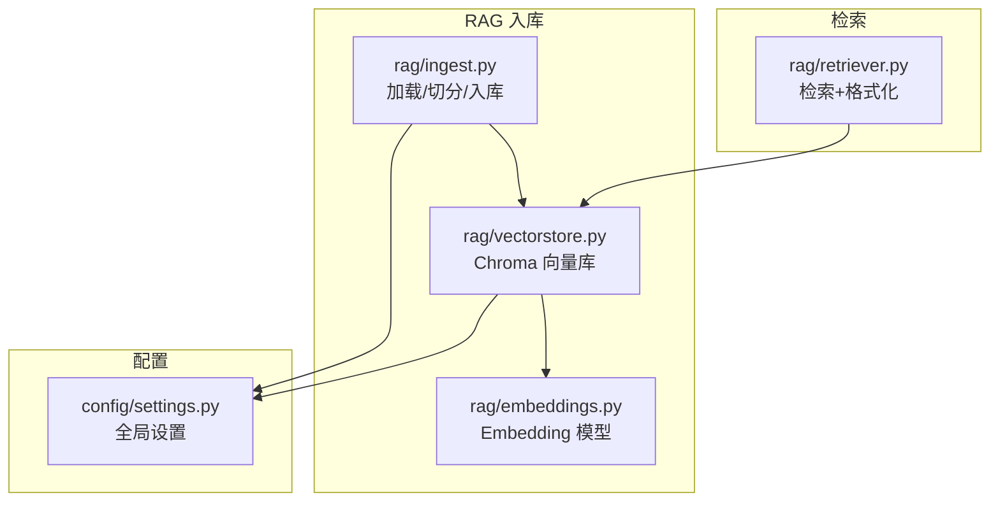
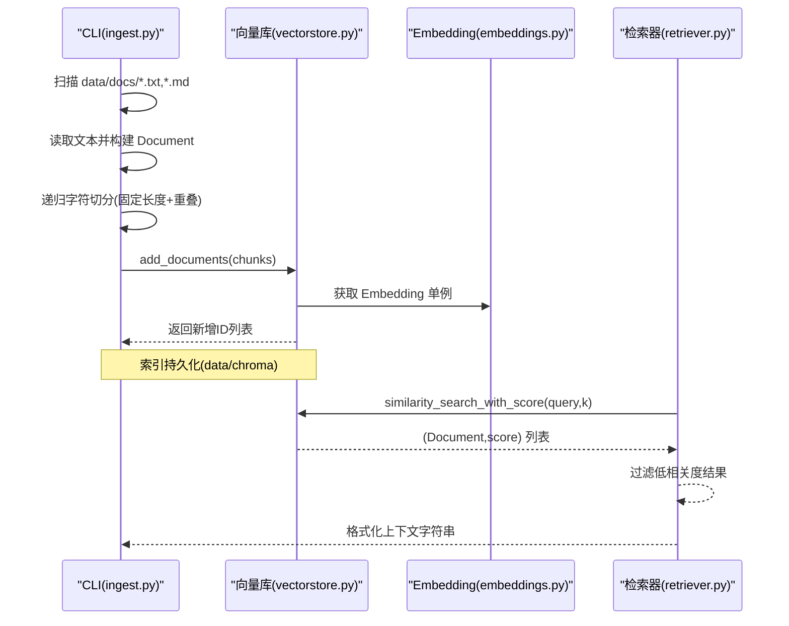
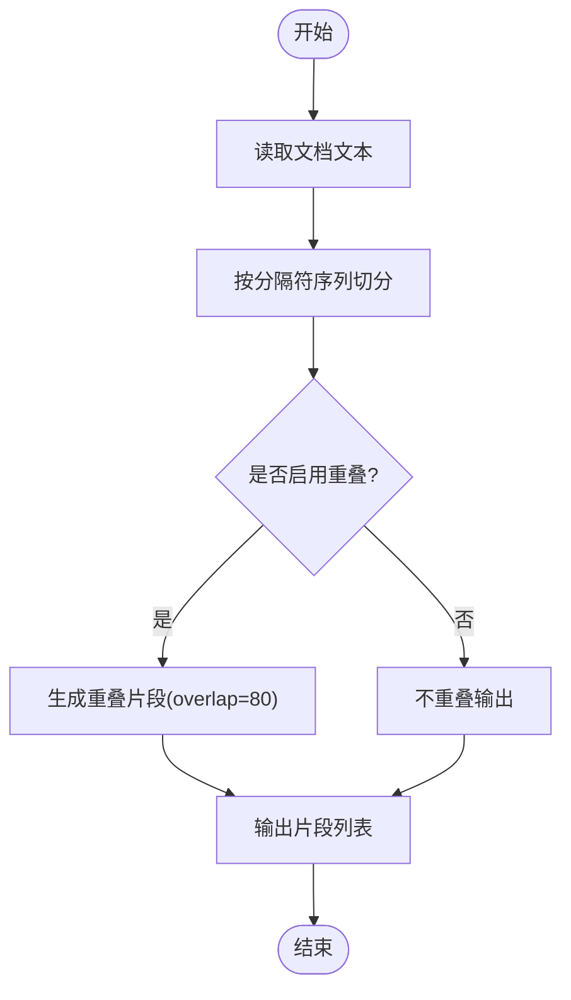
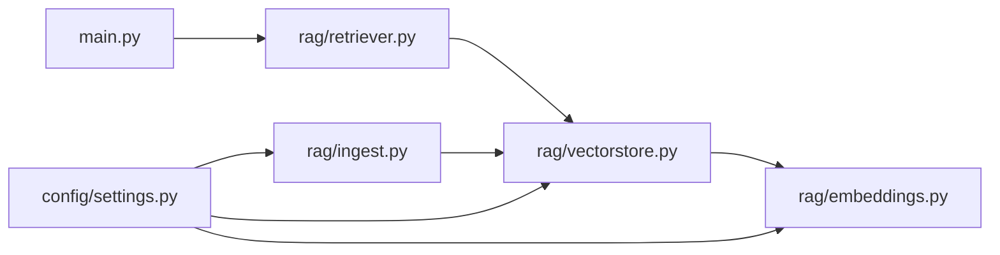

# 文档入库处理

<cite>
**本文引用的文件**   
- [rag/ingest.py](file://rag/ingest.py)
- [rag/embeddings.py](file://rag/embeddings.py)
- [rag/vectorstore.py](file://rag/vectorstore.py)
- [rag/retriever.py](file://rag/retriever.py)
- [config/settings.py](file://config/settings.py)
- [main.py](file://main.py)
- [requirements.txt](file://requirements.txt)
- [data/docs/产品说明.txt](file://data/docs/产品说明.txt)
</cite>

## 目录
1. [简介](#简介)
2. [项目结构](#项目结构)
3. [核心组件](#核心组件)
4. [架构总览](#架构总览)
5. [详细组件分析](#详细组件分析)
6. [依赖关系分析](#依赖关系分析)
7. [性能考量](#性能考量)
8. [故障排查指南](#故障排查指南)
9. [结论](#结论)
10. [附录](#附录)

## 简介
本技术文档聚焦“文档入库处理模块”，围绕以下目标展开：
- 深入解释文档预处理流程（文本清洗、格式解析、内容提取）
- 详细说明分块策略实现（固定长度分块、语义边界分块、重叠窗口设计）
- 文档化批量向量化优化（并行处理、内存管理、错误重试机制）
- 提供多格式支持指南（PDF、Word、Markdown等）
- 包含文档去重、版本管理与增量更新方案
- 解释入库过程中的质量控制与验证机制

当前仓库已实现基于 LangChain + ChromaDB 的 RAG 入库管线，支持 .txt/.md 文件的加载、切分与向量入库；检索阶段通过 Embedding 模型进行语义匹配。后续扩展建议将覆盖更丰富的格式与更强的工程化能力。

## 项目结构
与文档入库相关的核心代码位于 rag/ 与 config/ 目录：
- rag/ingest.py：文档加载、切分与入库 CLI
- rag/embeddings.py：Embedding 模型管理（本地 HuggingFace）
- rag/vectorstore.py：Chroma 向量库封装（持久化、入库、检索）
- rag/retriever.py：检索器与上下文格式化
- config/settings.py：全局配置（向量库路径、集合名、Top-K、过滤阈值等）
- main.py：FastAPI 主入口（Webhook/Web 聊天），间接调用智能体工作流（含 RAG 检索节点）
- requirements.txt：依赖声明（LangChain、ChromaDB、HuggingFace 等）
- data/docs/产品说明.txt：示例知识文档

图表来源
- [rag/ingest.py:1-78](file://rag/ingest.py#L1-L78)
- [rag/vectorstore.py:1-75](file://rag/vectorstore.py#L1-L75)
- [rag/embeddings.py:1-41](file://rag/embeddings.py#L1-L41)
- [rag/retriever.py:1-38](file://rag/retriever.py#L1-L38)
- [config/settings.py:1-93](file://config/settings.py#L1-L93)

章节来源
- [rag/ingest.py:1-78](file://rag/ingest.py#L1-L78)
- [rag/vectorstore.py:1-75](file://rag/vectorstore.py#L1-L75)
- [rag/embeddings.py:1-41](file://rag/embeddings.py#L1-L41)
- [rag/retriever.py:1-38](file://rag/retriever.py#L1-L38)
- [config/settings.py:1-93](file://config/settings.py#L1-L93)

## 核心组件
- 文档加载与切分（ingest.py）
  - 扫描 data/docs 下的 .txt/.md 文件，读取为 Document，附带 source/title 元数据
  - 使用 RecursiveCharacterTextSplitter 按分隔符与重叠窗口切分
- 向量存储（vectorstore.py）
  - 初始化 Chroma 集合，持久化到 data/chroma
  - add_documents 批量入库并持久化；search 带分数过滤与 Top-K
- Embedding（embeddings.py）
  - 使用本地 HuggingFace 中文 Embedding 模型，默认 CPU 推理，支持镜像加速
- 检索与上下文格式化（retriever.py）
  - retrieve_context 一站式返回格式化后的上下文字符串，便于 LLM 生成

章节来源
- [rag/ingest.py:19-43](file://rag/ingest.py#L19-L43)
- [rag/vectorstore.py:14-45](file://rag/vectorstore.py#L14-L45)
- [rag/embeddings.py:21-41](file://rag/embeddings.py#L21-L41)
- [rag/retriever.py:13-37](file://rag/retriever.py#L13-L37)

## 架构总览
下图展示从文档到检索的端到端流程，映射到实际源码文件：

图表来源
- [rag/ingest.py:46-65](file://rag/ingest.py#L46-L65)
- [rag/vectorstore.py:28-68](file://rag/vectorstore.py#L28-L68)
- [rag/embeddings.py:21-41](file://rag/embeddings.py#L21-L41)
- [rag/retriever.py:13-37](file://rag/retriever.py#L13-L37)

## 详细组件分析

### 文档预处理流程（文本清洗、格式解析、内容提取）
- 文本清洗
  - 优先以 UTF-8 编码读取，失败时回退 GBK 并忽略非法字符，保证鲁棒性
  - 未显式执行正则清洗或去空白，但可通过后续扩展加入标准化步骤
- 格式解析与内容提取
  - 当前仅支持 .txt/.md 纯文本格式，直接读取全文作为 page_content
  - 元数据包含 source（文件名）与 title（文件名前缀），便于溯源与展示
- 可扩展方向
  - PDF：引入 PyMuPDF/pdfplumber 提取正文与表格
  - Word：引入 python-docx 提取段落与标题层级
  - Markdown：保留标题层级与列表结构，利于语义切分

章节来源
- [rag/ingest.py:19-33](file://rag/ingest.py#L19-L33)
- [data/docs/产品说明.txt:1-39](file://data/docs/产品说明.txt#L1-L39)

### 分块策略（固定长度、语义边界、重叠窗口）
- 固定长度分块
  - chunk_size=500，控制每个片段最大长度，避免过长导致嵌入质量下降
- 语义边界分块
  - separators 优先级从高到低：双换行、单换行、中文句号/感叹号/问号/分号、英文句点、空格、空串
  - 尽量在句子/段落边界切分，提升片段内语义完整性
- 重叠窗口设计
  - chunk_overlap=80，相邻片段共享尾部/首部内容，缓解跨段语义断裂
- 复杂度与效果
  - 时间复杂度近似 O(N)，N 为字符数；空间复杂度受 chunk_size 与 overlap 影响
  - 合理设置可平衡召回率与冗余度

章节来源
- [rag/ingest.py:36-43](file://rag/ingest.py#L36-L43)

### 批量向量化与入库优化（并行、内存、重试）
- 当前实现
  - 使用 LangChain 的 add_documents 批量写入 Chroma，内部完成向量化与持久化
  - persist() 兼容新旧版本行为，异常时静默跳过
- 优化建议
  - 并行处理：对大文档集采用进程池/线程池分批处理，结合 I/O 与 CPU 瓶颈权衡
  - 内存管理：限制批次大小，避免一次性加载过多 Document；必要时流式读取
  - 错误重试：对网络/IO 异常实施指数退避重试；记录失败样本以便二次处理
  - 幂等与去重：为每个 chunk 生成稳定 ID（如 content_hash），避免重复入库

章节来源
- [rag/vectorstore.py:28-45](file://rag/vectorstore.py#L28-L45)

### 多格式支持指南（PDF、Word、Markdown）
- 现状
  - 仅支持 .txt/.md 纯文本
- 建议方案
  - PDF：使用 pdfplumber/PyMuPDF 提取文本与表格，保留页码与标题信息
  - Word：使用 python-docx 提取段落、标题、列表，维护层级结构
  - Markdown：解析标题层级与列表，增强语义边界识别
  - 统一抽象：定义 Loader 接口，输出标准 Document（page_content + metadata）

[本节为概念性扩展建议，不直接分析具体文件]

### 文档去重、版本管理与增量更新
- 去重
  - 基于内容哈希（如 SHA-256）生成稳定 ID，入库前检查是否存在相同哈希
  - 若允许轻微修改，可使用相似度阈值判定近似重复
- 版本管理
  - 在 metadata 中增加 version/timestamp 字段，支持历史回溯
  - 向量库支持按条件删除旧版本后插入新版本
- 增量更新
  - 对比文件修改时间戳或变更日志，仅处理新增/变更文件
  - 对已存在 ID 的 chunk 执行 upsert（先删后增）

[本节为概念性扩展建议，不直接分析具体文件]

### 入库质量控制与验证机制
- 输入校验
  - 文件为空或无法读取时跳过并记录日志
  - 切分后片段长度与重叠参数合理性检查
- 检索质量
  - 设置 rag_top_k 与 rag_score_filter，过滤低相关度结果
  - 检索结果格式化时附加来源与相关度，便于人工复核
- 评估体系
  - 使用 evaluation 模块进行 RAG 质量评估与智能体评估，辅助调优

章节来源
- [rag/vectorstore.py:48-68](file://rag/vectorstore.py#L48-L68)
- [rag/retriever.py:18-31](file://rag/retriever.py#L18-L31)
- [config/settings.py:37-42](file://config/settings.py#L37-L42)

## 依赖关系分析

图表来源
- [rag/ingest.py:1-78](file://rag/ingest.py#L1-L78)
- [rag/vectorstore.py:1-75](file://rag/vectorstore.py#L1-L75)
- [rag/embeddings.py:1-41](file://rag/embeddings.py#L1-L41)
- [rag/retriever.py:1-38](file://rag/retriever.py#L1-L38)
- [config/settings.py:1-93](file://config/settings.py#L1-L93)
- [main.py:1-236](file://main.py#L1-L236)

章节来源
- [requirements.txt:1-31](file://requirements.txt#L1-L31)

## 性能考量
- 嵌入模型
  - 使用本地 HuggingFace 模型，CPU 推理，首次下载后离线可用
  - 国内镜像加速（HF_ENDPOINT）降低下载延迟
- 向量库
  - Chroma 本地持久化，读写性能良好；大批量入库建议分批
- 检索
  - Top-K 与分数阈值可调，平衡召回与噪声
- 建议
  - 批大小调优（如 128/256）
  - 预热 Embedding 模型，减少首请求延迟
  - 监控磁盘 I/O 与内存占用，适时扩容

[本节为通用指导，不直接分析具体文件]

## 故障排查指南
- 常见问题
  - 未找到文档：确认 data/docs 目录下存在 .txt/.md 文件
  - 编码错误：UTF-8 失败自动回退 GBK，仍失败需检查文件编码
  - 向量库持久化失败：Chroma 版本差异导致 persist() 异常，已做兼容处理
  - 检索结果为空：调整 rag_top_k 与 rag_score_filter
- 定位方法
  - 查看控制台日志与 inges_result.txt 输出
  - 检查 data/chroma 目录是否生成
  - 使用 health 端点检查服务状态

章节来源
- [rag/ingest.py:46-65](file://rag/ingest.py#L46-L65)
- [rag/vectorstore.py:38-45](file://rag/vectorstore.py#L38-L45)
- [main.py:94-103](file://main.py#L94-L103)

## 结论
当前文档入库模块实现了稳定的 .txt/.md 加载、切分与向量入库流程，配合本地 Embedding 与 Chroma 向量库，满足基础 RAG 需求。建议在后续迭代中扩展多格式解析、增强去重与增量更新、完善并行与重试机制，并通过评估体系持续优化检索与生成质量。

[本节为总结，不直接分析具体文件]

## 附录
- 运行方式
  - 入库命令：python -m rag.ingest [--rebuild]
  - Web 服务：uvicorn main:app --host 0.0.0.0 --port 8000
- 关键配置
  - 向量库路径与集合名、Top-K、分数阈值、Embedding 模型名称等均在 config/settings.py 中集中管理

章节来源
- [rag/ingest.py:68-74](file://rag/ingest.py#L68-L74)
- [config/settings.py:37-42](file://config/settings.py#L37-L42)