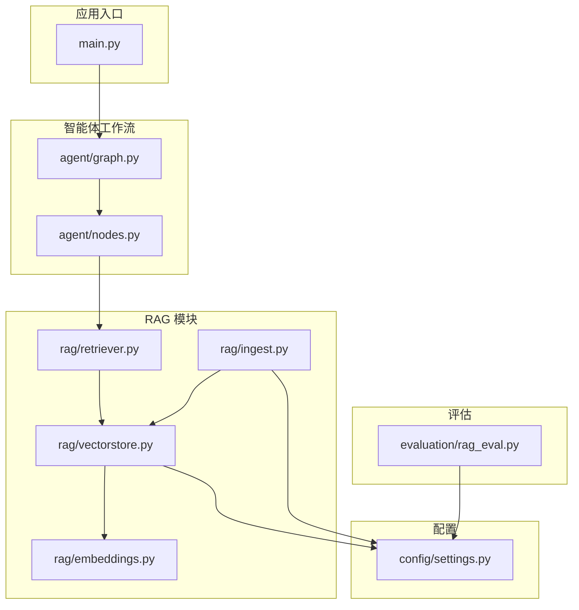
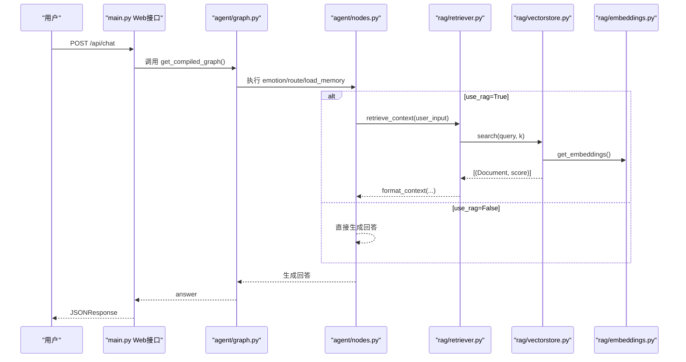
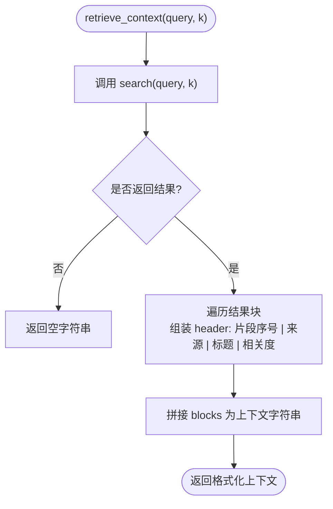
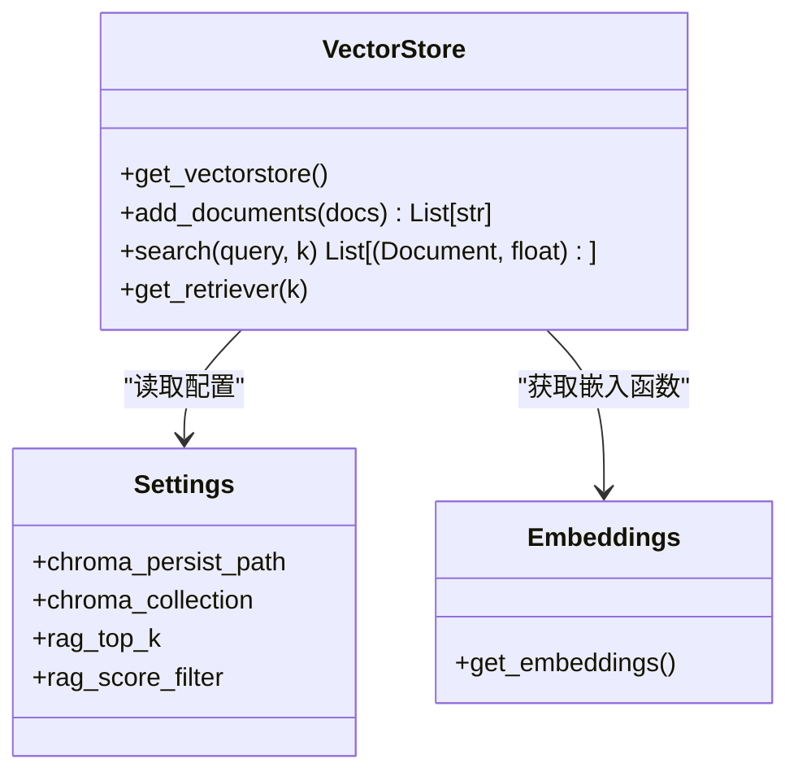
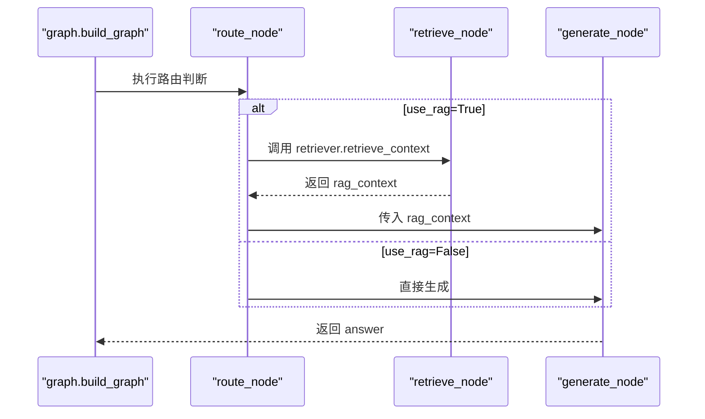
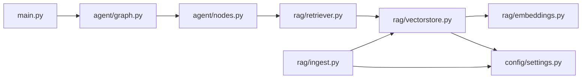

# 语义检索器

<cite>
**本文引用的文件**   
- [rag/retriever.py](file://rag/retriever.py)
- [rag/vectorstore.py](file://rag/vectorstore.py)
- [rag/embeddings.py](file://rag/embeddings.py)
- [rag/ingest.py](file://rag/ingest.py)
- [config/settings.py](file://config/settings.py)
- [agent/graph.py](file://agent/graph.py)
- [agent/nodes.py](file://agent/nodes.py)
- [main.py](file://main.py)
- [evaluation/rag_eval.py](file://evaluation/rag_eval.py)
</cite>

## 目录
1. [简介](#简介)
2. [项目结构](#项目结构)
3. [核心组件](#核心组件)
4. [架构总览](#架构总览)
5. [详细组件分析](#详细组件分析)
6. [依赖关系分析](#依赖关系分析)
7. [性能与监控](#性能与监控)
8. [故障排查指南](#故障排查指南)
9. [结论](#结论)
10. [附录：配置项与参数说明](#附录配置项与参数说明)

## 简介
本技术文档面向“语义检索器”，聚焦于基于向量相似度的语义搜索实现，包括查询向量化、相似度计算、结果排序与过滤、上下文格式化，以及与智能体工作流的集成方式。文档同时提供检索参数配置（k值、相似度阈值、过滤条件）、效果优化技巧（查询重写、多路召回、重排序）、性能监控与调优建议，以及评估方法，帮助读者快速理解并高效使用该系统。

## 项目结构
本项目采用分层模块化设计，RAG相关能力集中在 rag/ 目录，配置集中于 config/，智能体工作流在 agent/ 中编排，入口服务在 main.py，评估工具在 evaluation/。

图表来源
- [main.py:1-236](file://main.py#L1-L236)
- [agent/graph.py:1-106](file://agent/graph.py#L1-L106)
- [agent/nodes.py:1-164](file://agent/nodes.py#L1-L164)
- [rag/retriever.py:1-38](file://rag/retriever.py#L1-L38)
- [rag/vectorstore.py:1-75](file://rag/vectorstore.py#L1-L75)
- [rag/embeddings.py:1-41](file://rag/embeddings.py#L1-L41)
- [rag/ingest.py:1-79](file://rag/ingest.py#L1-L79)
- [config/settings.py:1-93](file://config/settings.py#L1-L93)
- [evaluation/rag_eval.py:1-121](file://evaluation/rag_eval.py#L1-L121)

章节来源
- [main.py:1-236](file://main.py#L1-L236)
- [config/settings.py:1-93](file://config/settings.py#L1-L93)

## 核心组件
- 检索器 retriever：对外暴露检索与上下文格式化接口，封装了从向量库检索到结果包装的完整流程。
- 向量库 vectorstore：封装 Chroma 向量库的初始化、入库与检索，支持持久化与分数过滤。
- Embedding 模型 embeddings：管理本地 HuggingFace 中文嵌入模型，默认使用 BAAI/bge-small-zh-v1.5，支持离线缓存与镜像加速。
- 文档入库 ingest：批量加载 .txt/.md 文档，切分为 chunk 并入库，支持重建索引。
- 配置 settings：集中管理 LLM、Embedding、向量库、记忆、钉钉等所有系统参数。
- 智能体 graph/nodes：通过 LangGraph 编排工作流，包含情感分析、路由判断、RAG检索、生成回答与记忆更新。

章节来源
- [rag/retriever.py:1-38](file://rag/retriever.py#L1-L38)
- [rag/vectorstore.py:1-75](file://rag/vectorstore.py#L1-L75)
- [rag/embeddings.py:1-41](file://rag/embeddings.py#L1-L41)
- [rag/ingest.py:1-79](file://rag/ingest.py#L1-L79)
- [config/settings.py:1-93](file://config/settings.py#L1-L93)
- [agent/graph.py:1-106](file://agent/graph.py#L1-L106)
- [agent/nodes.py:1-164](file://agent/nodes.py#L1-L164)

## 架构总览
语义检索的核心链路如下：用户输入进入智能体工作流，经路由判断后调用检索器；检索器通过向量库进行相似度检索，返回带分数的文档片段；检索器将结果格式化为含来源标记与相关度的上下文字符串；最终由生成节点结合长期记忆与检索上下文生成回答。

图表来源
- [main.py:58-91](file://main.py#L58-L91)
- [agent/graph.py:25-69](file://agent/graph.py#L25-L69)
- [agent/nodes.py:76-86](file://agent/nodes.py#L76-L86)
- [rag/retriever.py:13-37](file://rag/retriever.py#L13-L37)
- [rag/vectorstore.py:48-68](file://rag/vectorstore.py#L48-L68)
- [rag/embeddings.py:21-40](file://rag/embeddings.py#L21-L40)

## 详细组件分析

### 检索器 retriever
职责：
- 对查询进行语义检索，返回 (Document, score) 列表。
- 将检索结果格式化为上下文字符串，包含来源标记、标题与相关度显示。
- 提供一站式检索+格式化接口。

关键行为：
- 检索数量 k 默认 4，可通过参数覆盖。
- 相关度显示为 1/(1+score)，score 越小越相关。
- 若结果为空，返回空字符串，避免下游异常。

图表来源
- [rag/retriever.py:13-37](file://rag/retriever.py#L13-L37)

章节来源
- [rag/retriever.py:1-38](file://rag/retriever.py#L1-L38)

### 向量库 vectorstore
职责：
- 管理 Chroma 向量库单例，支持持久化到本地磁盘。
- 提供 add_documents 入库与 search 检索接口。
- 支持按 k 值检索与分数过滤，保证低相关度结果被丢弃。

关键行为：
- similarity_search_with_score 返回 (Document, score) 列表，score 为距离（越小越相关）。
- 过滤逻辑：score <= rag_score_filter 保留，否则丢弃。
- 回退策略：若过滤后为空，返回原始结果以保证有内容。

图表来源
- [rag/vectorstore.py:14-75](file://rag/vectorstore.py#L14-L75)
- [config/settings.py:34-42](file://config/settings.py#L34-L42)
- [rag/embeddings.py:21-40](file://rag/embeddings.py#L21-L40)

章节来源
- [rag/vectorstore.py:1-75](file://rag/vectorstore.py#L1-L75)
- [config/settings.py:34-42](file://config/settings.py#L34-L42)

### Embedding 模型 embeddings
职责：
- 管理本地 HuggingFace 中文嵌入模型，默认 BAAI/bge-small-zh-v1.5。
- 支持环境变量 HF_ENDPOINT 设置镜像端点，HF_HUB_OFFLINE=1 启用离线模式。
- 使用 lru_cache 缓存单例，首次调用下载权重到本地缓存。

关键行为：
- 优先使用 langchain_huggingface，回退到 langchain_community.embeddings。
- encode_kwargs 开启 normalize_embeddings，提升相似度稳定性。

章节来源
- [rag/embeddings.py:1-41](file://rag/embeddings.py#L1-L41)
- [config/settings.py:34-35](file://config/settings.py#L34-L35)

### 文档入库 ingest
职责：
- 加载 data/docs 下 .txt/.md 文件为 Document，附带 source 与 title 元数据。
- 使用 RecursiveCharacterTextSplitter 切分为 chunk（chunk_size=500，overlap=80）。
- 支持 --rebuild 清空旧索引后重建。

关键行为：
- 自动处理编码问题（utf-8/gbk），失败时忽略错误字符。
- 入库完成后打印统计信息。

章节来源
- [rag/ingest.py:1-79](file://rag/ingest.py#L1-L79)

### 智能体工作流集成
职责：
- 通过 LangGraph StateGraph 编排节点：emotion -> route -> load_memory -> {retrieve|generate} -> memory_update。
- 路由节点根据用户输入决定是否走 RAG 检索路径。
- 检索节点调用 retriever.retrieve_context 获取上下文，生成节点组装 prompt 并调用 LLM。

关键行为：
- 路由判断使用 LLM + 关键词兜底，短输入且无疑问词倾向于闲聊。
- 生成节点合并长期记忆与 RAG 上下文，构造 system prompt。

图表来源
- [agent/graph.py:25-69](file://agent/graph.py#L25-L69)
- [agent/nodes.py:46-72](file://agent/nodes.py#L46-L72)
- [agent/nodes.py:76-86](file://agent/nodes.py#L76-L86)
- [agent/nodes.py:104-141](file://agent/nodes.py#L104-L141)

章节来源
- [agent/graph.py:1-106](file://agent/graph.py#L1-L106)
- [agent/nodes.py:1-164](file://agent/nodes.py#L1-L164)

## 依赖关系分析
- retriever 依赖 vectorstore.search 进行检索。
- vectorstore 依赖 embeddings.get_embeddings 获取嵌入函数，依赖 settings 获取配置。
- ingest 依赖 vectorstore.add_documents 入库，依赖 settings.docs_dir 定位文档目录。
- nodes.retrieve_node 调用 retriever.retrieve_context，nodes.generate_node 组装 prompt。
- main.py 作为 FastAPI 入口，调用 graph.get_compiled_graph 执行工作流。

图表来源
- [main.py:58-91](file://main.py#L58-L91)
- [agent/graph.py:25-69](file://agent/graph.py#L25-L69)
- [agent/nodes.py:76-86](file://agent/nodes.py#L76-L86)
- [rag/retriever.py:13-15](file://rag/retriever.py#L13-L15)
- [rag/vectorstore.py:48-68](file://rag/vectorstore.py#L48-L68)
- [rag/embeddings.py:21-40](file://rag/embeddings.py#L21-L40)
- [rag/ingest.py:46-65](file://rag/ingest.py#L46-L65)
- [config/settings.py:34-42](file://config/settings.py#L34-L42)

章节来源
- [rag/retriever.py:1-38](file://rag/retriever.py#L1-L38)
- [rag/vectorstore.py:1-75](file://rag/vectorstore.py#L1-L75)
- [rag/embeddings.py:1-41](file://rag/embeddings.py#L1-L41)
- [rag/ingest.py:1-79](file://rag/ingest.py#L1-L79)
- [config/settings.py:1-93](file://config/settings.py#L1-L93)
- [agent/graph.py:1-106](file://agent/graph.py#L1-L106)
- [agent/nodes.py:1-164](file://agent/nodes.py#L1-L164)
- [main.py:1-236](file://main.py#L1-L236)

## 性能与监控
- 嵌入模型缓存：embeddings.get_embeddings 使用 lru_cache，避免重复初始化与网络请求。
- 向量库持久化：Chroma 写入 data/chroma，减少重复构建索引开销。
- 检索过滤：rag_score_filter 控制低相关度结果丢弃，避免噪声影响生成质量。
- 监控建议：
  - 记录每次检索的 k 值与返回结果数，观察过滤比例。
  - 统计平均 score 分布，调整 rag_score_filter 以平衡召回率与准确率。
  - 使用 LangSmith 追踪（langsmith_tracing）记录检索与生成链路耗时。
- 调优建议：
  - 增大 k 值以提升召回，但需配合更严格的分数过滤。
  - 优化 chunk_size 与 overlap，确保语义完整性与检索精度。
  - 使用更高质量的嵌入模型（如更大尺寸的 bge-zh）提升相似度区分度。

[本节为通用指导，不直接分析具体文件]

## 故障排查指南
常见问题与解决：
- 检索结果为空：检查 rag_score_filter 是否过严，或向量库是否为空（需先运行 ingest）。
- 嵌入模型下载失败：设置 HF_ENDPOINT 为国内镜像，或启用 HF_HUB_OFFLINE=1 使用缓存。
- 路由判断误判：检查 ROUTER_KEYWORDS 与 LLM 路由 prompt，必要时放宽关键词匹配。
- 生成失败：确认 LLM 配置（llm_model、llm_api_key、llm_base_url）正确，网络可达。
- 向量库写入失败：检查 data/chroma 目录权限，确保可写。

章节来源
- [rag/vectorstore.py:48-68](file://rag/vectorstore.py#L48-L68)
- [rag/embeddings.py:16-18](file://rag/embeddings.py#L16-L18)
- [agent/nodes.py:54-67](file://agent/nodes.py#L54-L67)
- [config/settings.py:26-30](file://config/settings.py#L26-L30)

## 结论
本语义检索器基于 Chroma 向量库与本地 HuggingFace 嵌入模型，实现了高效的中文语义检索与上下文格式化。通过合理的参数配置（k 值、分数阈值）与工作流集成（LangGraph），系统在智能体问答场景中提供了稳定可靠的 RAG 能力。结合评估工具与监控手段，可进一步优化检索效果与系统性能。

[本节为总结性内容，不直接分析具体文件]

## 附录：配置项与参数说明
- embedding_model：嵌入模型名称，默认 BAAI/bge-small-zh-v1.5。
- chroma_persist_dir：向量库持久化目录，默认 data/chroma。
- chroma_collection：向量库集合名，默认 dingtalk_kb。
- rag_top_k：默认检索数量，默认 4。
- rag_score_filter：相似度过滤阈值，默认 1.2（bge 距离越小越相关）。
- llm_model、llm_api_key、llm_base_url：LLM 配置，用于生成回答与路由判断。
- langsmith_tracing：是否启用 LangSmith 追踪，便于性能监控与调试。

章节来源
- [config/settings.py:34-42](file://config/settings.py#L34-L42)
- [config/settings.py:26-30](file://config/settings.py#L26-L30)
- [config/settings.py:57-61](file://config/settings.py#L57-L61)