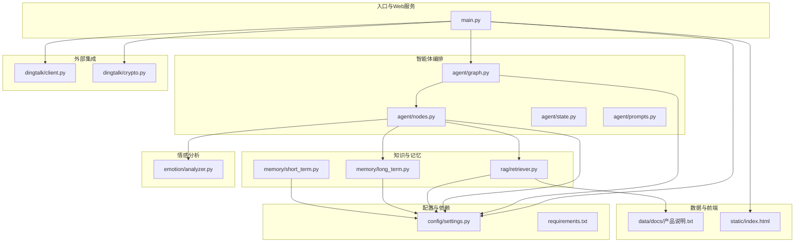
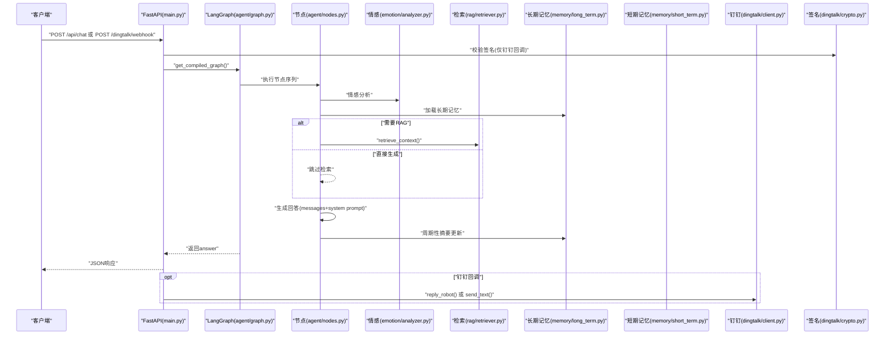
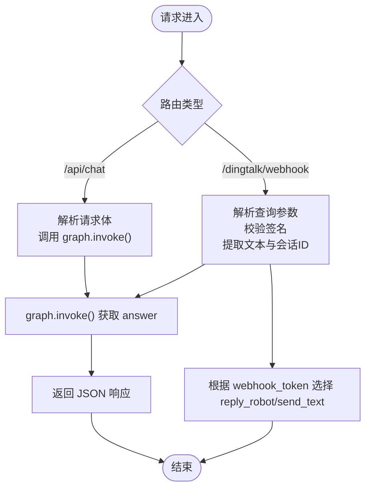
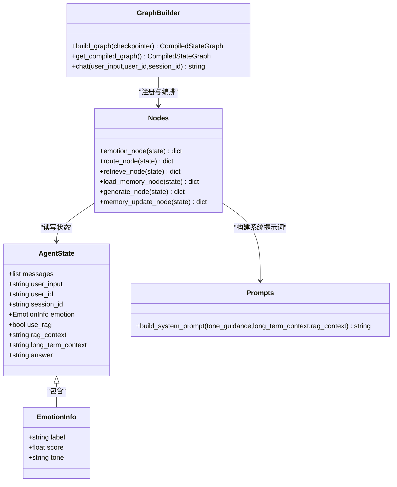
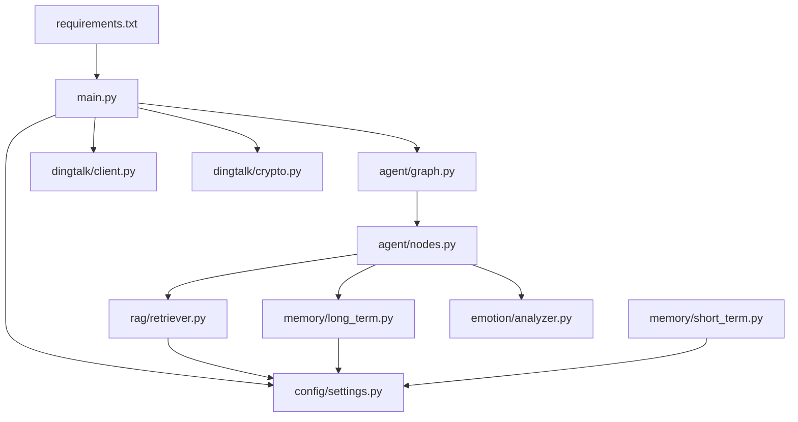

# 开发指南

<cite>
**本文引用的文件**   
- [main.py](file://main.py)
- [requirements.txt](file://requirements.txt)
- [config/settings.py](file://config/settings.py)
- [agent/graph.py](file://agent/graph.py)
- [agent/nodes.py](file://agent/nodes.py)
- [agent/state.py](file://agent/state.py)
- [agent/prompts.py](file://agent/prompts.py)
- [dingtalk/client.py](file://dingtalk/client.py)
- [dingtalk/crypto.py](file://dingtalk/crypto.py)
- [rag/retriever.py](file://rag/retriever.py)
- [memory/long_term.py](file://memory/long_term.py)
- [memory/short_term.py](file://memory/short_term.py)
- [emotion/analyzer.py](file://emotion/analyzer.py)
- [tests/test_smoke.py](file://tests/test_smoke.py)
- [data/docs/产品说明.txt](file://data/docs/产品说明.txt)
</cite>

## 目录
1. [简介](#简介)
2. [项目结构](#项目结构)
3. [核心组件](#核心组件)
4. [架构总览](#架构总览)
5. [详细组件分析](#详细组件分析)
6. [依赖关系分析](#依赖关系分析)
7. [性能考虑](#性能考虑)
8. [故障排查指南](#故障排查指南)
9. [结论](#结论)
10. [附录：开发与贡献规范](#附录开发与贡献规范)

## 简介
本指南面向开发者，系统化阐述钉钉AI智能体助手的代码结构与模块组织原则、核心开发流程（新功能、重构、修复）、测试策略与用例编写方法、调试技巧与工具使用、代码贡献规范（Git工作流、审查标准、提交规范），以及常见问题解决方案与最佳实践。同时提供扩展现有功能与新增业务模块的方法论与实践建议。

## 项目结构
本项目采用按“能力域”划分的模块化组织方式，职责清晰、耦合度低：
- agent：智能体状态图与工作流编排（LangGraph）
- config：全局配置管理（pydantic-settings）
- dingtalk：钉钉客户端与签名校验
- emotion：情感分析与语气指引
- memory：短期与长期记忆（进程内 + SQLite）
- rag：检索增强生成（向量库、检索器）
- evaluation：评估体系（LangSmith/OpenEvals）
- static：前端静态页面
- tests：冒烟与基础测试
- data/docs：知识库文档源

图表来源
- [main.py:1-236](file://main.py#L1-L236)
- [agent/graph.py:1-106](file://agent/graph.py#L1-L106)
- [agent/nodes.py:1-164](file://agent/nodes.py#L1-L164)
- [agent/state.py:1-47](file://agent/state.py#L1-L47)
- [agent/prompts.py:1-63](file://agent/prompts.py#L1-L63)
- [dingtalk/client.py:1-140](file://dingtalk/client.py#L1-L140)
- [dingtalk/crypto.py:1-63](file://dingtalk/crypto.py#L1-L63)
- [rag/retriever.py:1-38](file://rag/retriever.py#L1-L38)
- [memory/long_term.py:1-244](file://memory/long_term.py#L1-L244)
- [memory/short_term.py:1-28](file://memory/short_term.py#L1-L28)
- [emotion/analyzer.py:1-118](file://emotion/analyzer.py#L1-L118)
- [config/settings.py:1-93](file://config/settings.py#L1-L93)
- [requirements.txt:1-31](file://requirements.txt#L1-L31)
- [data/docs/产品说明.txt:1-39](file://data/docs/产品说明.txt#L1-L39)

章节来源
- [main.py:1-236](file://main.py#L1-L236)
- [requirements.txt:1-31](file://requirements.txt#L1-L31)

## 核心组件
- Web 入口与服务路由：提供健康检查、Web 聊天接口、钉钉回调处理与本地 REPL 调试模式。
- 智能体工作流：基于 LangGraph 的状态图，串联情感分析、路由判断、记忆加载、RAG 检索、回答生成与记忆更新。
- 配置中心：集中管理 LLM、Embedding、向量库、记忆、钉钉、评估等参数。
- 钉钉集成：access_token 缓存、消息发送、Webhook 回复与签名校验。
- 知识检索：语义检索与上下文格式化，供生成节点使用。
- 记忆系统：短期会话上下文（MemorySaver）与长期用户摘要/偏好（SQLite）。
- 情感分析：LLM 结构化输出优先，规则兜底，产出语气指引注入系统提示词。

章节来源
- [main.py:1-236](file://main.py#L1-L236)
- [agent/graph.py:1-106](file://agent/graph.py#L1-L106)
- [agent/nodes.py:1-164](file://agent/nodes.py#L1-L164)
- [config/settings.py:1-93](file://config/settings.py#L1-L93)
- [dingtalk/client.py:1-140](file://dingtalk/client.py#L1-L140)
- [dingtalk/crypto.py:1-63](file://dingtalk/crypto.py#L1-L63)
- [rag/retriever.py:1-38](file://rag/retriever.py#L1-L38)
- [memory/long_term.py:1-244](file://memory/long_term.py#L1-L244)
- [memory/short_term.py:1-28](file://memory/short_term.py#L1-L28)
- [emotion/analyzer.py:1-118](file://emotion/analyzer.py#L1-L118)

## 架构总览
下图展示从请求到响应的端到端调用链，涵盖 Web 聊天与钉钉回调两条路径，并体现各模块间的协作关系。

图表来源
- [main.py:58-176](file://main.py#L58-L176)
- [agent/graph.py:25-81](file://agent/graph.py#L25-L81)
- [agent/nodes.py:31-164](file://agent/nodes.py#L31-L164)
- [emotion/analyzer.py:82-118](file://emotion/analyzer.py#L82-L118)
- [rag/retriever.py:34-38](file://rag/retriever.py#L34-L38)
- [memory/long_term.py:150-163](file://memory/long_term.py#L150-L163)
- [memory/short_term.py:13-27](file://memory/short_term.py#L13-L27)
- [dingtalk/client.py:104-127](file://dingtalk/client.py#L104-L127)
- [dingtalk/crypto.py:33-63](file://dingtalk/crypto.py#L33-L63)

## 详细组件分析

### Web 入口与服务路由（main.py）
- 提供根路径返回前端页面、健康检查、Web 聊天接口与钉钉回调处理。
- 通过 argparse 支持 --repl 本地交互调试；默认启动 uvicorn 热重载服务。
- 钉钉回调路径包含签名校验、消息解析、智能体调用与消息回复。

图表来源
- [main.py:49-91](file://main.py#L49-L91)
- [main.py:106-176](file://main.py#L106-L176)

章节来源
- [main.py:1-236](file://main.py#L1-L236)

### 智能体工作流（agent/graph.py, agent/nodes.py, agent/state.py, agent/prompts.py）
- StateGraph 定义节点与边，条件边实现 use_rag 分流。
- 节点函数负责具体任务：情感分析、路由判断、RAG 检索、长期记忆加载、生成回答、记忆更新。
- AgentState 定义流转状态字段，messages 使用 reducer 自动累加历史。
- prompts 组装系统提示词，注入情感语气、长期记忆与 RAG 上下文。

图表来源
- [agent/state.py:12-46](file://agent/state.py#L12-L46)
- [agent/graph.py:25-81](file://agent/graph.py#L25-L81)
- [agent/nodes.py:31-164](file://agent/nodes.py#L31-L164)
- [agent/prompts.py:18-43](file://agent/prompts.py#L18-L43)

章节来源
- [agent/graph.py:1-106](file://agent/graph.py#L1-L106)
- [agent/nodes.py:1-164](file://agent/nodes.py#L1-L164)
- [agent/state.py:1-47](file://agent/state.py#L1-L47)
- [agent/prompts.py:1-63](file://agent/prompts.py#L1-L63)

### 配置管理（config/settings.py）
- 使用 pydantic-settings 从环境变量与 .env 加载配置，提供统一访问入口。
- 覆盖 LLM、Embedding、向量库、记忆、钉钉、评估等关键参数。
- 提供路径属性自动创建目录，保证运行期可用性。

章节来源
- [config/settings.py:1-93](file://config/settings.py#L1-L93)

### 钉钉集成（dingtalk/client.py, dingtalk/crypto.py）
- client：封装 access_token 获取与缓存、工作通知发送、机器人 webhook 回复。
- crypto：HMAC-SHA256 签名生成与校验，含时间戳有效性校验与防重放保护。

章节来源
- [dingtalk/client.py:1-140](file://dingtalk/client.py#L1-L140)
- [dingtalk/crypto.py:1-63](file://dingtalk/crypto.py#L1-L63)

### 检索增强生成（rag/retriever.py）
- 提供检索与上下文格式化的一站式接口，将向量检索结果转换为带来源与相关度的字符串。

章节来源
- [rag/retriever.py:1-38](file://rag/retriever.py#L1-L38)

### 记忆系统（memory/long_term.py, memory/short_term.py）
- 短期记忆：基于 MemorySaver，按 thread_id 维护会话上下文。
- 长期记忆：SQLite 持久化用户偏好、对话摘要与历史，支持并发读与串行写，WAL 模式提升性能。

章节来源
- [memory/short_term.py:1-28](file://memory/short_term.py#L1-L28)
- [memory/long_term.py:1-244](file://memory/long_term.py#L1-L244)

### 情感分析（emotion/analyzer.py）
- 优先使用 LLM 结构化输出进行情感分类与置信度评分，失败回退到关键词词典规则分析。
- 输出语气指引注入系统提示词，影响生成风格。

章节来源
- [emotion/analyzer.py:1-118](file://emotion/analyzer.py#L1-L118)

## 依赖关系分析
- 框架与运行时：FastAPI、Uvicorn、Pydantic、httpx。
- AI 栈：LangChain/LangGraph、OpenAI兼容接口、ChromaDB、SentenceTransformers、HuggingFace Hub。
- 评估：LangSmith、OpenEvals。
- 数据与存储：SQLite（内置）、ChromaDB 持久化目录。

图表来源
- [requirements.txt:1-31](file://requirements.txt#L1-L31)
- [main.py:1-236](file://main.py#L1-L236)
- [config/settings.py:1-93](file://config/settings.py#L1-L93)
- [agent/graph.py:1-106](file://agent/graph.py#L1-L106)
- [agent/nodes.py:1-164](file://agent/nodes.py#L1-L164)
- [dingtalk/client.py:1-140](file://dingtalk/client.py#L1-L140)
- [dingtalk/crypto.py:1-63](file://dingtalk/crypto.py#L1-L63)
- [rag/retriever.py:1-38](file://rag/retriever.py#L1-L38)
- [memory/long_term.py:1-244](file://memory/long_term.py#L1-L244)
- [memory/short_term.py:1-28](file://memory/short_term.py#L1-L28)
- [emotion/analyzer.py:1-118](file://emotion/analyzer.py#L1-L118)

章节来源
- [requirements.txt:1-31](file://requirements.txt#L1-L31)

## 性能考虑
- 模型与检索
  - 合理设置 RAG top_k 与分数阈值，减少无关片段带来的噪声与延迟。
  - Embedding 模型与向量库选择需兼顾中文效果与本地资源占用。
- 记忆系统
  - 短期记忆使用进程内 MemorySaver，无额外 IO；长期记忆开启 WAL 模式提升并发读性能。
  - 控制摘要更新频率（memory_summary_every），避免频繁 LLM 调用。
- Web 服务
  - FastAPI 同步 def 在事件循环线程池执行，避免阻塞；生产环境建议使用多进程部署。
  - 日志级别与格式统一，便于定位问题与性能分析。

[本节为通用指导，不直接分析具体文件]

## 故障排查指南
- 常见错误与定位
  - 签名校验失败：检查 timestamp、sign 与 secret 配置，确认时间戳有效期。
  - access_token 获取失败：核对 AppKey/AppSecret 与网络连通性。
  - 检索为空或质量差：检查向量库是否已入库、Embedding 模型可用性与检索参数。
  - 长期记忆写入失败：确认 SQLite 文件权限与路径存在。
- 调试手段
  - 本地 REPL：python main.py --repl 交互式验证智能体链路。
  - 健康检查：GET /health 查看 checkpointer 类型与服务状态。
  - 日志：统一 INFO 级别与结构化格式，结合异常堆栈快速定位。
- 测试验证
  - 冒烟测试：pytest 或 python tests/test_smoke.py 验证导入与基础功能。

章节来源
- [main.py:94-103](file://main.py#L94-L103)
- [main.py:179-210](file://main.py#L179-L210)
- [tests/test_smoke.py:1-143](file://tests/test_smoke.py#L1-L143)
- [dingtalk/crypto.py:33-63](file://dingtalk/crypto.py#L33-L63)
- [dingtalk/client.py:25-56](file://dingtalk/client.py#L25-L56)
- [rag/retriever.py:34-38](file://rag/retriever.py#L34-L38)
- [memory/long_term.py:75-100](file://memory/long_term.py#L75-L100)

## 结论
本项目以模块化与职责分离为核心设计思想，借助 LangGraph 编排复杂工作流，结合情感分析、RAG 与记忆系统，形成完整的智能体闭环。通过统一的配置管理与完善的测试与调试手段，开发者可高效迭代与扩展功能。

[本节为总结性内容，不直接分析具体文件]

## 附录：开发与贡献规范

### 代码结构与命名规范
- 目录职责
  - agent：状态图与节点逻辑
  - config：配置单例与路径属性
  - dingtalk：客户端与加密
  - emotion：情感分析
  - memory：短期与长期记忆
  - rag：检索与上下文格式化
  - evaluation：评估脚本与数据集
  - static：前端页面
  - tests：冒烟与单元测试
- 文件命名
  - 模块名小写下划线分隔，类名大驼峰，函数名小写下划线。
  - 公共接口放在模块顶层，内部实现以下划线前缀。

### 核心开发流程
- 新功能开发
  - 明确需求与边界，确定新增模块或扩展点（如新增节点、新检索源）。
  - 在对应目录下实现最小可用版本，补充配置项与单元测试。
  - 通过 REPL 与 /api/chat 验证端到端链路。
- 代码重构
  - 保持对外接口稳定，逐步替换内部实现，配合测试保障行为一致。
  - 拆分大模块，提高内聚与降低耦合，避免循环依赖。
- Bug 修复
  - 复现问题，添加回归测试，定位根因后修复并补充日志。
  - 对高风险变更进行灰度与回滚预案。

### 测试策略与用例编写
- 单元测试
  - 针对纯函数与无外部依赖的模块（如 crypto、retriever.format_context、emotion._rule_based_analyze）编写断言。
- 集成测试
  - 验证模块间协作（如 graph.build_graph、long_term.save_summary/get_context）。
- 端到端测试
  - 通过 /api/chat 与 /dingtalk/webhook 模拟真实请求，校验响应内容与下游调用。
- 运行方式
  - pytest tests/test_smoke.py -v 或直接执行测试文件。

章节来源
- [tests/test_smoke.py:1-143](file://tests/test_smoke.py#L1-L143)

### 调试技巧与开发工具
- 日志查看
  - 统一 logger 名称与格式，结合异常堆栈定位问题。
- 断点调试
  - 在关键节点（路由、检索、生成、记忆更新）插入断点，观察状态变化。
- 性能分析
  - 关注 LLM 调用耗时、检索耗时与数据库 IO，必要时增加计时与指标上报。

### 代码贡献指南
- Git 工作流
  - 分支策略：feature/*、fix/*、refactor/*，提交前确保测试通过。
  - 合并前完成代码审查与冲突解决。
- 代码审查标准
  - 可读性、可维护性、错误处理、日志与配置合理性。
- 提交规范
  - 简洁清晰的 commit message，关联需求或问题编号。

### 常见问题与最佳实践
- 配置与环境
  - 使用 .env 管理敏感信息，避免硬编码；生产环境通过环境变量注入。
- 健壮性
  - 所有外部调用（LLM、HTTP、DB）均需异常捕获与降级策略。
- 可扩展性
  - 通过节点与配置扩展能力，避免修改核心编排逻辑。

### 扩展现有功能与新增业务模块
- 新增节点
  - 在 nodes.py 中实现节点函数，在 graph.py 中注册节点与边，必要时调整状态字段。
- 新增检索源
  - 扩展 retriever.py 的检索接口，保持 format_context 契约不变。
- 新增记忆维度
  - 在 long_term.py 中扩展表结构与存取方法，并在节点中按需读取/写入。
- 新增业务模块
  - 遵循目录职责划分，提供清晰接口与配置项，补充测试与文档。

章节来源
- [agent/graph.py:25-81](file://agent/graph.py#L25-L81)
- [agent/nodes.py:31-164](file://agent/nodes.py#L31-L164)
- [rag/retriever.py:13-38](file://rag/retriever.py#L13-L38)
- [memory/long_term.py:75-163](file://memory/long_term.py#L75-L163)
- [config/settings.py:16-86](file://config/settings.py#L16-L86)