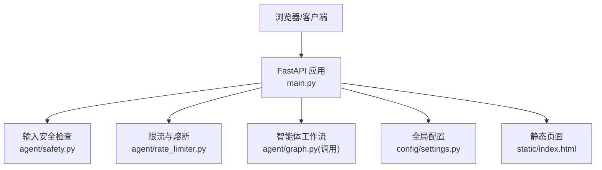
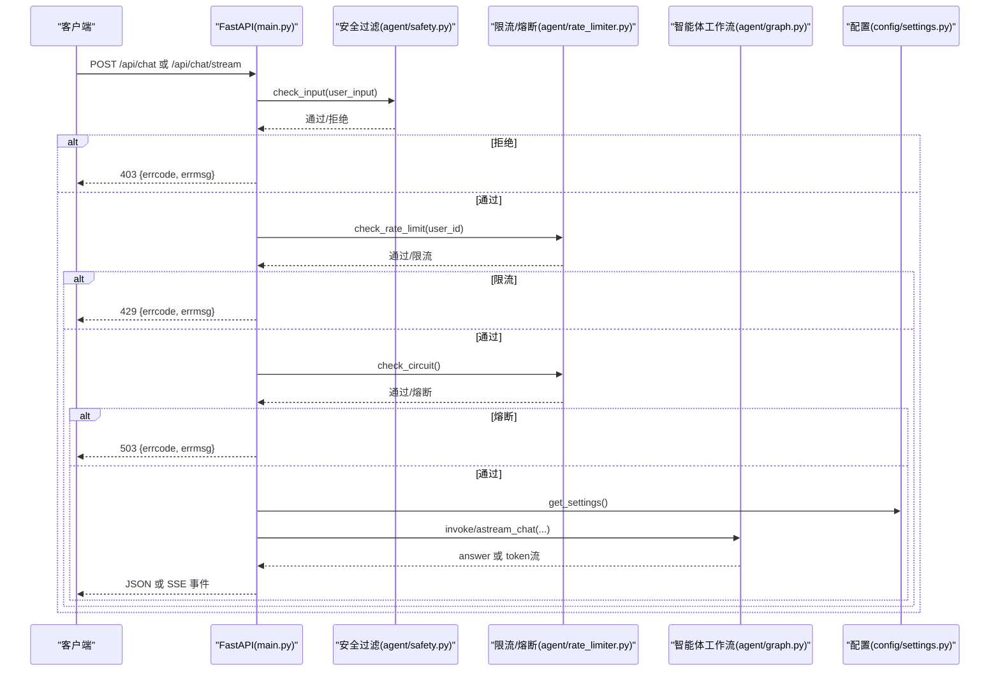
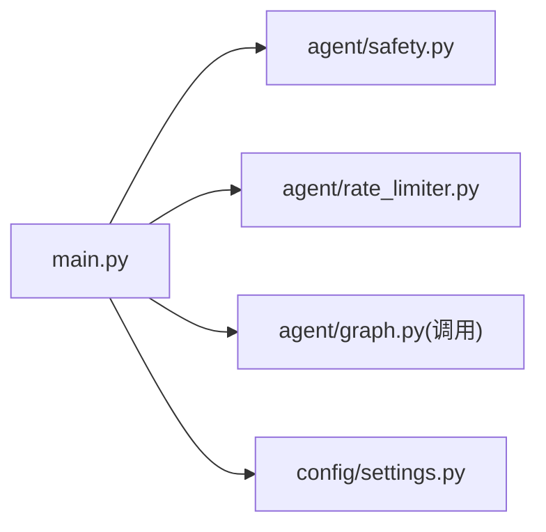

# API接口参考

<cite>
**本文引用的文件**
- [main.py](file://main.py)
- [config/settings.py](file://config/settings.py)
- [agent/rate_limiter.py](file://agent/rate_limiter.py)
- [agent/safety.py](file://agent/safety.py)
- [static/index.html](file://static/index.html)
</cite>

## 目录
1. [简介](#简介)
2. [项目结构](#项目结构)
3. [核心组件](#核心组件)
4. [架构总览](#架构总览)
5. [详细接口说明](#详细接口说明)
6. [依赖关系分析](#依赖关系分析)
7. [性能与可用性](#性能与可用性)
8. [故障排查指南](#故障排查指南)
9. [结论](#结论)
10. [附录](#附录)

## 简介
本参考文档面向前端开发者，提供钉钉AI智能体助手的全部公开RESTful接口规范，包括：
- Web聊天接口（同步）
- Web聊天流式接口（SSE）
- 健康检查接口
- 根路径静态页面

文档包含请求格式、响应结构、参数说明、错误码定义以及示例，帮助快速集成。

## 项目结构
服务基于FastAPI实现，入口在main.py中注册路由；配置集中在config/settings.py；限流与熔断逻辑在agent/rate_limiter.py；输入安全过滤在agent/safety.py；Web前端静态页面位于static/index.html。

图表来源
- [main.py:145-326](file://main.py#L145-L326)
- [config/settings.py:19-216](file://config/settings.py#L19-L216)
- [agent/rate_limiter.py:22-147](file://agent/rate_limiter.py#L22-L147)
- [agent/safety.py:35-68](file://agent/safety.py#L35-L68)
- [static/index.html:256-265](file://static/index.html#L256-L265)

章节来源
- [main.py:1-387](file://main.py#L1-L387)
- [config/settings.py:1-216](file://config/settings.py#L1-L216)

## 核心组件
- 路由层：定义HTTP端点，处理请求校验、安全过滤、限流熔断、调用智能体、返回结果或流式事件。
- 安全过滤：拦截敏感词与prompt注入模式。
- 限流与熔断：按用户维度滑动窗口限流；连续失败触发熔断，冷却后半开试探。
- 配置管理：集中读取环境变量与.env，暴露LLM、RAG、记忆、搜索等开关与阈值。
- 静态资源：根路径返回Web聊天页面。

章节来源
- [main.py:138-326](file://main.py#L138-L326)
- [agent/safety.py:35-68](file://agent/safety.py#L35-L68)
- [agent/rate_limiter.py:22-147](file://agent/rate_limiter.py#L22-L147)
- [config/settings.py:19-216](file://config/settings.py#L19-L216)

## 架构总览
下图展示一次聊天请求从客户端到智能体的完整流程，包括安全校验、限流熔断、工作流执行与结果返回。

图表来源
- [main.py:154-314](file://main.py#L154-L314)
- [agent/safety.py:35-68](file://agent/safety.py#L35-L68)
- [agent/rate_limiter.py:22-147](file://agent/rate_limiter.py#L22-L147)
- [config/settings.py:19-216](file://config/settings.py#L19-L216)

## 详细接口说明

### 通用约定
- 内容类型：application/json
- 字符编码：UTF-8
- 鉴权：当前接口无需鉴权
- 会话标识：使用session_id区分对话上下文；user_id用于限流维度

#### 公共请求体 ChatRequest
- user_input: string，必填，用户输入文本
- user_id: string，可选，默认 web-user
- session_id: string，可选，默认 web-session

章节来源
- [main.py:138-143](file://main.py#L138-L143)

---

### 根路径 GET /
- 功能：返回Web聊天前端页面
- 成功响应：HTML页面
- 失败响应：若静态页面不存在，返回404 HTML

示例
- 请求：GET http://localhost:8000/
- 响应：HTML文档

章节来源
- [main.py:145-151](file://main.py#L145-L151)

---

### 健康检查 GET /health
- 功能：服务健康状态检查
- 成功响应：JSON
  - status: string，固定为 ok
  - service: string，固定为 dingtalk-ai-agent
  - checkpointer: string，当前短期记忆检查器类型

示例
- 请求：GET http://localhost:8000/health
- 响应：
  - { "status": "ok", "service": "dingtalk-ai-agent", "checkpointer": "<类型>" }

章节来源
- [main.py:317-326](file://main.py#L317-L326)

---

### 同步聊天 POST /api/chat
- 功能：提交问题并等待完整回答
- 请求体：ChatRequest
- 成功响应：JSON
  - errcode: number，0表示成功
  - errmsg: string，成功时为 ok
  - answer: string，智能体回答

- 错误响应：
  - 400/422：请求体校验失败（由框架自动返回）
  - 403：输入安全过滤拦截
    - errcode: 403
    - errmsg: 拦截原因
  - 429：请求过于频繁（限流）
    - errcode: 429
    - errmsg: 限流提示
  - 503：服务暂时不可用（熔断）
    - errcode: 503
    - errmsg: 熔断提示
  - 500：服务端异常
    - errcode: 500
    - errmsg: 错误详情

示例
- 请求：
  - POST http://localhost:8000/api/chat
  - Body: { "user_input": "你好", "user_id": "web-user", "session_id": "web-session" }
- 响应：
  - { "errcode": 0, "errmsg": "ok", "answer": "..." }

章节来源
- [main.py:154-209](file://main.py#L154-L209)
- [agent/safety.py:35-68](file://agent/safety.py#L35-L68)
- [agent/rate_limiter.py:22-147](file://agent/rate_limiter.py#L22-L147)

---

### 流式聊天 POST /api/chat/stream
- 功能：以Server-Sent Events(SSE)方式增量返回回答token
- 请求体：ChatRequest
- 成功事件流：text/event-stream
  - 事件类型：
    - type: "status"，status: string，节点进度提示（如“检索知识库中...”、“生成回答中...”）
    - type: "token"，content: string，增量token
    - type: "error"，errmsg: string，异常信息
    - type: "done"，结束标记
- 非事件错误：
  - 403：输入安全过滤拦截
    - errcode: 403
    - errmsg: 拦截原因
  - 429：请求过于频繁（限流）
    - errcode: 429
    - errmsg: 限流提示
  - 503：服务暂时不可用（熔断）
    - errcode: 503
    - errmsg: 熔断提示
  - 其他：请求体校验失败（由框架自动返回）

- 超时保护：整体流式超时由配置 stream_timeout 控制，超时后停止拉取并返回已生成的token，最后发送 done 事件

示例
- 请求：
  - POST http://localhost:8000/api/chat/stream
  - Body: { "user_input": "请介绍一下...", "user_id": "web-user", "session_id": "web-session" }
- 响应（SSE片段示意）：
  - data: {"type":"status","status":"检索知识库中..."}
  - data: {"type":"token","content":"您好"}
  - data: {"type":"token","content":"，我是..."}
  - data: {"type":"done"}

章节来源
- [main.py:223-314](file://main.py#L223-L314)
- [config/settings.py:47-48](file://config/settings.py#L47-L48)

---

### 前端集成要点
- 根路径加载静态页面，页面内通过fetch调用 /api/chat/stream 进行流式渲染
- 建议：
  - 使用 ReadableStream 解析SSE事件
  - 根据 type 字段分别处理 status、token、error、done
  - 合理设置超时与重连策略

章节来源
- [static/index.html:256-265](file://static/index.html#L256-L265)

## 依赖关系分析
- main.py 依赖：
  - agent.safety.check_input：输入安全过滤
  - agent.rate_limiter.check_rate_limit、check_circuit、record_success、record_failure：限流与熔断
  - config.settings.get_settings：获取全局配置（如流式超时）
  - agent.graph：调用智能体工作流（同步invoke与异步astream_chat）
- 配置项影响：
  - stream_timeout：流式整体超时
  - rate_limit_per_minute：每分钟请求上限
  - circuit_breaker_threshold、circuit_breaker_recovery：熔断阈值与恢复时间
  - input_filter_enabled、input_injection_check_enabled：输入安全过滤开关

图表来源
- [main.py:154-314](file://main.py#L154-L314)
- [config/settings.py:19-216](file://config/settings.py#L19-L216)
- [agent/rate_limiter.py:22-147](file://agent/rate_limiter.py#L22-L147)
- [agent/safety.py:35-68](file://agent/safety.py#L35-L68)

章节来源
- [main.py:154-314](file://main.py#L154-L314)
- [config/settings.py:19-216](file://config/settings.py#L19-L216)

## 性能与可用性
- 启动预热：
  - LLM连接预热（TLS握手、DNS解析、连接池建立），降低首请求延迟
  - 向量库初始化与BM25索引预热，避免首请求阻塞
- 流式超时：
  - 通过 stream_timeout 控制整体流式超时，防止连接卡死
- 限流与熔断：
  - 按用户维度滑动窗口限流，避免单用户滥用
  - 连续失败触发熔断，冷却后半开试探，提升系统韧性

章节来源
- [main.py:45-135](file://main.py#L45-L135)
- [config/settings.py:47-48](file://config/settings.py#L47-L48)
- [agent/rate_limiter.py:51-147](file://agent/rate_limiter.py#L51-L147)

## 故障排查指南
- 403 输入被拦截：
  - 检查是否命中敏感词或prompt注入检测
  - 可调整 input_filter_enabled、input_blocked_keywords、input_injection_check_enabled
- 429 请求过于频繁：
  - 检查 rate_limit_per_minute 配置
  - 适当放宽或优化客户端重试策略
- 503 服务暂时不可用：
  - 检查熔断状态与冷却时间
  - 关注后端日志中的熔断告警
- 500 服务端异常：
  - 查看日志堆栈，定位具体异常
  - 确认LLM、向量库、记忆等依赖可用
- 流式无响应：
  - 检查 stream_timeout 是否过短
  - 确认网络代理未缓冲SSE（X-Accel-Buffering: no）

章节来源
- [agent/safety.py:35-68](file://agent/safety.py#L35-L68)
- [agent/rate_limiter.py:22-147](file://agent/rate_limiter.py#L22-L147)
- [main.py:154-314](file://main.py#L154-L314)

## 结论
本服务提供简洁稳定的Web聊天与流式聊天接口，内置输入安全、限流熔断与健康检查，适合快速集成到各类前端应用中。通过合理的配置与监控，可在高并发场景下保持良好可用性与用户体验。

## 附录

### 错误码速查
- 0：成功
- 1：空输入
- 403：输入安全过滤拦截
- 429：请求过于频繁（限流）
- 500：服务端异常
- 503：服务暂时不可用（熔断）

章节来源
- [main.py:163-209](file://main.py#L163-L209)
- [main.py:238-260](file://main.py#L238-L260)