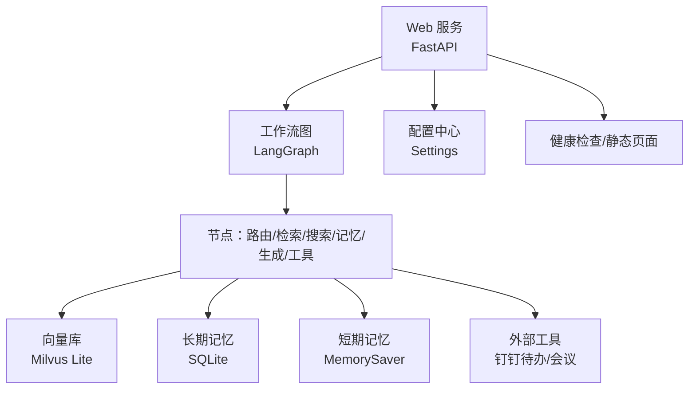
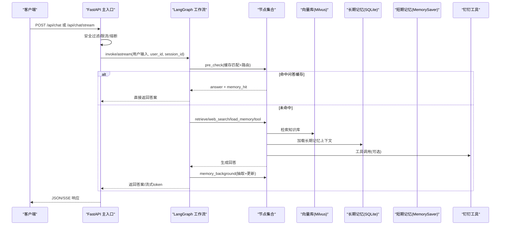
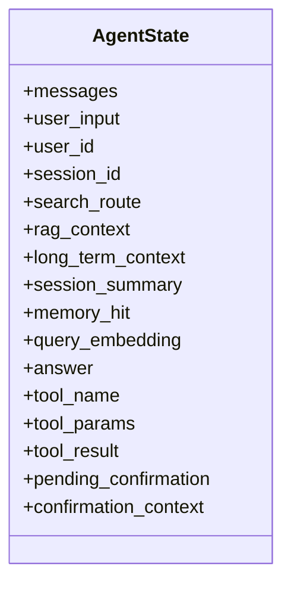
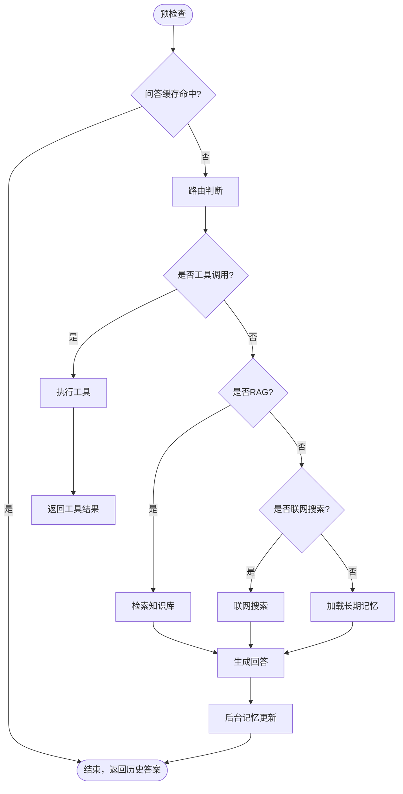
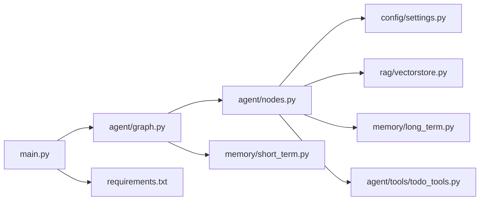

# 代码结构

<cite>
**本文引用的文件**
- [main.py](file://main.py)
- [config/settings.py](file://config/settings.py)
- [agent/graph.py](file://agent/graph.py)
- [agent/nodes.py](file://agent/nodes.py)
- [agent/state.py](file://agent/state.py)
- [rag/vectorstore.py](file://rag/vectorstore.py)
- [rag/ingest.py](file://rag/ingest.py)
- [memory/long_term.py](file://memory/long_term.py)
- [memory/short_term.py](file://memory/short_term.py)
- [agent/tools/todo_tools.py](file://agent/tools/todo_tools.py)
- [requirements.txt](file://requirements.txt)
- [Docker部署指南.md](file://Docker部署指南.md)
</cite>

## 目录
1. [简介](#简介)
2. [项目结构](#项目结构)
3. [核心组件](#核心组件)
4. [架构总览](#架构总览)
5. [详细组件分析](#详细组件分析)
6. [依赖关系分析](#依赖关系分析)
7. [性能与可扩展性](#性能与可扩展性)
8. [故障排查指南](#故障排查指南)
9. [结论](#结论)
10. [附录：关键入口与配置](#附录：关键入口与配置)

## 简介
本项目是一个基于 FastAPI + LangGraph 的“钉钉AI智能体助手”，提供 Web 聊天接口、流式响应、RAG 知识库检索、联网搜索、工具调用（待办/会议）、长期/短期记忆管理，以及本地向量库 Milvus Lite 的知识入库与增量同步。整体采用“状态图工作流”编排，将路由、检索、生成、记忆更新等节点组合为可复用的执行图，并通过配置中心统一管理模型、检索、记忆、限流熔断等参数。

## 项目结构
- agent：智能体工作流与节点实现（图构建、节点逻辑、状态定义、安全、限流、查询改写、工具）
- config：全局配置（模型、向量库、记忆、工具、限流熔断等）
- rag：知识检索链路（嵌入、向量库、检索器、重排、BM25、OCR、文件监听、文档入库）
- memory：长期/短期记忆（SQLite 持久化、会话摘要、问答缓存）
- evaluation：评估脚本（Agent/RAG 评估）
- static：前端页面
- data：向量库数据与知识库文档
- scripts：辅助脚本（如预下载模型）
- hooks：Git 钩子示例
- Docker 相关文件：镜像构建与编排

图表来源
- [main.py:145-326](file://main.py#L145-L326)
- [agent/graph.py:44-102](file://agent/graph.py#L44-L102)
- [rag/vectorstore.py:29-76](file://rag/vectorstore.py#L29-L76)
- [memory/short_term.py:13-20](file://memory/short_term.py#L13-L20)
- [memory/long_term.py:30-47](file://memory/long_term.py#L30-L47)

章节来源
- [main.py:1-387](file://main.py#L1-L387)
- [config/settings.py:19-216](file://config/settings.py#L19-L216)

## 核心组件
- Web 服务与入口：FastAPI 应用，提供 /api/chat、/api/chat/stream、/health、根路径静态页；启动时预热 LLM 连接与向量库索引，并启动文件监听。
- 工作流图：使用 LangGraph StateGraph 构建“预检查→四路分流→生成→后台记忆更新”的执行图，支持同步与异步流式事件。
- 节点层：预检查（缓存匹配+路由）、检索（RAG）、联网搜索、长期记忆加载、生成回答、后台记忆更新、工具调用。
- 配置中心：集中管理模型、检索、记忆、工具、限流熔断等所有运行时参数。
- 向量库：Milvus Lite 本地文件持久化，支持文本与图像多模态，提供增删改查与统计。
- 记忆系统：长期记忆（SQLite 分层结构化存储、摘要、问答缓存），短期记忆（进程内 MemorySaver）。
- 工具集成：通过动态导入 dingtalk_lib 调用钉钉待办/会议 API，并提供确认流程与结果格式化。

章节来源
- [main.py:45-135](file://main.py#L45-L135)
- [agent/graph.py:44-102](file://agent/graph.py#L44-L102)
- [agent/nodes.py:92-151](file://agent/nodes.py#L92-L151)
- [rag/vectorstore.py:29-76](file://rag/vectorstore.py#L29-L76)
- [memory/long_term.py:424-497](file://memory/long_term.py#L424-L497)
- [memory/short_term.py:13-20](file://memory/short_term.py#L13-L20)
- [agent/tools/todo_tools.py:18-44](file://agent/tools/todo_tools.py#L18-L44)

## 架构总览
下图展示了从请求进入 Web 服务到工作流执行、检索与记忆更新的完整链路。

图表来源
- [main.py:154-314](file://main.py#L154-L314)
- [agent/graph.py:44-102](file://agent/graph.py#L44-L102)
- [agent/nodes.py:92-151](file://agent/nodes.py#L92-L151)
- [rag/vectorstore.py:164-184](file://rag/vectorstore.py#L164-L184)
- [memory/long_term.py:424-497](file://memory/long_term.py#L424-L497)
- [memory/short_term.py:13-20](file://memory/short_term.py#L13-L20)
- [agent/tools/todo_tools.py:18-44](file://agent/tools/todo_tools.py#L18-L44)

## 详细组件分析

### Web 服务与入口（main.py）
- 启动阶段：预热 LLM 连接（TLS/DNS/连接池）、初始化向量库（空库重建/增量入库）、预热 BM25 索引、启动文件监听。
- 路由：
  - GET /：返回静态前端页面
  - POST /api/chat：同步聊天，返回 JSON
  - POST /api/chat/stream：SSE 流式聊天，按节点进度与 token 推送
  - GET /health：健康检查，输出 checkpointer 类型
- 安全与稳定性：输入安全过滤、限流（按 user_id）、熔断（连续失败阈值）、超时保护（流式整体超时）。

章节来源
- [main.py:45-135](file://main.py#L45-L135)
- [main.py:145-326](file://main.py#L145-L326)

### 工作流图与状态（agent/graph.py, agent/state.py）
- 图构建：注册节点（pre_check、load_memory、retrieve、web_search、tool、generate、memory_background），定义线性边与条件边，挂载 checkpointer（短期记忆）。
- 状态定义：AgentState 包含消息历史、用户与会话标识、路由结果、检索上下文、长期记忆上下文、会话摘要、问答命中标志、工具调用相关字段等。
- 调用入口：chat（同步）、chat_stream（同步流）、astream_chat（异步流），统一封装 node/token 事件。

图表来源
- [agent/state.py:12-51](file://agent/state.py#L12-L51)

章节来源
- [agent/graph.py:44-102](file://agent/graph.py#L44-L102)
- [agent/graph.py:117-255](file://agent/graph.py#L117-L255)
- [agent/state.py:12-51](file://agent/state.py#L12-L51)

### 节点层（agent/nodes.py）
- 预检查：合并问答缓存匹配与路由判断；若 pending_confirmation 则优先处理用户确认。
- 路由：LLM 路由 + 关键词兜底；时效性问题优先走联网搜索；短输入倾向闲聊。
- 检索：可选查询改写 → 多路召回+重排序 → 相关度阈值过滤 → 格式化上下文。
- 联网搜索：调用 web_search 模块，结果写入 rag_context。
- 长期记忆加载：构建用户画像/事实/摘要上下文，加载会话压缩摘要。
- 生成回答：组装 system prompt + 历史消息（窗口+预算+更早摘要）+ 当前输入；主模型失败自动降级备用模型。
- 后台记忆：规则快速抽取 + LLM 结构化抽取；周期性摘要更新；会话摘要刷新；问答缓存保存。
- 工具调用：LLM 提取工具名与参数；查询类直接执行；写操作需确认；结果格式化。

图表来源
- [agent/nodes.py:92-151](file://agent/nodes.py#L92-L151)
- [agent/nodes.py:153-230](file://agent/nodes.py#L153-L230)
- [agent/nodes.py:284-341](file://agent/nodes.py#L284-L341)
- [agent/nodes.py:344-360](file://agent/nodes.py#L344-L360)
- [agent/nodes.py:499-532](file://agent/nodes.py#L499-L532)
- [agent/nodes.py:630-643](file://agent/nodes.py#L630-L643)
- [agent/nodes.py:646-690](file://agent/nodes.py#L646-L690)

章节来源
- [agent/nodes.py:92-780](file://agent/nodes.py#L92-L780)

### 向量库与文档入库（rag/vectorstore.py, rag/ingest.py）
- 向量库：Milvus Lite 本地文件持久化，支持文本与图像混合 metadata；提供 add_documents/add_image_documents/search/count_documents/drop_collection/delete_by_ids/get_all_text_documents。
- 文档入库：支持 txt/md/pdf/docx/xlsx/image；PDF 文本优先，不足触发 OCR；图片 OCR 提取文本并生成图像 Document；增量入库基于文件指纹清单；全量重建支持清空 collection。

章节来源
- [rag/vectorstore.py:29-282](file://rag/vectorstore.py#L29-L282)
- [rag/ingest.py:1-200](file://rag/ingest.py#L1-L200)

### 记忆系统（memory/long_term.py, memory/short_term.py）
- 长期记忆：SQLite 分层结构化存储（用户画像、关键事实、摘要历史、会话摘要、问答缓存）；构建记忆上下文按优先级分层填充；增量摘要合并避免关键信息丢失；问答缓存相似问题复用。
- 短期记忆：进程内 MemorySaver，按 thread_id（= session_id）维护会话上下文。

章节来源
- [memory/long_term.py:30-497](file://memory/long_term.py#L30-L497)
- [memory/long_term.py:500-820](file://memory/long_term.py#L500-L820)
- [memory/short_term.py:13-20](file://memory/short_term.py#L13-L20)

### 工具调用（agent/tools/todo_tools.py）
- 待办工具：创建/查询待办，调用 dingtalk_lib 提供的 API；结果格式化为用户可读文本；确认消息用于写操作二次确认。
- 会议工具：类似待办，支持创建/取消/更新/查询会议。

章节来源
- [agent/tools/todo_tools.py:18-84](file://agent/tools/todo_tools.py#L18-L84)

## 依赖关系分析
- 框架与模型：langchain/langgraph/openai/sentence-transformers/huggingface 等；Milvus Lite 本地向量库；fastapi/uvicorn Web 服务。
- 配置：pydantic-settings 从环境变量/.env 加载；HuggingFace 镜像加速。
- 外部集成：钉钉工具通过 skill scripts 动态导入 dingtalk_lib；评估与追踪可选 langsmith。

图表来源
- [main.py:145-326](file://main.py#L145-L326)
- [agent/graph.py:44-102](file://agent/graph.py#L44-L102)
- [agent/nodes.py:92-780](file://agent/nodes.py#L92-L780)
- [config/settings.py:19-216](file://config/settings.py#L19-L216)
- [rag/vectorstore.py:29-282](file://rag/vectorstore.py#L29-L282)
- [memory/long_term.py:30-497](file://memory/long_term.py#L30-L497)
- [memory/short_term.py:13-20](file://memory/short_term.py#L13-L20)
- [agent/tools/todo_tools.py:18-84](file://agent/tools/todo_tools.py#L18-L84)
- [requirements.txt:1-53](file://requirements.txt#L1-L53)

章节来源
- [requirements.txt:1-53](file://requirements.txt#L1-L53)

## 性能与可扩展性
- 首请求优化：启动时预热 LLM 连接与向量库索引，显著降低首次延迟。
- 流式响应：SSE 流式推送 token，提升用户体验；整体超时保护防止连接卡死。
- 并发与锁：向量库写入加锁避免并发冲突；SQLite 开启 WAL 模式支持并发读。
- 记忆策略：长期记忆分层预算与增量摘要，避免关键信息丢失；问答缓存减少重复 LLM 调用。
- 可扩展点：
  - 新增工具：在 nodes 中扩展工具识别与执行分发，并在 tools 目录实现具体工具。
  - 新增检索源：在 retriever/reranker/bm25 中扩展多路召回与融合策略。
  - 记忆后端：可替换短期记忆后端（如持久化 checkpointer），长期记忆可迁移至其他数据库。
  - 模型与路由：通过配置切换主/路由/降级模型，支持多模型回退。

[本节为通用指导，不直接分析具体文件]

## 故障排查指南
- 向量库为空但存在清单：启动时会触发全量重建；若失败检查 docs_dir 权限与文件格式。
- 流式超时：检查 stream_timeout 配置与网络状况；部分生成仍会返回已产出 token。
- 工具调用失败：确认 dingtalk_lib 可用与钉钉凭据正确；写操作需用户确认。
- 长期记忆写入失败：检查 SQLite 文件路径与权限；WAL 模式确保读不阻塞写。
- 健康检查异常：查看 checkpointer 类型与日志；确认短期记忆后端正常。

章节来源
- [main.py:80-135](file://main.py#L80-L135)
- [main.py:228-314](file://main.py#L228-L314)
- [rag/vectorstore.py:193-223](file://rag/vectorstore.py#L193-L223)
- [memory/long_term.py:30-47](file://memory/long_term.py#L30-L47)
- [agent/tools/todo_tools.py:18-84](file://agent/tools/todo_tools.py#L18-L84)

## 结论
本项目以 LangGraph 工作流为核心，结合 RAG、联网搜索、工具调用与分层记忆，构建了高可用、可扩展的智能体助手。通过配置中心统一管理参数，利用 Milvus Lite 与 SQLite 实现本地化知识存储与记忆持久化，配合流式响应与启动预热优化体验。新开发者可从 main.py 入口理解 Web 服务与工作流调用，从 agent/graph.py 与 agent/nodes.py 理解执行图与节点职责，从 config/settings.py 理解全局配置，从 rag 与 memory 目录理解知识与记忆链路。

## 附录：关键入口与配置
- 启动方式：
  - Web 服务：uvicorn main:app --host 0.0.0.0 --port 8000 --reload
  - REPL 调试：python main.py --repl
- 健康检查：http://localhost:8000/health
- 前端页面：http://localhost:8000/
- 配置项：
  - 模型：llm_model、llm_base_url、llm_api_key、llm_temperature、llm_max_retries、llm_request_timeout、llm_fallback_model(s)
  - 检索：milvus_db_file、milvus_collection、rag_top_k、rag_score_filter、rag_min_relevance、rag_chunk_size、rag_bm25_enabled、rerank_enabled
  - 记忆：long_term_db_path、memory_summary_every、memory_context_budget、memory_short_window、memory_history_budget、memory_qa_cache_enabled、memory_qa_threshold
  - 工具：tool_calling_enabled、tool_confirmation_required
  - 限流熔断：rate_limit_per_minute、circuit_breaker_threshold、circuit_breaker_recovery
  - 流式超时：stream_timeout

章节来源
- [main.py:364-386](file://main.py#L364-L386)
- [config/settings.py:29-161](file://config/settings.py#L29-L161)
- [Docker部署指南.md:28-47](file://Docker部署指南.md#L28-L47)