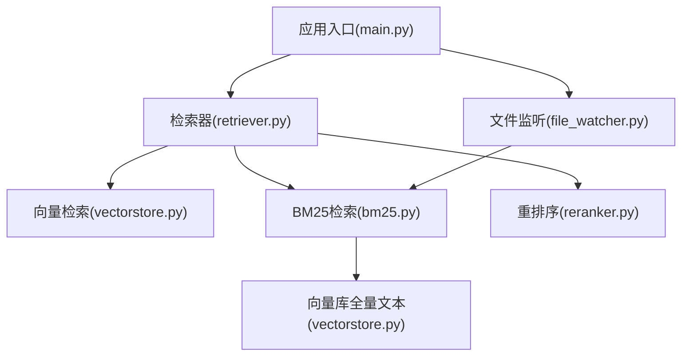
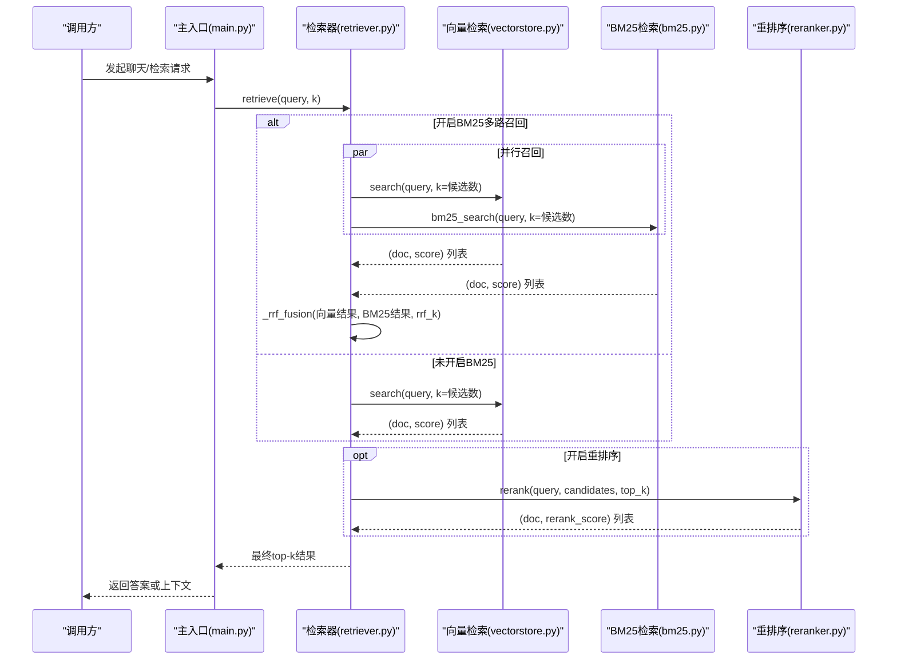
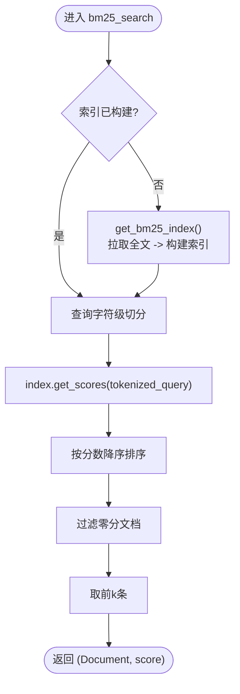
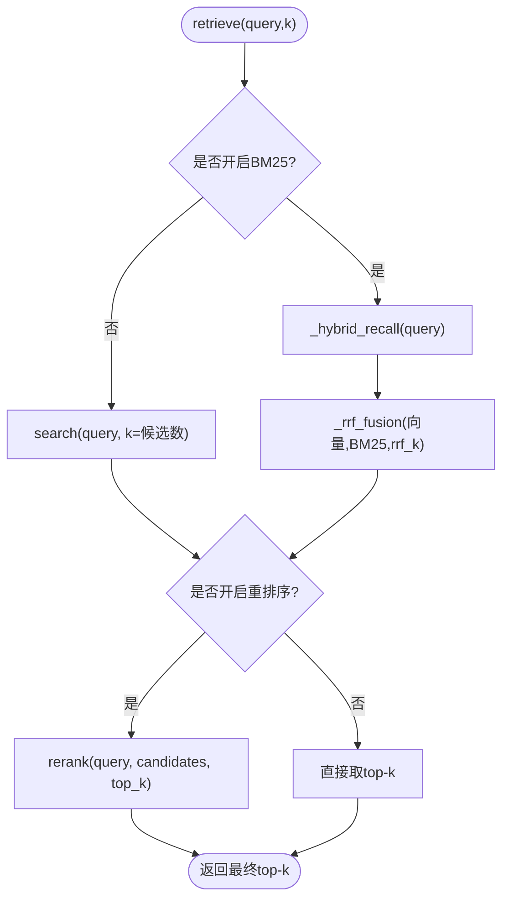
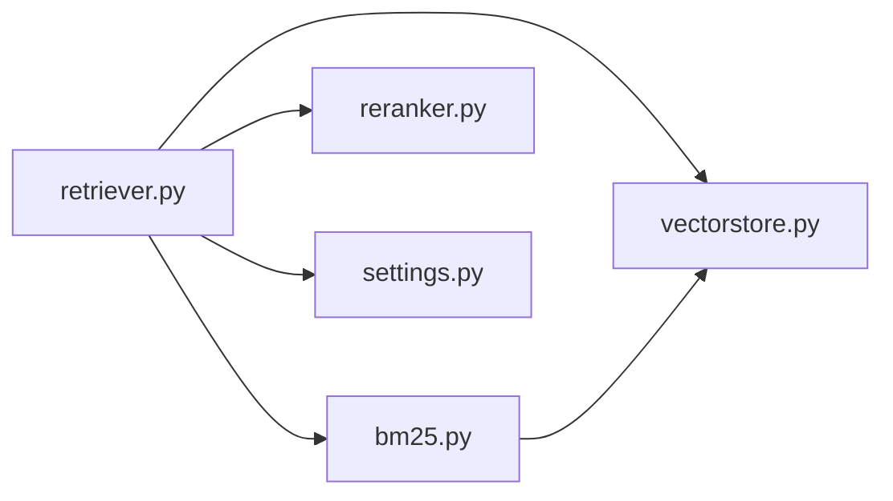

# BM25关键词检索

<cite>
**本文引用的文件**
- [rag/bm25.py](file://rag/bm25.py)
- [rag/retriever.py](file://rag/retriever.py)
- [config/settings.py](file://config/settings.py)
- [rag/vectorstore.py](file://rag/vectorstore.py)
- [rag/reranker.py](file://rag/reranker.py)
- [main.py](file://main.py)
- [rag/file_watcher.py](file://rag/file_watcher.py)
</cite>

## 目录
1. [简介](#简介)
2. [项目结构](#项目结构)
3. [核心组件](#核心组件)
4. [架构总览](#架构总览)
5. [详细组件分析](#详细组件分析)
6. [依赖关系分析](#依赖关系分析)
7. [性能考量](#性能考量)
8. [故障排查指南](#故障排查指南)
9. [结论](#结论)
10. [附录：API与配置参考](#附录api与配置参考)

## 简介
本模块在现有向量检索基础上，引入BM25关键词检索作为多路召回之一，并通过RRF（Reciprocal Rank Fusion）融合策略将向量检索与BM25结果合并排序，最终可进入CrossEncoder重排序阶段以提升相关性。该方案兼顾语义匹配与精确关键词命中，适用于企业知识库问答、文档检索等场景。

## 项目结构
- BM25实现位于 rag/bm25.py，提供进程内单例索引构建与查询接口。
- 检索编排位于 rag/retriever.py，负责多路召回、RRF融合、可选重排序与上下文格式化。
- 配置集中在 config/settings.py，控制是否启用BM25、候选数、RRF常数等。
- 向量库封装在 rag/vectorstore.py，提供从Milvus拉取全部文本文档的能力以构建BM25索引。
- 启动预热与运行时自动同步分别在 main.py 与 rag/file_watcher.py 中完成。

图表来源
- [main.py:80-135](file://main.py#L80-L135)
- [rag/retriever.py:18-52](file://rag/retriever.py#L18-L52)
- [rag/bm25.py:22-66](file://rag/bm25.py#L22-L66)
- [rag/vectorstore.py:248-281](file://rag/vectorstore.py#L248-L281)
- [rag/file_watcher.py:71-105](file://rag/file_watcher.py#L71-L105)

章节来源
- [main.py:80-135](file://main.py#L80-L135)
- [rag/retriever.py:18-52](file://rag/retriever.py#L18-L52)
- [rag/bm25.py:22-66](file://rag/bm25.py#L22-L66)
- [rag/vectorstore.py:248-281](file://rag/vectorstore.py#L248-L281)
- [rag/file_watcher.py:71-105](file://rag/file_watcher.py#L71-L105)

## 核心组件
- BM25索引与检索：基于 rank_bm25.BM25Okapi，中文按字符级切分，进程内单例缓存；首次构建时从向量库拉取全部文本文档。
- 检索编排：支持“仅向量”“向量+BM25 RRF融合”“向量+BM25 RRF融合+重排序”三种模式，由配置开关控制。
- 重排序：使用 CrossEncoder（BAAI/bge-reranker-base）对候选进行精排，提升最终top-k质量。
- 启动预热与增量同步：服务启动时预热BM25索引；运行时文件变更触发增量入库并重置BM25索引，保证一致性。

章节来源
- [rag/bm25.py:22-106](file://rag/bm25.py#L22-L106)
- [rag/retriever.py:18-110](file://rag/retriever.py#L18-L110)
- [rag/reranker.py:30-98](file://rag/reranker.py#L30-L98)
- [main.py:80-135](file://main.py#L80-L135)
- [rag/file_watcher.py:71-105](file://rag/file_watcher.py#L71-L105)

## 架构总览
下图展示一次检索请求的完整流程：根据配置选择是否开启BM25多路召回；若开启则并行执行向量检索与BM25检索，通过RRF融合得到候选集；随后可选地进入CrossEncoder重排序，输出最终top-k。

图表来源
- [rag/retriever.py:18-52](file://rag/retriever.py#L18-L52)
- [rag/retriever.py:55-110](file://rag/retriever.py#L55-L110)
- [rag/bm25.py:69-97](file://rag/bm25.py#L69-L97)
- [rag/vectorstore.py:164-184](file://rag/vectorstore.py#L164-L184)
- [rag/reranker.py:54-98](file://rag/reranker.py#L54-L98)

## 详细组件分析

### BM25索引与检索（rag/bm25.py）
- 索引构建
  - 首次调用 get_bm25_index() 时，从向量库拉取全部文本文档（过滤图像与空文本），构造 tokenized 列表（中文按字符级切分），初始化 BM25Okapi。
  - 进程内单例缓存，避免重复构建；重启需重建。
- 查询流程
  - bm25_search(query, k) 将查询按字符切分，调用 index.get_scores 获取分数，按分数降序取 top-k，过滤零分结果。
- 重置机制
  - reset_bm25_index() 清空单例，配合文件监听在增量入库后重建索引，确保检索一致性。

图表来源
- [rag/bm25.py:22-66](file://rag/bm25.py#L22-L66)
- [rag/bm25.py:69-106](file://rag/bm25.py#L69-L106)

章节来源
- [rag/bm25.py:22-106](file://rag/bm25.py#L22-L106)

### 检索编排与RRF融合（rag/retriever.py）
- 多路召回策略
  - 当配置开启BM25时，并行执行向量检索与BM25检索，分别取各自候选数。
  - 任一为空时回退到另一路结果；两者均非空时进行RRF融合。
- RRF融合算法
  - 公式：score(d) = Σ 1/(rrf_k + rank)，rank从1开始。
  - 按文档内容去重合并分数，最终按融合分数降序排列。
- 重排序
  - 若开启重排序，对融合后的候选用CrossEncoder打分并取top-k。
- 上下文格式化
  - format_context 将检索结果统一归一化显示相关度（向量距离越小越相关，BM25/CrossEncoder分数越大越相关）。

图表来源
- [rag/retriever.py:18-52](file://rag/retriever.py#L18-L52)
- [rag/retriever.py:55-110](file://rag/retriever.py#L55-L110)

章节来源
- [rag/retriever.py:18-110](file://rag/retriever.py#L18-L110)

### 向量库与全量文本拉取（rag/vectorstore.py）
- 向量检索：search 返回 (Document, L2距离) 列表，并按阈值过滤低相关度结果。
- 全量文本拉取：get_all_text_documents 用于构建BM25索引，跳过图像与空文本，保留metadata供后续展示与过滤。

章节来源
- [rag/vectorstore.py:164-184](file://rag/vectorstore.py#L164-L184)
- [rag/vectorstore.py:248-281](file://rag/vectorstore.py#L248-L281)

### 重排序（rag/reranker.py）
- 模型加载：延迟初始化 CrossEncoder，默认模型为 BAAI/bge-reranker-base，设备与长度可配。
- 打分逻辑：将 query 与每个候选文档拼接成 pair 输入模型，返回分数列表，按分数降序取 top-k。
- 容错：失败时回退到原始候选列表的前k条。

章节来源
- [rag/reranker.py:30-98](file://rag/reranker.py#L30-L98)

### 启动预热与运行时同步（main.py, rag/file_watcher.py）
- 启动预热：warmup_vectorstore 在启动时检查向量库并自动入库；若开启BM25，则预热构建索引，降低首请求延迟。
- 运行时同步：文件监听器检测到 docs_dir 变化后，防抖触发增量入库；若开启BM25，则重置索引，下次检索重新构建。

章节来源
- [main.py:80-135](file://main.py#L80-L135)
- [rag/file_watcher.py:71-105](file://rag/file_watcher.py#L71-L105)

## 依赖关系分析
- BM25依赖
  - 外部库：rank_bm25（BM25Okapi）
  - 内部依赖：vectorstore.get_all_text_documents 提供构建索引所需的全部文本文档
- 检索编排依赖
  - vectorstore.search 提供向量检索
  - reranker.rerank 提供可选的精排
- 配置依赖
  - settings 中的 BM25 开关、候选数、RRF常数等决定检索路径与参数

图表来源
- [rag/retriever.py:18-52](file://rag/retriever.py#L18-L52)
- [rag/bm25.py:22-66](file://rag/bm25.py#L22-L66)
- [rag/vectorstore.py:248-281](file://rag/vectorstore.py#L248-L281)
- [config/settings.py:83-90](file://config/settings.py#L83-L90)

章节来源
- [rag/retriever.py:18-52](file://rag/retriever.py#L18-L52)
- [rag/bm25.py:22-66](file://rag/bm25.py#L22-L66)
- [rag/vectorstore.py:248-281](file://rag/vectorstore.py#L248-L281)
- [config/settings.py:83-90](file://config/settings.py#L83-L90)

## 性能考量
- 索引构建成本
  - 首次构建需拉取全部文本文档并构建BM25索引，建议服务启动时预热，避免首请求阻塞。
- 查询性能
  - BM25按字符级切分，无需额外分词依赖，查询开销较低；可通过调整候选数与RRF常数平衡召回与速度。
- 融合策略
  - RRF仅依赖排名，不依赖原始分数尺度，天然兼容向量距离与BM25分数差异。
- 重排序开销
  - CrossEncoder计算量大，仅在需要高精度时开启；可通过候选数与top-k控制整体延迟。
- 内存占用
  - 索引与文档列表为进程内单例，注意服务重启会重建；合理设置候选数以控制内存峰值。

[本节为通用性能讨论，不直接分析具体代码行]

## 故障排查指南
- 无法导入 rank_bm25
  - 现象：日志提示未安装，BM25不可用。
  - 处理：安装依赖后重试；或关闭BM25开关回退到纯向量检索。
- 向量库无文本文档
  - 现象：BM25索引为空，检索返回空列表。
  - 处理：确认向量库已入库且包含文本；必要时执行全量重建。
- 首请求延迟高
  - 现象：首次检索耗时较长。
  - 处理：开启服务启动预热；确保BM25索引已预热。
- 运行时数据不一致
  - 现象：文件变更后检索结果未更新。
  - 处理：确认文件监听已启动；检查防抖时间；确认BM25索引已重置并在下次检索时重建。

章节来源
- [rag/bm25.py:56-66](file://rag/bm25.py#L56-L66)
- [rag/bm25.py:79-97](file://rag/bm25.py#L79-L97)
- [rag/file_watcher.py:71-105](file://rag/file_watcher.py#L71-L105)
- [main.py:110-124](file://main.py#L110-L124)

## 结论
本实现通过BM25关键词检索与向量检索的多路召回，结合RRF融合与可选的重排序，显著提升了精确匹配与语义匹配的召回能力与排序质量。配合启动预热与运行时自动同步，既保证了首请求体验，又实现了知识库的实时更新。在生产环境中，建议根据数据规模与延迟要求调优候选数、RRF常数与重排序开关，以获得最佳性价比。

[本节为总结性内容，不直接分析具体代码行]

## 附录：API与配置参考

### API接口
- BM25检索
  - 函数：bm25_search(query, k)
  - 功能：返回 (Document, score) 列表，score越大越相关；索引未构建或无命中时返回空列表。
  - 参考路径：[bm25_search:69-97](file://rag/bm25.py#L69-L97)
- 检索编排
  - 函数：retrieve(query, k)
  - 功能：根据配置执行向量检索、BM25多路召回、RRF融合与可选重排序，返回最终top-k。
  - 参考路径：[retrieve:18-52](file://rag/retriever.py#L18-L52)
- 上下文格式化
  - 函数：format_context(docs)
  - 功能：将检索结果格式化为上下文字符串，含来源标记与归一化相关度。
  - 参考路径：[format_context:113-133](file://rag/retriever.py#L113-L133)
- 一站式检索
  - 函数：retrieve_context(query, k)
  - 功能：检索并格式化，直接返回上文字符串。
  - 参考路径：[retrieve_context:136-140](file://rag/retriever.py#L136-L140)

### 配置项（BM25相关）
- rag_bm25_enabled：是否开启BM25多路召回（布尔）
- rag_bm25_candidate_count：BM25召回候选数（整数）
- rag_rrf_k：RRF融合常数（整数，典型值60）
- 参考路径：[配置定义:83-90](file://config/settings.py#L83-L90)

### 最佳实践
- 开启BM25时务必在服务启动时预热索引，降低首请求延迟。
- 根据知识库规模与延迟目标调整候选数与RRF常数；较大集合可适当增大候选数以提升召回。
- 在高精度场景开启重排序；在低延迟场景可关闭重排序或直接使用向量检索。
- 运行时文件变更会自动触发增量入库与BM25索引重置，确保检索一致性。

章节来源
- [rag/retriever.py:18-140](file://rag/retriever.py#L18-L140)
- [rag/bm25.py:69-106](file://rag/bm25.py#L69-L106)
- [config/settings.py:83-90](file://config/settings.py#L83-L90)
- [main.py:110-124](file://main.py#L110-L124)
- [rag/file_watcher.py:71-105](file://rag/file_watcher.py#L71-L105)