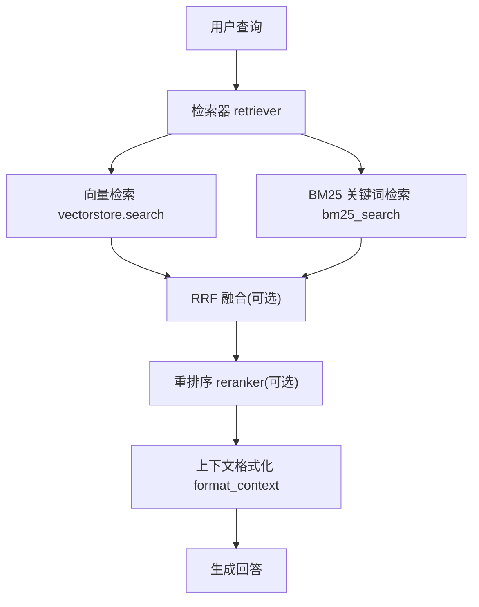
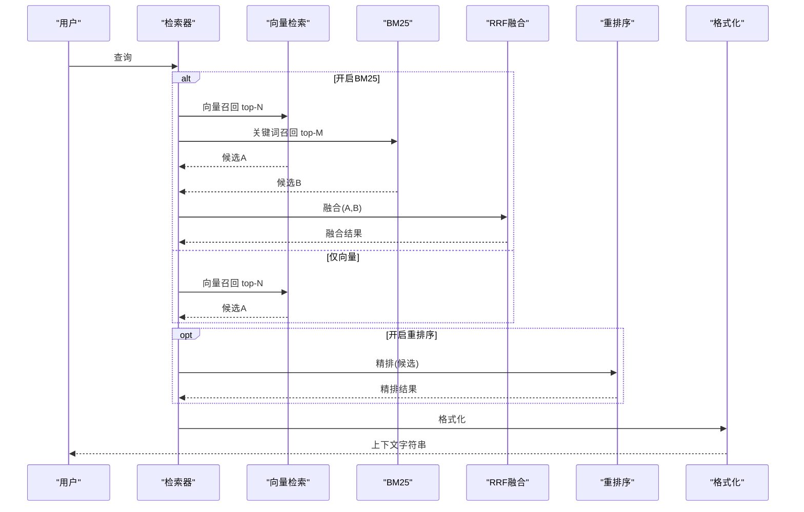
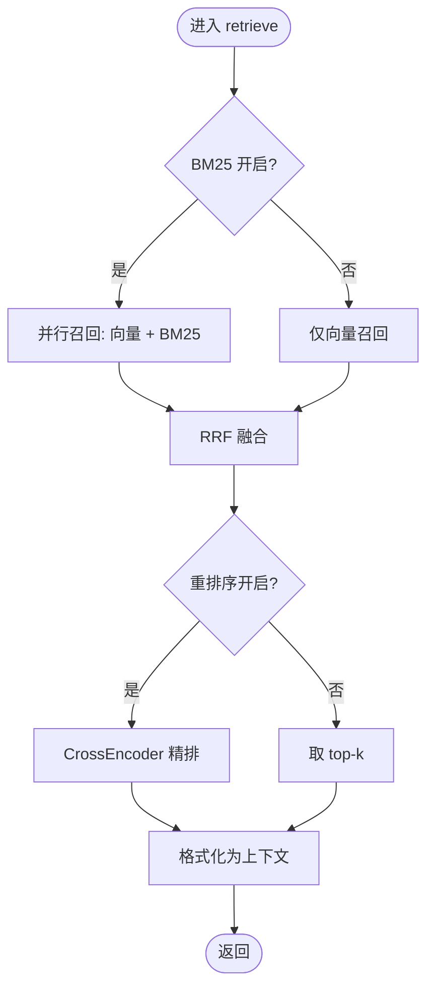
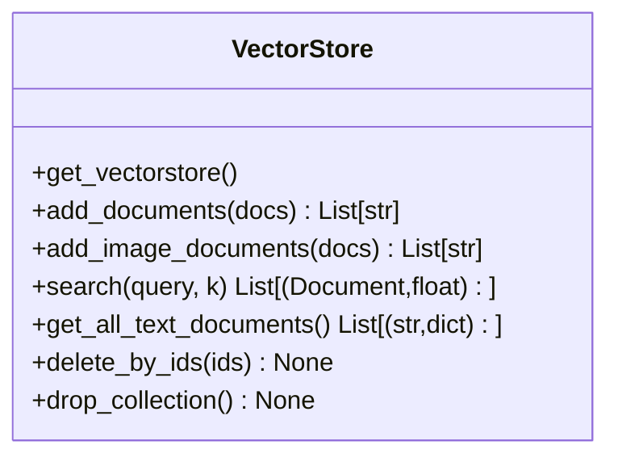
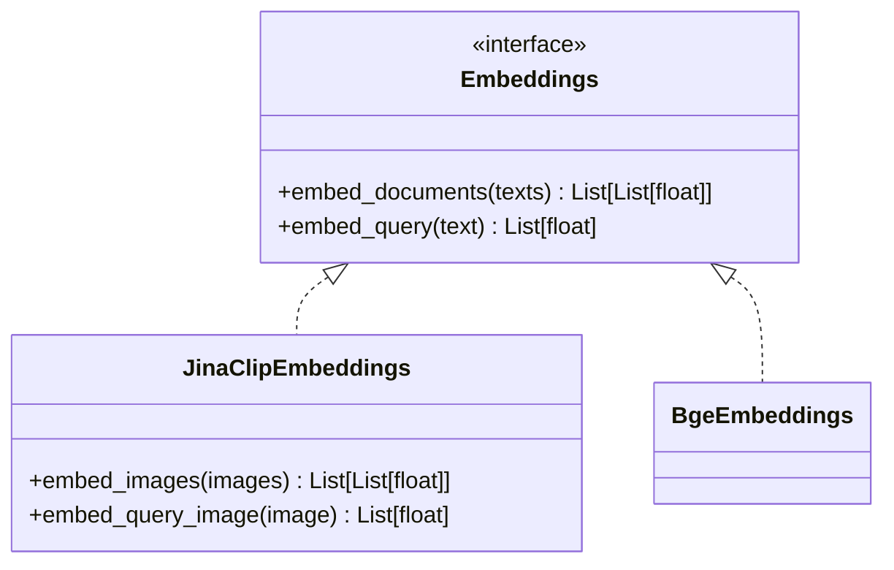
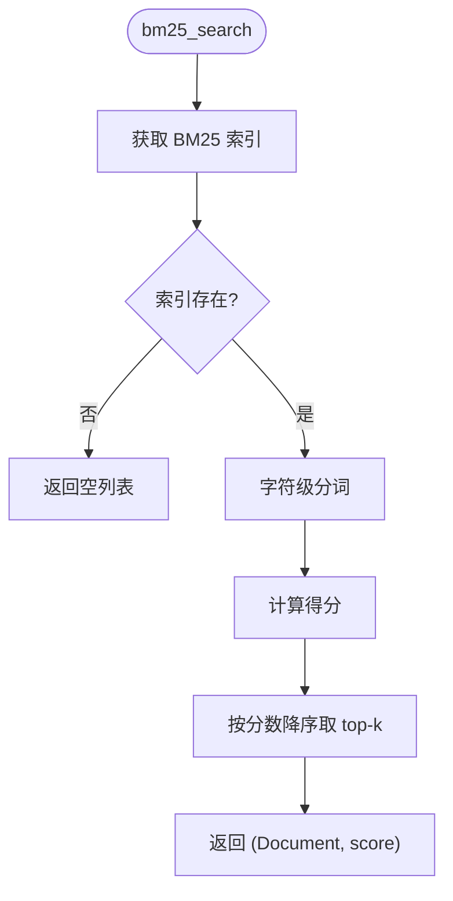
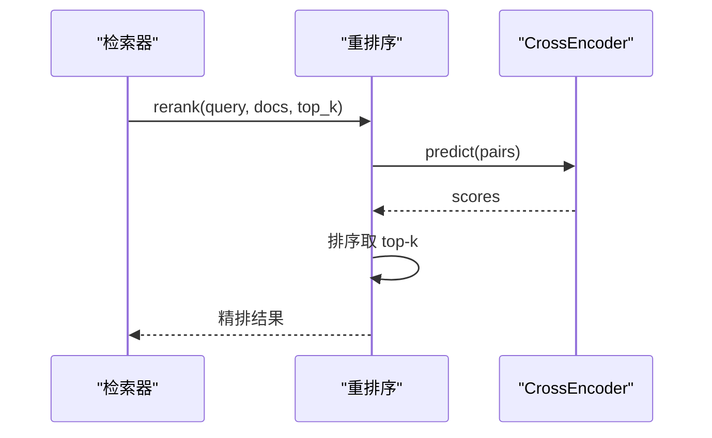
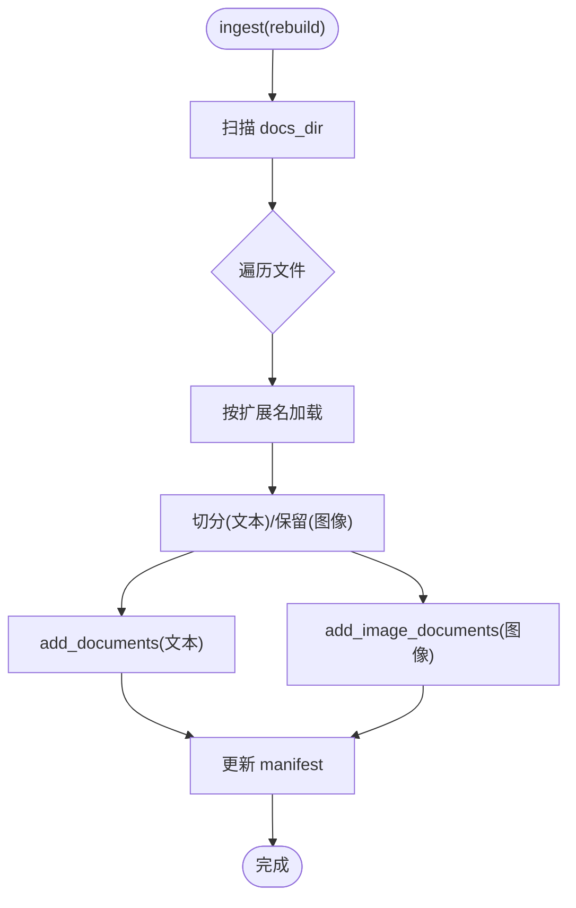
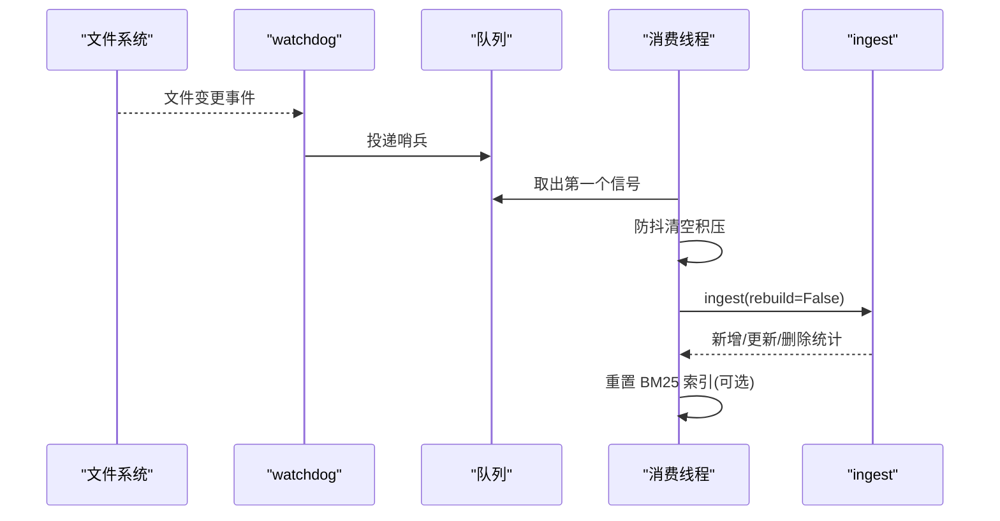
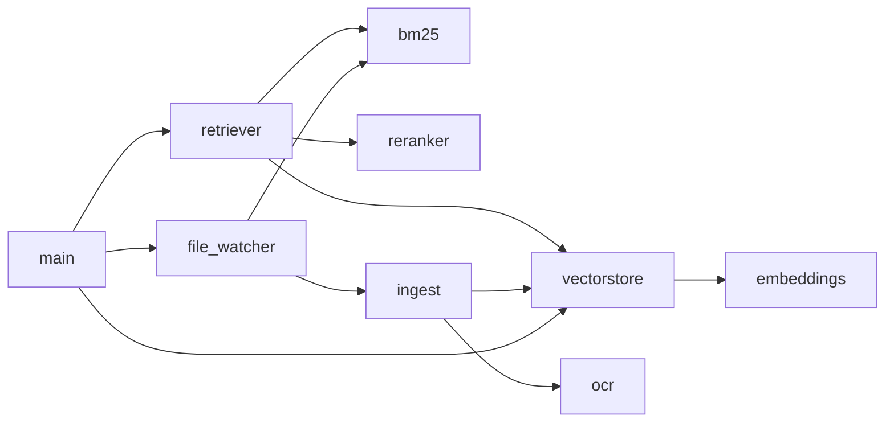

# RAG检索系统

<cite>
**本文引用的文件**
- [rag/retriever.py](file://rag/retriever.py)
- [rag/bm25.py](file://rag/bm25.py)
- [rag/reranker.py](file://rag/reranker.py)
- [rag/vectorstore.py](file://rag/vectorstore.py)
- [rag/embeddings.py](file://rag/embeddings.py)
- [config/settings.py](file://config/settings.py)
- [rag/ingest.py](file://rag/ingest.py)
- [rag/ocr.py](file://rag/ocr.py)
- [main.py](file://main.py)
- [rag/web_search.py](file://rag/web_search.py)
- [rag/file_watcher.py](file://rag/file_watcher.py)
- [requirements.txt](file://requirements.txt)
</cite>

## 目录
1. [简介](#简介)
2. [项目结构](#项目结构)
3. [核心组件](#核心组件)
4. [架构总览](#架构总览)
5. [详细组件分析](#详细组件分析)
6. [依赖关系分析](#依赖关系分析)
7. [性能与优化](#性能与优化)
8. [故障排查指南](#故障排查指南)
9. [结论](#结论)
10. [附录：配置参数速查](#附录：配置参数速查)

## 简介
本RAG检索系统面向多模态知识库，提供“向量检索 + BM25关键词检索 + CrossEncoder重排序”的两阶段检索能力，并支持PDF/图片OCR、Milvus Lite本地持久化、运行时自动增量入库与联网搜索。系统通过可配置开关灵活组合检索策略，兼顾召回率与相关性，为下游生成节点提供高质量上下文。

## 项目结构
- 检索层：retriever（编排）、vectorstore（Milvus封装）、embeddings（Jina CLIP/BGE）、bm25（关键词）、reranker（CrossEncoder）
- 数据层：ingest（文档加载/切分/入库）、ocr（OCR与PDF渲染）、file_watcher（监听变更触发增量入库）
- 服务层：main（FastAPI入口，启动预热、健康检查、流式接口）
- 配置层：settings（全局配置单例）
- 扩展：web_search（DuckDuckGo/百度双引擎）

图表来源
- [rag/retriever.py:18-52](file://rag/retriever.py#L18-L52)
- [rag/vectorstore.py:164-184](file://rag/vectorstore.py#L164-L184)
- [rag/bm25.py:69-97](file://rag/bm25.py#L69-L97)
- [rag/reranker.py:54-97](file://rag/reranker.py#L54-L97)

章节来源
- [main.py:45-135](file://main.py#L45-L135)
- [config/settings.py:50-100](file://config/settings.py#L50-L100)

## 核心组件
- 检索器（retriever）：统一入口，根据配置选择多路召回与是否重排序，输出带相关度的文档列表或上下文字符串
- 向量库（vectorstore）：基于LangChain Milvus封装，支持文本/图像混合存储与检索，内置分数过滤
- Embedding（embeddings）：Jina CLIP v2（多模态）与BGE（纯文本）两种实现，延迟加载、CPU/GPU设备可配
- BM25（bm25）：内存索引，字符级分词，与向量检索互补提升精确匹配召回
- 重排序（reranker）：CrossEncoder精排，显著提升相关性；失败回退原始结果
- 文档入库（ingest）：支持txt/md/pdf/docx/xlsx/图片，增量更新，清单驱动
- OCR（ocr）：easyocr识别图片/扫描页，pypdfium2渲染PDF页面
- 文件监听（file_watcher）：watchdog事件+防抖队列，自动触发增量入库并重置BM25索引
- 联网搜索（web_search）：DuckDuckGo优先，百度备用，结果格式化供生成使用

章节来源
- [rag/retriever.py:18-139](file://rag/retriever.py#L18-L139)
- [rag/vectorstore.py:29-184](file://rag/vectorstore.py#L29-L184)
- [rag/embeddings.py:29-179](file://rag/embeddings.py#L29-L179)
- [rag/bm25.py:22-106](file://rag/bm25.py#L22-L106)
- [rag/reranker.py:30-97](file://rag/reranker.py#L30-L97)
- [rag/ingest.py:34-274](file://rag/ingest.py#L34-L274)
- [rag/ocr.py:26-142](file://rag/ocr.py#L26-L142)
- [rag/file_watcher.py:34-151](file://rag/file_watcher.py#L34-L151)
- [rag/web_search.py:19-134](file://rag/web_search.py#L19-L134)

## 架构总览
系统采用“两阶段检索 + 可选多路召回”的架构：
- 第一阶段：向量检索（Milvus + Embedding）召回top-N候选
- 第二阶段：CrossEncoder重排序精排取top-k；若开启BM25，则先进行向量与BM25并行召回，经RRF融合后再重排序
- 上下文格式化：将检索结果转换为带来源与相关度的字符串，供生成节点使用

图表来源
- [rag/retriever.py:18-52](file://rag/retriever.py#L18-L52)
- [rag/vectorstore.py:164-184](file://rag/vectorstore.py#L164-L184)
- [rag/bm25.py:69-97](file://rag/bm25.py#L69-L97)
- [rag/reranker.py:54-97](file://rag/reranker.py#L54-L97)

## 详细组件分析

### 检索器（retriever）
- 功能：根据配置决定多路召回与重排序策略，返回(top-k)文档或上下文字符串
- 关键流程：
  - 若开启BM25：并行执行向量检索与BM25检索，使用RRF融合
  - 否则：仅向量检索
  - 若开启重排序：对候选进行CrossEncoder精排
  - 格式化：统一归一化分数到0~1区间，便于展示与阈值控制
- 复杂度：RRF融合O(n+m)，重排序O(k·log k)

图表来源
- [rag/retriever.py:18-52](file://rag/retriever.py#L18-L52)
- [rag/retriever.py:78-110](file://rag/retriever.py#L78-L110)
- [rag/retriever.py:113-139](file://rag/retriever.py#L113-L139)

章节来源
- [rag/retriever.py:18-139](file://rag/retriever.py#L18-L139)

### 向量检索（vectorstore）
- 功能：Milvus Lite本地持久化，支持文本与图像混合存储与检索；写入加锁保证并发安全
- 关键点：
  - 初始化时配置gRPC keepalive避免空闲连接被服务端断开
  - add_documents/add_image_documents分别处理文本与图像，图像走多模态Embedding路径
  - search支持分数过滤，低于阈值的候选丢弃
  - get_all_text_documents用于构建BM25索引

图表来源
- [rag/vectorstore.py:29-184](file://rag/vectorstore.py#L29-L184)
- [rag/vectorstore.py:248-282](file://rag/vectorstore.py#L248-L282)

章节来源
- [rag/vectorstore.py:29-282](file://rag/vectorstore.py#L29-L282)

### Embedding（embeddings）
- JinaClipEmbeddings：多模态模型，文本与图像映射到同一向量空间，维度1024，支持embed_documents/embed_query/embed_images
- BgeEmbeddings：纯文本模型，速度快，适合纯文本知识库场景
- 延迟加载：首次调用时才下载/加载模型，减少启动开销

图表来源
- [rag/embeddings.py:29-179](file://rag/embeddings.py#L29-L179)

章节来源
- [rag/embeddings.py:29-179](file://rag/embeddings.py#L29-L179)

### BM25关键词检索（bm25）
- 功能：从向量库拉取文本文档构建内存索引，字符级分词，无需额外中文分词依赖
- 特点：进程内单例，重启需重建；检索时返回(score越大越相关)
- 适用场景：精确匹配、专有名词、短查询等

图表来源
- [rag/bm25.py:22-106](file://rag/bm25.py#L22-L106)

章节来源
- [rag/bm25.py:22-106](file://rag/bm25.py#L22-L106)

### 重排序（reranker）
- 功能：使用CrossEncoder对候选逐对打分，精度更高但计算量更大
- 特性：延迟加载模型，失败回退原始结果；支持设备与最大长度配置

图表来源
- [rag/reranker.py:30-97](file://rag/reranker.py#L30-L97)

章节来源
- [rag/reranker.py:30-97](file://rag/reranker.py#L30-L97)

### 文档入库与OCR（ingest + ocr）
- 支持格式：txt/md/pdf/docx/xlsx/图片
- PDF处理：文本优先，文本过少则OCR兜底；同时为每页生成图像Document以支持跨模态检索
- 增量入库：基于manifest记录文件哈希与chunk_ids，支持删除孤儿chunk
- OCR：easyocr识别图片/扫描页，pypdfium2渲染PDF页面

图表来源
- [rag/ingest.py:289-388](file://rag/ingest.py#L289-L388)
- [rag/ocr.py:94-142](file://rag/ocr.py#L94-L142)

章节来源
- [rag/ingest.py:34-402](file://rag/ingest.py#L34-L402)
- [rag/ocr.py:26-142](file://rag/ocr.py#L26-L142)

### 运行时自动同步（file_watcher）
- 机制：watchdog监听docs_dir增删改，事件入队；消费线程防抖后触发增量入库并重置BM25索引
- 优势：无需重启服务即可同步最新知识库内容

图表来源
- [rag/file_watcher.py:34-151](file://rag/file_watcher.py#L34-L151)
- [rag/ingest.py:289-388](file://rag/ingest.py#L289-L388)

章节来源
- [rag/file_watcher.py:34-151](file://rag/file_watcher.py#L34-L151)

### 联网搜索（web_search）
- 双引擎：DuckDuckGo优先，百度备用；结果统一格式化为上下文
- 用途：时效性问题或知识库未覆盖内容的补充

章节来源
- [rag/web_search.py:19-134](file://rag/web_search.py#L19-L134)

## 依赖关系分析
- retriever依赖vectorstore、bm25、reranker
- vectorstore依赖embeddings
- ingest依赖vectorstore、ocr
- file_watcher依赖ingest与bm25（重置索引）
- main在启动时预热LLM、向量库、BM25索引，并启动文件监听

图表来源
- [rag/retriever.py:15-52](file://rag/retriever.py#L15-L52)
- [rag/vectorstore.py:18-184](file://rag/vectorstore.py#L18-L184)
- [rag/ingest.py:19-274](file://rag/ingest.py#L19-L274)
- [rag/file_watcher.py:22-100](file://rag/file_watcher.py#L22-L100)
- [main.py:45-135](file://main.py#L45-L135)

章节来源
- [requirements.txt:1-53](file://requirements.txt#L1-L53)

## 性能与优化
- 模型加载优化：Embedding与重排序模型均延迟加载，避免启动阻塞
- 向量库连接优化：禁用无调用时的keepalive ping，防止Milvus Lite断连
- 写入并发保护：add/delete操作加锁，避免与文件监听消费线程冲突
- 检索优化：
  - 向量检索支持分数过滤，减少低质上下文注入
  - BM25字符级分词，降低分词依赖与延迟
  - RRF融合不依赖原始分数语义，兼容不同检索器
  - 重排序失败回退，保障可用性
- 运行时优化：
  - 启动预热LLM连接池与向量库，降低首请求延迟
  - 文件监听防抖，避免频繁入库
  - 流式接口整体超时保护，防止长连接卡死

[本节为通用性能建议，不直接分析具体文件]

## 故障排查指南
- 向量库为空但存在清单：启动时检测并触发全量重建
- BM25索引为空：检查向量库是否有文本文档；必要时重置索引
- 重排序失败：日志记录并回退原始结果；检查模型下载与设备配置
- 文件监听未生效：确认自动同步开关与防抖时间；检查docs_dir权限
- 流式响应超时：调整stream_timeout；检查网络与LLM服务状态

章节来源
- [main.py:80-135](file://main.py#L80-L135)
- [rag/bm25.py:22-66](file://rag/bm25.py#L22-L66)
- [rag/reranker.py:77-97](file://rag/reranker.py#L77-L97)
- [rag/file_watcher.py:107-151](file://rag/file_watcher.py#L107-L151)
- [main.py:228-314](file://main.py#L228-L314)

## 结论
本RAG检索系统通过“向量检索 + BM25 + CrossEncoder重排序”的组合策略，在多模态知识库场景下实现了高召回与高相关性的平衡。系统具备灵活的配置开关、健壮的容错机制与高效的运行时同步能力，适合企业级知识问答与智能助手场景。开发者可通过调整检索策略、模型与阈值参数，持续优化检索效果与性能。

[本节为总结性内容，不直接分析具体文件]

## 附录：配置参数速查
- 嵌入模型与设备：embedding_model, embedding_device
- 向量库：milvus_db_file, milvus_collection, milvus_index_type, milvus_metric_type, rag_top_k, rag_score_filter
- 切片与文档目录：rag_chunk_size, rag_chunk_overlap, rag_docs_dir
- 自动同步：rag_auto_sync_enabled, rag_auto_sync_debounce
- 多路召回：rag_bm25_enabled, rag_bm25_candidate_count, rag_rrf_k
- 重排序：rerank_enabled, rerank_model, rerank_device, rerank_candidate_count, rerank_top_k
- OCR：ocr_languages, ocr_use_gpu, ocr_min_text_length, supported_file_extensions
- 联网搜索：web_search_enabled, web_search_max_results, web_search_timeout

章节来源
- [config/settings.py:50-108](file://config/settings.py#L50-L108)