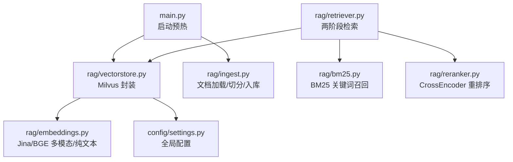
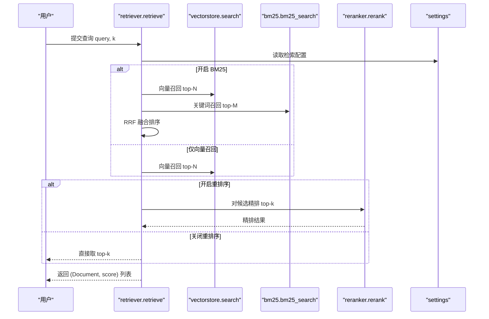
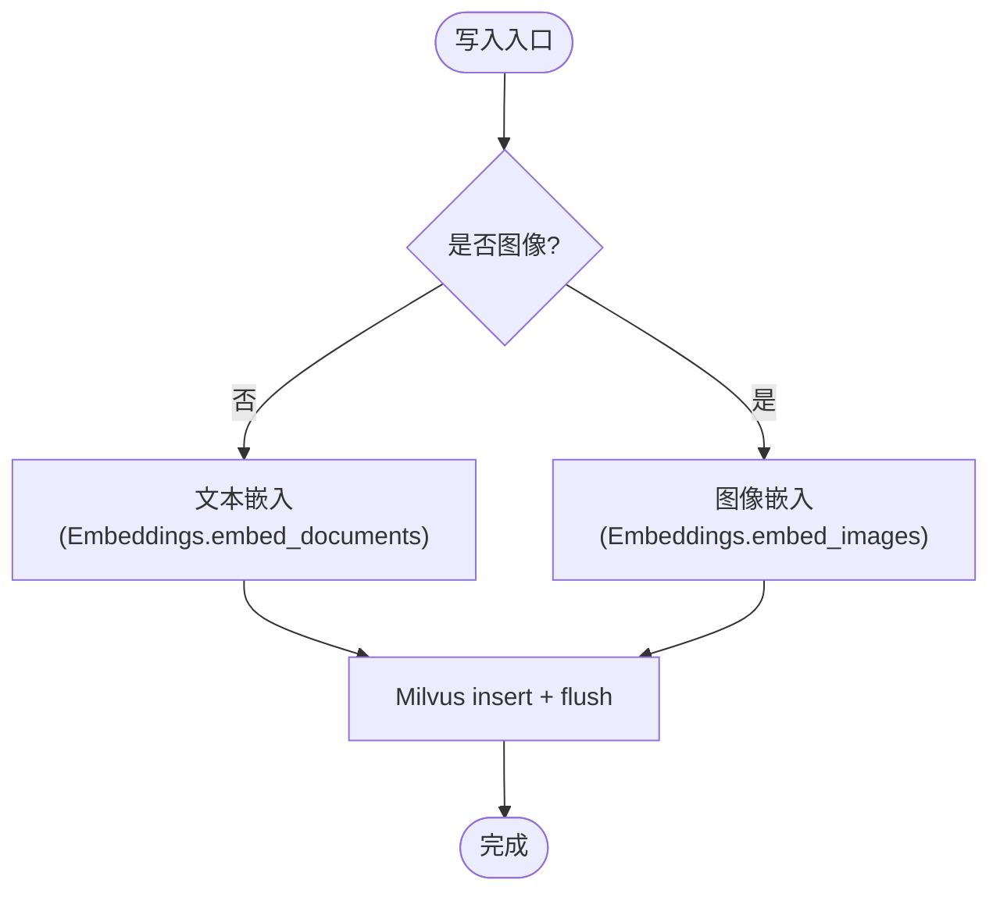
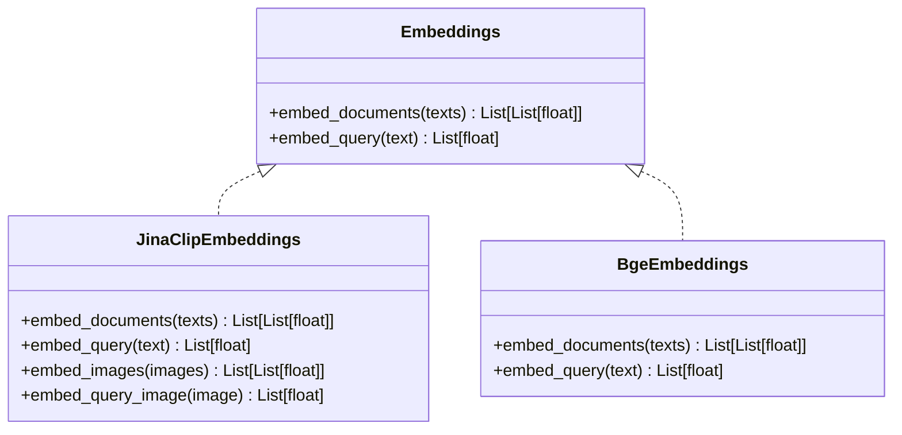
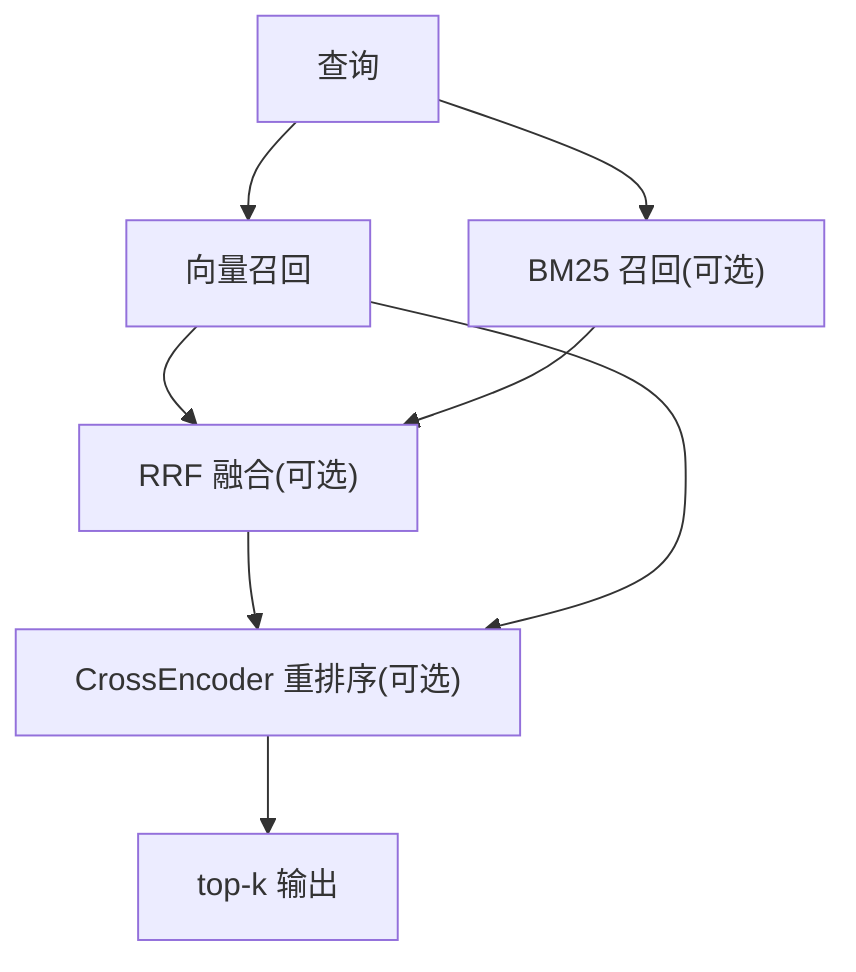
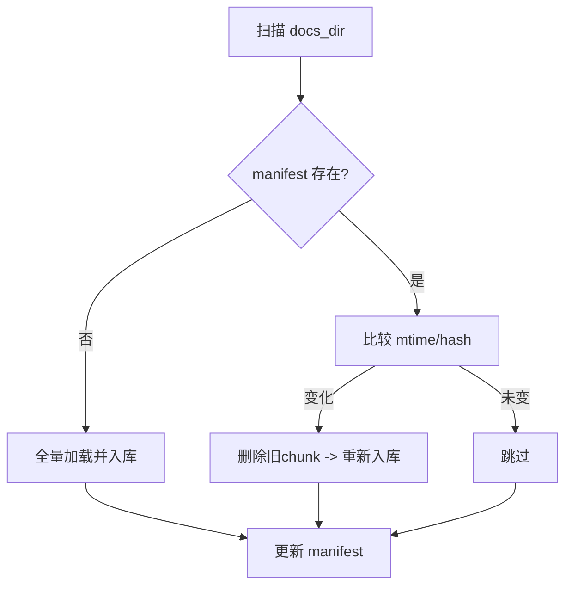
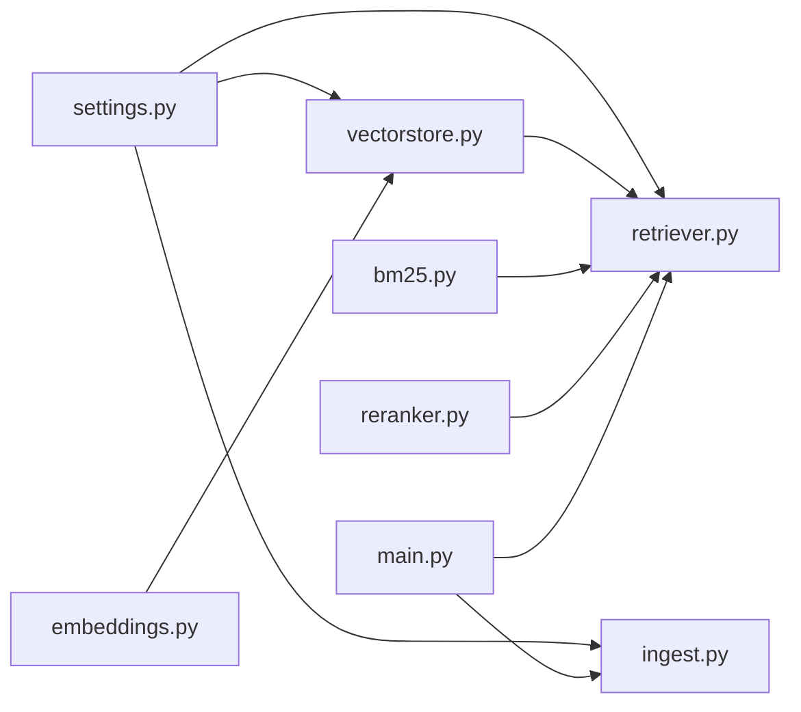

# 向量检索

<cite>
**本文引用的文件**
- [vectorstore.py](file://rag/vectorstore.py)
- [embeddings.py](file://rag/embeddings.py)
- [retriever.py](file://rag/retriever.py)
- [bm25.py](file://rag/bm25.py)
- [reranker.py](file://rag/reranker.py)
- [ingest.py](file://rag/ingest.py)
- [settings.py](file://config/settings.py)
- [main.py](file://main.py)
</cite>

## 目录
1. [简介](#简介)
2. [项目结构](#项目结构)
3. [核心组件](#核心组件)
4. [架构总览](#架构总览)
5. [详细组件分析](#详细组件分析)
6. [依赖关系分析](#依赖关系分析)
7. [性能与调优](#性能与调优)
8. [故障排查](#故障排查)
9. [结论](#结论)
10. [附录：配置参数速查](#附录：配置参数速查)

## 简介
本模块实现基于 Milvus Lite 的本地化向量检索，支持文本与图像的多模态统一向量空间。系统通过 Embedding 模型将查询与文档编码为向量，使用 Milvus 进行相似度检索；可选地结合 BM25 关键词召回与 CrossEncoder 重排序，形成“召回-精排”的两阶段检索链路。启动时自动检查并增量入库，运行时可监听知识库变更并自动同步。

## 项目结构
向量检索相关代码主要位于 rag 目录下，配合 config/settings.py 提供全局配置，main.py 在应用启动时完成向量库预热与索引构建。

图表来源
- [main.py:80-135](file://main.py#L80-L135)
- [vectorstore.py:29-76](file://rag/vectorstore.py#L29-L76)
- [embeddings.py:164-179](file://rag/embeddings.py#L164-L179)
- [retriever.py:18-52](file://rag/retriever.py#L18-L52)
- [bm25.py:22-66](file://rag/bm25.py#L22-L66)
- [reranker.py:30-51](file://rag/reranker.py#L30-L51)
- [settings.py:50-100](file://config/settings.py#L50-L100)

章节来源
- [main.py:80-135](file://main.py#L80-L135)
- [vectorstore.py:29-76](file://rag/vectorstore.py#L29-L76)
- [settings.py:50-100](file://config/settings.py#L50-L100)

## 核心组件
- Milvus 向量库封装：提供单例初始化、文档写入（文本/图像）、检索、删除、统计等能力，持久化到本地 .db 文件（Milvus Lite）。
- Embedding 模型：支持 Jina CLIP v2（多模态）与 BGE（纯文本），按配置自动选择，输出 L2 归一化向量。
- 检索器：两阶段流程，向量召回 + 可选 BM25 融合 + 可选 CrossEncoder 重排序，最终返回 top-k 结果。
- 入库管线：支持多种文件格式加载、OCR、切片、增量/全量入库，维护清单以追踪文件指纹与 chunk id。
- 配置管理：集中管理 Milvus、Embedding、检索、重排序、OCR、联网搜索等参数。

章节来源
- [vectorstore.py:29-190](file://rag/vectorstore.py#L29-L190)
- [embeddings.py:29-179](file://rag/embeddings.py#L29-L179)
- [retriever.py:18-139](file://rag/retriever.py#L18-L139)
- [ingest.py:185-388](file://rag/ingest.py#L185-L388)
- [settings.py:50-100](file://config/settings.py#L50-L100)

## 架构总览
下图展示了从用户查询到返回上下文的完整调用链，包括向量检索、BM25 召回、RRF 融合、重排序与上下文格式化。

图表来源
- [retriever.py:18-52](file://rag/retriever.py#L18-L52)
- [vectorstore.py:164-190](file://rag/vectorstore.py#L164-L190)
- [bm25.py:69-97](file://rag/bm25.py#L69-L97)
- [reranker.py:54-98](file://rag/reranker.py#L54-L98)
- [settings.py:83-100](file://config/settings.py#L83-L100)

## 详细组件分析

### Milvus 向量库封装（vectorstore.py）
- 单例初始化：延迟创建 LangChain Milvus 实例，连接参数指向本地 .db 文件（Milvus Lite），启用动态字段以支持异构 metadata。
- 写入路径：add_documents 处理文本文档；add_image_documents 通过多模态 Embedding 的 embed_images 编码图像，并使用底层 client.insert 写入。
- 检索路径：search 调用 similarity_search_with_score，并按阈值过滤低相关度结果；get_retriever 返回 LangChain retriever。
- 运维能力：count_documents、drop_collection、delete_by_ids、get_all_text_documents（用于 BM25 索引构建）。

图表来源
- [vectorstore.py:79-161](file://rag/vectorstore.py#L79-L161)
- [embeddings.py:67-128](file://rag/embeddings.py#L67-L128)

章节来源
- [vectorstore.py:29-190](file://rag/vectorstore.py#L29-L190)
- [vectorstore.py:193-281](file://rag/vectorstore.py#L193-L281)

### Embedding 模型（embeddings.py）
- 多模态模型：JinaClipEmbeddings，文本与图像映射到同一向量空间（维度 1024），支持跨模态检索。
- 纯文本模型：BgeEmbeddings，使用 sentence-transformers，速度快，适合纯文本场景（维度 512）。
- 自动选择：get_embeddings 根据配置中的 embedding_model 名称自动选择模型；设备可通过 embedding_device 指定。
- 归一化：所有输出均进行 L2 归一化，便于距离度量。

图表来源
- [embeddings.py:29-179](file://rag/embeddings.py#L29-L179)

章节来源
- [embeddings.py:29-179](file://rag/embeddings.py#L29-L179)
- [settings.py:50-52](file://config/settings.py#L50-L52)

### 检索器与重排序（retriever.py, reranker.py）
- 两阶段检索：先向量召回（或向量+BM25 融合），再可选 CrossEncoder 精排。
- BM25 融合：当开启多路召回时，采用 RRF 融合策略合并向量与关键词召回结果。
- 重排序：使用 BAAI/bge-reranker-base 对候选逐对打分，提升相关性精度。
- 上下文格式化：将结果转换为带来源与相关度的字符串，供生成节点使用。

图表来源
- [retriever.py:18-139](file://rag/retriever.py#L18-L139)
- [bm25.py:69-97](file://rag/bm25.py#L69-L97)
- [reranker.py:54-98](file://rag/reranker.py#L54-L98)

章节来源
- [retriever.py:18-139](file://rag/retriever.py#L18-L139)
- [reranker.py:30-98](file://rag/reranker.py#L30-L98)

### 文档入库与增量同步（ingest.py）
- 多格式加载：支持 txt/md/pdf/docx/xlsx 及图片，PDF 优先文本，不足则 OCR；图片同时生成图像 Document。
- 切片策略：RecursiveCharacterTextSplitter，按配置控制块大小与重叠；图像文档不切分。
- 增量机制：维护 manifest 记录文件 hash/mtime/chunk_ids；修改时先删旧 chunk 再入库；删除时清理孤儿 chunk。
- 启动预热：应用启动时检测向量库是否为空，必要时触发全量重建；开启 BM25 时预热索引。

图表来源
- [ingest.py:289-388](file://rag/ingest.py#L289-L388)
- [main.py:80-135](file://main.py#L80-L135)

章节来源
- [ingest.py:185-388](file://rag/ingest.py#L185-L388)
- [main.py:80-135](file://main.py#L80-L135)

## 依赖关系分析
- vectorstore 依赖 embeddings 与 settings；retriever 依赖 vectorstore、bm25、reranker；ingest 依赖 vectorstore 与 settings；main 在启动时协调 ingest 与 BM25 预热。
- 关键耦合点：
  - 配置集中：所有路径均通过 get_settings() 获取参数，便于统一调优。
  - 单例模式：向量库、BM25 索引、重排序模型均为进程内单例，避免重复初始化开销。
  - 并发安全：写入操作加锁，避免文件监听线程与检索路径并发写入冲突。

图表来源
- [settings.py:50-100](file://config/settings.py#L50-L100)
- [vectorstore.py:29-76](file://rag/vectorstore.py#L29-L76)
- [retriever.py:18-52](file://rag/retriever.py#L18-L52)
- [ingest.py:289-388](file://rag/ingest.py#L289-L388)
- [main.py:80-135](file://main.py#L80-L135)

章节来源
- [settings.py:50-100](file://config/settings.py#L50-L100)
- [vectorstore.py:29-76](file://rag/vectorstore.py#L29-L76)
- [retriever.py:18-52](file://rag/retriever.py#L18-L52)
- [ingest.py:289-388](file://rag/ingest.py#L289-L388)
- [main.py:80-135](file://main.py#L80-L135)

## 性能与调优
- 索引类型与度量：Milvus Lite 当前使用 FLAT 索引与 L2 距离；若数据量大且追求速度，可在支持环境下切换为更高效的索引类型（需评估兼容性）。
- 候选数量与阈值：
  - rerank_candidate_count：增大可提升召回覆盖率，但增加重排序计算量。
  - rag_top_k / rerank_top_k：控制最终返回条数，影响上下文长度与响应延迟。
  - rag_score_filter：过滤低相关度结果，减少噪声。
- 多路召回：
  - rag_bm25_enabled：开启后可提升精确匹配召回率，适合术语/专有名词较多的场景。
  - rag_rrf_k：RRF 融合常数，典型值 60，可根据业务调整。
- 设备与模型：
  - embedding_device / rerank_device：GPU 可显著加速推理，但需考虑显存占用。
  - 模型选择：纯文本场景可用 BGE 以获得更高吞吐；多模态场景使用 Jina CLIP v2。
- 写入与持久化：
  - 写入加锁与 flush：确保一致性；在高并发写入场景下注意批量写入以降低 flush 频率。
- 启动预热：
  - 向量库与 BM25 索引在启动时预热，降低首请求延迟。

[本节为通用性能建议，不直接分析具体文件]

## 故障排查
- 模型加载失败：
  - 检查 HF_ENDPOINT 是否设置正确，确保镜像可达。
  - 确认 embedding_model 与 rerank_model 名称与权限正确。
- 向量库连接异常：
  - 确认 milvus_db_file 路径存在且可写；Milvus Lite 不支持 MILVUS_URI 作为服务地址。
  - gRPC keepalive 配置已禁用无调用时的 ping，避免空闲断连。
- 检索结果为空：
  - 检查 rag_score_filter 是否过严；适当放宽阈值。
  - 确认 ingest 已成功入库，查看 count_documents 返回值。
- 重排序失败：
  - 降级回退：重排序失败会返回原始向量检索结果；检查 rerank_model 与设备配置。
- 增量入库异常：
  - 检查 manifest 文件可读性；删除损坏后重试。
  - 关注日志中“删除旧 chunk 失败”“清理孤儿 chunk 失败”等警告，必要时手动清理。

章节来源
- [vectorstore.py:29-76](file://rag/vectorstore.py#L29-L76)
- [vectorstore.py:164-190](file://rag/vectorstore.py#L164-L190)
- [reranker.py:54-98](file://rag/reranker.py#L54-L98)
- [ingest.py:289-388](file://rag/ingest.py#L289-L388)
- [main.py:80-135](file://main.py#L80-L135)

## 结论
本向量检索模块以 Milvus Lite 为核心，结合多模态 Embedding、BM25 关键词召回与 CrossEncoder 重排序，构建了高可用、可扩展的知识检索链路。通过集中配置与启动预热，系统在本地环境中即可快速部署与运行；增量入库与文件监听机制保障了知识库的实时一致性。针对性能与稳定性，提供了丰富的可调参数与降级策略，适用于多种业务场景。

[本节为总结性内容，不直接分析具体文件]

## 附录：配置参数速查
- 向量库
  - milvus_db_file：本地数据库文件路径（Milvus Lite）
  - milvus_collection：集合名称
  - milvus_index_type：索引类型（Milvus Lite 支持 FLAT）
  - milvus_metric_type：距离度量（L2）
- Embedding
  - embedding_model：模型名（含 bge 则使用 BGE，否则使用 Jina CLIP v2）
  - embedding_device：运行设备（cpu/gpu）
- 检索
  - rag_top_k：默认返回条数
  - rag_score_filter：分数过滤阈值
  - rag_min_relevance：最低相关度（归一化后）
  - rag_chunk_size / rag_chunk_overlap：切片大小与重叠
  - rag_bm25_enabled：是否开启 BM25 多路召回
  - rag_bm25_candidate_count：BM25 召回候选数
  - rag_rrf_k：RRF 融合常数
  - rerank_enabled：是否启用重排序
  - rerank_model / rerank_device：重排序模型与设备
  - rerank_candidate_count / rerank_top_k：候选数与最终返回数
- 其他
  - ocr_languages / ocr_use_gpu：OCR 语言与 GPU 开关
  - web_search_enabled / web_search_max_results / web_search_timeout：联网搜索配置
  - stream_timeout：流式接口整体超时

章节来源
- [settings.py:50-100](file://config/settings.py#L50-L100)