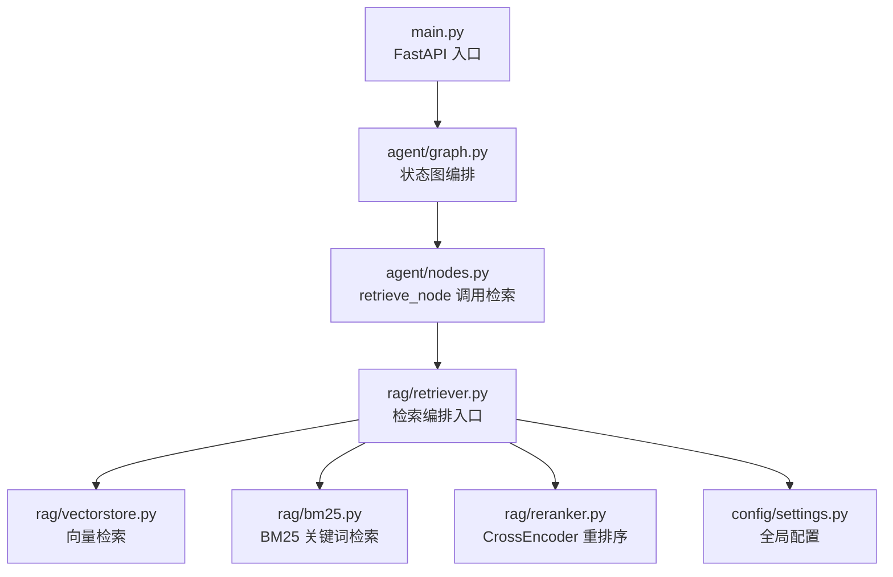
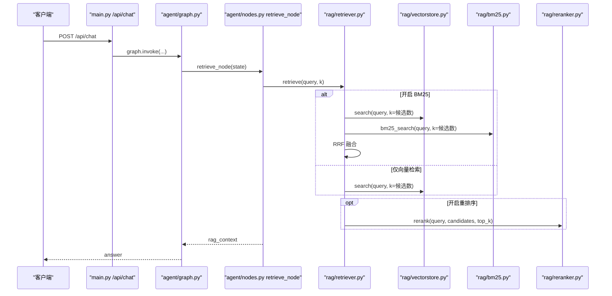
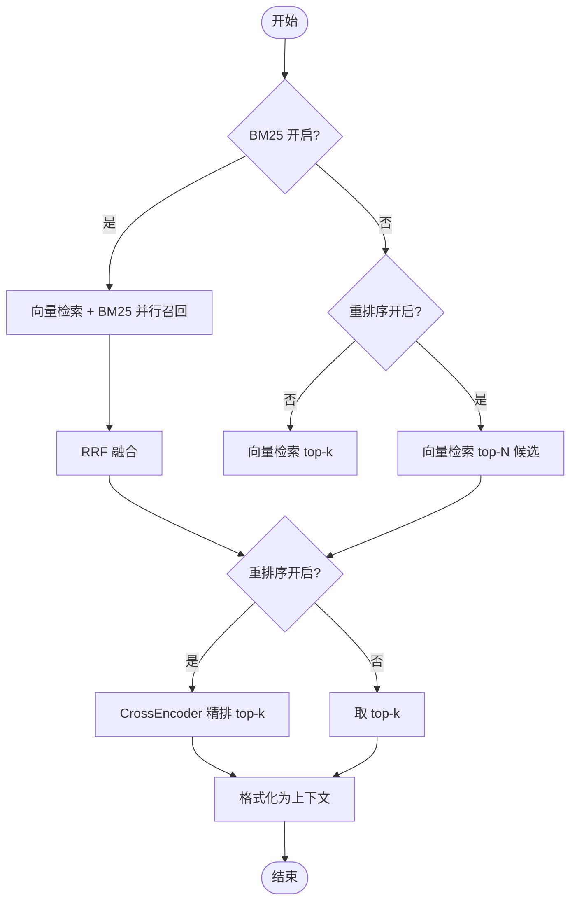
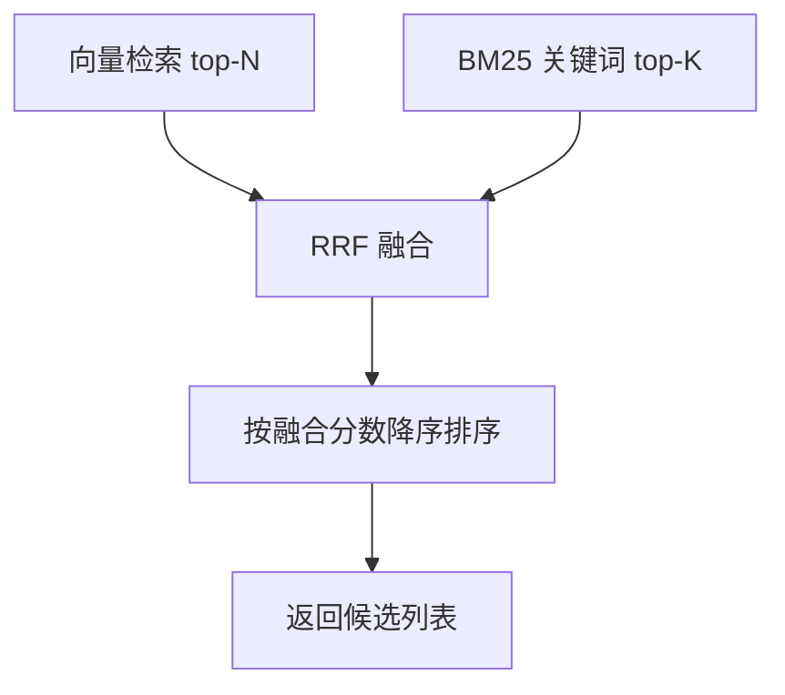
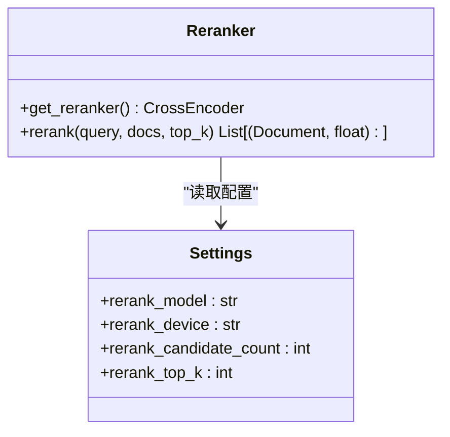
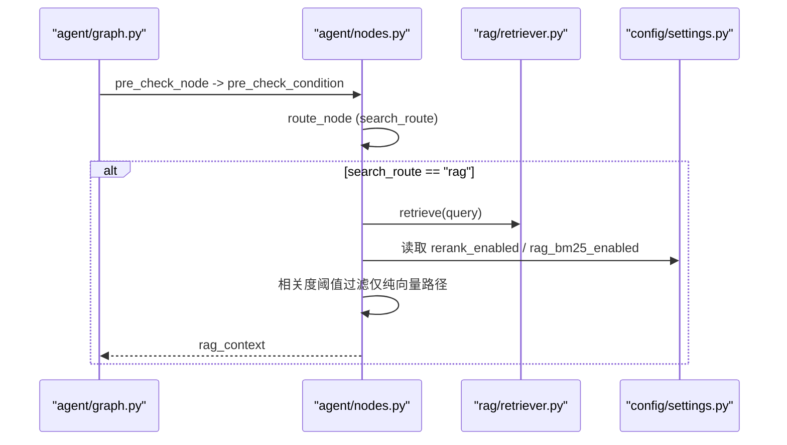
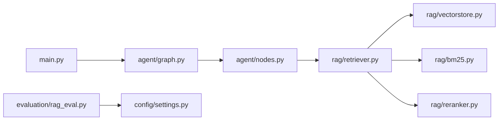

# 检索编排器

<cite>
**本文引用的文件**
- [rag/retriever.py](file://rag/retriever.py)
- [rag/reranker.py](file://rag/reranker.py)
- [rag/bm25.py](file://rag/bm25.py)
- [rag/vectorstore.py](file://rag/vectorstore.py)
- [config/settings.py](file://config/settings.py)
- [agent/graph.py](file://agent/graph.py)
- [agent/nodes.py](file://agent/nodes.py)
- [main.py](file://main.py)
- [evaluation/rag_eval.py](file://evaluation/rag_eval.py)
</cite>

## 目录
1. [简介](#简介)
2. [项目结构](#项目结构)
3. [核心组件](#核心组件)
4. [架构总览](#架构总览)
5. [详细组件分析](#详细组件分析)
6. [依赖关系分析](#依赖关系分析)
7. [性能与优化](#性能与优化)
8. [故障排查指南](#故障排查指南)
9. [结论](#结论)
10. [附录：配置项与评估指标](#附录：配置项与评估指标)

## 简介
本文件面向“检索编排器”的完整实现，围绕多路召回策略（向量检索 + BM25）、RRF 融合算法、CrossEncoder 重排序、上下文格式化、检索流程控制、配置管理、错误处理机制展开，并提供检索效果评估方法与性能监控建议，帮助开发者理解并优化检索系统。

## 项目结构
检索编排器位于 RAG 子系统中，由检索入口、多路召回、重排序、向量库封装、BM25 关键词检索、配置管理、工作流编排等模块组成。主入口负责服务启动、预热与接口暴露；Agent 图编排将检索节点接入整体智能体流程。

图表来源
- [main.py:154-209](file://main.py#L154-L209)
- [agent/graph.py:44-102](file://agent/graph.py#L44-L102)
- [agent/nodes.py:284-321](file://agent/nodes.py#L284-L321)
- [rag/retriever.py:18-52](file://rag/retriever.py#L18-L52)
- [rag/vectorstore.py:164-184](file://rag/vectorstore.py#L164-L184)
- [rag/bm25.py:69-97](file://rag/bm25.py#L69-L97)
- [rag/reranker.py:54-97](file://rag/reranker.py#L54-L97)
- [config/settings.py:83-100](file://config/settings.py#L83-L100)

章节来源
- [main.py:154-209](file://main.py#L154-L209)
- [agent/graph.py:44-102](file://agent/graph.py#L44-L102)
- [agent/nodes.py:284-321](file://agent/nodes.py#L284-L321)
- [rag/retriever.py:18-52](file://rag/retriever.py#L18-L52)
- [rag/vectorstore.py:164-184](file://rag/vectorstore.py#L164-L184)
- [rag/bm25.py:69-97](file://rag/bm25.py#L69-L97)
- [rag/reranker.py:54-97](file://rag/reranker.py#L54-L97)
- [config/settings.py:83-100](file://config/settings.py#L83-L100)

## 核心组件
- 检索编排入口：统一接收查询，根据配置选择多路召回与是否重排序，返回带分数的文档列表或格式化后的上下文字符串。
- 多路召回：向量检索与 BM25 并行召回，使用 RRF 融合合并结果，提升精确匹配召回率。
- 重排序：使用 CrossEncoder 对候选进行精排，提高最终 top-k 的相关性。
- 上下文格式化：将检索结果转换为包含来源、标题、相关度的可读文本，供生成节点使用。
- 配置管理：集中式配置开关与参数，控制多路召回、重排序、阈值、候选数等。
- 工作流编排：通过 LangGraph 状态图将检索节点接入预检查、路由、生成、记忆更新等流程。

章节来源
- [rag/retriever.py:18-52](file://rag/retriever.py#L18-L52)
- [rag/retriever.py:55-110](file://rag/retriever.py#L55-L110)
- [rag/reranker.py:54-97](file://rag/reranker.py#L54-L97)
- [rag/retriever.py:113-139](file://rag/retriever.py#L113-L139)
- [config/settings.py:83-100](file://config/settings.py#L83-L100)
- [agent/graph.py:44-102](file://agent/graph.py#L44-L102)

## 架构总览
检索编排器在 Agent 图中作为 retrieve 节点被调用，内部根据配置决定多路召回与重排序路径，最终输出结构化上下文给 generate 节点。

图表来源
- [main.py:154-209](file://main.py#L154-L209)
- [agent/graph.py:44-102](file://agent/graph.py#L44-L102)
- [agent/nodes.py:284-321](file://agent/nodes.py#L284-L321)
- [rag/retriever.py:18-52](file://rag/retriever.py#L18-L52)
- [rag/vectorstore.py:164-184](file://rag/vectorstore.py#L164-L184)
- [rag/bm25.py:69-97](file://rag/bm25.py#L69-L97)
- [rag/reranker.py:54-97](file://rag/reranker.py#L54-L97)

## 详细组件分析

### 检索编排入口（retriever）
- 功能：根据配置选择多路召回与重排序，返回 (Document, score) 列表或格式化上下文字符串。
- 关键逻辑：
  - 若开启 BM25：并行执行向量检索与 BM25 召回，使用 RRF 融合后进入可选重排序。
  - 若关闭 BM25 但开启重排序：仅向量检索召回候选，再经 CrossEncoder 精排。
  - 若均关闭：直接向量检索 top-k。
- 上下文格式化：将不同分数语义（向量距离越小越相关、CrossEncoder 分数越大越相关）归一化到 0~1 区间展示。

图表来源
- [rag/retriever.py:18-52](file://rag/retriever.py#L18-L52)
- [rag/retriever.py:55-110](file://rag/retriever.py#L55-L110)
- [rag/retriever.py:113-139](file://rag/retriever.py#L113-L139)

章节来源
- [rag/retriever.py:18-52](file://rag/retriever.py#L18-L52)
- [rag/retriever.py:55-110](file://rag/retriever.py#L55-L110)
- [rag/retriever.py:113-139](file://rag/retriever.py#L113-L139)

### 多路召回与 RRF 融合
- 向量检索：基于 Milvus Lite 的相似度搜索，支持 L2 距离过滤低相关度结果。
- BM25 关键词检索：从向量库拉取文本文档构建内存索引，按字符级切分，返回 top-k。
- RRF 融合：对两路结果的排名进行倒数秩求和，统一不同分数语义，命中同一内容的文档得分叠加更高。

图表来源
- [rag/vectorstore.py:164-184](file://rag/vectorstore.py#L164-L184)
- [rag/bm25.py:69-97](file://rag/bm25.py#L69-L97)
- [rag/retriever.py:55-110](file://rag/retriever.py#L55-L110)

章节来源
- [rag/vectorstore.py:164-184](file://rag/vectorstore.py#L164-L184)
- [rag/bm25.py:69-97](file://rag/bm25.py#L69-L97)
- [rag/retriever.py:55-110](file://rag/retriever.py#L55-L110)

### 重排序（CrossEncoder）
- 模型：BAAI/bge-reranker-base，延迟初始化单例，首次加载可能较慢。
- 打分：构造 query-doc 对，逐对输入模型得到相关性分数，按分数降序取 top-k。
- 容错：异常时回退到原始向量检索结果，保证链路可用性。

图表来源
- [rag/reranker.py:30-51](file://rag/reranker.py#L30-L51)
- [rag/reranker.py:54-97](file://rag/reranker.py#L54-L97)
- [config/settings.py:95-100](file://config/settings.py#L95-L100)

章节来源
- [rag/reranker.py:30-51](file://rag/reranker.py#L30-L51)
- [rag/reranker.py:54-97](file://rag/reranker.py#L54-L97)
- [config/settings.py:95-100](file://config/settings.py#L95-L100)

### 上下文格式化
- 将检索结果转换为包含片段编号、来源、标题、相关度的可读文本。
- 分数归一化：向量距离与 CrossEncoder 分数统一为 0~1 区间，便于展示与阈值判断。

章节来源
- [rag/retriever.py:113-139](file://rag/retriever.py#L113-L139)

### 检索流程控制（Agent 图）
- 预检查：问答缓存命中可短路整条生成链路。
- 路由：根据意图将请求分流至知识库检索、联网搜索、长期记忆加载或工具调用。
- 检索节点：调用 retriever 获取上下文，并在纯向量路径下应用相关度阈值过滤。
- 生成节点：组装 prompt 并生成回答，支持主模型失败降级。

图表来源
- [agent/graph.py:44-102](file://agent/graph.py#L44-L102)
- [agent/nodes.py:92-150](file://agent/nodes.py#L92-L150)
- [agent/nodes.py:284-321](file://agent/nodes.py#L284-L321)
- [config/settings.py:83-100](file://config/settings.py#L83-L100)

章节来源
- [agent/graph.py:44-102](file://agent/graph.py#L44-L102)
- [agent/nodes.py:92-150](file://agent/nodes.py#L92-L150)
- [agent/nodes.py:284-321](file://agent/nodes.py#L284-L321)
- [config/settings.py:83-100](file://config/settings.py#L83-L100)

### 配置管理
- 多路召回开关与参数：BM25 启用、候选数、RRF 常数。
- 重排序开关与参数：模型名、设备、候选数、top-k。
- 向量库参数：集合名、索引类型、距离度量、分数过滤阈值、最小相关度、切片大小与重叠。
- 运行时自动同步：文件监听与防抖时间。
- 其他：OCR、联网搜索、记忆、限流熔断、LangSmith 追踪等。

章节来源
- [config/settings.py:50-100](file://config/settings.py#L50-L100)
- [config/settings.py:102-161](file://config/settings.py#L102-L161)

## 依赖关系分析
- retriever 依赖 vectorstore（向量检索）、bm25（关键词检索）、reranker（重排序）。
- nodes 中的 retrieve_node 调用 retriever，并根据配置决定是否应用相关度阈值过滤。
- main 启动时预热 LLM 连接与向量库，必要时预热 BM25 索引，降低首请求延迟。
- evaluation 模块提供 RAG 质量评估，用于离线评测检索与答案质量。

图表来源
- [rag/retriever.py:18-52](file://rag/retriever.py#L18-L52)
- [rag/vectorstore.py:164-184](file://rag/vectorstore.py#L164-L184)
- [rag/bm25.py:69-97](file://rag/bm25.py#L69-L97)
- [rag/reranker.py:54-97](file://rag/reranker.py#L54-L97)
- [agent/nodes.py:284-321](file://agent/nodes.py#L284-L321)
- [main.py:45-135](file://main.py#L45-L135)
- [evaluation/rag_eval.py:63-121](file://evaluation/rag_eval.py#L63-L121)

章节来源
- [rag/retriever.py:18-52](file://rag/retriever.py#L18-L52)
- [rag/vectorstore.py:164-184](file://rag/vectorstore.py#L164-L184)
- [rag/bm25.py:69-97](file://rag/bm25.py#L69-L97)
- [rag/reranker.py:54-97](file://rag/reranker.py#L54-L97)
- [agent/nodes.py:284-321](file://agent/nodes.py#L284-L321)
- [main.py:45-135](file://main.py#L45-L135)
- [evaluation/rag_eval.py:63-121](file://evaluation/rag_eval.py#L63-L121)

## 性能与优化
- 启动预热：
  - LLM 连接预热：TLS 握手、DNS 解析、连接池建立，显著降低首请求延迟。
  - 向量库预热：启动时检查并自动入库，必要时全量重建；BM25 索引预热避免首请求阻塞。
- 并发与锁：
  - 写入操作加锁，避免文件监听消费线程与检索路径并发写入冲突。
  - 检索为读操作，Milvus Lite 支持读写并发，无需额外锁。
- 模型加载：
  - CrossEncoder 延迟初始化单例，减少冷启动开销。
  - HuggingFace 镜像加速下载，提升模型加载速度。
- 检索优化：
  - RRF 融合统一不同分数语义，提升召回稳定性。
  - 相关度阈值过滤仅在纯向量路径生效，避免跨分数体系误判。
- 超时与熔断：
  - 流式接口整体超时保护，防止连接卡死。
  - 限流与熔断机制保障服务稳定性。

章节来源
- [main.py:45-135](file://main.py#L45-L135)
- [rag/vectorstore.py:22-26](file://rag/vectorstore.py#L22-L26)
- [rag/vectorstore.py:79-106](file://rag/vectorstore.py#L79-L106)
- [rag/reranker.py:22-51](file://rag/reranker.py#L22-L51)
- [rag/retriever.py:113-139](file://rag/retriever.py#L113-L139)
- [main.py:228-314](file://main.py#L228-L314)

## 故障排查指南
- 重排序失败：
  - 现象：CrossEncoder 预测异常或模型加载失败。
  - 处理：记录警告日志并回退到原始向量检索结果，确保链路可用。
- BM25 索引为空或未安装：
  - 现象：rank_bm25 未安装或向量库无文本文档。
  - 处理：安装依赖或重建索引；启动时预热 BM25 索引。
- 向量库写入冲突：
  - 现象：文件监听与检索并发写入导致异常。
  - 处理：写入加锁保护，检索不受影响；必要时重启服务重建索引。
- 流式超时：
  - 现象：SSE 流长时间无响应。
  - 处理：设置整体超时，超时后返回已生成内容并记录成功；异常则记录失败并触发熔断。
- 相关度过滤失效：
  - 现象：开启重排序或 BM25 后阈值过滤不生效。
  - 处理：确认仅在纯向量路径应用阈值过滤；调整最小相关度阈值。

章节来源
- [rag/reranker.py:95-97](file://rag/reranker.py#L95-L97)
- [rag/bm25.py:56-66](file://rag/bm25.py#L56-L66)
- [rag/vectorstore.py:96-106](file://rag/vectorstore.py#L96-L106)
- [main.py:228-314](file://main.py#L228-L314)
- [agent/nodes.py:304-321](file://agent/nodes.py#L304-L321)

## 结论
检索编排器通过多路召回与 RRF 融合提升召回覆盖率，结合 CrossEncoder 重排序提高最终 top-k 的相关性。配置化管理使系统灵活可调，Agent 图编排将检索无缝接入智能体流程。配合启动预热、超时熔断与错误回退机制，系统在性能与稳定性方面具备良好表现。借助评估模块，可对检索与答案质量进行量化评测，持续优化检索效果。

## 附录：配置项与评估指标
- 检索相关配置：
  - 多路召回：BM25 启用、候选数、RRF 常数。
  - 重排序：模型名、设备、候选数、top-k。
  - 向量库：集合名、索引类型、距离度量、分数过滤阈值、最小相关度、切片大小与重叠。
  - 运行时：自动同步启用、防抖时间。
- 评估维度：
  - 检索相关性：检索到的文档是否与问题相关。
  - 忠实度：答案是否基于检索上下文（无幻觉）。
  - 帮助度：回答是否对用户有帮助。
  - 答案相关性：回答是否切题。

章节来源
- [config/settings.py:83-100](file://config/settings.py#L83-L100)
- [config/settings.py:102-161](file://config/settings.py#L102-L161)
- [evaluation/rag_eval.py:63-121](file://evaluation/rag_eval.py#L63-L121)