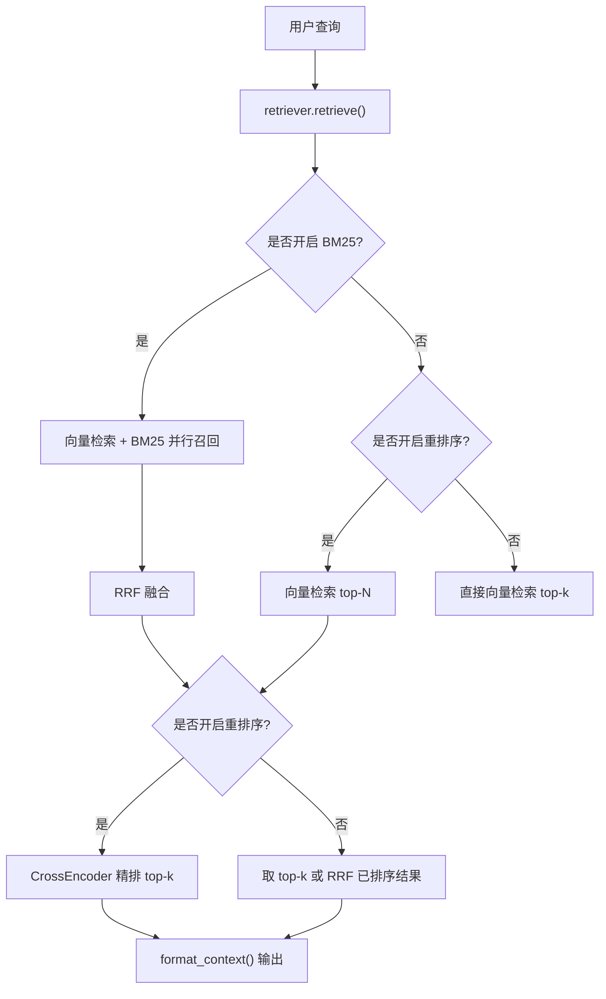
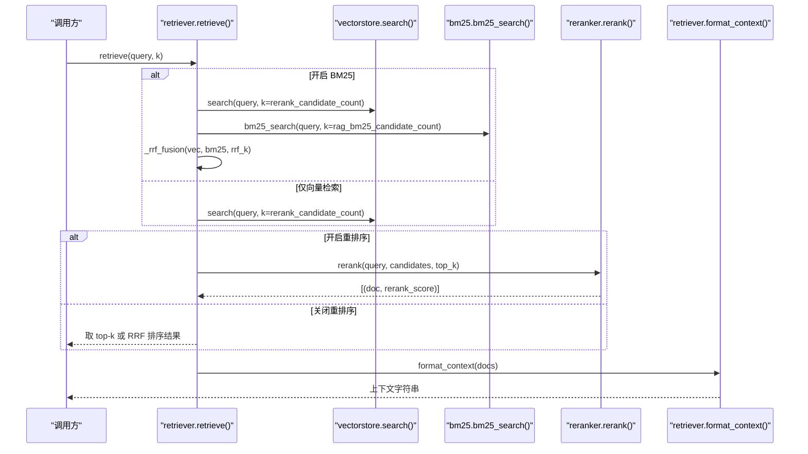
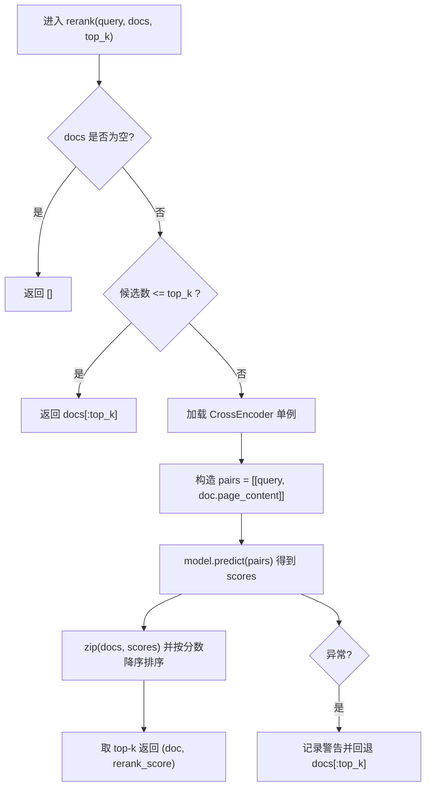
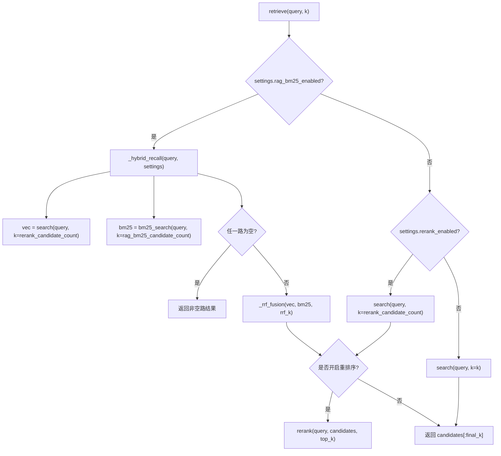
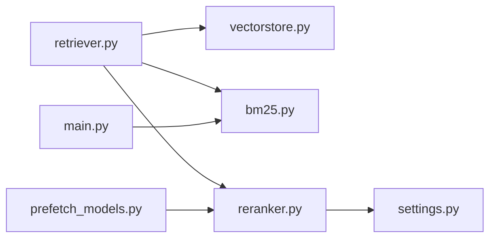

# 重排序优化

<cite>
**本文引用的文件**
- [rag/reranker.py](file://rag/reranker.py)
- [rag/retriever.py](file://rag/retriever.py)
- [config/settings.py](file://config/settings.py)
- [rag/vectorstore.py](file://rag/vectorstore.py)
- [rag/bm25.py](file://rag/bm25.py)
- [main.py](file://main.py)
- [scripts/prefetch_models.py](file://scripts/prefetch_models.py)
- [evaluation/rag_eval.py](file://evaluation/rag_eval.py)
</cite>

## 目录
1. [简介](#简介)
2. [项目结构](#项目结构)
3. [核心组件](#核心组件)
4. [架构总览](#架构总览)
5. [详细组件分析](#详细组件分析)
6. [依赖关系分析](#依赖关系分析)
7. [性能考量与优化](#性能考量与优化)
8. [故障排查指南](#故障排查指南)
9. [结论](#结论)
10. [附录：配置项与调优建议](#附录配置项与调优建议)

## 简介
本模块聚焦于 RAG 检索链路中的“重排序”环节，采用 CrossEncoder（BAAI/bge-reranker-base）对候选文档进行精排，以提升最终返回给生成模型的相关性与质量。系统支持多路召回融合（向量检索 + BM25，RRF 融合），并可在不同开关组合下灵活切换流程。同时提供启动预热、错误回退、效果评估等工程化能力。

## 项目结构
围绕重排序的关键代码分布在以下文件：
- reranker.py：CrossEncoder 单例加载与打分逻辑
- retriever.py：检索编排（多路召回、RRF 融合、重排序、上下文格式化）
- vectorstore.py：向量检索封装（Milvus Lite）
- bm25.py：BM25 关键词检索（内存索引）
- settings.py：全局配置（重排序开关、候选数、top-k、设备等）
- main.py：服务启动与预热（含 BM25 索引预热）
- prefetch_models.py：预下载并校验 CrossEncoder
- rag_eval.py：RAG 质量评估（可用于重排序前后对比）

图表来源
- [rag/retriever.py:18-52](file://rag/retriever.py#L18-L52)
- [rag/retriever.py:55-110](file://rag/retriever.py#L55-L110)
- [rag/reranker.py:30-97](file://rag/reranker.py#L30-L97)

章节来源
- [rag/retriever.py:1-139](file://rag/retriever.py#L1-L139)
- [rag/reranker.py:1-97](file://rag/reranker.py#L1-L97)
- [config/settings.py:95-100](file://config/settings.py#L95-L100)

## 核心组件
- CrossEncoder 重排序器：延迟初始化单例，使用 BAAI/bge-reranker-base，按 query-doc 对打分，分数越高越相关。
- 检索编排器：根据配置决定多路召回与是否重排序；支持 RRF 融合与统一归一化展示。
- 向量检索：基于 Milvus Lite，返回 (Document, L2距离)，越小越相关。
- BM25 检索：内存索引，字符级切分，返回 (Document, BM25分数)，越大越相关。
- 配置中心：集中管理重排序开关、候选数、top-k、设备、阈值等参数。

章节来源
- [rag/reranker.py:30-97](file://rag/reranker.py#L30-L97)
- [rag/retriever.py:18-139](file://rag/retriever.py#L18-L139)
- [rag/vectorstore.py:164-184](file://rag/vectorstore.py#L164-L184)
- [rag/bm25.py:22-97](file://rag/bm25.py#L22-L97)
- [config/settings.py:95-100](file://config/settings.py#L95-L100)

## 架构总览
下图展示了从查询到最终上下文的完整数据流，包括多路召回、融合、重排序与格式化的关键节点。

图表来源
- [rag/retriever.py:18-52](file://rag/retriever.py#L18-L52)
- [rag/retriever.py:55-110](file://rag/retriever.py#L55-L110)
- [rag/reranker.py:54-97](file://rag/reranker.py#L54-L97)
- [rag/vectorstore.py:164-184](file://rag/vectorstore.py#L164-L184)
- [rag/bm25.py:69-97](file://rag/bm25.py#L69-L97)

## 详细组件分析

### CrossEncoder 重排序器（reranker.py）
- 单例加载：首次调用时通过 sentence_transformers.CrossEncoder 加载模型，支持 device 与 max_length 配置。
- 打分流程：将 query 与每个候选文档的 page_content 拼接为 pair，批量 predict 得到分数列表，按分数降序排序后取 top-k。
- 容错机制：异常时记录日志并回退到原始候选的前 top-k，保证可用性。
- 加速策略：设置 HF_ENDPOINT 镜像加速模型下载；可配合脚本在启动前预下载模型。

图表来源
- [rag/reranker.py:54-97](file://rag/reranker.py#L54-L97)

章节来源
- [rag/reranker.py:22-51](file://rag/reranker.py#L22-L51)
- [rag/reranker.py:54-97](file://rag/reranker.py#L54-L97)

### 检索编排与多路召回融合（retriever.py）
- 分支策略：
  - 若开启 BM25：并行执行向量检索与 BM25 检索，使用 RRF 融合两路结果。
  - 若未开启 BM25 但开启重排序：仅向量检索召回 top-N 候选，再经 CrossEncoder 精排。
  - 若两者均关闭：直接向量检索 top-k。
- RRF 融合：对每路结果的排名计算 1/(k+rank)，相同内容合并累加，按融合分数降序。
- 上下文格式化：统一归一化分数为 1/(1+|score|) 以直观展示相关性。

图表来源
- [rag/retriever.py:18-52](file://rag/retriever.py#L18-L52)
- [rag/retriever.py:55-110](file://rag/retriever.py#L55-L110)

章节来源
- [rag/retriever.py:18-139](file://rag/retriever.py#L18-L139)

### 向量检索（vectorstore.py）
- 基于 LangChain Milvus，本地文件持久化（Milvus Lite）。
- similarity_search_with_score 返回 (Document, L2距离)，越小越相关。
- 支持过滤低相关度结果（阈值由配置控制），为空时回退原始结果。

章节来源
- [rag/vectorstore.py:29-76](file://rag/vectorstore.py#L29-L76)
- [rag/vectorstore.py:164-184](file://rag/vectorstore.py#L164-L184)

### BM25 关键词检索（bm25.py）
- 进程内单例索引，从向量库拉取文本文档构建 BM25Okapi 索引。
- 中文按字符级切分，无需额外分词依赖。
- 检索返回 (Document, BM25分数)，越大越相关；无命中或索引为空时返回空列表。

章节来源
- [rag/bm25.py:22-66](file://rag/bm25.py#L22-L66)
- [rag/bm25.py:69-97](file://rag/bm25.py#L69-L97)

### 配置管理（settings.py）
- 重排序相关：
  - rerank_enabled：是否启用重排序
  - rerank_model：模型名称（默认 BAAI/bge-reranker-base）
  - rerank_device：运行设备（cpu/gpu）
  - rerank_candidate_count：向量检索召回候选数
  - rerank_top_k：重排序后返回数量
- 多路召回相关：
  - rag_bm25_enabled：是否开启 BM25
  - rag_bm25_candidate_count：BM25 召回候选数
  - rag_rrf_k：RRF 融合常数
- 其他：
  - rag_top_k：默认向量检索 top-k
  - rag_score_filter：向量检索距离阈值
  - rag_min_relevance：最小相关度阈值（用于纯向量路径过滤）

章节来源
- [config/settings.py:83-100](file://config/settings.py#L83-L100)
- [config/settings.py:64-73](file://config/settings.py#L64-L73)

## 依赖关系分析
- retriever 依赖 vectorstore 与 bm25，并在需要时调用 reranker。
- reranker 依赖 sentence_transformers.CrossEncoder 与 settings。
- vectorstore 依赖 embeddings 与 Milvus。
- main 在启动时预热 BM25 索引（当开启多路召回时），降低首请求延迟。
- prefetch 脚本可提前下载并校验 CrossEncoder，避免首次请求阻塞。

图表来源
- [rag/retriever.py:15-52](file://rag/retriever.py#L15-L52)
- [rag/reranker.py:30-51](file://rag/reranker.py#L30-L51)
- [main.py:80-135](file://main.py#L80-L135)
- [scripts/prefetch_models.py:40-53](file://scripts/prefetch_models.py#L40-L53)

章节来源
- [rag/retriever.py:15-52](file://rag/retriever.py#L15-L52)
- [rag/reranker.py:30-51](file://rag/reranker.py#L30-L51)
- [main.py:80-135](file://main.py#L80-L135)
- [scripts/prefetch_models.py:40-53](file://scripts/prefetch_models.py#L40-L53)

## 性能考量与优化
- 模型加载与预热
  - CrossEncoder 延迟初始化，首次调用才加载，减少冷启动开销。
  - 可通过 scripts/prefetch_models.py 在部署前预下载并校验模型，避免首请求长耗时。
  - 启动时可设置 HF_ENDPOINT 镜像加速下载。
- 候选规模控制
  - 合理设置 rerank_candidate_count，平衡召回覆盖率与重排序成本。
  - 当候选数小于等于 top_k 时跳过重排序，减少不必要计算。
- 设备选择
  - rerank_device 可设为 gpu 提升吞吐（需确保显存充足）。
- 多路召回融合
  - 开启 BM25 可提升精确匹配召回率，结合 RRF 融合提高鲁棒性。
  - 注意 BM25 索引构建与预热，避免首请求阻塞。
- 异常回退
  - 重排序失败自动回退到原始候选，保障服务可用性。
- 上下文展示归一化
  - 统一使用 1/(1+|score|) 将不同来源分数映射到 0~1，便于前端展示与阈值判断。

[本节为通用性能指导，不直接分析具体文件]

## 故障排查指南
- 重排序失败
  - 现象：日志出现“重排序失败，回退到原始向量检索结果”。
  - 可能原因：模型加载失败、网络问题、输入过长、设备不可用。
  - 处理：检查 HF_ENDPOINT 与网络连接；确认 rerank_device 可用；必要时降级关闭重排序。
- 多路召回为空
  - 现象：向量检索或 BM25 任一为空。
  - 处理：确认向量库有数据；BM25 索引是否构建成功；必要时重置 BM25 索引。
- 启动预热失败
  - 现象：BM25 索引预热失败但不影响服务。
  - 处理：检查向量库状态；重试预热；确认权限与磁盘空间。
- 评估指标异常
  - 现象：评估器报错或结果为空。
  - 处理：检查评判模型配置与 API Key；确认样本字段齐全。

章节来源
- [rag/reranker.py:95-97](file://rag/reranker.py#L95-L97)
- [rag/bm25.py:56-66](file://rag/bm25.py#L56-L66)
- [main.py:110-124](file://main.py#L110-L124)
- [evaluation/rag_eval.py:89-120](file://evaluation/rag_eval.py#L89-L120)

## 结论
本重排序方案以 CrossEncoder 为核心，结合多路召回与 RRF 融合，形成“召回粗排 + 精排”的两阶段检索链路。通过灵活的配置开关、完善的异常回退与启动预热机制，兼顾了精度与稳定性。配合评估工具可进行效果度量与持续调优，满足生产环境对检索质量与性能的双重要求。

[本节为总结性内容，不直接分析具体文件]

## 附录：配置项与调优建议
- 重排序开关与参数
  - rerank_enabled：建议在生产环境开启以获得更高相关性。
  - rerank_model：默认 BAAI/bge-reranker-base，可根据场景替换更大模型。
  - rerank_device：CPU 环境稳定，GPU 环境可显著提升吞吐。
  - rerank_candidate_count：建议 20~50，视知识库规模与延迟预算调整。
  - rerank_top_k：通常 3~8，过小影响召回，过大增加生成成本。
- 多路召回与融合
  - rag_bm25_enabled：开启后可提升精确匹配召回率，适合术语/专有名词较多的场景。
  - rag_bm25_candidate_count：建议 10~20。
  - rag_rrf_k：典型值 60，平滑因子影响排名衰减速度。
- 向量检索阈值
  - rag_score_filter：过滤低相关度结果，避免噪声注入。
  - rag_min_relevance：仅在纯向量路径生效，用于进一步过滤。
- 预热与缓存
  - 启动时预热 BM25 索引与 CrossEncoder，降低首请求延迟。
  - 使用 prefetch 脚本在部署前下载模型，避免线上首次请求阻塞。
- 效果评估
  - 使用 evaluation/rag_eval.py 对检索相关性、答案忠实度、帮助度、答案相关性进行评估。
  - 对比开启/关闭重排序、不同候选数与 top-k 的效果差异，选择最优配置。

章节来源
- [config/settings.py:83-100](file://config/settings.py#L83-L100)
- [config/settings.py:64-73](file://config/settings.py#L64-L73)
- [main.py:80-135](file://main.py#L80-L135)
- [scripts/prefetch_models.py:40-53](file://scripts/prefetch_models.py#L40-L53)
- [evaluation/rag_eval.py:63-120](file://evaluation/rag_eval.py#L63-L120)