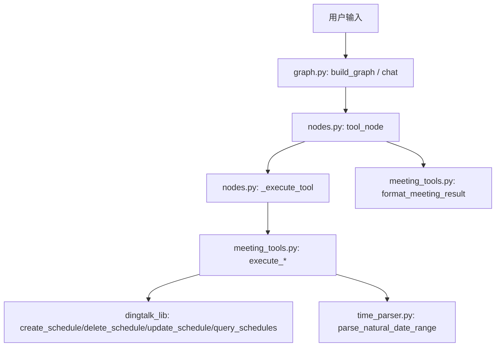
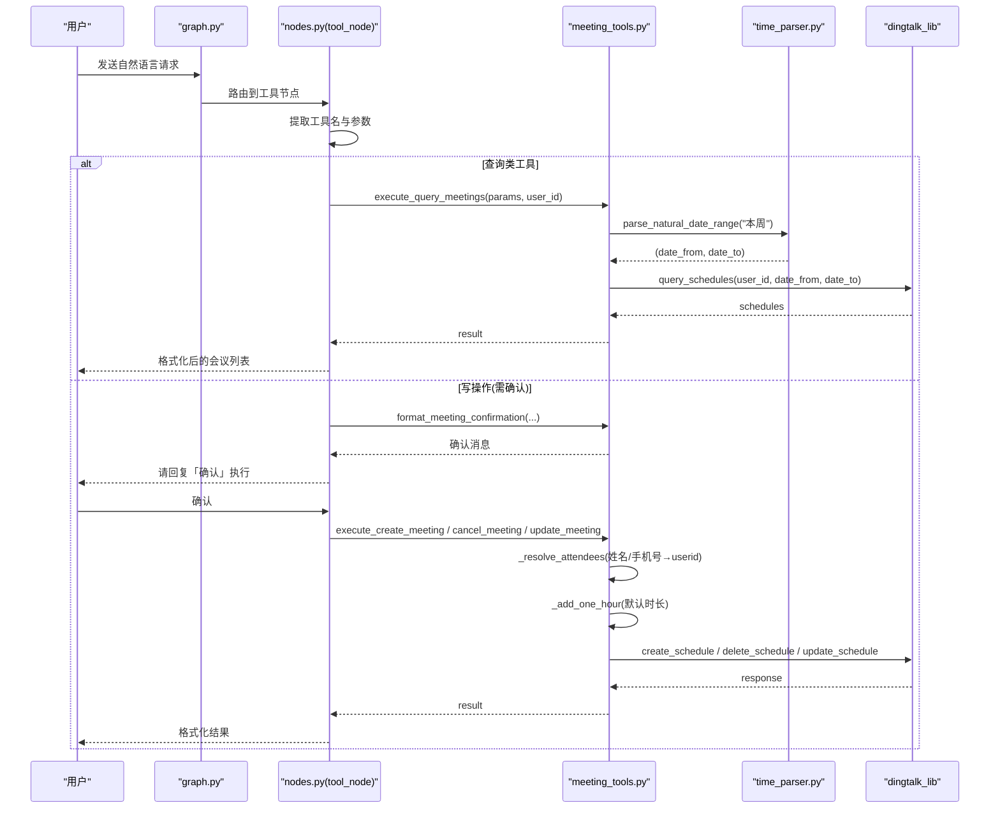
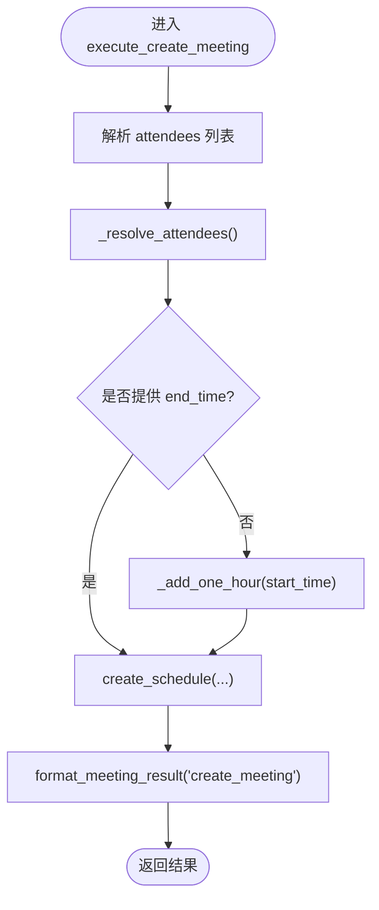
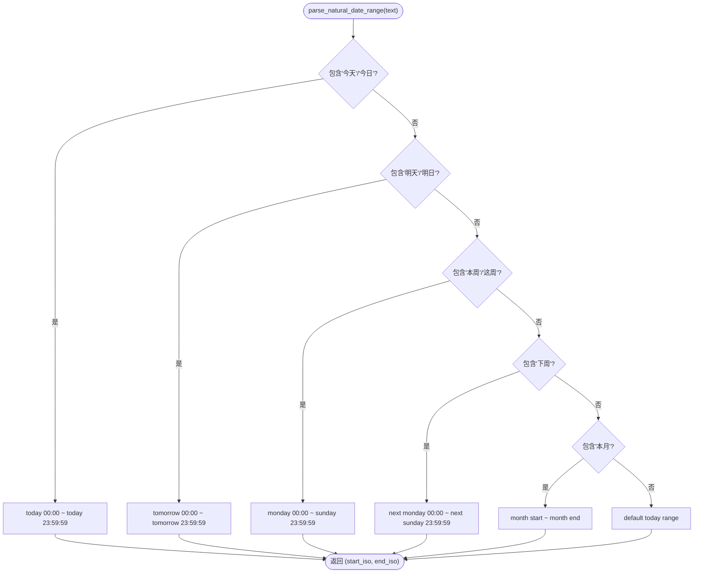
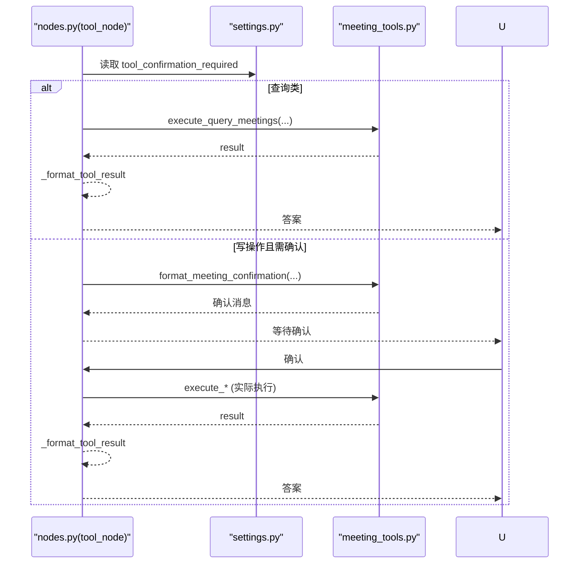
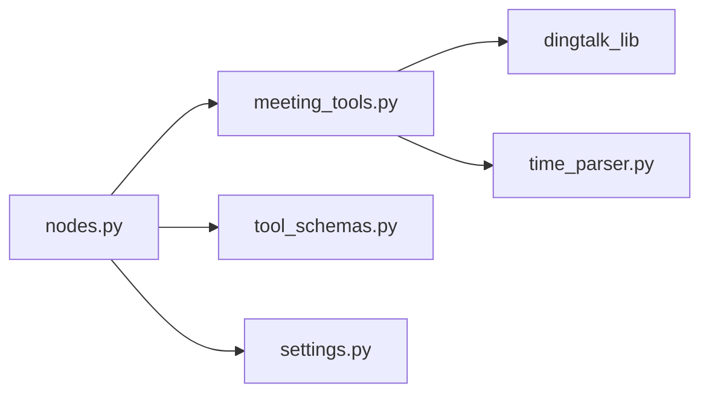

# 会议管理工具

<cite>
**本文引用的文件**
- [agent/tools/meeting_tools.py](file://agent/tools/meeting_tools.py)
- [agent/tools/time_parser.py](file://agent/tools/time_parser.py)
- [agent/tools/tool_schemas.py](file://agent/tools/tool_schemas.py)
- [agent/nodes.py](file://agent/nodes.py)
- [agent/graph.py](file://agent/graph.py)
- [config/settings.py](file://config/settings.py)
</cite>

## 目录
1. [简介](#简介)
2. [项目结构](#项目结构)
3. [核心组件](#核心组件)
4. [架构总览](#架构总览)
5. [详细组件分析](#详细组件分析)
6. [依赖关系分析](#依赖关系分析)
7. [性能考虑](#性能考虑)
8. [故障排查指南](#故障排查指南)
9. [结论](#结论)
10. [附录：API调用示例与参数说明](#附录api调用示例与参数说明)

## 简介
本模块实现钉钉会议管理的完整能力，包括创建会议、取消会议、修改会议、查询会议。系统通过自然语言理解将用户意图解析为工具调用，自动完成参会人解析（姓名/手机号到钉钉用户ID）、时间处理（ISO 8601 转换与默认时长）、错误处理与结果格式化，最终对接钉钉日程 API。

## 项目结构
围绕会议能力的代码主要分布在以下位置：
- 工具执行层：meeting_tools.py（会议工具执行器）
- 时间解析：time_parser.py（自然语言时间转 ISO 8601）
- 工具Schema：tool_schemas.py（LLM Function Calling 的 Schema 与提取提示）
- 工作流编排：graph.py（LangGraph 状态图构建与入口）
- 节点逻辑：nodes.py（路由、工具调用、确认与结果格式化）
- 配置：settings.py（全局开关与行为配置）

图表来源
- [agent/graph.py:44-102](file://agent/graph.py#L44-L102)
- [agent/nodes.py:647-746](file://agent/nodes.py#L647-L746)
- [agent/tools/meeting_tools.py:17-128](file://agent/tools/meeting_tools.py#L17-L128)
- [agent/tools/time_parser.py:29-63](file://agent/tools/time_parser.py#L29-L63)

章节来源
- [agent/graph.py:44-102](file://agent/graph.py#L44-L102)
- [agent/nodes.py:647-746](file://agent/nodes.py#L647-L746)
- [agent/tools/meeting_tools.py:17-128](file://agent/tools/meeting_tools.py#L17-L128)
- [agent/tools/time_parser.py:29-63](file://agent/tools/time_parser.py#L29-L63)

## 核心组件
- 会议工具执行器：提供创建、取消、修改、查询四个入口，统一处理参数、参会人解析、默认时长与结果格式化。
- 时间解析器：支持“本周/明天/下午3点”等中文表达，输出 ISO 8601 时间或起止范围。
- 工具Schema：定义 LLM 可识别的工具名、描述与参数结构，用于从用户消息中抽取工具调用。
- 工作流与节点：基于 LangGraph 的状态图，负责路由到工具节点、执行工具、确认写操作并返回结果。
- 配置：控制是否启用工具调用、是否需要用户确认等全局行为。

章节来源
- [agent/tools/meeting_tools.py:17-159](file://agent/tools/meeting_tools.py#L17-L159)
- [agent/tools/time_parser.py:11-63](file://agent/tools/time_parser.py#L11-L63)
- [agent/tools/tool_schemas.py:8-121](file://agent/tools/tool_schemas.py#L8-L121)
- [agent/nodes.py:647-779](file://agent/nodes.py#L647-L779)
- [config/settings.py:151-156](file://config/settings.py#L151-L156)

## 架构总览
下图展示了从用户输入到钉钉日程 API 的完整调用链，以及关键分支（参会人解析、时间处理、确认流程）。

图表来源
- [agent/graph.py:44-102](file://agent/graph.py#L44-L102)
- [agent/nodes.py:647-779](file://agent/nodes.py#L647-L779)
- [agent/tools/meeting_tools.py:17-159](file://agent/tools/meeting_tools.py#L17-L159)
- [agent/tools/time_parser.py:29-63](file://agent/tools/time_parser.py#L29-L63)

## 详细组件分析

### 会议工具执行器（meeting_tools.py）
- 创建会议
  - 解析参会人：将姓名或手机号转换为钉钉用户ID；手机号直接匹配，否则按姓名搜索。
  - 默认时长：若未提供结束时间，则基于开始时间加1小时。
  - 调用 dingtalk_lib.create_schedule 完成创建。
- 取消会议
  - 优先使用 meeting_id；若无 ID，则在近30天内按标题模糊匹配找到 schedule_id。
  - 调用 dingtalk_lib.delete_schedule 取消，并支持是否通知参会人。
- 修改会议
  - 优先使用 meeting_id；若无 ID，同样在30天窗口内按标题查找。
  - 调用 dingtalk_lib.update_schedule 进行增量更新。
- 查询会议
  - 若未指定日期范围，默认查询“本周”。
  - 调用 dingtalk_lib.query_schedules 获取列表。
- 结果格式化
  - 统一将 errcode != 0 转为失败提示；成功时按工具类型生成可读文本。
- 参会人解析
  - 手机号正则校验后直接查询；姓名查询取第一个匹配结果；失败保留原值以便上层容错。
- 时间处理
  - 默认时长：给 ISO 时间加1小时；异常时回退原始时间。

图表来源
- [agent/tools/meeting_tools.py:17-47](file://agent/tools/meeting_tools.py#L17-L47)
- [agent/tools/meeting_tools.py:185-225](file://agent/tools/meeting_tools.py#L185-L225)

章节来源
- [agent/tools/meeting_tools.py:17-159](file://agent/tools/meeting_tools.py#L17-L159)
- [agent/tools/meeting_tools.py:185-225](file://agent/tools/meeting_tools.py#L185-L225)

### 时间解析器（time_parser.py）
- 自然语言时间转 ISO 8601：支持“今天/明天/后天/下周/本月”等相对时间，以及“上午/下午/晚上 X点/X点半/HH:MM”等时间片段。
- 日期范围解析：如“本周”返回本周一到周日的时间范围；“明天”返回全天范围。
- 该模块被查询会议时使用，以“本周”作为默认查询区间。

图表来源
- [agent/tools/time_parser.py:29-63](file://agent/tools/time_parser.py#L29-L63)

章节来源
- [agent/tools/time_parser.py:11-120](file://agent/tools/time_parser.py#L11-L120)

### 工具Schema与参数提取（tool_schemas.py）
- 定义了6个工具的 JSON Schema，供 LLM Function Calling 使用，其中会议相关包括：
  - create_meeting：必填 title、start_time；可选 end_time、attendees、location、description
  - cancel_meeting：可选 meeting_id 或 meeting_title；可选 notify_attendees
  - update_meeting：可选 meeting_id 或 meeting_title；updates 对象支持 title/start_time/end_time/location
  - query_meetings：可选 date_from、date_to
- 提供提取提示词，指导 LLM 从用户消息中抽取工具名与参数。

章节来源
- [agent/tools/tool_schemas.py:8-121](file://agent/tools/tool_schemas.py#L8-L121)

### 工作流与节点（graph.py、nodes.py）
- graph.py：构建 LangGraph 状态图，注册节点与边，tool 节点直接返回结果不经过生成节点。
- nodes.py：
  - tool_node：从用户输入提取工具调用；查询类直接执行；写操作根据配置决定是否先确认；执行后格式化结果。
  - _execute_tool：分发到具体工具执行器（含会议工具）。
  - _format_tool_result：统一错误与成功响应格式。
  - 确认流程：当需要确认时，返回 pending_confirmation 与 confirmation_context；下一轮收到“确认”即执行。

图表来源
- [agent/nodes.py:647-779](file://agent/nodes.py#L647-L779)
- [config/settings.py:151-156](file://config/settings.py#L151-L156)
- [agent/tools/meeting_tools.py:131-182](file://agent/tools/meeting_tools.py#L131-L182)

章节来源
- [agent/graph.py:44-102](file://agent/graph.py#L44-L102)
- [agent/nodes.py:647-779](file://agent/nodes.py#L647-L779)
- [config/settings.py:151-156](file://config/settings.py#L151-L156)

## 依赖关系分析
- 会议工具执行器依赖：
  - dingtalk_lib：日程 API（create_schedule、delete_schedule、update_schedule、query_schedules）
  - time_parser：自然语言时间范围解析
  - nodes：工具调度与确认流程
- 节点依赖：
  - settings：全局开关（工具调用、确认策略）
  - tool_schemas：工具 Schema 与提取提示
- 耦合与内聚：
  - 会议工具高内聚于 meeting_tools.py，对外暴露统一的执行与格式化接口。
  - 时间解析独立，便于复用与测试。
  - 节点层仅做路由与编排，降低业务耦合。

图表来源
- [agent/nodes.py:647-779](file://agent/nodes.py#L647-L779)
- [agent/tools/meeting_tools.py:17-128](file://agent/tools/meeting_tools.py#L17-L128)
- [agent/tools/time_parser.py:29-63](file://agent/tools/time_parser.py#L29-L63)
- [agent/tools/tool_schemas.py:8-121](file://agent/tools/tool_schemas.py#L8-L121)
- [config/settings.py:151-156](file://config/settings.py#L151-L156)

章节来源
- [agent/nodes.py:647-779](file://agent/nodes.py#L647-L779)
- [agent/tools/meeting_tools.py:17-128](file://agent/tools/meeting_tools.py#L17-L128)
- [agent/tools/time_parser.py:29-63](file://agent/tools/time_parser.py#L29-L63)
- [agent/tools/tool_schemas.py:8-121](file://agent/tools/tool_schemas.py#L8-L121)
- [config/settings.py:151-156](file://config/settings.py#L151-L156)

## 性能考虑
- 查询默认范围优化：未指定时间范围时采用“本周”，减少不必要的全量查询。
- 参会人解析批量处理：对每个参会人顺序解析，避免阻塞；失败时保留原值，提升鲁棒性。
- 默认时长计算：仅在缺少结束时间时计算，减少不必要的开销。
- 确认机制：写操作需确认，避免误操作导致的额外网络往返。

[本节为通用性能建议，不直接分析具体文件]

## 故障排查指南
- 常见错误与定位
  - 未找到会议：取消/修改时若未提供 meeting_id，会按标题在30天内模糊匹配；若仍找不到，返回明确错误信息。
  - 参会人解析失败：手机号不符合规范或姓名无匹配时，保留原值；后续 API 调用可能跳过无效ID。
  - 时间格式异常：_add_one_hour 捕获异常并回退原始时间，确保不会中断流程。
  - 工具未识别：tool_node 无法识别工具时降级为普通回答，提示更明确的表达方式。
- 日志与调试
  - 节点层打印路由与工具执行异常，便于快速定位问题。
  - 可通过关闭工具调用或确认流程进行对比验证。

章节来源
- [agent/tools/meeting_tools.py:50-113](file://agent/tools/meeting_tools.py#L50-L113)
- [agent/tools/meeting_tools.py:185-225](file://agent/tools/meeting_tools.py#L185-L225)
- [agent/nodes.py:693-746](file://agent/nodes.py#L693-L746)

## 结论
本会议管理工具通过清晰的职责划分与健壮的错误处理，实现了从自然语言到钉钉日程 API 的端到端集成。参会人解析、时间处理、结果格式化与确认流程共同保障了易用性与可靠性。开发者可基于提供的 Schema 与函数式接口快速扩展或定制功能。

[本节为总结性内容，不直接分析具体文件]

## 附录：API调用示例与参数说明
以下为会议相关工具的参数说明与调用要点（以工具名为维度），便于开发者理解如何集成。

- create_meeting
  - 必填参数：title（会议主题）、start_time（ISO 8601）
  - 可选参数：end_time（ISO 8601，未提供则默认 start_time + 1小时）、attendees（姓名或手机号数组）、location（地点）、description（描述）
  - 行为：自动解析参会人为钉钉用户ID；若未提供 end_time，自动补全；调用创建日程 API。
  - 结果：成功返回会议ID；失败返回错误码与提示信息。
  - 参考路径
    - [agent/tools/meeting_tools.py:17-47](file://agent/tools/meeting_tools.py#L17-L47)
    - [agent/tools/tool_schemas.py:56-70](file://agent/tools/tool_schemas.py#L56-L70)

- cancel_meeting
  - 可选参数：meeting_id（优先）、meeting_title（无ID时用于匹配）、notify_attendees（是否通知参会人，默认True）
  - 行为：若无 meeting_id，将在近30天内按标题模糊匹配；找到后调用取消 API。
  - 结果：成功返回取消结果；失败返回错误信息。
  - 参考路径
    - [agent/tools/meeting_tools.py:50-80](file://agent/tools/meeting_tools.py#L50-L80)
    - [agent/tools/tool_schemas.py:72-82](file://agent/tools/tool_schemas.py#L72-L82)

- update_meeting
  - 可选参数：meeting_id（优先）、meeting_title（无ID时用于匹配）、updates（对象，支持 title/start_time/end_time/location）
  - 行为：若无 meeting_id，将在近30天内按标题模糊匹配；找到后调用更新 API。
  - 结果：成功返回更新结果；失败返回错误信息。
  - 参考路径
    - [agent/tools/meeting_tools.py:83-113](file://agent/tools/meeting_tools.py#L83-L113)
    - [agent/tools/tool_schemas.py:84-102](file://agent/tools/tool_schemas.py#L84-L102)

- query_meetings
  - 可选参数：date_from（ISO 8601）、date_to（ISO 8601）
  - 行为：未指定时间范围时默认查询“本周”；调用查询日程 API。
  - 结果：返回会议列表；为空时提示暂无会议。
  - 参考路径
    - [agent/tools/meeting_tools.py:116-128](file://agent/tools/meeting_tools.py#L116-L128)
    - [agent/tools/time_parser.py:29-63](file://agent/tools/time_parser.py#L29-L63)
    - [agent/tools/tool_schemas.py:104-113](file://agent/tools/tool_schemas.py#L104-L113)

- 参会人解析机制
  - 手机号：正则匹配后直接查询用户；失败保留原值。
  - 姓名：按姓名搜索，取第一个匹配结果；失败保留原值。
  - 参考路径
    - [agent/tools/meeting_tools.py:185-213](file://agent/tools/meeting_tools.py#L185-L213)

- 时间处理逻辑
  - 默认时长：未提供 end_time 时，自动将 start_time 加1小时。
  - 自然语言时间：支持“本周/明天/下午3点”等表达，输出 ISO 8601。
  - 参考路径
    - [agent/tools/meeting_tools.py:216-225](file://agent/tools/meeting_tools.py#L216-L225)
    - [agent/tools/time_parser.py:11-120](file://agent/tools/time_parser.py#L11-L120)

- 错误处理策略
  - 统一检查 errcode，非零时返回“操作失败: ...”提示。
  - 模糊匹配失败时返回明确错误信息（如未找到会议）。
  - 参考路径
    - [agent/tools/meeting_tools.py:131-159](file://agent/tools/meeting_tools.py#L131-L159)
    - [agent/nodes.py:749-764](file://agent/nodes.py#L749-L764)

- 结果格式化方法
  - 创建：返回成功提示与会议ID（如有）。
  - 取消/修改：返回已通知参会人的成功提示。
  - 查询：列出会议数量与每条会议的主题、时间、地点。
  - 参考路径
    - [agent/tools/meeting_tools.py:131-159](file://agent/tools/meeting_tools.py#L131-L159)

- 工作流与确认
  - 查询类工具直接执行；写操作默认需用户确认（可配置）。
  - 参考路径
    - [agent/nodes.py:647-690](file://agent/nodes.py#L647-L690)
    - [config/settings.py:151-156](file://config/settings.py#L151-L156)