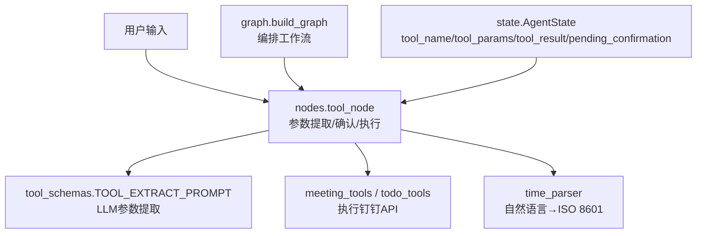
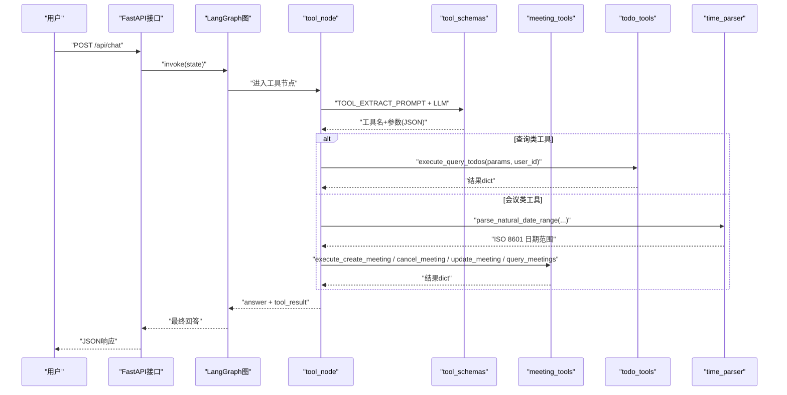
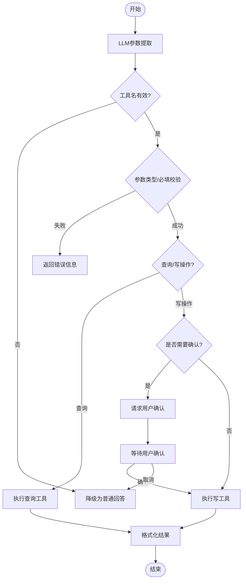
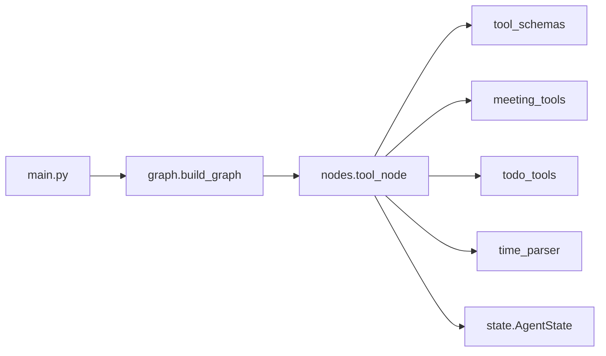

# 工具参数定义

<cite>
**本文引用的文件**
- [agent/tools/tool_schemas.py](file://agent/tools/tool_schemas.py)
- [agent/nodes.py](file://agent/nodes.py)
- [agent/graph.py](file://agent/graph.py)
- [agent/state.py](file://agent/state.py)
- [agent/tools/meeting_tools.py](file://agent/tools/meeting_tools.py)
- [agent/tools/todo_tools.py](file://agent/tools/todo_tools.py)
- [agent/tools/time_parser.py](file://agent/tools/time_parser.py)
- [main.py](file://main.py)
</cite>

## 目录
1. [简介](#简介)
2. [项目结构](#项目结构)
3. [核心组件](#核心组件)
4. [架构总览](#架构总览)
5. [详细组件分析](#详细组件分析)
6. [依赖关系分析](#依赖关系分析)
7. [性能与可靠性](#性能与可靠性)
8. [故障排查指南](#故障排查指南)
9. [结论](#结论)
10. [附录：自定义工具Schema开发指南](#附录自定义工具schema开发指南)

## 简介
本文件聚焦“工具参数定义的Schema设计模式”，围绕JSON Schema规范在工具调用中的使用、参数验证规则、类型约束与默认值设置，说明如何通过Schema确保工具调用的安全性与一致性（必填字段、格式校验、业务规则检查），并给出扩展自定义工具的实践建议。该方案基于LLM Function Calling的意图识别与参数提取流程，结合工作流节点编排，形成从用户输入到工具执行的完整链路。

## 项目结构
与工具参数Schema直接相关的代码主要分布在以下模块：
- agent/tools/tool_schemas.py：集中定义工具名称、描述、参数结构与约束（JSON Schema风格），以及用于LLM参数提取的提示词。
- agent/nodes.py：工具调用节点实现，负责LLM参数提取、路由分发、确认机制、执行与结果格式化。
- agent/graph.py：LangGraph状态图构建，将工具节点接入整体工作流。
- agent/state.py：AgentState定义，包含工具名、参数、执行结果、确认上下文等状态字段。
- agent/tools/meeting_tools.py、todo_tools.py：具体工具执行器，对接钉钉API，处理参数转换与结果格式化。
- agent/tools/time_parser.py：自然语言时间解析，为时间类参数提供ISO 8601标准化输出。
- main.py：Web入口与安全/限流/熔断等前置校验，保障外部请求安全。

图表来源
- [agent/nodes.py:646-779](file://agent/nodes.py#L646-L779)
- [agent/tools/tool_schemas.py:7-121](file://agent/tools/tool_schemas.py#L7-L121)
- [agent/tools/meeting_tools.py:17-128](file://agent/tools/meeting_tools.py#L17-L128)
- [agent/tools/todo_tools.py:18-44](file://agent/tools/todo_tools.py#L18-L44)
- [agent/tools/time_parser.py:11-63](file://agent/tools/time_parser.py#L11-L63)
- [agent/graph.py:44-102](file://agent/graph.py#L44-L102)
- [agent/state.py:37-53](file://agent/state.py#L37-L53)

章节来源
- [agent/tools/tool_schemas.py:1-121](file://agent/tools/tool_schemas.py#L1-L121)
- [agent/nodes.py:646-779](file://agent/nodes.py#L646-L779)
- [agent/graph.py:44-102](file://agent/graph.py#L44-L102)
- [agent/state.py:37-53](file://agent/state.py#L37-L53)

## 核心组件
- 工具Schema定义：以JSON Schema风格声明每个工具的参数结构、类型、枚举、必填项与默认值，配合提示词引导LLM准确提取结构化参数。
- 参数提取与校验：通过路由小模型按提示词从自然语言中抽取工具名与参数；对缺失或非法参数进行降级与错误提示。
- 执行与格式化：根据工具名分派到对应执行器，完成参数转换（如参会人解析、时间范围计算）、调用外部API并格式化结果。
- 安全与一致性：写操作需用户确认；统一错误返回格式；对外部输入进行安全过滤、限流与熔断保护。

章节来源
- [agent/tools/tool_schemas.py:29-121](file://agent/tools/tool_schemas.py#L29-L121)
- [agent/nodes.py:693-746](file://agent/nodes.py#L693-L746)
- [agent/tools/meeting_tools.py:17-128](file://agent/tools/meeting_tools.py#L17-L128)
- [agent/tools/todo_tools.py:18-44](file://agent/tools/todo_tools.py#L18-L44)
- [main.py:154-209](file://main.py#L154-L209)

## 架构总览
下图展示从用户输入到工具执行的端到端流程，包括Schema驱动的参数提取、确认机制、执行与结果返回。

图表来源
- [main.py:154-209](file://main.py#L154-L209)
- [agent/graph.py:44-102](file://agent/graph.py#L44-L102)
- [agent/nodes.py:646-779](file://agent/nodes.py#L646-L779)
- [agent/tools/tool_schemas.py:7-121](file://agent/tools/tool_schemas.py#L7-L121)
- [agent/tools/meeting_tools.py:17-128](file://agent/tools/meeting_tools.py#L17-L128)
- [agent/tools/todo_tools.py:18-44](file://agent/tools/todo_tools.py#L18-L44)
- [agent/tools/time_parser.py:29-63](file://agent/tools/time_parser.py#L29-L63)

## 详细组件分析

### JSON Schema与参数约束
- 工具列表与参数结构：每个工具以对象形式声明name、description与parameters，其中parameters采用type=object、properties定义字段类型与描述，required列出必填字段，部分字段支持enum与default。
- 类型约束示例：
  - 字符串：标题、时间（ISO 8601）、地点等。
  - 整数：优先级等数值型字段。
  - 数组：参会人列表（元素为字符串）。
  - 布尔：是否通知参会人等开关。
  - 嵌套对象：更新字段updates可包含title/start_time/end_time/location。
- 必填字段与默认值：
  - create_todo：title、due_time为必填；priority有合理默认值。
  - create_meeting：title、start_time为必填；end_time可选但会由执行器补全默认时长。
  - cancel_meeting：notify_attendees默认True。
- 枚举约束：query_todos.status限定all/pending/done，避免非法状态。

章节来源
- [agent/tools/tool_schemas.py:29-121](file://agent/tools/tool_schemas.py#L29-L121)

### 参数提取与验证流程
- 参数提取：通过路由小模型与提示词从用户消息中提取工具名与参数，输出标准JSON结构。
- 验证策略：
  - 若未识别到工具或工具名为none，则降级为普通回答。
  - 对缺失必填字段的情况，在执行器内部做兜底处理（如会议结束时间默认加1小时）。
  - 对非法枚举值，执行器侧做容错（例如status默认pending）。
- 业务规则检查：
  - 会议取消/修改：若无meeting_id则按标题匹配最近30天内的日程，找不到则返回友好错误。
  - 参会人解析：手机号正则匹配后查询通讯录，姓名模糊搜索，失败保留原值以便API层跳过无效ID。
  - 时间范围：未指定时默认查询本周，自然语言时间转换为ISO 8601。

图表来源
- [agent/nodes.py:646-779](file://agent/nodes.py#L646-L779)
- [agent/tools/meeting_tools.py:50-128](file://agent/tools/meeting_tools.py#L50-L128)
- [agent/tools/todo_tools.py:18-44](file://agent/tools/todo_tools.py#L18-L44)
- [agent/tools/time_parser.py:29-63](file://agent/tools/time_parser.py#L29-L63)

### 执行器与结果格式化
- 待办工具：
  - 创建：接收title、due_time、description、priority，调用钉钉API并返回结果。
  - 查询：按status过滤，默认pending，格式化列表输出。
- 会议工具：
  - 创建：attendees解析为钉钉用户ID，end_time默认start_time+1小时。
  - 取消/修改：优先用meeting_id，否则按标题匹配最近30天日程。
  - 查询：未指定时间范围时默认本周，返回会议列表。
- 结果格式化：统一错误码errcode!=0时返回友好错误；成功时按工具类别生成可读文本。

章节来源
- [agent/tools/todo_tools.py:18-84](file://agent/tools/todo_tools.py#L18-L84)
- [agent/tools/meeting_tools.py:17-183](file://agent/tools/meeting_tools.py#L17-L183)

### 状态与工作流集成
- AgentState包含工具相关字段：tool_name、tool_params、tool_result、pending_confirmation、confirmation_context，用于跨节点传递上下文。
- LangGraph图将tool节点直接连接到END，工具调用结果不经过generate节点，提升响应效率。
- 预检查节点处理确认状态：当用户回复“确认”时，恢复pending_confirmation上下文并执行工具。

章节来源
- [agent/state.py:37-53](file://agent/state.py#L37-L53)
- [agent/graph.py:44-102](file://agent/graph.py#L44-L102)
- [agent/nodes.py:92-128](file://agent/nodes.py#L92-L128)

## 依赖关系分析
- nodes.tool_node依赖：
  - tool_schemas.TOOL_EXTRACT_PROMPT：参数提取提示词。
  - meeting_tools/todotools：具体执行器。
  - time_parser：自然语言时间解析。
  - state.AgentState：状态字段。
- graph.py编排：
  - 注册tool节点并配置条件边，工具路径直达END。
- main.py前置安全：
  - 输入安全过滤、限流、熔断，保障外部请求安全与系统稳定性。

图表来源
- [agent/nodes.py:646-779](file://agent/nodes.py#L646-L779)
- [agent/tools/tool_schemas.py:7-121](file://agent/tools/tool_schemas.py#L7-L121)
- [agent/tools/meeting_tools.py:17-128](file://agent/tools/meeting_tools.py#L17-L128)
- [agent/tools/todo_tools.py:18-44](file://agent/tools/todo_tools.py#L18-L44)
- [agent/tools/time_parser.py:29-63](file://agent/tools/time_parser.py#L29-L63)
- [agent/graph.py:44-102](file://agent/graph.py#L44-L102)
- [main.py:154-209](file://main.py#L154-L209)

章节来源
- [agent/nodes.py:646-779](file://agent/nodes.py#L646-L779)
- [agent/graph.py:44-102](file://agent/graph.py#L44-L102)
- [main.py:154-209](file://main.py#L154-L209)

## 性能与可靠性
- 首请求预热：启动时预热路由小模型与主模型连接，降低首次调用延迟。
- 工具路径优化：工具调用直接返回结果，不经过大模型生成，减少延迟。
- 默认值与容错：会议结束时间默认+1小时；参会人解析失败保留原值；查询默认本周；错误统一返回友好信息。
- 安全与稳定性：输入安全过滤、限流、熔断，防止恶意请求与异常扩散。

章节来源
- [main.py:45-77](file://main.py#L45-L77)
- [agent/graph.py:71-72](file://agent/graph.py#L71-L72)
- [agent/tools/meeting_tools.py:33-47](file://agent/tools/meeting_tools.py#L33-L47)
- [agent/tools/meeting_tools.py:185-213](file://agent/tools/meeting_tools.py#L185-L213)
- [agent/tools/meeting_tools.py:131-159](file://agent/tools/meeting_tools.py#L131-L159)

## 故障排查指南
- 参数提取失败：检查提示词与LLM响应，确认JSON块解析逻辑；若失败则降级为普通回答。
- 必填字段缺失：查看Schema required字段，确保LLM正确提取；执行器侧提供默认值或友好错误。
- 会议取消/修改未找到：确认标题匹配逻辑与时间范围（默认30天）；如无匹配返回明确错误。
- 参会人解析失败：检查手机号正则与通讯录API返回；失败时保留原值，API层可能跳过无效ID。
- 外部API错误：统一errcode!=0时返回errmsg；记录日志便于定位。

章节来源
- [agent/nodes.py:693-746](file://agent/nodes.py#L693-L746)
- [agent/tools/meeting_tools.py:50-113](file://agent/tools/meeting_tools.py#L50-L113)
- [agent/tools/meeting_tools.py:185-213](file://agent/tools/meeting_tools.py#L185-L213)
- [agent/tools/meeting_tools.py:131-159](file://agent/tools/meeting_tools.py#L131-L159)

## 结论
本项目通过JSON Schema风格的工具参数定义，结合LLM参数提取与工作流节点编排，实现了安全、一致且可扩展的工具调用能力。Schema明确了类型、必填与默认值，执行器提供了业务规则检查与容错处理，整体链路兼顾性能与可靠性。新增工具时只需遵循相同模式即可快速集成。

## 附录：自定义工具Schema开发指南
- 步骤概览：
  1. 在tool_schemas.py中新增工具条目：定义name、description、parameters（type/properties/required/enum/default）。
  2. 在提示词TOOL_EXTRACT_PROMPT中补充新工具的描述与参数说明，确保LLM能正确提取。
  3. 在nodes._execute_tool中添加分支，分派到新工具执行器。
  4. 新建执行器模块（如custom_tools.py），实现execute_*函数，处理参数转换、调用外部API、返回统一结果格式。
  5. 如需确认机制，参考现有写操作确认流程，在tool_node中判断并返回确认消息。
  6. 编写单元测试与冒烟测试，覆盖参数提取、执行与格式化路径。
- 最佳实践：
  - 严格定义必填字段与类型，必要时使用enum限制取值。
  - 为可选字段提供合理默认值，提升鲁棒性。
  - 对外部API调用增加try/except与友好错误返回。
  - 保持结果格式一致（errcode/errmsg），便于上层统一处理。
  - 对于敏感写操作，启用用户确认机制，避免误操作。
  - 利用time_parser将自然语言时间标准化为ISO 8601，减少歧义。

章节来源
- [agent/tools/tool_schemas.py:29-121](file://agent/tools/tool_schemas.py#L29-L121)
- [agent/nodes.py:693-746](file://agent/nodes.py#L693-L746)
- [agent/tools/meeting_tools.py:17-128](file://agent/tools/meeting_tools.py#L17-L128)
- [agent/tools/todo_tools.py:18-44](file://agent/tools/todo_tools.py#L18-L44)
- [agent/tools/time_parser.py:11-63](file://agent/tools/time_parser.py#L11-L63)