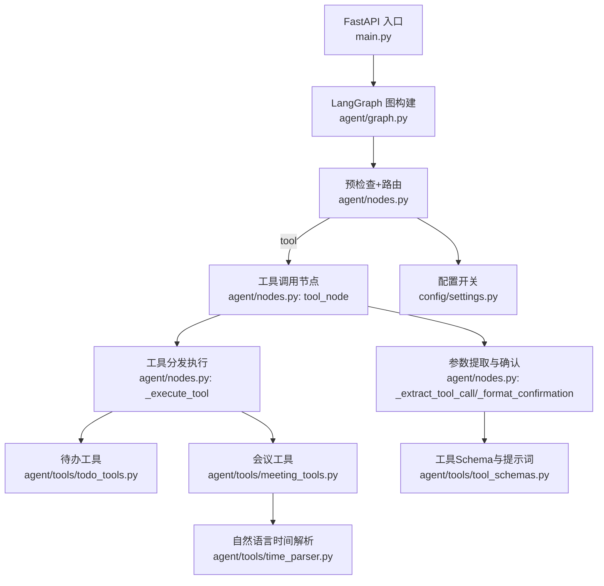
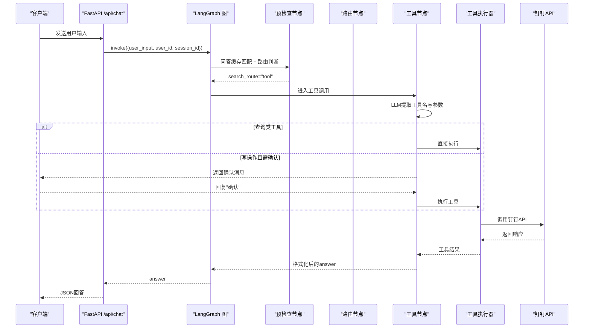
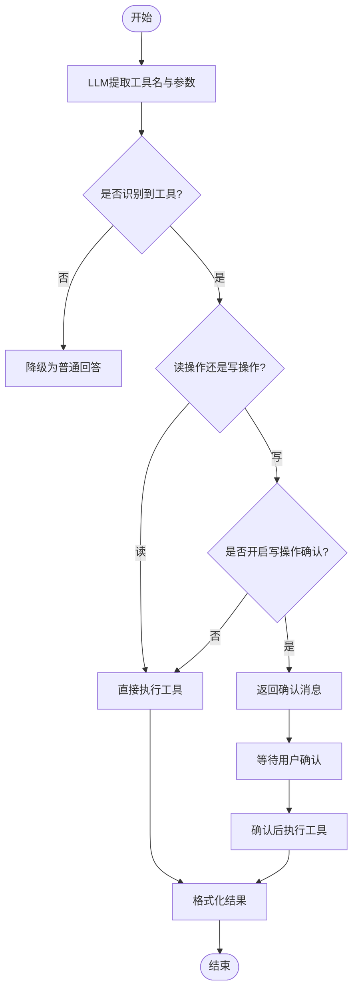
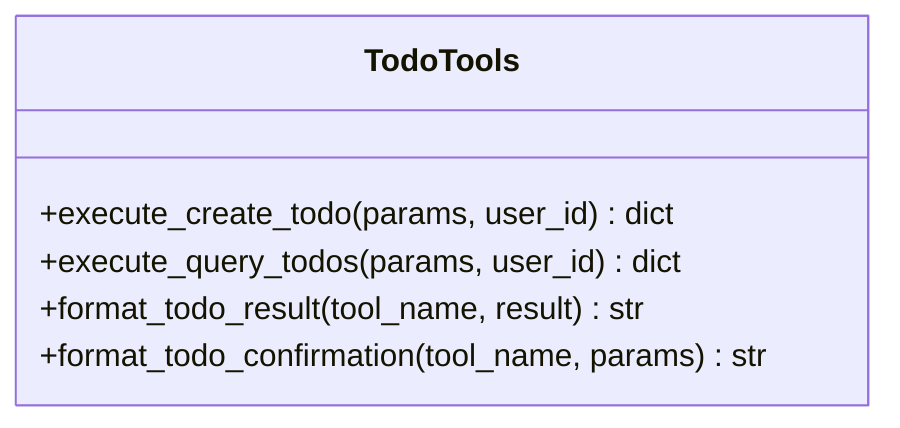
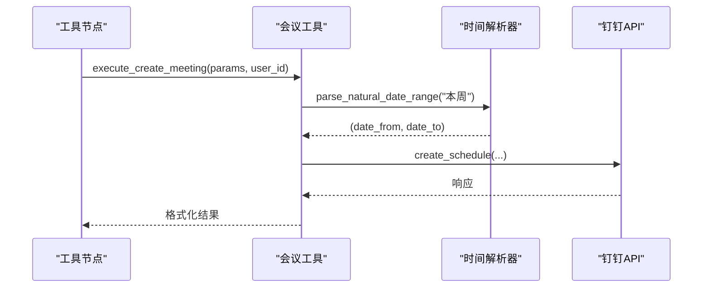
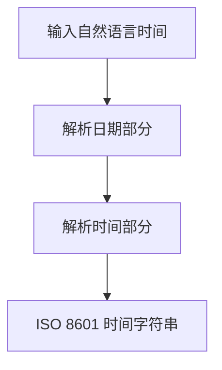
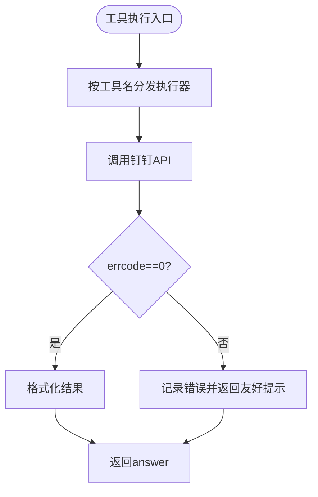
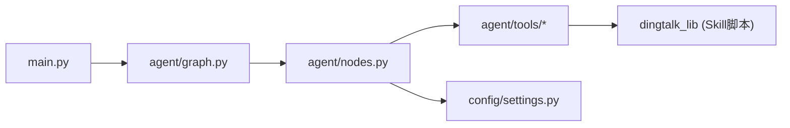

# 工具调用系统

<cite>
**本文引用的文件**
- [agent/graph.py](file://agent/graph.py)
- [agent/nodes.py](file://agent/nodes.py)
- [agent/state.py](file://agent/state.py)
- [agent/tools/meeting_tools.py](file://agent/tools/meeting_tools.py)
- [agent/tools/todo_tools.py](file://agent/tools/todo_tools.py)
- [agent/tools/time_parser.py](file://agent/tools/time_parser.py)
- [agent/tools/tool_schemas.py](file://agent/tools/tool_schemas.py)
- [config/settings.py](file://config/settings.py)
- [main.py](file://main.py)
</cite>

## 目录
1. [简介](#简介)
2. [项目结构](#项目结构)
3. [核心组件](#核心组件)
4. [架构总览](#架构总览)
5. [详细组件分析](#详细组件分析)
6. [依赖关系分析](#依赖关系分析)
7. [性能与可靠性](#性能与可靠性)
8. [故障排查指南](#故障排查指南)
9. [结论](#结论)
10. [附录：新工具扩展开发指南](#附录新工具扩展开发指南)

## 简介
本文件面向开发者，系统性解析钉钉AI智能体助手中的“工具调用系统”的架构设计与实现细节，重点覆盖：
- 工具注册机制、参数提取与校验
- 会议管理、待办事项、时间解析等工具的具体功能
- 错误处理与结果返回的标准流程
- 如何扩展新工具的完整步骤

该系统基于 LangGraph 状态图编排工作流，通过路由节点将用户意图分流至工具调用分支；工具执行器封装钉钉 API 调用，统一格式化结果并支持写操作的用户确认机制。

## 项目结构
工具调用相关代码主要分布在以下模块：
- 工作流编排：graph.py（构建状态图）、nodes.py（节点逻辑）
- 工具定义与执行：tools/ 目录下的 tool_schemas.py、todo_tools.py、meeting_tools.py、time_parser.py
- 配置开关：config/settings.py（控制工具调用开关、确认策略等）
- 入口与接口：main.py（Web 接口、流式输出）

图表来源
- [main.py:154-209](file://main.py#L154-L209)
- [agent/graph.py:44-102](file://agent/graph.py#L44-L102)
- [agent/nodes.py:647-779](file://agent/nodes.py#L647-L779)
- [agent/tools/meeting_tools.py:17-128](file://agent/tools/meeting_tools.py#L17-L128)
- [agent/tools/todo_tools.py:18-44](file://agent/tools/todo_tools.py#L18-L44)
- [agent/tools/time_parser.py:11-63](file://agent/tools/time_parser.py#L11-L63)
- [agent/tools/tool_schemas.py:8-26](file://agent/tools/tool_schemas.py#L8-L26)
- [config/settings.py:151-155](file://config/settings.py#L151-L155)

章节来源
- [agent/graph.py:44-102](file://agent/graph.py#L44-L102)
- [agent/nodes.py:647-779](file://agent/nodes.py#L647-L779)
- [agent/tools/meeting_tools.py:17-128](file://agent/tools/meeting_tools.py#L17-L128)
- [agent/tools/todo_tools.py:18-44](file://agent/tools/todo_tools.py#L18-L44)
- [agent/tools/time_parser.py:11-63](file://agent/tools/time_parser.py#L11-L63)
- [agent/tools/tool_schemas.py:8-26](file://agent/tools/tool_schemas.py#L8-L26)
- [config/settings.py:151-155](file://config/settings.py#L151-L155)
- [main.py:154-209](file://main.py#L154-L209)

## 核心组件
- 工具 Schema 与提示词：集中定义可用工具名称、描述、参数结构与必填项，用于 LLM Function Calling 的参数提取。
- 工具执行器：按工具类别（待办、会议）组织，负责参数转换、调用钉钉 API、结果格式化。
- 时间解析器：将中文自然语言时间表达转换为 ISO 8601 格式，供会议/待办创建使用。
- 路由与节点：在 nodes.py 中完成工具识别、确认、执行与结果格式化；graph.py 编排整体工作流。
- 配置开关：settings.py 提供工具调用总开关、写操作确认开关等运行时控制。

章节来源
- [agent/tools/tool_schemas.py:8-26](file://agent/tools/tool_schemas.py#L8-L26)
- [agent/tools/todo_tools.py:18-44](file://agent/tools/todo_tools.py#L18-L44)
- [agent/tools/meeting_tools.py:17-128](file://agent/tools/meeting_tools.py#L17-L128)
- [agent/tools/time_parser.py:11-63](file://agent/tools/time_parser.py#L11-L63)
- [agent/nodes.py:647-779](file://agent/nodes.py#L647-L779)
- [config/settings.py:151-155](file://config/settings.py#L151-L155)

## 架构总览
工具调用系统以 LangGraph 状态图为骨架，关键路径如下：
- 预检查节点：问答缓存命中直接返回；否则进行路由判断。
- 路由节点：关键词短路 + LLM 路由 + 兜底，识别为 tool 时进入工具调用分支。
- 工具节点：LLM 提取工具名与参数 → 查询类直接执行 → 写操作可配置确认后执行 → 统一格式化结果返回。
- 图边：tool 节点直接到 END，不经过生成节点，保证低延迟。

图表来源
- [main.py:154-209](file://main.py#L154-L209)
- [agent/graph.py:44-102](file://agent/graph.py#L44-L102)
- [agent/nodes.py:647-779](file://agent/nodes.py#L647-L779)
- [agent/tools/meeting_tools.py:17-128](file://agent/tools/meeting_tools.py#L17-L128)
- [agent/tools/todo_tools.py:18-44](file://agent/tools/todo_tools.py#L18-L44)

## 详细组件分析

### 工具注册机制与参数提取
- 工具注册：通过 tool_schemas.py 中的 TOOL_SCHEMAS 与 TOOL_EXTRACT_PROMPT 声明可用工具及其参数结构，供 LLM 进行 Function Calling 参数提取。
- 参数提取：nodes.py 中的 _extract_tool_call 使用路由小模型根据提示词从用户输入中提取工具名与参数，失败时降级为普通回答。
- 读/写分类：tool_schemas.py 维护 READ_TOOLS 与 WRITE_TOOLS 集合，决定是否需要用户确认。

图表来源
- [agent/tools/tool_schemas.py:8-26](file://agent/tools/tool_schemas.py#L8-L26)
- [agent/nodes.py:693-709](file://agent/nodes.py#L693-L709)
- [agent/nodes.py:647-690](file://agent/nodes.py#L647-L690)

章节来源
- [agent/tools/tool_schemas.py:8-26](file://agent/tools/tool_schemas.py#L8-L26)
- [agent/nodes.py:693-709](file://agent/nodes.py#L693-L709)
- [agent/nodes.py:647-690](file://agent/nodes.py#L647-L690)

### 待办工具（Todo Tools）
- 创建待办：接收标题、截止时间、详情、优先级，调用 dingtalk_lib.create_todo。
- 查询待办：按状态过滤（all/pending/done），调用 dingtalk_lib.query_todos。
- 结果格式化：统一返回用户可读文本，包含列表展示与优先级可视化。

图表来源
- [agent/tools/todo_tools.py:18-44](file://agent/tools/todo_tools.py#L18-L44)
- [agent/tools/todo_tools.py:47-84](file://agent/tools/todo_tools.py#L47-L84)

章节来源
- [agent/tools/todo_tools.py:18-44](file://agent/tools/todo_tools.py#L18-L44)
- [agent/tools/todo_tools.py:47-84](file://agent/tools/todo_tools.py#L47-L84)

### 会议工具（Meeting Tools）
- 创建会议：主题、开始/结束时间、参会人、地点、描述；自动补全默认时长（无结束时间则加1小时）。
- 取消/修改会议：优先使用 meeting_id，否则按标题查询后操作。
- 查询会议：默认查询本周，支持自定义日期范围。
- 参会人解析：姓名或手机号 → 钉钉用户ID（通过通讯录API查询）。
- 结果格式化：成功/失败信息、会议列表展示。

图表来源
- [agent/tools/meeting_tools.py:17-47](file://agent/tools/meeting_tools.py#L17-L47)
- [agent/tools/meeting_tools.py:116-128](file://agent/tools/meeting_tools.py#L116-L128)
- [agent/tools/time_parser.py:29-63](file://agent/tools/time_parser.py#L29-L63)

章节来源
- [agent/tools/meeting_tools.py:17-47](file://agent/tools/meeting_tools.py#L17-L47)
- [agent/tools/meeting_tools.py:50-113](file://agent/tools/meeting_tools.py#L50-L113)
- [agent/tools/meeting_tools.py:116-128](file://agent/tools/meeting_tools.py#L116-L128)
- [agent/tools/meeting_tools.py:185-225](file://agent/tools/meeting_tools.py#L185-L225)

### 时间解析器（Time Parser）
- 支持自然语言时间表达：今天/明天/后天、下周/本周、X天后/X小时后、上午/下午/晚上、半点等。
- 输出 ISO 8601 格式字符串，便于钉钉 API 使用。
- 日期范围解析：如“这周”→(本周一, 本周日)，“明天”→(明天0点, 明天23:59)。

图表来源
- [agent/tools/time_parser.py:11-26](file://agent/tools/time_parser.py#L11-L26)
- [agent/tools/time_parser.py:29-63](file://agent/tools/time_parser.py#L29-L63)
- [agent/tools/time_parser.py:66-119](file://agent/tools/time_parser.py#L66-L119)

章节来源
- [agent/tools/time_parser.py:11-26](file://agent/tools/time_parser.py#L11-L26)
- [agent/tools/time_parser.py:29-63](file://agent/tools/time_parser.py#L29-L63)
- [agent/tools/time_parser.py:66-119](file://agent/tools/time_parser.py#L66-L119)

### 工具执行与结果返回标准流程
- 执行分发：nodes.py 中的 _execute_tool 根据工具名动态导入对应执行器并调用。
- 错误处理：所有工具调用包裹 try/except，异常转为 errcode=-1 与 errmsg 描述。
- 结果格式化：按工具类别调用对应的 format_*_result 函数，统一返回用户可读文本。
- 确认机制：写操作可配置为需要用户确认，确认后再次执行。

图表来源
- [agent/nodes.py:712-746](file://agent/nodes.py#L712-L746)
- [agent/nodes.py:749-764](file://agent/nodes.py#L749-L764)

章节来源
- [agent/nodes.py:712-746](file://agent/nodes.py#L712-L746)
- [agent/nodes.py:749-764](file://agent/nodes.py#L749-L764)

## 依赖关系分析
- 工作流依赖：graph.py 依赖 nodes.py 中的节点函数，nodes.py 依赖 tools/ 下的工具执行器。
- 外部依赖：工具执行器通过 sys.path.insert 动态加载 .qoder/skills/dingtalk-messaging/scripts 下的 dingtalk_lib，保持 Skill 自包含。
- 配置依赖：settings.py 提供工具调用开关、确认策略、超时等全局配置。

图表来源
- [agent/graph.py:44-102](file://agent/graph.py#L44-L102)
- [agent/nodes.py:647-779](file://agent/nodes.py#L647-L779)
- [agent/tools/meeting_tools.py:9-15](file://agent/tools/meeting_tools.py#L9-L15)
- [agent/tools/todo_tools.py:10-15](file://agent/tools/todo_tools.py#L10-L15)
- [config/settings.py:151-155](file://config/settings.py#L151-L155)

章节来源
- [agent/graph.py:44-102](file://agent/graph.py#L44-L102)
- [agent/nodes.py:647-779](file://agent/nodes.py#L647-L779)
- [agent/tools/meeting_tools.py:9-15](file://agent/tools/meeting_tools.py#L9-L15)
- [agent/tools/todo_tools.py:10-15](file://agent/tools/todo_tools.py#L10-L15)
- [config/settings.py:151-155](file://config/settings.py#L151-L155)

## 性能与可靠性
- 首请求预热：main.py 启动时预热 LLM 连接（TLS握手、DNS解析、连接池建立），降低首次请求延迟。
- 流式超时保护：/api/chat/stream 设置整体超时，避免连接卡死。
- 熔断与限流：rate_limiter 提供限流与熔断机制，连续失败达到阈值后拒绝请求。
- 记忆后台更新：memory_background_node 异步执行抽取与摘要，不阻塞主响应链路。

章节来源
- [main.py:45-77](file://main.py#L45-L77)
- [main.py:228-314](file://main.py#L228-L314)
- [agent/nodes.py:630-643](file://agent/nodes.py#L630-L643)

## 故障排查指南
- 工具未识别：检查 TOOL_EXTRACT_PROMPT 与用户输入是否匹配；查看 nodes.py 中 _extract_tool_call 的日志。
- 钉钉 API 失败：查看工具执行器的 errcode 与 errmsg；确认 dingtalk_lib 已正确加载。
- 时间解析错误：验证 time_parser.py 支持的表达是否覆盖用户输入；必要时扩展正则表达式。
- 确认流程问题：检查 settings.py 中 tool_confirmation_required 配置；确认用户在 pre_check_node 中回复了“确认”。

章节来源
- [agent/nodes.py:693-709](file://agent/nodes.py#L693-L709)
- [agent/nodes.py:712-746](file://agent/nodes.py#L712-L746)
- [agent/tools/time_parser.py:66-119](file://agent/tools/time_parser.py#L66-L119)
- [config/settings.py:151-155](file://config/settings.py#L151-L155)

## 结论
工具调用系统通过清晰的职责分离与标准化流程，实现了钉钉待办与会议管理的自动化操作。其核心优势包括：
- 可扩展的工具注册机制
- 统一的参数提取与结果格式化
- 灵活的确认机制与错误处理
- 高性能的流式输出与后台记忆更新

## 附录：新工具扩展开发指南
要新增一个工具，请按以下步骤操作：
1. 定义工具 Schema：在 tool_schemas.py 中添加工具名称、描述、参数结构与必填项，并更新 TOOL_EXTRACT_PROMPT。
2. 实现工具执行器：在 tools/ 目录下新增执行器文件，实现 execute_* 函数，调用 dingtalk_lib 并返回统一格式的响应。
3. 注册执行器：在 nodes.py 的 _execute_tool 中添加工具名到执行器的映射。
4. 可选：添加确认消息格式化：若为写操作，实现 format_*_confirmation 并在 _format_confirmation 中注册。
5. 测试：通过 Web 接口或 REPL 模式测试工具调用流程，确保参数提取、执行、格式化均正常。

章节来源
- [agent/tools/tool_schemas.py:8-26](file://agent/tools/tool_schemas.py#L8-L26)
- [agent/nodes.py:712-746](file://agent/nodes.py#L712-L746)
- [agent/nodes.py:767-779](file://agent/nodes.py#L767-L779)