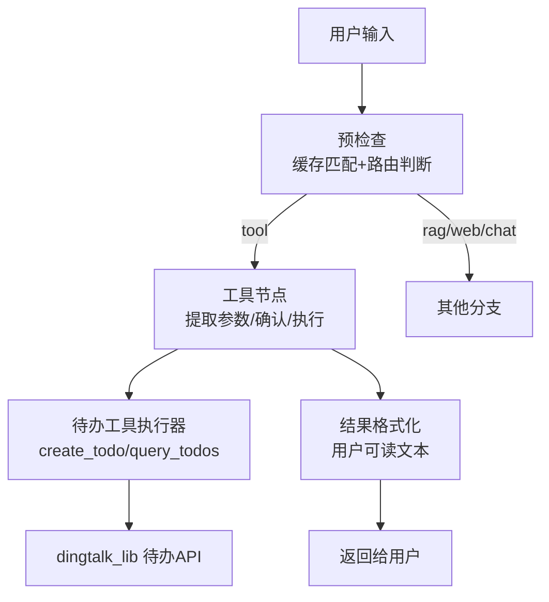
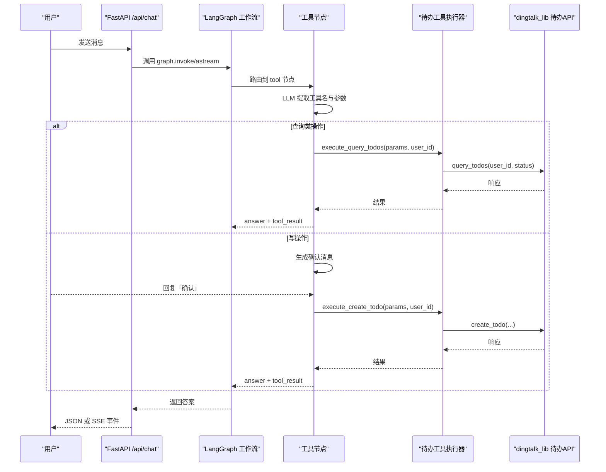
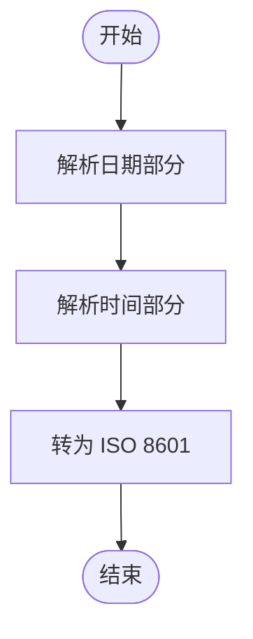
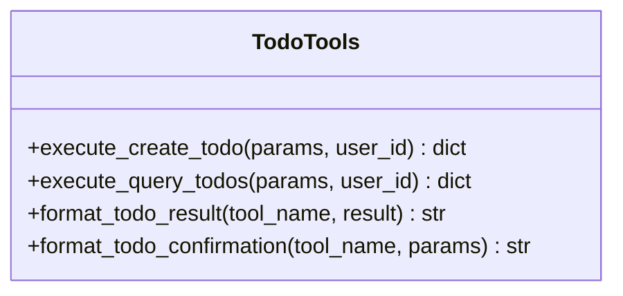
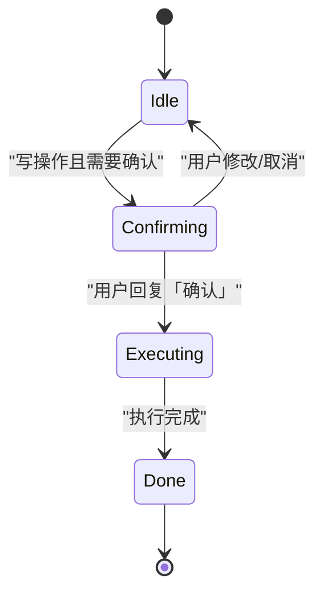
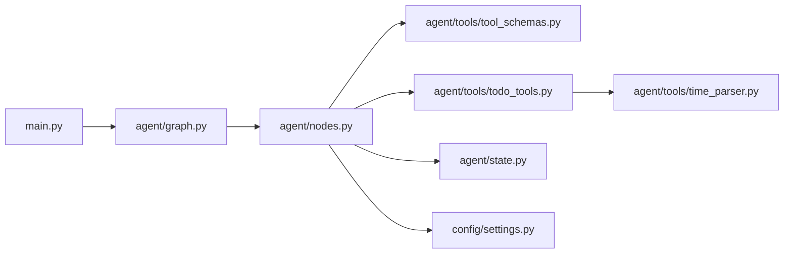

# 待办事项工具

<cite>
**本文引用的文件**
- [agent/tools/todo_tools.py](file://agent/tools/todo_tools.py)
- [agent/tools/tool_schemas.py](file://agent/tools/tool_schemas.py)
- [agent/tools/time_parser.py](file://agent/tools/time_parser.py)
- [agent/nodes.py](file://agent/nodes.py)
- [agent/graph.py](file://agent/graph.py)
- [agent/state.py](file://agent/state.py)
- [config/settings.py](file://config/settings.py)
- [main.py](file://main.py)
</cite>

## 目录
1. [简介](#简介)
2. [项目结构](#项目结构)
3. [核心组件](#核心组件)
4. [架构总览](#架构总览)
5. [详细组件分析](#详细组件分析)
6. [依赖关系分析](#依赖关系分析)
7. [性能考虑](#性能考虑)
8. [故障排查指南](#故障排查指南)
9. [结论](#结论)

## 简介
本文件围绕“待办事项工具”的完整实现进行系统化解析，覆盖创建待办、查询待办、状态管理与优先级/截止日期处理，以及与钉钉任务系统的集成方式（数据格式转换、错误处理与用户反馈）。系统基于 LangGraph 工作流编排，通过 LLM 意图识别与参数抽取，调用钉钉侧能力完成写操作（需确认）与读操作（直接执行），并以统一的用户可读文本返回结果。

## 项目结构
与待办功能相关的代码主要分布在以下模块：
- 工具定义与 Schema：用于 LLM Function Calling 的工具名、描述与参数结构
- 工具执行器：封装对 dingtalk_lib 的调用与结果格式化
- 时间解析：将自然语言时间转换为 ISO 8601
- 工作流节点：路由、工具调用、确认流程、结果格式化
- 状态图与工作流：LangGraph 状态机编排
- 配置：全局开关（如是否启用工具调用、是否需要确认）
- 主入口：Web API 与服务启动

图表来源
- [agent/graph.py:44-102](file://agent/graph.py#L44-L102)
- [agent/nodes.py:647-779](file://agent/nodes.py#L647-L779)
- [agent/tools/todo_tools.py:18-69](file://agent/tools/todo_tools.py#L18-L69)

章节来源
- [agent/graph.py:44-102](file://agent/graph.py#L44-L102)
- [agent/nodes.py:647-779](file://agent/nodes.py#L647-L779)
- [agent/tools/todo_tools.py:18-69](file://agent/tools/todo_tools.py#L18-L69)

## 核心组件
- 工具 Schema：定义 create_todo、query_todos 等工具的参数结构与必填项，供 LLM 抽取使用
- 工具执行器：封装创建/查询待办的具体调用与结果格式化
- 时间解析器：支持中文自然语言时间到 ISO 8601 的转换
- 工作流节点：负责意图识别、参数抽取、确认流程、执行与格式化
- 状态图：以 LangGraph 组织整体流程，工具调用路径直达 END，不经过生成节点
- 配置：控制工具调用开关、写操作确认策略等

章节来源
- [agent/tools/tool_schemas.py:30-54](file://agent/tools/tool_schemas.py#L30-L54)
- [agent/tools/todo_tools.py:18-83](file://agent/tools/todo_tools.py#L18-L83)
- [agent/tools/time_parser.py:11-63](file://agent/tools/time_parser.py#L11-L63)
- [agent/nodes.py:647-779](file://agent/nodes.py#L647-L779)
- [agent/graph.py:44-102](file://agent/graph.py#L44-L102)
- [config/settings.py:151-155](file://config/settings.py#L151-L155)

## 架构总览
待办功能的整体调用链路如下：
- Web 请求进入后，进入 LangGraph 工作流
- 预检查阶段进行问答缓存匹配与路由判断
- 若判定为工具调用，则进入工具节点
- 工具节点通过 LLM 提取工具名与参数；查询类直接执行，写类先确认再执行
- 执行器调用 dingtalk_lib 的待办 API，并格式化结果为人类可读文本
- 工具节点直接结束，无需进入生成节点

图表来源
- [main.py:154-209](file://main.py#L154-L209)
- [agent/graph.py:44-102](file://agent/graph.py#L44-L102)
- [agent/nodes.py:647-779](file://agent/nodes.py#L647-L779)
- [agent/tools/todo_tools.py:18-69](file://agent/tools/todo_tools.py#L18-L69)

## 详细组件分析

### 工具 Schema 与参数约束
- create_todo：必填 title、due_time；可选 description、priority（1-5）
- query_todos：可选 status（all/pending/done）
- 时间格式要求为 ISO 8601，便于与钉钉 API 对接

章节来源
- [agent/tools/tool_schemas.py:30-54](file://agent/tools/tool_schemas.py#L30-L54)

### 时间解析与截止日期处理
- 支持“明天下午3点”、“下周一上午10点”、“2小时后”等自然语言表达
- 输出 ISO 8601 字符串，便于传入钉钉 API
- 日期范围解析可用于会议查询等场景（待办创建通常只需单时间点）

图表来源
- [agent/tools/time_parser.py:11-26](file://agent/tools/time_parser.py#L11-L26)
- [agent/tools/time_parser.py:66-119](file://agent/tools/time_parser.py#L66-L119)

章节来源
- [agent/tools/time_parser.py:11-119](file://agent/tools/time_parser.py#L11-L119)

### 待办工具执行器（创建与查询）
- 创建待办：接收 title、due_time、description、priority，调用 dingtalk_lib.create_todo
- 查询待办：根据 status 过滤（默认 pending），调用 dingtalk_lib.query_todos
- 结果格式化：
  - 创建成功：返回“待办已创建成功！”并可附带 todo_id
  - 查询结果：若无待办返回“暂无待办事项。”；否则列出标题、截止时间、优先级星号
- 确认消息：创建前展示待办信息，提示用户回复“确认”执行

图表来源
- [agent/tools/todo_tools.py:18-83](file://agent/tools/todo_tools.py#L18-L83)

章节来源
- [agent/tools/todo_tools.py:18-83](file://agent/tools/todo_tools.py#L18-L83)

### 工作流节点与状态管理
- 预检查节点：优先处理 pending_confirmation 状态，若用户确认则执行上一轮待确认工具
- 路由节点：关键词与 LLM 结合判断走 tool/rag/web/chat
- 工具节点：
  - 提取工具名与参数
  - 查询类直接执行；写类先确认再执行
  - 执行后格式化结果并返回
- 状态字段：
  - pending_confirmation：是否等待用户确认
  - confirmation_context：保存待执行工具名与参数
  - tool_name、tool_params、tool_result：记录工具调用上下文

图表来源
- [agent/nodes.py:93-128](file://agent/nodes.py#L93-L128)
- [agent/nodes.py:647-779](file://agent/nodes.py#L647-L779)
- [agent/state.py:40-50](file://agent/state.py#L40-L50)

章节来源
- [agent/nodes.py:93-128](file://agent/nodes.py#L93-L128)
- [agent/nodes.py:647-779](file://agent/nodes.py#L647-L779)
- [agent/state.py:40-50](file://agent/state.py#L40-L50)

### 与钉钉任务系统集成
- 集成方式：通过 sys.path.insert 动态导入 skill 的 dingtalk_lib，保持自包含特性
- 数据格式转换：
  - 自然语言时间 → ISO 8601（由 time_parser 提供）
  - 参数映射：title、due_time、description、priority 对应钉钉 API 字段
- 错误处理：
  - 工具执行异常捕获并返回 errcode/-1 与 errmsg
  - 结果格式化时检查 errcode != 0，返回“操作失败: ...”
- 用户反馈机制：
  - 查询无结果时返回“暂无待办事项。”
  - 创建成功后返回“待办已创建成功！”并可附带 ID
  - 写操作前展示确认消息，提升可预期性与安全性

章节来源
- [agent/tools/todo_tools.py:10-15](file://agent/tools/todo_tools.py#L10-L15)
- [agent/tools/todo_tools.py:18-69](file://agent/tools/todo_tools.py#L18-L69)
- [agent/nodes.py:712-746](file://agent/nodes.py#L712-L746)

### 优先级设置与状态管理
- 优先级：create_todo 支持 priority（1-5），查询结果中以星号可视化显示
- 状态：query_todos 支持 status（all/pending/done），默认查询 pending
- 工作流层面：pending_confirmation 与 confirmation_context 确保写操作的二次确认安全

章节来源
- [agent/tools/tool_schemas.py:30-54](file://agent/tools/tool_schemas.py#L30-L54)
- [agent/tools/todo_tools.py:56-67](file://agent/tools/todo_tools.py#L56-L67)
- [agent/nodes.py:93-128](file://agent/nodes.py#L93-L128)

## 依赖关系分析
- 工作流依赖 nodes、graph、state 共同协作
- 工具节点依赖 tool_schemas 进行参数抽取，依赖 todo_tools 执行具体 API 调用
- 配置 settings 控制工具调用开关与确认策略
- main.py 暴露 Web 接口，调用 graph 并处理限流、熔断与安全校验

图表来源
- [main.py:154-209](file://main.py#L154-L209)
- [agent/graph.py:44-102](file://agent/graph.py#L44-L102)
- [agent/nodes.py:647-779](file://agent/nodes.py#L647-L779)
- [agent/tools/todo_tools.py:18-83](file://agent/tools/todo_tools.py#L18-L83)
- [agent/tools/time_parser.py:11-119](file://agent/tools/time_parser.py#L11-L119)
- [agent/state.py:12-50](file://agent/state.py#L12-L50)
- [config/settings.py:151-155](file://config/settings.py#L151-L155)

章节来源
- [main.py:154-209](file://main.py#L154-L209)
- [agent/graph.py:44-102](file://agent/graph.py#L44-L102)
- [agent/nodes.py:647-779](file://agent/nodes.py#L647-L779)
- [agent/tools/todo_tools.py:18-83](file://agent/tools/todo_tools.py#L18-L83)
- [agent/tools/time_parser.py:11-119](file://agent/tools/time_parser.py#L11-L119)
- [agent/state.py:12-50](file://agent/state.py#L12-L50)
- [config/settings.py:151-155](file://config/settings.py#L151-L155)

## 性能考虑
- 工具调用路径直达 END，避免不必要的生成节点开销
- 预检查阶段包含问答缓存命中短路，减少重复计算
- 流式接口支持 SSE，降低首字节延迟
- 启动预热 LLM 连接池与向量库索引，改善首请求体验
- 工具调用失败快速返回错误码，便于前端降级与重试

[本节为通用性能建议，不直接分析具体文件]

## 故障排查指南
- 未识别工具意图：检查 TOOL_KEYWORDS 与 LLM 抽取逻辑，必要时调整提示词或关键词
- 工具执行失败：查看 _execute_tool 的异常捕获与返回 errcode/-1，定位 dingtalk_lib 调用问题
- 确认流程卡住：检查 pending_confirmation 与 confirmation_context 状态流转，确保用户确认消息正确触发
- 时间解析异常：验证 natural language 表达式是否符合 time_parser 支持的模式
- 配置影响：确认 tool_calling_enabled 与 tool_confirmation_required 的设置是否符合预期

章节来源
- [agent/nodes.py:693-746](file://agent/nodes.py#L693-L746)
- [agent/tools/todo_tools.py:47-69](file://agent/tools/todo_tools.py#L47-L69)
- [agent/tools/time_parser.py:11-119](file://agent/tools/time_parser.py#L11-L119)
- [config/settings.py:151-155](file://config/settings.py#L151-L155)

## 结论
该待办事项工具通过 LangGraph 工作流与 LLM 意图识别，实现了创建与查询待办的闭环流程。其优势包括：
- 清晰的参数 Schema 与严格的必填校验
- 自然语言时间解析与 ISO 8601 标准化
- 写操作二次确认的安全机制
- 统一的错误处理与用户反馈
- 与钉钉任务系统的无缝集成

建议在后续迭代中：
- 增强时间解析的鲁棒性（更多方言与时区处理）
- 扩展待办状态更新与删除能力（当前仓库未见 delete/update 待办工具）
- 完善日志与监控，便于生产环境排障
- 增加单元测试与端到端测试，保障稳定性

[本节为总结性内容，不直接分析具体文件]