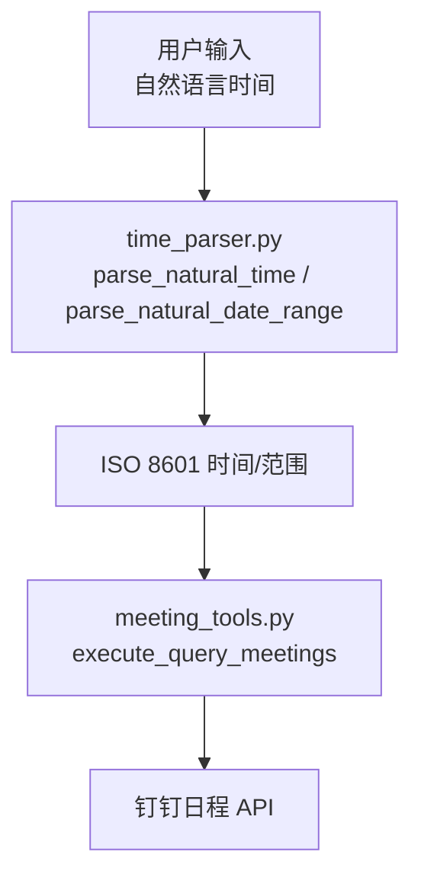
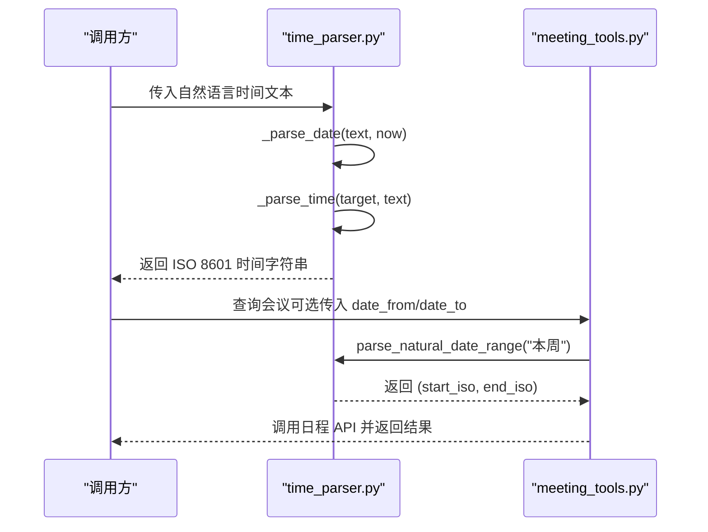
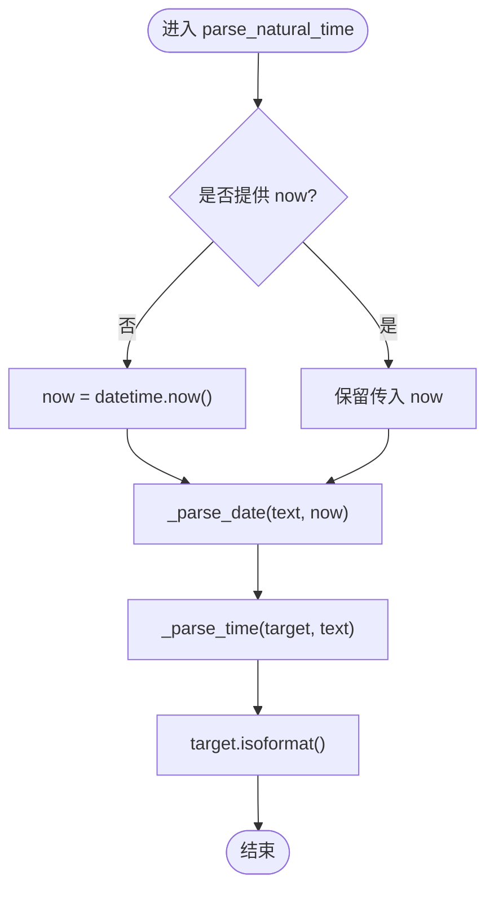
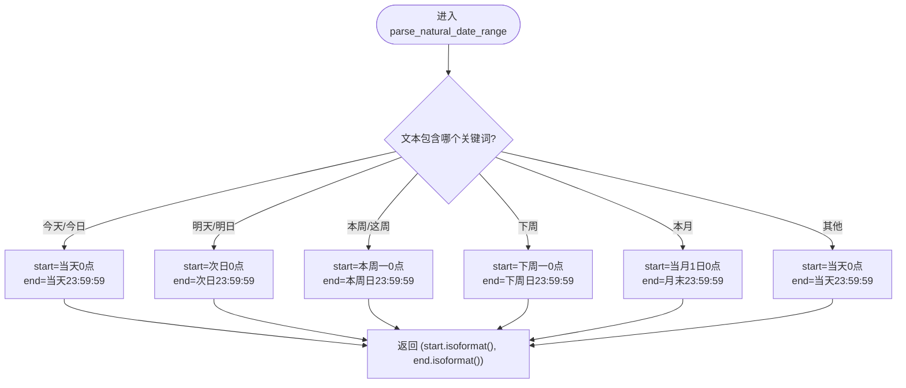
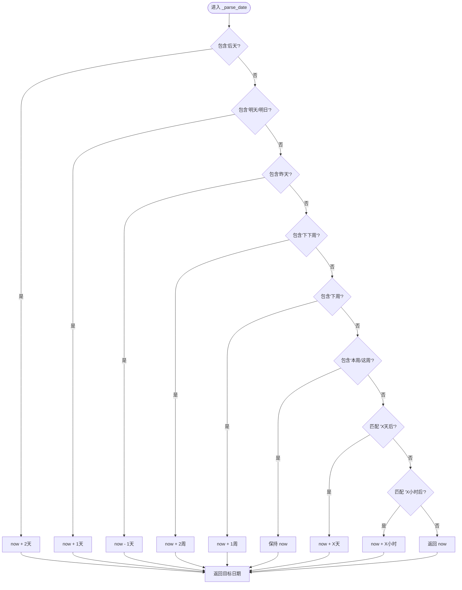
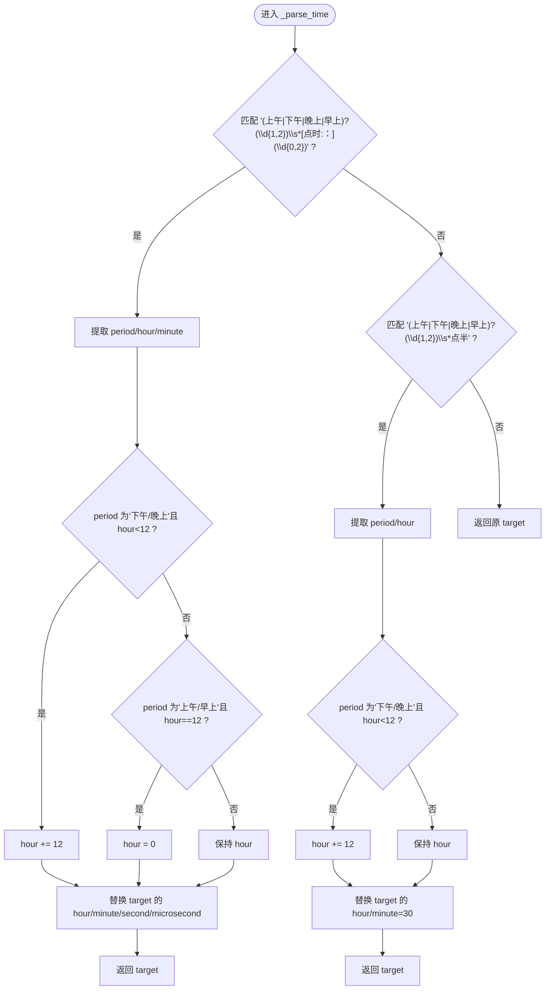
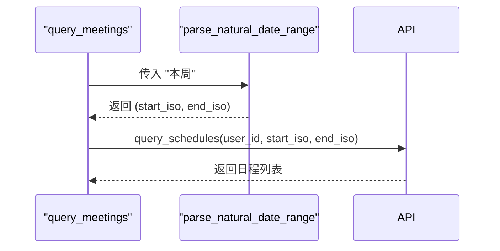
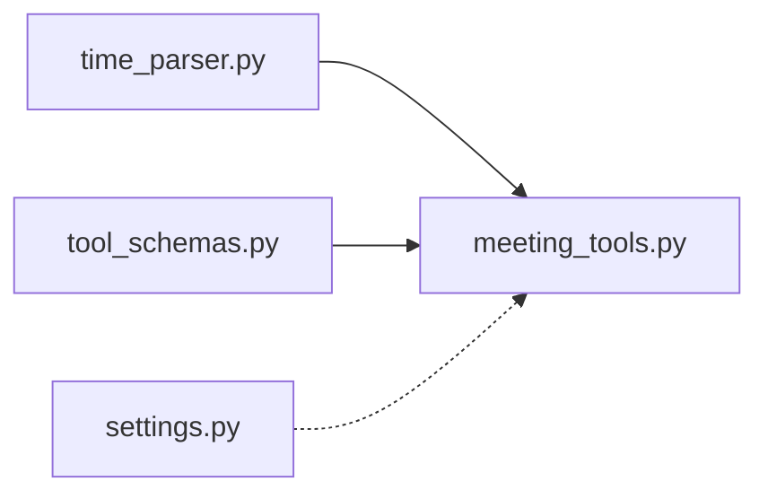

# 时间解析工具

<cite>
**本文引用的文件**
- [time_parser.py](file://agent/tools/time_parser.py)
- [meeting_tools.py](file://agent/tools/meeting_tools.py)
- [tool_schemas.py](file://agent/tools/tool_schemas.py)
- [settings.py](file://config/settings.py)
</cite>

## 目录
1. [简介](#简介)
2. [项目结构](#项目结构)
3. [核心组件](#核心组件)
4. [架构总览](#架构总览)
5. [详细组件分析](#详细组件分析)
6. [依赖关系分析](#依赖关系分析)
7. [性能考量](#性能考量)
8. [故障排查指南](#故障排查指南)
9. [结论](#结论)
10. [附录：常见时间表达式与示例](#附录：常见时间表达式与示例)

## 简介
本模块提供自然语言时间解析能力，将中文口语化时间表达转换为标准 ISO 8601 时间字符串或日期范围，用于会议、待办等工具的参数构造。其重点能力包括：
- 中文时间表达理解（如“明天下午3点”、“下周一上午10点”）
- 相对时间转换（如“后天”、“下周”、“X天后/小时后”）
- 日期范围计算（如“本周”、“本月”）
- 时间格式标准化输出（ISO 8601）

该工具通过规则匹配与正则表达式实现，轻量且可预测，适合在智能体工具链中作为前置解析层。

## 项目结构
时间解析相关代码集中在 agent/tools 目录下，主要文件如下：
- time_parser.py：核心解析逻辑，包含单时间点与日期范围解析
- meeting_tools.py：会议工具执行器，调用时间解析生成查询范围
- tool_schemas.py：工具 Schema 定义，约定时间字段为 ISO 8601
- settings.py：全局配置（未直接参与时间解析，但影响整体系统行为）

图表来源
- [time_parser.py:11-63](file://agent/tools/time_parser.py#L11-L63)
- [meeting_tools.py:116-128](file://agent/tools/meeting_tools.py#L116-L128)

章节来源
- [time_parser.py:1-120](file://agent/tools/time_parser.py#L1-L120)
- [meeting_tools.py:116-128](file://agent/tools/meeting_tools.py#L116-L128)

## 核心组件
- 单时间点解析函数：将自然语言文本转换为 ISO 8601 时间字符串
- 日期范围解析函数：将自然语言范围描述转换为 (start, end) 的 ISO 8601 元组
- 内部日期解析器：处理“昨天/明天/后天/下周/本周/X天后/X小时后”等相对时间
- 内部时间解析器：处理“上午/下午/晚上/早上 + 小时:分钟”或“X点半”等时间片段

章节来源
- [time_parser.py:11-26](file://agent/tools/time_parser.py#L11-L26)
- [time_parser.py:29-63](file://agent/tools/time_parser.py#L29-L63)
- [time_parser.py:66-89](file://agent/tools/time_parser.py#L66-L89)
- [time_parser.py:92-119](file://agent/tools/time_parser.py#L92-L119)

## 架构总览
时间解析工具采用“分阶段解析”的流水线设计：先解析日期部分，再解析时间部分，最后统一输出 ISO 8601。日期范围解析则根据关键词匹配不同周期边界。

图表来源
- [time_parser.py:11-26](file://agent/tools/time_parser.py#L11-L26)
- [time_parser.py:29-63](file://agent/tools/time_parser.py#L29-L63)
- [meeting_tools.py:116-128](file://agent/tools/meeting_tools.py#L116-L128)

## 详细组件分析

### 单时间点解析：parse_natural_time
- 功能：接收自然语言时间与基准时间 now，先解析日期，再解析时间，最终输出 ISO 8601 字符串
- 关键流程：
  - 若未提供 now，默认使用当前时间
  - 调用 _parse_date 得到目标日期
  - 调用 _parse_time 设置具体时分秒
  - 返回 isoformat() 标准化字符串

图表来源
- [time_parser.py:11-26](file://agent/tools/time_parser.py#L11-L26)

章节来源
- [time_parser.py:11-26](file://agent/tools/time_parser.py#L11-L26)

### 日期范围解析：parse_natural_date_range
- 功能：将“今天/明日/本周/下周/本月”等范围描述转换为 (start, end) 的 ISO 8601 元组
- 支持的范围：
  - “今天/今日”：当天 00:00:00 至 23:59:59
  - “明天/明日”：次日 00:00:00 至 23:59:59
  - “本周/这周”：从本周一 00:00:00 到本周日 23:59:59
  - “下周”：下周一起到下周日 23:59:59
  - “本月”：当月第一天 00:00:00 到月末最后一天 23:59:59
  - 其他情况：默认按“当天”处理

图表来源
- [time_parser.py:29-63](file://agent/tools/time_parser.py#L29-L63)

章节来源
- [time_parser.py:29-63](file://agent/tools/time_parser.py#L29-L63)

### 内部日期解析：_parse_date
- 支持的相对时间：
  - “后天”：now + 2天
  - “明天/明日”：now + 1天
  - “昨天”：now - 1天
  - “下下周”：now + 2周
  - “下周”：now + 1周
  - “本周/这周”：保持 now
  - “X天后”：正则匹配数字+“天后”，now + X天
  - “X小时后”：正则匹配数字+“小时后”，now + X小时
  - 未匹配：返回 now

图表来源
- [time_parser.py:66-89](file://agent/tools/time_parser.py#L66-L89)

章节来源
- [time_parser.py:66-89](file://agent/tools/time_parser.py#L66-L89)

### 内部时间解析：_parse_time
- 支持的时间片段：
  - “下午3点”、“上午10点”、“15点”、“3点半”、“10:30”
  - 时段词：上午/下午/晚上/早上
  - 分钟：支持“半点”与“HH:MM”两种形式
- 处理逻辑：
  - 优先匹配带分钟的表达式（含“点/时/:/：”）
  - 其次匹配“X点半”
  - 对“下午/晚上”且小时小于12的情况进行+12转换
  - 对“上午/早上”且小时等于12的情况置为0点
  - 未匹配：保持原 target 不变

图表来源
- [time_parser.py:92-119](file://agent/tools/time_parser.py#L92-L119)

章节来源
- [time_parser.py:92-119](file://agent/tools/time_parser.py#L92-L119)

### 与会议工具的集成
- 会议查询在未指定时间范围时，默认使用“本周”范围，调用 parse_natural_date_range 获取起止时间
- 创建会议时，若未提供结束时间，自动将开始时间加1小时作为结束时间

图表来源
- [meeting_tools.py:116-128](file://agent/tools/meeting_tools.py#L116-L128)
- [meeting_tools.py:17-47](file://agent/tools/meeting_tools.py#L17-L47)

章节来源
- [meeting_tools.py:17-47](file://agent/tools/meeting_tools.py#L17-L47)
- [meeting_tools.py:116-128](file://agent/tools/meeting_tools.py#L116-L128)

## 依赖关系分析
- time_parser.py 仅依赖 Python 标准库 re 与 datetime，无外部库耦合
- meeting_tools.py 在查询会议时依赖 time_parser 的日期范围解析
- tool_schemas.py 定义了工具参数中的时间字段格式为 ISO 8601，确保上下游一致
- settings.py 不直接参与时间解析，但控制工具调用开关与确认策略，间接影响时间解析的使用场景

图表来源
- [time_parser.py:1-120](file://agent/tools/time_parser.py#L1-L120)
- [meeting_tools.py:116-128](file://agent/tools/meeting_tools.py#L116-L128)
- [tool_schemas.py:1-121](file://agent/tools/tool_schemas.py#L1-L121)
- [settings.py:1-216](file://config/settings.py#L1-L216)

章节来源
- [time_parser.py:1-120](file://agent/tools/time_parser.py#L1-L120)
- [meeting_tools.py:116-128](file://agent/tools/meeting_tools.py#L116-L128)
- [tool_schemas.py:1-121](file://agent/tools/tool_schemas.py#L1-L121)
- [settings.py:1-216](file://config/settings.py#L1-L216)

## 性能考量
- 解析复杂度：基于字符串匹配与正则表达式，时间复杂度近似 O(n)，n 为输入文本长度；对于典型短句（几十到上百字符），开销极低
- 内存占用：仅使用基本数据类型与少量中间变量，内存占用稳定
- 可扩展性：新增时间表达可通过增加关键词匹配或正则模式快速扩展，无需重构主流程
- 建议优化：
  - 对高频表达式可引入缓存（如 LRU）避免重复解析
  - 对复杂长句可考虑分词预处理以提升匹配准确率

[本节为通用性能讨论，不直接分析具体文件]

## 故障排查指南
- 未识别时间表达：
  - 检查是否使用了不支持的词汇或格式
  - 确认输入中包含“今天/明天/后天/下周/本周/本月”等关键词，或“X天后/X小时后”等相对时间
- 时间转换异常：
  - 注意“下午/晚上”的小时转换规则（<12 会 +12）
  - 注意“上午/早上”的12点会被视为0点
- 日期范围不符合预期：
  - 确认传入文本是否命中对应分支（如“本周”与“这周”等价）
  - 跨月/跨年边界由内置逻辑处理，若需自定义范围请修改对应分支
- 与会议工具集成问题：
  - 若未传入 date_from/date_to，默认使用“本周”范围
  - 创建会议时未传 end_time，会自动将 start_time 加1小时

章节来源
- [time_parser.py:29-63](file://agent/tools/time_parser.py#L29-L63)
- [time_parser.py:66-89](file://agent/tools/time_parser.py#L66-L89)
- [time_parser.py:92-119](file://agent/tools/time_parser.py#L92-L119)
- [meeting_tools.py:17-47](file://agent/tools/meeting_tools.py#L17-L47)
- [meeting_tools.py:116-128](file://agent/tools/meeting_tools.py#L116-L128)

## 结论
该时间解析工具以规则驱动的方式实现了中文自然语言时间的常用表达解析，覆盖相对时间、时间段与日期范围，并通过 ISO 8601 标准化输出，便于与会议、待办等工具无缝集成。其实现简洁、可维护性强，适合在智能体工具链中作为时间语义的前置解析层。未来可根据业务需求扩展更丰富的时间表达与验证机制。

[本节为总结性内容，不直接分析具体文件]

## 附录：常见时间表达式与示例
以下为常见时间表达及其解析思路说明（不展示具体代码）：
- “明天下午3点”：
  - 日期：明天 → now + 1天
  - 时间：下午3点 → 15:00:00
  - 输出：ISO 8601 时间字符串
- “下周一上午10点”：
  - 日期：下周 → now + 1周（后续可按星期进一步定位）
  - 时间：上午10点 → 10:00:00
  - 输出：ISO 8601 时间字符串
- “2小时后”：
  - 日期：相对时间 → now + 2小时
  - 时间：未指定 → 保持原时分秒
  - 输出：ISO 8601 时间字符串
- “本周”：
  - 范围：本周一 00:00:00 到本周日 23:59:59
  - 输出：(start_iso, end_iso)
- “本月”：
  - 范围：当月第一天 00:00:00 到月末最后一天 23:59:59
  - 输出：(start_iso, end_iso)
- “3点半”：
  - 时间：XX:30:00
  - 输出：ISO 8601 时间字符串

章节来源
- [time_parser.py:66-89](file://agent/tools/time_parser.py#L66-L89)
- [time_parser.py:92-119](file://agent/tools/time_parser.py#L92-L119)
- [time_parser.py:29-63](file://agent/tools/time_parser.py#L29-L63)