# 四路分流机制

<cite>
**本文引用的文件**
- [graph.py](file://agent/graph.py)
- [nodes.py](file://agent/nodes.py)
- [state.py](file://agent/state.py)
- [settings.py](file://config/settings.py)
- [retriever.py](file://rag/retriever.py)
- [web_search.py](file://rag/web_search.py)
- [long_term.py](file://memory/long_term.py)
- [main.py](file://main.py)
</cite>

## 目录
1. [简介](#简介)
2. [项目结构](#项目结构)
3. [核心组件](#核心组件)
4. [架构总览](#架构总览)
5. [详细组件分析](#详细组件分析)
6. [依赖关系分析](#依赖关系分析)
7. [性能考量](#性能考量)
8. [故障排查指南](#故障排查指南)
9. [结论](#结论)
10. [附录](#附录)

## 简介
本文件系统性解析智能体的“四路分流”机制：预检查节点的意图识别逻辑、路由决策算法与分流策略；知识库检索（RAG）、联网搜索、长期记忆加载、工具调用四条路径的选择条件与处理流程；并给出路由条件的判断逻辑、性能优化策略、错误处理机制，以及路由规则定制与调试方法。

## 项目结构
- 工作流编排：基于 LangGraph StateGraph，定义节点与边，实现“预检查 + 四路分流 + 后台记忆更新”。
- 节点实现：预检查、路由判断、RAG检索、联网搜索、长期记忆加载、生成回答、后台记忆更新、工具调用等。
- 配置管理：统一从环境变量/.env读取LLM、检索、记忆、联网搜索、工具调用等开关与阈值。
- 外部能力：向量库检索、重排序、BM25多路召回、DuckDuckGo/百度搜索、SQLite长期记忆。

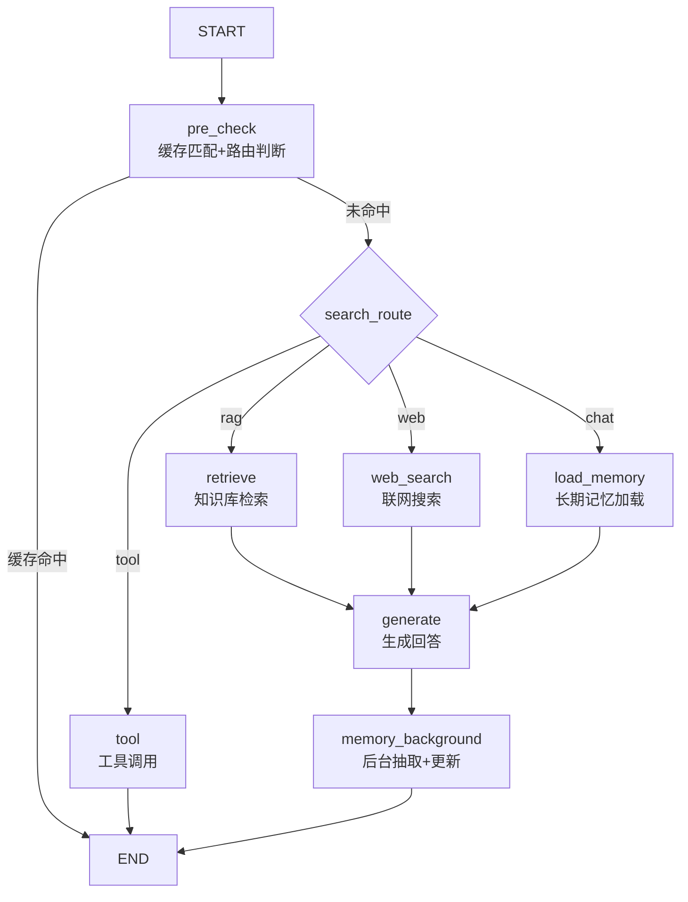

图表来源
- [graph.py:44-102](file://agent/graph.py#L44-L102)
- [nodes.py:93-150](file://agent/nodes.py#L93-L150)

章节来源
- [graph.py:1-102](file://agent/graph.py#L1-L102)
- [nodes.py:93-150](file://agent/nodes.py#L93-L150)

## 核心组件
- 预检查节点：合并问答缓存匹配与路由判断，支持待确认工具快速执行。
- 路由决策：关键词短路 + LLM小模型判断 + 配置开关兜底，输出 search_route。
- 四路分支：
  - 知识库检索（retrieve）：查询改写 → 多路召回 → 重排序 → 相关度过滤 → 上下文格式化。
  - 联网搜索（web_search）：双引擎搜索（DDG优先，百度回退）→ 格式化上下文。
  - 长期记忆加载（load_memory）：分层构建用户画像/事实/摘要，注入生成。
  - 工具调用（tool）：参数提取 → 写操作确认 → 执行 → 结果返回。
- 生成节点（generate）：组装系统提示与历史消息，流式生成回答，失败自动降级备用模型。
- 后台记忆（memory_background）：关键信息抽取 + 长期记忆摘要更新，不阻塞主链路。

章节来源
- [nodes.py:93-150](file://agent/nodes.py#L93-L150)
- [nodes.py:285-361](file://agent/nodes.py#L285-L361)
- [nodes.py:499-533](file://agent/nodes.py#L499-L533)
- [nodes.py:631-643](file://agent/nodes.py#L631-L643)
- [retriever.py:18-53](file://rag/retriever.py#L18-L53)
- [web_search.py:76-134](file://rag/web_search.py#L76-L134)
- [long_term.py:424-498](file://memory/long_term.py#L424-L498)

## 架构总览
下图展示请求进入后的完整流转：安全校验与限流熔断后进入图执行，预检查阶段可能直接命中问答缓存或走四路分流，最终汇聚到生成或工具直出，并在后台异步更新记忆。

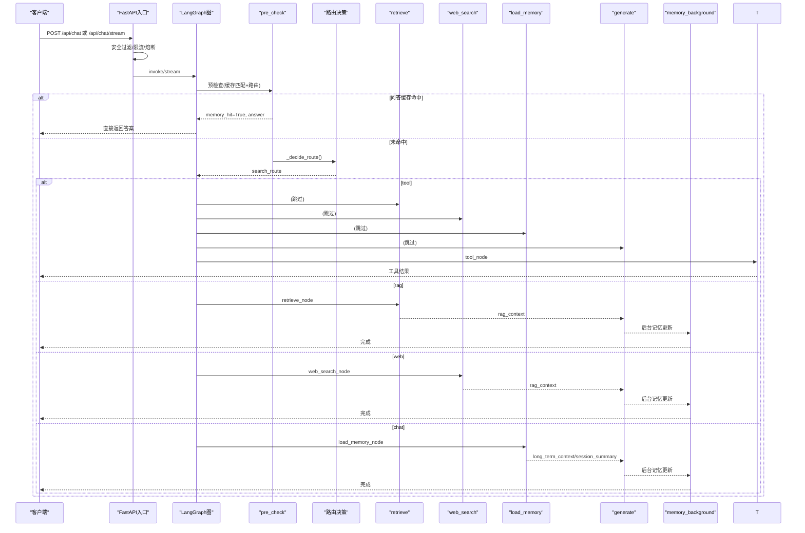

图表来源
- [main.py:154-210](file://main.py#L154-L210)
- [graph.py:44-102](file://agent/graph.py#L44-L102)
- [nodes.py:93-150](file://agent/nodes.py#L93-L150)
- [nodes.py:285-361](file://agent/nodes.py#L285-L361)
- [nodes.py:499-533](file://agent/nodes.py#L499-L533)
- [nodes.py:631-643](file://agent/nodes.py#L631-L643)

## 详细组件分析

### 预检查与意图识别
- 预检查节点顺序执行：
  - 问答缓存匹配：若启用且问题非时效性，计算向量相似度，命中则直接复用历史答案并短路至 END。
  - 路由判断：关键词短路（工具/时效性/短输入）→ LLM小模型判断 → 配置开关兜底，写入 search_route。
- 待确认工具优先：若上一轮 pending_confirmation 且本轮为确认词，直接执行工具并返回结果。

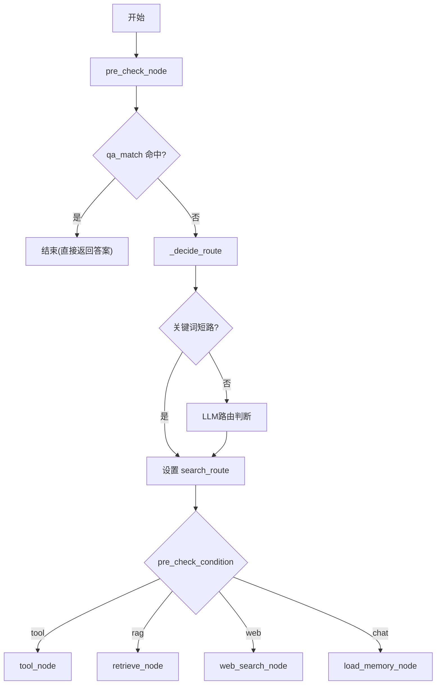

图表来源
- [nodes.py:93-150](file://agent/nodes.py#L93-L150)
- [nodes.py:161-211](file://agent/nodes.py#L161-L211)

章节来源
- [nodes.py:93-150](file://agent/nodes.py#L93-L150)
- [nodes.py:161-211](file://agent/nodes.py#L161-L211)
- [nodes.py:233-281](file://agent/nodes.py#L233-L281)

### 路由决策算法
- 优先级与短路：
  - 工具调用关键词优先（需开启 tool_calling_enabled）。
  - 时效性问题（天气/明确时间表达）优先走联网搜索（需开启 web_search_enabled）。
  - 短输入（≤4字且不含疑问/搜索/工具词）倾向闲聊。
- LLM路由：使用路由小模型（temperature=0.0），根据 prompt 输出决定 tool/web/rag/chat。
- 配置兜底：当 web_search 关闭时，web 路由降级为 rag；LLM异常时回退关键词兜底。

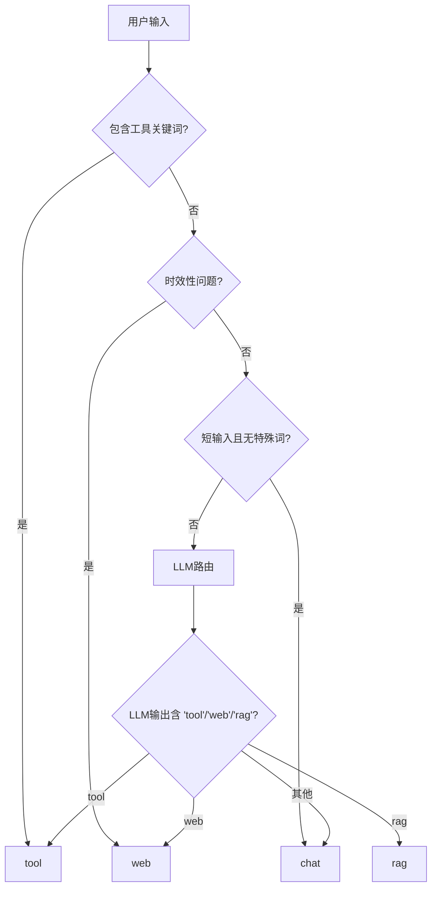

图表来源
- [nodes.py:161-211](file://agent/nodes.py#L161-L211)
- [settings.py:109-155](file://config/settings.py#L109-L155)

章节来源
- [nodes.py:161-211](file://agent/nodes.py#L161-L211)
- [settings.py:109-155](file://config/settings.py#L109-L155)

### 知识库检索（RAG）
- 流程：查询改写（可选）→ 多路召回（向量+BM25，RRF融合）→ 重排序（CrossEncoder）→ 相关度阈值过滤（仅纯向量路径）→ 上下文格式化。
- 配置项：rerank_enabled、rag_bm25_enabled、rag_min_relevance、rag_top_k、rerank_top_k 等。
- 相关度过滤说明：仅在 rerank/BM25 关闭的纯向量路径下生效，避免分数语义不一致导致误判。

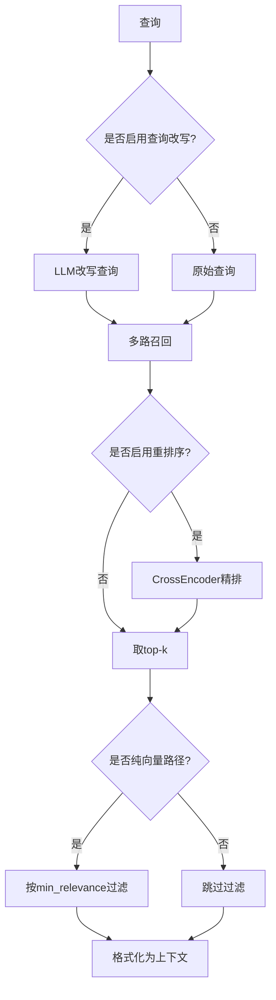

图表来源
- [retriever.py:18-53](file://rag/retriever.py#L18-L53)
- [retriever.py:78-110](file://rag/retriever.py#L78-L110)
- [retriever.py:113-134](file://rag/retriever.py#L113-L134)
- [nodes.py:285-321](file://agent/nodes.py#L285-L321)

章节来源
- [retriever.py:18-53](file://rag/retriever.py#L18-L53)
- [retriever.py:78-110](file://rag/retriever.py#L78-L110)
- [retriever.py:113-134](file://rag/retriever.py#L113-L134)
- [nodes.py:285-321](file://agent/nodes.py#L285-L321)

### 联网搜索
- 双引擎：优先 DuckDuckGo，失败或无结果回退百度。
- 结果统一格式化为带来源标记的文本块，供 generate 节点作为 rag_context 使用。
- 可配置最大结果数与超时。

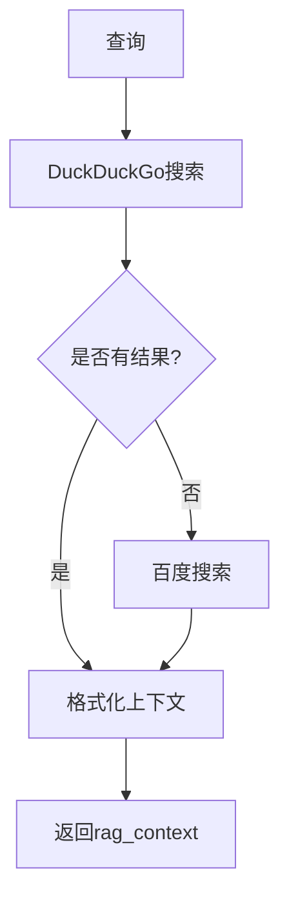

图表来源
- [web_search.py:76-134](file://rag/web_search.py#L76-L134)
- [nodes.py:325-341](file://agent/nodes.py#L325-L341)

章节来源
- [web_search.py:76-134](file://rag/web_search.py#L76-L134)
- [nodes.py:325-341](file://agent/nodes.py#L325-L341)

### 长期记忆加载
- 分层构建：P0用户画像/关键事实（硬保留）→ P1最近摘要/关键词召回事实 → P2更早摘要（按预算填充）。
- 会话压缩摘要：短期窗口超出时滚动压缩，注入生成以保留主线上下文。
- 时效性问题不写入长期记忆，避免污染。

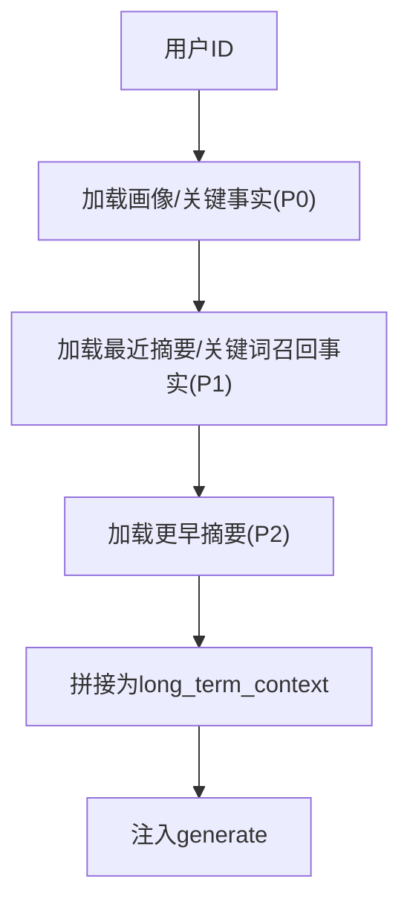

图表来源
- [long_term.py:424-498](file://memory/long_term.py#L424-L498)
- [nodes.py:345-361](file://agent/nodes.py#L345-L361)

章节来源
- [long_term.py:424-498](file://memory/long_term.py#L424-L498)
- [nodes.py:345-361](file://agent/nodes.py#L345-L361)

### 工具调用
- 参数提取：使用路由小模型从用户输入提取工具名与参数。
- 写操作确认：可配置是否需要用户确认（如创建/取消/修改会议）。
- 执行与返回：查询类操作直接执行；写操作确认后执行；结果格式化为可读文本。

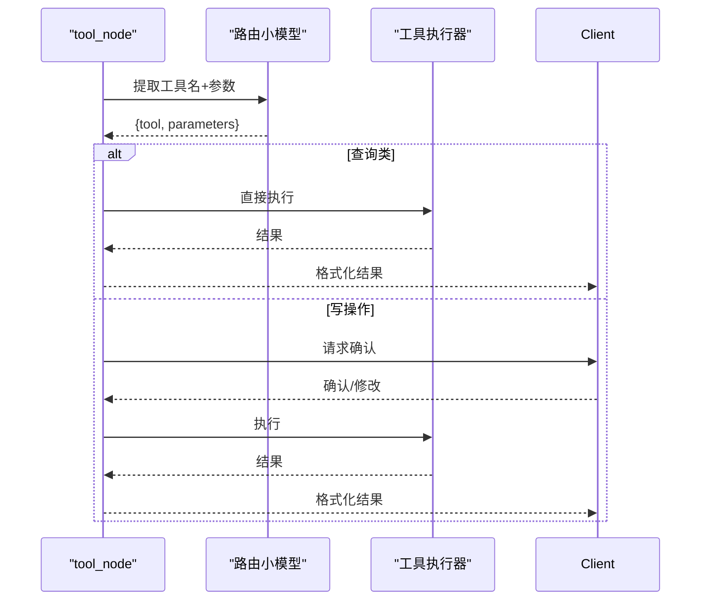

图表来源
- [nodes.py:647-780](file://agent/nodes.py#L647-L780)
- [settings.py:151-155](file://config/settings.py#L151-L155)

章节来源
- [nodes.py:647-780](file://agent/nodes.py#L647-L780)
- [settings.py:151-155](file://config/settings.py#L151-L155)

### 生成回答与降级
- 组装提示：系统提示（含长期记忆/RAG上下文）+ 历史消息（窗口+预算+更早对话摘要）+ 当前输入。
- 流式生成：逐 token 输出，同时累计完整回答用于状态与记忆。
- 降级策略：主模型失败时依次尝试备用模型列表，全部失败返回友好错误。

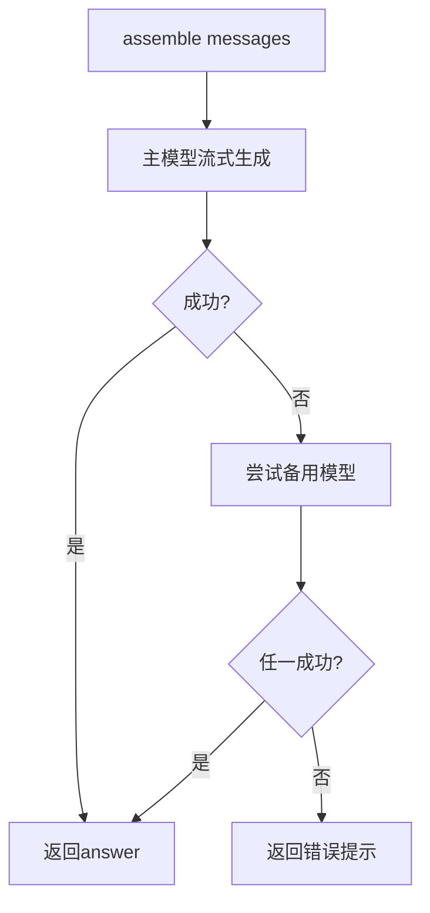

图表来源
- [nodes.py:454-533](file://agent/nodes.py#L454-L533)
- [settings.py:29-48](file://config/settings.py#L29-L48)

章节来源
- [nodes.py:454-533](file://agent/nodes.py#L454-L533)
- [settings.py:29-48](file://config/settings.py#L29-L48)

### 后台记忆更新
- 关键信息抽取：规则快速路径（零LLM成本）+ 可选LLM结构化抽取。
- 长期记忆摘要：周期性增量合并，关键事实单独落库防丢失。
- 时效性问题不保存长期记忆。

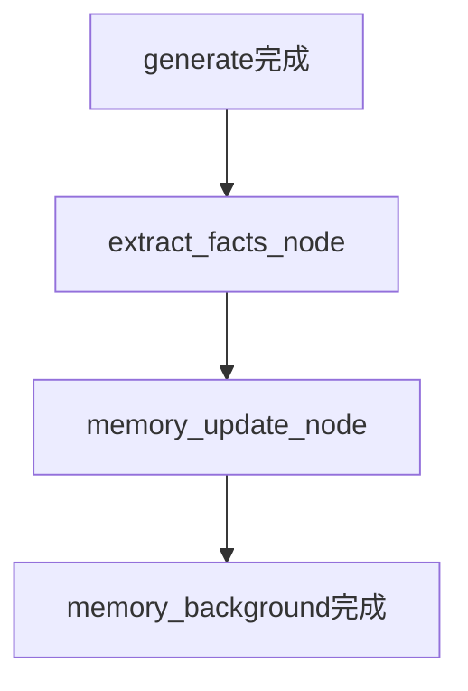

图表来源
- [nodes.py:364-413](file://agent/nodes.py#L364-L413)
- [nodes.py:536-565](file://agent/nodes.py#L536-L565)
- [nodes.py:631-643](file://agent/nodes.py#L631-L643)

章节来源
- [nodes.py:364-413](file://agent/nodes.py#L364-L413)
- [nodes.py:536-565](file://agent/nodes.py#L536-L565)
- [nodes.py:631-643](file://agent/nodes.py#L631-L643)

## 依赖关系分析
- graph.py 通过 add_node/add_edge 将 nodes.py 中的节点串联为状态图，并使用 checkpointer 维护短期上下文。
- nodes.py 依赖 config/settings.py 获取全局配置，依赖 rag/* 与 memory/* 提供检索与记忆能力。
- main.py 提供 Web 接口与安全/限流/熔断前置处理，并启动预热与向量库初始化。

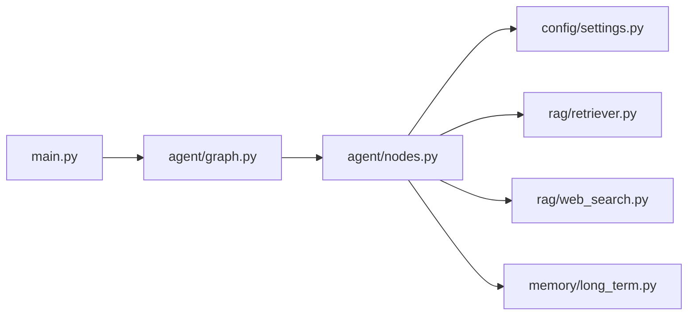

图表来源
- [main.py:154-210](file://main.py#L154-L210)
- [graph.py:44-102](file://agent/graph.py#L44-L102)
- [nodes.py:93-150](file://agent/nodes.py#L93-L150)

章节来源
- [main.py:154-210](file://main.py#L154-L210)
- [graph.py:44-102](file://agent/graph.py#L44-L102)
- [nodes.py:93-150](file://agent/nodes.py#L93-L150)

## 性能考量
- 首请求延迟优化：
  - 启动时预热路由小模型与主模型连接（TLS握手/DNS/连接池）。
  - 启动时检查并初始化向量库，必要时全量重建索引；预热 BM25 索引。
- 流式响应与超时保护：
  - 流式接口整体超时控制，超时后返回已生成内容，避免连接卡死。
- 检索优化：
  - 多路召回（向量+BM25）与RRF融合提升召回率；重排序精排提升相关性。
  - 纯向量路径下按 min_relevance 过滤低质上下文，减少幻觉。
- 记忆优化：
  - 问答缓存命中直接返回，跳过大模型链路。
  - 长期记忆分层预算与滚动摘要，避免上下文溢出。
- 容错与降级：
  - 路由/抽取/检索/搜索/生成各层异常均 try/except 兜底，不影响主链路。
  - 生成失败自动降级到备用模型列表。

章节来源
- [main.py:45-135](file://main.py#L45-L135)
- [main.py:228-314](file://main.py#L228-L314)
- [retriever.py:18-53](file://rag/retriever.py#L18-L53)
- [nodes.py:467-497](file://agent/nodes.py#L467-L497)
- [nodes.py:233-281](file://agent/nodes.py#L233-L281)

## 故障排查指南
- 路由异常：
  - 检查工具/联网搜索开关与关键词匹配；查看 LLM路由是否异常并回退关键词兜底。
  - 参考：[nodes.py:161-211](file://agent/nodes.py#L161-L211)
- 检索失败：
  - 检查 rerank/BM25 配置与阈值；查看检索日志与过滤前后文档数量。
  - 参考：[nodes.py:285-321](file://agent/nodes.py#L285-L321), [retriever.py:18-53](file://rag/retriever.py#L18-L53)
- 联网搜索失败：
  - 检查 DDG/百度可用性；查看搜索结果是否为空并回退策略。
  - 参考：[web_search.py:76-134](file://rag/web_search.py#L76-L134)
- 生成失败：
  - 查看主模型与备用模型调用日志；确认超时与重试配置。
  - 参考：[nodes.py:467-497](file://agent/nodes.py#L467-L497), [settings.py:29-48](file://config/settings.py#L29-L48)
- 记忆异常：
  - 检查问答缓存开关与阈值；查看长期记忆表结构与写入日志。
  - 参考：[nodes.py:233-281](file://agent/nodes.py#L233-L281), [long_term.py:424-498](file://memory/long_term.py#L424-L498)

章节来源
- [nodes.py:161-211](file://agent/nodes.py#L161-L211)
- [nodes.py:285-321](file://agent/nodes.py#L285-L321)
- [web_search.py:76-134](file://rag/web_search.py#L76-L134)
- [nodes.py:467-497](file://agent/nodes.py#L467-L497)
- [nodes.py:233-281](file://agent/nodes.py#L233-L281)
- [long_term.py:424-498](file://memory/long_term.py#L424-L498)

## 结论
该智能体通过“预检查 + 四路分流”实现了高效、可控的路由与处理能力：问答缓存短路、关键词与LLM结合的路由决策、多路检索与重排序、双引擎联网搜索、分层长期记忆与后台异步更新，配合完善的降级与容错机制，兼顾了性能与稳定性。通过配置开关与阈值可调，便于在不同场景下定制路由规则与行为。

## 附录

### 路由规则定制
- 工具调用：
  - 开关：tool_calling_enabled
  - 写操作确认：tool_confirmation_required
  - 参考：[settings.py:151-155](file://config/settings.py#L151-L155)
- 联网搜索：
  - 开关：web_search_enabled
  - 最大结果数：web_search_max_results
  - 参考：[settings.py:109-112](file://config/settings.py#L109-L112)
- RAG检索：
  - 重排序：rerank_enabled
  - BM25多路：rag_bm25_enabled
  - 最小相关度：rag_min_relevance
  - 参考：[settings.py:83-100](file://config/settings.py#L83-L100)
- 记忆：
  - 问答缓存：memory_qa_cache_enabled, memory_qa_threshold
  - 长期记忆摘要频率：memory_summary_every
  - 参考：[settings.py:114-133](file://config/settings.py#L114-L133)

### 调试方法
- REPL调试模式：本地交互式测试，流式输出节点进度与token。
  - 参考：[main.py:329-362](file://main.py#L329-L362)
- 健康检查：服务状态与checkpointer类型。
  - 参考：[main.py:317-326](file://main.py#L317-L326)
- 流式事件：status/token/error/done 四类事件，便于前端渲染与定位瓶颈。
  - 参考：[main.py:228-314](file://main.py#L228-L314)

章节来源
- [settings.py:83-155](file://config/settings.py#L83-L155)
- [main.py:317-362](file://main.py#L317-L362)