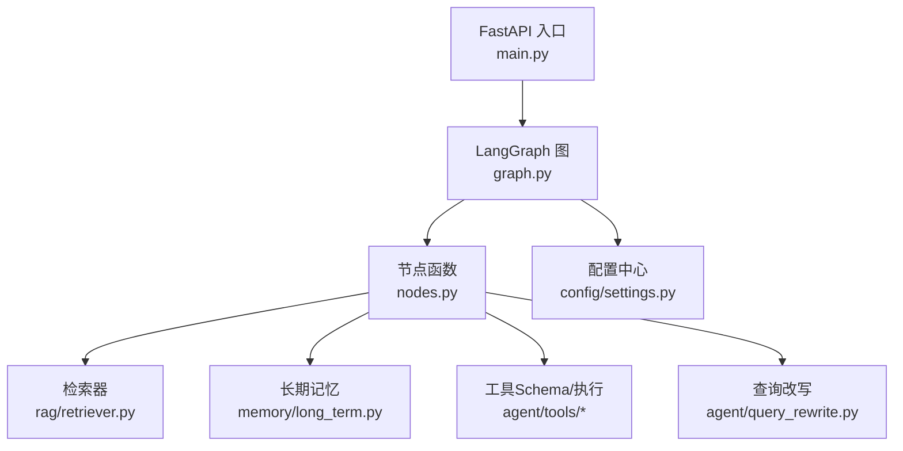
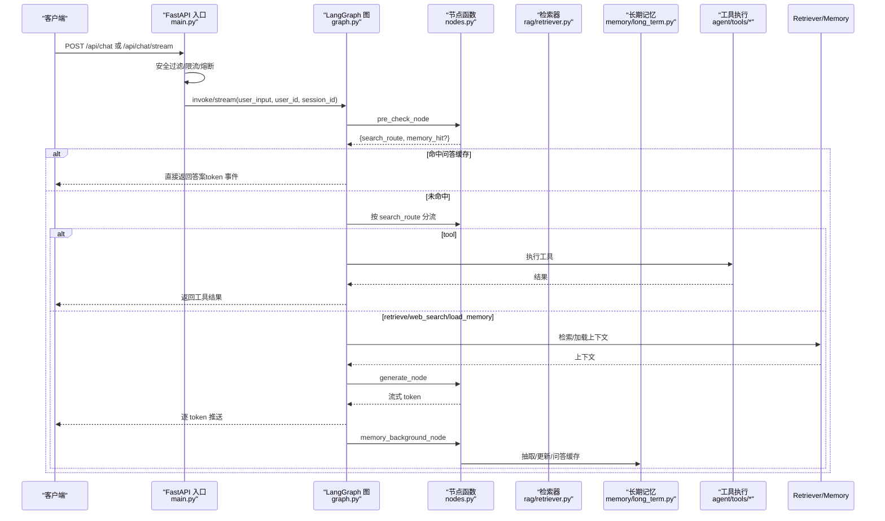
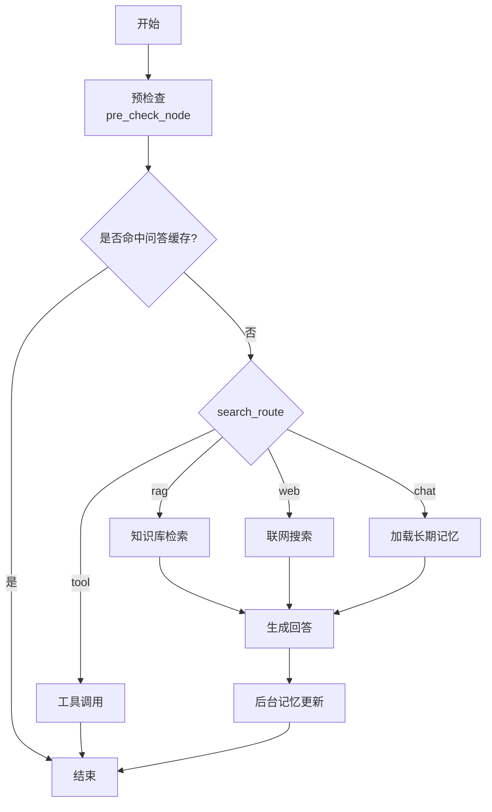
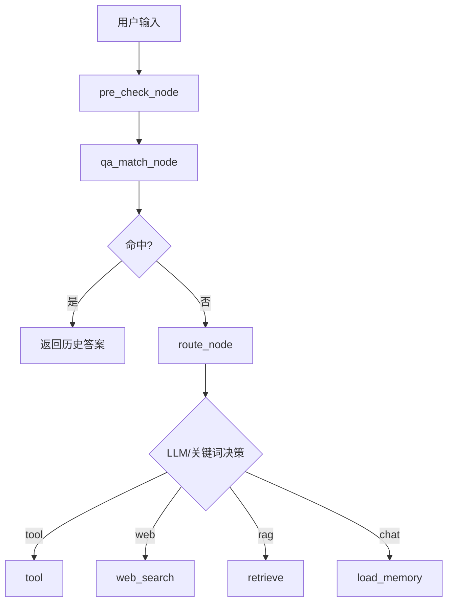
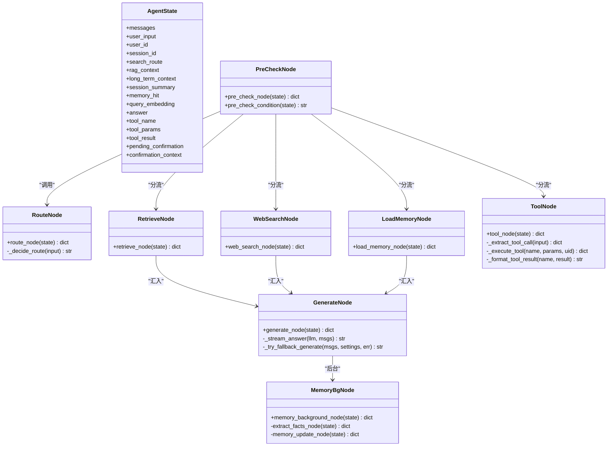
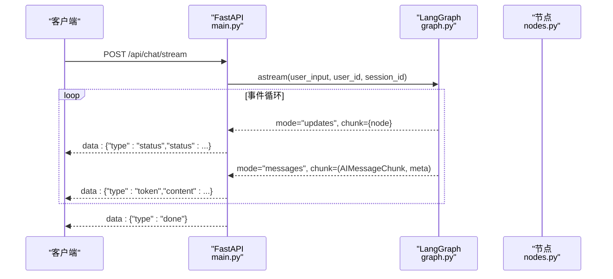
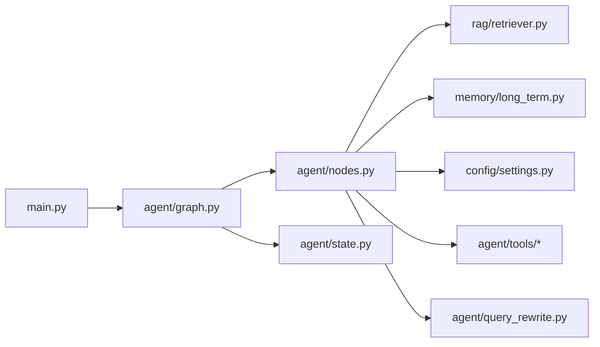

# 智能体工作流系统

<cite>
**本文引用的文件**
- [graph.py](file://agent/graph.py)
- [nodes.py](file://agent/nodes.py)
- [state.py](file://agent/state.py)
- [main.py](file://main.py)
- [settings.py](file://config/settings.py)
- [query_rewrite.py](file://agent/query_rewrite.py)
- [long_term.py](file://memory/long_term.py)
- [retriever.py](file://rag/retriever.py)
- [tool_schemas.py](file://agent/tools/tool_schemas.py)
</cite>

## 目录
1. [简介](#简介)
2. [项目结构](#项目结构)
3. [核心组件](#核心组件)
4. [架构总览](#架构总览)
5. [详细组件分析](#详细组件分析)
6. [依赖关系分析](#依赖关系分析)
7. [性能考量](#性能考量)
8. [故障排查指南](#故障排查指南)
9. [结论](#结论)
10. [附录](#附录)

## 简介
本系统基于 LangGraph 构建智能体工作流，实现“预检查 + 四路分流 + 后台记忆”的完整链路：预检查阶段进行问答缓存匹配与路由判断；未命中时按意图分流至 RAG 检索、联网搜索、长期记忆加载或工具调用；生成回答后在后台异步更新长期记忆。系统提供同步与流式两种调用方式，支持 Web SSE 实时输出，具备限流、熔断、降级、安全过滤等工程化能力。

## 项目结构
- agent/graph.py：LangGraph 状态图构建、节点注册、条件边编排、编译与单例管理、流式事件统一封装
- agent/nodes.py：各处理节点实现（预检查、路由、RAG、联网搜索、长期记忆、生成、后台记忆、工具调用）
- agent/state.py：AgentState 状态定义（消息历史、上下文、路由结果、工具上下文等）
- config/settings.py：全局配置（LLM、向量库、记忆、检索、工具开关等）
- main.py：FastAPI 入口（Web 聊天、SSE 流式接口、健康检查、启动预热）
- rag/retriever.py：检索器（多路召回、重排序、上下文格式化）
- memory/long_term.py：长期记忆（画像、事实、摘要、会话压缩、问答缓存）
- agent/query_rewrite.py：查询改写（提升检索召回率）
- agent/tools/tool_schemas.py：工具 Schema 与参数提取提示词

图表来源
- [main.py:154-314](file://main.py#L154-L314)
- [graph.py:44-102](file://agent/graph.py#L44-L102)
- [nodes.py:93-780](file://agent/nodes.py#L93-L780)
- [retriever.py:18-140](file://rag/retriever.py#L18-L140)
- [long_term.py:424-498](file://memory/long_term.py#L424-L498)
- [settings.py:19-216](file://config/settings.py#L19-L216)

章节来源
- [main.py:1-387](file://main.py#L1-L387)
- [graph.py:1-255](file://agent/graph.py#L1-L255)

## 核心组件
- 状态图与节点编排：通过 StateGraph 注册节点并添加线性边与条件边，实现“预检查→分流→生成→后台记忆”的主流程
- 预检查：合并问答缓存匹配与路由判断，命中则短路到 END，未命中进入分流
- 四路分流：根据 search_route 选择 retrieve/web_search/load_memory/tool，tool 直接返回结果，其他汇入 generate
- 生成回答：组装 system prompt、历史消息与当前输入，流式生成并支持主模型失败自动降级
- 后台记忆：抽取关键信息、更新长期记忆与问答缓存，不阻塞响应
- 流式响应：统一封装 updates/messages 双模式事件，过滤重复与内部 LLM 调用，仅透传最终 token

章节来源
- [graph.py:44-102](file://agent/graph.py#L44-L102)
- [nodes.py:93-151](file://agent/nodes.py#L93-L151)
- [nodes.py:499-533](file://agent/nodes.py#L499-L533)
- [nodes.py:631-643](file://agent/nodes.py#L631-L643)
- [graph.py:141-255](file://agent/graph.py#L141-L255)

## 架构总览
下图展示从请求进入到流式输出的整体时序，包括安全校验、限流熔断、图执行、节点流转与事件封装。

图表来源
- [main.py:154-314](file://main.py#L154-L314)
- [graph.py:44-102](file://agent/graph.py#L44-L102)
- [nodes.py:93-151](file://agent/nodes.py#L93-L151)
- [nodes.py:285-341](file://agent/nodes.py#L285-L341)
- [nodes.py:499-533](file://agent/nodes.py#L499-L533)
- [nodes.py:631-643](file://agent/nodes.py#L631-L643)
- [retriever.py:18-140](file://rag/retriever.py#L18-L140)

## 详细组件分析

### 状态图构建与四路分流机制
- 节点注册：pre_check、load_memory、retrieve、web_search、tool、generate、memory_background
- 线性边：load_memory→generate、retrieve→generate、web_search→generate、tool→END、generate→memory_background→END
- 条件边：START→pre_check；pre_check 通过 pre_check_condition 分流到 end/tool/retrieve/web_search/load_memory/generate
- 编译挂载 checkpointer：默认进程内 MemorySaver，按 thread_id 维护短期上下文

图表来源
- [graph.py:55-92](file://agent/graph.py#L55-L92)
- [nodes.py:131-151](file://agent/nodes.py#L131-L151)

章节来源
- [graph.py:44-102](file://agent/graph.py#L44-L102)
- [nodes.py:131-151](file://agent/nodes.py#L131-L151)

### 预检查与意图识别
- 预检查节点：优先处理 pending_confirmation 确认状态；执行 qa_match_node；若未命中则执行 route_node
- 路由判断：关键词短路（工具/时效性/短输入）+ LLM 路由 + 关键词兜底三层策略，写入 search_route
- 时效性问题：含明确时间表达或天气关键词，优先走联网搜索且不写入长期记忆

图表来源
- [nodes.py:93-151](file://agent/nodes.py#L93-L151)
- [nodes.py:154-212](file://agent/nodes.py#L154-L212)

章节来源
- [nodes.py:93-151](file://agent/nodes.py#L93-L151)
- [nodes.py:154-212](file://agent/nodes.py#L154-L212)

### 节点处理逻辑
- 问答记忆匹配：向量化问题，检索相似历史问答，命中则返回答案并标记 memory_hit=True，同时写入短期历史保证连贯
- RAG 检索：可选查询改写 → 多路召回（向量/BM25）→ 重排序（可选）→ 相关度阈值过滤 → 格式化为上下文字符串
- 联网搜索：调用搜索接口，结果复用 rag_context 字段
- 长期记忆加载：分层构建记忆上下文（画像/事实/摘要），并加载会话压缩摘要
- 生成回答：组装 system prompt + 历史消息（窗口+预算+更早对话摘要）+ 当前输入，流式生成；主模型失败自动降级备用模型
- 后台记忆：规则快速抽取 + LLM 结构化抽取（可选）→ 更新长期记忆与问答缓存，时效性问题跳过

图表来源
- [state.py:12-51](file://agent/state.py#L12-L51)
- [nodes.py:93-151](file://agent/nodes.py#L93-L151)
- [nodes.py:233-282](file://agent/nodes.py#L233-L282)
- [nodes.py:285-341](file://agent/nodes.py#L285-L341)
- [nodes.py:345-361](file://agent/nodes.py#L345-L361)
- [nodes.py:499-533](file://agent/nodes.py#L499-L533)
- [nodes.py:631-643](file://agent/nodes.py#L631-L643)
- [nodes.py:647-780](file://agent/nodes.py#L647-L780)

章节来源
- [nodes.py:233-282](file://agent/nodes.py#L233-L282)
- [nodes.py:285-341](file://agent/nodes.py#L285-L341)
- [nodes.py:345-361](file://agent/nodes.py#L345-L361)
- [nodes.py:499-533](file://agent/nodes.py#L499-L533)
- [nodes.py:631-643](file://agent/nodes.py#L631-L643)
- [nodes.py:647-780](file://agent/nodes.py#L647-L780)

### 流式响应处理
- 统一事件封装：将 graph.stream/astream 的 updates/messages 双模式转为统一的 node/token 事件
- 过滤规则：仅透传 generate 节点的 AIMessageChunk；问答记忆命中与工具调用直接补发 answer 为 token；跳过末尾完整消息重复
- Web SSE：/api/chat/stream 使用 StreamingResponse 推送 status/token/done/error 事件，支持整体超时保护

图表来源
- [graph.py:141-255](file://agent/graph.py#L141-L255)
- [main.py:228-314](file://main.py#L228-L314)

章节来源
- [graph.py:141-255](file://agent/graph.py#L141-L255)
- [main.py:228-314](file://main.py#L228-L314)

### 工具调用与确认机制
- 工具提取：用路由小模型从用户输入解析工具名与参数（create_todo/query_todos/create_meeting/cancel_meeting/update_meeting/query_meetings）
- 写操作确认：可配置是否需要用户确认（pending_confirmation + confirmation_context），确认后执行
- 结果格式化：不同工具类型对应不同格式化器，错误返回友好提示

章节来源
- [nodes.py:647-780](file://agent/nodes.py#L647-L780)
- [tool_schemas.py:1-26](file://agent/tools/tool_schemas.py#L1-L26)

### 检索与重排序
- 多路召回：BM25 开启时向量检索 + BM25 并行召回，RRF 融合排序；关闭时仅向量检索
- 重排序：CrossEncoder 对候选精排，取 top-k；可配置关闭以回退向量检索
- 上下文格式化：统一归一化分数，标注来源与标题，便于生成节点注入

章节来源
- [retriever.py:18-140](file://rag/retriever.py#L18-L140)

### 长期记忆与会话压缩
- 分层构建：P0 画像与高优先级事实硬保留；P1 最近摘要与关键词召回事实；P2 更早摘要按预算填充
- 会话压缩：短期窗口超出时滚动生成摘要，避免上下文硬丢失
- 问答缓存：相似问题直接复用历史答案，减少大模型调用

章节来源
- [long_term.py:424-498](file://memory/long_term.py#L424-L498)
- [long_term.py:729-800](file://memory/long_term.py#L729-L800)

## 依赖关系分析
- 模块耦合：graph.py 依赖 nodes.py、state.py；nodes.py 依赖 retriever.py、long_term.py、settings.py；main.py 依赖 graph.py 与 nodes.py
- 外部依赖：LangChain/LangGraph、OpenAI 兼容 LLM、Milvus Lite、SQLite、FastAPI
- 潜在环：无直接循环导入；运行时动态导入降低启动开销

图表来源
- [main.py:154-314](file://main.py#L154-L314)
- [graph.py:44-102](file://agent/graph.py#L44-L102)
- [nodes.py:93-780](file://agent/nodes.py#L93-L780)

章节来源
- [graph.py:44-102](file://agent/graph.py#L44-L102)
- [nodes.py:93-780](file://agent/nodes.py#L93-L780)
- [main.py:154-314](file://main.py#L154-L314)

## 性能考量
- 首请求延迟优化：启动时预热 LLM 连接（TLS/DNS/连接池）、向量库初始化与 BM25 索引预热
- 流式响应：逐 token 推送，降低端到端延迟；整体超时保护防止连接卡死
- 检索优化：多路召回 + 重排序 + 相关度阈值过滤，平衡召回率与精度
- 记忆更新：后台异步执行，不阻塞主响应链路；问答缓存命中直接返回，跳过整条生成链路
- 降级策略：主模型失败自动尝试备用模型列表，提升鲁棒性

[本节为通用性能建议，无需特定文件引用]

## 故障排查指南
- 路由失败：LLM 路由异常时回退关键词策略，检查工具/联网搜索开关配置
- 检索失败：RAG/联网搜索异常时静默降级为空上下文，检查向量库与搜索服务可用性
- 生成失败：主模型异常时触发备用模型重试，记录错误信息供诊断
- 记忆更新失败：长期记忆写入异常不影响主链路，检查 SQLite 权限与 WAL 模式
- 流式超时：整体超时后返回已生成内容，检查网络与服务端负载

章节来源
- [nodes.py:180-212](file://agent/nodes.py#L180-L212)
- [nodes.py:285-341](file://agent/nodes.py#L285-L341)
- [nodes.py:467-497](file://agent/nodes.py#L467-L497)
- [nodes.py:536-565](file://agent/nodes.py#L536-L565)
- [main.py:262-305](file://main.py#L262-L305)

## 结论
本工作流系统通过 LangGraph 状态图实现了高度模块化与可扩展的智能体处理链路。预检查与四路分流机制有效平衡了效率与准确性；后台记忆更新保障长期知识沉淀；流式响应与工程化防护（限流、熔断、降级）提升了用户体验与系统稳定性。开发者可基于此架构灵活扩展节点、调整路由策略与记忆策略，满足多样化业务需求。

[本节为总结性内容，无需特定文件引用]

## 附录
- 配置项参考：LLM、向量库、检索、记忆、工具开关等均可通过环境变量或 .env 文件配置
- 启动命令：uvicorn main:app --host 0.0.0.0 --port 8000 --reload
- 健康检查：GET /health 返回服务状态与 checkpointer 类型

章节来源
- [settings.py:19-216](file://config/settings.py#L19-L216)
- [main.py:364-387](file://main.py#L364-L387)
- [main.py:317-327](file://main.py#L317-L327)