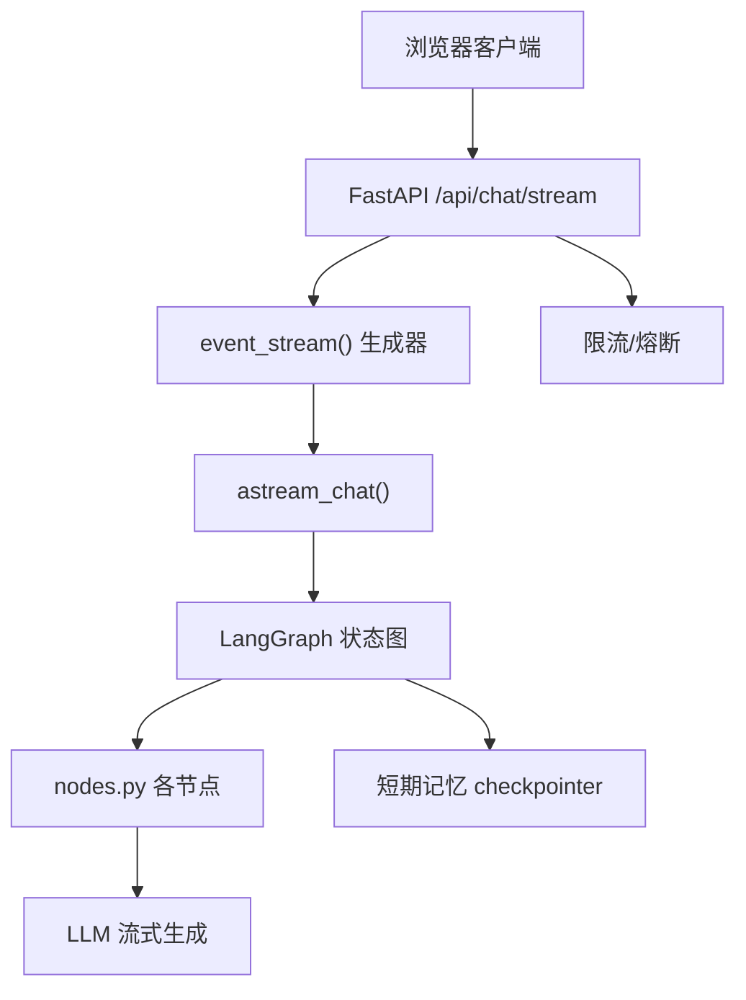
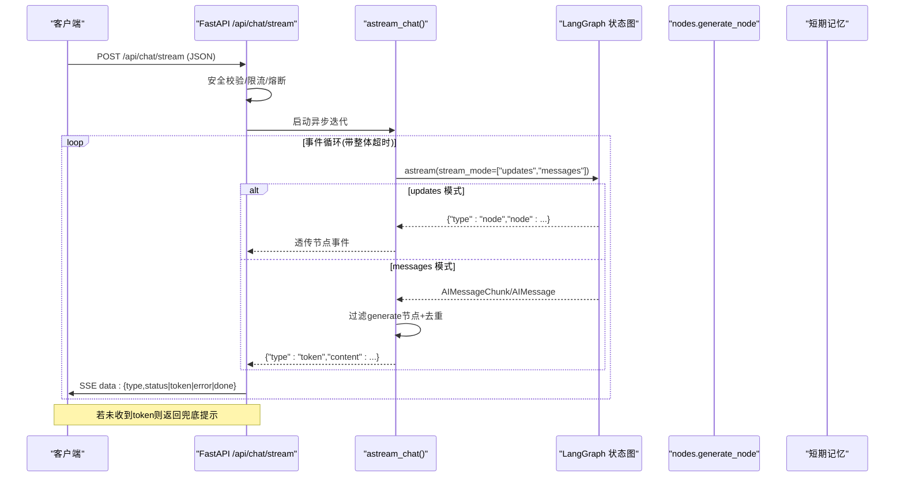
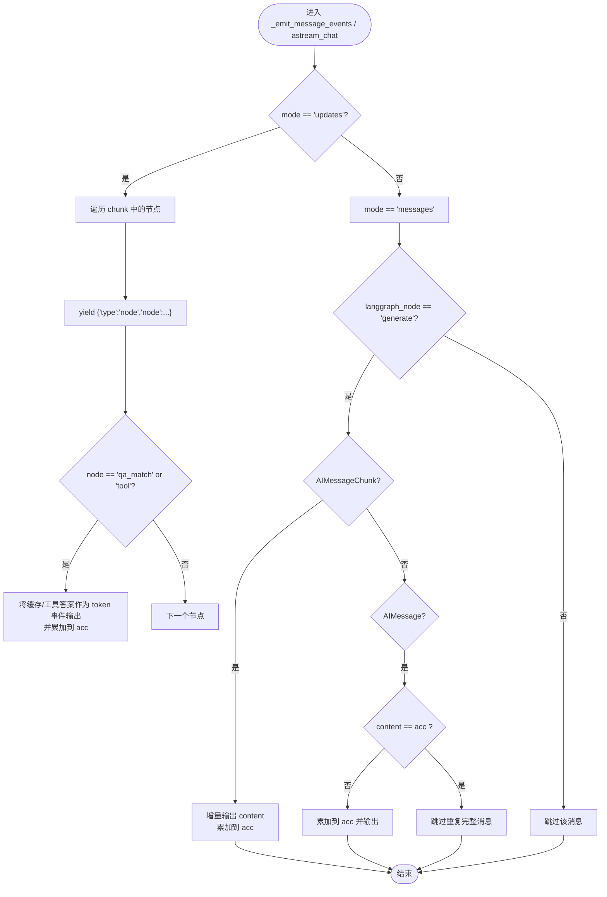
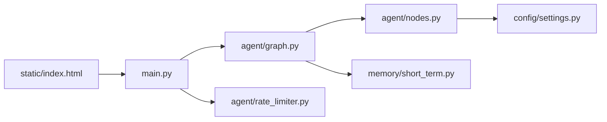

# 流式响应处理

<cite>
**本文引用的文件**
- [main.py](file://main.py)
- [agent/graph.py](file://agent/graph.py)
- [agent/nodes.py](file://agent/nodes.py)
- [agent/state.py](file://agent/state.py)
- [static/index.html](file://static/index.html)
- [agent/rate_limiter.py](file://agent/rate_limiter.py)
- [memory/short_term.py](file://memory/short_term.py)
</cite>

## 目录
1. [简介](#简介)
2. [项目结构](#项目结构)
3. [核心组件](#核心组件)
4. [架构总览](#架构总览)
5. [详细组件分析](#详细组件分析)
6. [依赖关系分析](#依赖关系分析)
7. [性能考量](#性能考量)
8. [故障排查指南](#故障排查指南)
9. [结论](#结论)
10. [附录](#附录)

## 简介
本文件系统性解析钉钉AI智能体助手中的“流式响应”实现机制，覆盖以下要点：
- 同步与异步流式接口的区别与统一事件模型
- 事件过滤规则与消息去重逻辑（updates/messages双模式）
- token级增量输出与节点进度追踪
- SSE接口集成、客户端适配与性能优化策略
- 调试与监控方法

## 项目结构
本项目采用FastAPI作为Web入口，基于LangGraph编排工作流，通过SSE向浏览器推送流式事件。关键路径如下：
- Web层：/api/chat/stream 提供SSE流式接口；/api/chat 提供同步接口
- 图编排：graph.py 构建状态图并暴露 chat_stream（同步）与 astream_chat（异步）
- 节点层：nodes.py 实现预检查、路由、检索、生成、记忆更新等节点
- 状态定义：state.py 定义AgentState
- 客户端：static/index.html 使用Fetch + ReadableStream解析SSE
- 稳定性：rate_limiter.py 提供限流与熔断
- 短期记忆：memory/short_term.py 提供checkpointer以维护会话上下文

图表来源
- [main.py:228-314](file://main.py#L228-L314)
- [agent/graph.py:208-255](file://agent/graph.py#L208-L255)
- [agent/nodes.py:499-532](file://agent/nodes.py#L499-L532)
- [memory/short_term.py:13-20](file://memory/short_term.py#L13-L20)

章节来源
- [main.py:228-314](file://main.py#L228-L314)
- [agent/graph.py:1-255](file://agent/graph.py#L1-L255)
- [agent/nodes.py:1-780](file://agent/nodes.py#L1-L780)
- [agent/state.py:12-51](file://agent/state.py#L12-L51)
- [static/index.html:250-362](file://static/index.html#L250-L362)
- [agent/rate_limiter.py:1-146](file://agent/rate_limiter.py#L1-L146)
- [memory/short_term.py:1-27](file://memory/short_term.py#L1-L27)

## 核心组件
- FastAPI流式接口：/api/chat/stream 将后端事件转换为SSE文本流，支持超时保护、错误上报与完成标记
- LangGraph双模式流：同时启用 updates（节点级进度）与 messages（token级增量），由 graph.py 统一转为 node/token 事件
- 节点与生成：nodes.py 中 generate_node 使用LLM的流式调用，逐token产出内容；其他节点负责检索、路由、记忆等
- 客户端SSE解析：index.html 使用ReadableStream按\n\n分片解析data:行，渲染status/token/error事件
- 稳定性保障：rate_limiter.py 提供滑动窗口限流与熔断器，避免雪崩
- 短期记忆：MemorySaver按session_id维护多轮对话上下文

章节来源
- [main.py:228-314](file://main.py#L228-L314)
- [agent/graph.py:141-255](file://agent/graph.py#L141-L255)
- [agent/nodes.py:453-532](file://agent/nodes.py#L453-L532)
- [static/index.html:250-362](file://static/index.html#L250-L362)
- [agent/rate_limiter.py:17-146](file://agent/rate_limiter.py#L17-L146)
- [memory/short_term.py:13-20](file://memory/short_term.py#L13-L20)

## 架构总览
下图展示从请求到SSE输出的完整时序，包括同步与异步两条路径以及事件转换与去重。

图表来源
- [main.py:228-314](file://main.py#L228-L314)
- [agent/graph.py:208-255](file://agent/graph.py#L208-L255)
- [agent/nodes.py:499-532](file://agent/nodes.py#L499-L532)
- [memory/short_term.py:13-20](file://memory/short_term.py#L13-L20)

## 详细组件分析

### 同步与异步流式接口
- 同步接口 /api/chat：直接调用 graph.invoke，阻塞等待最终答案，适合非实时场景
- 异步接口 /api/chat/stream：通过 astream_chat 获取异步事件流，结合FastAPI StreamingResponse 推送到前端
- 两者共享同一工作流与节点实现，差异在于事件消费方式与传输协议

章节来源
- [main.py:154-209](file://main.py#L154-L209)
- [main.py:228-314](file://main.py#L228-L314)
- [agent/graph.py:117-138](file://agent/graph.py#L117-L138)
- [agent/graph.py:190-205](file://agent/graph.py#L190-L205)
- [agent/graph.py:208-255](file://agent/graph.py#L208-L255)

### 事件过滤与消息去重（updates/messages双模式）
- 双模式启用：stream_mode=["updates","messages"]，分别提供节点进度与token增量
- 过滤规则：
  - updates：仅透传节点名；对 qa_match 与 tool 分支，若无经过 generate，需将缓存/工具结果补发为 token 事件
  - messages：仅保留 langgraph_node="generate" 的消息；AIMessageChunk 直接增量输出；AIMessage 用于跳过末尾重复的完整消息
- 去重逻辑：
  - 累计已输出增量 acc，当节点返回值产生的完整消息内容与acc一致时跳过，避免重复
  - 对 qa_match/tool 分支，将一次性答案追加到acc并输出，保证后续去重正确

图表来源
- [agent/graph.py:141-188](file://agent/graph.py#L141-L188)
- [agent/graph.py:218-255](file://agent/graph.py#L218-L255)

章节来源
- [agent/graph.py:141-188](file://agent/graph.py#L141-L188)
- [agent/graph.py:218-255](file://agent/graph.py#L218-L255)

### 节点进度追踪与状态映射
- 节点事件类型：{"type":"node","node":"pre_check|retrieve|web_search|load_memory|generate|memory_background"}
- 服务端将节点名映射为用户可读的状态提示，如“检索知识库中...”、“生成回答中...”
- 前端根据 status 事件更新状态栏，提升交互体验

章节来源
- [main.py:212-220](file://main.py#L212-L220)
- [main.py:281-284](file://main.py#L281-L284)

### token级增量输出与生成链路
- generate_node 使用LLM的流式调用，逐chunk拼接完整回答，同时将增量通过LangGraph的messages模式透出
- 降级策略：主模型失败时尝试备用模型列表，任一成功即返回
- 流式输出在 graph.py 中被统一转换为 token 事件，确保前后端一致性

章节来源
- [agent/nodes.py:453-464](file://agent/nodes.py#L453-L464)
- [agent/nodes.py:467-496](file://agent/nodes.py#L467-L496)
- [agent/nodes.py:499-532](file://agent/nodes.py#L499-L532)
- [agent/graph.py:218-255](file://agent/graph.py#L218-L255)

### SSE接口集成与客户端适配
- 服务端：
  - 使用StreamingResponse发送text/event-stream
  - 设置Cache-Control=no-cache、Connection=keep-alive、X-Accel-Buffering=no以禁用代理缓冲
  - 整体超时保护：按配置时间限制事件拉取，超时后仍返回已生成内容
- 客户端：
  - 使用fetch发起POST请求，读取ReadableStream
  - 按\n\n分割事件，解析data:行JSON
  - 处理status/token/error三类事件，自动滚动与追加显示

章节来源
- [main.py:228-314](file://main.py#L228-L314)
- [static/index.html:250-362](file://static/index.html#L250-L362)

### 同步与异步的差异总结
- 同步：graph.invoke 阻塞直到END，返回最终answer；适用于简单问答或批处理
- 异步：graph.astream 逐步产出事件，支持实时更新与更好的用户体验；适用于聊天界面
- 两者均复用同一工作流与节点，差异仅在事件消费与传输层

章节来源
- [agent/graph.py:117-138](file://agent/graph.py#L117-L138)
- [agent/graph.py:190-205](file://agent/graph.py#L190-L205)
- [agent/graph.py:208-255](file://agent/graph.py#L208-L255)

## 依赖关系分析
- main.py 依赖 agent.graph 提供的 astream_chat 与 get_compiled_graph
- agent.graph 依赖 agent.nodes 的各节点函数与 memory.short_term 的checkpointer
- agent.nodes 依赖 config.settings 控制行为开关（如web_search_enabled、tool_calling_enabled）
- static/index.html 依赖 /api/chat/stream 的SSE协议约定
- rate_limiter.py 被 main.py 在流式与非流式接口中调用，提供限流与熔断

图表来源
- [main.py:228-314](file://main.py#L228-L314)
- [agent/graph.py:1-255](file://agent/graph.py#L1-L255)
- [agent/nodes.py:1-780](file://agent/nodes.py#L1-L780)
- [memory/short_term.py:1-27](file://memory/short_term.py#L1-L27)
- [agent/rate_limiter.py:1-146](file://agent/rate_limiter.py#L1-L146)
- [static/index.html:250-362](file://static/index.html#L250-L362)

章节来源
- [main.py:228-314](file://main.py#L228-L314)
- [agent/graph.py:1-255](file://agent/graph.py#L1-L255)
- [agent/nodes.py:1-780](file://agent/nodes.py#L1-L780)
- [memory/short_term.py:1-27](file://memory/short_term.py#L1-L27)
- [agent/rate_limiter.py:1-146](file://agent/rate_limiter.py#L1-L146)
- [static/index.html:250-362](file://static/index.html#L250-L362)

## 性能考量
- 首请求预热：服务启动时预热LLM连接与向量库索引，降低冷启动延迟
- 流式整体超时：防止长连接卡死，超时后仍返回已生成内容，提升鲁棒性
- 去重与过滤：仅透传generate节点的增量，避免冗余事件；跳过末尾重复完整消息
- 代理缓冲禁用：通过X-Accel-Buffering=no避免Nginx等中间件缓冲导致延迟
- 限流与熔断：按用户维度限流，连续失败触发熔断，保护后端资源
- 后台记忆更新：生成完成后异步执行记忆抽取与更新，不阻塞响应链路

[本节为通用性能建议，不直接分析具体文件]

## 故障排查指南
- 无token输出：检查是否命中qa_match或tool分支且答案为空；确认generate节点是否被执行；查看服务端日志中“流式超时”或“异常”记录
- 重复输出：确认去重逻辑是否生效（acc累计与完整消息比较）；检查AIMessage与AIMessageChunk的处理分支
- 前端卡顿：检查SSE解析是否正确（\n\n分隔、data:前缀）；确认浏览器是否支持ReadableStream
- 限流/熔断：查看rate_limiter日志；调整阈值或冷却时间；健康检查端点可观察checkpointer类型
- 网络异常：检查服务器端口、防火墙、反向代理配置；确认Keep-Alive与缓冲头设置

章节来源
- [main.py:262-304](file://main.py#L262-L304)
- [agent/graph.py:218-255](file://agent/graph.py#L218-L255)
- [static/index.html:277-312](file://static/index.html#L277-L312)
- [agent/rate_limiter.py:17-146](file://agent/rate_limiter.py#L17-L146)

## 结论
本项目通过LangGraph的双模式流（updates/messages）实现了统一的节点进度与token增量输出，结合FastAPI的SSE能力与前端ReadableStream解析，提供了低延迟、高可用的流式聊天体验。通过严格的过滤与去重逻辑，避免了重复与冗余事件；通过限流、熔断与超时保护，提升了系统稳定性。建议在生产环境中结合监控指标（如流式耗时、错误率、熔断状态）持续优化。

[本节为总结性内容，不直接分析具体文件]

## 附录
- 事件类型约定：
  - status：节点进度提示
  - token：token级增量内容
  - error：异常信息
  - done：流结束标记
- 关键配置项（示例）：
  - stream_timeout：流式整体超时时间
  - rate_limit_per_minute：每分钟请求上限
  - circuit_breaker_threshold：熔断阈值
  - web_search_enabled/tool_calling_enabled：功能开关

[本节为补充说明，不直接分析具体文件]