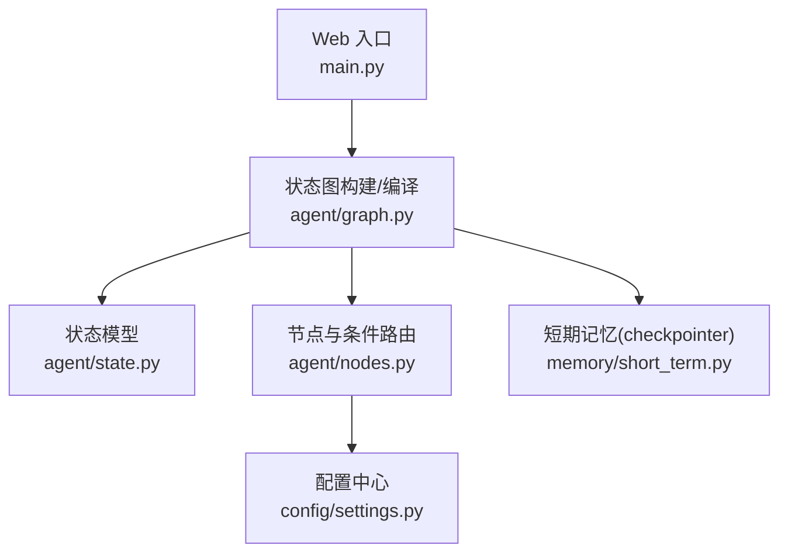
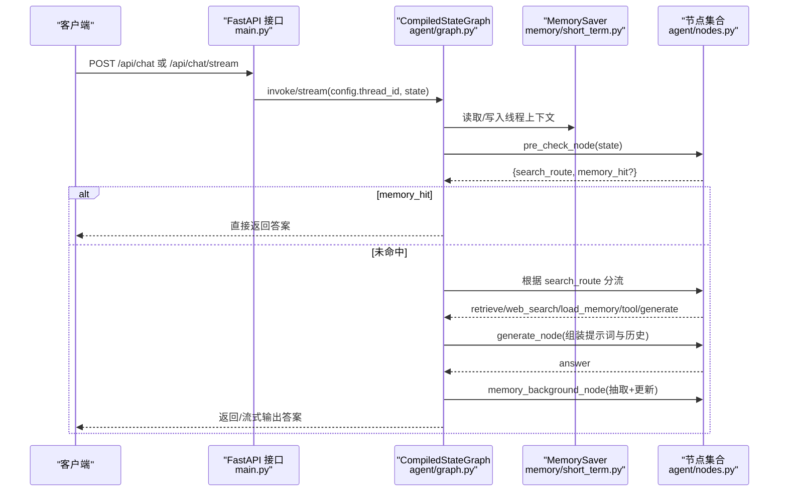
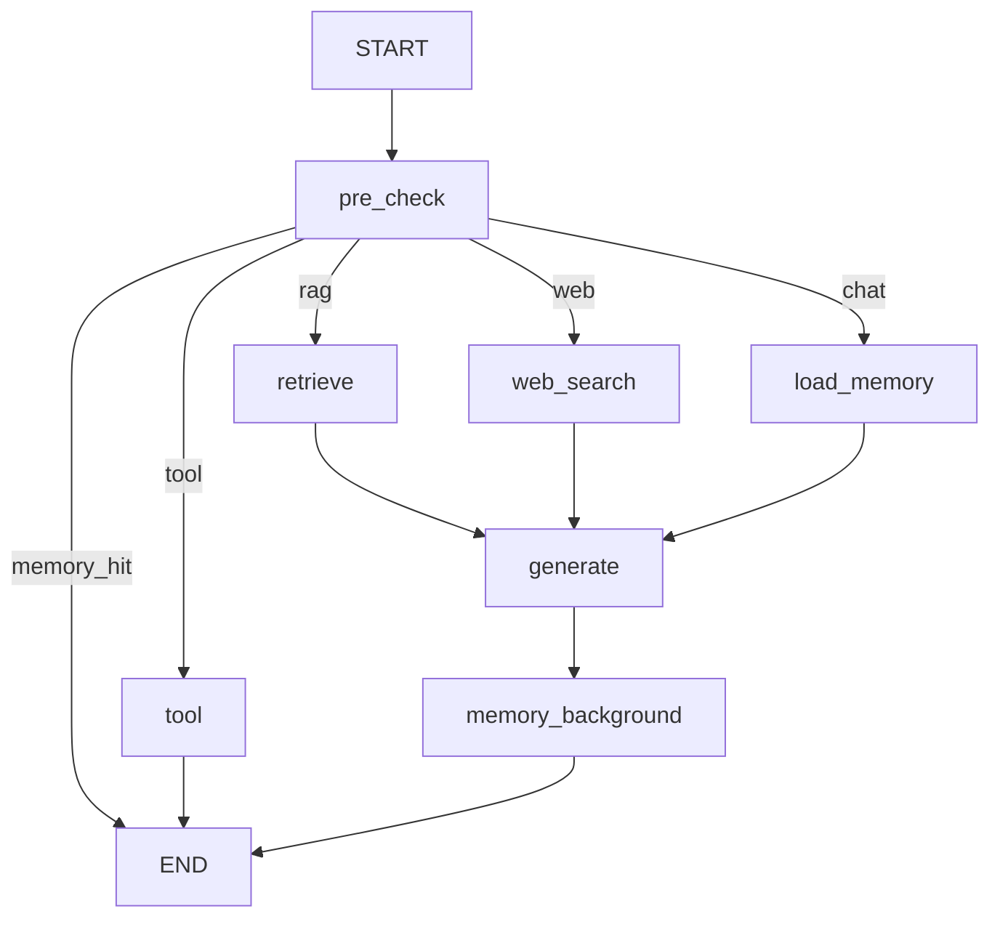
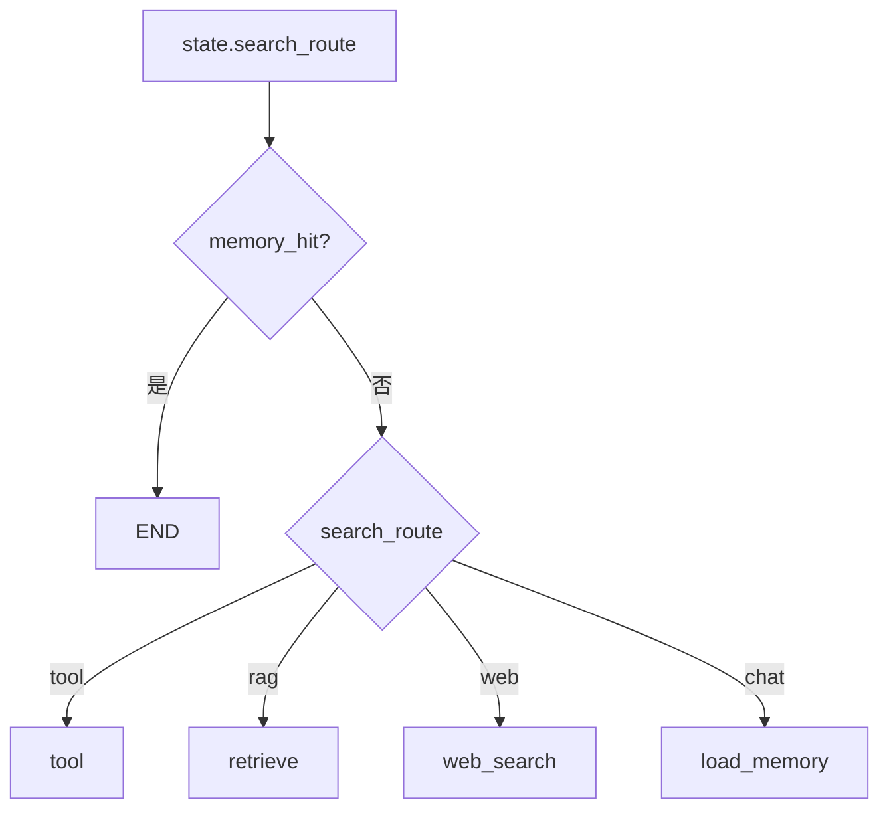
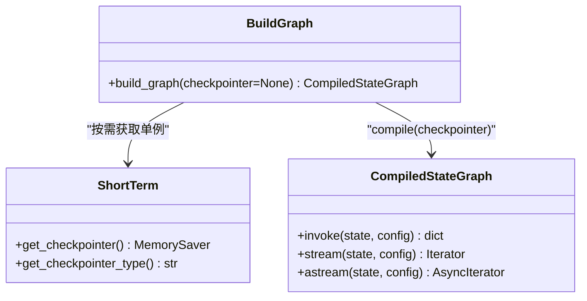
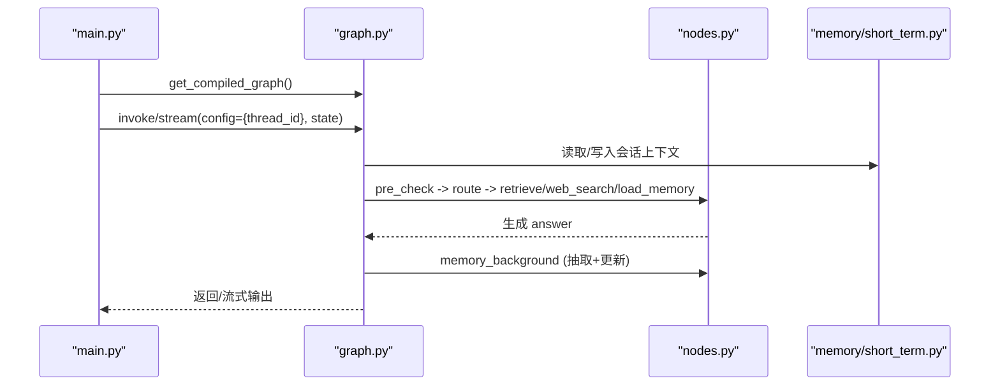
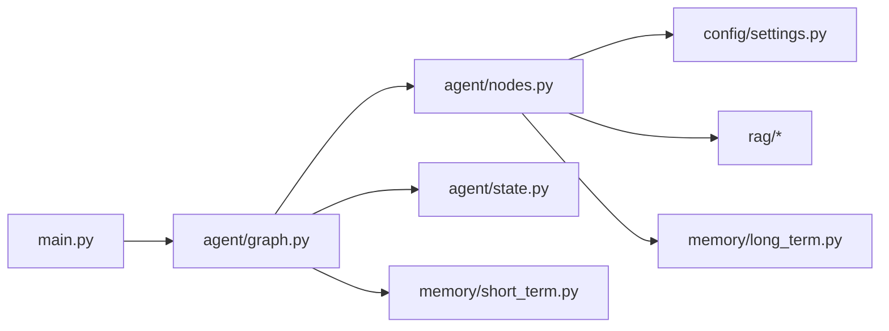

# 状态图构建与编译

<cite>
**本文引用的文件**
- [agent/graph.py](file://agent/graph.py)
- [agent/state.py](file://agent/state.py)
- [agent/nodes.py](file://agent/nodes.py)
- [memory/short_term.py](file://memory/short_term.py)
- [config/settings.py](file://config/settings.py)
- [main.py](file://main.py)
</cite>

## 目录
1. [简介](#简介)
2. [项目结构](#项目结构)
3. [核心组件](#核心组件)
4. [架构总览](#架构总览)
5. [详细组件分析](#详细组件分析)
6. [依赖关系分析](#依赖关系分析)
7. [性能考量](#性能考量)
8. [故障排查指南](#故障排查指南)
9. [结论](#结论)
10. [附录](#附录)

## 简介
本文件聚焦于 LangGraph 状态图的构建与编译过程，围绕 StateGraph 的初始化、节点注册、边连接与条件路由配置展开，解释 checkpointer 的挂载机制与单例模式实现，并说明状态图的生命周期管理、编译优化与运行时配置。最后提供自定义状态图和扩展工作流的实践指导。

## 项目结构
本项目将状态图定义、节点逻辑、状态模型、短期记忆（checkpointer）与配置解耦：
- 状态图构建与编译入口在 agent/graph.py
- 状态模型定义在 agent/state.py
- 节点函数与条件路由在 agent/nodes.py
- 短期记忆（checkpointer）在 memory/short_term.py
- 全局配置在 config/settings.py
- Web 服务入口与流式接口在 main.py

图表来源
- [agent/graph.py:44-102](file://agent/graph.py#L44-L102)
- [agent/state.py:12-53](file://agent/state.py#L12-L53)
- [agent/nodes.py:93-150](file://agent/nodes.py#L93-L150)
- [memory/short_term.py:13-20](file://memory/short_term.py#L13-L20)
- [config/settings.py:19-156](file://config/settings.py#L19-L156)

章节来源
- [agent/graph.py:44-102](file://agent/graph.py#L44-L102)
- [agent/state.py:12-53](file://agent/state.py#L12-L53)
- [agent/nodes.py:93-150](file://agent/nodes.py#L93-L150)
- [memory/short_term.py:13-20](file://memory/short_term.py#L13-L20)
- [config/settings.py:19-156](file://config/settings.py#L19-L156)

## 核心组件
- 状态图构建器：负责创建 StateGraph、注册节点、添加边与条件边、编译并可选挂载 checkpointer。
- 状态模型：定义 AgentState，包含消息历史、用户输入、路由结果、检索上下文、长期记忆上下文、会话摘要、问答命中标志、工具调用相关字段等。
- 节点与条件路由：预检查（缓存匹配+路由）、RAG 检索、联网搜索、长期记忆加载、生成回答、后台记忆更新、工具调用等节点；以及条件路由函数决定下一步分支。
- 短期记忆（checkpointer）：基于 MemorySaver 的进程内单例，按 thread_id 维护多轮对话上下文。
- 配置中心：集中管理 LLM、RAG、记忆、工具调用、限流熔断等开关与参数。

章节来源
- [agent/graph.py:44-102](file://agent/graph.py#L44-L102)
- [agent/state.py:12-53](file://agent/state.py#L12-L53)
- [agent/nodes.py:93-150](file://agent/nodes.py#L93-L150)
- [memory/short_term.py:13-20](file://memory/short_term.py#L13-L20)
- [config/settings.py:19-156](file://config/settings.py#L19-L156)

## 架构总览
下图展示了从 Web 请求到状态图执行的关键路径，包括条件路由、节点执行、后台记忆更新与 checkpointer 的使用。

图表来源
- [main.py:154-209](file://main.py#L154-L209)
- [main.py:228-314](file://main.py#L228-L314)
- [agent/graph.py:44-102](file://agent/graph.py#L44-L102)
- [agent/nodes.py:93-150](file://agent/nodes.py#L93-L150)
- [memory/short_term.py:13-20](file://memory/short_term.py#L13-L20)

## 详细组件分析

### StateGraph 初始化、节点注册与边连接
- 初始化：通过 StateGraph(AgentState) 创建图实例，AgentState 定义了流转状态的结构。
- 节点注册：使用 add_node 注册预检查、长期记忆加载、检索、联网搜索、工具调用、生成回答、后台记忆更新等节点。
- 线性边：将各分支节点连接到 generate 或直接到 END；generate 后进入 memory_background，再结束。
- 条件边：pre_check 之后通过条件函数 pre_check_condition 进行五路分流（end/tool/retrieve/web_search/load_memory/generate）。

图表来源
- [agent/graph.py:55-92](file://agent/graph.py#L55-L92)
- [agent/nodes.py:131-150](file://agent/nodes.py#L131-L150)

章节来源
- [agent/graph.py:55-92](file://agent/graph.py#L55-L92)
- [agent/nodes.py:131-150](file://agent/nodes.py#L131-L150)

### 条件路由配置与实现
- 条件函数 pre_check_condition：若 memory_hit 为真则短路到 END；否则依据 search_route 选择 tool/retrieve/web_search/load_memory。
- 路由判断 route_node/_decide_route：结合关键词与 LLM 小模型进行意图识别，支持工具调用、联网搜索、RAG、闲聊等分支，并在失败时回退到关键词兜底。
- 其他条件路由：route_condition 与 qa_or_route_condition 用于不同阶段的分流策略。

图表来源
- [agent/nodes.py:131-150](file://agent/nodes.py#L131-L150)
- [agent/nodes.py:154-223](file://agent/nodes.py#L154-L223)

章节来源
- [agent/nodes.py:131-150](file://agent/nodes.py#L131-L150)
- [agent/nodes.py:154-223](file://agent/nodes.py#L154-L223)

### checkpointer 挂载机制与单例模式
- 挂载机制：build_graph 在编译前可选择性地获取 checkpointer；当传入 None 时自动从 memory.short_term.get_checkpointer() 获取进程内 MemorySaver；传入 False 则不挂载（适用于无状态评估场景）。
- 单例模式：get_checkpointer 使用模块级变量缓存 MemorySaver 实例，确保进程内唯一；同时记录类型标识便于健康检查。
- 线程隔离：通过 config.configurable.thread_id 指定会话 ID，MemorySaver 按线程维护短期上下文，保证多轮对话连贯性。

图表来源
- [agent/graph.py:44-102](file://agent/graph.py#L44-L102)
- [memory/short_term.py:13-20](file://memory/short_term.py#L13-L20)

章节来源
- [agent/graph.py:44-102](file://agent/graph.py#L44-L102)
- [memory/short_term.py:13-20](file://memory/short_term.py#L13-L20)

### 状态图生命周期管理与运行流程
- 启动期：应用启动时预热 LLM 连接与向量库索引，减少首请求延迟。
- 请求期：
  - 同步调用：graph.invoke 返回最终 answer。
  - 流式调用：graph.stream/astream 产出 updates 与 messages 事件，统一转换为 node/token 事件，过滤重复完整消息与内部 LLM 调用。
- 结束期：memory_background 异步执行关键信息抽取与长期记忆更新，不阻塞响应链路。

图表来源
- [main.py:154-209](file://main.py#L154-L209)
- [main.py:228-314](file://main.py#L228-L314)
- [agent/graph.py:117-255](file://agent/graph.py#L117-L255)
- [agent/nodes.py:499-643](file://agent/nodes.py#L499-L643)

章节来源
- [main.py:154-209](file://main.py#L154-L209)
- [main.py:228-314](file://main.py#L228-L314)
- [agent/graph.py:117-255](file://agent/graph.py#L117-L255)
- [agent/nodes.py:499-643](file://agent/nodes.py#L499-L643)

### 编译优化与运行时配置
- 编译优化：
  - 问答记忆命中短路：qa_match_node 命中后直接返回答案，跳过后续生成链路。
  - 工具调用直达 END：tool 节点直接返回结果，无需经过 generate。
  - 后台记忆更新：memory_background 顺序执行抽取与更新，内部异常不影响主链路。
- 运行时配置：
  - 路由小模型与主模型：temperature、重试次数、超时等由 settings 控制。
  - RAG 与重排序：rerank_enabled、bm25_enabled、min_relevance 等影响检索质量与阈值过滤。
  - 记忆开关：memory_qa_cache_enabled、memory_extract_llm_enabled、memory_summary_every 等控制记忆行为。
  - 工具调用：tool_calling_enabled、tool_confirmation_required 控制工具分支与确认流程。

章节来源
- [agent/nodes.py:232-281](file://agent/nodes.py#L232-L281)
- [agent/nodes.py:284-341](file://agent/nodes.py#L284-L341)
- [agent/nodes.py:499-643](file://agent/nodes.py#L499-L643)
- [config/settings.py:29-156](file://config/settings.py#L29-L156)

### 自定义状态图与扩展工作流实践
- 新增节点：在 nodes.py 中实现新节点函数，接收/返回 AgentState 或其增量；在 graph.py 中通过 add_node 注册。
- 新增边与条件路由：使用 add_edge 添加线性边；使用 add_conditional_edges 添加条件边，并在条件函数中返回目标节点名。
- 扩展状态：在 AgentState 中添加新字段，确保节点间数据传递一致。
- 挂载外部 checkpointer：可将持久化后端替换为 SQL/Redis 等，保持单例获取方式不变。
- 流式事件处理：复用 _emit_message_events 逻辑，过滤内部 LLM 调用与重复完整消息，保证前端体验一致。

章节来源
- [agent/graph.py:55-92](file://agent/graph.py#L55-L92)
- [agent/state.py:12-53](file://agent/state.py#L12-L53)
- [agent/graph.py:141-255](file://agent/graph.py#L141-L255)

## 依赖关系分析
- 模块耦合：
  - graph.py 依赖 nodes.py 的节点函数与条件路由，依赖 state.py 的状态模型，依赖 short_term.py 的 checkpointer。
  - nodes.py 依赖 config/settings.py 的配置项，依赖 rag/memory 等子系统。
  - main.py 依赖 graph.py 的编译图与流式接口，依赖 safety/rate_limiter 等中间件。
- 外部依赖：
  - LangGraph 提供的 StateGraph、CompiledStateGraph、checkpointer 抽象。
  - LLM 提供商（OpenAI 兼容接口），向量库（Milvus Lite），搜索引擎等。

图表来源
- [main.py:154-209](file://main.py#L154-L209)
- [agent/graph.py:44-102](file://agent/graph.py#L44-L102)
- [agent/nodes.py:93-150](file://agent/nodes.py#L93-L150)
- [config/settings.py:19-156](file://config/settings.py#L19-L156)

章节来源
- [main.py:154-209](file://main.py#L154-L209)
- [agent/graph.py:44-102](file://agent/graph.py#L44-L102)
- [agent/nodes.py:93-150](file://agent/nodes.py#L93-L150)
- [config/settings.py:19-156](file://config/settings.py#L19-L156)

## 性能考量
- 首请求延迟优化：启动时预热 LLM 连接与向量库索引，降低首次请求的 TLS/DNS/连接池建立开销。
- 路由与检索优化：
  - 时效性问题优先走联网搜索，避免不必要的 LLM 路由成本。
  - 问答记忆命中短路，跳过生成链路。
  - RAG 检索时仅在纯向量路径下做相关度阈值过滤，避免 rerank/BM25 融合分数语义不一致导致的误判。
- 流式输出与去重：统一 events 转换，过滤重复完整消息，提升前端渲染效率。
- 后台任务非阻塞：memory_background 独立执行，不阻塞主响应链路。

章节来源
- [main.py:45-135](file://main.py#L45-L135)
- [agent/nodes.py:232-281](file://agent/nodes.py#L232-L281)
- [agent/nodes.py:284-341](file://agent/nodes.py#L284-L341)
- [agent/graph.py:141-255](file://agent/graph.py#L141-L255)

## 故障排查指南
- 路由失败降级：LLM 路由异常时回退到关键词兜底，关注日志中的路由降级信息。
- 检索失败处理：RAG/联网搜索失败时静默降级为空上下文，检查配置与外部服务可用性。
- 生成失败与降级：主模型失败时尝试备用模型列表，记录错误信息并返回友好提示。
- 记忆更新失败：抽取与更新节点内部 try/except 保护，失败不影响主链路，查看日志定位问题。
- 流式超时保护：整体超时后停止拉取并返回已生成内容，避免连接卡死。

章节来源
- [agent/nodes.py:154-223](file://agent/nodes.py#L154-L223)
- [agent/nodes.py:284-341](file://agent/nodes.py#L284-L341)
- [agent/nodes.py:467-532](file://agent/nodes.py#L467-L532)
- [agent/nodes.py:535-643](file://agent/nodes.py#L535-L643)
- [main.py:228-314](file://main.py#L228-L314)

## 结论
本项目通过 LangGraph StateGraph 实现了清晰、可扩展的智能体工作流：预检查与条件路由确保高效分流，RAG/联网搜索/长期记忆/工具调用等多能力协同，后台记忆更新保障知识沉淀。checkpointer 的单例挂载与线程隔离提供了稳定的多轮上下文管理能力。配合完善的配置与性能优化策略，系统在生产环境中具备良好的可用性与可维护性。

## 附录
- 快速上手：
  - 启动服务：uvicorn main:app --host 0.0.0.0 --port 8000 --reload
  - 健康检查：GET /health
  - 聊天接口：POST /api/chat 或 /api/chat/stream
- 常用配置项：
  - LLM：llm_model、llm_base_url、llm_api_key、llm_max_retries、llm_request_timeout
  - RAG：rag_bm25_enabled、rerank_enabled、rag_min_relevance
  - 记忆：memory_qa_cache_enabled、memory_summary_every、memory_short_window
  - 工具调用：tool_calling_enabled、tool_confirmation_required

章节来源
- [main.py:364-382](file://main.py#L364-L382)
- [config/settings.py:29-156](file://config/settings.py#L29-L156)