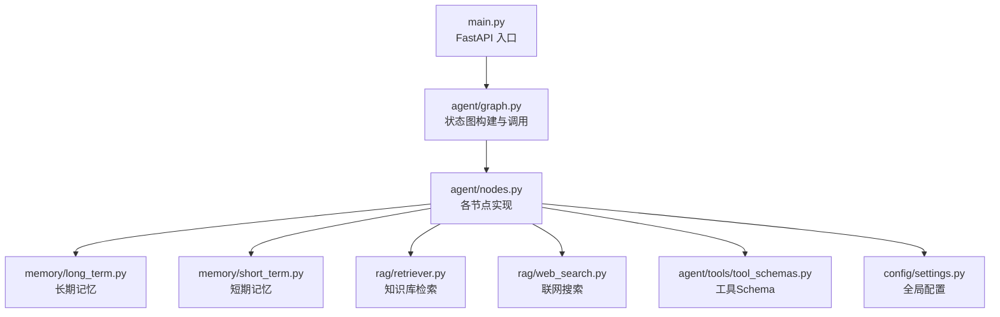
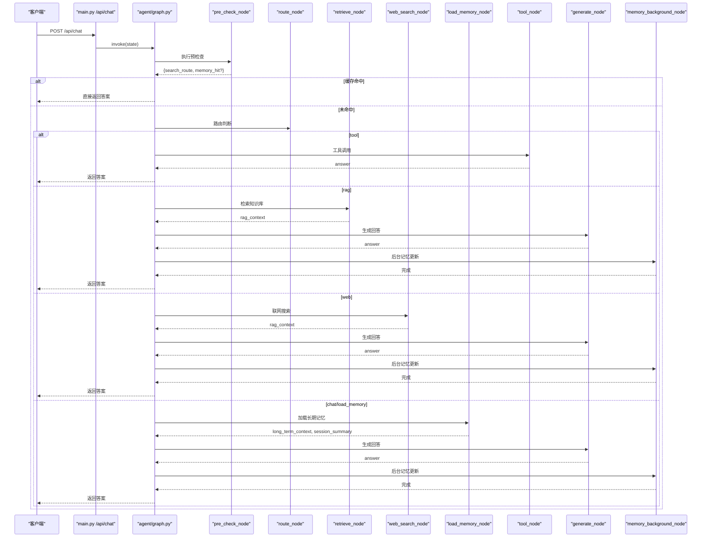
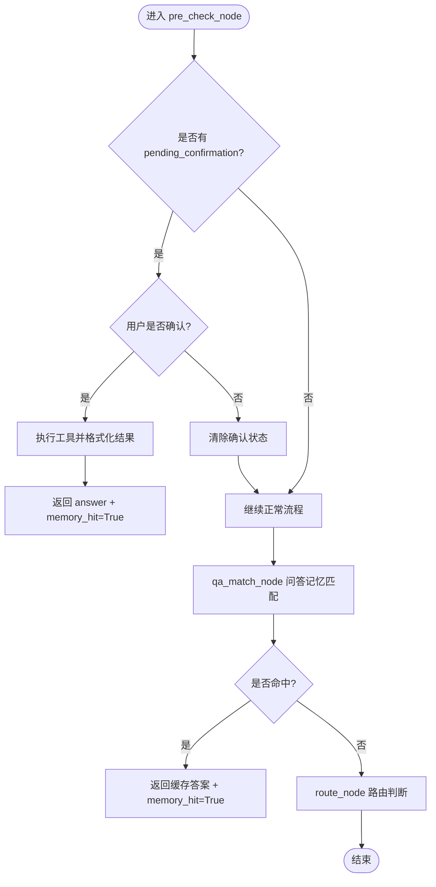
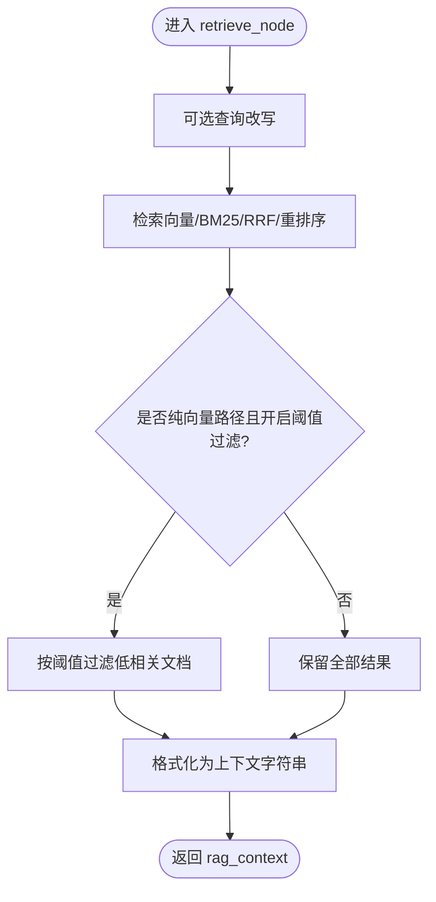
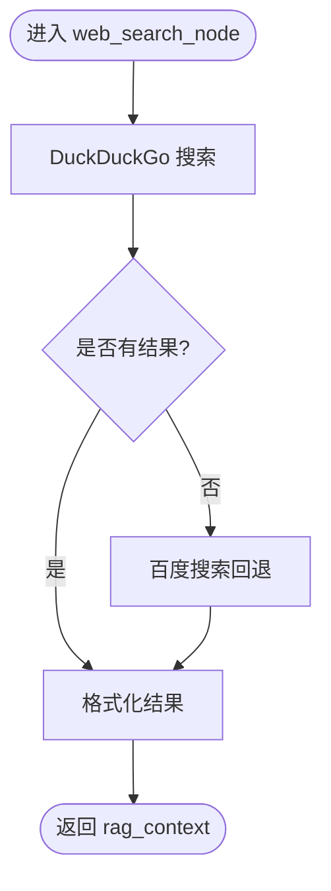
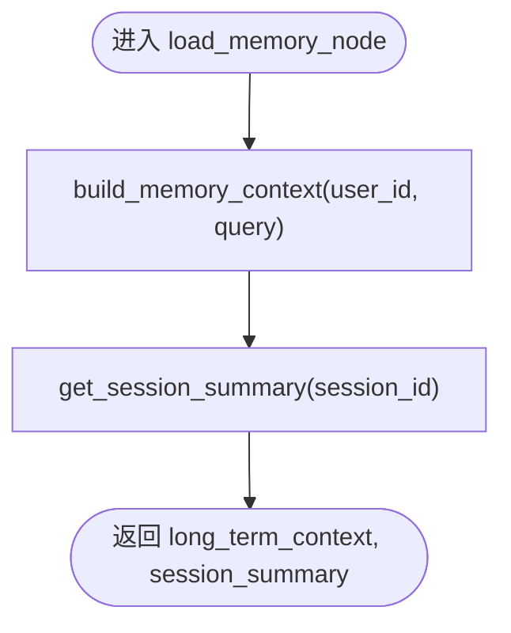
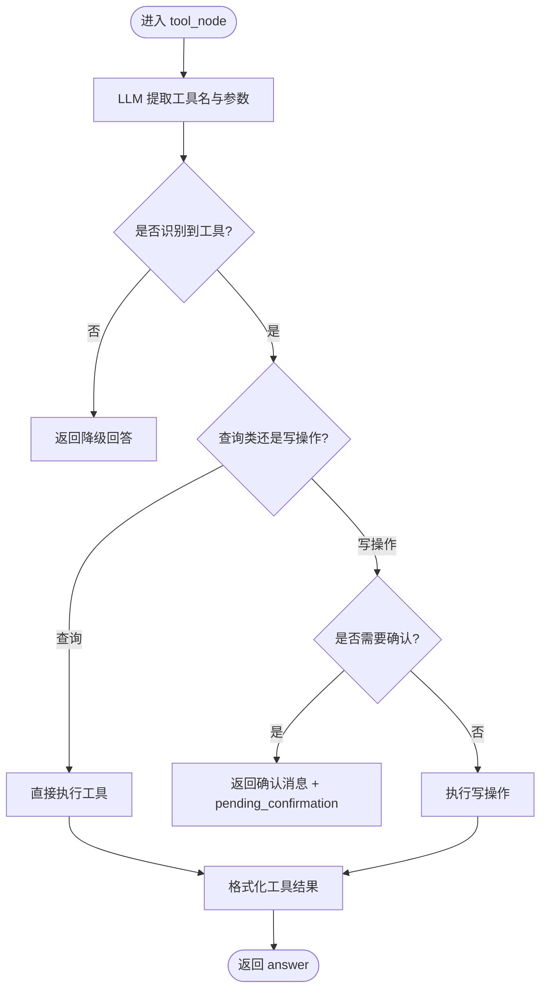
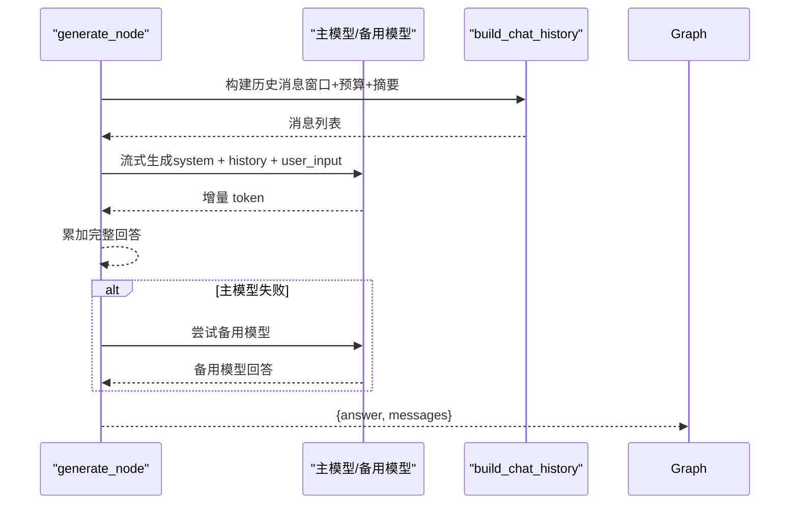
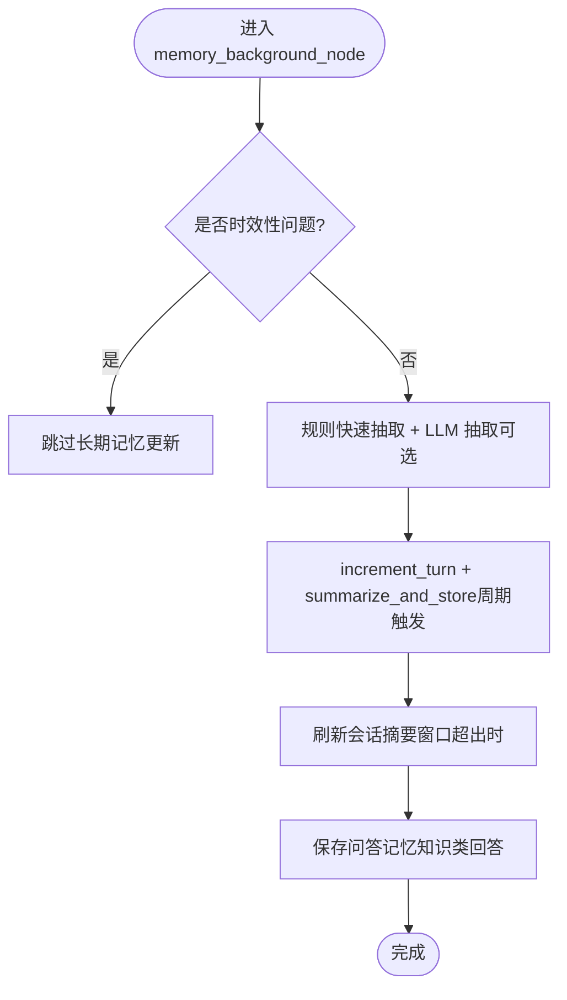
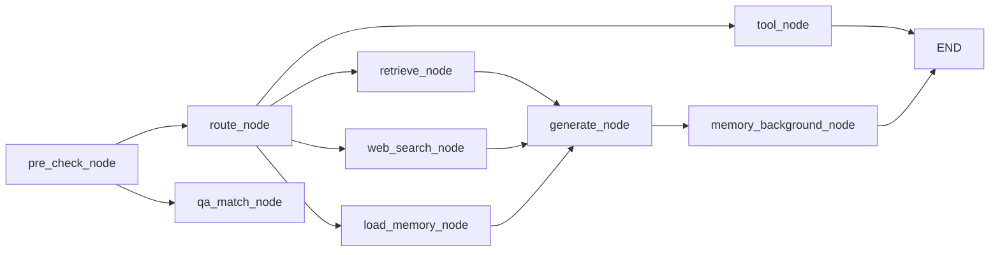

# 节点处理逻辑

<cite>
**本文引用的文件**
- [agent/nodes.py](file://agent/nodes.py)
- [agent/graph.py](file://agent/graph.py)
- [agent/state.py](file://agent/state.py)
- [memory/long_term.py](file://memory/long_term.py)
- [memory/short_term.py](file://memory/short_term.py)
- [rag/retriever.py](file://rag/retriever.py)
- [rag/web_search.py](file://rag/web_search.py)
- [agent/tools/tool_schemas.py](file://agent/tools/tool_schemas.py)
- [config/settings.py](file://config/settings.py)
- [main.py](file://main.py)
</cite>

## 目录
1. [简介](#简介)
2. [项目结构](#项目结构)
3. [核心组件](#核心组件)
4. [架构总览](#架构总览)
5. [详细组件分析](#详细组件分析)
6. [依赖关系分析](#依赖关系分析)
7. [性能考量](#性能考量)
8. [故障排查指南](#故障排查指南)
9. [结论](#结论)
10. [附录：扩展与自定义开发指南](#附录：扩展与自定义开发指南)

## 简介
本文件聚焦于智能体工作流中的各个处理节点，系统性解析预检查、知识库检索、联网搜索、长期记忆加载、工具调用、生成与后台记忆更新等节点的功能、实现细节、数据流转、异常处理与扩展方式。通过状态图编排，系统可在不同意图下选择最优路径，兼顾响应速度与回答质量。

## 项目结构
- 入口与编排
  - main.py：Web 服务入口、健康检查、流式接口、启动预热（LLM、向量库、BM25、文件监听）。
  - agent/graph.py：基于 LangGraph 的状态图构建与编译，定义节点与条件边，提供同步/异步流式调用封装。
- 节点与状态
  - agent/nodes.py：所有节点函数实现（预检查、路由、RAG、联网搜索、长期记忆加载、生成、后台记忆更新、工具调用）。
  - agent/state.py：AgentState 类型定义，描述节点间传递的状态字段。
- 记忆
  - memory/long_term.py：长期记忆（SQLite）持久化、分层上下文构建、摘要合并、问答缓存、会话压缩摘要。
  - memory/short_term.py：短期记忆（LangGraph MemorySaver），按 session_id 维护多轮对话上下文。
- 检索与搜索
  - rag/retriever.py：检索器（向量检索 + BM25 多路召回 + RRF 融合 + 可选重排序）。
  - rag/web_search.py：联网搜索（DuckDuckGo 优先，百度回退），结果格式化。
- 工具
  - agent/tools/tool_schemas.py：工具 Schema 与提取提示词，供 LLM 抽取参数。
- 配置
  - config/settings.py：全局配置（LLM、Embedding、向量库、检索策略、记忆、限流熔断、工具开关等）。

图表来源
- [main.py:145-314](file://main.py#L145-L314)
- [agent/graph.py:44-102](file://agent/graph.py#L44-L102)
- [agent/nodes.py:92-780](file://agent/nodes.py#L92-L780)
- [memory/long_term.py:424-633](file://memory/long_term.py#L424-L633)
- [memory/short_term.py:13-27](file://memory/short_term.py#L13-L27)
- [rag/retriever.py:18-140](file://rag/retriever.py#L18-L140)
- [rag/web_search.py:19-134](file://rag/web_search.py#L19-L134)
- [agent/tools/tool_schemas.py:7-121](file://agent/tools/tool_schemas.py#L7-L121)
- [config/settings.py:19-216](file://config/settings.py#L19-L216)

章节来源
- [main.py:145-314](file://main.py#L145-L314)
- [agent/graph.py:44-102](file://agent/graph.py#L44-L102)

## 核心组件
- AgentState：定义节点间共享状态，包括消息历史、用户输入、路由结果、检索上下文、长期记忆上下文、会话摘要、问答命中标志、工具调用相关字段等。
- 状态图：START → pre_check → 条件分流 → retrieve/web_search/load_memory/tool → generate → memory_background → END。
- 配置中心：集中管理 LLM、检索、记忆、工具、限流熔断等开关与阈值。

章节来源
- [agent/state.py:12-51](file://agent/state.py#L12-L51)
- [agent/graph.py:44-102](file://agent/graph.py#L44-L102)
- [config/settings.py:19-216](file://config/settings.py#L19-L216)

## 架构总览
下图展示从请求进入至回答输出的完整流程，包含预检查、四路分流、生成与后台记忆更新。

图表来源
- [main.py:154-209](file://main.py#L154-L209)
- [agent/graph.py:44-102](file://agent/graph.py#L44-L102)
- [agent/nodes.py:92-780](file://agent/nodes.py#L92-L780)

## 详细组件分析

### 预检查节点（缓存匹配 + 路由判断）
- 功能
  - 优先处理待确认的工具操作（pending_confirmation），若用户确认则直接执行并返回结果。
  - 执行问答记忆匹配（qa_match_node），命中则短路到 END，跳过后续生成链路。
  - 执行路由判断（route_node），写入 search_route，供后续条件边分流。
- 数据流
  - 输入：user_input、user_id、session_id、messages、pending_confirmation、confirmation_context。
  - 输出：answer（命中时）、memory_hit、search_route、query_embedding（用于后续 QA 缓存落库）。
- 异常处理
  - 向量化失败或检索失败静默降级为未命中，不阻断主链路。
  - 时效性问题（含明确时间表达或天气查询）不走问答缓存，避免过时答案污染。
- 关键实现要点
  - 时效性判断使用关键词与正则表达式组合，快速识别。
  - 路由优先级：工具调用 > 时效性联网搜索 > 闲聊短输入 > LLM 路由判断 > 兜底关键词。

图表来源
- [agent/nodes.py:92-151](file://agent/nodes.py#L92-L151)
- [agent/nodes.py:232-281](file://agent/nodes.py#L232-L281)
- [agent/nodes.py:153-223](file://agent/nodes.py#L153-L223)

章节来源
- [agent/nodes.py:92-151](file://agent/nodes.py#L92-L151)
- [agent/nodes.py:153-223](file://agent/nodes.py#L153-L223)
- [agent/nodes.py:232-281](file://agent/nodes.py#L232-L281)

### 知识库检索节点（RAG）
- 功能
  - 执行检索：支持查询改写（可选）、多路召回（向量 + BM25，RRF 融合）、重排序（可选）、相关度阈值过滤（纯向量路径）。
  - 将检索结果格式化为上下文字符串，注入生成节点。
- 数据流
  - 输入：user_input。
  - 输出：rag_context。
- 异常处理
  - 检索失败时返回空上下文，不影响主链路。
- 关键实现要点
  - 仅当 rerank/BM25 关闭时才应用统一归一化的相关度阈值过滤；否则分数语义不同，不适用统一阈值。
  - 支持配置项控制 BM25、重排序、候选数、top-k 等。

图表来源
- [agent/nodes.py:284-321](file://agent/nodes.py#L284-L321)
- [rag/retriever.py:18-140](file://rag/retriever.py#L18-L140)

章节来源
- [agent/nodes.py:284-321](file://agent/nodes.py#L284-L321)
- [rag/retriever.py:18-140](file://rag/retriever.py#L18-L140)

### 联网搜索节点
- 功能
  - 双引擎搜索：优先 DuckDuckGo，失败或无结果时回退百度搜索。
  - 将搜索结果格式化为上下文字符串，复用 rag_context 字段。
- 数据流
  - 输入：user_input。
  - 输出：rag_context。
- 异常处理
  - 任一引擎失败记录日志并尝试回退；最终若无结果返回空上下文。
- 关键实现要点
  - 可配置最大结果数与超时；适用于时效性问题与通用知识查询。

图表来源
- [agent/nodes.py:324-341](file://agent/nodes.py#L324-L341)
- [rag/web_search.py:19-134](file://rag/web_search.py#L19-L134)

章节来源
- [agent/nodes.py:324-341](file://agent/nodes.py#L324-L341)
- [rag/web_search.py:19-134](file://rag/web_search.py#L19-L134)

### 长期记忆加载节点
- 功能
  - 从 SQLite 分层加载长期记忆上下文与会话压缩摘要。
  - 构建结构化上下文（用户画像、关键事实、历史摘要），注入生成节点。
- 数据流
  - 输入：user_id、user_input、session_id。
  - 输出：long_term_context、session_summary。
- 异常处理
  - 加载失败记录日志并返回空上下文，不阻塞主链路。
- 关键实现要点
  - 分层预算策略：P0 硬保留（画像、高优先级事实），P1/P2 按预算填充。
  - 会话压缩摘要在短期窗口超出时刷新，防上下文硬丢失。

图表来源
- [agent/nodes.py:344-360](file://agent/nodes.py#L344-L360)
- [memory/long_term.py:424-497](file://memory/long_term.py#L424-L497)
- [memory/long_term.py:342-379](file://memory/long_term.py#L342-L379)

章节来源
- [agent/nodes.py:344-360](file://agent/nodes.py#L344-L360)
- [memory/long_term.py:424-497](file://memory/long_term.py#L424-L497)
- [memory/long_term.py:342-379](file://memory/long_term.py#L342-L379)

### 工具调用节点
- 功能
  - LLM 从用户输入提取工具名与参数。
  - 查询类操作直接执行；写操作需用户确认（可配置）。
  - 执行工具后格式化为可读文本返回。
- 数据流
  - 输入：user_input、user_id。
  - 输出：answer、tool_name、tool_params、tool_result、pending_confirmation（写操作需确认时）。
- 异常处理
  - LLM 提取失败或未识别工具时降级为普通回答。
  - 工具执行失败返回错误信息。
- 关键实现要点
  - 工具 Schema 与提取提示词集中管理，便于扩展新工具。
  - 写操作默认需确认，防止误改。

图表来源
- [agent/nodes.py:646-780](file://agent/nodes.py#L646-L780)
- [agent/tools/tool_schemas.py:7-121](file://agent/tools/tool_schemas.py#L7-L121)

章节来源
- [agent/nodes.py:646-780](file://agent/nodes.py#L646-L780)
- [agent/tools/tool_schemas.py:7-121](file://agent/tools/tool_schemas.py#L7-L121)

### 生成节点
- 功能
  - 组装 system prompt（含长期记忆与检索上下文）、构建历史消息（窗口+预算+更早对话摘要）、当前输入。
  - 主模型流式生成，失败自动降级到备用模型列表。
- 数据流
  - 输入：user_input、rag_context、long_term_context、messages、session_summary。
  - 输出：answer、messages（追加本轮对话）。
- 异常处理
  - 主模型失败依次尝试备用模型；全部失败返回汇总错误提示。
  - 流式生成过程中累计 token，保证前端增量显示一致。
- 关键实现要点
  - 历史消息构建采用“窗口+预算”策略，超窗消息以“更早对话摘要”形式注入，防丢失。
  - 支持配置短窗口大小与字符预算。

图表来源
- [agent/nodes.py:453-532](file://agent/nodes.py#L453-L532)
- [agent/nodes.py:427-450](file://agent/nodes.py#L427-L450)

章节来源
- [agent/nodes.py:453-532](file://agent/nodes.py#L453-L532)
- [agent/nodes.py:427-450](file://agent/nodes.py#L427-L450)

### 后台记忆更新节点
- 功能
  - 周期性更新长期记忆摘要（增量合并，关键信息单独落库防丢失）。
  - 短期窗口超出时刷新会话压缩摘要。
  - 保存问答记忆（仅知识类回答，过滤过短输入/回答与错误兜底）。
- 数据流
  - 输入：user_id、messages、search_route、query_embedding。
  - 输出：无（不修改状态，仅副作用更新）。
- 异常处理
  - 每个子步骤独立 try/except，任一失败不影响其他步骤。
- 关键实现要点
  - 时效性问题不保存长期记忆，避免过时信息污染。
  - 问答缓存仅对 rag/web 路由的知识类回答生效。

图表来源
- [agent/nodes.py:535-643](file://agent/nodes.py#L535-L643)
- [memory/long_term.py:500-633](file://memory/long_term.py#L500-L633)

章节来源
- [agent/nodes.py:535-643](file://agent/nodes.py#L535-L643)
- [memory/long_term.py:500-633](file://memory/long_term.py#L500-L633)

## 依赖关系分析
- 节点间耦合
  - pre_check 依赖 qa_match 与 route；route 依赖配置与 LLM。
  - retrieve 依赖 retriever（向量/BM25/重排序）；web_search 依赖搜索引擎。
  - load_memory 依赖 long_term 上下文构建与会话摘要。
  - generate 依赖历史消息构建与 LLM；memory_background 依赖 long_term 摘要与问答缓存。
  - tool 依赖 tool_schemas 与具体工具实现。
- 外部依赖
  - LLM：ChatOpenAI（千问兼容接口），支持主模型与备用模型列表。
  - 向量库：Milvus Lite（本地文件持久化）。
  - 搜索引擎：DuckDuckGo、百度。
  - 存储：SQLite（长期记忆）、MemorySaver（短期记忆）。
- 潜在循环依赖
  - 通过模块内延迟导入（如 nodes.py 中动态 import settings、tools）避免启动时循环依赖。

图表来源
- [agent/graph.py:57-92](file://agent/graph.py#L57-L92)
- [agent/nodes.py:92-780](file://agent/nodes.py#L92-L780)

章节来源
- [agent/graph.py:57-92](file://agent/graph.py#L57-L92)
- [agent/nodes.py:92-780](file://agent/nodes.py#L92-L780)

## 性能考量
- 首请求优化
  - 启动时预热 LLM 连接（TLS握手、DNS解析、连接池建立），降低首条请求延迟。
  - 向量库为空时自动全量重建；BM25 索引预热；文件监听启动。
- 检索优化
  - 多路召回（向量 + BM25）+ RRF 融合提升召回率；重排序精排提升相关性。
  - 纯向量路径下应用相关度阈值过滤，减少低质上下文。
- 记忆优化
  - 问答缓存命中直接返回，跳过大模型生成。
  - 长期记忆分层预算，关键信息硬保留；会话压缩摘要防上下文硬丢失。
- 流式与超时
  - 流式接口整体超时保护，超时后返回已生成内容，避免连接卡死。
  - 主模型失败自动降级到备用模型列表，提高鲁棒性。

[本节为通用性能讨论，无需特定文件引用]

## 故障排查指南
- 常见问题定位
  - 路由失败：检查 LLM 路由调用与关键词兜底；查看日志中 “[route] LLM 路由失败”。
  - 检索失败：检查向量库与 BM25 索引；查看日志中 “[retrieve] 检索失败”。
  - 联网搜索失败：检查网络与搜索引擎可用性；查看日志中 “[web_search] 联网搜索失败”。
  - 长期记忆加载失败：检查 SQLite 连接与表结构；查看日志中 “[memory] 加载长期记忆失败”。
  - 生成失败：检查主模型与备用模型；查看日志中 “[generate] 主模型生成失败”。
  - 工具调用失败：检查工具 Schema 与执行器；查看日志中 “[tool] 执行工具失败”。
- 恢复策略
  - 问答缓存命中短路，避免重复计算。
  - 工具写操作需确认，防止误操作。
  - 后台记忆更新独立 try/except，不阻塞主响应链路。

章节来源
- [agent/nodes.py:180-211](file://agent/nodes.py#L180-L211)
- [agent/nodes.py:298-321](file://agent/nodes.py#L298-L321)
- [agent/nodes.py:329-341](file://agent/nodes.py#L329-L341)
- [agent/nodes.py:349-360](file://agent/nodes.py#L349-L360)
- [agent/nodes.py:524-532](file://agent/nodes.py#L524-L532)
- [agent/nodes.py:723-746](file://agent/nodes.py#L723-L746)

## 结论
该智能体工作流通过预检查、四路分流、生成与后台记忆更新，实现了高效、鲁棒、可扩展的问答与工具调用能力。节点间依赖清晰，数据流转可控，异常处理完善。通过配置中心与模块化设计，便于扩展新工具、新检索策略与新记忆机制。

[本节为总结性内容，无需特定文件引用]

## 附录：扩展与自定义开发指南
- 新增工具
  - 在 tool_schemas.py 中定义工具 Schema 与提取提示词。
  - 在 nodes.py 的 tool_node 中添加工具分发逻辑与执行器调用。
  - 如需确认，加入 WRITE_TOOLS 集合；读操作加入 READ_TOOLS。
- 调整检索策略
  - 在 settings.py 中启用/禁用 BM25、重排序，调整候选数与 top-k。
  - 在 retriever.py 中扩展多路召回算法或融合策略。
- 增强记忆机制
  - 在 long_term.py 中扩展画像字段、事实抽取规则或摘要策略。
  - 调整问答缓存阈值、最大记录数与嵌入模型。
- 优化生成流程
  - 在 nodes.py 中调整历史消息构建策略（窗口、预算、摘要注入）。
  - 配置备用模型列表，提升容错能力。
- 监控与调试
  - 使用 main.py 的 REPL 模式进行交互式测试。
  - 查看健康检查端点与日志输出，定位问题。

[本节为通用指导，无需特定文件引用]