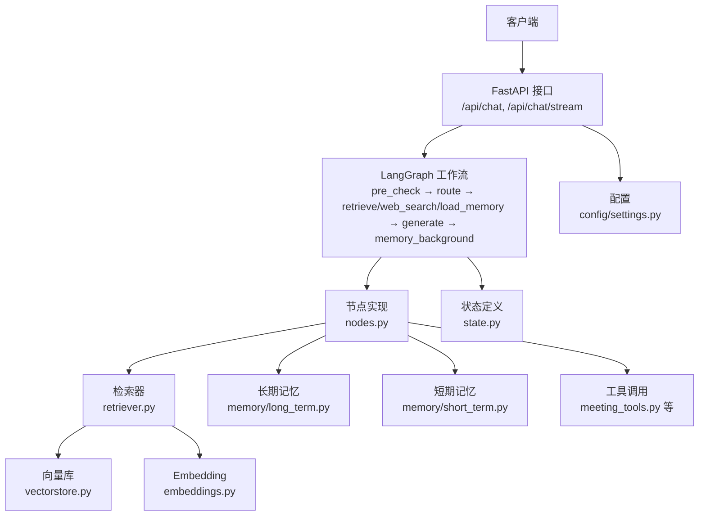
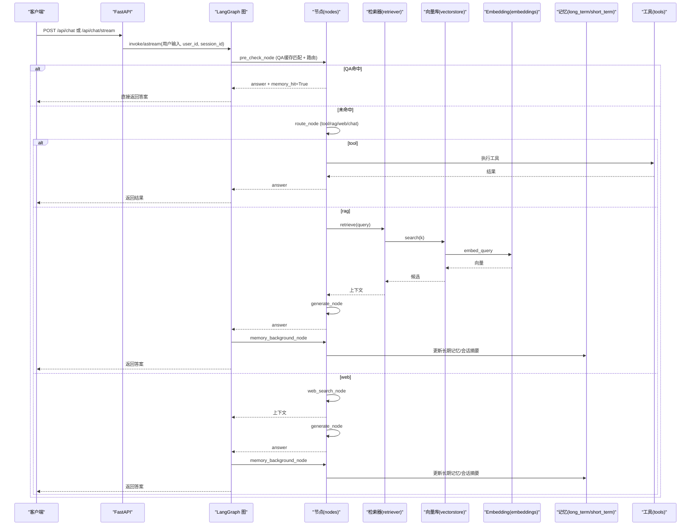
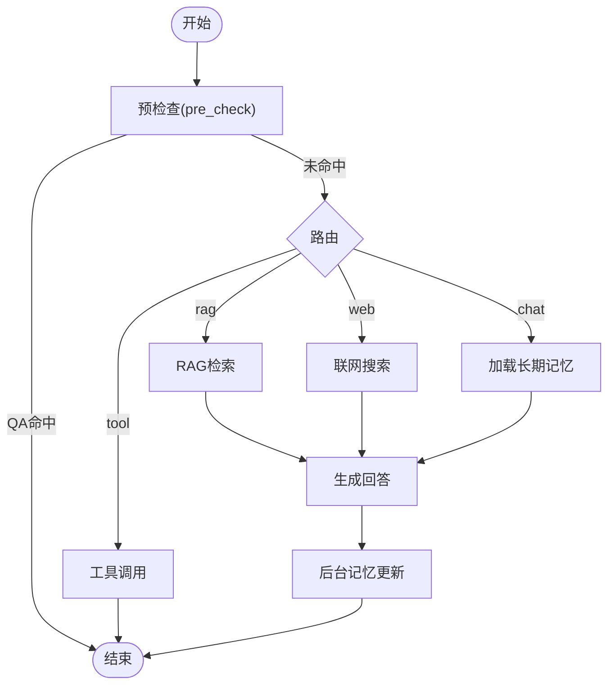
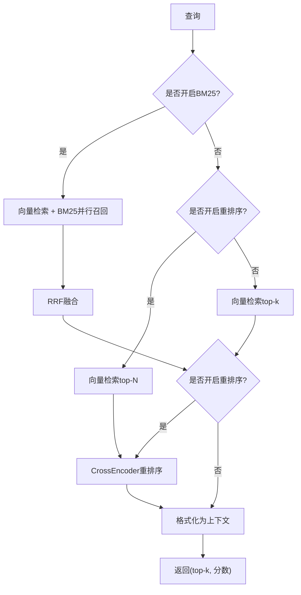
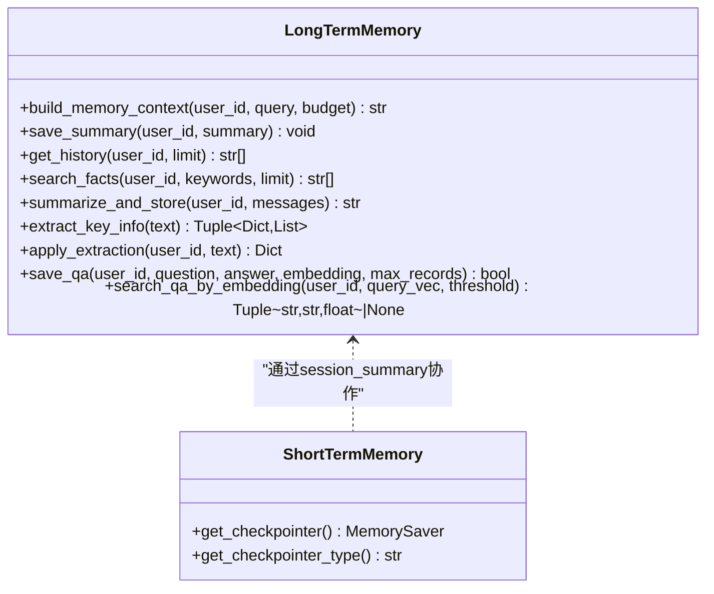
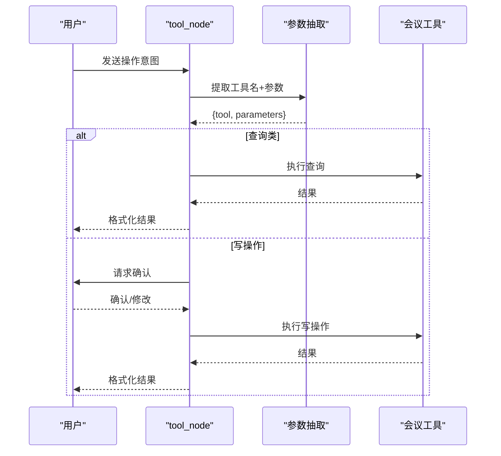
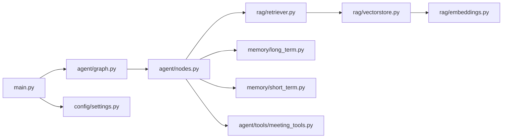

# 核心模块详解

<cite>
**本文引用的文件**
- [main.py](file://main.py)
- [agent/graph.py](file://agent/graph.py)
- [agent/nodes.py](file://agent/nodes.py)
- [agent/state.py](file://agent/state.py)
- [rag/retriever.py](file://rag/retriever.py)
- [rag/vectorstore.py](file://rag/vectorstore.py)
- [rag/embeddings.py](file://rag/embeddings.py)
- [memory/long_term.py](file://memory/long_term.py)
- [memory/short_term.py](file://memory/short_term.py)
- [config/settings.py](file://config/settings.py)
- [agent/tools/meeting_tools.py](file://agent/tools/meeting_tools.py)
</cite>

## 目录
1. [简介](#简介)
2. [项目结构](#项目结构)
3. [核心组件](#核心组件)
4. [架构总览](#架构总览)
5. [详细组件分析](#详细组件分析)
6. [依赖关系分析](#依赖关系分析)
7. [性能考量](#性能考量)
8. [故障排查指南](#故障排查指南)
9. [结论](#结论)

## 简介
本项目是一个基于 LangGraph 的智能体工作流系统，结合 RAG（检索增强生成）、长期/短期记忆、工具调用与联网搜索能力，提供 Web 聊天接口与流式输出。核心目标是为有经验的开发者提供深入的技术细节，支持二次开发与功能定制。

## 项目结构
- 入口与服务：FastAPI 主服务、健康检查、SSE 流式接口、启动预热（LLM、向量库、BM25 索引、文件监听）
- 智能体工作流：LangGraph StateGraph 编排节点（预检查、路由、检索、联网搜索、长期记忆加载、生成、后台记忆更新、工具调用）
- RAG 检索：多路召回（向量 + BM25）、重排序、上下文格式化、Milvus Lite 向量库封装、Embedding 模型（Jina CLIP v2 / BGE）
- 记忆管理：SQLite 长期记忆（用户画像、关键事实、摘要历史、会话压缩摘要、问答缓存），进程内 MemorySaver 短期记忆
- 配置中心：统一 Settings（环境变量/.env），集中管理 LLM、Embedding、向量库、RAG、记忆、安全、限流熔断、工具开关等
- 工具集成：钉钉待办/会议工具（参数提取、确认流程、结果格式化）

**图表来源**
- [main.py:154-314](file://main.py#L154-L314)
- [agent/graph.py:44-102](file://agent/graph.py#L44-L102)
- [agent/nodes.py:93-151](file://agent/nodes.py#L93-L151)
- [rag/retriever.py:18-53](file://rag/retriever.py#L18-L53)
- [rag/vectorstore.py:29-76](file://rag/vectorstore.py#L29-L76)
- [rag/embeddings.py:164-180](file://rag/embeddings.py#L164-L180)
- [memory/long_term.py:424-498](file://memory/long_term.py#L424-L498)
- [memory/short_term.py:13-20](file://memory/short_term.py#L13-L20)
- [config/settings.py:19-161](file://config/settings.py#L19-L161)

**章节来源**
- [main.py:1-387](file://main.py#L1-L387)
- [agent/graph.py:1-255](file://agent/graph.py#L1-L255)
- [agent/state.py:1-54](file://agent/state.py#L1-L54)
- [rag/retriever.py:1-140](file://rag/retriever.py#L1-L140)
- [rag/vectorstore.py:1-282](file://rag/vectorstore.py#L1-L282)
- [rag/embeddings.py:1-180](file://rag/embeddings.py#L1-L180)
- [memory/long_term.py:1-820](file://memory/long_term.py#L1-L820)
- [memory/short_term.py:1-28](file://memory/short_term.py#L1-L28)
- [config/settings.py:1-216](file://config/settings.py#L1-L216)
- [agent/tools/meeting_tools.py:1-225](file://agent/tools/meeting_tools.py#L1-L225)

## 核心组件
- 智能体工作流（StateGraph）：定义节点与边，支持条件分支、后台异步任务、checkpointer 短期上下文
- RAG 检索器：多路召回（向量+BM25）、RRF 融合、CrossEncoder 重排序、上下文格式化
- 记忆系统：分层长期记忆（画像/事实/摘要/会话压缩/问答缓存），短期记忆按 thread_id 维护
- 配置中心：集中化 Settings，覆盖 LLM、Embedding、向量库、RAG、记忆、安全、限流熔断、工具开关
- 工具调用：意图识别→参数抽取→确认→执行→格式化返回

**章节来源**
- [agent/graph.py:44-102](file://agent/graph.py#L44-L102)
- [rag/retriever.py:18-53](file://rag/retriever.py#L18-L53)
- [memory/long_term.py:424-498](file://memory/long_term.py#L424-L498)
- [memory/short_term.py:13-20](file://memory/short_term.py#L13-L20)
- [config/settings.py:19-161](file://config/settings.py#L19-L161)
- [agent/nodes.py:647-780](file://agent/nodes.py#L647-L780)

## 架构总览

**图表来源**
- [main.py:154-314](file://main.py#L154-L314)
- [agent/graph.py:44-102](file://agent/graph.py#L44-L102)
- [agent/nodes.py:93-151](file://agent/nodes.py#L93-L151)
- [rag/retriever.py:18-53](file://rag/retriever.py#L18-L53)
- [rag/vectorstore.py:164-184](file://rag/vectorstore.py#L164-L184)
- [rag/embeddings.py:92-94](file://rag/embeddings.py#L92-L94)
- [memory/long_term.py:424-498](file://memory/long_term.py#L424-L498)

## 详细组件分析

### 智能体工作流（LangGraph StateGraph）
- 构建与编译：注册节点、线性边与条件边，挂载 checkpointer（MemorySaver）以 thread_id 维护短期上下文
- 节点职责：
  - pre_check：QA 缓存匹配 + 路由判断；若命中则短路到 END
  - route：决定走 tool/rag/web/chat
  - retrieve：RAG 检索并格式化上下文
  - web_search：联网搜索并复用 rag_context
  - load_memory：加载长期记忆上下文与会话压缩摘要
  - generate：组装 prompt（system + 历史 + 当前输入）并流式生成回答，失败自动降级备用模型
  - memory_background：后台执行关键信息抽取与长期记忆更新（不阻塞响应）
  - tool：工具调用（参数抽取→确认→执行→格式化）
- 流式事件：统一将 updates/messages 转为 node/token 事件，过滤重复完整消息

**图表来源**
- [agent/graph.py:44-102](file://agent/graph.py#L44-L102)
- [agent/nodes.py:93-151](file://agent/nodes.py#L93-L151)
- [agent/nodes.py:499-533](file://agent/nodes.py#L499-L533)
- [agent/nodes.py:630-644](file://agent/nodes.py#L630-L644)
- [agent/nodes.py:647-780](file://agent/nodes.py#L647-L780)

**章节来源**
- [agent/graph.py:44-102](file://agent/graph.py#L44-L102)
- [agent/nodes.py:93-151](file://agent/nodes.py#L93-L151)
- [agent/nodes.py:499-533](file://agent/nodes.py#L499-L533)
- [agent/nodes.py:630-644](file://agent/nodes.py#L630-L644)
- [agent/nodes.py:647-780](file://agent/nodes.py#L647-L780)

### RAG 检索系统
- 检索流程：
  - 多路召回：向量检索（Milvus）+ BM25 关键词检索（可选），使用 RRF 融合排序
  - 重排序：CrossEncoder（BAAI/bge-reranker-base）精排，取 top-k
  - 上下文格式化：合并来源、标题、相关度，供生成节点注入
- 向量库：Milvus Lite 本地文件持久化，支持文本与图像文档共存（动态字段），写入加锁防并发冲突
- Embedding：Jina CLIP v2（多模态）或 BGE（纯文本快速），延迟加载，L2 归一化

**图表来源**
- [rag/retriever.py:18-53](file://rag/retriever.py#L18-L53)
- [rag/retriever.py:55-110](file://rag/retriever.py#L55-L110)
- [rag/vectorstore.py:164-184](file://rag/vectorstore.py#L164-L184)
- [rag/embeddings.py:164-180](file://rag/embeddings.py#L164-L180)

**章节来源**
- [rag/retriever.py:18-53](file://rag/retriever.py#L18-L53)
- [rag/vectorstore.py:29-76](file://rag/vectorstore.py#L29-L76)
- [rag/vectorstore.py:164-184](file://rag/vectorstore.py#L164-L184)
- [rag/embeddings.py:29-94](file://rag/embeddings.py#L29-L94)
- [rag/embeddings.py:131-180](file://rag/embeddings.py#L131-L180)

### 记忆管理系统
- 长期记忆（SQLite）：
  - 分层结构化：用户画像（P0 硬保留）、关键事实（优先级 1-10）、历史摘要、会话压缩摘要、问答缓存
  - 预算控制：按字符预算逐层填充，P0 不受预算约束，避免关键信息丢失
  - 增量合并：摘要合并时强制保留关键信息，防止覆盖式丢失
  - 规则快速抽取：正则匹配“我叫…”等模式，零 LLM 成本当轮落库
- 短期记忆（MemorySaver）：按 thread_id 维护会话上下文，支持多轮对话连贯性
- 问答缓存：相似问题直接复用历史答案，跳过大模型，降低延迟与成本

**图表来源**
- [memory/long_term.py:424-498](file://memory/long_term.py#L424-L498)
- [memory/long_term.py:561-633](file://memory/long_term.py#L561-L633)
- [memory/long_term.py:650-698](file://memory/long_term.py#L650-L698)
- [memory/long_term.py:729-800](file://memory/long_term.py#L729-L800)
- [memory/short_term.py:13-20](file://memory/short_term.py#L13-L20)

**章节来源**
- [memory/long_term.py:424-498](file://memory/long_term.py#L424-L498)
- [memory/long_term.py:561-633](file://memory/long_term.py#L561-L633)
- [memory/long_term.py:650-698](file://memory/long_term.py#L650-L698)
- [memory/long_term.py:729-800](file://memory/long_term.py#L729-L800)
- [memory/short_term.py:13-20](file://memory/short_term.py#L13-L20)

### 工具调用（钉钉待办/会议）
- 流程：LLM 从输入提取工具名与参数 → 查询类操作直接执行 → 写操作需用户确认 → 执行后格式化返回
- 会议工具：创建/取消/修改/查询会议，参会人解析（手机号/姓名→钉钉用户ID），时间默认时长处理
- 确认机制：可配置是否需要确认（tool_confirmation_required），提升安全性

**图表来源**
- [agent/nodes.py:647-780](file://agent/nodes.py#L647-L780)
- [agent/tools/meeting_tools.py:17-129](file://agent/tools/meeting_tools.py#L17-L129)
- [agent/tools/meeting_tools.py:131-183](file://agent/tools/meeting_tools.py#L131-L183)

**章节来源**
- [agent/nodes.py:647-780](file://agent/nodes.py#L647-L780)
- [agent/tools/meeting_tools.py:17-129](file://agent/tools/meeting_tools.py#L17-L129)
- [agent/tools/meeting_tools.py:131-183](file://agent/tools/meeting_tools.py#L131-L183)

### 数据流与处理逻辑
- 输入安全过滤：关键词黑名单 + prompt 注入检测
- 限流与熔断：按 user_id 滑动窗口限流，连续失败触发熔断保护
- 流式输出：SSE 事件类型（status/token/error/done），整体超时保护
- 启动预热：LLM 连接预热、向量库初始化与自动入库、BM25 索引预热、文件监听启动

**章节来源**
- [main.py:154-314](file://main.py#L154-L314)
- [main.py:45-135](file://main.py#L45-L135)

## 依赖关系分析

**图表来源**
- [main.py:154-314](file://main.py#L154-L314)
- [agent/graph.py:44-102](file://agent/graph.py#L44-L102)
- [agent/nodes.py:93-151](file://agent/nodes.py#L93-L151)
- [rag/retriever.py:18-53](file://rag/retriever.py#L18-L53)
- [rag/vectorstore.py:29-76](file://rag/vectorstore.py#L29-L76)
- [rag/embeddings.py:164-180](file://rag/embeddings.py#L164-L180)
- [config/settings.py:19-161](file://config/settings.py#L19-L161)
- [agent/tools/meeting_tools.py:17-129](file://agent/tools/meeting_tools.py#L17-L129)

**章节来源**
- [main.py:154-314](file://main.py#L154-L314)
- [agent/graph.py:44-102](file://agent/graph.py#L44-L102)
- [agent/nodes.py:93-151](file://agent/nodes.py#L93-L151)
- [rag/retriever.py:18-53](file://rag/retriever.py#L18-L53)
- [rag/vectorstore.py:29-76](file://rag/vectorstore.py#L29-L76)
- [rag/embeddings.py:164-180](file://rag/embeddings.py#L164-L180)
- [config/settings.py:19-161](file://config/settings.py#L19-L161)
- [agent/tools/meeting_tools.py:17-129](file://agent/tools/meeting_tools.py#L17-L129)

## 性能考量
- 启动预热：LLM 连接预热（TLS握手、DNS解析、连接池建立），显著降低首条请求延迟
- 向量库优化：Milvus Lite 本地文件持久化，写入加锁防并发冲突，flush 确保磁盘持久化
- 多路召回：BM25 + 向量检索 RRF 融合，提升精确匹配召回率；重排序精排提高相关性
- 记忆预算：长期记忆按字符预算分层填充，P0 硬保留，避免关键信息丢失
- 流式输出：SSE 整体超时保护，避免连接卡死；节点级进度事件提升用户体验
- 降级策略：主模型失败自动尝试备用模型列表，提升鲁棒性

[本节为通用性能讨论，无需特定文件引用]

## 故障排查指南
- 输入安全：检查关键词黑名单与 prompt 注入检测配置
- 限流熔断：查看 rate_limit_per_minute 与 circuit_breaker_threshold 配置，监控连续失败次数
- 检索失败：检查向量库集合是否存在、文档数是否为 0、BM25 索引是否预热
- 记忆更新：确认 SQLite 数据库路径、WAL 模式、表结构初始化
- 工具调用：验证 dingtalk_lib 路径、参会人解析、时间格式处理
- 流式超时：调整 stream_timeout，检查网络与 LLM 服务可用性

**章节来源**
- [main.py:154-314](file://main.py#L154-L314)
- [config/settings.py:135-161](file://config/settings.py#L135-L161)
- [rag/vectorstore.py:193-206](file://rag/vectorstore.py#L193-L206)
- [memory/long_term.py:30-47](file://memory/long_term.py#L30-L47)
- [agent/tools/meeting_tools.py:185-225](file://agent/tools/meeting_tools.py#L185-L225)

## 结论
本项目通过 LangGraph 工作流将智能体能力模块化，结合 RAG、记忆管理与工具调用，提供了高可用、可扩展的 AI 助手架构。开发者可基于此进行二次开发，灵活定制检索策略、记忆策略与工具扩展，满足多样化业务需求。

[本节为总结性内容，无需特定文件引用]