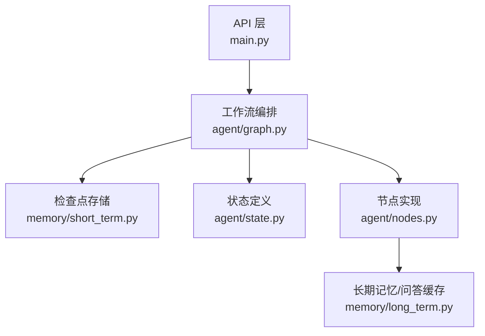
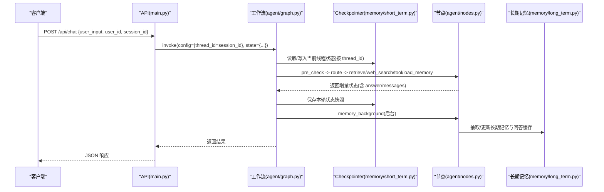
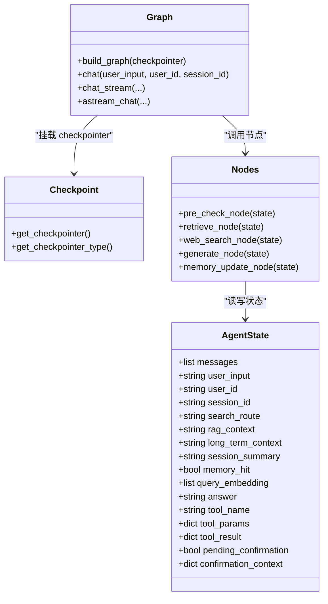
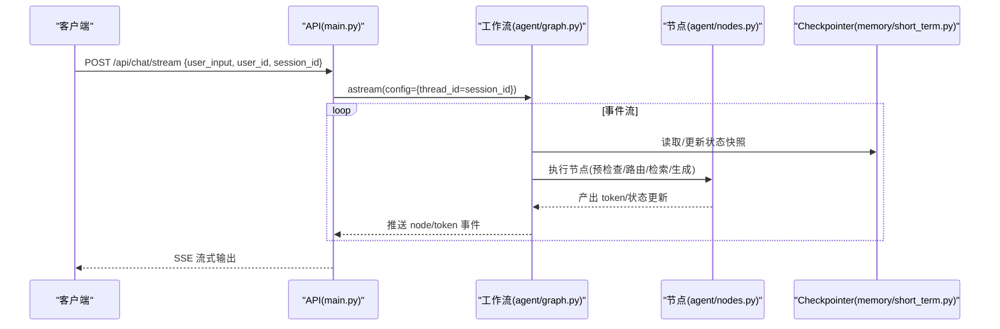
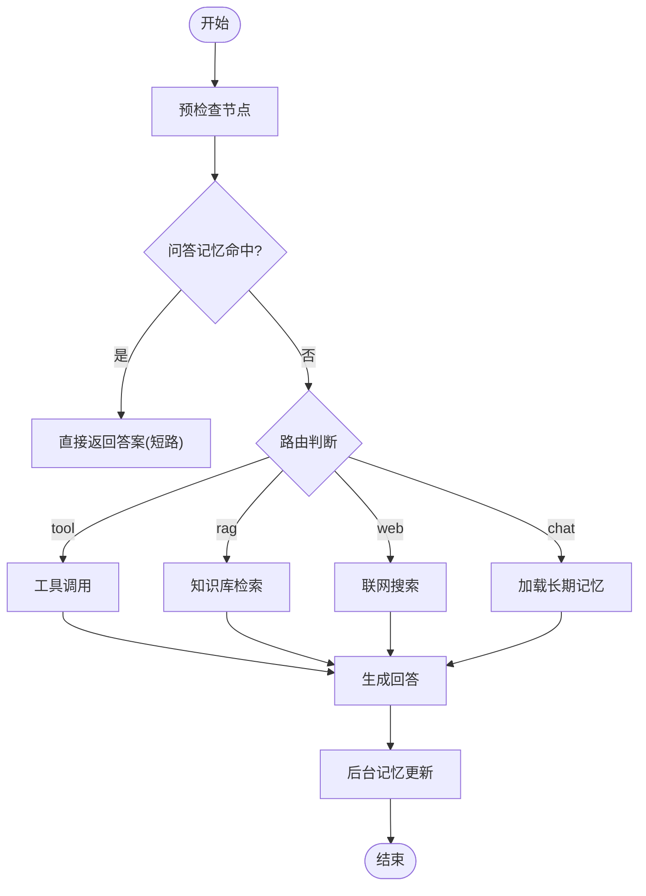
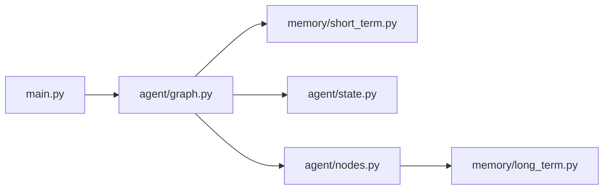

# 短期会话记忆

<cite>
**本文引用的文件**
- [memory/short_term.py](file://memory/short_term.py)
- [agent/graph.py](file://agent/graph.py)
- [agent/state.py](file://agent/state.py)
- [agent/nodes.py](file://agent/nodes.py)
- [memory/long_term.py](file://memory/long_term.py)
- [main.py](file://main.py)
</cite>

## 目录
1. [简介](#简介)
2. [项目结构](#项目结构)
3. [核心组件](#核心组件)
4. [架构总览](#架构总览)
5. [详细组件分析](#详细组件分析)
6. [依赖关系分析](#依赖关系分析)
7. [性能考量](#性能考量)
8. [故障排查指南](#故障排查指南)
9. [结论](#结论)
10. [附录：使用示例与最佳实践](#附录使用示例与最佳实践)

## 简介
本文件聚焦“短期会话记忆”的实现机制，围绕基于 LangGraph checkpointer（进程内 MemorySaver）的会话上下文管理展开。重点说明：
- thread_id（= session_id）的会话隔离策略
- 多轮对话上下文的保持原理
- checkpointer 单例模式的设计与使用
- 会话生命周期管理、内存使用优化
- 与智能体工作流（状态图、节点、消息 reducer）的集成方式
- 如何在对话中维护上下文连贯性的具体调用路径

## 项目结构
短期会话记忆由以下模块协同完成：
- memory.short_term：提供进程内 MemorySaver 的单例获取与类型标识
- agent.graph：构建并编译 LangGraph 状态图，挂载 checkpointer，并通过 thread_id 进行会话隔离
- agent.state：定义 AgentState，其中 messages 字段通过 add_messages reducer 自动累加历史消息
- agent.nodes：各节点实现业务逻辑，生成回答、检索、工具调用等，并在需要时写入或读取短期/长期记忆
- memory.long_term：长期记忆与问答缓存、会话压缩摘要等持久化能力
- main：Web API 入口，将请求中的 session_id 映射为 thread_id，驱动工作流执行

图表来源
- [main.py:154-209](file://main.py#L154-L209)
- [agent/graph.py:44-102](file://agent/graph.py#L44-L102)
- [memory/short_term.py:13-20](file://memory/short_term.py#L13-L20)
- [agent/state.py:12-25](file://agent/state.py#L12-L25)
- [agent/nodes.py:93-150](file://agent/nodes.py#L93-L150)
- [memory/long_term.py:340-379](file://memory/long_term.py#L340-L379)

章节来源
- [main.py:154-209](file://main.py#L154-L209)
- [agent/graph.py:44-102](file://agent/graph.py#L44-L102)
- [memory/short_term.py:13-20](file://memory/short_term.py#L13-L20)
- [agent/state.py:12-25](file://agent/state.py#L12-L25)
- [agent/nodes.py:93-150](file://agent/nodes.py#L93-L150)
- [memory/long_term.py:340-379](file://memory/long_term.py#L340-L379)

## 核心组件
- 进程内 checkpointer 单例：MemorySaver 在进程内按 thread_id 维护每个会话的状态快照与消息历史
- 状态图与状态：AgentState 中的 messages 使用 add_messages reducer，自动合并历史消息；其余字段覆盖更新
- 工作流节点：预检查、路由、检索、联网搜索、工具调用、生成回答、后台记忆更新
- 会话隔离：通过 config.configurable.thread_id 绑定到 session_id，确保不同会话互不干扰
- 长期记忆与问答缓存：用于跨会话的知识沉淀与相似问题快速复用答案

章节来源
- [memory/short_term.py:13-20](file://memory/short_term.py#L13-L20)
- [agent/state.py:12-25](file://agent/state.py#L12-L25)
- [agent/graph.py:44-102](file://agent/graph.py#L44-L102)
- [agent/nodes.py:232-281](file://agent/nodes.py#L232-L281)
- [memory/long_term.py:729-800](file://memory/long_term.py#L729-L800)

## 架构总览
短期会话记忆的工作流与数据流如下：
- 请求进入后，API 层将 session_id 作为 thread_id 传入工作流配置
- 工作流编译时挂载 MemorySaver，LangGraph 内部以 thread_id 为键维护状态快照
- 节点间流转过程中，messages 字段通过 add_messages reducer 累积历史消息
- 生成回答后，后台异步执行记忆抽取与更新（长期记忆、问答缓存、会话压缩摘要）

图表来源
- [main.py:154-209](file://main.py#L154-L209)
- [agent/graph.py:44-102](file://agent/graph.py#L44-L102)
- [agent/graph.py:117-138](file://agent/graph.py#L117-L138)
- [memory/short_term.py:13-20](file://memory/short_term.py#L13-L20)
- [agent/nodes.py:535-549](file://agent/nodes.py#L535-L549)
- [memory/long_term.py:729-800](file://memory/long_term.py#L729-L800)

## 详细组件分析

### 会话隔离策略：thread_id（session_id）
- 工作流调用时通过 config.configurable.thread_id 指定会话标识，所有状态读写均按该键隔离
- API 层将请求中的 session_id 直接映射为 thread_id，保证同一用户在同一会话内的上下文连续
- 不同 session_id 对应不同的 MemorySaver 状态空间，互不影响

章节来源
- [agent/graph.py:117-138](file://agent/graph.py#L117-L138)
- [main.py:154-209](file://main.py#L154-L209)

### 多轮对话上下文保持原理
- AgentState.messages 使用 add_messages reducer，每次节点返回的消息会追加到历史中，避免覆盖
- 生成节点在构造聊天历史时，结合窗口大小与字符预算裁剪消息，并在超窗时注入“更早对话摘要”，防止关键上下文丢失
- 问答命中时，会将本次问答对写入短期历史，保证后续多轮上下文连贯

章节来源
- [agent/state.py:12-25](file://agent/state.py#L12-L25)
- [agent/nodes.py:432-450](file://agent/nodes.py#L432-L450)
- [agent/nodes.py:516-532](file://agent/nodes.py#L516-L532)
- [agent/nodes.py:232-281](file://agent/nodes.py#L232-L281)

### checkpointer 单例模式
- memory.short_term.get_checkpointer() 使用全局变量缓存 MemorySaver 实例，首次调用时创建，后续复用
- get_checkpointer_type() 返回当前后端类型标识，便于健康检查与监控
- 该设计减少重复初始化开销，保证进程内会话状态的唯一性与一致性

章节来源
- [memory/short_term.py:13-27](file://memory/short_term.py#L13-L27)

### 会话生命周期管理
- 启动时：工作图按需编译，checkpointer 懒加载
- 运行期：每次请求携带 session_id，LangGraph 根据 thread_id 恢复/更新状态
- 结束：请求完成后状态快照保存在 MemorySaver 中，直到进程退出或显式清理

章节来源
- [agent/graph.py:44-102](file://agent/graph.py#L44-L102)
- [memory/short_term.py:13-20](file://memory/short_term.py#L13-L20)

### 内存使用优化
- 消息历史采用窗口+预算裁剪，避免无限增长
- 问答缓存命中直接复用答案，跳过 LLM 生成，降低计算与内存压力
- 后台异步更新长期记忆，不阻塞主链路响应

章节来源
- [agent/nodes.py:432-450](file://agent/nodes.py#L432-L450)
- [agent/nodes.py:232-281](file://agent/nodes.py#L232-L281)
- [agent/graph.py:73-75](file://agent/graph.py#L73-L75)

### 与智能体工作流的集成
- 工作流节点包括预检查、路由、检索、联网搜索、工具调用、生成回答、后台记忆更新
- 条件边根据 search_route 分流，qa_match 命中可短路至 END，提升效率
- 生成完成后，后台节点负责抽取事实、更新长期记忆与会话摘要

章节来源
- [agent/graph.py:55-92](file://agent/graph.py#L55-L92)
- [agent/nodes.py:93-150](file://agent/nodes.py#L93-L150)
- [agent/nodes.py:535-549](file://agent/nodes.py#L535-L549)

#### 类图（状态与组件关系）

图表来源
- [agent/state.py:12-51](file://agent/state.py#L12-L51)
- [memory/short_term.py:13-27](file://memory/short_term.py#L13-L27)
- [agent/graph.py:44-102](file://agent/graph.py#L44-L102)
- [agent/nodes.py:93-150](file://agent/nodes.py#L93-L150)

#### 序列图（流式调用流程）

图表来源
- [main.py:228-314](file://main.py#L228-L314)
- [agent/graph.py:190-255](file://agent/graph.py#L190-L255)
- [memory/short_term.py:13-20](file://memory/short_term.py#L13-L20)

#### 流程图（问答匹配与短路）

图表来源
- [agent/nodes.py:93-150](file://agent/nodes.py#L93-L150)
- [agent/nodes.py:232-281](file://agent/nodes.py#L232-L281)
- [agent/nodes.py:284-341](file://agent/nodes.py#L284-L341)
- [agent/nodes.py:344-360](file://agent/nodes.py#L344-L360)
- [agent/nodes.py:535-549](file://agent/nodes.py#L535-L549)

## 依赖关系分析
- API 层依赖工作流接口，工作流依赖 checkpointer 与节点实现
- 节点实现依赖长期记忆与配置，部分节点依赖 RAG/联网搜索工具
- checkpointer 为进程内单例，被工作流编译时挂载，按 thread_id 隔离状态

图表来源
- [main.py:154-209](file://main.py#L154-L209)
- [agent/graph.py:44-102](file://agent/graph.py#L44-L102)
- [memory/short_term.py:13-20](file://memory/short_term.py#L13-L20)
- [agent/state.py:12-25](file://agent/state.py#L12-L25)
- [agent/nodes.py:93-150](file://agent/nodes.py#L93-L150)
- [memory/long_term.py:340-379](file://memory/long_term.py#L340-L379)

章节来源
- [main.py:154-209](file://main.py#L154-L209)
- [agent/graph.py:44-102](file://agent/graph.py#L44-L102)
- [memory/short_term.py:13-20](file://memory/short_term.py#L13-L20)
- [agent/state.py:12-25](file://agent/state.py#L12-L25)
- [agent/nodes.py:93-150](file://agent/nodes.py#L93-L150)
- [memory/long_term.py:340-379](file://memory/long_term.py#L340-L379)

## 性能考量
- 首请求预热：服务启动时预热 LLM 连接与向量库，降低冷启动延迟
- 流式输出：SSE 流式传输 token，提升用户体验
- 问答缓存：相似问题直接复用历史答案，避免重复编码与生成
- 后台异步：记忆更新在后台执行，不阻塞主链路
- 消息裁剪：窗口+预算控制消息长度，避免上下文过大导致性能下降

章节来源
- [main.py:45-77](file://main.py#L45-L77)
- [main.py:80-135](file://main.py#L80-L135)
- [agent/nodes.py:232-281](file://agent/nodes.py#L232-L281)
- [agent/nodes.py:432-450](file://agent/nodes.py#L432-L450)

## 故障排查指南
- 健康检查：通过 /health 查看 checkpointer 类型，确认短期记忆后端是否生效
- 输入安全与限流：API 层包含关键词过滤、限流与熔断，异常时返回相应错误码
- 流式超时：SSE 流整体超时保护，超时后返回已生成内容并记录成功
- 日志定位：节点失败与降级路径有日志输出，便于定位问题

章节来源
- [main.py:317-326](file://main.py#L317-L326)
- [main.py:166-185](file://main.py#L166-L185)
- [main.py:262-304](file://main.py#L262-L304)
- [agent/nodes.py:180-200](file://agent/nodes.py#L180-L200)

## 结论
短期会话记忆系统通过 LangGraph 的 checkpointer 与进程内 MemorySaver，实现了高效、隔离的多轮对话上下文管理。借助 thread_id 会话隔离、add_messages 消息累加、问答缓存与后台记忆更新，系统在性能与体验之间取得平衡。配合窗口+预算的消息裁剪与会话压缩摘要，有效控制了内存占用并保持了上下文连贯性。

## 附录：使用示例与最佳实践
- 会话隔离：在 API 调用中为每个用户会话分配唯一的 session_id，并将其作为 thread_id 传入工作流配置，确保上下文独立
- 多轮对话：保持同一 session_id 不变，工作流会自动累积 messages，形成连贯上下文
- 问答命中：开启问答缓存后，相似问题可直接复用历史答案，减少 LLM 调用成本
- 后台更新：记忆更新在后台执行，不影响主链路响应时间
- 健康检查：定期访问 /health 检查 checkpointer 类型与服务状态

章节来源
- [agent/graph.py:117-138](file://agent/graph.py#L117-L138)
- [main.py:154-209](file://main.py#L154-L209)
- [memory/short_term.py:13-27](file://memory/short_term.py#L13-L27)
- [agent/nodes.py:232-281](file://agent/nodes.py#L232-L281)
- [agent/nodes.py:535-549](file://agent/nodes.py#L535-L549)