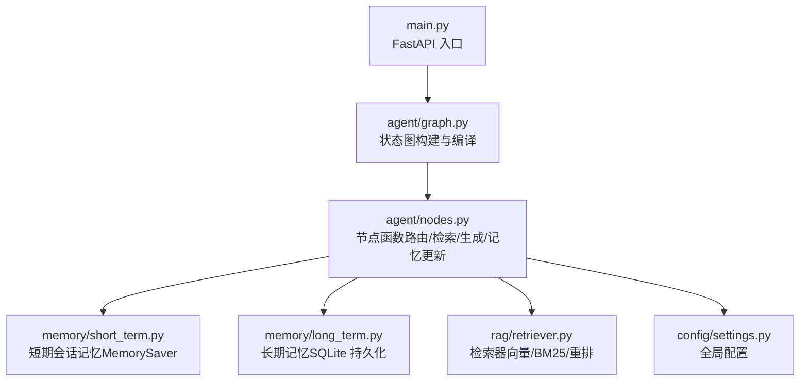
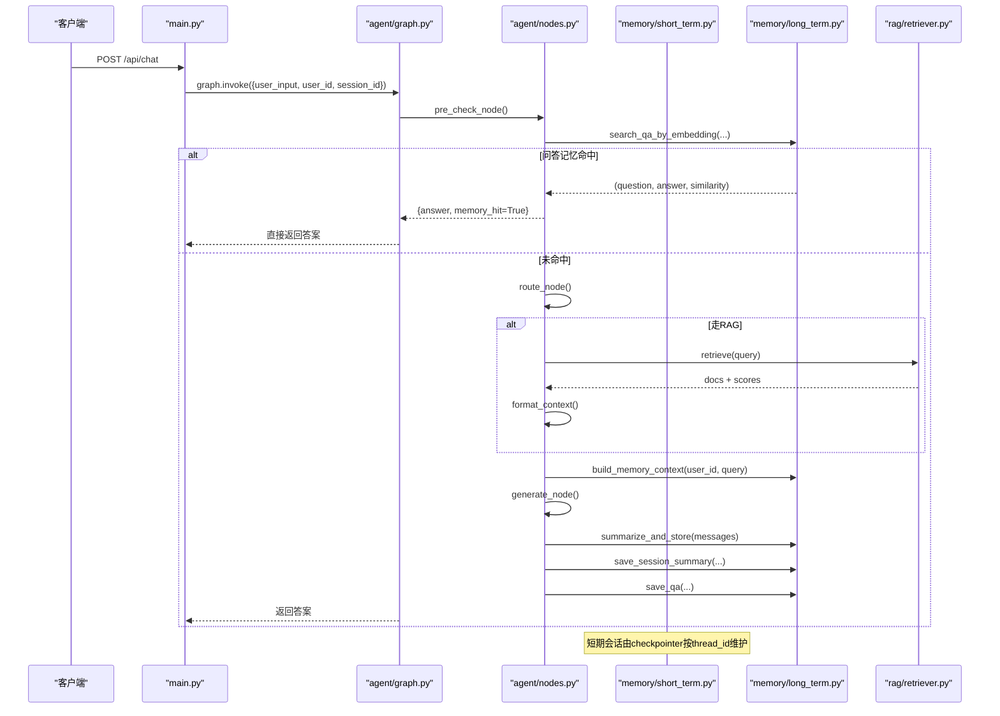
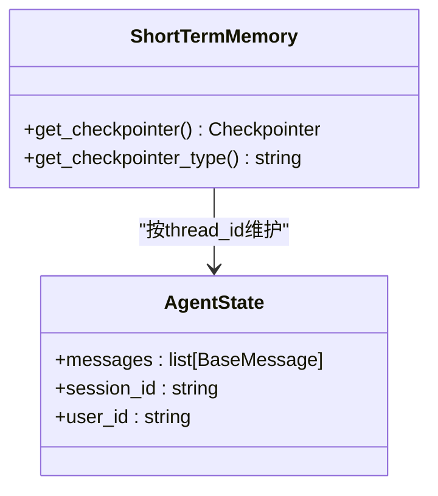
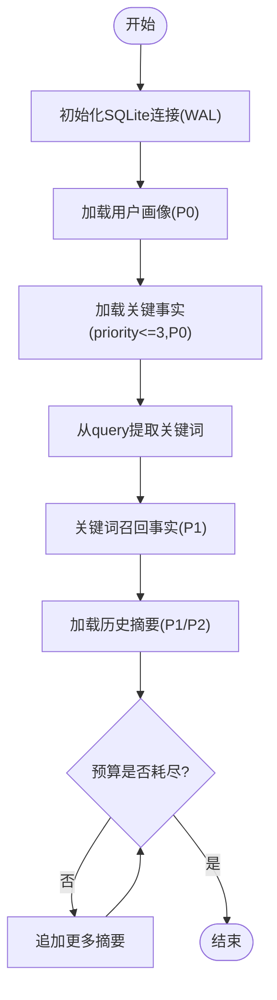
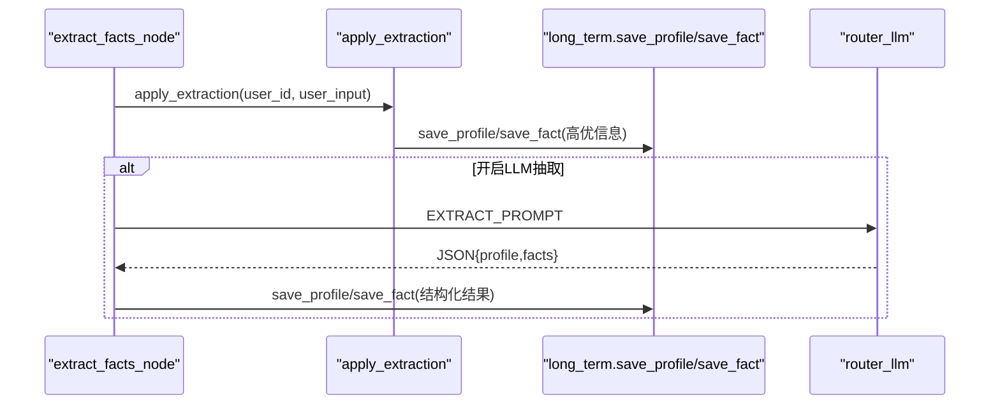
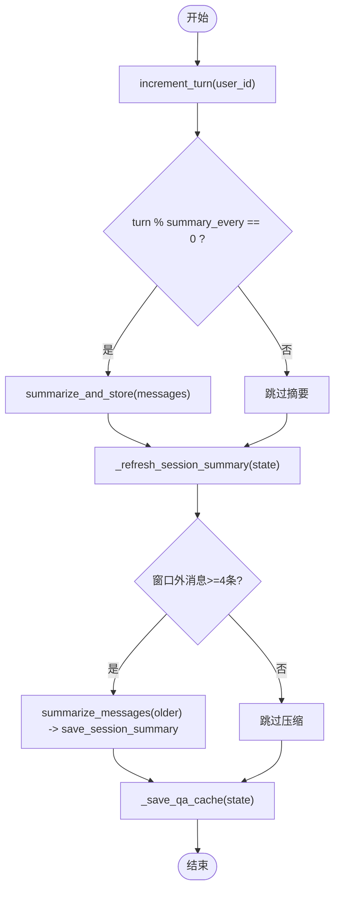
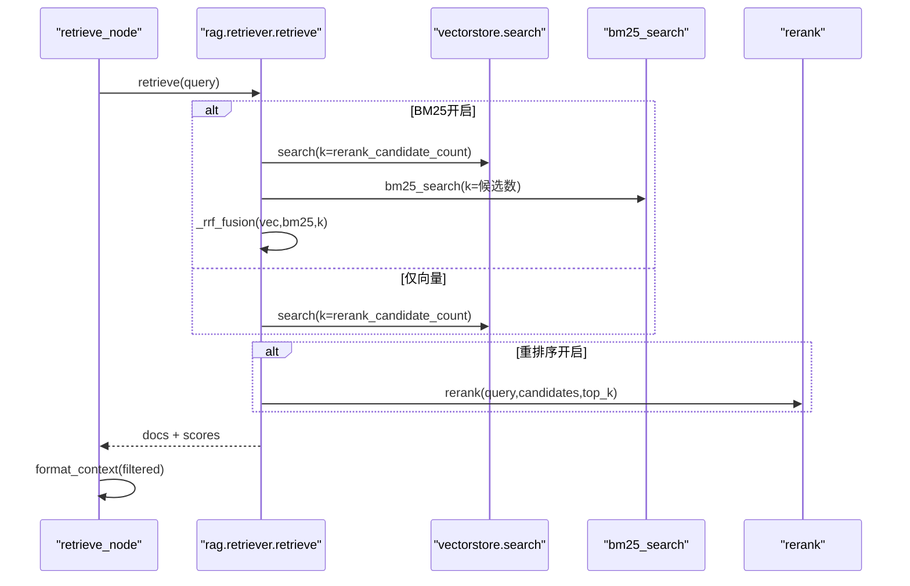
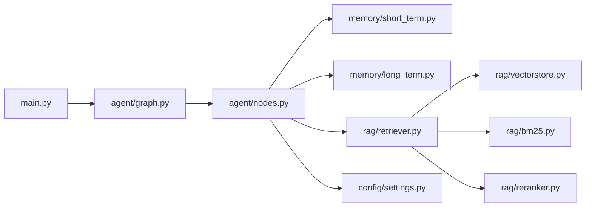

# 记忆管理系统

<cite>
**本文引用的文件**
- [memory/short_term.py](file://memory/short_term.py)
- [memory/long_term.py](file://memory/long_term.py)
- [agent/state.py](file://agent/state.py)
- [agent/nodes.py](file://agent/nodes.py)
- [agent/graph.py](file://agent/graph.py)
- [config/settings.py](file://config/settings.py)
- [rag/retriever.py](file://rag/retriever.py)
- [main.py](file://main.py)
</cite>

## 目录
1. [简介](#简介)
2. [项目结构](#项目结构)
3. [核心组件](#核心组件)
4. [架构总览](#架构总览)
5. [详细组件分析](#详细组件分析)
6. [依赖关系分析](#依赖关系分析)
7. [性能考量](#性能考量)
8. [故障排查指南](#故障排查指南)
9. [结论](#结论)
10. [附录](#附录)

## 简介
本系统采用“双重架构”的记忆管理：短期会话记忆用于保持多轮对话的上下文连贯性，长期用户记忆用于持久化个性化信息（画像、关键事实、历史摘要、问答缓存等）。通过分层预算与增量合并策略，系统在有限上下文窗口内最大化保留关键信息；同时提供规则快速抽取与LLM结构化抽取双通道，确保高优先级信息及时落库。检索阶段支持向量+BM25多路召回与重排序，结合问答记忆命中短路，显著降低首问延迟与重复生成成本。

## 项目结构
记忆相关代码主要分布在 memory 模块，工作流编排位于 agent 模块，配置集中在 config.settings，RAG 检索在 rag 模块，Web 入口在 main.py。整体以 LangGraph 状态图串联节点，按 thread_id 维护短期会话，按 user_id 维护长期记忆。

图表来源
- [main.py:154-209](file://main.py#L154-L209)
- [agent/graph.py:44-102](file://agent/graph.py#L44-L102)
- [agent/nodes.py:92-151](file://agent/nodes.py#L92-L151)
- [memory/short_term.py:13-27](file://memory/short_term.py#L13-L27)
- [memory/long_term.py:30-47](file://memory/long_term.py#L30-L47)
- [rag/retriever.py:18-52](file://rag/retriever.py#L18-L52)
- [config/settings.py:114-133](file://config/settings.py#L114-L133)

章节来源
- [main.py:154-209](file://main.py#L154-L209)
- [agent/graph.py:44-102](file://agent/graph.py#L44-L102)
- [agent/nodes.py:92-151](file://agent/nodes.py#L92-L151)
- [memory/short_term.py:13-27](file://memory/short_term.py#L13-L27)
- [memory/long_term.py:30-47](file://memory/long_term.py#L30-L47)
- [rag/retriever.py:18-52](file://rag/retriever.py#L18-L52)
- [config/settings.py:114-133](file://config/settings.py#L114-L133)

## 核心组件
- 短期会话记忆：基于 LangGraph checkpointer 的进程内 MemorySaver，按 thread_id（= session_id）维护消息历史，保障多轮对话连贯性。
- 长期用户记忆：基于 SQLite 的分层结构化存储，包含用户画像、关键事实、历史摘要、会话压缩摘要、问答记忆缓存等，支持增量合并与预算控制。
- 记忆抽取：规则快速抽取（零 LLM 成本，保证姓名等高优信息当轮落库）+ LLM 结构化抽取（可选），将关键信息写入画像与事实表。
- 记忆检索：分层构建上下文（P0/P1/P2 预算分配）、关键词召回事实、最近摘要优先填充，形成注入 prompt 的长期记忆上下文。
- 记忆更新：周期性摘要合并（增量模式，防覆盖丢失）、会话压缩摘要（窗口外旧消息滚动压缩）、问答记忆缓存（相似问题直接复用答案）。

章节来源
- [memory/short_term.py:13-27](file://memory/short_term.py#L13-L27)
- [memory/long_term.py:172-197](file://memory/long_term.py#L172-L197)
- [memory/long_term.py:224-313](file://memory/long_term.py#L224-L313)
- [memory/long_term.py:340-407](file://memory/long_term.py#L340-L407)
- [memory/long_term.py:424-497](file://memory/long_term.py#L424-L497)
- [memory/long_term.py:561-633](file://memory/long_term.py#L561-L633)
- [memory/long_term.py:650-697](file://memory/long_term.py#L650-L697)
- [memory/long_term.py:729-800](file://memory/long_term.py#L729-L800)
- [agent/nodes.py:344-360](file://agent/nodes.py#L344-L360)
- [agent/nodes.py:535-643](file://agent/nodes.py#L535-L643)

## 架构总览
记忆系统嵌入智能体工作流中，预检查阶段先进行问答记忆匹配，命中则短路返回；未命中则进入路由分流（知识库检索/联网搜索/加载长期记忆/工具调用），最终汇聚到生成节点，并在后台异步执行记忆抽取与更新。

图表来源
- [main.py:154-209](file://main.py#L154-L209)
- [agent/graph.py:44-102](file://agent/graph.py#L44-L102)
- [agent/nodes.py:92-151](file://agent/nodes.py#L92-L151)
- [agent/nodes.py:232-281](file://agent/nodes.py#L232-L281)
- [agent/nodes.py:284-321](file://agent/nodes.py#L284-L321)
- [agent/nodes.py:344-360](file://agent/nodes.py#L344-L360)
- [agent/nodes.py:499-532](file://agent/nodes.py#L499-L532)
- [agent/nodes.py:535-643](file://agent/nodes.py#L535-L643)
- [memory/long_term.py:729-800](file://memory/long_term.py#L729-L800)
- [rag/retriever.py:18-52](file://rag/retriever.py#L18-L52)

## 详细组件分析

### 短期会话记忆（会话上下文保持）
- 使用 LangGraph checkpointer 的进程内 MemorySaver，按 thread_id（= session_id）维护消息历史，自动累加 messages reducer，保障多轮对话连贯性。
- 通过 get_compiled_graph 挂载 checkpointer，所有节点共享同一会话上下文。

图表来源
- [memory/short_term.py:13-27](file://memory/short_term.py#L13-L27)
- [agent/state.py:12-51](file://agent/state.py#L12-L51)
- [agent/graph.py:94-102](file://agent/graph.py#L94-L102)

章节来源
- [memory/short_term.py:13-27](file://memory/short_term.py#L13-L27)
- [agent/state.py:12-51](file://agent/state.py#L12-L51)
- [agent/graph.py:94-102](file://agent/graph.py#L94-L102)

### 长期用户记忆（个性化存储）
- 分层结构化存储：
  - 用户画像（单值可更新，最高优先级）
  - 关键事实（多条带优先级，P0/P1 硬保留）
  - 历史摘要（最近若干条，按预算填充）
  - 会话压缩摘要（短期窗口外旧消息滚动压缩）
  - 问答记忆缓存（问题向量 + 历史答案，相似问题直接复用）
- 连接与并发：SQLite WAL 模式允许并发读，写操作串行化（线程锁），避免竞争。
- 迁移兼容：启动时自动迁移旧版 user_prefs 到新表结构。

图表来源
- [memory/long_term.py:30-47](file://memory/long_term.py#L30-L47)
- [memory/long_term.py:138-169](file://memory/long_term.py#L138-L169)
- [memory/long_term.py:224-313](file://memory/long_term.py#L224-L313)
- [memory/long_term.py:340-407](file://memory/long_term.py#L340-L407)
- [memory/long_term.py:424-497](file://memory/long_term.py#L424-L497)

章节来源
- [memory/long_term.py:30-47](file://memory/long_term.py#L30-L47)
- [memory/long_term.py:138-169](file://memory/long_term.py#L138-L169)
- [memory/long_term.py:224-313](file://memory/long_term.py#L224-L313)
- [memory/long_term.py:340-407](file://memory/long_term.py#L340-L407)
- [memory/long_term.py:424-497](file://memory/long_term.py#L424-L497)

### 记忆抽取流程（规则快速 + LLM结构化）
- 规则快速路径：正则匹配姓名、项目、公司等，零 LLM 成本，保证高优先级信息当轮落库。
- LLM 结构化抽取：可选开关，失败静默跳过，不影响主链路；解析 JSON 块写入画像与事实。

图表来源
- [agent/nodes.py:363-412](file://agent/nodes.py#L363-L412)
- [memory/long_term.py:650-697](file://memory/long_term.py#L650-L697)

章节来源
- [agent/nodes.py:363-412](file://agent/nodes.py#L363-L412)
- [memory/long_term.py:650-697](file://memory/long_term.py#L650-L697)

### 记忆存储与更新机制
- 摘要合并：增量合并旧摘要与新对话，强制保留关键信息（姓名/称呼/偏好），输出 JSON 提取 key_facts 单独落库。
- 会话压缩摘要：短期窗口超出时，将滑出窗口的旧消息压缩为摘要并持久化，防止硬丢。
- 问答记忆缓存：保存问答对及问题向量，后续相似问题直接复用答案，跳过大模型生成。

图表来源
- [agent/nodes.py:535-643](file://agent/nodes.py#L535-L643)
- [memory/long_term.py:561-633](file://memory/long_term.py#L561-L633)
- [memory/long_term.py:729-800](file://memory/long_term.py#L729-L800)

章节来源
- [agent/nodes.py:535-643](file://agent/nodes.py#L535-L643)
- [memory/long_term.py:561-633](file://memory/long_term.py#L561-L633)
- [memory/long_term.py:729-800](file://memory/long_term.py#L729-L800)

### 检索与上下文组装
- 检索器支持向量检索、BM25 多路召回、RRF 融合、重排序，可按配置关闭部分能力回退。
- 长期记忆上下文按 P0/P1/P2 分层预算构建，确保关键信息不丢失，历史摘要按预算逐条填充。

图表来源
- [agent/nodes.py:284-321](file://agent/nodes.py#L284-L321)
- [rag/retriever.py:18-52](file://rag/retriever.py#L18-L52)
- [rag/retriever.py:55-110](file://rag/retriever.py#L55-L110)
- [rag/retriever.py:113-140](file://rag/retriever.py#L113-L140)

章节来源
- [agent/nodes.py:284-321](file://agent/nodes.py#L284-L321)
- [rag/retriever.py:18-52](file://rag/retriever.py#L18-L52)
- [rag/retriever.py:55-110](file://rag/retriever.py#L55-L110)
- [rag/retriever.py:113-140](file://rag/retriever.py#L113-L140)

## 依赖关系分析
- 工作流编排：agent/graph.py 定义状态图节点与边，agent/nodes.py 实现具体逻辑，agent/state.py 定义状态结构。
- 记忆模块：memory/short_term.py 提供短期会话 checkpointer；memory/long_term.py 提供长期记忆存取、抽取、更新。
- 检索模块：rag/retriever.py 封装检索与格式化，依赖 vectorstore/bm25/reranker。
- 配置模块：config/settings.py 集中管理所有开关与阈值（如 memory_summary_every、memory_context_budget、memory_qa_threshold 等）。
- 入口模块：main.py 暴露 Web 接口，集成安全过滤、限流熔断、健康检查等。

图表来源
- [main.py:154-209](file://main.py#L154-L209)
- [agent/graph.py:44-102](file://agent/graph.py#L44-L102)
- [agent/nodes.py:92-151](file://agent/nodes.py#L92-L151)
- [rag/retriever.py:18-52](file://rag/retriever.py#L18-L52)
- [config/settings.py:114-133](file://config/settings.py#L114-L133)

章节来源
- [main.py:154-209](file://main.py#L154-L209)
- [agent/graph.py:44-102](file://agent/graph.py#L44-L102)
- [agent/nodes.py:92-151](file://agent/nodes.py#L92-L151)
- [rag/retriever.py:18-52](file://rag/retriever.py#L18-L52)
- [config/settings.py:114-133](file://config/settings.py#L114-L133)

## 性能考量
- 问答记忆命中短路：相似问题直接复用历史答案，避免重复向量化与大模型调用，显著降低延迟。
- 多路召回与重排序：向量+BM25 RRF 融合提升精确匹配召回率；重排序精排提高相关性。
- 会话压缩摘要：窗口外旧消息滚动压缩，避免硬丢导致上下文断裂。
- 增量摘要合并：强制保留关键信息，防止覆盖式丢失；关键事实单独落库（priority=3 属 P0 硬保留层）。
- 并发优化：SQLite WAL 模式允许并发读，写操作串行化；进程内 MemorySaver 无外部服务开销。
- 启动预热：LLM 连接预热、向量库自动重建、BM25 索引预热，降低首请求延迟。

章节来源
- [agent/nodes.py:232-281](file://agent/nodes.py#L232-L281)
- [rag/retriever.py:18-52](file://rag/retriever.py#L18-L52)
- [memory/long_term.py:561-633](file://memory/long_term.py#L561-L633)
- [memory/long_term.py:30-47](file://memory/long_term.py#L30-L47)
- [main.py:45-135](file://main.py#L45-L135)

## 故障排查指南
- 长期记忆加载失败：检查 SQLite 连接与表结构初始化，确认 WAL 模式与 busy_timeout 设置。
- 问答记忆检索失败：检查 embedding 向量化是否成功，确认 qa_memory 表结构与 embedding 字段。
- 规则抽取失败：检查正则表达式匹配逻辑，确认输入文本格式与黑名单过滤。
- 检索失败：检查向量库文档数量、BM25 索引状态、重排序模型可用性。
- 流式超时：调整 stream_timeout，检查网络与 LLM 服务响应。

章节来源
- [memory/long_term.py:30-47](file://memory/long_term.py#L30-L47)
- [memory/long_term.py:729-800](file://memory/long_term.py#L729-L800)
- [memory/long_term.py:650-697](file://memory/long_term.py#L650-L697)
- [rag/retriever.py:18-52](file://rag/retriever.py#L18-L52)
- [main.py:228-314](file://main.py#L228-L314)

## 结论
该记忆管理系统通过短期会话记忆与长期用户记忆的双重架构，实现了上下文连贯性与个性化存储的平衡。分层预算、增量合并、规则快速抽取与问答记忆命中短路等策略，有效提升了性能与用户体验。开发者可根据业务需求调整配置参数（如 memory_summary_every、memory_context_budget、memory_qa_threshold 等），定制记忆抽取、存储、检索与更新流程。

## 附录
- 关键配置项参考：
  - memory_summary_every：每多少轮触发一次长期记忆摘要
  - memory_context_budget：长期记忆上下文字符预算
  - memory_short_window：短期历史窗口（注入生成的最近消息条数）
  - memory_history_budget：短期历史字符预算
  - memory_qa_cache_enabled：问答记忆缓存开关
  - memory_qa_threshold：问答记忆命中的余弦相似度阈值
  - memory_qa_max_records：每用户最多保留的问答记忆条数

章节来源
- [config/settings.py:114-133](file://config/settings.py#L114-L133)