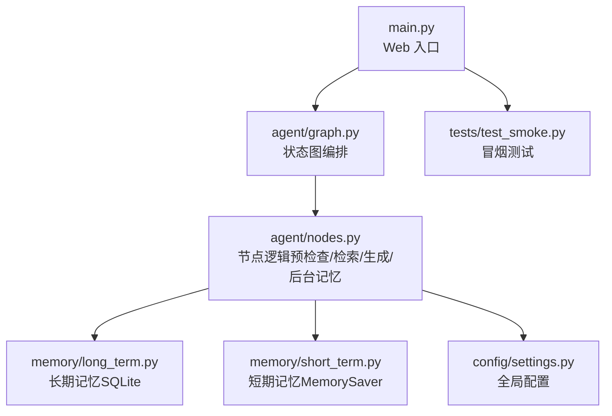
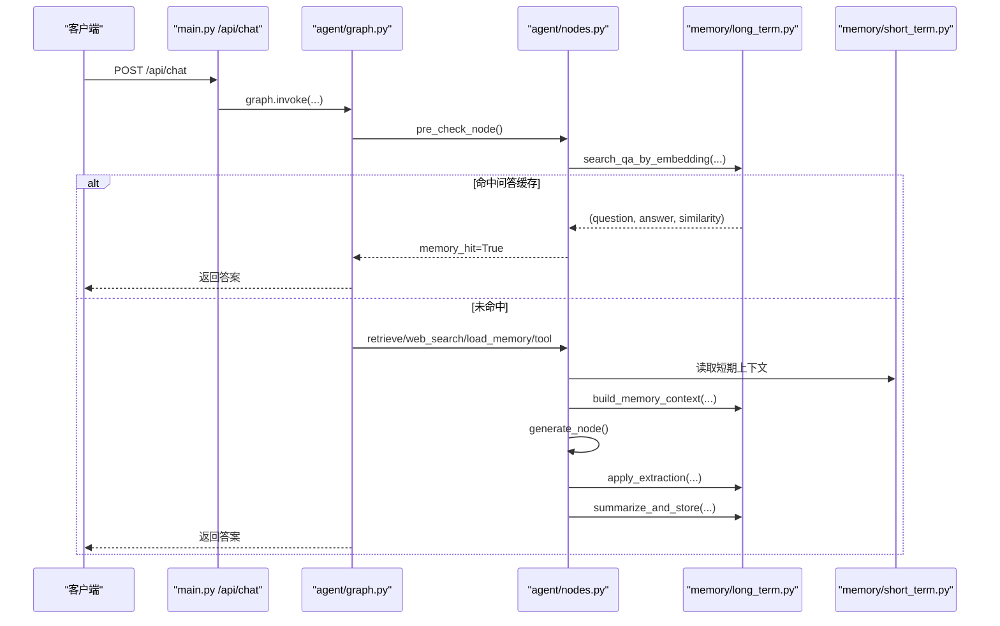
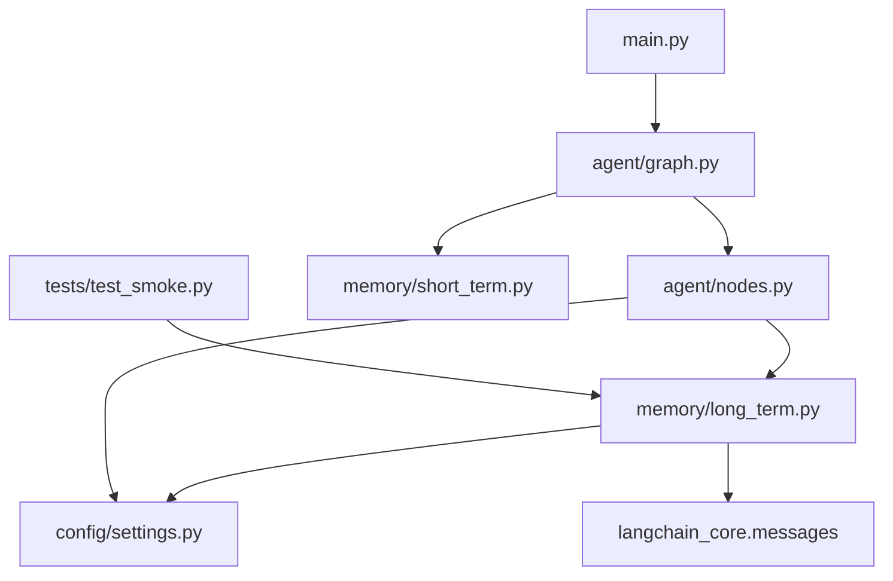

# 长期用户记忆

<cite>
**本文引用的文件**
- [memory/long_term.py](file://memory/long_term.py)
- [memory/short_term.py](file://memory/short_term.py)
- [agent/graph.py](file://agent/graph.py)
- [agent/nodes.py](file://agent/nodes.py)
- [config/settings.py](file://config/settings.py)
- [main.py](file://main.py)
- [tests/test_smoke.py](file://tests/test_smoke.py)
</cite>

## 目录
1. [简介](#简介)
2. [项目结构](#项目结构)
3. [核心组件](#核心组件)
4. [架构总览](#架构总览)
5. [详细组件分析](#详细组件分析)
6. [依赖关系分析](#依赖关系分析)
7. [性能考量](#性能考量)
8. [故障排查指南](#故障排查指南)
9. [结论](#结论)
10. [附录](#附录)

## 简介
本系统提供“长期用户记忆”能力，用于跨会话持久化用户个性化信息、构建用户画像、维护问答缓存与对话摘要，并在生成回答时按预算分层注入相关记忆上下文。其设计要点包括：
- 基于 SQLite 的持久化存储，支持并发读与串行写（WAL 模式）
- 结构化分层记忆：用户画像（P0）、关键事实（P0/P1）、历史摘要（P1/P2）
- 规则快速抽取 + LLM 增量合并，保证高优先级信息不丢失
- 问答记忆缓存：通过向量相似度匹配复用历史答案，降低大模型调用成本
- 短期记忆：进程内 MemorySaver，维护会话上下文连贯性

## 项目结构
长期记忆相关代码主要分布在 memory 模块，工作流编排位于 agent 模块，配置集中在 config 模块，入口在 main.py，测试覆盖于 tests。

**图表来源**
- [main.py:154-209](file://main.py#L154-L209)
- [agent/graph.py:44-102](file://agent/graph.py#L44-L102)
- [agent/nodes.py:92-150](file://agent/nodes.py#L92-L150)
- [memory/long_term.py:50-125](file://memory/long_term.py#L50-L125)
- [memory/short_term.py:13-20](file://memory/short_term.py#L13-L20)
- [config/settings.py:114-133](file://config/settings.py#L114-L133)

**章节来源**
- [main.py:154-209](file://main.py#L154-L209)
- [agent/graph.py:44-102](file://agent/graph.py#L44-L102)
- [memory/long_term.py:50-125](file://memory/long_term.py#L50-L125)
- [memory/short_term.py:13-20](file://memory/short_term.py#L13-L20)
- [config/settings.py:114-133](file://config/settings.py#L114-L133)

## 核心组件
- 长期记忆持久层：SQLite 表结构与 CRUD 接口，负责用户画像、关键事实、摘要历史、会话压缩摘要、问答缓存等
- 记忆上下文构建器：按优先级分层组装上下文，控制字符预算，确保关键信息硬保留
- 记忆抽取与更新：规则快速抽取 + LLM 增量合并，周期性触发摘要更新
- 问答缓存：问题向量入库，余弦相似度检索命中直接复用答案
- 短期记忆：进程内 checkpointer，维护多轮对话上下文

**章节来源**
- [memory/long_term.py:50-125](file://memory/long_term.py#L50-L125)
- [memory/long_term.py:424-497](file://memory/long_term.py#L424-L497)
- [memory/long_term.py:561-633](file://memory/long_term.py#L561-L633)
- [memory/long_term.py:729-818](file://memory/long_term.py#L729-L818)
- [memory/short_term.py:13-20](file://memory/short_term.py#L13-L20)

## 架构总览
整体工作流由 LangGraph 状态图编排，包含预检查（问答缓存匹配+路由）、四路分流（知识库检索/联网搜索/长期记忆/工具调用）、生成回答、后台记忆更新。长期记忆在后台异步执行，不阻塞主响应链路。

**图表来源**
- [main.py:154-209](file://main.py#L154-L209)
- [agent/graph.py:44-102](file://agent/graph.py#L44-L102)
- [agent/nodes.py:92-150](file://agent/nodes.py#L92-L150)
- [memory/long_term.py:784-818](file://memory/long_term.py#L784-L818)
- [memory/long_term.py:424-497](file://memory/long_term.py#L424-L497)

## 详细组件分析

### SQLite 表结构与数据模型
长期记忆使用 SQLite 作为持久化后端，启动时幂等初始化表结构，并开启 WAL 模式以支持并发读。核心表包括：
- user_memory：最新全局摘要与轮次计数
- user_prefs：旧版偏好键值对（兼容迁移）
- summary_history：摘要历史（保留最近 20 条）
- user_profile：用户画像字段（单值可更新，最高优先级）
- user_facts：关键事实（带优先级 1-10，来源与时间戳）
- session_summary：会话压缩摘要（短期窗口超窗后滚动）
- qa_memory：问答记忆缓存（问题向量 + 答案，相似度匹配）
- memory_meta：元数据（迁移标记等）

索引优化：
- summary_history(user_id, created_at DESC)
- user_facts(user_id, priority, updated_at DESC)
- qa_memory(user_id, updated_at DESC)

**章节来源**
- [memory/long_term.py:50-125](file://memory/long_term.py#L50-L125)
- [config/settings.py:187-194](file://config/settings.py#L187-L194)

### 用户画像构建与关键事实管理
- 用户画像字段：name、nickname、role、project、company，支持中文标签映射
- 关键事实：带优先级（1-10），来源标注，更新时间追踪
- 冲突解决：
  - 画像字段：同字段新值覆盖旧值，空值或同值不更新
  - 关键事实：完全重复则提升优先级/更新时间，不重复插入
  - 摘要历史：仅保留最近 20 条，自动清理旧记录
  - 问答缓存：相同问题更新答案，超出上限淘汰最旧记录

**章节来源**
- [memory/long_term.py:128-169](file://memory/long_term.py#L128-L169)
- [memory/long_term.py:226-313](file://memory/long_term.py#L226-L313)
- [memory/long_term.py:729-781](file://memory/long_term.py#L729-L781)

### 记忆抽取算法
采用双层抽取策略：
1. **规则快速抽取**：零 LLM 成本，正则匹配姓名、项目、公司等关键信息，当轮落库
2. **LLM 增量合并**：携带旧摘要生成新摘要，强制保留关键信息，提取 key_facts 单独落库

防误抽机制：
- 疑问词黑名单（什么、谁、啥等）避免提问被误判为陈述
- 时效性问题检测：天气/时间表达类查询跳过长期记忆更新

**章节来源**
- [memory/long_term.py:636-697](file://memory/long_term.py#L636-L697)
- [memory/long_term.py:561-633](file://memory/long_term.py#L561-L633)
- [agent/nodes.py:63-89](file://agent/nodes.py#L63-L89)

### 记忆检索与相似度匹配
问答记忆缓存通过余弦相似度匹配历史问题：
- 向量序列化：float32 小端格式存储为 BLOB
- 相似度计算：标准余弦相似度公式，长度不一致或零向量返回 0
- 阈值过滤：默认 0.90，命中时累加 hit_count 并刷新更新时间
- 容量控制：每用户最多 200 条，超出按更新时间淘汰

**章节来源**
- [memory/long_term.py:700-818](file://memory/long_term.py#L700-L818)
- [config/settings.py:128-133](file://config/settings.py#L128-L133)

### 记忆上下文构建与预算控制
分层构建策略确保关键信息不丢失：
- P0 层：用户画像 + 关键事实（priority<=3），硬保留不受预算约束
- P1 层：关键词召回事实 + 最近 2 条摘要，按预算逐条填充
- P2 层：更早摘要，剩余预算填充，超额丢弃

预算控制：
- 总字符预算默认 1600，可通过配置调整
- 各层独立预算保护（画像 300、关键事实 500、召回 300）
- 超限策略：P0 层永不截断，P1/P2 层按顺序丢弃

**章节来源**
- [memory/long_term.py:416-497](file://memory/long_term.py#L416-L497)
- [config/settings.py:117-119](file://config/settings.py#L117-L119)

### 工作流集成与后台更新
- 预检查阶段：问答缓存匹配命中直接返回，跳过后续链路
- 路由判断：工具调用/RAG/联网搜索/闲聊四路分流
- 后台记忆更新：generate 完成后异步执行关键信息抽取与摘要更新
- 短期记忆：进程内 MemorySaver，按 thread_id 维护会话上下文

**章节来源**
- [agent/graph.py:44-102](file://agent/graph.py#L44-L102)
- [agent/nodes.py:535-643](file://agent/nodes.py#L535-L643)
- [memory/short_term.py:13-20](file://memory/short_term.py#L13-L20)

## 依赖关系分析
长期记忆模块依赖关系清晰，低耦合高内聚：

**图表来源**
- [memory/long_term.py:17-23](file://memory/long_term.py#L17-L23)
- [agent/nodes.py:11-20](file://agent/nodes.py#L11-L20)
- [agent/graph.py:26-41](file://agent/graph.py#L26-L41)
- [main.py:187-199](file://main.py#L187-L199)

**章节来源**
- [memory/long_term.py:17-23](file://memory/long_term.py#L17-L23)
- [agent/nodes.py:11-20](file://agent/nodes.py#L11-L20)
- [agent/graph.py:26-41](file://agent/graph.py#L26-L41)

## 性能考量
- **数据库性能**：WAL 模式支持并发读，busy_timeout 防止写锁等待超时
- **内存控制**：分层预算策略避免上下文过大影响生成质量
- **缓存优化**：问答缓存减少大模型调用，相似度阈值可调
- **后台处理**：记忆更新异步执行，不阻塞主响应链路
- **连接池**：SQLite 连接单例，减少连接开销

建议优化：
- 根据用户规模调整问答缓存上限（memory_qa_max_records）
- 合理设置相似度阈值（memory_qa_threshold）平衡准确率与召回率
- 监控摘要历史大小，避免无限增长
- 定期清理过期会话压缩摘要

[本节提供通用指导，无需特定文件引用]

## 故障排查指南
常见问题及解决方案：
- **数据库连接失败**：检查 SQLite 文件路径权限，确认 WAL 模式正常启用
- **记忆抽取异常**：验证正则表达式匹配规则，检查疑问词黑名单配置
- **相似度匹配失败**：确认向量维度一致，调整相似度阈值
- **上下文过长**：检查预算配置，优先保障 P0 层关键信息
- **后台更新阻塞**：确认线程锁使用正确，避免长时间事务

调试技巧：
- 使用单元测试验证记忆存取逻辑
- 启用详细日志输出，跟踪记忆更新流程
- 检查 SQLite 索引使用情况，优化查询性能

**章节来源**
- [memory/long_term.py:30-47](file://memory/long_term.py#L30-L47)
- [memory/long_term.py:636-697](file://memory/long_term.py#L636-L697)
- [memory/long_term.py:784-818](file://memory/long_term.py#L784-L818)
- [tests/test_smoke.py:39-93](file://tests/test_smoke.py#L39-L93)

## 结论
长期用户记忆系统通过结构化分层设计、规则与 LLM 结合的抽取策略、以及高效的缓存机制，实现了可靠的个性化记忆管理。系统在性能、可扩展性和用户体验方面均表现出色，适合生产环境部署。

核心优势：
- 关键信息不丢失：P0 层硬保留策略
- 高性能：问答缓存 + 后台异步更新
- 易扩展：模块化设计，配置驱动
- 可靠性：完善的错误处理与降级机制

未来改进方向：
- 支持更多用户画像字段类型
- 引入更智能的记忆重要性评估
- 优化向量检索性能，考虑外部向量数据库

[本节总结内容，无需特定文件引用]

## 附录

### CRUd 操作接口参考
- **保存用户画像**：save_profile(user_id, field, value) -> bool
- **获取用户画像**：get_profile(user_id) -> Dict[str, str]
- **保存关键事实**：save_fact(user_id, fact, priority, source) -> bool
- **获取关键事实**：get_facts(user_id, max_priority, limit) -> List[str]
- **保存摘要**：save_summary(user_id, summary) -> None
- **获取摘要历史**：get_history(user_id, limit) -> List[str]
- **保存问答缓存**：save_qa(user_id, question, answer, embedding, max_records) -> bool
- **检索问答缓存**：search_qa_by_embedding(user_id, query_vec, threshold) -> Tuple | None

**章节来源**
- [memory/long_term.py:226-313](file://memory/long_term.py#L226-L313)
- [memory/long_term.py:172-221](file://memory/long_term.py#L172-L221)
- [memory/long_term.py:729-818](file://memory/long_term.py#L729-L818)

### 配置参数说明
- **memory_context_budget**：长期记忆上下文字符预算（默认 1600）
- **memory_summary_every**：摘要更新频率（默认 6 轮）
- **memory_qa_cache_enabled**：问答缓存开关（默认 True）
- **memory_qa_threshold**：相似度阈值（默认 0.90）
- **memory_qa_max_records**：问答缓存上限（默认 200）

**章节来源**
- [config/settings.py:114-133](file://config/settings.py#L114-L133)