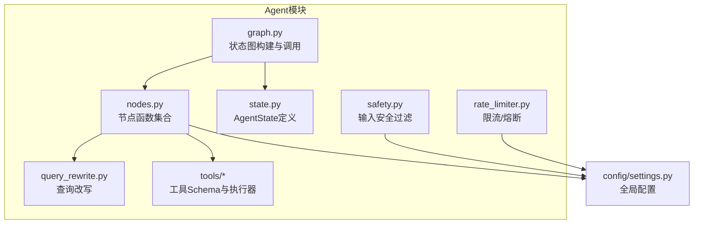
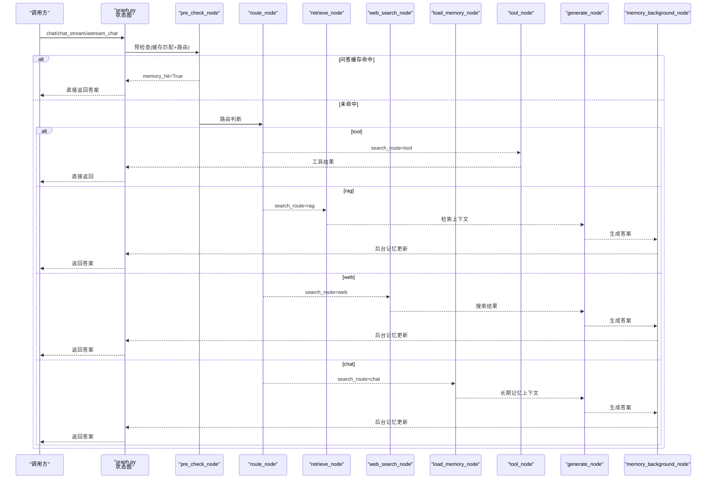
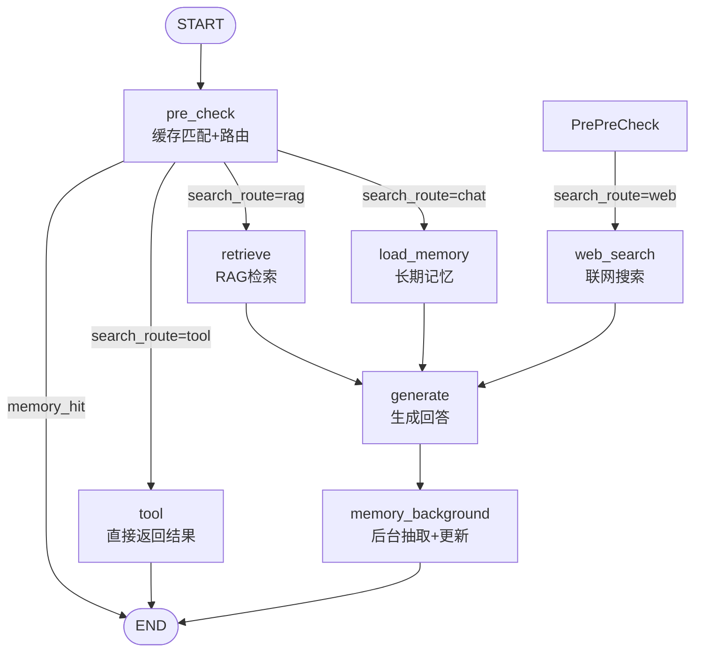
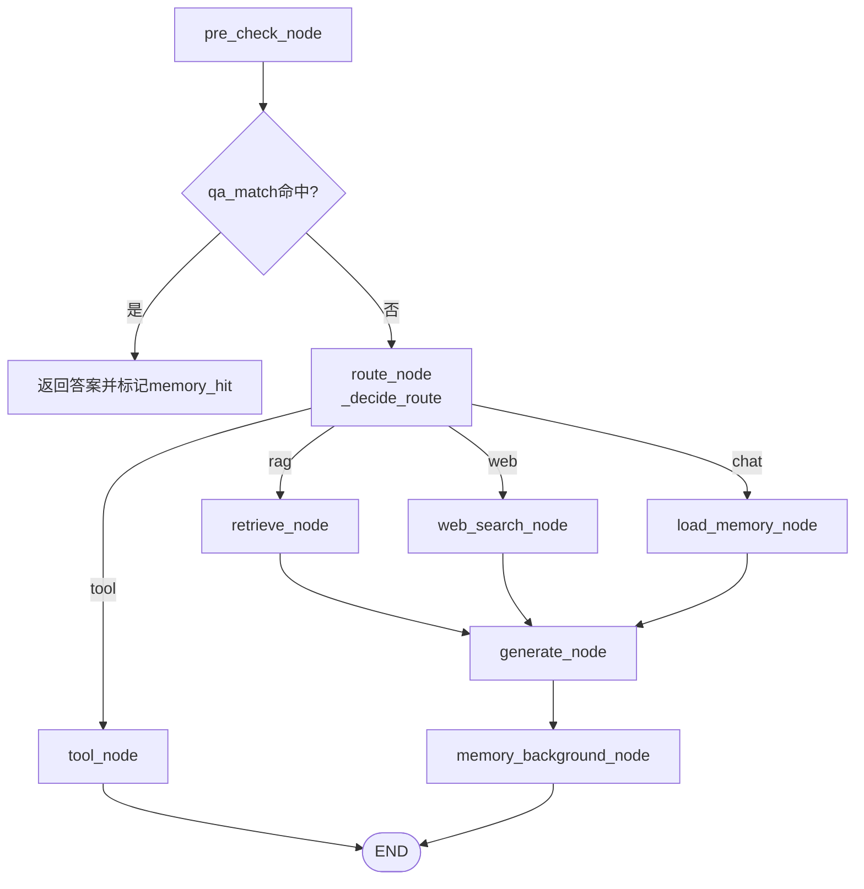
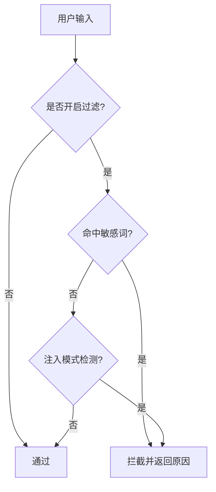
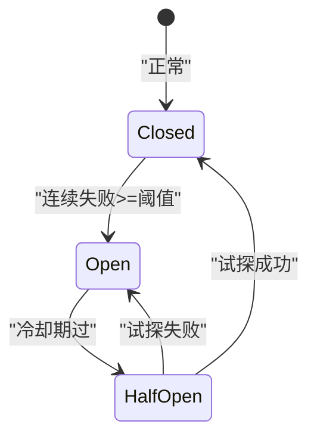
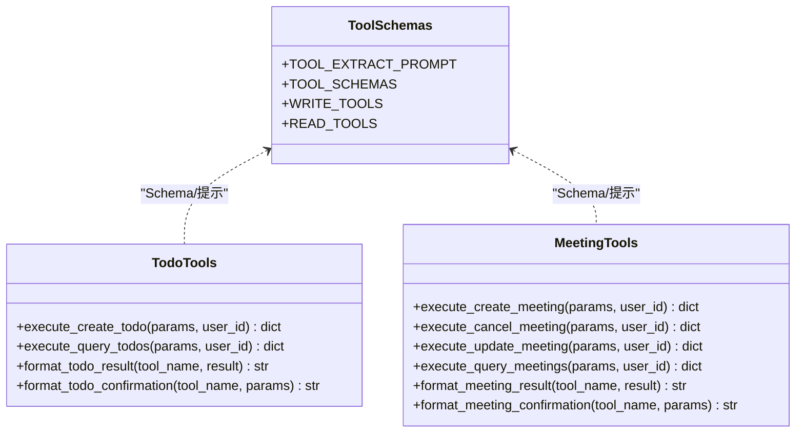
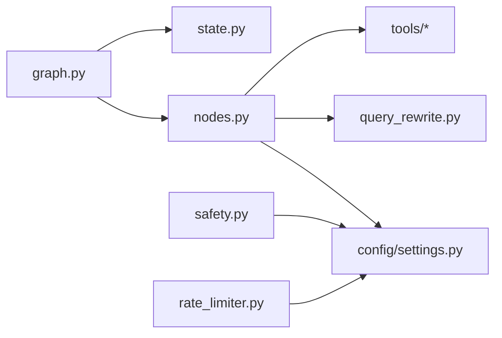

# Agent模块目录

<cite>
**本文引用的文件**
- [graph.py](file://agent/graph.py)
- [nodes.py](file://agent/nodes.py)
- [state.py](file://agent/state.py)
- [safety.py](file://agent/safety.py)
- [rate_limiter.py](file://agent/rate_limiter.py)
- [query_rewrite.py](file://agent/query_rewrite.py)
- [tool_schemas.py](file://agent/tools/tool_schemas.py)
- [todo_tools.py](file://agent/tools/todo_tools.py)
- [meeting_tools.py](file://agent/tools/meeting_tools.py)
- [settings.py](file://config/settings.py)
</cite>

## 目录
1. [简介](#简介)
2. [项目结构](#项目结构)
3. [核心组件](#核心组件)
4. [架构总览](#架构总览)
5. [详细组件分析](#详细组件分析)
6. [依赖关系分析](#依赖关系分析)
7. [性能与稳定性](#性能与稳定性)
8. [故障排查指南](#故障排查指南)
9. [结论](#结论)
10. [附录：配置选项与使用示例](#附录：配置选项与使用示例)

## 简介
本模块基于 LangGraph 的状态图编排智能体工作流，实现“预检查 + 四路分流（RAG/联网搜索/长期记忆/工具调用）+ 后台记忆更新”的完整链路。核心能力包括：
- 状态图与工作流编排
- 节点处理逻辑（路由、检索、生成、工具调用、记忆更新）
- 安全过滤（关键词黑名单、Prompt注入检测）
- 限流熔断（滑动窗口限流、熔断器）
- 查询改写（提升RAG召回率）
- 工具扩展（待办/会议等钉钉操作）

## 项目结构
agent 模块按职责划分清晰：
- graph.py：构建并编译 LangGraph 状态图，定义节点间边与条件分支，提供同步/异步流式调用入口
- nodes.py：实现各节点函数（预检查、路由、RAG检索、联网搜索、长期记忆加载、生成回答、后台记忆更新、工具调用）
- state.py：定义 AgentState 数据结构，作为状态图流转的数据契约
- safety.py：输入安全过滤（敏感词、Prompt注入）
- rate_limiter.py：限流器（按用户维度滑动窗口）与熔断器（连续失败触发）
- query_rewrite.py：用 LLM 将用户问题改写为更利于检索的形式
- tools/*：工具定义与执行器（待办、会议），包含参数提取提示、执行封装与结果格式化

图表来源
- [graph.py:44-102](file://agent/graph.py#L44-L102)
- [nodes.py:92-158](file://agent/nodes.py#L92-L158)
- [state.py:12-51](file://agent/state.py#L12-L51)
- [query_rewrite.py:26-59](file://agent/query_rewrite.py#L26-L59)
- [safety.py:35-68](file://agent/safety.py#L35-L68)
- [rate_limiter.py:22-147](file://agent/rate_limiter.py#L22-L147)
- [settings.py:19-216](file://config/settings.py#L19-L216)

章节来源
- [graph.py:44-102](file://agent/graph.py#L44-L102)
- [nodes.py:92-158](file://agent/nodes.py#L92-L158)
- [state.py:12-51](file://agent/state.py#L12-L51)
- [query_rewrite.py:26-59](file://agent/query_rewrite.py#L26-L59)
- [safety.py:35-68](file://agent/safety.py#L35-L68)
- [rate_limiter.py:22-147](file://agent/rate_limiter.py#L22-L147)
- [settings.py:19-216](file://config/settings.py#L19-L216)

## 核心组件
- 状态图构建与运行：build_graph/get_compiled_graph/chat/chat_stream/astream_chat
- 节点函数：pre_check_node、route_node、retrieve_node、web_search_node、load_memory_node、generate_node、memory_background_node、tool_node
- 状态数据：AgentState（消息历史、路由、上下文、答案、工具调用相关字段）
- 安全过滤：check_input（敏感词、注入模式）
- 限流熔断：check_rate_limit、CircuitBreaker（closed/open/half_open）
- 查询改写：rewrite_query（LLM改写，失败回退原始查询）
- 工具系统：tool_schemas（Schema与提取提示）、todo_tools、meeting_tools（执行与格式化）

章节来源
- [graph.py:44-139](file://agent/graph.py#L44-L139)
- [nodes.py:92-780](file://agent/nodes.py#L92-L780)
- [state.py:12-51](file://agent/state.py#L12-L51)
- [safety.py:35-68](file://agent/safety.py#L35-L68)
- [rate_limiter.py:22-147](file://agent/rate_limiter.py#L22-L147)
- [query_rewrite.py:26-59](file://agent/query_rewrite.py#L26-L59)
- [tool_schemas.py:8-121](file://agent/tools/tool_schemas.py#L8-L121)
- [todo_tools.py:18-84](file://agent/tools/todo_tools.py#L18-L84)
- [meeting_tools.py:17-225](file://agent/tools/meeting_tools.py#L17-L225)

## 架构总览
LangGraph 状态图工作流如下：
- START → pre_check（缓存命中短路；否则进行路由判断）
- 条件边：end（直接返回）、tool（工具调用后直接结束）、retrieve（RAG检索→generate）、web_search（联网搜索→generate）、load_memory（加载长期记忆→generate）
- generate → memory_background（后台抽取事实与更新摘要）→ END

图表来源
- [graph.py:44-102](file://agent/graph.py#L44-L102)
- [nodes.py:92-158](file://agent/nodes.py#L92-L158)
- [nodes.py:284-341](file://agent/nodes.py#L284-L341)
- [nodes.py:345-360](file://agent/nodes.py#L345-L360)
- [nodes.py:499-532](file://agent/nodes.py#L499-L532)
- [nodes.py:631-643](file://agent/nodes.py#L631-L643)

## 详细组件分析

### 状态图与工作流编排（graph.py）
- build_graph：注册节点、添加边与条件边、挂载 checkpointer（MemorySaver）以维护短期上下文
- get_compiled_graph：模块级单例，避免重复编译
- chat：同步调用，返回最终 answer
- chat_stream/astream_chat：双模式流（updates/messages），统一输出 node/token 事件，兼容 SSE/Web 场景

图表来源
- [graph.py:44-102](file://agent/graph.py#L44-L102)
- [graph.py:117-139](file://agent/graph.py#L117-L139)
- [graph.py:190-255](file://agent/graph.py#L190-L255)

章节来源
- [graph.py:44-139](file://agent/graph.py#L44-L139)
- [graph.py:190-255](file://agent/graph.py#L190-L255)

### 节点处理逻辑（nodes.py）
- pre_check_node：合并 qa_match_node 与 route_node；若 pending_confirmation 则优先处理确认流程
- route_node/_decide_route：LLM路由+关键词兜底；时效性问题优先走 web；短输入倾向闲聊；工具调用受开关控制
- retrieve_node：查询改写→多路召回+重排序→相关度阈值过滤→格式化上下文
- web_search_node：联网搜索并复用 rag_context 字段
- load_memory_node：加载长期记忆上下文与会话摘要
- generate_node：组装 system prompt + 历史消息（含更早对话摘要）+ 当前输入；主模型失败自动降级备用模型
- memory_background_node：顺序执行 extract_facts_node 与 memory_update_node；时效性问题不写长期记忆
- tool_node：LLM提取工具名与参数→读操作直接执行→写操作需确认→执行并格式化结果

图表来源
- [nodes.py:92-158](file://agent/nodes.py#L92-L158)
- [nodes.py:232-281](file://agent/nodes.py#L232-L281)
- [nodes.py:284-341](file://agent/nodes.py#L284-L341)
- [nodes.py:345-360](file://agent/nodes.py#L345-L360)
- [nodes.py:499-532](file://agent/nodes.py#L499-L532)
- [nodes.py:631-643](file://agent/nodes.py#L631-L643)
- [nodes.py:647-780](file://agent/nodes.py#L647-L780)

章节来源
- [nodes.py:92-158](file://agent/nodes.py#L92-L158)
- [nodes.py:232-281](file://agent/nodes.py#L232-L281)
- [nodes.py:284-341](file://agent/nodes.py#L284-L341)
- [nodes.py:345-360](file://agent/nodes.py#L345-L360)
- [nodes.py:499-532](file://agent/nodes.py#L499-L532)
- [nodes.py:631-643](file://agent/nodes.py#L631-L643)
- [nodes.py:647-780](file://agent/nodes.py#L647-L780)

### 安全过滤（safety.py）
- check_input：根据配置决定是否开启；检测敏感词与常见 Prompt 注入模式；被拒绝的输入不进入 Agent 链路

图表来源
- [safety.py:35-68](file://agent/safety.py#L35-L68)
- [settings.py:135-141](file://config/settings.py#L135-L141)

章节来源
- [safety.py:35-68](file://agent/safety.py#L35-L68)
- [settings.py:135-141](file://config/settings.py#L135-L141)

### 限流熔断（rate_limiter.py）
- 滑动窗口限流：按 user_id 维度每分钟请求数上限；默认关闭（阈值<=0）
- 熔断器：连续失败达阈值进入 open；冷却期过后进入 half_open 试探一次；成功恢复 closed，失败继续 open

图表来源
- [rate_limiter.py:22-47](file://agent/rate_limiter.py#L22-L47)
- [rate_limiter.py:51-147](file://agent/rate_limiter.py#L51-L147)
- [settings.py:143-149](file://config/settings.py#L143-L149)

章节来源
- [rate_limiter.py:22-47](file://agent/rate_limiter.py#L22-L47)
- [rate_limiter.py:51-147](file://agent/rate_limiter.py#L51-L147)
- [settings.py:143-149](file://config/settings.py#L143-L149)

### 查询改写（query_rewrite.py）
- rewrite_query：开启时通过 LLM 将用户问题改写为更利于检索的形式；过短查询不触发改写；失败静默回退原始查询

章节来源
- [query_rewrite.py:26-59](file://agent/query_rewrite.py#L26-L59)
- [settings.py:91-93](file://config/settings.py#L91-L93)

### 工具系统（tools/*）
- tool_schemas.py：定义工具名称、描述、参数结构与提取提示；区分读写操作
- todo_tools.py：创建/查询待办，结果格式化与确认消息
- meeting_tools.py：创建/取消/修改/查询会议，参会人解析与时间处理，结果格式化与确认消息

图表来源
- [tool_schemas.py:8-121](file://agent/tools/tool_schemas.py#L8-L121)
- [todo_tools.py:18-84](file://agent/tools/todo_tools.py#L18-L84)
- [meeting_tools.py:17-225](file://agent/tools/meeting_tools.py#L17-L225)

章节来源
- [tool_schemas.py:8-121](file://agent/tools/tool_schemas.py#L8-L121)
- [todo_tools.py:18-84](file://agent/tools/todo_tools.py#L18-L84)
- [meeting_tools.py:17-225](file://agent/tools/meeting_tools.py#L17-L225)

## 依赖关系分析
- graph.py 依赖 nodes.py 中的节点函数与 state.py 的 AgentState
- nodes.py 依赖 config/settings.py 获取配置，依赖 agent.query_rewrite、agent.tools 以及 memory/rag 子系统
- safety.py 与 rate_limiter.py 均依赖 settings.py 的配置开关
- tools/* 通过动态导入 dingtalk_lib 完成实际 API 调用

图表来源
- [graph.py:31-41](file://agent/graph.py#L31-L41)
- [nodes.py:13-20](file://agent/nodes.py#L13-L20)
- [safety.py:45-68](file://agent/safety.py#L45-L68)
- [rate_limiter.py:31-47](file://agent/rate_limiter.py#L31-L47)

章节来源
- [graph.py:31-41](file://agent/graph.py#L31-L41)
- [nodes.py:13-20](file://agent/nodes.py#L13-L20)
- [safety.py:45-68](file://agent/safety.py#L45-L68)
- [rate_limiter.py:31-47](file://agent/rate_limiter.py#L31-L47)

## 性能与稳定性
- 缓存短路：问答记忆命中直接返回，跳过整条生成链路，显著降低延迟
- 后台记忆更新：extract_facts + memory_update 在后台线程执行，不阻塞响应
- 工具调用直出：tool 节点直接返回结果，无需经过 generate
- 模型降级：主模型失败自动尝试备用模型列表，提高可用性
- 限流熔断：保护后端服务，防止雪崩；半开试探快速恢复
- 检索优化：查询改写、多路召回、重排序、相关度阈值过滤，平衡召回与精度

[本节为通用指导，不直接分析具体文件]

## 故障排查指南
- 路由异常：检查 _decide_route 的关键词与 LLM 路由；查看日志中“路由失败，使用关键词兜底”
- 检索为空：确认 retrieve_node 的 rerank/BM25 开关与 rag_min_relevance；检查向量库与文档目录
- 生成失败：查看 generate_node 的主模型错误与备用模型尝试；调整 llm_max_retries 与超时
- 工具调用失败：检查 tool_node 的参数提取与 _execute_tool 的错误信息；确认 dingtalk_lib 可用
- 安全拦截：检查 input_filter_enabled 与敏感词列表；确认注入检测策略
- 限流/熔断：检查 rate_limit_per_minute 与 circuit_breaker_threshold；观察熔断状态与健康检查

章节来源
- [nodes.py:154-211](file://agent/nodes.py#L154-L211)
- [nodes.py:284-341](file://agent/nodes.py#L284-L341)
- [nodes.py:499-532](file://agent/nodes.py#L499-L532)
- [nodes.py:647-780](file://agent/nodes.py#L647-L780)
- [safety.py:35-68](file://agent/safety.py#L35-L68)
- [rate_limiter.py:22-147](file://agent/rate_limiter.py#L22-L147)

## 结论
agent 模块通过 LangGraph 状态图实现了高内聚、低耦合的智能体工作流：预检查短路、四路分流、后台记忆更新、工具调用与安全限流熔断共同保障了系统的性能与稳定性。开发者可基于现有节点与工具扩展新的能力，并通过配置项灵活调整行为。

[本节为总结性内容，不直接分析具体文件]

## 附录：配置选项与使用示例

### 关键配置项（部分）
- 大语言模型：llm_model、llm_base_url、llm_api_key、llm_temperature、llm_max_retries、llm_request_timeout、llm_fallback_models
- RAG：rag_bm25_enabled、rag_rrf_k、rag_query_rewrite_enabled、rerank_enabled、rag_top_k、rag_min_relevance
- 联网搜索：web_search_enabled、web_search_max_results、web_search_timeout
- 记忆：memory_summary_every、memory_short_window、memory_history_budget、memory_qa_cache_enabled、memory_qa_threshold、memory_qa_max_records
- 安全过滤：input_filter_enabled、input_blocked_keywords、input_injection_check_enabled
- 限流熔断：rate_limit_per_minute、circuit_breaker_threshold、circuit_breaker_recovery
- 工具调用：tool_calling_enabled、tool_confirmation_required

章节来源
- [settings.py:29-155](file://config/settings.py#L29-L155)

### 使用示例
- 同步调用：调用 graph.chat(user_input, user_id, session_id) 获取最终答案
- 流式调用：调用 graph.chat_stream 或 astream_chat，逐 token 产出，适合 SSE/Web 场景
- 工具调用：确保 tool_calling_enabled=true；写操作默认需要用户确认（tool_confirmation_required=true）
- 安全与限流：启用 input_filter_enabled 与 rate_limit_per_minute/circuit_breaker_threshold 以提升安全性与稳定性

章节来源
- [graph.py:117-139](file://agent/graph.py#L117-L139)
- [graph.py:190-255](file://agent/graph.py#L190-L255)
- [nodes.py:647-780](file://agent/nodes.py#L647-L780)
- [settings.py:135-155](file://config/settings.py#L135-L155)