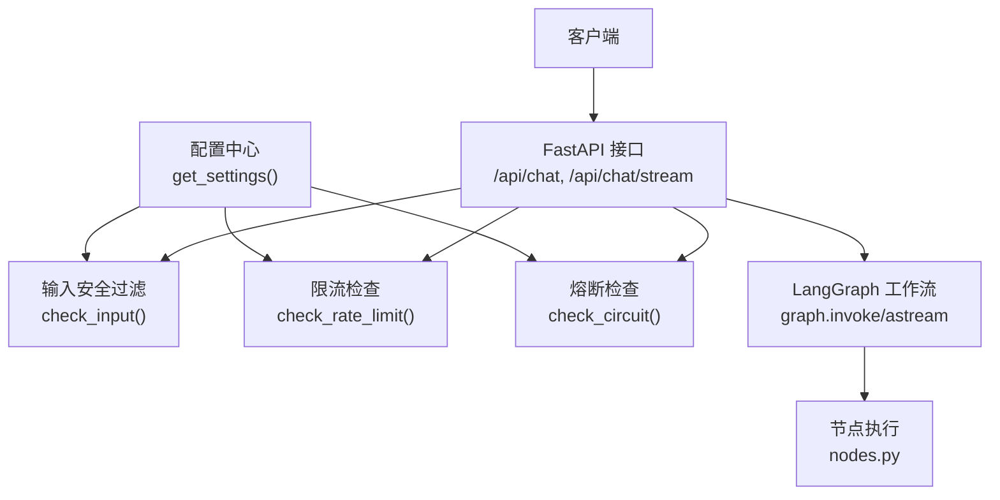
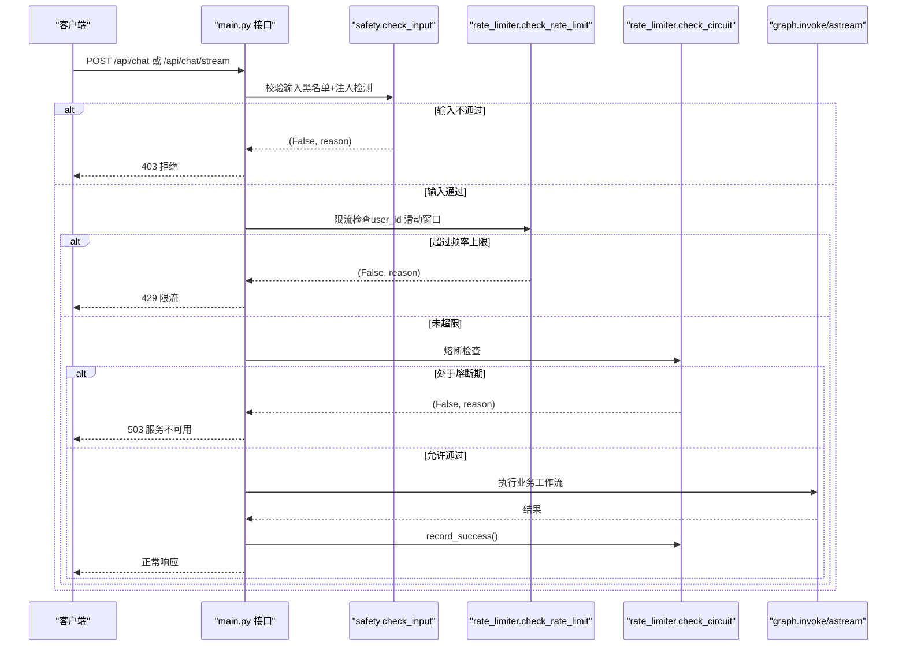
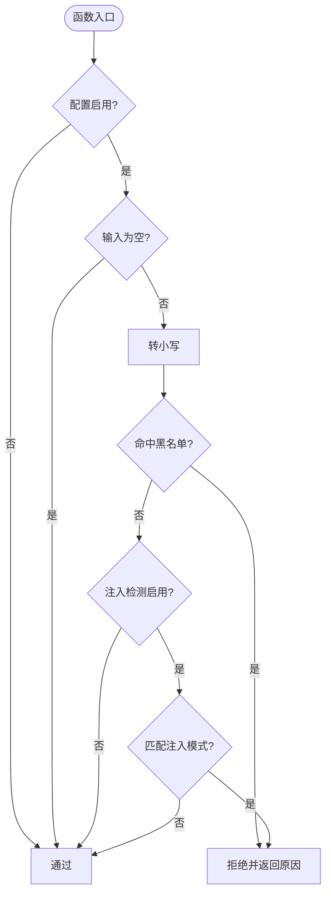
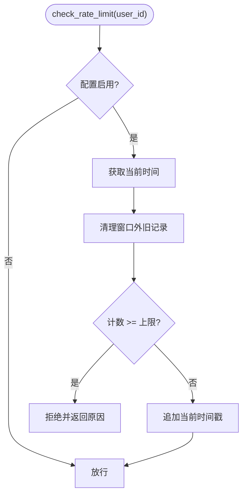
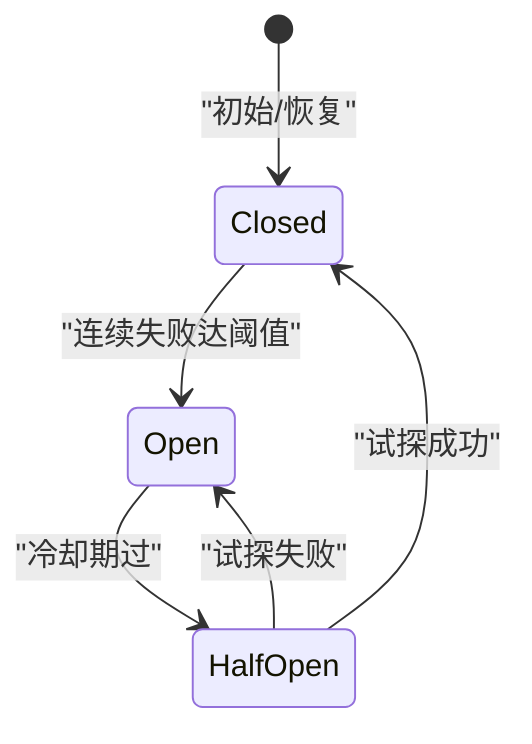
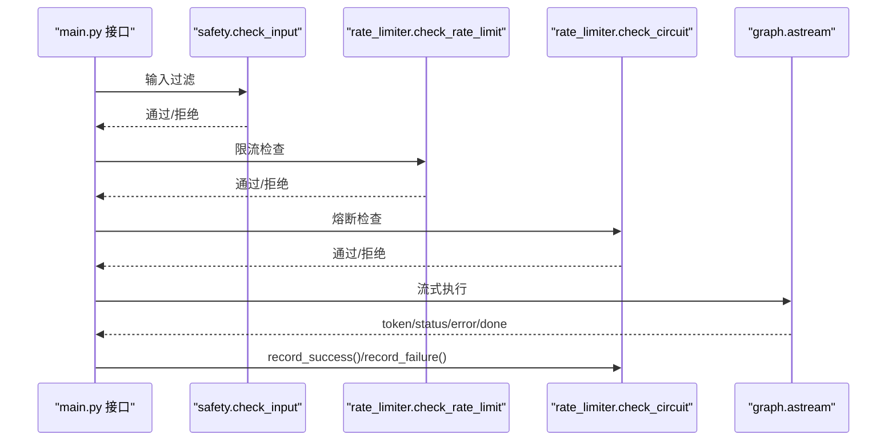
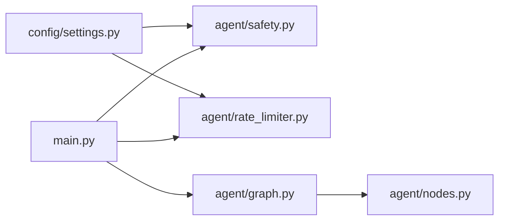

# 安全防护系统

<cite>
**本文引用的文件**
- [agent/safety.py](file://agent/safety.py)
- [agent/rate_limiter.py](file://agent/rate_limiter.py)
- [config/settings.py](file://config/settings.py)
- [main.py](file://main.py)
- [agent/graph.py](file://agent/graph.py)
- [agent/nodes.py](file://agent/nodes.py)
</cite>

## 目录
1. [简介](#简介)
2. [项目结构](#项目结构)
3. [核心组件](#核心组件)
4. [架构总览](#架构总览)
5. [详细组件分析](#详细组件分析)
6. [依赖关系分析](#依赖关系分析)
7. [性能与资源监控](#性能与资源监控)
8. [故障排查指南](#故障排查指南)
9. [结论](#结论)
10. [附录：安全策略定制指南](#附录：安全策略定制指南)

## 简介
本章节概述 Agent 模块的安全防护体系，涵盖输入过滤、恶意检测、请求限流与熔断等机制。系统通过配置开关与阈值控制，提供可插拔的安全策略，确保在异常流量或外部服务不稳定时仍能保持可用性与稳定性。

## 项目结构
Agent 安全相关代码主要分布在以下文件：
- 输入安全过滤：agent/safety.py
- 限流与熔断：agent/rate_limiter.py
- 全局配置（含安全开关与阈值）：config/settings.py
- 接口集成与安全拦截点：main.py
- 工作流编排（供参考）：agent/graph.py、agent/nodes.py

图表来源
- [main.py:160-210](file://main.py#L160-L210)
- [main.py:228-314](file://main.py#L228-L314)
- [agent/safety.py:35-68](file://agent/safety.py#L35-L68)
- [agent/rate_limiter.py:22-47](file://agent/rate_limiter.py#L22-L47)
- [agent/rate_limiter.py:51-147](file://agent/rate_limiter.py#L51-L147)
- [config/settings.py:135-149](file://config/settings.py#L135-L149)

章节来源
- [main.py:160-210](file://main.py#L160-L210)
- [main.py:228-314](file://main.py#L228-L314)
- [agent/safety.py:35-68](file://agent/safety.py#L35-L68)
- [agent/rate_limiter.py:22-47](file://agent/rate_limiter.py#L22-L47)
- [agent/rate_limiter.py:51-147](file://agent/rate_limiter.py#L51-L147)
- [config/settings.py:135-149](file://config/settings.py#L135-L149)

## 核心组件
- 输入安全过滤：基于关键词黑名单与 prompt 注入模式匹配，默认关闭，需显式开启。
- 请求频率限制：按 user_id 维度的滑动窗口限流，默认关闭。
- 熔断器：连续失败达到阈值后进入熔断状态，冷却期过后半开试探，成功恢复、失败继续熔断。
- 配置管理：统一从环境变量/.env 加载，支持布尔开关与数值阈值。

章节来源
- [agent/safety.py:35-68](file://agent/safety.py#L35-L68)
- [agent/rate_limiter.py:22-47](file://agent/rate_limiter.py#L22-L47)
- [agent/rate_limiter.py:51-147](file://agent/rate_limiter.py#L51-L147)
- [config/settings.py:135-149](file://config/settings.py#L135-L149)

## 架构总览
安全拦截在接口层前置执行，顺序为：输入安全过滤 → 限流检查 → 熔断检查 → 工作流执行。任一环节拒绝则直接返回错误响应；工作流执行成功后记录成功，异常时记录失败以驱动熔断。

图表来源
- [main.py:160-210](file://main.py#L160-L210)
- [main.py:228-314](file://main.py#L228-L314)
- [agent/safety.py:35-68](file://agent/safety.py#L35-L68)
- [agent/rate_limiter.py:22-47](file://agent/rate_limiter.py#L22-L47)
- [agent/rate_limiter.py:51-147](file://agent/rate_limiter.py#L51-L147)

## 详细组件分析

### 输入安全过滤（敏感词与 Prompt 注入）
- 功能要点：
  - 关键词黑名单：命中即拒绝，避免回显敏感词以防枚举探测。
  - Prompt 注入检测：匹配常见“忽略以上指令”等中英文注入模式。
  - 默认关闭，需在配置中启用。
- 实现要点：
  - 小写化文本进行子串匹配。
  - 空输入视为通过。
  - 读取配置项决定是否启用及是否开启注入检测。

图表来源
- [agent/safety.py:35-68](file://agent/safety.py#L35-L68)
- [config/settings.py:135-141](file://config/settings.py#L135-L141)

章节来源
- [agent/safety.py:35-68](file://agent/safety.py#L35-L68)
- [config/settings.py:135-141](file://config/settings.py#L135-L141)

### 请求频率限制（滑动窗口）
- 功能要点：
  - 按 user_id 维度统计最近 60 秒内的请求次数。
  - 超过配置的每分钟上限则拒绝。
  - 默认关闭（阈值 <= 0）。
- 实现要点：
  - 使用 deque 维护时间戳队列，清理过期记录。
  - 线程锁保证并发安全。

图表来源
- [agent/rate_limiter.py:22-47](file://agent/rate_limiter.py#L22-L47)
- [config/settings.py:144-145](file://config/settings.py#L144-L145)

章节来源
- [agent/rate_limiter.py:22-47](file://agent/rate_limiter.py#L22-L47)
- [config/settings.py:144-145](file://config/settings.py#L144-L145)

### 熔断器（Closed/Open/Half-Open）
- 功能要点：
  - 连续失败达到阈值后进入熔断（open），拒绝所有请求。
  - 冷却期过后进入半开（half_open），放行一次试探。
  - 试探成功恢复（closed），失败继续熔断。
  - 默认关闭（阈值 <= 0）。
- 实现要点：
  - 记录失败次数与最后失败时间。
  - 线程锁保护状态变更。
  - 便捷方法封装 check_circuit、record_success、record_failure。

图表来源
- [agent/rate_limiter.py:51-147](file://agent/rate_limiter.py#L51-L147)
- [config/settings.py:146-149](file://config/settings.py#L146-L149)

章节来源
- [agent/rate_limiter.py:51-147](file://agent/rate_limiter.py#L51-L147)
- [config/settings.py:146-149](file://config/settings.py#L146-L149)

### 接口集成与安全拦截点
- 同步接口：
  - 先执行输入安全过滤，再限流，再熔断，然后调用工作流。
  - 成功记录 success，异常记录 failure。
- 流式接口：
  - 同样前置安全与限流熔断检查。
  - 整体超时保护：到达超时时间停止拉取，返回已生成 token。
  - 正常完成或部分生成后记为成功；异常记为失败。

图表来源
- [main.py:160-210](file://main.py#L160-L210)
- [main.py:228-314](file://main.py#L228-L314)

章节来源
- [main.py:160-210](file://main.py#L160-L210)
- [main.py:228-314](file://main.py#L228-L314)

### 工作流与节点（参考）
- 工作流由 LangGraph 构建，包含预检查、路由、检索、联网搜索、记忆加载、生成、后台记忆更新等节点。
- 安全机制在工作流之外前置拦截，不影响内部节点逻辑。

章节来源
- [agent/graph.py:44-102](file://agent/graph.py#L44-L102)
- [agent/nodes.py:93-151](file://agent/nodes.py#L93-L151)

## 依赖关系分析
- 配置依赖：
  - safety 与 rate_limiter 均通过 get_settings() 读取开关与阈值。
- 接口依赖：
  - main.py 在两个接口中统一集成安全与限流熔断。
- 工作流依赖：
  - graph 与 nodes 负责业务处理，安全机制在其前侧保障。

图表来源
- [config/settings.py:135-149](file://config/settings.py#L135-L149)
- [agent/safety.py:35-68](file://agent/safety.py#L35-L68)
- [agent/rate_limiter.py:22-47](file://agent/rate_limiter.py#L22-L47)
- [main.py:160-210](file://main.py#L160-L210)
- [main.py:228-314](file://main.py#L228-L314)
- [agent/graph.py:44-102](file://agent/graph.py#L44-L102)
- [agent/nodes.py:93-151](file://agent/nodes.py#L93-L151)

章节来源
- [config/settings.py:135-149](file://config/settings.py#L135-L149)
- [agent/safety.py:35-68](file://agent/safety.py#L35-L68)
- [agent/rate_limiter.py:22-47](file://agent/rate_limiter.py#L22-L47)
- [main.py:160-210](file://main.py#L160-L210)
- [main.py:228-314](file://main.py#L228-L314)
- [agent/graph.py:44-102](file://agent/graph.py#L44-L102)
- [agent/nodes.py:93-151](file://agent/nodes.py#L93-L151)

## 性能与资源监控
- 限流与熔断均为轻量级内存数据结构（deque、计数器），开销低。
- 流式接口具备整体超时保护，防止连接长时间占用资源。
- 日志输出：
  - 熔断状态变化会记录 info/warning 日志，便于观察。
  - 接口异常会记录 error 日志，便于定位问题。

章节来源
- [agent/rate_limiter.py:67-94](file://agent/rate_limiter.py#L67-L94)
- [main.py:203-209](file://main.py#L203-L209)
- [main.py:291-304](file://main.py#L291-L304)

## 故障排查指南
- 常见问题与定位：
  - 输入被误拦：检查黑名单配置与注入检测开关，必要时调整阈值或白名单。
  - 频繁限流：调高 rate_limit_per_minute 或优化客户端重试策略。
  - 服务不可用（503）：检查熔断阈值与冷却时间，确认下游 LLM 可用性。
  - 流式超时：调整 stream_timeout，关注网络与模型响应延迟。
- 日志关键字：
  - "[circuit_breaker]"：熔断状态变化。
  - "[stream] 整体超时"：流式超时告警。
  - "Web 聊天调用失败/流式聊天调用失败"：接口异常堆栈。

章节来源
- [agent/rate_limiter.py:67-94](file://agent/rate_limiter.py#L67-L94)
- [main.py:203-209](file://main.py#L203-L209)
- [main.py:291-304](file://main.py#L291-L304)

## 结论
该安全防护系统通过输入过滤、限流与熔断三重保障，有效抵御恶意输入与异常流量，并在外部服务不稳定时快速降级，保障服务可用性与用户体验。所有策略均可通过配置灵活开关与调整阈值，满足多样化部署需求。

## 附录：安全策略定制指南

### 安全配置选项与阈值
- 输入安全过滤：
  - input_filter_enabled：是否启用输入过滤（默认 False）。
  - input_blocked_keywords：敏感词黑名单（逗号分隔）。
  - input_injection_check_enabled：是否启用注入检测（默认 True）。
- 限流与熔断：
  - rate_limit_per_minute：每用户每分钟最大请求数（<=0 不限流）。
  - circuit_breaker_threshold：连续失败阈值（<=0 不熔断）。
  - circuit_breaker_recovery：熔断恢复冷却时间（秒）。

章节来源
- [config/settings.py:135-149](file://config/settings.py#L135-L149)

### 自定义过滤器开发
- 扩展黑名单：
  - 在 input_blocked_keywords 中添加新词，系统将自动解析为列表并用于匹配。
- 扩展注入模式：
  - 可在 _INJECTION_PATTERNS 中添加新的中英文注入模式，注意避免误拦正常问句。
- 接入点：
  - 在 check_input 中增加新的检测规则，遵循“小写化 + 子串匹配”的通用模式。

章节来源
- [agent/safety.py:11-32](file://agent/safety.py#L11-L32)
- [agent/safety.py:35-68](file://agent/safety.py#L35-L68)
- [config/settings.py:173-176](file://config/settings.py#L173-L176)

### 限流规则配置
- 单用户限流：
  - 设置 rate_limit_per_minute > 0 启用，根据业务峰值与成本设定合理值。
- 多用户隔离：
  - 限流按 user_id 维度独立统计，适合多租户场景。
- 建议：
  - 结合客户端重试策略与指数退避，避免雪崩。
  - 配合熔断阈值，防止下游抖动放大影响。

章节来源
- [agent/rate_limiter.py:22-47](file://agent/rate_limiter.py#L22-L47)
- [config/settings.py:144-145](file://config/settings.py#L144-L145)

### 熔断策略配置
- 阈值与冷却：
  - circuit_breaker_threshold：根据下游稳定性设置，过小易误触发，过大则保护不足。
  - circuit_breaker_recovery：根据下游恢复时间设置，通常 30-120 秒。
- 观测与告警：
  - 关注 "[circuit_breaker]" 日志，结合监控系统对 open/half_open 状态变化告警。
- 建议：
  - 与限流配合使用，先限流降载，再熔断保护。
  - 对关键路径（如 LLM 调用）优先启用熔断。

章节来源
- [agent/rate_limiter.py:51-147](file://agent/rate_limiter.py#L51-L147)
- [config/settings.py:146-149](file://config/settings.py#L146-L149)