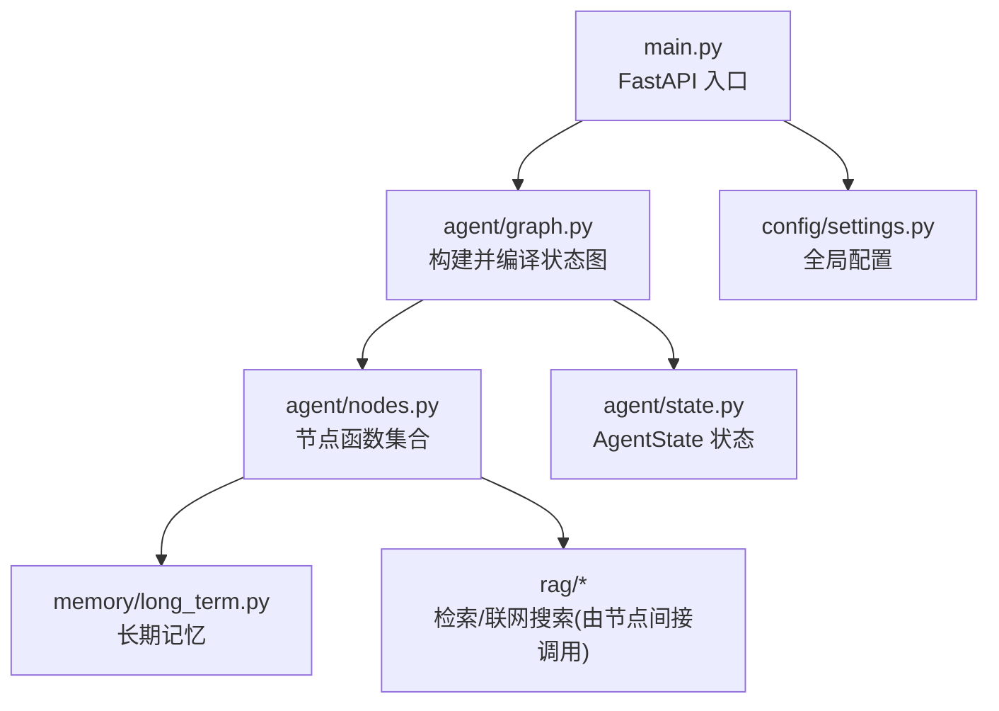
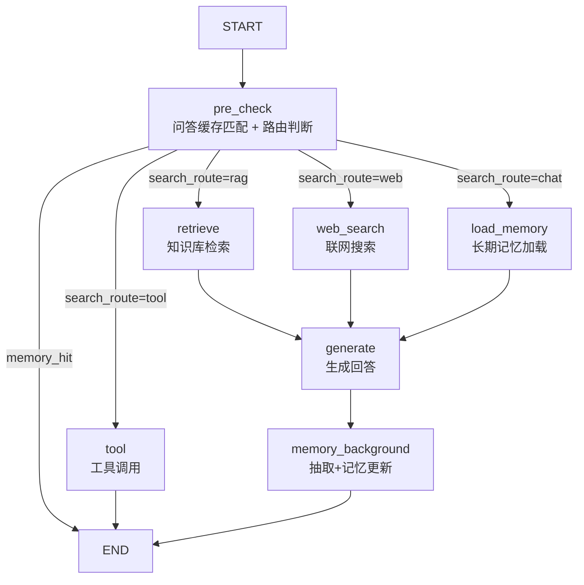
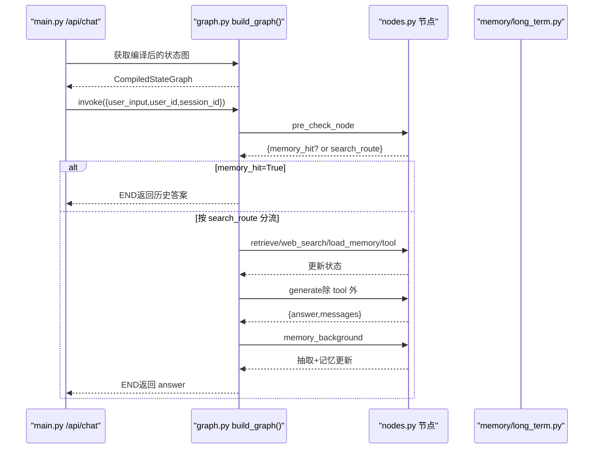
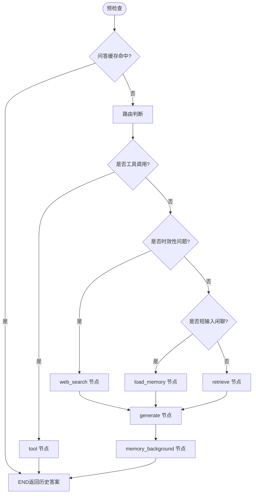
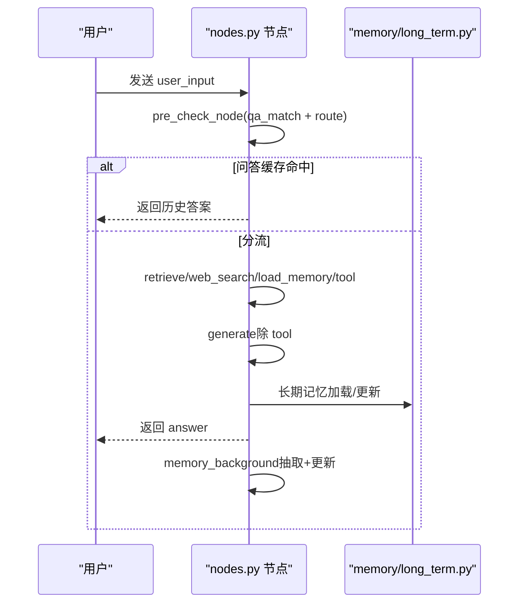
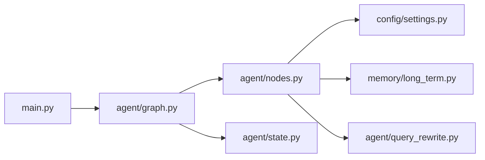

# 工作流编排系统

<cite>
**本文引用的文件**
- [agent/graph.py](file://agent/graph.py)
- [agent/state.py](file://agent/state.py)
- [agent/nodes.py](file://agent/nodes.py)
- [main.py](file://main.py)
- [config/settings.py](file://config/settings.py)
- [memory/long_term.py](file://memory/long_term.py)
- [agent/query_rewrite.py](file://agent/query_rewrite.py)
</cite>

## 目录
1. [简介](#简介)
2. [项目结构](#项目结构)
3. [核心组件](#核心组件)
4. [架构总览](#架构总览)
5. [详细组件分析](#详细组件分析)
6. [依赖关系分析](#依赖关系分析)
7. [性能考量](#性能考量)
8. [故障排查指南](#故障排查指南)
9. [结论](#结论)
10. [附录](#附录)

## 简介
本章节面向开发者，系统性说明 Agent 模块基于 LangGraph 的工作流编排系统。重点包括：
- 状态图构建与节点连接关系
- 四路分流机制（知识库检索、联网搜索、长期记忆、工具调用）
- 数据流转逻辑与错误处理策略
- 状态定义、转换条件与执行流程示例

该工作流以“预检查 + 四路分流 + 后台记忆”为主线，结合问答缓存命中短路、流式输出、模型降级与熔断限流等工程化能力，实现高可用、低延迟的智能体响应。

## 项目结构
Agent 模块围绕 LangGraph 的 StateGraph 组织代码：
- graph.py：负责构建并编译状态图、注册节点、添加边与条件边、提供同步/异步流式入口
- state.py：定义 AgentState 状态结构（消息历史、路由结果、上下文、工具参数等）
- nodes.py：实现各节点函数（预检查、路由、检索、联网搜索、长期记忆加载、生成、后台记忆更新、工具调用）
- main.py：FastAPI 服务入口，集成安全校验、限流熔断、SSE 流式接口
- config/settings.py：全局配置（LLM、RAG、记忆、工具调用开关等）
- memory/long_term.py：长期记忆持久化（SQLite），含摘要、画像、事实、会话压缩、问答缓存
- agent/query_rewrite.py：查询改写，提升 RAG 召回率

**图表来源**
- [main.py:154-210](file://main.py#L154-L210)
- [agent/graph.py:44-102](file://agent/graph.py#L44-L102)
- [agent/nodes.py:93-151](file://agent/nodes.py#L93-L151)
- [agent/state.py:12-51](file://agent/state.py#L12-L51)
- [memory/long_term.py:1-16](file://memory/long_term.py#L1-L16)
- [config/settings.py:19-156](file://config/settings.py#L19-L156)

**章节来源**
- [agent/graph.py:1-24](file://agent/graph.py#L1-L24)
- [agent/state.py:1-54](file://agent/state.py#L1-L54)
- [agent/nodes.py:1-21](file://agent/nodes.py#L1-L21)
- [main.py:1-12](file://main.py#L1-L12)

## 核心组件
- 状态图构建器：在 graph.py 中通过 StateGraph(AgentState) 注册节点、添加边与条件边，并可选挂载 checkpointer（短期上下文按 thread_id 维护）
- 节点集合：nodes.py 中的 pre_check_node、route_node、retrieve_node、web_search_node、load_memory_node、generate_node、memory_background_node、tool_node 等
- 状态定义：state.py 中的 AgentState TypedDict，包含消息历史、路由结果、上下文、工具参数等字段
- 配置中心：settings.py 提供 LLM、RAG、记忆、工具调用等开关与阈值
- 长期记忆：long_term.py 提供分层结构化记忆、摘要合并、问答缓存、会话压缩等能力
- 查询改写：query_rewrite.py 将用户问题改写为更利于检索的形式

**章节来源**
- [agent/graph.py:44-102](file://agent/graph.py#L44-L102)
- [agent/nodes.py:93-151](file://agent/nodes.py#L93-L151)
- [agent/state.py:12-51](file://agent/state.py#L12-L51)
- [config/settings.py:19-156](file://config/settings.py#L19-L156)
- [memory/long_term.py:1-16](file://memory/long_term.py#L1-L16)
- [agent/query_rewrite.py:1-59](file://agent/query_rewrite.py#L1-L59)

## 架构总览
整体工作流遵循“预检查 + 四路分流 + 后台记忆”的模式：
- START → pre_check（问答缓存匹配 + 路由判断）
  - 若问答缓存命中 → END（直接复用历史答案）
  - 否则按 search_route 分流：
    - tool → 工具调用 → END（不经过 generate）
    - rag → retrieve → generate
    - web → web_search → generate
    - chat → load_memory → generate
- generate → memory_background（抽取+记忆更新，后台执行）→ END

**图表来源**
- [agent/graph.py:44-102](file://agent/graph.py#L44-L102)
- [agent/nodes.py:93-151](file://agent/nodes.py#L93-L151)

**章节来源**
- [agent/graph.py:1-24](file://agent/graph.py#L1-L24)
- [agent/nodes.py:93-151](file://agent/nodes.py#L93-L151)

## 详细组件分析

### 状态定义（AgentState）
AgentState 是 LangGraph 状态图的共享状态载体，关键字段包括：
- messages：带 reducer 的消息历史，自动累加多轮对话
- user_input/user_id/session_id：当前输入与标识
- search_route：路由结果（"rag"/"web"/"chat"/"tool"）
- rag_context：RAG 或联网搜索结果上下文
- long_term_context：长期记忆上下文（画像/事实/摘要）
- session_summary：会话压缩摘要（短期记忆超窗后的更早对话摘要）
- memory_hit：问答缓存命中标志（命中则短路到 END）
- query_embedding：当前问题向量（供问答对落库复用）
- answer：最终生成的回答
- 工具相关：tool_name、tool_params、tool_result、pending_confirmation、confirmation_context

这些字段在各节点中被读取与更新，驱动状态流转。

**章节来源**
- [agent/state.py:12-51](file://agent/state.py#L12-L51)

### 状态图构建与编译
- 使用 StateGraph(AgentState) 创建图实例
- 注册节点：pre_check、load_memory、retrieve、web_search、tool、generate、memory_background
- 添加线性边：load_memory→generate、retrieve→generate、web_search→generate、tool→END、generate→memory_background→END
- 添加条件边：pre_check 根据 memory_hit 与 search_route 分流至 end/tool/retrieve/web_search/load_memory/generate
- 可选挂载 checkpointer（MemorySaver），按 thread_id 维护短期上下文
- 提供 get_compiled_graph() 单例与 chat/chat_stream/astream_chat 便捷入口

**图表来源**
- [main.py:154-210](file://main.py#L154-L210)
- [agent/graph.py:44-102](file://agent/graph.py#L44-L102)
- [agent/nodes.py:93-151](file://agent/nodes.py#L93-L151)
- [memory/long_term.py:532-633](file://memory/long_term.py#L532-L633)

**章节来源**
- [agent/graph.py:44-102](file://agent/graph.py#L44-L102)
- [main.py:154-210](file://main.py#L154-L210)

### 四路分流机制与路由策略
- 预检查节点同时执行问答缓存匹配与路由判断：
  - 问答缓存命中：设置 memory_hit=True 并返回历史答案，后续条件边短路到 END
  - 未命中：执行路由判断，写入 search_route
- 路由判断策略（_decide_route）：
  - 工具关键词优先短路（当 tool_calling_enabled 开启时）
  - 时效性问题（明确时间/天气）优先走联网搜索（当 web_search_enabled 开启时）
  - 短输入且不含疑问/搜索/工具词倾向于闲聊
  - 使用路由小模型进行意图识别；失败回退到关键词兜底
- 条件边分流：
  - tool → tool（直接返回结果，不经过 generate）
  - rag → retrieve → generate
  - web → web_search → generate
  - chat → load_memory → generate

**图表来源**
- [agent/nodes.py:93-212](file://agent/nodes.py#L93-L212)
- [agent/nodes.py:131-151](file://agent/nodes.py#L131-L151)

**章节来源**
- [agent/nodes.py:93-212](file://agent/nodes.py#L93-L212)
- [agent/nodes.py:131-151](file://agent/nodes.py#L131-L151)

### 数据流转逻辑
- 预检查阶段：
  - qa_match_node：向量化用户输入，检索问答记忆，命中则返回 answer 与 memory_hit=True，并注入消息历史
  - route_node：根据规则与小模型判断 search_route
- 分流阶段：
  - retrieve_node：查询改写（可选）→ 多路召回+重排序 → 相关度过滤 → 格式化上下文
  - web_search_node：联网搜索并格式化上下文
  - load_memory_node：从 SQLite 加载长期记忆上下文与会话压缩摘要
  - tool_node：LLM 提取工具名与参数 → 查询类直接执行 → 写操作需确认 → 格式化工具结果
- 生成阶段：
  - generate_node：组装 system prompt（含长期记忆与 RAG 上下文）、构建历史消息（窗口+预算+更早摘要）、主模型流式生成，失败时降级备用模型
- 后台阶段：
  - memory_background_node：顺序执行 extract_facts_node（规则快速路径 + 可选 LLM 抽取）与 memory_update_node（增量摘要、会话摘要刷新、问答缓存保存）

**图表来源**
- [agent/nodes.py:232-341](file://agent/nodes.py#L232-L341)
- [agent/nodes.py:344-643](file://agent/nodes.py#L344-L643)
- [memory/long_term.py:424-497](file://memory/long_term.py#L424-L497)

**章节来源**
- [agent/nodes.py:232-341](file://agent/nodes.py#L232-L341)
- [agent/nodes.py:344-643](file://agent/nodes.py#L344-L643)
- [memory/long_term.py:424-497](file://memory/long_term.py#L424-L497)

### 错误处理机制
- 路由失败：LLM 路由异常时回退到关键词兜底，确保链路不断
- 检索失败：retrieve_node 捕获异常并置空 rag_context，避免阻断主链路
- 联网搜索失败：web_search_node 捕获异常并记录日志，返回空上下文
- 生成失败：generate_node 主模型失败后依次尝试备用模型列表，全部失败返回错误提示
- 记忆更新失败：extract_facts_node 与 memory_update_node 内部独立 try/except，任一失败不影响另一者
- 工具调用失败：tool_node 捕获异常并返回错误信息，支持写操作确认流程
- 流式超时保护：main.py 的 SSE 接口设置整体超时，超时后返回已生成 token 并标记成功

**章节来源**
- [agent/nodes.py:180-212](file://agent/nodes.py#L180-L212)
- [agent/nodes.py:284-341](file://agent/nodes.py#L284-L341)
- [agent/nodes.py:467-497](file://agent/nodes.py#L467-L497)
- [agent/nodes.py:630-643](file://agent/nodes.py#L630-L643)
- [agent/nodes.py:693-746](file://agent/nodes.py#L693-L746)
- [main.py:228-314](file://main.py#L228-L314)

### 状态图构建过程与节点连接关系
- 节点注册：pre_check、load_memory、retrieve、web_search、tool、generate、memory_background
- 线性边：
  - load_memory → generate
  - retrieve → generate
  - web_search → generate
  - tool → END
  - generate → memory_background → END
- 条件边：
  - pre_check → end（memory_hit=True）
  - pre_check → tool（search_route="tool"）
  - pre_check → retrieve（search_route="rag"）
  - pre_check → web_search（search_route="web"）
  - pre_check → load_memory（search_route="chat"）
  - pre_check → generate（保留分支，未来可能直通）

**章节来源**
- [agent/graph.py:55-92](file://agent/graph.py#L55-L92)

### 转换条件与执行流程示例
- 转换条件：
  - memory_hit：问答缓存命中时短路到 END
  - search_route：决定分流目标（tool/rag/web/chat）
- 执行流程示例：
  - 示例一：用户问“今天北京天气如何？”
    - 预检查：非问答缓存命中，时效性问题 → web_search
    - 联网搜索：获取最新天气信息
    - 生成：结合上下文生成回答
    - 后台：不写入长期记忆（时效性问题跳过）
  - 示例二：用户说“帮我创建一个待办事项”
    - 预检查：工具关键词命中 → tool
    - 工具调用：LLM 提取参数 → 写操作需确认 → 确认后执行 → 返回结果
  - 示例三：用户问“公司报销流程是什么？”
    - 预检查：非时效性，非工具 → rag
    - 检索：查询改写 → 多路召回+重排序 → 相关度过滤
    - 生成：结合知识库上下文生成回答
    - 后台：抽取关键信息并更新长期记忆

**章节来源**
- [agent/nodes.py:131-151](file://agent/nodes.py#L131-L151)
- [agent/nodes.py:161-212](file://agent/nodes.py#L161-L212)
- [agent/nodes.py:232-341](file://agent/nodes.py#L232-L341)
- [agent/nodes.py:647-691](file://agent/nodes.py#L647-L691)

## 依赖关系分析
- graph.py 依赖 nodes.py 的节点函数与 state.py 的状态定义
- nodes.py 依赖 config/settings.py 的配置项与 memory/long_term.py 的记忆能力
- main.py 作为 FastAPI 入口，调用 graph.py 的状态图并提供 HTTP/SSE 接口
- 长期记忆模块提供分层结构化存储、摘要合并、问答缓存等功能
- 查询改写模块增强 RAG 检索召回率

**图表来源**
- [main.py:154-210](file://main.py#L154-L210)
- [agent/graph.py:44-102](file://agent/graph.py#L44-L102)
- [agent/nodes.py:93-151](file://agent/nodes.py#L93-L151)
- [config/settings.py:19-156](file://config/settings.py#L19-L156)
- [memory/long_term.py:1-16](file://memory/long_term.py#L1-L16)
- [agent/query_rewrite.py:1-59](file://agent/query_rewrite.py#L1-L59)

**章节来源**
- [agent/graph.py:44-102](file://agent/graph.py#L44-L102)
- [agent/nodes.py:93-151](file://agent/nodes.py#L93-L151)
- [main.py:154-210](file://main.py#L154-L210)

## 性能考量
- 问答缓存命中短路：避免重复 LLM 调用，显著降低延迟
- 后台记忆更新：抽取与摘要更新在后台执行，不阻塞主响应链路
- 流式输出：generate_node 使用流式生成，前端可实时展示 token
- 模型降级：主模型失败时自动尝试备用模型，提高可用性
- 启动预热：LLM 连接与向量库索引在启动时预热，减少首请求延迟
- 限流与熔断：按用户维度限流，连续失败触发熔断，保护后端资源

[本节为通用性能讨论，无需特定文件引用]

## 故障排查指南
- 路由失败：检查 _decide_route 的关键词与小模型调用，查看日志中的路由降级信息
- 检索失败：确认 retrieve_node 的异常捕获与 rag_context 是否为空
- 联网搜索失败：检查 web_search_node 的异常处理与搜索结果是否为空
- 生成失败：查看 generate_node 的备用模型尝试日志与错误汇总
- 记忆更新失败：确认 extract_facts_node 与 memory_update_node 的异常捕获
- 工具调用失败：检查 tool_node 的参数提取与执行结果，确认写操作确认流程
- 流式超时：查看 main.py 的 SSE 接口超时处理与已生成内容返回

**章节来源**
- [agent/nodes.py:180-212](file://agent/nodes.py#L180-L212)
- [agent/nodes.py:284-341](file://agent/nodes.py#L284-L341)
- [agent/nodes.py:467-497](file://agent/nodes.py#L467-L497)
- [agent/nodes.py:630-643](file://agent/nodes.py#L630-L643)
- [agent/nodes.py:693-746](file://agent/nodes.py#L693-L746)
- [main.py:228-314](file://main.py#L228-L314)

## 结论
本工作流编排系统基于 LangGraph 的状态图设计，实现了“预检查 + 四路分流 + 后台记忆”的高效智能体流程。通过问答缓存短路、模型降级、流式输出与熔断限流等机制，系统在准确性、延迟与可用性之间取得平衡。开发者可根据业务需求调整路由策略、记忆策略与工具调用流程，灵活扩展智能体能力。

[本节为总结性内容，无需特定文件引用]

## 附录
- 状态图构建参考：graph.py 的 build_graph 函数
- 节点实现参考：nodes.py 的各节点函数
- 状态定义参考：state.py 的 AgentState
- 配置项参考：settings.py 的全局配置
- 长期记忆参考：long_term.py 的分层记忆与摘要合并
- 查询改写参考：query_rewrite.py 的查询优化

[本节为附录性内容，无需特定文件引用]