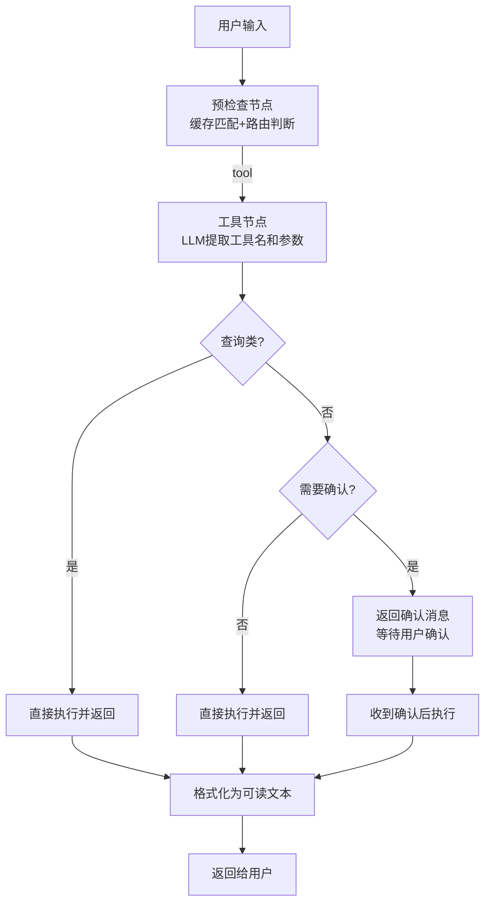
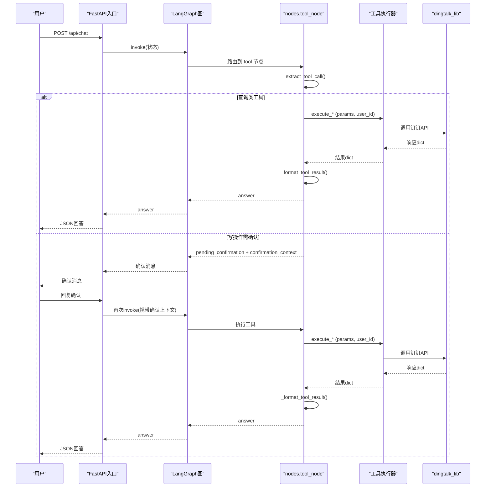
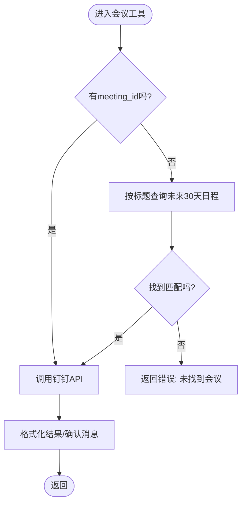
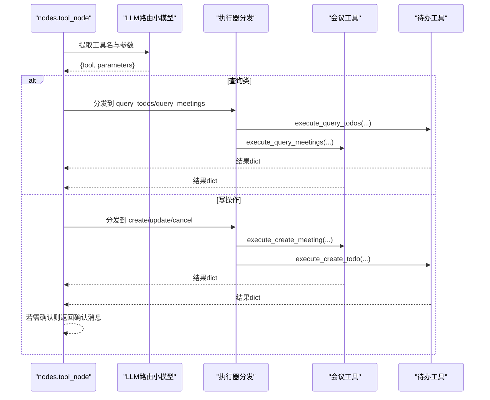
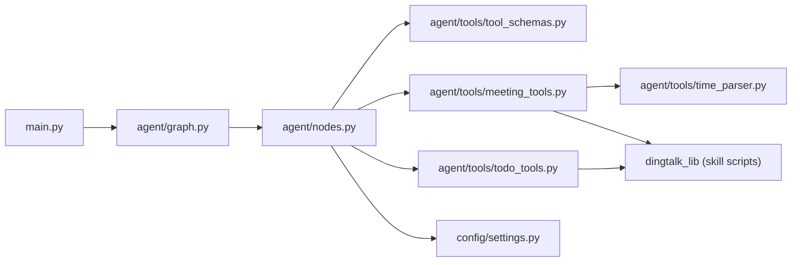

# 工具调用系统

<cite>
**本文引用的文件**
- [agent/tools/meeting_tools.py](file://agent/tools/meeting_tools.py)
- [agent/tools/todo_tools.py](file://agent/tools/todo_tools.py)
- [agent/tools/time_parser.py](file://agent/tools/time_parser.py)
- [agent/tools/tool_schemas.py](file://agent/tools/tool_schemas.py)
- [agent/nodes.py](file://agent/nodes.py)
- [agent/graph.py](file://agent/graph.py)
- [agent/state.py](file://agent/state.py)
- [config/settings.py](file://config/settings.py)
- [main.py](file://main.py)
</cite>

## 目录
1. [简介](#简介)
2. [项目结构](#项目结构)
3. [核心组件](#核心组件)
4. [架构总览](#架构总览)
5. [详细组件分析](#详细组件分析)
6. [依赖关系分析](#依赖关系分析)
7. [性能考虑](#性能考虑)
8. [故障排查指南](#故障排查指南)
9. [结论](#结论)
10. [附录：扩展开发指南](#附录：扩展开发指南)

## 简介
本文件详细说明 Agent 模块的工具调用系统，重点解释钉钉集成工具的架构设计与实现方式。内容覆盖会议管理工具、待办事项工具、时间解析工具的具体实现；说明工具注册机制、参数验证、API 调用封装与错误处理策略；并提供新工具扩展的开发指南（接口规范、测试用例编写建议）。

## 项目结构
Agent 工具调用系统围绕 LangGraph 状态图编排，将“意图识别 → 工具抽取 → 确认/执行 → 结果格式化”串联为可配置的工作流。工具层通过独立的 Python 模块提供具体能力，并通过统一的调度器分发到对应执行器。

图表来源
- [agent/graph.py:44-102](file://agent/graph.py#L44-L102)
- [agent/nodes.py:647-780](file://agent/nodes.py#L647-L780)

章节来源
- [agent/graph.py:44-102](file://agent/graph.py#L44-L102)
- [agent/nodes.py:647-780](file://agent/nodes.py#L647-L780)

## 核心组件
- 工具 Schema 与提取提示：定义可用工具名称、描述、参数结构与必填项，供 LLM Function Calling 使用，用于从自然语言中抽取工具名与参数。
- 工具执行器：按功能域划分（会议、待办），封装对 dingtalk_lib 的调用，负责参数转换、默认值填充、参会人解析、结果格式化。
- 时间解析工具：将中文自然语言时间表达转换为 ISO 8601 字符串，支持相对日期、时间段、时间点等常见表达。
- 工具调度器：在 nodes 中统一分发工具调用，处理确认流程、错误处理与结果格式化。
- 配置开关：通过全局设置控制是否启用工具调用、写操作是否需要确认等。

章节来源
- [agent/tools/tool_schemas.py:1-121](file://agent/tools/tool_schemas.py#L1-L121)
- [agent/tools/meeting_tools.py:1-225](file://agent/tools/meeting_tools.py#L1-L225)
- [agent/tools/todo_tools.py:1-84](file://agent/tools/todo_tools.py#L1-L84)
- [agent/tools/time_parser.py:1-120](file://agent/tools/time_parser.py#L1-L120)
- [agent/nodes.py:647-780](file://agent/nodes.py#L647-L780)
- [config/settings.py:151-156](file://config/settings.py#L151-L156)

## 架构总览
整体工作流基于 LangGraph 的状态图构建，预检查节点完成缓存命中与路由判断；当判定为工具调用时进入 tool 节点，由 LLM 小模型抽取工具名与参数，随后根据工具类型决定是否需要用户确认，最终执行并返回格式化结果。

图表来源
- [main.py:154-209](file://main.py#L154-L209)
- [agent/graph.py:44-102](file://agent/graph.py#L44-L102)
- [agent/nodes.py:647-780](file://agent/nodes.py#L647-L780)
- [agent/tools/meeting_tools.py:17-128](file://agent/tools/meeting_tools.py#L17-L128)
- [agent/tools/todo_tools.py:18-44](file://agent/tools/todo_tools.py#L18-L44)

## 详细组件分析

### 工具 Schema 与参数提取
- 工具列表与参数结构：定义了 create_todo、query_todos、create_meeting、cancel_meeting、update_meeting、query_meetings 的名称、描述与参数 schema，包含必填字段与可选字段。
- 提取提示：提供结构化 prompt，指导 LLM 从用户输入中抽取工具名与参数，输出 JSON 格式。
- 读写分类：区分读操作（无需确认）与写操作（需要确认），便于后续流程控制。

章节来源
- [agent/tools/tool_schemas.py:1-121](file://agent/tools/tool_schemas.py#L1-L121)

### 会议管理工具
- 创建会议：
  - 解析参会人：支持姓名或手机号，自动解析为钉钉用户ID；失败时保留原值以便 API 跳过无效 ID。
  - 默认时长：若未指定结束时间，则默认开始时间加一小时。
  - 调用 dingtalk_lib.create_schedule 并返回响应。
- 取消会议：
  - 优先使用 meeting_id；若无 ID，则按标题在未来 30 天内查询匹配，找到后取消。
  - 支持是否通知参会人的选项。
- 修改会议：
  - 优先使用 meeting_id；若无 ID，则按标题查询匹配后更新。
  - updates 支持 title/start_time/end_time/location 等字段。
- 查询会议：
  - 支持 date_from/date_to；未指定时默认查询本周。
  - 使用 time_parser.parse_natural_date_range 解析自然语言时间范围。
- 结果与确认格式化：
  - 成功/失败统一以 errcode 判断，返回友好文本。
  - 写操作确认消息展示关键信息，引导用户确认。

图表来源
- [agent/tools/meeting_tools.py:50-113](file://agent/tools/meeting_tools.py#L50-L113)
- [agent/tools/meeting_tools.py:116-128](file://agent/tools/meeting_tools.py#L116-L128)
- [agent/tools/meeting_tools.py:131-183](file://agent/tools/meeting_tools.py#L131-L183)

章节来源
- [agent/tools/meeting_tools.py:17-225](file://agent/tools/meeting_tools.py#L17-L225)

### 待办事项工具
- 创建待办：
  - 参数包括标题、截止时间、详情、优先级；优先级默认值合理。
  - 调用 dingtalk_lib.create_todo 并返回响应。
- 查询待办：
  - 支持按状态过滤（all/pending/done），默认查询待办。
- 结果与确认格式化：
  - 成功/失败统一以 errcode 判断，返回友好文本。
  - 写操作确认消息展示关键信息，引导用户确认。

章节来源
- [agent/tools/todo_tools.py:18-84](file://agent/tools/todo_tools.py#L18-L84)

### 时间解析工具
- 自然语言时间转 ISO 8601：
  - 支持“明天下午3点”、“下周一上午10点”、“2小时后”等常见表达。
  - 内部分两步：先解析日期部分，再解析时间部分，最后拼接为 ISO 字符串。
- 自然语言日期范围：
  - 支持“今天/明日/本周/下周/本月”等范围，返回 (start, end) 元组。
  - 用于会议查询等场景的默认时间范围填充。

章节来源
- [agent/tools/time_parser.py:11-63](file://agent/tools/time_parser.py#L11-L63)
- [agent/tools/time_parser.py:66-120](file://agent/tools/time_parser.py#L66-L120)

### 工具调度与确认流程
- 工具抽取：
  - 使用路由小模型与 TOOL_EXTRACT_PROMPT 从用户输入中提取工具名与参数。
  - 失败时降级为普通回答。
- 执行分发：
  - 根据工具名动态导入并调用对应执行器函数。
  - 查询类工具直接执行；写操作根据配置决定是否请求用户确认。
- 结果格式化：
  - 统一以 errcode 判断成功与否，调用各工具域的 format_*_result 生成用户可读文本。
- 确认流程：
  - 写操作返回 pending_confirmation 与 confirmation_context；下一轮收到“确认”后执行实际工具调用。

图表来源
- [agent/nodes.py:693-746](file://agent/nodes.py#L693-L746)
- [agent/tools/meeting_tools.py:17-128](file://agent/tools/meeting_tools.py#L17-L128)
- [agent/tools/todo_tools.py:18-44](file://agent/tools/todo_tools.py#L18-L44)

章节来源
- [agent/nodes.py:647-780](file://agent/nodes.py#L647-L780)

## 依赖关系分析
- 工具层依赖 dingtalk_lib（位于 .qoder/skills/dingtalk-messaging/scripts），通过 sys.path.insert 动态加入路径，保持 skill 自包含特性。
- 工具调度器依赖 LLM 路由小模型进行工具抽取，依赖全局配置控制工具调用开关与确认策略。
- 会议工具依赖时间解析工具进行自然语言时间范围解析。
- 主入口 FastAPI 提供 Web 聊天接口，调用 LangGraph 图执行完整流程。

图表来源
- [main.py:154-209](file://main.py#L154-L209)
- [agent/graph.py:44-102](file://agent/graph.py#L44-L102)
- [agent/nodes.py:647-780](file://agent/nodes.py#L647-L780)
- [agent/tools/meeting_tools.py:9-14](file://agent/tools/meeting_tools.py#L9-L14)
- [agent/tools/todo_tools.py:10-15](file://agent/tools/todo_tools.py#L10-L15)
- [agent/tools/time_parser.py:11-63](file://agent/tools/time_parser.py#L11-L63)
- [config/settings.py:151-156](file://config/settings.py#L151-L156)

章节来源
- [agent/tools/meeting_tools.py:9-14](file://agent/tools/meeting_tools.py#L9-L14)
- [agent/tools/todo_tools.py:10-15](file://agent/tools/todo_tools.py#L10-L15)
- [agent/nodes.py:693-746](file://agent/nodes.py#L693-L746)
- [config/settings.py:151-156](file://config/settings.py#L151-L156)

## 性能考虑
- 路由小模型用于工具抽取，温度设为 0.0，降低随机性并提升稳定性。
- 工具调用直接返回结果，不经过 generate 节点，减少延迟。
- 会议查询默认使用“本周”时间范围，避免全量扫描。
- 参会人解析失败时保留原值，交由 API 层跳过无效 ID，减少重试成本。
- 流式接口具备整体超时保护，防止连接卡死。

[本节为通用性能讨论，不直接分析具体文件]

## 故障排查指南
- 工具抽取失败：
  - 现象：返回“未能识别您的操作意图”。
  - 排查：检查 TOOL_EXTRACT_PROMPT 与用户输入是否清晰；查看路由小模型调用日志。
- 钉钉 API 调用失败：
  - 现象：errcode 非 0，errmsg 包含错误信息。
  - 排查：检查 dingtalk_lib 可用性、网络连通性与权限；查看会议 ID/标题是否正确。
- 参会人解析失败：
  - 现象：参会人仍为姓名或手机号。
  - 排查：检查手机号格式与姓名搜索逻辑；确认 dingtalk_lib 的用户查询接口返回。
- 时间解析异常：
  - 现象：时间范围不正确。
  - 排查：检查自然语言表达是否符合支持模式；查看 parse_natural_date_range 与 _parse_time 分支。
- 确认流程未触发：
  - 现象：写操作直接执行。
  - 排查：检查 tool_confirmation_required 配置；确认工具属于写操作集合。

章节来源
- [agent/nodes.py:693-746](file://agent/nodes.py#L693-L746)
- [agent/tools/meeting_tools.py:185-225](file://agent/tools/meeting_tools.py#L185-L225)
- [agent/tools/time_parser.py:66-120](file://agent/tools/time_parser.py#L66-L120)
- [config/settings.py:151-156](file://config/settings.py#L151-L156)

## 结论
该工具调用系统通过清晰的职责分层与可配置的确认流程，实现了钉钉会议与待办的稳定集成。Schema 驱动的参数抽取、统一的错误处理与友好的结果格式化，使得工具扩展与维护更加便捷。结合时间解析工具，系统能够自然理解用户的时间表达，提升交互体验。

[本节为总结性内容，不直接分析具体文件]

## 附录：扩展开发指南

### 新增工具步骤
1. 定义工具 Schema：
   - 在 tool_schemas.py 中添加工具名称、描述与参数结构，明确必填与可选字段。
   - 更新 TOOL_EXTRACT_PROMPT，使 LLM 能正确抽取新工具参数。
2. 实现工具执行器：
   - 在 tools 目录下新增或扩展现有模块，实现 execute_* 函数，接收 params 与 user_id，返回钉钉 API 响应 dict。
   - 实现 format_*_result 与 format_*_confirmation（如为写操作），统一错误处理与用户可读文本。
3. 注册工具分发：
   - 在 nodes.py 的 _execute_tool 中添加新工具名的分发逻辑，调用对应执行器。
4. 配置开关：
   - 如需写操作确认，确保工具属于 WRITE_TOOLS；读操作属于 READ_TOOLS。
   - 通过 settings 控制 tool_calling_enabled 与 tool_confirmation_required。
5. 测试用例编写建议：
   - 单元测试：
     - 参数校验：传入缺失必填字段、非法类型、边界值，验证返回错误。
     - 正常流程：构造合法参数，验证 API 调用与结果格式化。
     - 异常路径：模拟 dingtalk_lib 抛出异常或返回错误码，验证错误处理。
   - 集成测试：
     - 端到端流程：从用户输入到工具抽取、确认、执行、返回，验证整体链路。
     - 时间解析：使用自然语言时间表达，验证时间范围解析正确性。
   - 回归测试：
     - 变更 Schema 或执行器后，运行既有用例确保无破坏性变更。

章节来源
- [agent/tools/tool_schemas.py:1-121](file://agent/tools/tool_schemas.py#L1-L121)
- [agent/nodes.py:712-746](file://agent/nodes.py#L712-L746)
- [config/settings.py:151-156](file://config/settings.py#L151-L156)