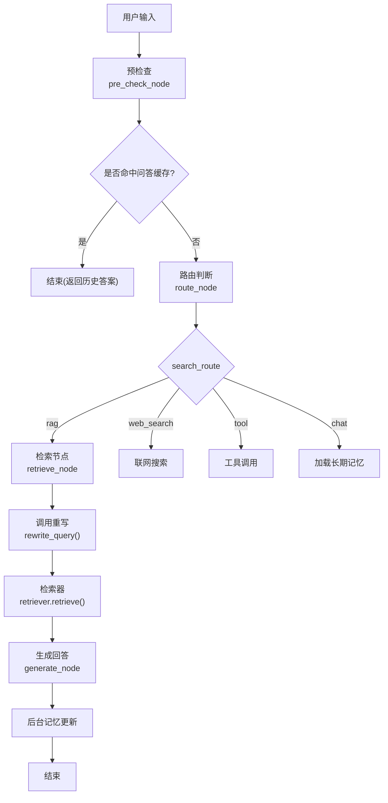
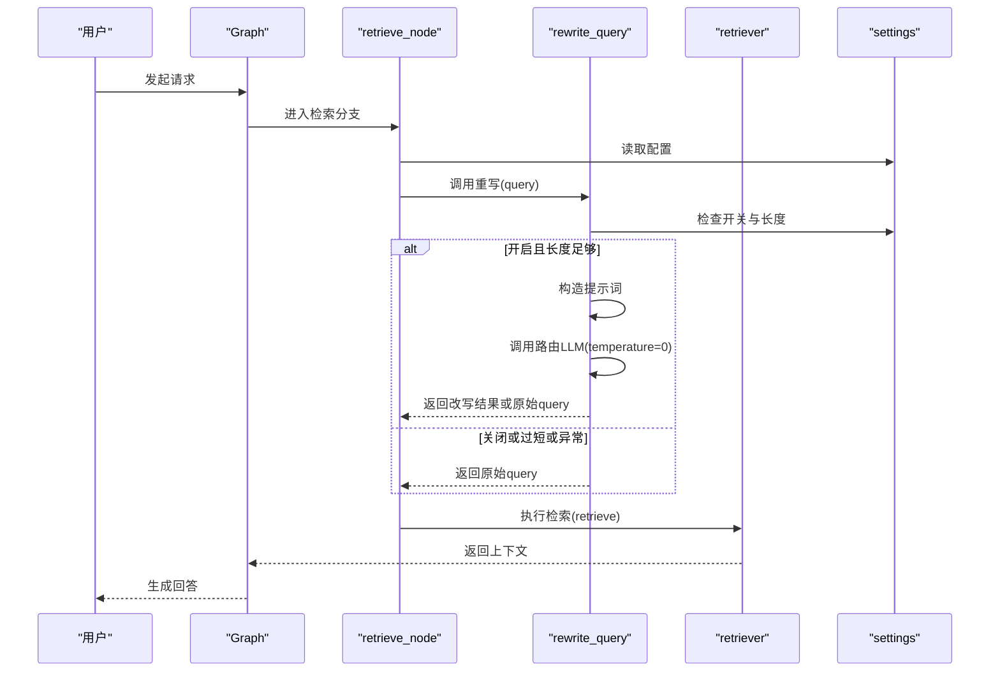
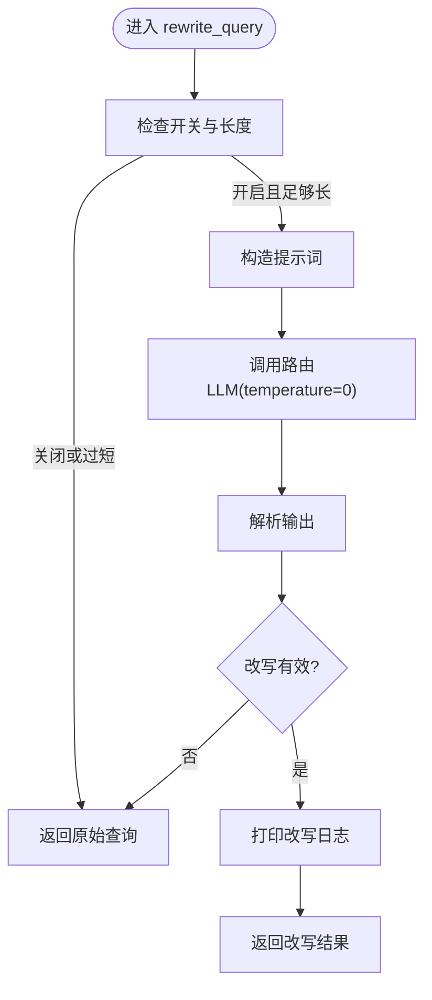
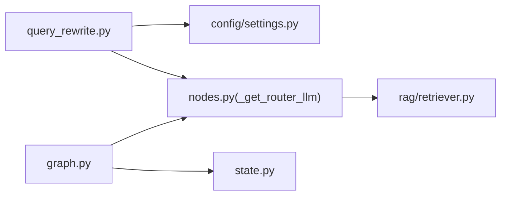

# 查询重写系统

<cite>
**本文引用的文件**
- [agent/query_rewrite.py](file://agent/query_rewrite.py)
- [agent/nodes.py](file://agent/nodes.py)
- [agent/state.py](file://agent/state.py)
- [agent/graph.py](file://agent/graph.py)
- [config/settings.py](file://config/settings.py)
- [rag/retriever.py](file://rag/retriever.py)
- [evaluation/agent_eval.py](file://evaluation/agent_eval.py)
</cite>

## 目录
1. [简介](#简介)
2. [项目结构](#项目结构)
3. [核心组件](#核心组件)
4. [架构总览](#架构总览)
5. [详细组件分析](#详细组件分析)
6. [依赖关系分析](#依赖关系分析)
7. [性能考量](#性能考量)
8. [故障排查指南](#故障排查指南)
9. [结论](#结论)
10. [附录：配置与自定义规则开发指南](#附录配置与自定义规则开发指南)

## 简介
本模块聚焦 Agent 的“查询重写”子系统，目标是提升知识库检索召回率。其核心思路是：在 RAG 检索前，用轻量路由模型将用户原始问题改写为更利于检索的形式（补全省略、去除口语化、保留原意），并在失败或关闭时静默回退到原始查询，不阻断检索链路。该能力通过配置开关控制，并嵌入到检索节点中执行。

## 项目结构
与查询重写直接相关的代码分布在以下位置：
- 重写逻辑：agent/query_rewrite.py
- 工作流编排与触发点：agent/nodes.py（retrieve_node）、agent/graph.py（图构建）
- 状态定义：agent/state.py
- 检索器：rag/retriever.py（接收重写后的查询进行检索）
- 配置项：config/settings.py（开关、阈值等）
- 评估工具：evaluation/agent_eval.py（可用于端到端效果评估）

图表来源
- [agent/graph.py:44-102](file://agent/graph.py#L44-L102)
- [agent/nodes.py:93-158](file://agent/nodes.py#L93-L158)
- [agent/nodes.py:285-321](file://agent/nodes.py#L285-L321)
- [rag/retriever.py:18-52](file://rag/retriever.py#L18-L52)

章节来源
- [agent/graph.py:44-102](file://agent/graph.py#L44-L102)
- [agent/nodes.py:93-158](file://agent/nodes.py#L93-L158)
- [agent/nodes.py:285-321](file://agent/nodes.py#L285-L321)
- [rag/retriever.py:18-52](file://rag/retriever.py#L18-L52)

## 核心组件
- 查询重写函数：对短查询、关闭开关、异常等情况做安全回退；使用路由小模型以零温度生成改写结果。
- 检索节点：在 RAG 分支中调用重写函数，并将结果传入检索器。
- 配置管理：提供查询重写开关及多项检索相关参数，影响重写与后续过滤行为。
- 状态与图：AgentState 承载各阶段上下文；Graph 编排节点顺序与条件边，确保重写仅在需要时触发。

章节来源
- [agent/query_rewrite.py:26-58](file://agent/query_rewrite.py#L26-L58)
- [agent/nodes.py:285-321](file://agent/nodes.py#L285-L321)
- [config/settings.py:91-94](file://config/settings.py#L91-L94)
- [agent/state.py:12-51](file://agent/state.py#L12-L51)
- [agent/graph.py:44-102](file://agent/graph.py#L44-L102)

## 架构总览
查询重写作为检索前的可选预处理步骤，遵循“可插拔、可降级”的设计：
- 触发条件：进入 retrieve_node 且开启查询重写开关；同时满足最小长度阈值。
- 处理流程：构造提示词 → 调用路由小模型 → 解析输出 → 若改写有效则替换查询，否则回退。
- 集成点：仅影响检索阶段的查询文本，不影响路由、记忆、工具调用等其他分支。
- 结果验证：日志打印改写前后对比；异常时静默回退，保证主链路稳定。

图表来源
- [agent/nodes.py:285-321](file://agent/nodes.py#L285-L321)
- [agent/query_rewrite.py:26-58](file://agent/query_rewrite.py#L26-L58)
- [rag/retriever.py:18-52](file://rag/retriever.py#L18-L52)
- [config/settings.py:91-94](file://config/settings.py#L91-L94)

## 详细组件分析

### 查询重写算法与语义理解
- 算法要点
  - 提示词工程：要求保留原意、补全省略主语/指代、去除口语化、只输出改写后问题。
  - 模型选择：使用路由小模型并以 temperature=0 保证稳定性与一致性。
  - 快速路径：当未开启开关或查询过短时直接返回原始查询，避免无谓调用。
  - 健壮性：捕获异常并记录日志，始终返回原始查询，不阻断检索。
- 语义理解模型
  - 通过路由小模型的指令式提示完成意图保持下的表达优化，而非显式分类模型。
  - 与路由节点共用同一类轻量模型，降低延迟与成本。

图表来源
- [agent/query_rewrite.py:26-58](file://agent/query_rewrite.py#L26-L58)

章节来源
- [agent/query_rewrite.py:26-58](file://agent/query_rewrite.py#L26-L58)

### 触发条件与处理流程
- 触发条件
  - 处于 RAG 检索分支（search_route="rag"）。
  - 配置项 rag_query_rewrite_enabled 为真。
  - 用户输入长度不小于阈值（默认小于6字符不触发）。
- 处理流程
  - 在 retrieve_node 中先调用 rewrite_query，再执行检索。
  - 检索器支持多路召回与重排序，重写仅改变查询文本，不影响后续融合与精排。
- 结果验证
  - 成功改写会打印日志便于观测。
  - 失败或关闭时自动回退，保障链路可用性。

章节来源
- [agent/nodes.py:285-321](file://agent/nodes.py#L285-L321)
- [config/settings.py:91-94](file://config/settings.py#L91-L94)
- [rag/retriever.py:18-52](file://rag/retriever.py#L18-L52)

### 与检索器的协作
- 检索器根据配置决定多路召回与重排序策略。
- 查询重写发生在检索之前，因此对向量检索、BM25 召回、RRF 融合、CrossEncoder 精排均生效。
- 相关度阈值过滤仅在纯向量路径下启用，避免与重排序分数语义冲突。

章节来源
- [rag/retriever.py:18-52](file://rag/retriever.py#L18-L52)
- [agent/nodes.py:285-321](file://agent/nodes.py#L285-L321)

### 状态与图编排
- AgentState 承载 user_input、search_route、rag_context、answer 等字段，供各节点读写。
- Graph 将 pre_check、retrieve、web_search、load_memory、tool、generate、memory_background 串联，并通过条件边分流。
- 查询重写仅在 retrieve 分支内执行，不影响其他分支。

章节来源
- [agent/state.py:12-51](file://agent/state.py#L12-L51)
- [agent/graph.py:44-102](file://agent/graph.py#L44-L102)
- [agent/nodes.py:93-158](file://agent/nodes.py#L93-L158)

## 依赖关系分析
- 模块耦合
  - query_rewrite 依赖 settings 与 nodes 的路由模型获取函数，低耦合、高内聚。
  - retrieve_node 依赖 query_rewrite 与 retriever，职责清晰。
  - graph 编排节点，不感知重写细节，解耦良好。
- 外部依赖
  - 路由小模型（ChatOpenAI 兼容接口）用于改写。
  - 检索器依赖向量库与可选 BM25、重排序模块。
- 潜在循环依赖
  - 通过延迟导入（如 from agent.nodes import _get_router_llm）避免启动期循环。

图表来源
- [agent/query_rewrite.py:26-58](file://agent/query_rewrite.py#L26-L58)
- [agent/nodes.py:23-60](file://agent/nodes.py#L23-L60)
- [rag/retriever.py:18-52](file://rag/retriever.py#L18-L52)
- [agent/graph.py:44-102](file://agent/graph.py#L44-L102)
- [agent/state.py:12-51](file://agent/state.py#L12-L51)

章节来源
- [agent/query_rewrite.py:26-58](file://agent/query_rewrite.py#L26-L58)
- [agent/nodes.py:23-60](file://agent/nodes.py#L23-L60)
- [rag/retriever.py:18-52](file://rag/retriever.py#L18-L52)
- [agent/graph.py:44-102](file://agent/graph.py#L44-L102)
- [agent/state.py:12-51](file://agent/state.py#L12-L51)

## 性能考量
- 延迟与成本
  - 重写使用路由小模型且 temperature=0，开销较低；可通过关闭开关进一步节省。
  - 短查询跳过改写，减少无效调用。
- 吞吐与稳定性
  - 异常静默回退，避免重试风暴。
  - 与检索器解耦，不影响多路召回与重排序的并行性。
- 可观测性
  - 改写日志便于定位问题；可在生产环境调整日志级别。

[本节为通用指导，无需特定文件引用]

## 故障排查指南
- 现象：改写未生效
  - 检查配置开关是否开启；确认输入长度是否达到阈值。
  - 查看日志是否出现“改写失败”提示。
- 现象：检索质量下降
  - 确认重写是否误改原意；可临时关闭开关对比效果。
  - 结合检索器配置（BM25、重排序、阈值）综合调优。
- 现象：服务不稳定
  - 关注路由模型超时与重试配置；必要时增加超时或降低并发。

章节来源
- [agent/query_rewrite.py:26-58](file://agent/query_rewrite.py#L26-L58)
- [config/settings.py:91-94](file://config/settings.py#L91-L94)
- [rag/retriever.py:18-52](file://rag/retriever.py#L18-L52)

## 结论
查询重写以低成本、高鲁棒的方式增强检索召回，适合复杂、口语化或缺省主语的查询场景。通过配置开关与长度阈值实现精细控制，并与检索器、记忆、工具调用等模块松耦合集成。建议在生产环境中逐步灰度开启，并结合评估体系持续优化。

[本节为总结性内容，无需特定文件引用]

## 附录：配置与自定义规则开发指南

### 查询优化配置选项
- 查询重写开关：控制是否启用改写（默认关闭）。
- 检索相关：BM25、重排序、候选数、阈值等，影响重写后的检索效果。
- 记忆与上下文：短期窗口、预算、问答缓存阈值等，间接影响整体回答质量。

章节来源
- [config/settings.py:91-94](file://config/settings.py#L91-L94)
- [config/settings.py:83-100](file://config/settings.py#L83-L100)
- [config/settings.py:114-133](file://config/settings.py#L114-L133)

### 自定义重写规则开发指南
- 扩展点
  - 提示词工程：可在提示词中加入领域术语、业务约束、格式要求等，引导模型产出更利于检索的表达。
  - 规则前置：可在 retrieve_node 中增加基于规则的改写（如时间归一化、实体标准化），再交由 LLM 微调。
  - 白名单/黑名单：针对特定关键词或句式决定是否改写。
- 实施步骤
  - 新增提示词模板或规则函数，封装在独立模块中。
  - 在 retrieve_node 中按策略组合规则与 LLM 改写。
  - 增加开关与日志，便于灰度与观测。
  - 通过评估脚本进行 A/B 测试，衡量召回与回答质量变化。

章节来源
- [agent/query_rewrite.py:13-23](file://agent/query_rewrite.py#L13-L23)
- [agent/nodes.py:285-321](file://agent/nodes.py#L285-L321)

### 效果评估方法
- 指标设计
  - 正确性：回答是否与参考答案一致。
  - 幻觉检测：回答是否包含编造内容。
  - 推理路径合理性：智能体是否按预期步骤推进。
- 实施建议
  - 使用评估模块构建评测集，覆盖不同查询类型（简短、复杂、口语化、含省略等）。
  - 对比开启/关闭重写的指标差异，定位收益与风险。
  - 结合 LangSmith trace 分析节点执行情况，辅助诊断。

章节来源
- [evaluation/agent_eval.py:1-139](file://evaluation/agent_eval.py#L1-L139)