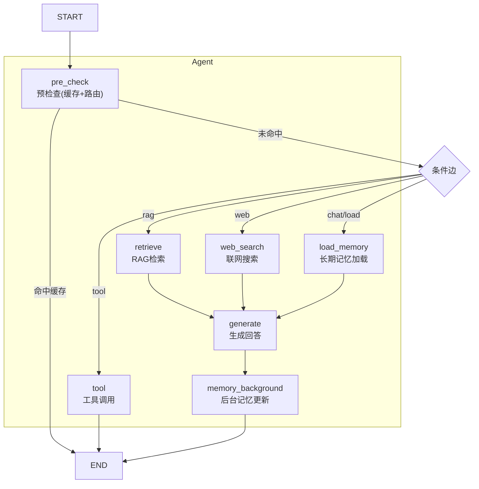
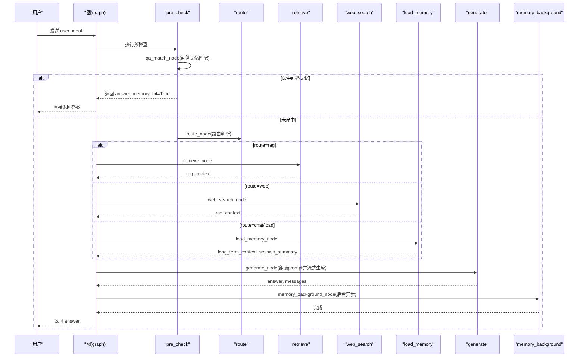
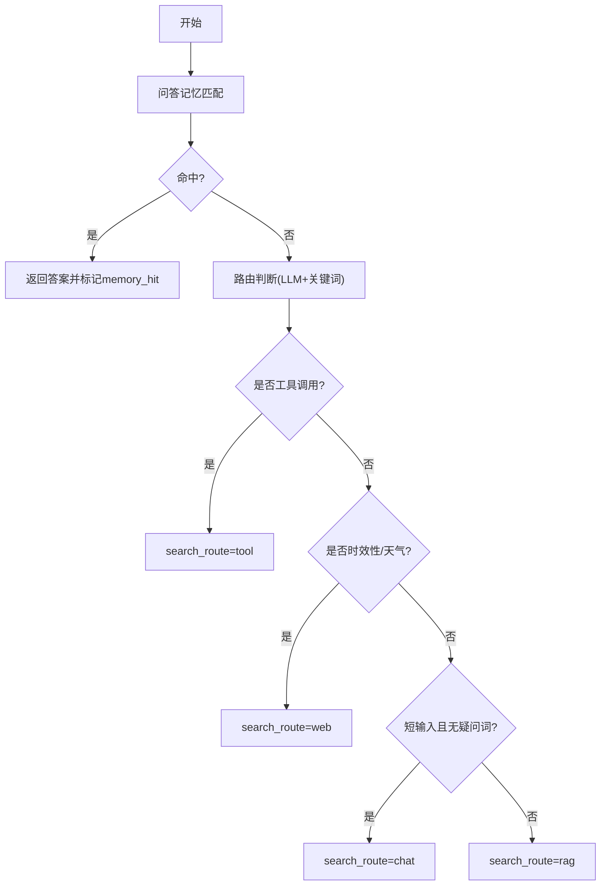
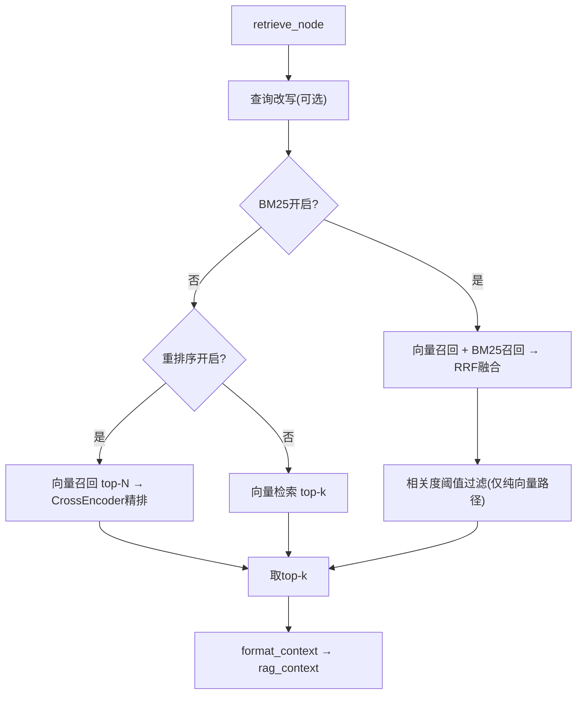
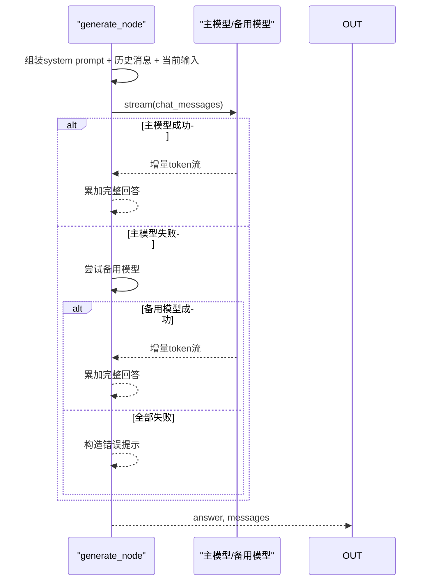
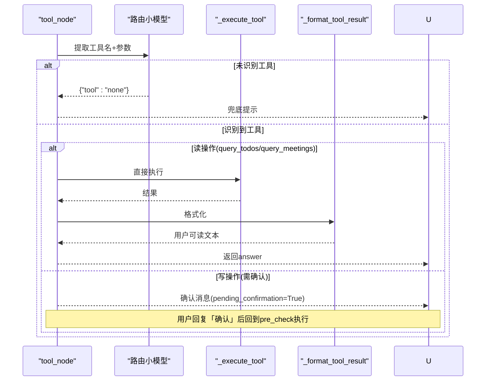
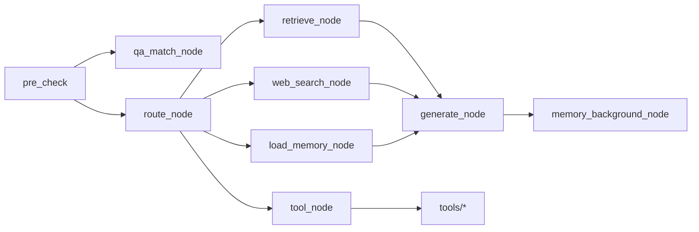

# 节点处理系统

<cite>
**本文引用的文件**
- [agent/nodes.py](file://agent/nodes.py)
- [agent/graph.py](file://agent/graph.py)
- [agent/state.py](file://agent/state.py)
- [agent/tools/tool_schemas.py](file://agent/tools/tool_schemas.py)
- [agent/tools/todo_tools.py](file://agent/tools/todo_tools.py)
- [agent/tools/meeting_tools.py](file://agent/tools/meeting_tools.py)
- [memory/long_term.py](file://memory/long_term.py)
- [rag/retriever.py](file://rag/retriever.py)
</cite>

## 目录
1. [简介](#简介)
2. [项目结构](#项目结构)
3. [核心组件](#核心组件)
4. [架构总览](#架构总览)
5. [详细组件分析](#详细组件分析)
6. [依赖关系分析](#依赖关系分析)
7. [性能考虑](#性能考虑)
8. [故障排查指南](#故障排查指南)
9. [结论](#结论)
10. [附录：节点扩展开发指南](#附录：节点扩展开发指南)

## 简介
本文件系统性说明 Agent 模块的节点处理系统，围绕意图识别、RAG 检索、工具调用、记忆更新等核心节点，解释其职责、输入输出、参数配置、异常处理与性能优化策略，并提供自定义节点扩展的最佳实践。整体工作流基于 LangGraph StateGraph 编排，具备缓存短路、多路分流、后台异步记忆更新、模型降级与流式输出等能力。

## 项目结构
Agent 模块以“状态图 + 节点函数”的方式组织：
- 状态定义：AgentState 描述流转中的消息历史、路由结果、上下文、工具调用上下文等。
- 节点实现：nodes.py 提供预检查、路由、RAG、联网搜索、长期记忆加载、生成回答、记忆更新、工具调用等节点。
- 图构建：graph.py 将节点连接为有向图，并暴露同步/异步流式入口。
- 工具层：tools/* 封装钉钉待办/会议等工具的执行与格式化。
- 记忆层：memory/long_term.py 提供分层结构化长期记忆、问答记忆缓存与会话摘要。
- 检索层：rag/retriever.py 提供向量检索、BM25 融合、重排序与上下文格式化。

图表来源
- [agent/graph.py:44-102](file://agent/graph.py#L44-L102)
- [agent/nodes.py:93-151](file://agent/nodes.py#L93-L151)

章节来源
- [agent/graph.py:1-102](file://agent/graph.py#L1-L102)
- [agent/state.py:1-54](file://agent/state.py#L1-L54)

## 核心组件
- 预检查节点（pre_check）：合并问答记忆匹配与路由判断；若命中问答缓存直接返回答案，否则按 search_route 分流。
- 路由节点（route）：基于关键词与 LLM 小模型决定走 tool/rag/web/chat。
- RAG 检索节点（retrieve）：查询改写 → 多路召回+重排序 → 相关度阈值过滤 → 格式化为 rag_context。
- 联网搜索节点（web_search）：执行联网搜索，结果写入 rag_context。
- 长期记忆加载节点（load_memory）：加载用户画像、关键事实、历史摘要与会话压缩摘要。
- 生成节点（generate）：组装 system prompt + 历史消息（含更早对话摘要）+ 当前输入，流式生成回答，支持主模型失败自动降级。
- 记忆更新节点（memory_update）：周期性更新长期记忆摘要、刷新会话摘要、保存问答记忆。
- 工具调用节点（tool）：LLM 提取工具名与参数，读操作直接执行，写操作需用户确认后执行。

章节来源
- [agent/nodes.py:93-151](file://agent/nodes.py#L93-L151)
- [agent/nodes.py:284-341](file://agent/nodes.py#L284-L341)
- [agent/nodes.py:344-360](file://agent/nodes.py#L344-L360)
- [agent/nodes.py:499-532](file://agent/nodes.py#L499-L532)
- [agent/nodes.py:535-564](file://agent/nodes.py#L535-L564)
- [agent/nodes.py:646-690](file://agent/nodes.py#L646-L690)

## 架构总览
工作流从 START 进入 pre_check，先进行问答记忆匹配与路由判断；命中则短路到 END，未命中则根据 search_route 分流至 retrieve/web_search/load_memory 或 tool；各分支最终汇聚到 generate 生成回答，随后在 memory_background 中异步完成记忆抽取与更新。

图表来源
- [agent/graph.py:44-102](file://agent/graph.py#L44-L102)
- [agent/nodes.py:93-151](file://agent/nodes.py#L93-L151)
- [agent/nodes.py:284-341](file://agent/nodes.py#L284-L341)
- [agent/nodes.py:344-360](file://agent/nodes.py#L344-L360)
- [agent/nodes.py:499-532](file://agent/nodes.py#L499-L532)
- [agent/nodes.py:535-564](file://agent/nodes.py#L535-L564)

## 详细组件分析

### 预检查与路由（意图识别）
- 功能职责
  - 问答记忆匹配：对相似问题直接复用历史答案，跳过后续链路。
  - 路由判断：结合关键词与 LLM 小模型决定 tool/rag/web/chat。
  - 时效性问题优先联网搜索，避免污染长期记忆。
- 输入输出
  - 输入：AgentState（包含 user_input、user_id、session_id、pending_confirmation 等）
  - 输出：可能返回 answer/memory_hit（命中时短路），或设置 search_route 供后续分流
- 参数配置
  - 是否启用工具调用、联网搜索、问答记忆缓存、相关度阈值等通过配置中心注入。
- 异常处理
  - 向量化失败、检索失败静默降级为未命中；LLM 路由失败回退关键词兜底。
- 性能优化
  - 命中问答记忆直接短路；时效性问题快速判定绕过 LLM；短输入闲聊快速归类。

图表来源
- [agent/nodes.py:93-151](file://agent/nodes.py#L93-L151)
- [agent/nodes.py:154-230](file://agent/nodes.py#L154-L230)
- [agent/nodes.py:232-281](file://agent/nodes.py#L232-L281)

章节来源
- [agent/nodes.py:93-151](file://agent/nodes.py#L93-L151)
- [agent/nodes.py:154-230](file://agent/nodes.py#L154-L230)
- [agent/nodes.py:232-281](file://agent/nodes.py#L232-L281)

### RAG 检索节点
- 功能职责
  - 查询改写（可选）→ 多路召回（向量+BM25）→ 重排序（可选）→ 相关度阈值过滤 → 格式化为 rag_context。
- 输入输出
  - 输入：user_input
  - 输出：rag_context（字符串）
- 参数配置
  - rerank_enabled、rag_bm25_enabled、rag_min_relevance、rerank_top_k、rag_rrf_k 等。
- 异常处理
  - 检索失败时返回空上下文，不阻断主链路。
- 性能优化
  - 纯向量路径下使用相关度阈值过滤；RRF 融合提升召回质量；重排序仅在开启时执行。

图表来源
- [agent/nodes.py:284-321](file://agent/nodes.py#L284-L321)
- [rag/retriever.py:18-53](file://rag/retriever.py#L18-L53)
- [rag/retriever.py:55-110](file://rag/retriever.py#L55-L110)
- [rag/retriever.py:113-139](file://rag/retriever.py#L113-L139)

章节来源
- [agent/nodes.py:284-321](file://agent/nodes.py#L284-L321)
- [rag/retriever.py:18-139](file://rag/retriever.py#L18-L139)

### 联网搜索节点
- 功能职责
  - 执行联网搜索，结果写入 rag_context，用于生成回答。
- 输入输出
  - 输入：user_input
  - 输出：rag_context（字符串）
- 参数配置
  - web_search_max_results 控制最大结果数。
- 异常处理
  - 搜索失败或未找到结果时返回空上下文。
- 性能优化
  - 时效性问题优先走联网搜索，减少不必要的 RAG 调用。

章节来源
- [agent/nodes.py:324-341](file://agent/nodes.py#L324-L341)

### 长期记忆加载节点
- 功能职责
  - 从 SQLite 分层加载用户画像、关键事实、历史摘要与会话压缩摘要，形成 long_term_context 与 session_summary。
- 输入输出
  - 输入：user_id、session_id、user_input
  - 输出：long_term_context、session_summary
- 参数配置
  - memory_context_budget、memory_short_window、memory_history_budget 等。
- 异常处理
  - 加载失败时返回空上下文，不影响主流程。
- 性能优化
  - 分层预算填充，P0 层硬保留，P1/P2 层按预算截断；会话摘要滚动压缩避免上下文爆炸。

章节来源
- [agent/nodes.py:344-360](file://agent/nodes.py#L344-L360)
- [memory/long_term.py:424-497](file://memory/long_term.py#L424-L497)

### 生成回答节点
- 功能职责
  - 组装 system prompt（含长期记忆与RAG上下文）、历史消息（窗口+预算+更早对话摘要）、当前输入，流式生成回答；主模型失败自动降级备用模型。
- 输入输出
  - 输入：messages、user_input、rag_context、long_term_context、session_summary
  - 输出：answer、messages（追加本轮对话）
- 参数配置
  - 主模型与备用模型列表、温度、重试次数、超时等。
- 异常处理
  - 主模型失败尝试备用模型；全部失败返回错误提示。
- 性能优化
  - 流式生成降低首字延迟；历史消息窗口与预算控制 token 消耗；会话摘要防丢失。

图表来源
- [agent/nodes.py:453-532](file://agent/nodes.py#L453-L532)

章节来源
- [agent/nodes.py:453-532](file://agent/nodes.py#L453-L532)

### 记忆更新节点（后台）
- 功能职责
  - 周期性更新长期记忆摘要、刷新会话压缩摘要、保存问答记忆；时效性问题不写入长期记忆。
- 输入输出
  - 输入：user_id、messages、search_route、query_embedding
  - 输出：无（副作用写入数据库）
- 参数配置
  - memory_summary_every、memory_qa_cache_enabled、memory_qa_threshold、memory_qa_max_records 等。
- 异常处理
  - 各子步骤独立 try/except，任一失败不影响其他步骤。
- 性能优化
  - 后台线程执行不阻塞响应；增量合并摘要防止关键信息丢失；问答记忆缓存减少重复生成。

章节来源
- [agent/nodes.py:535-564](file://agent/nodes.py#L535-L564)
- [agent/nodes.py:567-600](file://agent/nodes.py#L567-L600)
- [agent/nodes.py:602-628](file://agent/nodes.py#L602-L628)
- [memory/long_term.py:613-633](file://memory/long_term.py#L613-L633)
- [memory/long_term.py:729-800](file://memory/long_term.py#L729-L800)

### 工具调用节点
- 功能职责
  - LLM 提取工具名与参数；读操作直接执行；写操作需用户确认；执行后格式化为可读文本返回。
- 输入输出
  - 输入：user_input、user_id
  - 输出：answer、tool_name、tool_params、tool_result、pending_confirmation、confirmation_context
- 参数配置
  - tool_calling_enabled、tool_confirmation_required。
- 异常处理
  - LLM 提取失败返回兜底提示；未知工具返回错误码；执行失败统一错误格式。
- 性能优化
  - 工具调用直接返回结果，不经过 generate；写操作确认机制保障安全。

图表来源
- [agent/nodes.py:646-690](file://agent/nodes.py#L646-L690)
- [agent/nodes.py:693-746](file://agent/nodes.py#L693-L746)
- [agent/tools/tool_schemas.py:7-26](file://agent/tools/tool_schemas.py#L7-L26)
- [agent/tools/todo_tools.py:18-44](file://agent/tools/todo_tools.py#L18-L44)
- [agent/tools/meeting_tools.py:17-47](file://agent/tools/meeting_tools.py#L17-L47)

章节来源
- [agent/nodes.py:646-690](file://agent/nodes.py#L646-L690)
- [agent/nodes.py:693-746](file://agent/nodes.py#L693-L746)
- [agent/tools/tool_schemas.py:7-121](file://agent/tools/tool_schemas.py#L7-L121)
- [agent/tools/todo_tools.py:18-84](file://agent/tools/todo_tools.py#L18-L84)
- [agent/tools/meeting_tools.py:17-225](file://agent/tools/meeting_tools.py#L17-L225)

## 依赖关系分析
- 节点间耦合
  - pre_check 依赖 qa_match_node 与 route_node；route 依赖配置与 LLM；retrieve 依赖 retriever；generate 依赖 memory 与 retriever；tool 依赖 tools/*。
- 外部依赖
  - LLM（ChatOpenAI）、Milvus/Embedding、SQLite、钉钉 API（通过 dingtalk_lib）。
- 循环依赖
  - 无明显循环；模块内导入多为运行时按需导入以避免启动开销。
- 接口契约
  - AgentState 字段为节点间数据契约；工具执行器统一返回 dict（errcode/msg 或业务数据）。

图表来源
- [agent/graph.py:44-102](file://agent/graph.py#L44-L102)
- [agent/state.py:12-51](file://agent/state.py#L12-L51)

章节来源
- [agent/graph.py:44-102](file://agent/graph.py#L44-L102)
- [agent/state.py:12-51](file://agent/state.py#L12-L51)

## 性能考虑
- 缓存短路：问答记忆命中直接返回，跳过整条生成链路。
- 路由优化：时效性问题快速判定走联网搜索；短输入闲聊快速归类。
- 检索优化：多路召回+RRF融合；重排序仅在开启时执行；纯向量路径相关度阈值过滤。
- 生成优化：流式生成降低首字延迟；历史消息窗口与预算控制 token；会话摘要防丢失。
- 记忆优化：后台异步更新；增量合并摘要；问答记忆缓存减少重复生成。
- 模型降级：主模型失败自动尝试备用模型，提高鲁棒性。

[本节为通用性能建议，无需特定文件引用]

## 故障排查指南
- 路由失败
  - 现象：LLM 路由异常导致默认 chat。
  - 排查：检查关键词与配置开关；查看日志中的路由降级提示。
- 检索失败
  - 现象：retrieve 返回空上下文。
  - 排查：检查向量库/Embedding 服务；确认 rerank/BM25 配置；查看检索失败日志。
- 生成失败
  - 现象：主模型报错，备用模型也失败。
  - 排查：检查模型配置、网络、重试与超时；查看降级日志与错误汇总。
- 工具调用失败
  - 现象：工具执行返回 errcode != 0。
  - 排查：检查参数合法性、钉钉 API 权限；查看工具执行日志。
- 记忆更新失败
  - 现象：长期记忆未更新或问答记忆未保存。
  - 排查：检查 SQLite 连接与锁；查看后台节点异常日志。

章节来源
- [agent/nodes.py:180-211](file://agent/nodes.py#L180-L211)
- [agent/nodes.py:255-281](file://agent/nodes.py#L255-L281)
- [agent/nodes.py:318-341](file://agent/nodes.py#L318-L341)
- [agent/nodes.py:525-532](file://agent/nodes.py#L525-L532)
- [agent/nodes.py:723-746](file://agent/nodes.py#L723-L746)
- [agent/nodes.py:545-564](file://agent/nodes.py#L545-L564)

## 结论
节点处理系统通过预检查短路、多路路由、RAG/联网搜索、长期记忆加载与生成、后台记忆更新以及工具调用，构建了高可用、高性能的智能体工作流。系统在异常处理、性能优化与可扩展性方面均有良好设计，适合持续迭代与扩展。

[本节为总结性内容，无需特定文件引用]

## 附录：节点扩展开发指南
- 新增节点步骤
  - 在 nodes.py 中实现节点函数，接收 AgentState 并返回增量状态字典。
  - 在 graph.py 中注册节点并添加边或条件边。
  - 如需流式事件透传，参考 _emit_message_events 的处理逻辑。
- 最佳实践
  - 保持节点幂等与健壮：内部 try/except 捕获异常，返回降级结果。
  - 避免阻塞主链路：耗时任务放入 memory_background 或异步执行。
  - 明确输入输出：遵循 AgentState 字段约定，避免状态污染。
  - 配置驱动：通过 settings 控制行为开关与阈值。
  - 测试覆盖：为节点编写单元测试，覆盖正常与异常路径。
- 自定义工具扩展
  - 在 tools/* 中新增工具执行器与格式化函数。
  - 在 tool_schemas.py 中声明工具 Schema 与提取 Prompt。
  - 在 tool_node 中注册工具分发逻辑。
- 示例参考
  - 待办工具：todo_tools.py 展示参数解析、API 调用与结果格式化。
  - 会议工具：meeting_tools.py 展示参会人解析、时间处理与确认消息。

章节来源
- [agent/nodes.py:93-151](file://agent/nodes.py#L93-L151)
- [agent/graph.py:44-102](file://agent/graph.py#L44-L102)
- [agent/tools/tool_schemas.py:7-121](file://agent/tools/tool_schemas.py#L7-L121)
- [agent/tools/todo_tools.py:18-84](file://agent/tools/todo_tools.py#L18-L84)
- [agent/tools/meeting_tools.py:17-225](file://agent/tools/meeting_tools.py#L17-L225)