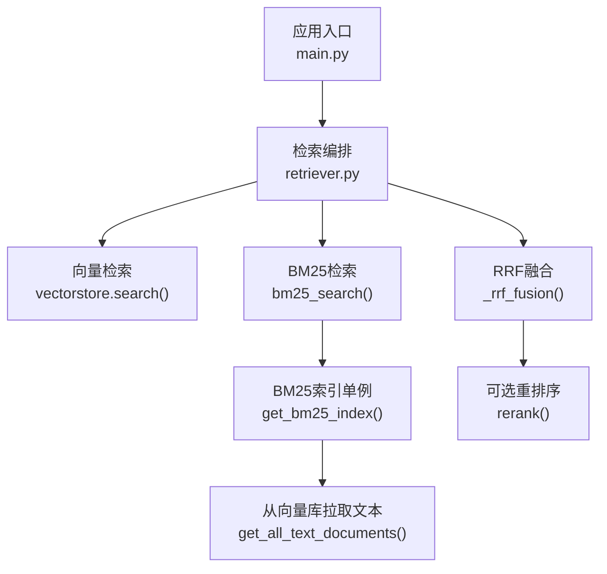
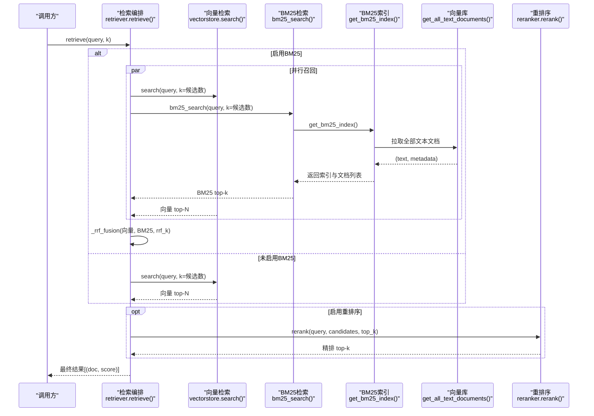
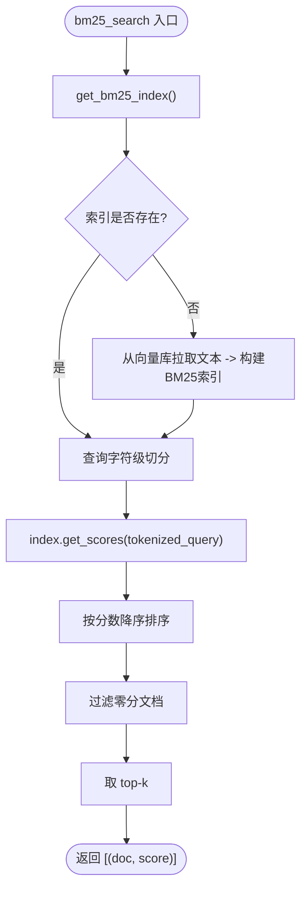
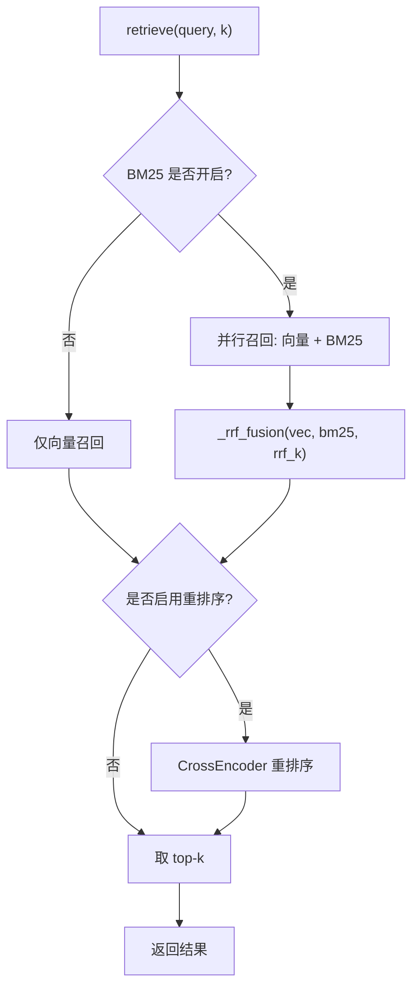
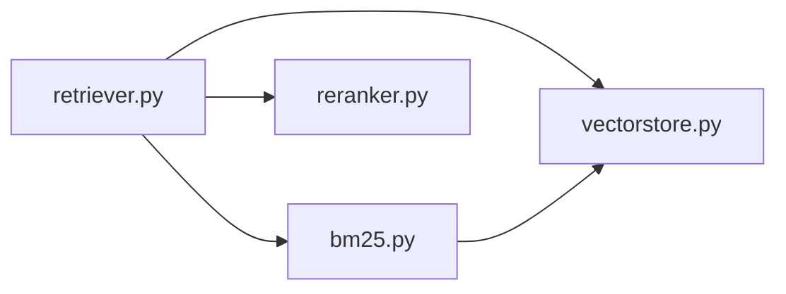

# BM25关键词检索

<cite>
**本文引用的文件**
- [rag/bm25.py](file://rag/bm25.py)
- [rag/retriever.py](file://rag/retriever.py)
- [config/settings.py](file://config/settings.py)
- [rag/vectorstore.py](file://rag/vectorstore.py)
- [rag/reranker.py](file://rag/reranker.py)
- [main.py](file://main.py)
</cite>

## 目录
1. [简介](#简介)
2. [项目结构](#项目结构)
3. [核心组件](#核心组件)
4. [架构总览](#架构总览)
5. [详细组件分析](#详细组件分析)
6. [依赖关系分析](#依赖关系分析)
7. [性能与调优](#性能与调优)
8. [故障排查指南](#故障排查指南)
9. [结论](#结论)
10. [附录：配置项速查](#附录：配置项速查)

## 简介
本模块在现有向量检索基础上，提供基于BM25的关键词检索能力，并通过RRF（Reciprocal Rank Fusion）将向量检索与BM25召回结果融合，最终可进入CrossEncoder重排序阶段，形成“多路召回 + 精排”的完整检索链路。BM25在本实现中采用进程内内存索引，中文按字符级切分，无需额外分词器；索引从Milvus向量库拉取文本文档构建，支持运行时自动重置与启动预热。

## 项目结构
与BM25相关的关键文件与职责如下：
- rag/bm25.py：BM25索引构建、查询与单例管理
- rag/retriever.py：检索编排（向量检索、BM25、RRF融合、可选重排序）
- config/settings.py：全局配置（开关、候选数、RRF常数等）
- rag/vectorstore.py：向量库封装与全量文本拉取接口
- rag/reranker.py：CrossEncoder重排序
- main.py：服务启动时的增量入库与BM25索引预热

图表来源
- [rag/retriever.py:18-52](file://rag/retriever.py#L18-L52)
- [rag/bm25.py:22-66](file://rag/bm25.py#L22-L66)
- [rag/vectorstore.py:248-281](file://rag/vectorstore.py#L248-L281)
- [rag/reranker.py:54-98](file://rag/reranker.py#L54-L98)

章节来源
- [rag/bm25.py:1-106](file://rag/bm25.py#L1-L106)
- [rag/retriever.py:1-140](file://rag/retriever.py#L1-L140)
- [config/settings.py:83-100](file://config/settings.py#L83-L100)
- [rag/vectorstore.py:248-281](file://rag/vectorstore.py#L248-L281)
- [rag/reranker.py:1-98](file://rag/reranker.py#L1-L98)
- [main.py:110-124](file://main.py#L110-L124)

## 核心组件
- BM25索引与查询：进程内单例，首次调用时从向量库拉取全部文本文档并构建BM25Okapi索引；查询时对查询进行字符级切分并打分，返回top-k非零分数文档。
- 检索编排：根据配置决定多路召回策略（仅向量、向量+BM25融合、或带重排序），并提供上下文格式化输出。
- 向量库交互：提供search语义检索与get_all_text_documents全量文本拉取，供BM25索引构建使用。
- 重排序：可选的CrossEncoder精排，提升最终相关性。

章节来源
- [rag/bm25.py:22-97](file://rag/bm25.py#L22-L97)
- [rag/retriever.py:18-52](file://rag/retriever.py#L18-L52)
- [rag/vectorstore.py:164-184](file://rag/vectorstore.py#L164-L184)
- [rag/reranker.py:54-98](file://rag/reranker.py#L54-L98)

## 架构总览
下图展示了检索请求从入口到最终结果的完整流程，包括BM25开启/关闭分支、RRF融合与重排序路径。

图表来源
- [rag/retriever.py:18-52](file://rag/retriever.py#L18-L52)
- [rag/bm25.py:22-97](file://rag/bm25.py#L22-L97)
- [rag/vectorstore.py:248-281](file://rag/vectorstore.py#L248-L281)
- [rag/reranker.py:54-98](file://rag/reranker.py#L54-L98)

## 详细组件分析

### BM25索引构建与查询
- 索引构建
  - 通过get_bm25_index获取进程内单例索引；若已存在直接返回。
  - 首次构建时从向量库拉取全部文本文档（过滤图像与空文本），对每篇文档按字符切分为token序列，使用BM25Okapi构建索引。
  - 若向量库为空或无文本文档，返回空索引与空文档列表。
- 查询处理
  - bm25_search对查询同样按字符切分，调用索引.get_scores得到各文档得分，按分数降序取top-k并过滤零分结果。
- 索引维护
  - reset_bm25_index用于在向量库重建后重置单例，使下次检索重新构建索引。
  - 文件监听消费线程在增量入库完成后，若开启BM25则触发reset_bm25_index，保证索引与向量库一致。
  - 服务启动时若开启BM25，会预热索引以避免首请求延迟。

图表来源
- [rag/bm25.py:69-97](file://rag/bm25.py#L69-L97)
- [rag/bm25.py:22-66](file://rag/bm25.py#L22-L66)
- [rag/vectorstore.py:248-281](file://rag/vectorstore.py#L248-L281)

章节来源
- [rag/bm25.py:17-106](file://rag/bm25.py#L17-L106)
- [rag/vectorstore.py:248-281](file://rag/vectorstore.py#L248-L281)
- [main.py:110-124](file://main.py#L110-L124)
- [rag/file_watcher.py:71-103](file://rag/file_watcher.py#L71-L103)

### 检索编排与RRF融合
- 检索策略
  - 若开启BM25：并行执行向量检索与BM25检索，随后进行RRF融合；再根据配置决定是否进行CrossEncoder重排序。
  - 若关闭BM25但开启重排序：仅向量检索召回候选，再进行重排序。
  - 若均关闭：直接返回向量检索top-k。
- RRF融合
  - 对两路结果分别按排名计算1/(k+rank)，累加得到融合分数；相同内容chunk合并分数，命中两路的文档得分更高。
  - 融合后按分数降序排列，作为后续重排序或直接输出的候选集。

图表来源
- [rag/retriever.py:18-52](file://rag/retriever.py#L18-L52)
- [rag/retriever.py:55-110](file://rag/retriever.py#L55-L110)

章节来源
- [rag/retriever.py:18-110](file://rag/retriever.py#L18-L110)

### 与向量检索的结合方式
- 数据源统一：BM25索引的文档来源于向量库中的文本文档，确保两套检索共享同一知识源。
- 互补优势：向量检索擅长语义匹配，BM25擅长精确关键词匹配；RRF融合利用排名信息统一不同度量空间，提高召回质量。
- 重排序增强：无论是否启用BM25，均可接入CrossEncoder进行精排，进一步提升最终相关性。

章节来源
- [rag/retriever.py:18-52](file://rag/retriever.py#L18-L52)
- [rag/vectorstore.py:164-184](file://rag/vectorstore.py#L164-L184)
- [rag/reranker.py:54-98](file://rag/reranker.py#L54-L98)

### BM25算法原理与参数说明
- 算法原理
  - BM25基于词频与逆文档频率，结合文档长度归一化，衡量查询词与文档的相关性。
  - 本实现使用rank_bm25.BM25Okapi，默认包含BM25标准参数（如b、k1等）。
- 分词策略
  - 中文按字符级切分，避免引入外部分词依赖，同时兼容中英文混合场景。
- 关键参数
  - 候选数量：BM25召回候选数由配置控制，影响融合效果与性能。
  - RRF常数k：平滑因子，典型值60，控制排名衰减速度。
  - 重排序候选数与top-k：控制最终返回数量与精度。

章节来源
- [rag/bm25.py:56-66](file://rag/bm25.py#L56-L66)
- [rag/bm25.py:69-97](file://rag/bm25.py#L69-L97)
- [rag/retriever.py:78-110](file://rag/retriever.py#L78-L110)
- [config/settings.py:83-100](file://config/settings.py#L83-L100)

## 依赖关系分析
- 模块耦合
  - retriever依赖bm25与vectorstore，实现多路召回与融合。
  - bm25依赖vectorstore获取全文，依赖rank_bm25构建索引。
  - reranker为可选模块，用于精排。
- 外部依赖
  - rank_bm25：BM25算法实现。
  - Milvus：向量库存储与检索。
  - sentence_transformers.CrossEncoder：重排序模型。

图表来源
- [rag/retriever.py:18-52](file://rag/retriever.py#L18-L52)
- [rag/bm25.py:22-66](file://rag/bm25.py#L22-L66)
- [rag/reranker.py:54-98](file://rag/reranker.py#L54-L98)

章节来源
- [rag/retriever.py:1-140](file://rag/retriever.py#L1-L140)
- [rag/bm25.py:1-106](file://rag/bm25.py#L1-L106)
- [rag/vectorstore.py:1-282](file://rag/vectorstore.py#L1-L282)
- [rag/reranker.py:1-98](file://rag/reranker.py#L1-L98)

## 性能与调优
- 性能特点
  - 索引构建：首次构建需拉取全部文本文档并构建BM25索引，耗时与文档规模线性相关；可通过启动预热降低首请求延迟。
  - 查询延迟：BM25查询为内存打分，延迟低；多路召回时与向量检索并行，整体吞吐受向量检索与重排序影响。
  - 内存占用：BM25索引与文档列表驻留进程内存，需评估知识库规模。
- 调优建议
  - 候选数量：适当增大BM25候选数可提高召回覆盖，但会增加融合与重排序开销。
  - RRF常数k：k越大，排名衰减越慢，更多靠后的结果有机会被融合；典型值60可根据业务调整。
  - 重排序：开启CrossEncoder可显著提升相关性，但增加延迟与资源消耗；可在高价值查询上启用。
  - 向量检索阈值：合理设置rag_score_filter以过滤低相关度结果，减少噪声。
- 适用场景
  - 需要精确关键词匹配的查询（如产品型号、编号、专有名词）。
  - 与向量检索互补，提升复杂问题与长尾查询的召回率。
  - 知识库规模适中、允许进程内内存索引的场景。

章节来源
- [rag/bm25.py:22-66](file://rag/bm25.py#L22-L66)
- [rag/retriever.py:18-52](file://rag/retriever.py#L18-L52)
- [rag/retriever.py:78-110](file://rag/retriever.py#L78-L110)
- [config/settings.py:64-100](file://config/settings.py#L64-L100)
- [main.py:110-124](file://main.py#L110-L124)

## 故障排查指南
- 常见错误与处理
  - 向量库拉取失败：日志告警并返回空结果；检查Milvus连接与collection是否存在。
  - rank_bm25未安装：日志提示安装；执行pip install rank-bm25。
  - 重排序失败：回退到原始向量检索结果；检查模型加载与设备配置。
  - 索引未更新：确认文件监听消费线程是否触发reset_bm25_index；或在重建后手动调用reset。
- 诊断步骤
  - 检查配置开关：确认rag_bm25_enabled、rerank_enabled等是否正确设置。
  - 查看日志：关注[bm25]、[watcher]、[warmup]等日志段，定位构建、预热与同步状态。
  - 验证数据：通过get_all_text_documents确认向量库中文本文档可用且非空。

章节来源
- [rag/bm25.py:32-66](file://rag/bm25.py#L32-L66)
- [rag/bm25.py:88-97](file://rag/bm25.py#L88-L97)
- [rag/reranker.py:77-98](file://rag/reranker.py#L77-L98)
- [rag/file_watcher.py:71-103](file://rag/file_watcher.py#L71-L103)
- [main.py:110-124](file://main.py#L110-L124)

## 结论
本实现将BM25关键词检索与向量检索通过RRF融合，并结合CrossEncoder重排序，形成鲁棒的多路召回体系。BM25采用进程内内存索引与字符级切分，部署简单、延迟低；配合启动预热与运行时自动重置，保障索引与向量库一致性。通过合理配置候选数、RRF常数与重排序策略，可在不同规模与性能约束下取得良好效果。

## 附录：配置项速查
- 多路召回（BM25）
  - rag_bm25_enabled：是否启用BM25多路召回
  - rag_bm25_candidate_count：BM25召回候选数
  - rag_rrf_k：RRF融合常数
- 重排序
  - rerank_enabled：是否启用重排序
  - rerank_model：重排序模型名称
  - rerank_device：重排序运行设备
  - rerank_candidate_count：向量检索召回候选数
  - rerank_top_k：重排序后返回数量
- 向量检索
  - rag_top_k：默认返回数量
  - rag_score_filter：距离阈值过滤
  - rag_min_relevance：最低相关度阈值
- 其他
  - rag_chunk_size / rag_chunk_overlap：文档切片大小与重叠
  - rag_auto_sync_enabled / rag_auto_sync_debounce：自动同步开关与防抖时间

章节来源
- [config/settings.py:64-100](file://config/settings.py#L64-L100)