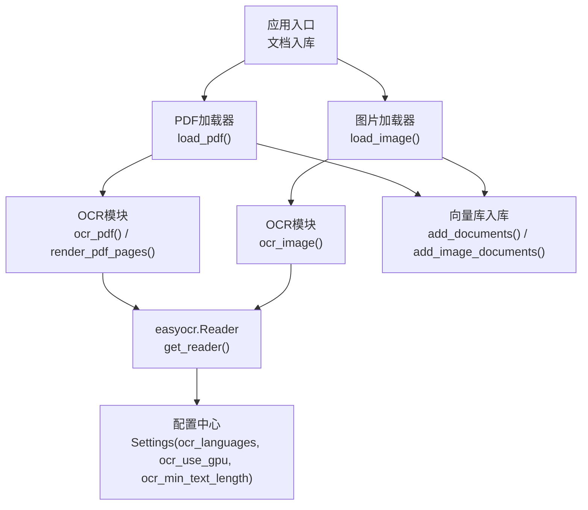
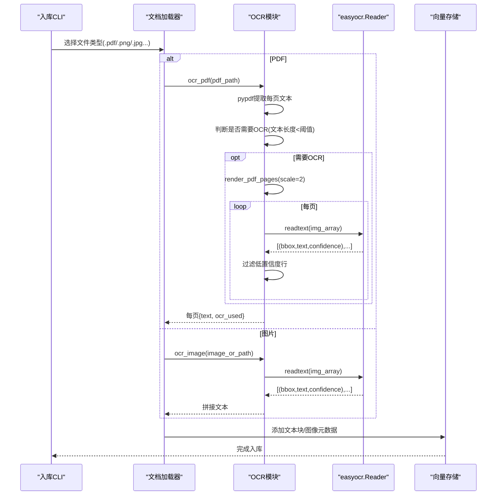
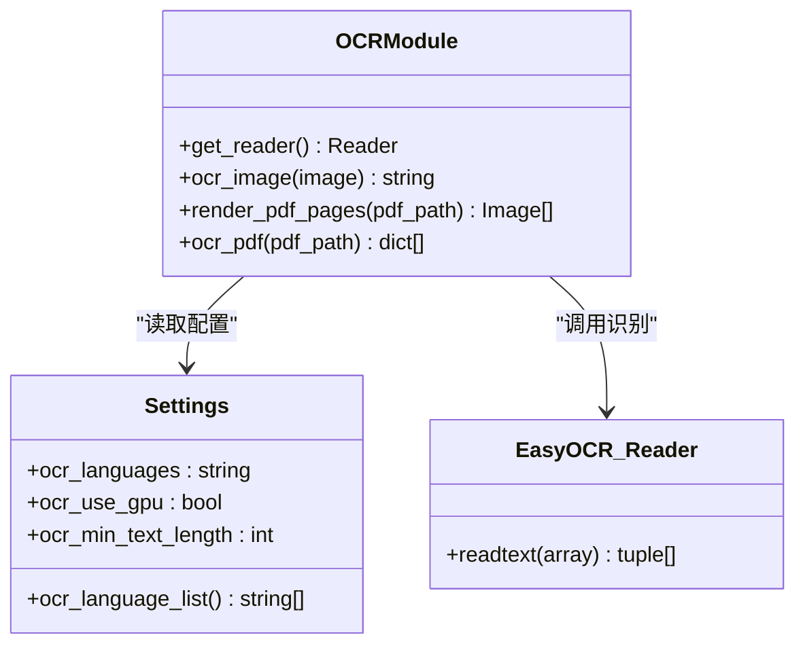
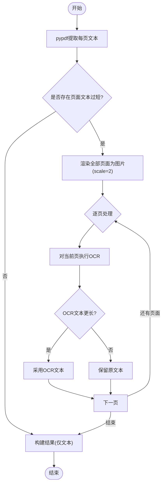
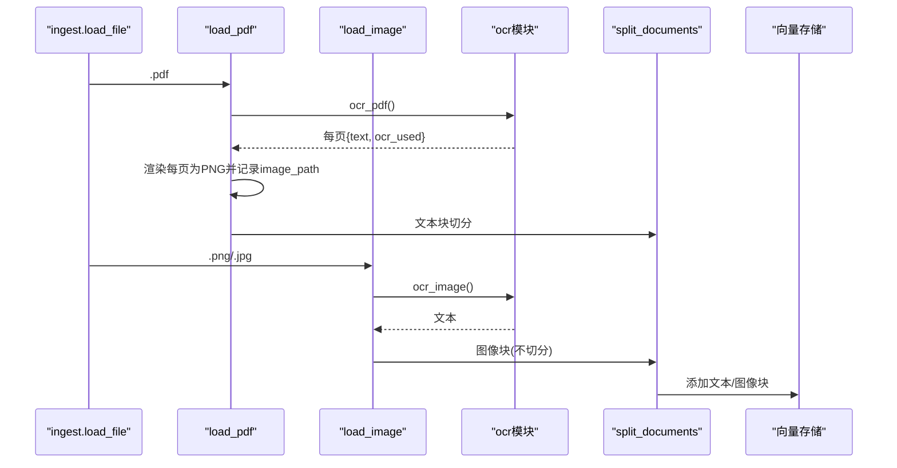
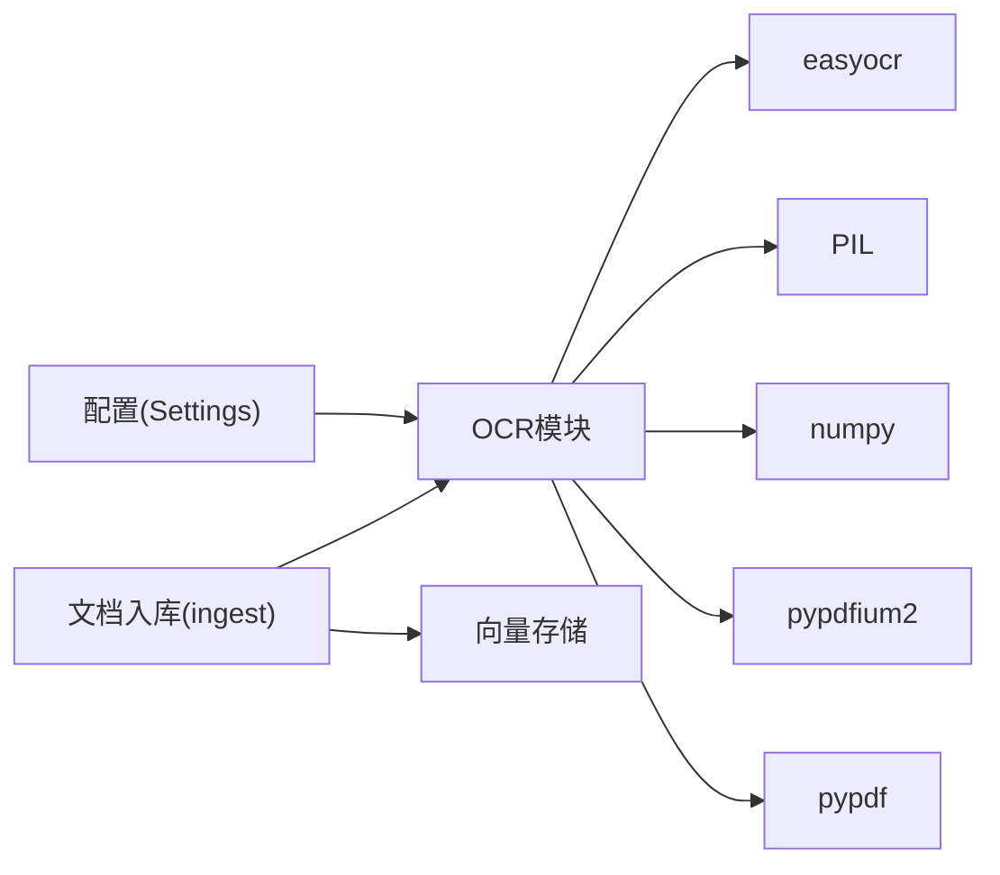

# OCR文字识别

<cite>
**本文引用的文件**
- [rag/ocr.py](file://rag/ocr.py)
- [config/settings.py](file://config/settings.py)
- [rag/ingest.py](file://rag/ingest.py)
- [scripts/prefetch_models.py](file://scripts/prefetch_models.py)
- [evaluation/rag_eval.py](file://evaluation/rag_eval.py)
</cite>

## 目录
1. [简介](#简介)
2. [项目结构](#项目结构)
3. [核心组件](#核心组件)
4. [架构总览](#架构总览)
5. [详细组件分析](#详细组件分析)
6. [依赖关系分析](#依赖关系分析)
7. [性能与优化](#性能与优化)
8. [效果评估](#效果评估)
9. [常见问题与排障](#常见问题与排障)
10. [结论](#结论)

## 简介
本模块基于 easyocr 实现图片与PDF的文字识别，提供：
- 图片OCR：对PIL Image或图片路径进行识别，返回拼接文本。
- PDF处理：优先用pypdf提取文本；若某页文本过少（阈值可配），则将该页渲染为高分辨率图片并走OCR兜底。
- 多语言支持：通过配置项指定语言列表（默认简体中文+英文）。
- 集成入库：在文档入库流程中自动调用OCR，生成可用于检索的文本块与图像元数据。

## 项目结构
OCR相关代码主要位于 rag/ocr.py，并通过 config/settings.py 暴露可配置参数；文档入库流程 rag/ingest.py 在加载PDF和图片时调用OCR；模型预取脚本 scripts/prefetch_models.py 用于启动前下载并校验easyocr模型；评估框架 evaluation/rag_eval.py 提供RAG质量评估能力，可作为OCR效果的间接评估手段。

图表来源
- [rag/ingest.py:43-91](file://rag/ingest.py#L43-L91)
- [rag/ingest.py:134-164](file://rag/ingest.py#L134-L164)
- [rag/ocr.py:26-69](file://rag/ocr.py#L26-L69)
- [rag/ocr.py:72-141](file://rag/ocr.py#L72-L141)
- [config/settings.py:102-166](file://config/settings.py#L102-L166)

章节来源
- [rag/ocr.py:1-141](file://rag/ocr.py#L1-L141)
- [config/settings.py:102-166](file://config/settings.py#L102-L166)
- [rag/ingest.py:43-164](file://rag/ingest.py#L43-L164)

## 核心组件
- OCR引擎初始化与单例：延迟加载 easyocr.Reader，按配置启用GPU与语言列表。
- 图片OCR：接受PIL Image或路径，内部转为numpy数组后调用readtext，过滤低置信度结果。
- PDF处理：先用pypdf提取文本，若任意页面文本长度低于阈值，则将全部页面渲染为高分辨率图片并逐页OCR，择优替换。
- 配置管理：集中管理OCR语言、是否使用GPU、触发OCR的文本长度阈值等。

章节来源
- [rag/ocr.py:26-69](file://rag/ocr.py#L26-L69)
- [rag/ocr.py:72-141](file://rag/ocr.py#L72-L141)
- [config/settings.py:102-166](file://config/settings.py#L102-L166)

## 架构总览
下图展示从文档入库到OCR识别再到向量入库的整体流程，突出“文本优先、扫描页OCR兜底”的策略。

图表来源
- [rag/ingest.py:43-91](file://rag/ingest.py#L43-L91)
- [rag/ingest.py:134-164](file://rag/ingest.py#L134-L164)
- [rag/ocr.py:72-141](file://rag/ocr.py#L72-L141)
- [rag/ocr.py:26-69](file://rag/ocr.py#L26-L69)

## 详细组件分析

### 组件A：OCR引擎与图片识别
- 职责：维护easyocr.Reader单例，提供图片OCR能力。
- 关键点：
  - 延迟初始化Reader，首次调用才加载模型，避免启动开销。
  - 支持从配置读取语言列表与GPU开关。
  - 将PIL Image转numpy数组以兼容easyocr输入。
  - 过滤置信度低于阈值的行，降低噪声。

图表来源
- [rag/ocr.py:26-69](file://rag/ocr.py#L26-L69)
- [config/settings.py:102-166](file://config/settings.py#L102-L166)

章节来源
- [rag/ocr.py:26-69](file://rag/ocr.py#L26-L69)
- [config/settings.py:102-166](file://config/settings.py#L102-L166)

### 组件B：PDF处理流水线
- 职责：对PDF逐页处理，优先文本提取，必要时回退到OCR。
- 关键点：
  - 使用pypdf提取文本，失败时降级为全量OCR。
  - 当任一页面文本长度小于阈值时，渲染全部页面为高分辨率图片（scale=2）并逐页OCR。
  - 比较OCR与原始文本长度，择优采用更丰富的内容。
  - 输出包含页码、文本与是否使用OCR标记的结构化结果。

图表来源
- [rag/ocr.py:94-141](file://rag/ocr.py#L94-L141)

章节来源
- [rag/ocr.py:94-141](file://rag/ocr.py#L94-L141)

### 组件C：入库集成
- 职责：在文档入库阶段调用OCR，生成可用于检索的文本块与图像元数据。
- 关键点：
  - PDF：生成文本Document（含页码与是否使用OCR标记），同时为每页保存PNG图像并生成图像Document（用于多模态检索）。
  - 图片：先OCR提取文本，再为原图生成图像Document。
  - 切分：文本块按配置进行递归字符切分，图像块直接保留。

图表来源
- [rag/ingest.py:43-91](file://rag/ingest.py#L43-L91)
- [rag/ingest.py:134-164](file://rag/ingest.py#L134-L164)
- [rag/ocr.py:72-141](file://rag/ocr.py#L72-L141)

章节来源
- [rag/ingest.py:43-164](file://rag/ingest.py#L43-L164)

## 依赖关系分析
- OCR模块依赖：
  - easyocr：提供多语言OCR能力，首次运行自动下载权重。
  - PIL/Pillow：图像处理。
  - numpy：数组转换。
  - pypdfium2：PDF页面渲染为高分辨率位图。
  - pypdf：优先尝试文本提取。
- 配置依赖：
  - Settings集中管理OCR语言、GPU开关、最小文本长度阈值等。
- 入库依赖：
  - ingest将OCR结果与图像元数据写入向量库，供后续检索与问答使用。

图表来源
- [rag/ocr.py:26-141](file://rag/ocr.py#L26-L141)
- [rag/ingest.py:43-164](file://rag/ingest.py#L43-L164)
- [config/settings.py:102-166](file://config/settings.py#L102-L166)

章节来源
- [rag/ocr.py:26-141](file://rag/ocr.py#L26-L141)
- [rag/ingest.py:43-164](file://rag/ingest.py#L43-L164)
- [config/settings.py:102-166](file://config/settings.py#L102-L166)

## 性能与优化
- 延迟初始化：Reader仅在首次OCR时创建，减少启动时间。
- 文本优先策略：PDF优先用pypdf提取文本，仅在必要时渲染并OCR，降低计算成本。
- 高分辨率渲染：PDF页面渲染使用scale=2提升清晰度，有助于提高OCR精度。
- GPU可选：可通过配置启用GPU加速，适合具备GPU环境的部署。
- 模型预取：提供脚本在启动前下载并校验easyocr模型，降低首次请求延迟与网络波动影响。
- 批量处理建议：对大量PDF/图片，建议在批处理任务中复用Reader实例，避免重复初始化。

章节来源
- [rag/ocr.py:26-69](file://rag/ocr.py#L26-L69)
- [rag/ocr.py:72-91](file://rag/ocr.py#L72-L91)
- [config/settings.py:102-105](file://config/settings.py#L102-L105)
- [scripts/prefetch_models.py:56-75](file://scripts/prefetch_models.py#L56-L75)

## 效果评估
- 内置指标：OCR过程中对识别结果按置信度过滤（默认阈值0.3），可有效抑制噪声。
- 间接评估：可使用RAG评估框架对最终答案的相关性、忠实度、帮助度等进行评测，从而间接衡量OCR对检索与生成的贡献。
- 实践建议：
  - 调整置信度阈值与最小文本长度阈值，平衡召回与准确率。
  - 针对特定场景（如表格、公式、手写体）增加预处理（去噪、二值化、倾斜校正）以提升精度。
  - 结合重排序与多路召回（BM25）提升整体检索质量。

章节来源
- [rag/ocr.py:67-69](file://rag/ocr.py#L67-L69)
- [evaluation/rag_eval.py:63-121](file://evaluation/rag_eval.py#L63-L121)

## 常见问题与排障
- 首次运行模型下载失败：
  - 现象：easyocr模型下载超时或连接重置。
  - 解决：使用预取脚本提前下载并校验模型；检查网络与镜像设置；适当重试。
- PDF文本提取失败：
  - 现象：pypdf无法提取文本。
  - 解决：系统会自动降级为全量OCR；确认PDF是否为扫描件或加密文件。
- OCR结果噪声较多：
  - 现象：出现乱码或无关片段。
  - 解决：提高置信度阈值；调整最小文本长度阈值；对图片做预处理（增强对比度、去噪）。
- 性能瓶颈：
  - 现象：大批量PDF/图片处理耗时较长。
  - 解决：启用GPU；批处理复用Reader；合理设置PDF渲染分辨率；拆分任务并行处理。
- 多语言识别不佳：
  - 现象：非中文/英文混合文档识别率低。
  - 解决：在配置中扩展语言列表；针对特定语言准备高质量训练数据或切换更合适的OCR引擎。

章节来源
- [scripts/prefetch_models.py:56-75](file://scripts/prefetch_models.py#L56-L75)
- [rag/ocr.py:108-139](file://rag/ocr.py#L108-L139)
- [rag/ocr.py:67-69](file://rag/ocr.py#L67-L69)
- [config/settings.py:102-105](file://config/settings.py#L102-L105)

## 结论
该OCR模块以“文本优先、扫描页OCR兜底”为核心策略，结合可配置的多语言支持与GPU加速，能够在多种文档形态下稳定提取文字。通过合理的阈值调优、预处理与性能优化，可在保证精度的同时控制资源消耗。配合RAG评估体系，可持续监控并改进OCR对整体问答质量的贡献。