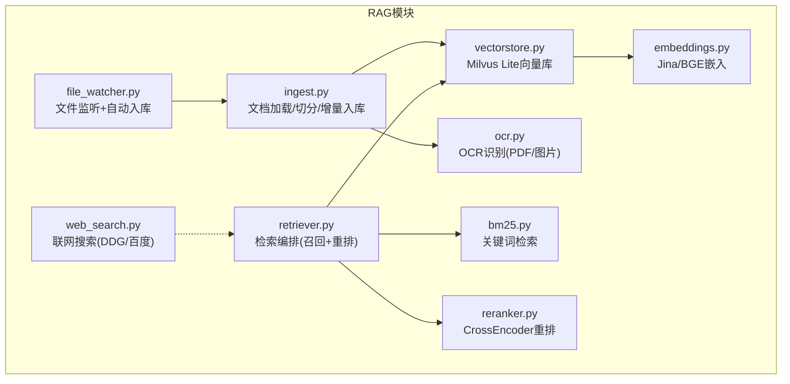
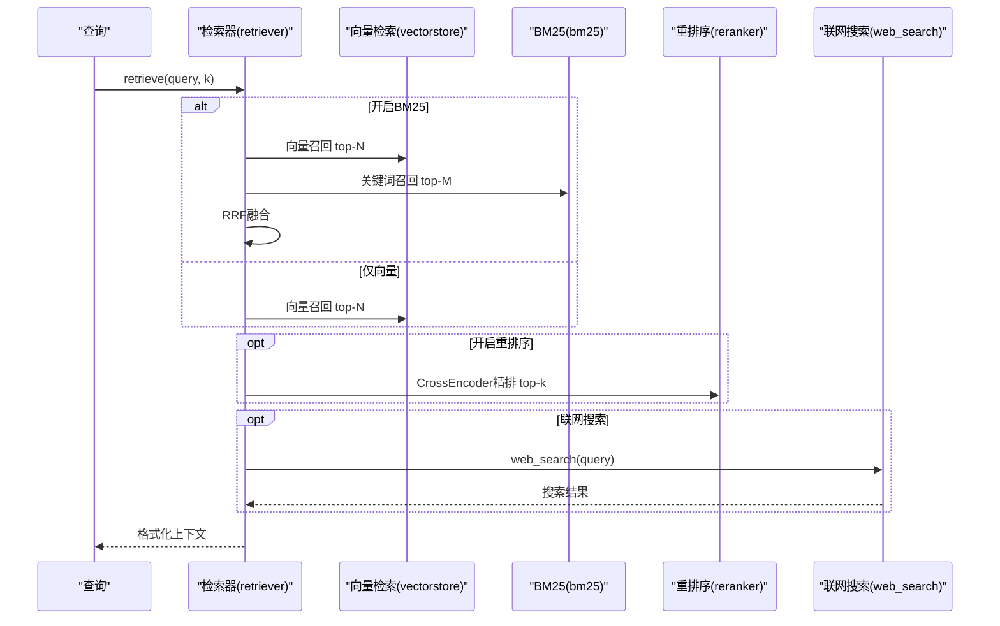
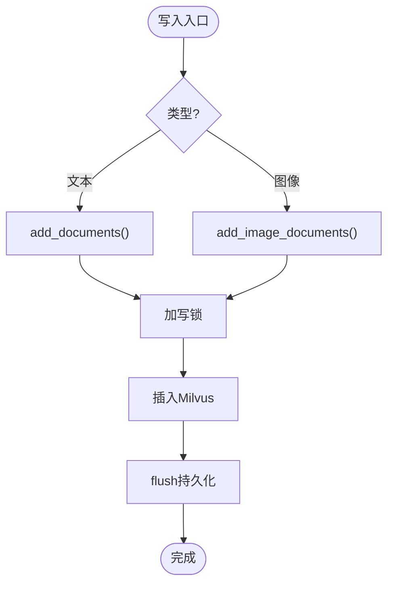
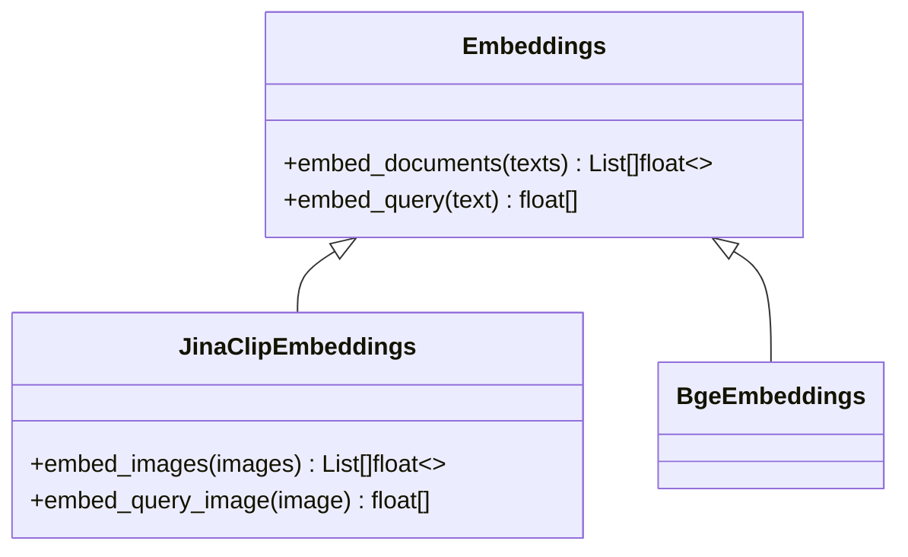
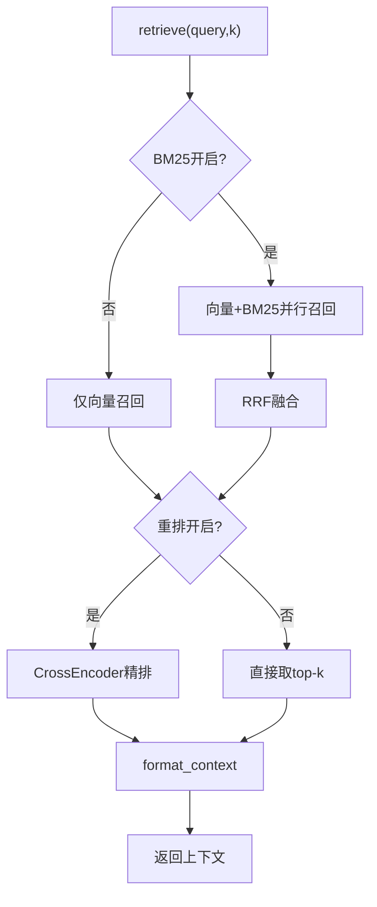
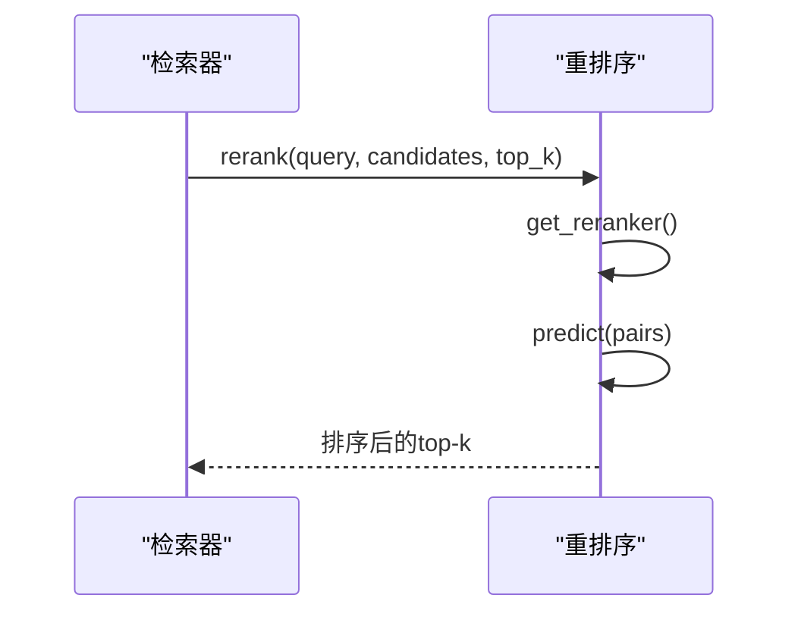
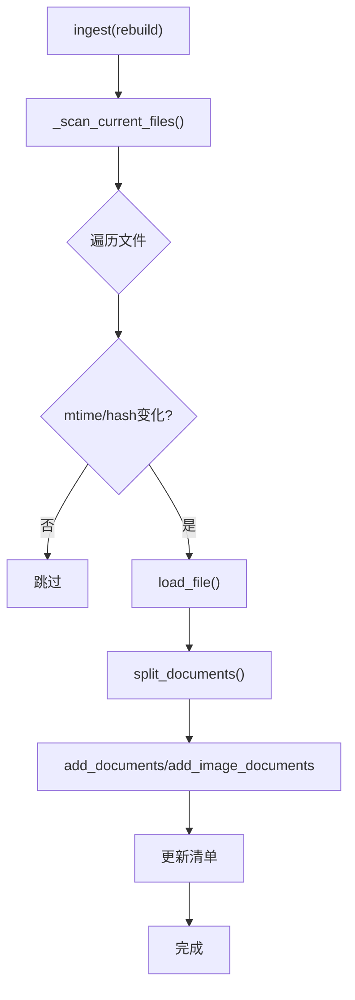
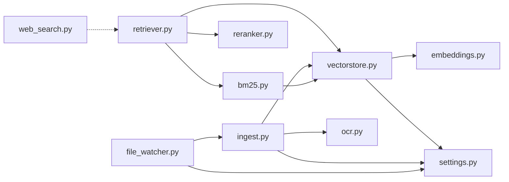

# RAG检索模块目录

<cite>
**本文引用的文件**
- [vectorstore.py](file://rag/vectorstore.py)
- [embeddings.py](file://rag/embeddings.py)
- [retriever.py](file://rag/retriever.py)
- [reranker.py](file://rag/reranker.py)
- [ingest.py](file://rag/ingest.py)
- [bm25.py](file://rag/bm25.py)
- [ocr.py](file://rag/ocr.py)
- [file_watcher.py](file://rag/file_watcher.py)
- [web_search.py](file://rag/web_search.py)
- [settings.py](file://config/settings.py)
</cite>

## 目录
1. [简介](#简介)
2. [项目结构](#项目结构)
3. [核心组件](#核心组件)
4. [架构总览](#架构总览)
5. [详细组件分析](#详细组件分析)
6. [依赖关系分析](#依赖关系分析)
7. [性能优化建议](#性能优化建议)
8. [故障排除指南](#故障排除指南)
9. [结论](#结论)
10. [附录：配置项速查](#附录配置项速查)

## 简介
本模块为RAG（检索增强生成）的知识库与检索子系统，提供多模态文档入库、向量存储、关键词检索、重排序、OCR识别、文件监听自动同步以及联网搜索等能力。通过“向量检索 + BM25关键词检索”的多路召回与CrossEncoder重排序，兼顾召回率与准确率；结合Milvus Lite本地持久化，无需独立部署向量服务即可运行。

## 项目结构
RAG相关代码集中在 rag/ 目录下，按职责划分清晰：
- 向量存储：vectorstore.py（Milvus Lite封装，文本/图像混合存储）
- 嵌入模型：embeddings.py（Jina CLIP v2多模态、BGE纯文本）
- 检索器：retriever.py（两阶段检索：召回+重排，支持BM25融合）
- 重排序：reranker.py（CrossEncoder精排）
- 文档入库：ingest.py（增量入库、切片、多格式解析、清单管理）
- 关键词检索：bm25.py（内存BM25索引，与向量检索互补）
- OCR识别：ocr.py（easyocr图片/PDF识别，PDF页渲染）
- 文件监听：file_watcher.py（watchdog事件+防抖队列，自动增量入库）
- 联网搜索：web_search.py（DuckDuckGo优先，百度回退）

图表来源
- [vectorstore.py:1-282](file://rag/vectorstore.py#L1-L282)
- [embeddings.py:1-180](file://rag/embeddings.py#L1-L180)
- [retriever.py:1-140](file://rag/retriever.py#L1-L140)
- [reranker.py:1-98](file://rag/reranker.py#L1-L98)
- [ingest.py:1-402](file://rag/ingest.py#L1-L402)
- [bm25.py:1-106](file://rag/bm25.py#L1-L106)
- [ocr.py:1-142](file://rag/ocr.py#L1-L142)
- [file_watcher.py:1-151](file://rag/file_watcher.py#L1-L151)
- [web_search.py:1-134](file://rag/web_search.py#L1-L134)

章节来源
- [vectorstore.py:1-282](file://rag/vectorstore.py#L1-L282)
- [settings.py:19-216](file://config/settings.py#L19-L216)

## 核心组件
- 向量存储（Milvus Lite）：提供集合创建、文本/图像混合写入、相似度检索、统计与清理能力；读写并发安全由写锁保护。
- 嵌入模型：默认使用Jina CLIP v2实现文本/图像统一向量空间；可选BGE纯文本模型以提升纯文本场景速度。
- 检索器：根据配置组合向量检索、BM25关键词检索与CrossEncoder重排序，输出带相关度的上下文片段。
- 重排序：对候选结果进行query-doc交叉编码打分，提升最终top-k质量。
- 文档入库：支持txt/md/pdf/docx/xlsx及多种图片格式；增量更新基于mtime+hash指纹与清单管理；PDF优先文本提取，不足时OCR兜底并生成页面图像。
- 关键词检索：从向量库拉取文本文档构建内存BM25索引，字符级分词，适合精确匹配召回。
- OCR识别：easyocr读取图片/PDF页，支持GPU加速；PDF先尝试pypdf文本提取，过少则整页OCR。
- 文件监听：watchdog检测docs_dir增删改，防抖后触发增量入库，并重置BM25索引。
- 联网搜索：DuckDuckGo优先，失败回退百度；结果格式化后可注入生成上下文。

章节来源
- [vectorstore.py:29-190](file://rag/vectorstore.py#L29-L190)
- [embeddings.py:29-180](file://rag/embeddings.py#L29-L180)
- [retriever.py:18-140](file://rag/retriever.py#L18-L140)
- [reranker.py:30-98](file://rag/reranker.py#L30-L98)
- [ingest.py:34-216](file://rag/ingest.py#L34-L216)
- [bm25.py:22-106](file://rag/bm25.py#L22-L106)
- [ocr.py:26-142](file://rag/ocr.py#L26-L142)
- [file_watcher.py:34-151](file://rag/file_watcher.py#L34-L151)
- [web_search.py:19-134](file://rag/web_search.py#L19-L134)

## 架构总览
RAG检索流程遵循“召回→精排→上下文组装”的两阶段范式，并可根据配置启用BM25多路召回与联网搜索补充。

图表来源
- [retriever.py:18-52](file://rag/retriever.py#L18-L52)
- [vectorstore.py:164-190](file://rag/vectorstore.py#L164-L190)
- [bm25.py:69-97](file://rag/bm25.py#L69-L97)
- [reranker.py:54-98](file://rag/reranker.py#L54-L98)
- [web_search.py:76-134](file://rag/web_search.py#L76-L134)

## 详细组件分析

### 向量存储（Milvus Lite）
- 单例初始化：延迟加载LangChain Milvus实例，连接参数指向本地.db文件，启用动态字段以兼容文本/图像异构metadata。
- 写入路径：add_documents用于文本块；add_image_documents通过多模态Embedding的embed_images编码图像，并使用底层client.insert写入。
- 检索路径：search调用similarity_search_with_score并按阈值过滤低相关度结果；get_retriever返回LangChain retriever对象。
- 维护能力：count_documents获取行数；drop_collection清空集合；delete_by_ids按主键删除；get_all_text_documents用于构建BM25索引。
- 并发安全：写入操作加线程锁，避免文件监听消费线程与检索路径并发写入冲突。

图表来源
- [vectorstore.py:79-161](file://rag/vectorstore.py#L79-L161)
- [vectorstore.py:164-190](file://rag/vectorstore.py#L164-L190)
- [vectorstore.py:193-282](file://rag/vectorstore.py#L193-L282)

章节来源
- [vectorstore.py:29-190](file://rag/vectorstore.py#L29-L190)
- [vectorstore.py:193-282](file://rag/vectorstore.py#L193-L282)

### 嵌入模型（Jina CLIP v2 / BGE）
- JinaClipEmbeddings：实现langchain Embeddings接口，支持文本与图像统一向量空间（维度1024），内置L2归一化；延迟加载模型，首次调用下载权重。
- BgeEmbeddings：纯文本快速模型（维度512），CPU下比多模态快约30倍，适合纯文本知识库。
- get_embeddings：根据配置自动选择模型（含bge则用BGE，否则用Jina）。

图表来源
- [embeddings.py:29-129](file://rag/embeddings.py#L29-L129)
- [embeddings.py:131-180](file://rag/embeddings.py#L131-L180)

章节来源
- [embeddings.py:29-180](file://rag/embeddings.py#L29-L180)

### 检索器（召回+重排）
- retrieve：根据配置决定多路召回策略（BM25+向量→RRF融合→可选重排；或仅向量→可选重排；或直接top-k）。
- _hybrid_recall：并行执行向量检索与BM25关键词检索，任一为空回退另一路；两者均存在则RRF融合。
- _rrf_fusion：按排名计算融合分数，合并相同内容chunk的得分。
- format_context：将检索结果转换为上下文字符串，统一分数到0~1区间便于展示。

图表来源
- [retriever.py:18-140](file://rag/retriever.py#L18-L140)

章节来源
- [retriever.py:18-140](file://rag/retriever.py#L18-L140)

### 重排序（CrossEncoder）
- get_reranker：延迟加载CrossEncoder模型（默认bge-reranker-base），设置最大长度与设备。
- rerank：构造query-doc对，批量预测得分，按分数降序取top-k；异常时回退原始结果。

图表来源
- [reranker.py:30-98](file://rag/reranker.py#L30-L98)

章节来源
- [reranker.py:30-98](file://rag/reranker.py#L30-L98)

### 文档入库（增量与多格式）
- 支持格式：txt/md/pdf/docx/xlsx及png/jpg/jpeg/bmp/tiff。
- 文本/图片处理：文本直接入库；PDF优先pypdf提取文本，不足则OCR兜底并生成页面图像；图片OCR提取文本并生成图像Document。
- 切片：RecursiveCharacterTextSplitter按配置切分文本，图像不切分直接入库。
- 增量机制：基于mtime预筛与md5哈希确认变化；修改文件先删旧chunk再入库；删除文件清理孤儿chunk；清单.json记录每个文件的hash/mtime/chunk_ids。
- CLI：--rebuild清空集合重建索引；默认增量模式。

图表来源
- [ingest.py:289-388](file://rag/ingest.py#L289-L388)
- [ingest.py:34-216](file://rag/ingest.py#L34-L216)

章节来源
- [ingest.py:34-216](file://rag/ingest.py#L34-L216)
- [ingest.py:289-388](file://rag/ingest.py#L289-L388)

### BM25关键词检索
- 索引构建：从向量库拉取全部文本文档（跳过图像），字符级切分构建BM25Okapi索引；进程内单例缓存。
- 检索：查询同样字符级切分，返回score>0的top-k结果；无索引或无命中返回空列表。
- 重置：向量库重建后需重置索引以反映最新数据。

章节来源
- [bm25.py:22-106](file://rag/bm25.py#L22-L106)

### OCR识别
- 图片OCR：easyocr读取PIL Image或路径，过滤置信度低于阈值的行，拼接为文本。
- PDF处理：先用pypdf逐页提取文本；若任一页文本少于阈值，则渲染全部页为图片并OCR；比较OCR与提取文本长度择优。
- GPU支持：可按配置启用GPU加速。

章节来源
- [ocr.py:26-142](file://rag/ocr.py#L26-L142)

### 文件监听（自动同步）
- 事件捕获：watchdog监听docs_dir顶层文件增删改移动事件，仅对支持扩展名触发信号。
- 防抖消费：消费者线程阻塞等待首个信号，随后在防抖窗口内持续清空队列，窗口结束后执行增量入库。
- 联动：入库完成后重置BM25索引（如开启），保证检索一致性。

章节来源
- [file_watcher.py:34-151](file://rag/file_watcher.py#L34-L151)

### 联网搜索
- 双引擎：优先DuckDuckGo，失败或无结果回退百度；统一返回[{title,url,snippet}]。
- 格式化：将结果转为带来源标记的文本块，便于注入生成上下文。

章节来源
- [web_search.py:19-134](file://rag/web_search.py#L19-L134)

## 依赖关系分析
- retriever依赖vectorstore与bm25，并在需要时调用reranker。
- vectorstore依赖embeddings与settings。
- ingest依赖ocr、vectorstore与settings。
- file_watcher依赖ingest与settings。
- bm25依赖vectorstore（拉取文本文档）与rank_bm25。
- web_search为独立模块，可被上层编排接入检索流程。

图表来源
- [retriever.py:18-52](file://rag/retriever.py#L18-L52)
- [vectorstore.py:29-190](file://rag/vectorstore.py#L29-L190)
- [ingest.py:289-388](file://rag/ingest.py#L289-L388)
- [bm25.py:22-106](file://rag/bm25.py#L22-L106)
- [file_watcher.py:107-151](file://rag/file_watcher.py#L107-L151)
- [web_search.py:76-134](file://rag/web_search.py#L76-L134)

章节来源
- [retriever.py:18-52](file://rag/retriever.py#L18-L52)
- [vectorstore.py:29-190](file://rag/vectorstore.py#L29-L190)
- [ingest.py:289-388](file://rag/ingest.py#L289-L388)
- [bm25.py:22-106](file://rag/bm25.py#L22-L106)
- [file_watcher.py:107-151](file://rag/file_watcher.py#L107-L151)
- [web_search.py:76-134](file://rag/web_search.py#L76-L134)

## 性能优化建议
- 嵌入模型选择
  - 纯文本知识库：启用BGE模型（embedding_model含bge），CPU下显著提速。
  - 多模态需求：使用Jina CLIP v2，注意首次加载耗时，建议预热或后台启动。
- 向量库与索引
  - Milvus Lite使用FLAT索引与L2距离，简单稳定；如需更大规模可考虑外部Milvus服务与更优索引类型。
  - 调整rag_top_k与rag_score_filter平衡召回与噪声。
- 重排序
  - 合理设置rerank_candidate_count与rerank_top_k，候选过多会增加CrossEncoder计算量。
  - 关闭rerank_enabled可换取更低延迟。
- BM25
  - 仅在需要精确匹配时开启rag_bm25_enabled；注意内存占用随文档规模增长。
  - 定期重建索引（向量库变更后需reset_bm25_index）。
- 切片策略
  - 调整rag_chunk_size与rag_chunk_overlap，避免语义截断或碎片过多。
- OCR
  - 启用GPU（ocr_use_gpu=true）可显著提升OCR吞吐；合理设置ocr_min_text_length减少不必要的OCR。
- 文件监听
  - 调整rag_auto_sync_debounce避免频繁入库；确保docs_dir权限正确。
- 联网搜索
  - 控制max_results与超时，避免长尾请求拖慢整体响应。

[本节为通用指导，不直接分析具体文件]

## 故障排除指南
- 向量库写入失败或不可见
  - 检查Milvus Lite数据库路径与权限；确认flush成功；查看日志中flush警告。
  - 参考：[vectorstore.py:97-106](file://rag/vectorstore.py#L97-L106)、[vectorstore.py:157-161](file://rag/vectorstore.py#L157-L161)
- 重排序失败
  - 检查CrossEncoder模型是否成功加载；网络镜像是否可达；异常时会自动回退原始结果。
  - 参考：[reranker.py:77-98](file://rag/reranker.py#L77-L98)
- BM25索引为空
  - 确认向量库中存在文本文档且非图像类型；必要时调用reset_bm25_index。
  - 参考：[bm25.py:32-66](file://rag/bm25.py#L32-L66)、[bm25.py:100-106](file://rag/bm25.py#L100-L106)
- OCR识别失败
  - 检查easyocr模型下载与GPU可用性；PDF文本提取失败会降级全量OCR。
  - 参考：[ocr.py:108-142](file://rag/ocr.py#L108-L142)
- 文件监听未触发
  - 确认rag_auto_sync_enabled为true；docs_dir存在且有写入权限；watchdog仅监听顶层目录。
  - 参考：[file_watcher.py:107-151](file://rag/file_watcher.py#L107-L151)
- 联网搜索无结果
  - DuckDuckGo不可用时自动回退百度；检查网络与超时配置。
  - 参考：[web_search.py:76-94](file://rag/web_search.py#L76-L94)

章节来源
- [vectorstore.py:97-106](file://rag/vectorstore.py#L97-L106)
- [vectorstore.py:157-161](file://rag/vectorstore.py#L157-L161)
- [reranker.py:77-98](file://rag/reranker.py#L77-L98)
- [bm25.py:32-66](file://rag/bm25.py#L32-L66)
- [bm25.py:100-106](file://rag/bm25.py#L100-L106)
- [ocr.py:108-142](file://rag/ocr.py#L108-L142)
- [file_watcher.py:107-151](file://rag/file_watcher.py#L107-L151)
- [web_search.py:76-94](file://rag/web_search.py#L76-L94)

## 结论
本RAG检索模块通过多模态嵌入、向量存储、关键词检索与重排序的组合，提供了高召回与高精度的检索能力；配合增量入库、文件监听与OCR，实现了“即插即用”的知识库自动化流水线。按需开启BM25与联网搜索可进一步提升覆盖范围与时效性。建议在大规模场景下评估外部向量服务与索引策略，并结合硬件资源优化嵌入与重排序性能。

[本节为总结性内容，不直接分析具体文件]

## 附录：配置项速查
- 嵌入模型
  - embedding_model：模型名称（含bge则使用BGE，否则Jina CLIP v2）
  - embedding_device：推理设备（cpu/gpu）
- 向量库
  - milvus_db_file：本地.db路径
  - milvus_collection：集合名
  - milvus_index_type：索引类型（Lite下为FLAT）
  - milvus_metric_type：距离度量（L2）
  - rag_top_k：默认返回条数
  - rag_score_filter：向量检索分数过滤阈值
  - rag_min_relevance：最低相关度阈值
- 切片与文档目录
  - rag_chunk_size：切片大小
  - rag_chunk_overlap：重叠大小
  - rag_docs_dir：知识文档目录
- 自动同步
  - rag_auto_sync_enabled：是否启用文件监听
  - rag_auto_sync_debounce：防抖时间（秒）
- 多路召回
  - rag_bm25_enabled：是否启用BM25
  - rag_bm25_candidate_count：BM25候选数
  - rag_rrf_k：RRF融合常数
- 重排序
  - rerank_enabled：是否启用重排序
  - rerank_model：CrossEncoder模型
  - rerank_device：设备
  - rerank_candidate_count：向量召回候选数
  - rerank_top_k：重排后返回条数
- OCR
  - ocr_languages：语言列表（逗号分隔）
  - ocr_use_gpu：是否使用GPU
  - ocr_min_text_length：触发OCR的文本长度阈值
- 联网搜索
  - web_search_enabled：是否启用
  - web_search_max_results：最大结果数
  - web_search_timeout：超时（秒）

章节来源
- [settings.py:50-112](file://config/settings.py#L50-L112)