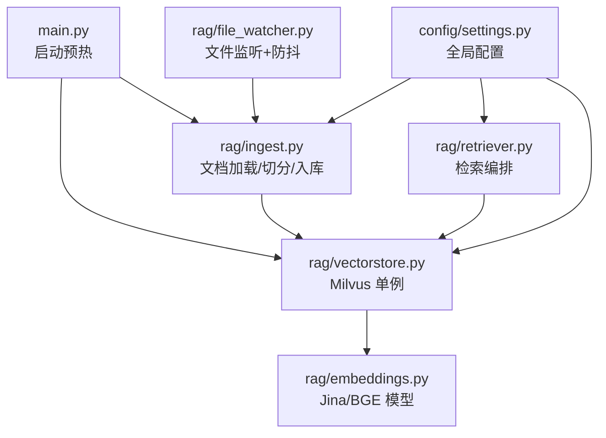
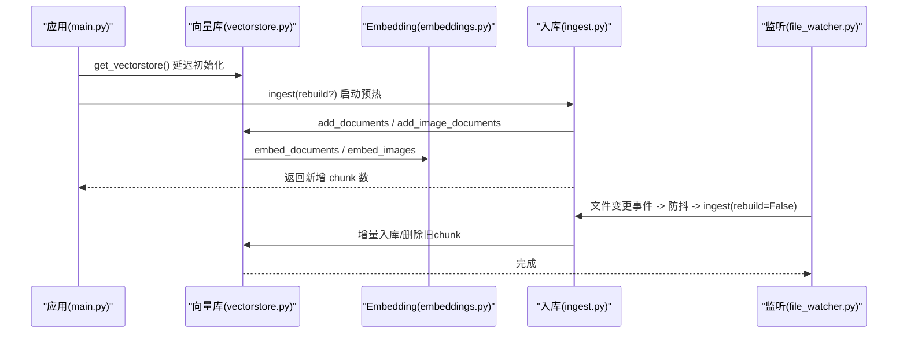
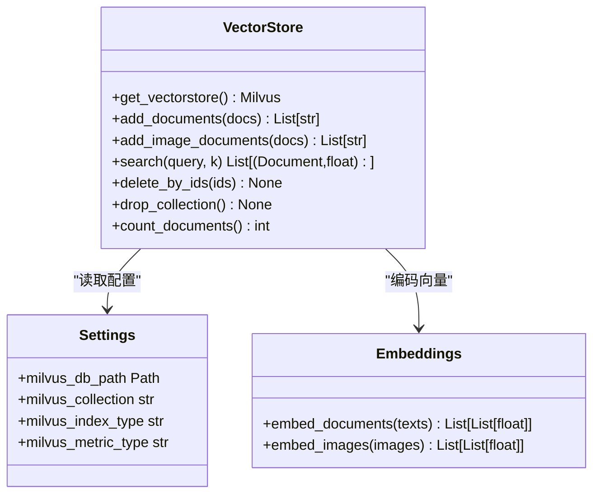
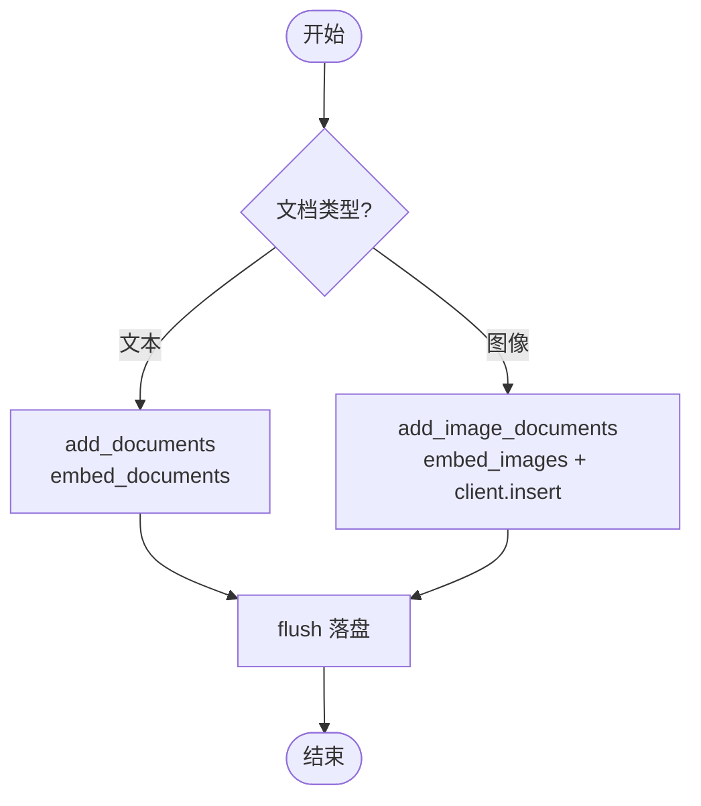
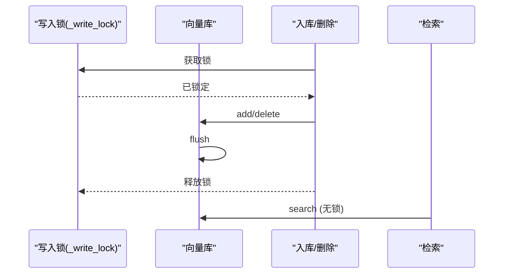
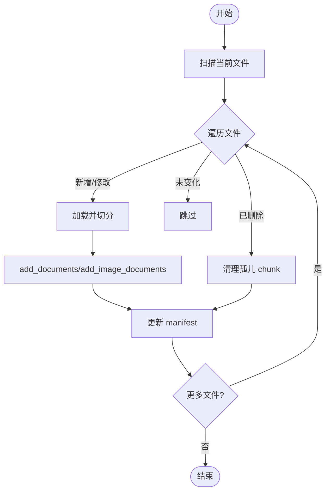
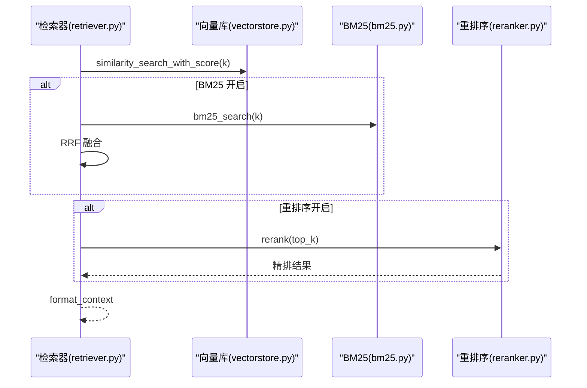
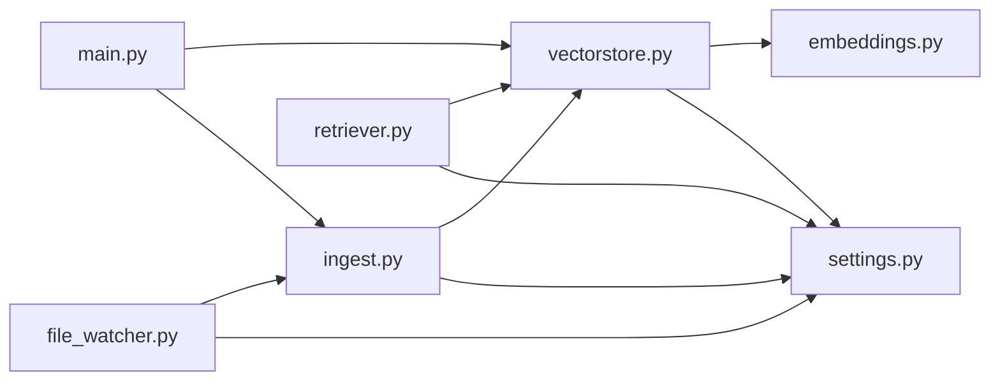

# 向量存储管理

<cite>
**本文引用的文件**
- [vectorstore.py](file://rag/vectorstore.py)
- [embeddings.py](file://rag/embeddings.py)
- [settings.py](file://config/settings.py)
- [ingest.py](file://rag/ingest.py)
- [retriever.py](file://rag/retriever.py)
- [file_watcher.py](file://rag/file_watcher.py)
- [main.py](file://main.py)
</cite>

## 目录
1. [简介](#简介)
2. [项目结构](#项目结构)
3. [核心组件](#核心组件)
4. [架构总览](#架构总览)
5. [详细组件分析](#详细组件分析)
6. [依赖关系分析](#依赖关系分析)
7. [性能考虑](#性能考虑)
8. [故障排除指南](#故障排除指南)
9. [结论](#结论)
10. [附录：配置参数说明](#附录：配置参数说明)

## 简介
本模块基于 Milvus Lite（本地 .db 文件持久化）提供向量存储能力，支持文本与图像的多模态检索。通过单例模式延迟初始化向量库实例，使用写入锁保障并发安全；结合文档入库、检索、删除等接口，配合启动预热与运行时文件监听实现自动增量同步。

## 项目结构
- 向量存储封装：rag/vectorstore.py
- 多模态 Embedding：rag/embeddings.py
- 全局配置：config/settings.py
- 文档加载与入库：rag/ingest.py
- 检索编排：rag/retriever.py
- 运行时文件监听与增量同步：rag/file_watcher.py
- 应用启动与预热：main.py

图表来源
- [main.py:80-135](file://main.py#L80-L135)
- [vectorstore.py:29-76](file://rag/vectorstore.py#L29-L76)
- [ingest.py:289-388](file://rag/ingest.py#L289-L388)
- [file_watcher.py:107-140](file://rag/file_watcher.py#L107-L140)
- [retriever.py:18-52](file://rag/retriever.py#L18-L52)
- [embeddings.py:164-179](file://rag/embeddings.py#L164-L179)
- [settings.py:19-100](file://config/settings.py#L19-L100)

章节来源
- [main.py:80-135](file://main.py#L80-L135)
- [vectorstore.py:29-76](file://rag/vectorstore.py#L29-L76)
- [ingest.py:289-388](file://rag/ingest.py#L289-L388)
- [file_watcher.py:107-140](file://rag/file_watcher.py#L107-L140)
- [retriever.py:18-52](file://rag/retriever.py#L18-L52)
- [embeddings.py:164-179](file://rag/embeddings.py#L164-L179)
- [settings.py:19-100](file://config/settings.py#L19-L100)

## 核心组件
- Milvus 向量库单例：延迟初始化，连接本地 .db 文件，启用动态字段以兼容异构 metadata。
- 多模态 Embedding：Jina CLIP v2（文本+图像统一空间），BGE（纯文本快速路径）。
- 文档入库：文本走 embed_documents，图像走 embed_images 并直接插入实体。
- 检索：相似度搜索 + 分数过滤，可选 BM25 多路召回与重排序融合。
- 删除：按主键 id 列表删除，并 flush 确保落盘。
- 启动预热：服务启动时检查向量库是否为空，必要时触发全量或增量入库。
- 运行时同步：watchdog 监听 docs_dir，防抖后触发增量入库。

章节来源
- [vectorstore.py:29-106](file://rag/vectorstore.py#L29-L106)
- [vectorstore.py:109-161](file://rag/vectorstore.py#L109-L161)
- [vectorstore.py:164-205](file://rag/vectorstore.py#L164-L205)
- [vectorstore.py:208-245](file://rag/vectorstore.py#L208-L245)
- [embeddings.py:29-128](file://rag/embeddings.py#L29-L128)
- [retriever.py:18-52](file://rag/retriever.py#L18-L52)
- [main.py:80-135](file://main.py#L80-L135)
- [file_watcher.py:71-105](file://rag/file_watcher.py#L71-L105)

## 架构总览
系统采用“启动预热 + 运行时监听”的双通道数据同步策略：
- 启动阶段：检查向量库状态，若为空则全量重建；否则执行增量更新。
- 运行阶段：文件变更事件经防抖聚合后触发增量入库，保证最终一致性。
- 检索阶段：根据配置选择仅向量检索、BM25 多路召回融合、或加入重排序精排。

图表来源
- [main.py:80-135](file://main.py#L80-L135)
- [vectorstore.py:29-106](file://rag/vectorstore.py#L29-L106)
- [vectorstore.py:109-161](file://rag/vectorstore.py#L109-L161)
- [ingest.py:289-388](file://rag/ingest.py#L289-L388)
- [file_watcher.py:71-105](file://rag/file_watcher.py#L71-L105)

## 详细组件分析

### Milvus 向量库单例与初始化
- 延迟初始化：首次调用 get_vectorstore 时才创建 LangChain Milvus 实例，避免启动开销。
- 本地持久化：connection_args.uri 指向 data/milvus/milvus_lite.db，无需独立服务。
- 动态字段：enable_dynamic_field=True，允许文本与图像的异构 metadata 共存。
- gRPC keepalive：禁用空闲 ping，避免 BGE/Jina 模型首次加载期间频繁 ping 导致断连。
- 索引与度量：index_type=FLAT，metric_type=L2（距离越小越相关）。

图表来源
- [vectorstore.py:29-76](file://rag/vectorstore.py#L29-L76)
- [settings.py:54-73](file://config/settings.py#L54-L73)
- [embeddings.py:164-179](file://rag/embeddings.py#L164-L179)

章节来源
- [vectorstore.py:29-76](file://rag/vectorstore.py#L29-L76)
- [settings.py:54-73](file://config/settings.py#L54-L73)

### 多模态支持机制（文本与图像）
- 文本入库：add_documents 使用 embed_documents 编码，LangChain Milvus 自动处理 schema。
- 图像入库：add_image_documents 提取 image_path，调用 embed_images 生成向量，并通过底层 client.insert 直接写入实体，绕过文本路径。
- 元数据兼容：动态字段开启后，metadata 中每个 key 作为独立字段存储，文本/图像可共存于同一 collection。
- 查询一致：search 对文本查询同时检索文本与图像混合结果（因同空间编码）。

图表来源
- [vectorstore.py:79-106](file://rag/vectorstore.py#L79-L106)
- [vectorstore.py:109-161](file://rag/vectorstore.py#L109-L161)
- [embeddings.py:67-128](file://rag/embeddings.py#L67-L128)

章节来源
- [vectorstore.py:79-161](file://rag/vectorstore.py#L79-L161)
- [embeddings.py:67-128](file://rag/embeddings.py#L67-L128)

### 单例模式设计原理
- 向量库单例：模块级 _vs 变量，首次访问时初始化，后续复用，避免重复连接与资源浪费。
- 配置单例：get_settings 使用 lru_cache 缓存 Settings 实例，减少解析开销。
- Embedding 单例：get_embeddings 根据配置选择 Jina 或 BGE，并缓存实例。

章节来源
- [vectorstore.py:22-76](file://rag/vectorstore.py#L22-L76)
- [settings.py:212-216](file://config/settings.py#L212-L216)
- [embeddings.py:164-179](file://rag/embeddings.py#L164-L179)

### 写入锁的并发控制策略
- 线程锁：_write_lock = threading.Lock() 保护 add/delete 操作，避免文件监听消费线程与检索路径并发写入冲突。
- 读操作：search 为读操作，Milvus Lite 支持读写并发，无需加锁。
- 关键位置：add_documents、add_image_documents、delete_by_ids 均在 with _write_lock 块内执行，并在写入后 flush。

图表来源
- [vectorstore.py:22-26](file://rag/vectorstore.py#L22-L26)
- [vectorstore.py:79-106](file://rag/vectorstore.py#L79-L106)
- [vectorstore.py:109-161](file://rag/vectorstore.py#L109-L161)
- [vectorstore.py:225-245](file://rag/vectorstore.py#L225-L245)

章节来源
- [vectorstore.py:22-26](file://rag/vectorstore.py#L22-L26)
- [vectorstore.py:79-106](file://rag/vectorstore.py#L79-L106)
- [vectorstore.py:109-161](file://rag/vectorstore.py#L109-L161)
- [vectorstore.py:225-245](file://rag/vectorstore.py#L225-L245)

### 文档入库流程（含增量与重建）
- 支持格式：txt/md/pdf/docx/xlsx/png/jpg/jpeg/bmp/tiff。
- 文本切分：RecursiveCharacterTextSplitter，大小与重叠由配置决定；图像文档不参与切分。
- 增量逻辑：mtime 预筛 + hash 确认；修改文件先删旧 chunk 再入库；删除文件清理孤儿 chunk。
- 清单管理：.ingest_manifest.json 记录文件名到 hash/mtime/chunk_ids 的映射。

图表来源
- [ingest.py:185-216](file://rag/ingest.py#L185-L216)
- [ingest.py:289-388](file://rag/ingest.py#L289-L388)

章节来源
- [ingest.py:185-216](file://rag/ingest.py#L185-L216)
- [ingest.py:289-388](file://rag/ingest.py#L289-L388)

### 检索与重排序
- 基础检索：similarity_search_with_score，支持分数过滤 rag_score_filter。
- 多路召回：可选 BM25 并行召回，RRF 融合两路结果。
- 重排序：可选 CrossEncoder 精排，提升精确匹配质量。
- 上下文格式化：将检索结果转为带来源与相关度的字符串供生成节点使用。

图表来源
- [retriever.py:18-52](file://rag/retriever.py#L18-L52)
- [retriever.py:55-110](file://rag/retriever.py#L55-L110)
- [vectorstore.py:164-184](file://rag/vectorstore.py#L164-L184)

章节来源
- [retriever.py:18-52](file://rag/retriever.py#L18-L52)
- [retriever.py:55-110](file://rag/retriever.py#L55-L110)
- [vectorstore.py:164-184](file://rag/vectorstore.py#L164-L184)

### 启动预热与运行时同步
- 启动预热：warmup_vectorstore 在后台线程检查向量库状态，必要时触发全量或增量入库；可选预热 BM25 索引。
- 运行时同步：start_file_watcher 启动 watchdog 监听 docs_dir，事件经防抖后调用 ingest(rebuild=False)。

章节来源
- [main.py:80-135](file://main.py#L80-L135)
- [file_watcher.py:71-105](file://rag/file_watcher.py#L71-L105)
- [file_watcher.py:107-140](file://rag/file_watcher.py#L107-L140)

## 依赖关系分析
- vectorstore.py 依赖 embeddings.py 提供多模态编码，依赖 settings.py 提供配置。
- ingest.py 依赖 vectorstore.py 进行入库，依赖 settings.py 获取配置。
- retriever.py 依赖 vectorstore.py 进行检索，可选依赖 bm25.py 与 reranker.py。
- file_watcher.py 依赖 ingest.py 触发增量入库，依赖 settings.py 控制开关与防抖时间。
- main.py 在启动时协调 warmup 流程，调用 ingest 与 file_watcher。

图表来源
- [main.py:80-135](file://main.py#L80-L135)
- [vectorstore.py:29-76](file://rag/vectorstore.py#L29-L76)
- [ingest.py:289-388](file://rag/ingest.py#L289-L388)
- [retriever.py:18-52](file://rag/retriever.py#L18-L52)
- [file_watcher.py:107-140](file://rag/file_watcher.py#L107-L140)
- [settings.py:19-100](file://config/settings.py#L19-L100)

章节来源
- [main.py:80-135](file://main.py#L80-L135)
- [vectorstore.py:29-76](file://rag/vectorstore.py#L29-L76)
- [ingest.py:289-388](file://rag/ingest.py#L289-L388)
- [retriever.py:18-52](file://rag/retriever.py#L18-L52)
- [file_watcher.py:107-140](file://rag/file_watcher.py#L107-L140)
- [settings.py:19-100](file://config/settings.py#L19-L100)

## 性能考虑
- 模型加载优化：Embedding 模型延迟加载，首次调用才下载与初始化，减少启动时间。
- gRPC keepalive：禁用空闲 ping，避免模型加载期间频繁 ping 导致 Milvus Lite 断连。
- 索引与度量：FLAT 索引适合小规模知识库；L2 距离度量与归一化向量匹配良好。
- 检索优化：开启 BM25 多路召回与重排序可提升精度，但会增加延迟；可按需关闭。
- 写入批量化：add_documents 批量写入并 flush，减少磁盘 IO 次数。
- 防抖机制：文件监听防抖避免大文件分块写入频繁触发入库。

[本节为通用性能建议，不直接分析具体代码行]

## 故障排除指南
- 向量库为空但存在清单：启动时检测到 count==0 且存在 manifest，会触发全量重建以恢复一致性。
- 删除失败：delete_by_ids 捕获异常并记录警告，不影响其他流程；可重试或检查 ids 有效性。
- flush 失败：写入后 flush 失败仅记录警告，内存中仍可用；可稍后重试或重启服务。
- 模型加载失败：Embedding 模型首次加载耗时较长，若网络受限可设置离线模式或使用镜像加速。
- 文件监听未生效：确认 rag_auto_sync_enabled=true 且 docs_dir 存在；检查 watchdog 日志输出。
- 检索结果为空：调整 rag_top_k、rag_score_filter 或开启 BM25/重排序以提升召回率。

章节来源
- [main.py:80-135](file://main.py#L80-L135)
- [vectorstore.py:100-106](file://rag/vectorstore.py#L100-L106)
- [vectorstore.py:237-245](file://rag/vectorstore.py#L237-L245)
- [embeddings.py:49-65](file://rag/embeddings.py#L49-L65)
- [file_watcher.py:107-140](file://rag/file_watcher.py#L107-L140)
- [retriever.py:18-52](file://rag/retriever.py#L18-L52)

## 结论
该向量存储模块通过 Milvus Lite 实现本地持久化，结合多模态 Embedding、单例模式与写入锁，提供了稳定高效的文本与图像检索能力。启动预热与运行时文件监听确保了知识库的及时更新，配合 BM25 与重排序提升了检索质量。合理配置参数与遵循性能建议可获得更佳体验。

[本节为总结性内容，不直接分析具体代码行]

## 附录：配置参数说明
- 向量库
  - milvus_db_file：Milvus Lite 数据库文件路径（默认 data/milvus/milvus_lite.db）
  - milvus_collection：collection 名称（默认 dingtalk_kb）
  - milvus_index_type：索引类型（默认 FLAT）
  - milvus_metric_type：距离度量类型（默认 L2）
- 检索
  - rag_top_k：默认返回条数（默认 4）
  - rag_score_filter：分数过滤阈值（默认 1.2）
  - rag_min_relevance：最低相关度（默认 0.3）
  - rag_bm25_enabled：是否启用 BM25 多路召回（默认 false）
  - rag_rrf_k：RRF 融合常数（默认 60）
- 文档切片
  - rag_chunk_size：切片大小（默认 500）
  - rag_chunk_overlap：重叠大小（默认 80）
- 运行时同步
  - rag_auto_sync_enabled：是否启用文件监听（默认 true）
  - rag_auto_sync_debounce：防抖时间（默认 2.0）
- Embedding
  - embedding_model：模型名（默认 jinaai/jina-clip-v2）
  - embedding_device：设备（默认 cpu）
- OCR
  - ocr_languages：语言列表（默认 ch_sim,en）
  - ocr_use_gpu：是否使用 GPU（默认 false）
  - ocr_min_text_length：触发 OCR 的文本长度阈值（默认 50）
- 重排序
  - rerank_enabled：是否启用重排序（默认 true）
  - rerank_model：重排序模型（默认 BAAI/bge-reranker-base）
  - rerank_candidate_count：候选数（默认 20）
  - rerank_top_k：精排 top-k（默认 4）

章节来源
- [settings.py:50-100](file://config/settings.py#L50-L100)
- [settings.py:102-108](file://config/settings.py#L102-L108)
- [settings.py:95-100](file://config/settings.py#L95-L100)