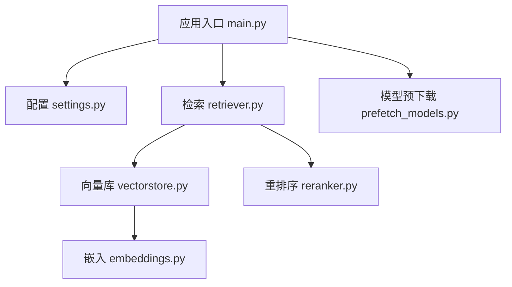
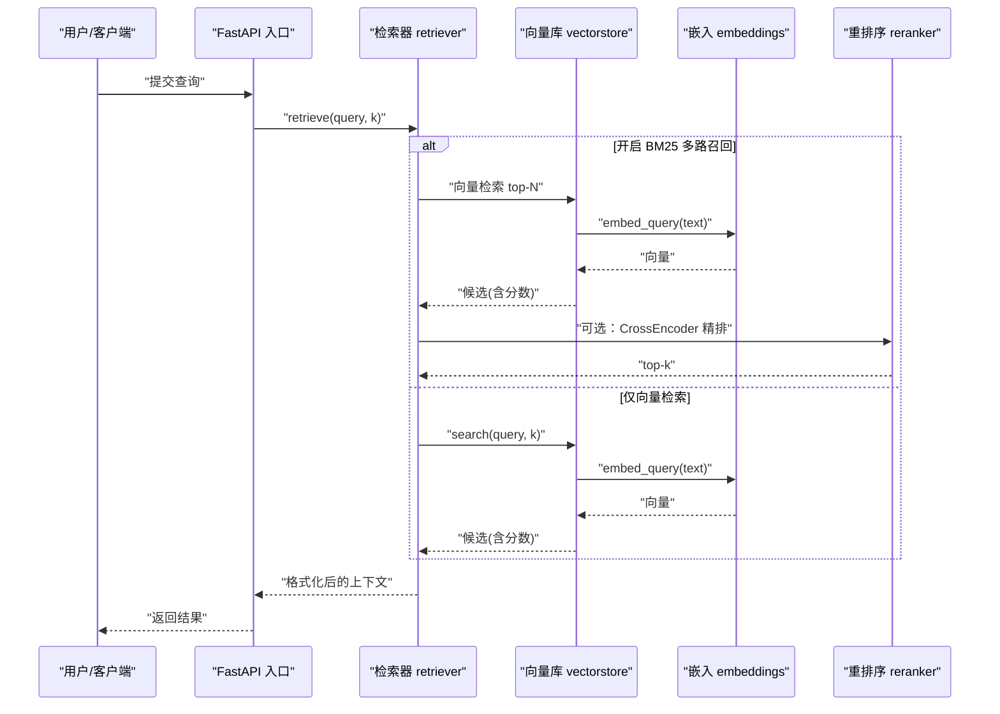
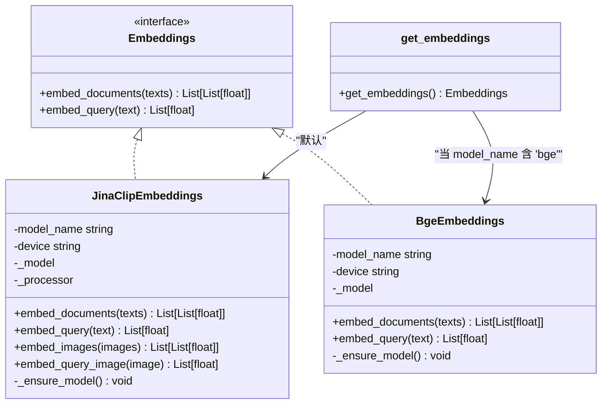
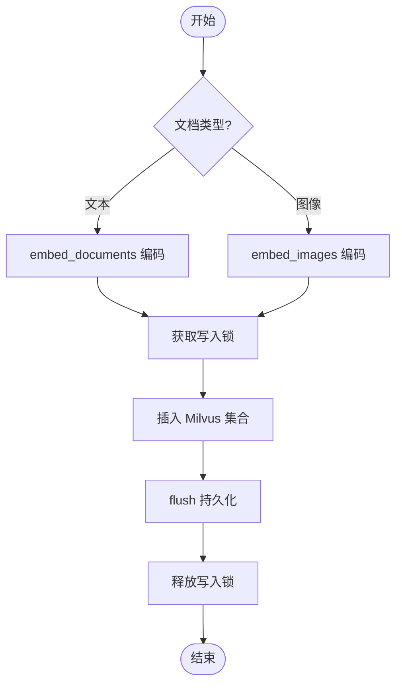
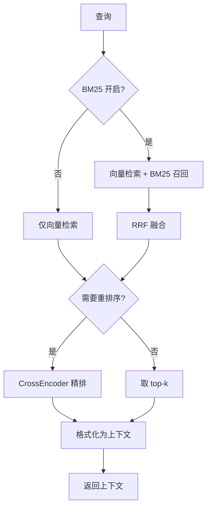
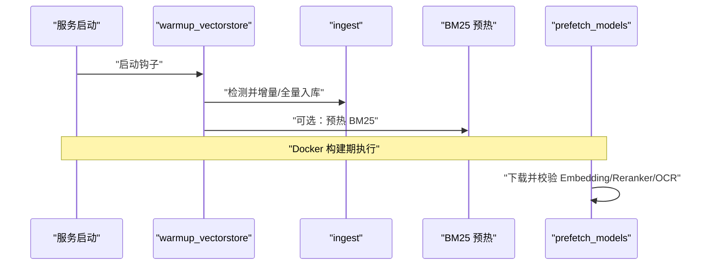
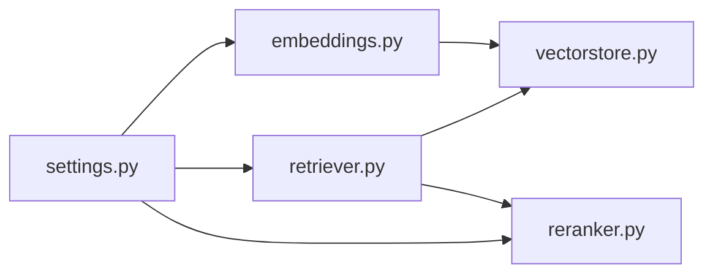

# 嵌入模型管理

<cite>
**本文引用的文件**
- [rag/embeddings.py](file://rag/embeddings.py)
- [config/settings.py](file://config/settings.py)
- [rag/vectorstore.py](file://rag/vectorstore.py)
- [rag/retriever.py](file://rag/retriever.py)
- [rag/reranker.py](file://rag/reranker.py)
- [scripts/prefetch_models.py](file://scripts/prefetch_models.py)
- [main.py](file://main.py)
</cite>

## 目录
1. [简介](#简介)
2. [项目结构](#项目结构)
3. [核心组件](#核心组件)
4. [架构总览](#架构总览)
5. [详细组件分析](#详细组件分析)
6. [依赖关系分析](#依赖关系分析)
7. [性能考量](#性能考量)
8. [故障排查指南](#故障排查指南)
9. [结论](#结论)
10. [附录：配置与使用示例](#附录：配置与使用示例)

## 简介
本文件系统性说明本项目中“嵌入模型”的管理与调用机制，覆盖文本与图像的统一接口设计、多模态模型的加载策略、缓存机制与性能优化，并给出模型配置选项、支持的模型类型以及使用示例。系统通过统一的 Embeddings 抽象同时支持纯文本（BGE）与多模态（Jina CLIP v2）两种模型，结合向量库检索与重排序，实现跨模态检索能力。

## 项目结构
围绕嵌入模型的关键模块分布如下：
- 配置中心：统一读取环境变量与 .env，提供 embedding_model、embedding_device 等参数
- 嵌入层：封装 Jina CLIP v2（多模态）与 BGE（纯文本），暴露统一接口
- 向量库：Milvus Lite 本地持久化，支持文本与图像混合存储
- 检索器：向量检索 + BM25 多路召回 + CrossEncoder 重排序
- 启动预热：服务启动时预热 LLM、向量库、BM25 索引；构建期预下载模型

图表来源
- [main.py:45-135](file://main.py#L45-L135)
- [config/settings.py:19-100](file://config/settings.py#L19-L100)
- [rag/retriever.py:18-52](file://rag/retriever.py#L18-L52)
- [rag/vectorstore.py:29-76](file://rag/vectorstore.py#L29-L76)
- [rag/embeddings.py:29-179](file://rag/embeddings.py#L29-L179)
- [rag/reranker.py:30-51](file://rag/reranker.py#L30-L51)
- [scripts/prefetch_models.py:28-53](file://scripts/prefetch_models.py#L28-L53)

章节来源
- [main.py:45-135](file://main.py#L45-L135)
- [config/settings.py:19-100](file://config/settings.py#L19-L100)

## 核心组件
- 统一嵌入接口
  - JinaClipEmbeddings：多模态（文本+图像），输出维度 1024，支持 embed_documents、embed_query、embed_images、embed_query_image
  - BgeEmbeddings：纯文本，输出维度 512，支持 embed_documents、embed_query
  - get_embeddings()：根据配置自动选择 BGE 或 Jina，返回单例
- 向量库集成
  - Milvus Lite 本地持久化，支持文本与图像混合存储（动态字段）
  - add_documents/add_image_documents/search/count_documents 等
- 检索流程
  - 可选 BM25 多路召回 + RRF 融合
  - 可选 CrossEncoder 重排序精排
- 启动预热与模型预下载
  - 启动时预热 LLM、向量库、BM25 索引
  - 构建期脚本预下载 Embedding、Reranker、OCR 模型

章节来源
- [rag/embeddings.py:29-179](file://rag/embeddings.py#L29-L179)
- [rag/vectorstore.py:29-190](file://rag/vectorstore.py#L29-L190)
- [rag/retriever.py:18-52](file://rag/retriever.py#L18-L52)
- [rag/reranker.py:30-98](file://rag/reranker.py#L30-L98)
- [scripts/prefetch_models.py:28-94](file://scripts/prefetch_models.py#L28-L94)
- [main.py:45-135](file://main.py#L45-L135)

## 架构总览
下图展示从查询到检索、再到生成上下文的关键数据流，突出嵌入模型在其中的作用位置。

图表来源
- [rag/retriever.py:18-52](file://rag/retriever.py#L18-L52)
- [rag/vectorstore.py:164-190](file://rag/vectorstore.py#L164-L190)
- [rag/embeddings.py:67-94](file://rag/embeddings.py#L67-L94)
- [rag/reranker.py:54-98](file://rag/reranker.py#L54-L98)

## 详细组件分析

### 统一嵌入接口与多模态支持
- 统一接口
  - 实现 langchain Embeddings 接口：embed_documents、embed_query
  - 多模态扩展：embed_images、embed_query_image
- 模型选择
  - get_embeddings() 依据配置中的 embedding_model 是否包含 "bge" 来选择 BGE 或 Jina CLIP v2
  - 设备与模型名均来自配置
- 延迟加载
  - 首次调用时才加载模型，避免进程启动即下载带来的阻塞
- 归一化
  - 文本与图像向量均进行 L2 归一化，便于相似度计算

图表来源
- [rag/embeddings.py:29-179](file://rag/embeddings.py#L29-L179)

章节来源
- [rag/embeddings.py:29-179](file://rag/embeddings.py#L29-L179)

### 向量库与多模态文档入库
- 文本与图像共存
  - 文本通过 embed_documents 编码后入库
  - 图像通过 embed_images 编码后直接写入 Milvus（绕过 LangChain 的文本路径）
- 并发安全
  - 写入操作加锁，避免文件监听线程与检索路径并发写入冲突
- 持久化
  - 每次写入后 flush，确保可立即查询
- 检索过滤
  - 按 rag_score_filter 过滤低相关度结果，保证注入上下文质量

图表来源
- [rag/vectorstore.py:79-161](file://rag/vectorstore.py#L79-L161)

章节来源
- [rag/vectorstore.py:79-161](file://rag/vectorstore.py#L79-L161)

### 检索与重排序流程
- 多路召回（可选）
  - 向量检索 + BM25 并行召回，RRF 融合提升精确匹配召回率
- 重排序（可选）
  - 对候选用 CrossEncoder 精排，取 top-k
- 上下文格式化
  - 将不同来源片段与相关度信息拼接为提示上下文

图表来源
- [rag/retriever.py:18-52](file://rag/retriever.py#L18-L52)
- [rag/retriever.py:55-110](file://rag/retriever.py#L55-L110)
- [rag/retriever.py:113-140](file://rag/retriever.py#L113-L140)
- [rag/reranker.py:54-98](file://rag/reranker.py#L54-L98)

章节来源
- [rag/retriever.py:18-140](file://rag/retriever.py#L18-L140)
- [rag/reranker.py:54-98](file://rag/reranker.py#L54-L98)

### 启动预热与模型预下载
- 启动预热
  - 预热 LLM 连接（TLS/DNS/连接池）
  - 检查向量库是否为空，必要时触发全量重建
  - 预热 BM25 索引（若启用）
  - 启动文件监听，运行时知识库变更自动同步
- 构建期预下载
  - 依次下载并校验：多模态 Embedding、重排序 CrossEncoder、easyocr
  - 任一步骤失败则构建失败，避免产出坏镜像

图表来源
- [main.py:80-135](file://main.py#L80-L135)
- [scripts/prefetch_models.py:28-94](file://scripts/prefetch_models.py#L28-L94)

章节来源
- [main.py:80-135](file://main.py#L80-L135)
- [scripts/prefetch_models.py:28-94](file://scripts/prefetch_models.py#L28-L94)

## 依赖关系分析
- 配置驱动
  - embedding_model、embedding_device 决定嵌入模型与运行设备
  - rerank_enabled、rerank_model、rerank_device 控制重排序行为
  - rag_bm25_enabled、rag_rrf_k 控制多路召回与融合
- 模块耦合
  - retriever 依赖 vectorstore.search 与 reranker.rerank
  - vectorstore 依赖 embeddings.get_embeddings
  - 所有模块通过 settings 集中获取配置，降低耦合
- 外部依赖
  - HuggingFace 镜像加速（HF_ENDPOINT）
  - Milvus Lite 本地文件持久化
  - sentence-transformers（BGE/CrossEncoder）
  - transformers + torch（Jina CLIP v2）

图表来源
- [config/settings.py:19-100](file://config/settings.py#L19-L100)
- [rag/embeddings.py:164-179](file://rag/embeddings.py#L164-L179)
- [rag/retriever.py:18-52](file://rag/retriever.py#L18-L52)
- [rag/reranker.py:30-51](file://rag/reranker.py#L30-L51)
- [rag/vectorstore.py:29-76](file://rag/vectorstore.py#L29-L76)

章节来源
- [config/settings.py:19-100](file://config/settings.py#L19-L100)
- [rag/embeddings.py:164-179](file://rag/embeddings.py#L164-L179)
- [rag/retriever.py:18-52](file://rag/retriever.py#L18-L52)
- [rag/reranker.py:30-51](file://rag/reranker.py#L30-L51)
- [rag/vectorstore.py:29-76](file://rag/vectorstore.py#L29-L76)

## 性能考量
- 延迟加载与单例
  - 嵌入模型与重排序模型均采用延迟加载与模块级单例，减少重复初始化开销
- 批量处理
  - 文本与图像均支持批量编码，提高吞吐
- 归一化与距离度量
  - 向量 L2 归一化配合 L2 距离度量，利于相似度比较
- 写入并发控制
  - 写入加锁避免并发冲突，保障数据一致性
- 启动预热
  - 预热 LLM、向量库、BM25 索引，降低首请求延迟
- 网络加速
  - 通过 HF_ENDPOINT 指向国内镜像，加速模型下载与加载

[本节为通用性能建议，不直接分析具体代码行]

## 故障排查指南
- 模型下载失败
  - 检查 HF_ENDPOINT 是否正确设置
  - 使用 scripts/prefetch_models.py 提前下载并校验模型
- 向量库为空或数据不一致
  - 启动时会检测并触发全量重建；也可手动删除 collection 后重建
- 检索结果为空或相关性低
  - 调整 rag_score_filter、rag_top_k、rerank_candidate_count
  - 开启 BM25 多路召回与 RRF 融合以提升召回率
- 重排序失败
  - 若 CrossEncoder 加载或推理异常，系统将回退到原始向量检索结果
- 写入冲突或丢失
  - 确认写入锁机制生效；检查 flush 是否成功

章节来源
- [rag/vectorstore.py:97-106](file://rag/vectorstore.py#L97-L106)
- [rag/vectorstore.py:157-161](file://rag/vectorstore.py#L157-L161)
- [rag/retriever.py:43-52](file://rag/retriever.py#L43-L52)
- [rag/reranker.py:95-98](file://rag/reranker.py#L95-L98)
- [scripts/prefetch_models.py:81-94](file://scripts/prefetch_models.py#L81-L94)

## 结论
本项目通过统一的 Embeddings 接口实现了文本与图像的多模态嵌入，结合 Milvus Lite 的混合存储与检索、可选的 BM25 多路召回与 CrossEncoder 重排序，提供了高性能、可扩展的知识检索方案。通过延迟加载、单例、批量编码与启动预热等策略，有效降低了首请求延迟与资源消耗。配置集中化管理使得模型切换与调优便捷可控。

[本节为总结性内容，不直接分析具体代码行]

## 附录：配置与使用示例

### 模型配置选项（来自 Settings）
- 嵌入模型
  - embedding_model：模型名称，如 jinaai/jina-clip-v2 或 bge-small-zh-v1.5
  - embedding_device：运行设备，如 cpu/gpu
- 重排序
  - rerank_enabled：是否启用重排序
  - rerank_model：重排序模型名称
  - rerank_device：重排序运行设备
- 检索
  - rag_bm25_enabled：是否启用 BM25 多路召回
  - rag_rrf_k：RRF 融合常数
  - rag_top_k：返回条数
  - rag_score_filter：距离阈值过滤
- 其他
  - milvus_collection、milvus_db_file、milvus_index_type、milvus_metric_type 等

章节来源
- [config/settings.py:50-100](file://config/settings.py#L50-L100)

### 支持的模型类型
- 多模态嵌入：jinaai/jina-clip-v2（文本+图像，统一向量空间）
- 纯文本嵌入：BAAI/bge-small-zh-v1.5（sentence-transformers）
- 重排序：BAAI/bge-reranker-base（CrossEncoder）

章节来源
- [rag/embeddings.py:29-179](file://rag/embeddings.py#L29-L179)
- [rag/reranker.py:30-51](file://rag/reranker.py#L30-L51)

### 使用示例（以路径引用代替代码）
- 获取统一嵌入实例
  - 参考路径：[get_embeddings:164-179](file://rag/embeddings.py#L164-L179)
- 文本编码
  - 参考路径：[embed_documents / embed_query:67-94](file://rag/embeddings.py#L67-L94)
- 图像编码
  - 参考路径：[embed_images / embed_query_image:96-128](file://rag/embeddings.py#L96-L128)
- 文本入库
  - 参考路径：[add_documents:79-106](file://rag/vectorstore.py#L79-L106)
- 图像入库
  - 参考路径：[add_image_documents:109-161](file://rag/vectorstore.py#L109-L161)
- 检索与上下文格式化
  - 参考路径：[retrieve / format_context:18-52](file://rag/retriever.py#L18-L52), [format_context:113-133](file://rag/retriever.py#L113-L133)
- 重排序
  - 参考路径：[rerank:54-98](file://rag/reranker.py#L54-L98)
- 启动预热
  - 参考路径：[warmup_vectorstore:80-135](file://main.py#L80-L135)
- 模型预下载
  - 参考路径：[prefetch_embedding / prefetch_reranker:28-53](file://scripts/prefetch_models.py#L28-L53)