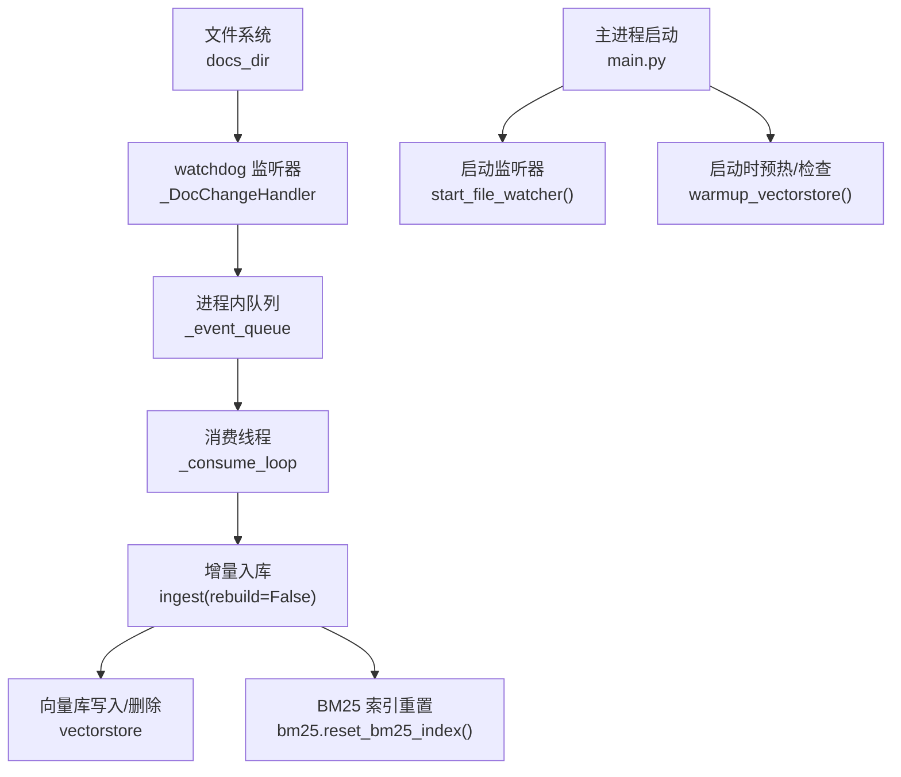
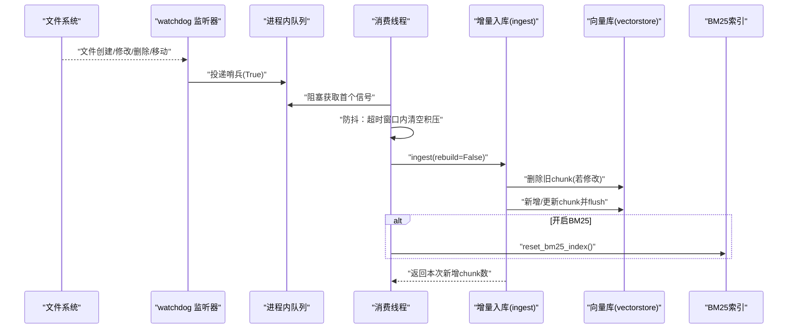
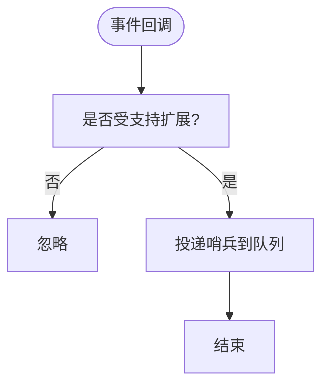
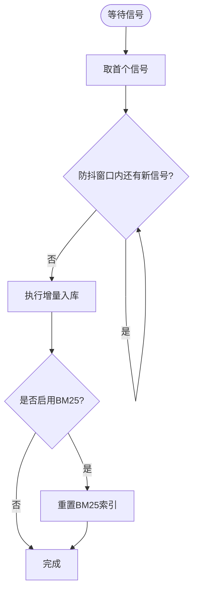
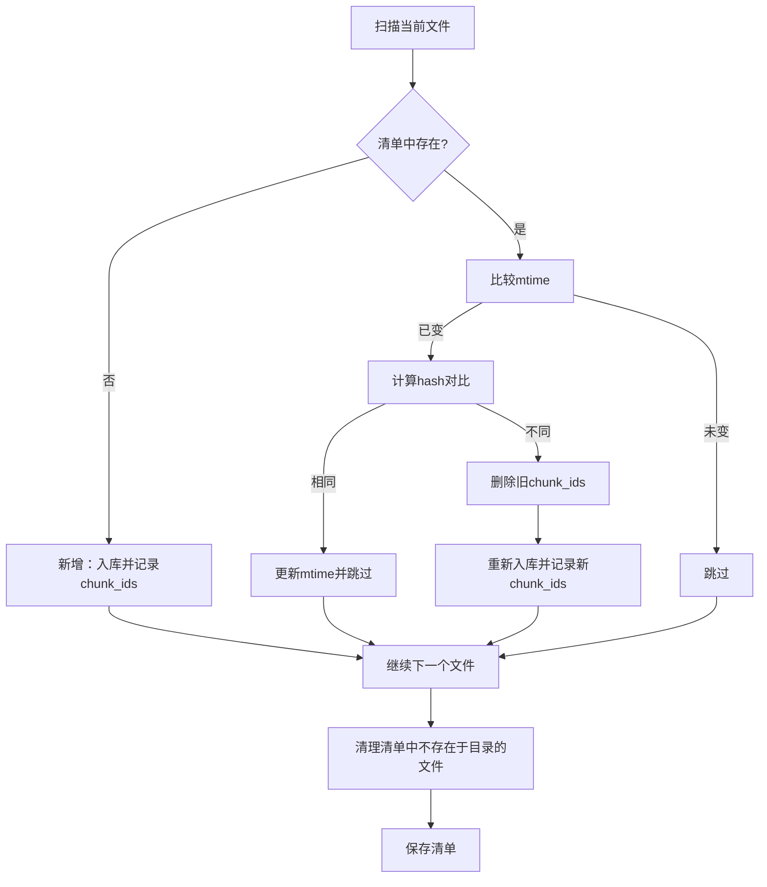
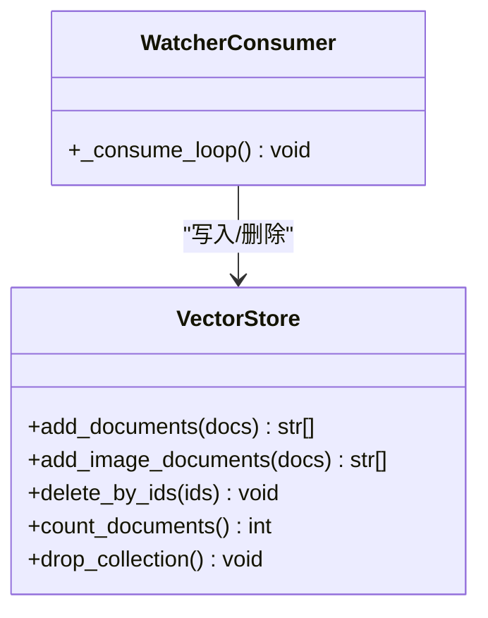
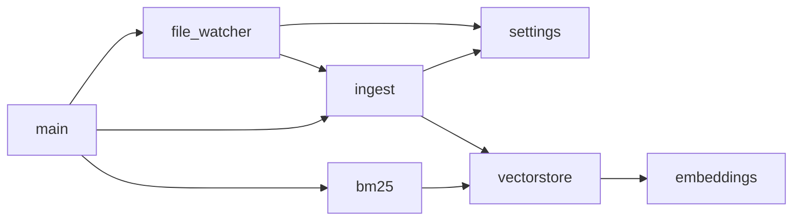

# 文件监听同步

<cite>
**本文引用的文件**
- [rag/file_watcher.py](file://rag/file_watcher.py)
- [rag/ingest.py](file://rag/ingest.py)
- [config/settings.py](file://config/settings.py)
- [main.py](file://main.py)
- [rag/vectorstore.py](file://rag/vectorstore.py)
- [rag/bm25.py](file://rag/bm25.py)
</cite>

## 目录
1. [简介](#简介)
2. [项目结构](#项目结构)
3. [核心组件](#核心组件)
4. [架构总览](#架构总览)
5. [详细组件分析](#详细组件分析)
6. [依赖关系分析](#依赖关系分析)
7. [性能考虑](#性能考虑)
8. [故障恢复与排错](#故障恢复与排错)
9. [结论](#结论)
10. [附录：配置项清单](#附录配置项清单)

## 简介
本模块实现“运行时知识库自动同步”能力：服务启动后持续监听知识文档目录的文件变更，通过防抖策略聚合高频事件，触发增量入库，将新增、修改、删除的文件内容同步到向量库（Milvus Lite），并可选地重建 BM25 关键词索引。该机制保证检索结果与磁盘文件保持一致，无需重启服务即可生效。

## 项目结构
与文件监听同步相关的核心文件及职责如下：
- 监听与调度：rag/file_watcher.py
- 增量入库与清单管理：rag/ingest.py
- 全局配置：config/settings.py
- 服务启动集成：main.py
- 向量库写入与删除：rag/vectorstore.py
- 关键词索引（BM25）：rag/bm25.py

图表来源
- [rag/file_watcher.py:34-151](file://rag/file_watcher.py#L34-L151)
- [rag/ingest.py:289-388](file://rag/ingest.py#L289-L388)
- [rag/vectorstore.py:79-246](file://rag/vectorstore.py#L79-L246)
- [rag/bm25.py:100-106](file://rag/bm25.py#L100-L106)
- [main.py:80-135](file://main.py#L80-L135)

章节来源
- [rag/file_watcher.py:1-151](file://rag/file_watcher.py#L1-L151)
- [rag/ingest.py:1-402](file://rag/ingest.py#L1-L402)
- [config/settings.py:1-216](file://config/settings.py#L1-L216)
- [main.py:80-135](file://main.py#L80-L135)
- [rag/vectorstore.py:1-282](file://rag/vectorstore.py#L1-L282)
- [rag/bm25.py:1-106](file://rag/bm25.py#L1-L106)

## 核心组件
- 文件监听器（watchdog）：仅负责捕获受支持文件的增删改移事件，向队列投递“哨兵”信号，不关心具体哪个文件变化。
- 消费线程：阻塞等待第一个信号，随后在防抖窗口内清空积压信号，再调用增量入库；完成后按需重置 BM25 索引。
- 增量入库：基于 mtime 预筛 + 内容哈希确认的变更检测，维护 .ingest_manifest.json 清单，记录每个文件的 hash、mtime 与 chunk_ids，实现精确的增量更新与孤儿清理。
- 向量库写入：对文本与图像分别走不同路径入库，写操作加锁并 flush，确保持久化与并发安全。
- BM25 索引：内存单例，服务启动或变更后按需构建/重置，用于关键词召回融合。

章节来源
- [rag/file_watcher.py:34-105](file://rag/file_watcher.py#L34-L105)
- [rag/ingest.py:219-388](file://rag/ingest.py#L219-L388)
- [rag/vectorstore.py:79-246](file://rag/vectorstore.py#L79-L246)
- [rag/bm25.py:22-66](file://rag/bm25.py#L22-L66)

## 架构总览
下图展示了从文件系统事件到向量库更新的完整流程，包括防抖、增量判断、写入与索引维护。

图表来源
- [rag/file_watcher.py:71-105](file://rag/file_watcher.py#L71-L105)
- [rag/ingest.py:289-388](file://rag/ingest.py#L289-L388)
- [rag/vectorstore.py:79-161](file://rag/vectorstore.py#L79-L161)
- [rag/bm25.py:100-106](file://rag/bm25.py#L100-L106)

## 详细组件分析

### 文件监听与事件处理
- 监听范围：仅 docs_dir 顶层（非递归），避免子目录风暴。
- 事件过滤：仅对受支持扩展名（txt/md/pdf/docx/xlsx/png/jpg/jpeg/bmp/tiff）的文件事件有效，忽略目录与临时文件。
- 事件类型：created/modified/deleted/moved 均会触发信号；移动事件以目标路径判定是否受支持。
- 事件投递：非阻塞 put 哨兵，消费端只关心“是否有变更”，不关心具体文件。

图表来源
- [rag/file_watcher.py:34-68](file://rag/file_watcher.py#L34-L68)

章节来源
- [rag/file_watcher.py:34-68](file://rag/file_watcher.py#L34-L68)

### 防抖与消费循环
- 防抖策略：消费线程取到第一个信号后，进入一个固定时长（debounce）的窗口，期间继续读取队列直到为空，合并多次变更为一轮入库，降低大文件分块写入导致的频繁触发。
- 消费逻辑：防抖结束后调用 ingest(rebuild=False)，根据返回的 chunk 数量决定是否记录日志；若启用 BM25，则重置其内存索引。

图表来源
- [rag/file_watcher.py:71-105](file://rag/file_watcher.py#L71-L105)

章节来源
- [rag/file_watcher.py:71-105](file://rag/file_watcher.py#L71-L105)

### 增量入库算法与数据一致性
- 清单驱动：使用 .ingest_manifest.json 记录每个文件的 hash、mtime 与 chunk_ids。
- 变更检测：
  - 快速路径：比较 mtime，未变则跳过。
  - 精确路径：mtime 变化时计算文件内容 md5，与清单中 hash 对比，真正变化才入库。
- 更新策略：
  - 新增文件：直接入库，记录 chunk_ids。
  - 修改文件：先按旧 chunk_ids 删除，再重新入库，避免重复数据。
  - 删除文件：清单中有但目录无，按 chunk_ids 清理孤儿 chunk。
- 幂等与容错：
  - 失败时保留旧记录以便下次重试；新文件失败则不记录。
  - 每次写入后 flush，确保持久化可查。

图表来源
- [rag/ingest.py:289-388](file://rag/ingest.py#L289-L388)

章节来源
- [rag/ingest.py:289-388](file://rag/ingest.py#L289-L388)

### 向量库写入与并发控制
- 文本与图像分别入库：文本走 add_documents，图像走 add_image_documents（多模态嵌入）。
- 并发安全：所有写操作（add/delete）使用线程锁保护，避免与监听消费线程并发写入冲突。
- 持久化：写入后显式 flush，确保 Milvus Lite 本地文件落盘并可查询。
- 删除接口：按 id 列表删除，用于修改文件时清理旧 chunk。

图表来源
- [rag/vectorstore.py:79-246](file://rag/vectorstore.py#L79-L246)
- [rag/file_watcher.py:71-105](file://rag/file_watcher.py#L71-L105)

章节来源
- [rag/vectorstore.py:79-246](file://rag/vectorstore.py#L79-L246)

### BM25 索引与融合检索
- 构建时机：服务启动时预热；文件监听变更后重置，使下次检索重新构建。
- 数据来源：从向量库拉取全部文本文档（排除图像），按字符级切分构建 BM25 索引。
- 重置接口：reset_bm25_index 清空内存单例，惰性重建。

章节来源
- [rag/bm25.py:22-66](file://rag/bm25.py#L22-L66)
- [rag/bm25.py:100-106](file://rag/bm25.py#L100-L106)

### 服务启动集成与预热
- 启动时后台线程检查向量库是否为空或与清单不一致，必要时触发全量重建。
- 若启用 BM25，预热索引以避免首请求延迟。
- 启动文件监听器，开始运行时自动同步。

章节来源
- [main.py:80-135](file://main.py#L80-L135)

## 依赖关系分析
- file_watcher 依赖 settings 获取监听开关、防抖时间与文档目录；依赖 ingest 执行增量入库。
- ingest 依赖 vectorstore 进行读写；依赖 settings 获取切片参数与目录；维护清单文件。
- vectorstore 依赖 embeddings 与 Milvus Lite；提供写锁保障并发安全。
- bm25 依赖 vectorstore 拉取文本文档；提供索引构建与重置。
- main 在启动阶段协调 warmup、监听器启动与 BM25 预热。

图表来源
- [rag/file_watcher.py:22-24](file://rag/file_watcher.py#L22-L24)
- [rag/ingest.py:19-21](file://rag/ingest.py#L19-L21)
- [rag/vectorstore.py:18-20](file://rag/vectorstore.py#L18-L20)
- [rag/bm25.py:32-36](file://rag/bm25.py#L32-L36)
- [main.py:125-135](file://main.py#L125-L135)

章节来源
- [rag/file_watcher.py:22-24](file://rag/file_watcher.py#L22-L24)
- [rag/ingest.py:19-21](file://rag/ingest.py#L19-L21)
- [rag/vectorstore.py:18-20](file://rag/vectorstore.py#L18-L20)
- [rag/bm25.py:32-36](file://rag/bm25.py#L32-L36)
- [main.py:125-135](file://main.py#L125-L135)

## 性能考虑
- 防抖减少频繁入库：通过 debounce 窗口合并高频事件，显著降低大文件分块写入带来的开销。
- 增量优化：mtime 预筛 + 内容 hash 确认，避免不必要的解析与嵌入计算。
- 并发安全：写操作加锁，避免竞争条件；读操作（检索）无需锁，Milvus Lite 支持读写并发。
- 索引预热：启动时预热 BM25 索引，降低首次检索延迟。
- 流控与超时：服务层具备限流与熔断，避免异常放大影响整体可用性。

[本节为通用性能建议，不直接分析具体文件]

## 故障恢复与排错
- 清单损坏或不可读：加载失败视为空清单，后续按全量重建逻辑处理，避免卡死。
- 向量库为空但存在清单：启动时检测到不一致，触发全量重建恢复一致性。
- 写入失败：删除旧 chunk 失败记录警告但不中断流程；入库失败时保留旧记录以便下次重试。
- BM25 构建失败：缺失依赖或未安装时会告警并降级为仅向量检索。
- 监听器异常：启动失败不影响服务主流程，仅记录警告。

章节来源
- [rag/ingest.py:236-256](file://rag/ingest.py#L236-L256)
- [rag/ingest.py:303-313](file://rag/ingest.py#L303-L313)
- [rag/ingest.py:344-358](file://rag/ingest.py#L344-L358)
- [rag/bm25.py:56-60](file://rag/bm25.py#L56-L60)
- [main.py:125-135](file://main.py#L125-L135)

## 结论
该文件监听同步机制通过 watchdog 事件采集、进程内队列与防抖策略，结合清单驱动的增量入库算法，实现了低延迟、高吞吐的知识库实时同步。配合向量库写锁与 BM25 索引管理，保证了数据一致性与检索性能。服务启动时的预热与自检进一步提升了鲁棒性。

[本节为总结性内容，不直接分析具体文件]

## 附录：配置项清单
以下配置项来自全局设置，直接影响文件监听同步行为：
- rag_auto_sync_enabled：是否启用运行时自动同步（默认开启）
- rag_auto_sync_debounce：防抖时间（秒），合并高频事件
- rag_docs_dir：知识文档目录（相对或绝对路径）
- rag_chunk_size / rag_chunk_overlap：文档切片大小与重叠
- rag_bm25_enabled：是否启用 BM25 关键词检索（影响变更后索引重置）
- rag_bm25_candidate_count / rag_rrf_k：BM25 候选数与融合常数
- milvus_db_file / milvus_collection / milvus_index_type / milvus_metric_type：向量库连接与索引参数
- supported_file_extensions：受支持的文件扩展名（逗号分隔）

章节来源
- [config/settings.py:71-107](file://config/settings.py#L71-L107)
- [config/settings.py:169-171](file://config/settings.py#L169-L171)
- [config/settings.py:196-209](file://config/settings.py#L196-L209)