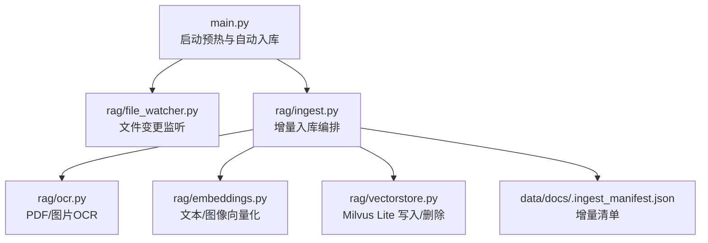
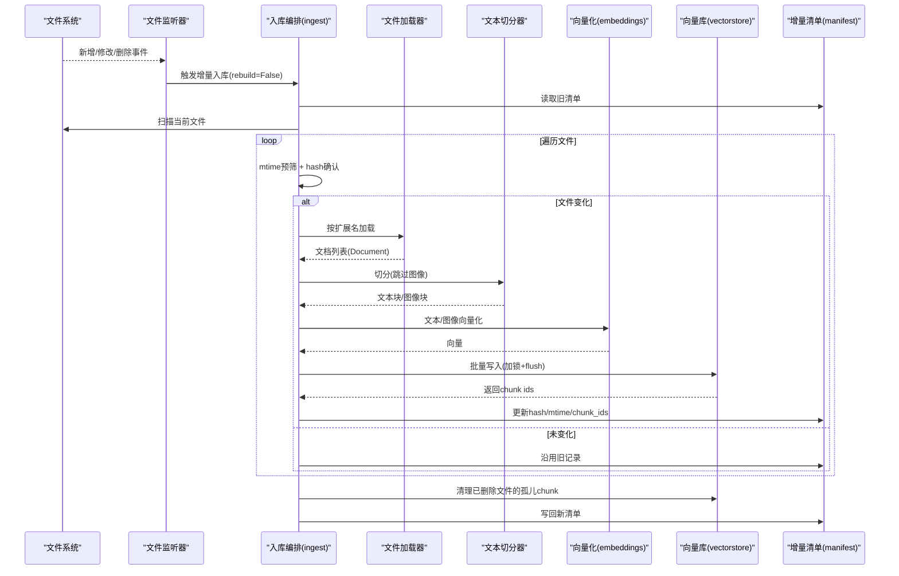
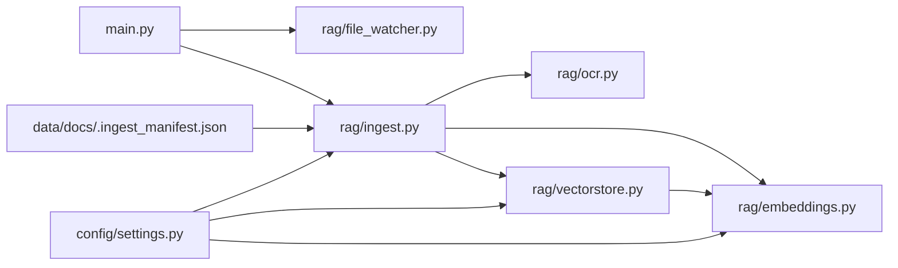

# 文档入库处理

<cite>
**本文引用的文件**
- [rag/ingest.py](file://rag/ingest.py)
- [rag/vectorstore.py](file://rag/vectorstore.py)
- [rag/embeddings.py](file://rag/embeddings.py)
- [rag/ocr.py](file://rag/ocr.py)
- [rag/file_watcher.py](file://rag/file_watcher.py)
- [config/settings.py](file://config/settings.py)
- [main.py](file://main.py)
- [data/docs/.ingest_manifest.json](file://data/docs/.ingest_manifest.json)
</cite>

## 目录
1. [简介](#简介)
2. [项目结构](#项目结构)
3. [核心组件](#核心组件)
4. [架构总览](#架构总览)
5. [详细组件分析](#详细组件分析)
6. [依赖关系分析](#依赖关系分析)
7. [性能考量](#性能考量)
8. [故障排查指南](#故障排查指南)
9. [结论](#结论)
10. [附录：配置项清单](#附录：配置项清单)

## 简介
本文件详细说明“文档入库”的完整流程，包括文件解析、文本切分、向量化与批量入库，覆盖支持的文档格式、切分策略、错误处理机制、增量更新、运行时自动同步、以及性能优化与故障恢复策略。该流程以“指纹驱动”的增量方式运行，支持文本与图像多模态统一向量空间检索。

## 项目结构
与文档入库相关的核心模块分布如下：
- 入口与启动：main.py（服务启动时检查并触发入库）
- 入库编排：rag/ingest.py（加载、切分、增量更新、清单管理）
- 向量存储：rag/vectorstore.py（Milvus Lite 封装，文本/图像写入与删除）
- 向量化：rag/embeddings.py（Jina CLIP v2 多模态或 BGE 纯文本）
- OCR 与 PDF 处理：rag/ocr.py（PDF 文本提取 + 扫描页 OCR 兜底）
- 运行时监听：rag/file_watcher.py（watchdog 事件 + 防抖消费）
- 全局配置：config/settings.py（所有可调参数）
- 增量清单：data/docs/.ingest_manifest.json（记录每个文件的 hash/mtime/chunk_ids）

图表来源
- [main.py:80-135](file://main.py#L80-L135)
- [rag/file_watcher.py:107-140](file://rag/file_watcher.py#L107-L140)
- [rag/ingest.py:289-388](file://rag/ingest.py#L289-L388)
- [rag/ocr.py:94-141](file://rag/ocr.py#L94-L141)
- [rag/embeddings.py:164-179](file://rag/embeddings.py#L164-L179)
- [rag/vectorstore.py:79-161](file://rag/vectorstore.py#L79-L161)
- [data/docs/.ingest_manifest.json:1-11](file://data/docs/.ingest_manifest.json#L1-L11)

章节来源
- [main.py:80-135](file://main.py#L80-L135)
- [rag/file_watcher.py:107-140](file://rag/file_watcher.py#L107-L140)
- [rag/ingest.py:289-388](file://rag/ingest.py#L289-L388)

## 核心组件
- 文件解析器：按扩展名分发到对应加载器，支持 .txt/.md/.pdf/.docx/.xlsx 及常见图片格式；PDF 优先文本提取，不足则 OCR 兜底；图片直接 OCR 并生成图像 Document。
- 文本切分器：使用递归字符切分器，按配置的 chunk_size 与 chunk_overlap 切分，图像文档不参与切分。
- 向量化：默认使用 Jina CLIP v2 多模态模型（文本+图像统一向量空间），也可切换为 BGE 纯文本模型。
- 向量库：Milvus Lite 本地持久化，支持文本与图像混合存储于同一 collection，提供写入、删除、重建索引能力。
- 增量清单：维护 .ingest_manifest.json，记录每个文件的 hash、mtime 与 chunk_ids，支撑增量更新与孤儿清理。
- 运行时监听：基于 watchdog 的文件系统事件，经防抖后触发增量入库，无需重启服务。

章节来源
- [rag/ingest.py:24-182](file://rag/ingest.py#L24-L182)
- [rag/ingest.py:198-216](file://rag/ingest.py#L198-L216)
- [rag/embeddings.py:29-179](file://rag/embeddings.py#L29-L179)
- [rag/vectorstore.py:29-161](file://rag/vectorstore.py#L29-L161)
- [rag/ingest.py:222-256](file://rag/ingest.py#L222-L256)
- [rag/file_watcher.py:34-105](file://rag/file_watcher.py#L34-L105)

## 架构总览
下图展示从文件变更到向量入库的端到端流程，包含增量判断、OCR 兜底、向量化、写入 Milvus 与清单更新。

图表来源
- [rag/file_watcher.py:71-105](file://rag/file_watcher.py#L71-L105)
- [rag/ingest.py:289-388](file://rag/ingest.py#L289-L388)
- [rag/ingest.py:167-195](file://rag/ingest.py#L167-L195)
- [rag/ingest.py:198-216](file://rag/ingest.py#L198-L216)
- [rag/embeddings.py:67-128](file://rag/embeddings.py#L67-L128)
- [rag/vectorstore.py:79-161](file://rag/vectorstore.py#L79-L161)
- [rag/ingest.py:222-256](file://rag/ingest.py#L222-L256)

## 详细组件分析

### 文件解析与格式支持
- 支持格式：.txt、.md、.pdf、.docx、.xlsx、.png、.jpg、.jpeg、.bmp、.tiff。
- 文本类：
  - .txt/.md：UTF-8 读取，失败回退 GBK。
  - .docx：通过 Docx2txtLoader 加载。
  - .xlsx：遍历 sheet，逐行拼接单元格文本。
- PDF：
  - 优先用 pypdf 提取文本；若某页文本过短（低于阈值），渲染为图片并使用 OCR 兜底。
  - 额外为每页生成图像 Document（用于多模态检索）。
- 图片：
  - 执行 OCR 提取文本；同时生成图像 Document（metadata.image_path 指向原图）。

章节来源
- [rag/ingest.py:24-28](file://rag/ingest.py#L24-L28)
- [rag/ingest.py:34-40](file://rag/ingest.py#L34-L40)
- [rag/ingest.py:43-91](file://rag/ingest.py#L43-L91)
- [rag/ingest.py:94-131](file://rag/ingest.py#L94-L131)
- [rag/ingest.py:134-164](file://rag/ingest.py#L134-L164)
- [rag/ocr.py:94-141](file://rag/ocr.py#L94-L141)

### 文本切分策略
- 使用 RecursiveCharacterTextSplitter，按配置的 chunk_size 与 chunk_overlap 切分。
- 分隔符包含段落、句子与标点，兼顾中英文语义边界。
- 图像 Document 不参与切分，直接保留以便多模态检索。

章节来源
- [rag/ingest.py:198-216](file://rag/ingest.py#L198-L216)
- [config/settings.py:70-73](file://config/settings.py#L70-L73)

### 向量化与多模态统一空间
- 默认使用 Jina CLIP v2 多模态模型，文本与图像映射到同一向量空间，支持跨模态检索。
- 可选切换为 BGE 纯文本模型（更快，适合纯文本知识库）。
- 文本与图像分别调用 embed_documents / embed_images，输出 L2 归一化向量。

章节来源
- [rag/embeddings.py:29-128](file://rag/embeddings.py#L29-L128)
- [rag/embeddings.py:131-179](file://rag/embeddings.py#L131-L179)
- [config/settings.py:50-52](file://config/settings.py#L50-L52)

### 批量入库与并发安全
- 文本文档：add_documents 生成 UUID 主键，过滤 None metadata，批量写入 Milvus 并 flush。
- 图像文档：embed_images 编码后，通过底层 MilvusClient.insert 写入实体，字段名与默认 schema 一致。
- 写入加锁：避免文件监听线程与检索路径并发写入冲突。
- 删除与重建：支持按 id 删除与 drop_collection 重建索引。

章节来源
- [rag/vectorstore.py:79-161](file://rag/vectorstore.py#L79-L161)
- [rag/vectorstore.py:225-246](file://rag/vectorstore.py#L225-L246)
- [rag/vectorstore.py:208-223](file://rag/vectorstore.py#L208-L223)

### 增量更新与清单管理
- 清单文件：.ingest_manifest.json 记录每个文件的 hash、mtime、chunk_ids。
- 增量逻辑：
  - 先比较 mtime 快速跳过未变文件。
  - mtime 变化再计算内容 hash 确认是否真改。
  - 修改文件：先删除旧 chunk，再重新入库，更新清单。
  - 删除文件：清理孤儿 chunk。
- 全量重建：--rebuild 模式清空集合与清单，重新全量入库。

章节来源
- [rag/ingest.py:222-256](file://rag/ingest.py#L222-L256)
- [rag/ingest.py:289-388](file://rag/ingest.py#L289-L388)
- [data/docs/.ingest_manifest.json:1-11](file://data/docs/.ingest_manifest.json#L1-L11)

### 运行时自动同步
- 启动时开启文件监听（可配置开关），检测 docs_dir 下支持格式的增删改事件。
- 防抖策略：在 debounce 秒内合并多次事件，减少频繁入库开销。
- 消费线程：取信号 -> 清空积压 -> 调用 ingest(rebuild=False) -> 可选重置 BM25 索引。

章节来源
- [rag/file_watcher.py:1-12](file://rag/file_watcher.py#L1-L12)
- [rag/file_watcher.py:71-105](file://rag/file_watcher.py#L71-L105)
- [rag/file_watcher.py:107-140](file://rag/file_watcher.py#L107-L140)
- [config/settings.py:77-81](file://config/settings.py#L77-L81)

### 启动时预热与一致性恢复
- 启动时检查向量库是否为空：
  - 为空且存在清单：触发全量重建，恢复一致性。
  - 否则执行增量入库，确保最新。
- 可选预热 BM25 索引与文件监听。

章节来源
- [main.py:80-135](file://main.py#L80-L135)

## 依赖关系分析

图表来源
- [main.py:80-135](file://main.py#L80-L135)
- [rag/file_watcher.py:107-140](file://rag/file_watcher.py#L107-L140)
- [rag/ingest.py:289-388](file://rag/ingest.py#L289-L388)
- [rag/ocr.py:94-141](file://rag/ocr.py#L94-L141)
- [rag/embeddings.py:164-179](file://rag/embeddings.py#L164-L179)
- [rag/vectorstore.py:29-161](file://rag/vectorstore.py#L29-L161)
- [config/settings.py:50-107](file://config/settings.py#L50-L107)
- [data/docs/.ingest_manifest.json:1-11](file://data/docs/.ingest_manifest.json#L1-L11)

章节来源
- [rag/ingest.py:289-388](file://rag/ingest.py#L289-L388)
- [rag/vectorstore.py:29-161](file://rag/vectorstore.py#L29-L161)
- [rag/embeddings.py:164-179](file://rag/embeddings.py#L164-L179)
- [config/settings.py:50-107](file://config/settings.py#L50-L107)

## 性能考量
- 模型选择：
  - 多模态场景使用 Jina CLIP v2；纯文本场景建议切换 BGE 以获得更高吞吐。
- 切片参数：
  - rag_chunk_size 与 rag_chunk_overlap 影响召回质量与向量数量，需结合业务权衡。
- 写入性能：
  - 批量写入 + flush 保证持久化；写入加锁避免并发冲突。
- 增量优化：
  - mtime 预筛 + hash 确认，减少不必要的重算与入库。
- 运行时监听：
  - 防抖合并事件，降低频繁入库带来的开销。
- 索引类型：
  - Milvus Lite 仅支持 FLAT 索引；如需更大规模可考虑外部 Milvus 服务与更优索引。

[本节为通用性能指导，不直接分析具体代码]

## 故障排查指南
- 文件格式不支持：
  - 日志会记录“不支持的文件格式”，请检查扩展名是否在支持列表中。
- PDF 文本提取失败：
  - 降级为 OCR 模式；如仍失败，检查 PDF 是否损坏或受保护。
- OCR 失败：
  - 记录警告日志，继续处理其他页面或文件；检查 GPU/CPU 与模型下载状态。
- 向量写入失败：
  - flush 失败不影响内存可用；检查 Milvus Lite 数据库文件权限与磁盘空间。
- 增量清单异常：
  - 清单读取失败视为空，下次将全量重建；检查 data/docs/.ingest_manifest.json 可读性。
- 启动一致性：
  - 向量库为空但存在清单时会自动全量重建；若重建失败，检查日志与依赖服务。

章节来源
- [rag/ingest.py:180-195](file://rag/ingest.py#L180-L195)
- [rag/ocr.py:108-141](file://rag/ocr.py#L108-L141)
- [rag/vectorstore.py:97-106](file://rag/vectorstore.py#L97-L106)
- [rag/ingest.py:236-256](file://rag/ingest.py#L236-L256)
- [main.py:80-135](file://main.py#L80-L135)

## 结论
本系统实现了稳健的文档入库流水线：支持多种格式、OCR 兜底、文本与图像统一向量空间、增量更新与运行时自动同步、以及完善的错误处理与恢复机制。通过合理的切片策略、批量写入与并发控制，系统在中小规模知识库场景下具备良好性能与可用性。对于更大规模或更高吞吐需求，可迁移至外部 Milvus 服务并调整索引与资源。

[本节为总结性内容，不直接分析具体代码]

## 附录：配置项清单
以下为与文档入库相关的关键配置项及其作用（来自 Settings）：
- embedding_model：嵌入模型名称（默认 jinaai/jina-clip-v2，含 bge 时走纯文本路径）
- embedding_device：设备（cpu/gpu）
- milvus_db_file：Milvus Lite 数据库文件路径
- milvus_collection：集合名称
- milvus_index_type：索引类型（Milvus Lite 仅支持 FLAT）
- milvus_metric_type：距离度量（L2）
- rag_top_k：检索 top-k
- rag_score_filter：检索分数过滤阈值
- rag_min_relevance：最低相关度阈值
- rag_chunk_size：切片大小（字符数）
- rag_chunk_overlap：重叠大小（字符数）
- rag_docs_dir：知识文档目录
- rag_auto_sync_enabled：是否启用运行时自动同步
- rag_auto_sync_debounce：防抖时间（秒）
- rag_bm25_enabled：是否启用 BM25 多路召回
- rag_bm25_candidate_count：BM25 候选数
- rag_rrf_k：RRF 融合常数
- ocr_languages：OCR 语言（逗号分隔）
- ocr_use_gpu：是否使用 GPU 进行 OCR
- ocr_min_text_length：PDF 页面文本少于该长度触发 OCR
- supported_file_extensions：支持的文件扩展名（逗号分隔）

章节来源
- [config/settings.py:50-107](file://config/settings.py#L50-L107)