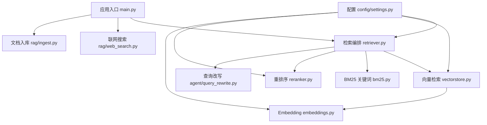
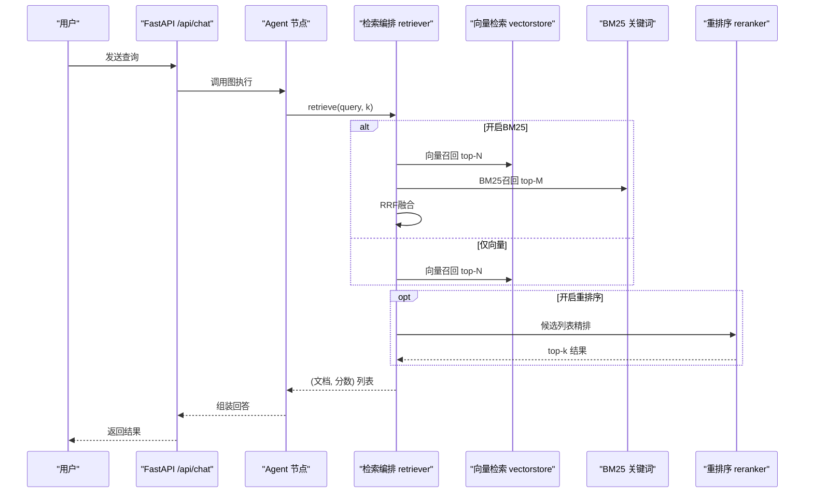
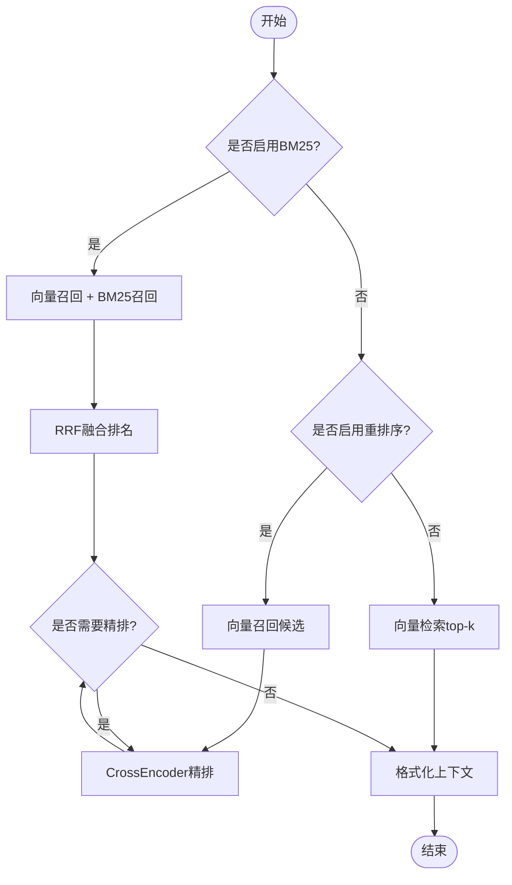
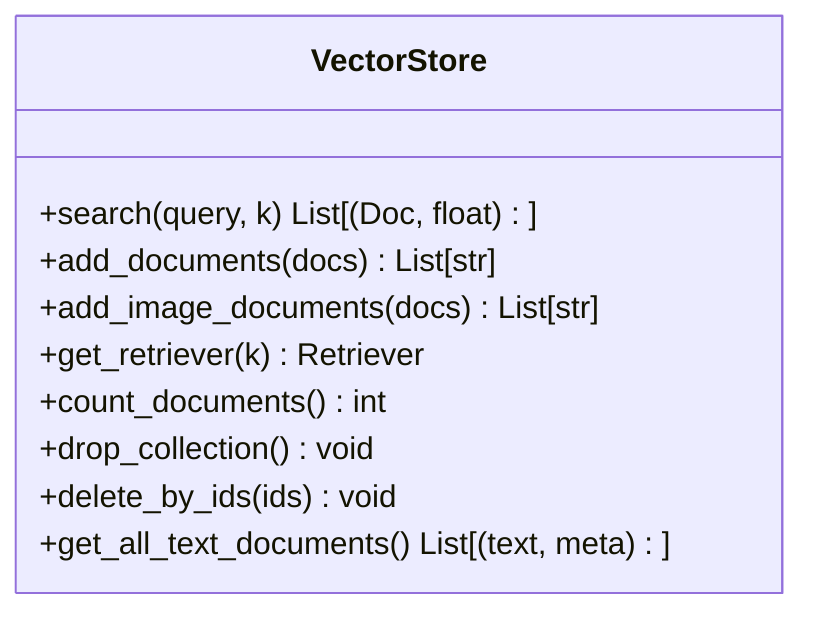
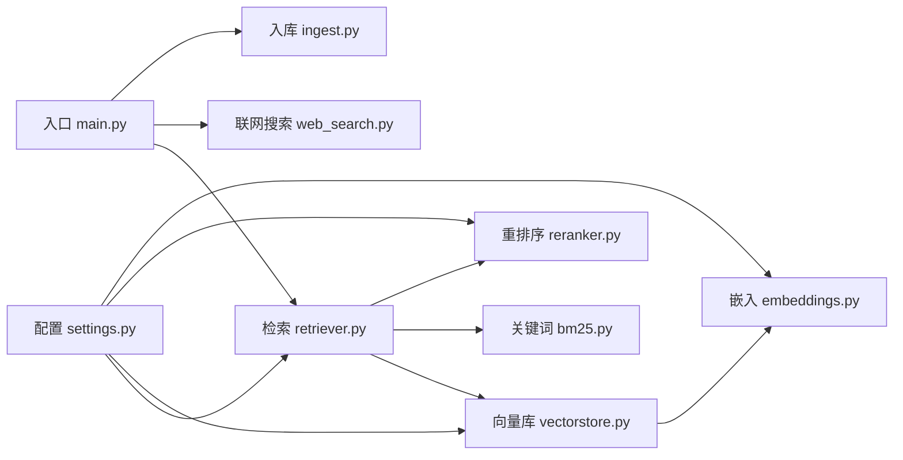

# 检索系统

<cite>
**本文引用的文件**
- [rag/retriever.py](file://rag/retriever.py)
- [rag/bm25.py](file://rag/bm25.py)
- [rag/embeddings.py](file://rag/embeddings.py)
- [rag/vectorstore.py](file://rag/vectorstore.py)
- [rag/reranker.py](file://rag/reranker.py)
- [config/settings.py](file://config/settings.py)
- [main.py](file://main.py)
- [agent/query_rewrite.py](file://agent/query_rewrite.py)
- [rag/web_search.py](file://rag/web_search.py)
- [rag/ingest.py](file://rag/ingest.py)
</cite>

## 目录
1. [简介](#简介)
2. [项目结构](#项目结构)
3. [核心组件](#核心组件)
4. [架构总览](#架构总览)
5. [详细组件分析](#详细组件分析)
6. [依赖关系分析](#依赖关系分析)
7. [性能与调优](#性能与调优)
8. [故障排查](#故障排查)
9. [结论](#结论)
10. [附录：API 使用示例与最佳实践](#附录api-使用示例与最佳实践)

## 简介
本检索系统面向钉钉AI智能体助手，提供语义检索、混合检索（向量+关键词）与结果重排序能力，并支持多模态文档（文本与图像）的统一索引与检索。系统通过可配置的多路召回策略、RRF融合、CrossEncoder精排以及相关性阈值过滤，在保证召回率的同时提升最终答案的相关性与稳定性。同时提供联网搜索作为补充信息源，并通过启动预热、增量入库与文件监听实现低延迟与高可用。

## 项目结构
检索相关代码主要位于 rag 目录，配合 config/settings.py 进行全局配置，main.py 负责服务启动与预热流程，agent 层调用检索模块完成问答链路。

图表来源
- [main.py:80-135](file://main.py#L80-L135)
- [rag/retriever.py:18-52](file://rag/retriever.py#L18-L52)
- [rag/vectorstore.py:164-184](file://rag/vectorstore.py#L164-L184)
- [rag/bm25.py:22-66](file://rag/bm25.py#L22-L66)
- [rag/reranker.py:30-51](file://rag/reranker.py#L30-L51)
- [rag/embeddings.py:164-179](file://rag/embeddings.py#L164-L179)
- [config/settings.py:50-113](file://config/settings.py#L50-L113)

章节来源
- [main.py:80-135](file://main.py#L80-L135)
- [config/settings.py:50-113](file://config/settings.py#L50-L113)

## 核心组件
- 检索编排器：统一调度向量检索、BM25召回、RRF融合与重排序，输出带分数与上下文的检索结果。
- 向量库封装：基于 Milvus Lite 的本地持久化向量库，支持文本与图像多模态存储与检索。
- Embedding 模型：支持多模态（Jina CLIP v2）与纯文本（BGE），自动选择与缓存。
- BM25 关键词检索：内存索引，字符级分词，与向量检索互补。
- CrossEncoder 重排序：对候选结果进行逐对打分精排，提升相关性。
- 查询改写：可选地用轻量 LLM 将用户问题改写为更利于检索的形式。
- 联网搜索：DuckDuckGo 优先、百度回退，统一格式化为上下文。
- 文档入库：增量/全量入库，支持 PDF/图片 OCR、切片与指纹驱动更新。

章节来源
- [rag/retriever.py:18-52](file://rag/retriever.py#L18-L52)
- [rag/vectorstore.py:29-76](file://rag/vectorstore.py#L29-L76)
- [rag/embeddings.py:29-94](file://rag/embeddings.py#L29-L94)
- [rag/bm25.py:22-66](file://rag/bm25.py#L22-L66)
- [rag/reranker.py:30-51](file://rag/reranker.py#L30-L51)
- [agent/query_rewrite.py:26-58](file://agent/query_rewrite.py#L26-L58)
- [rag/web_search.py:76-134](file://rag/web_search.py#L76-L134)
- [rag/ingest.py:289-388](file://rag/ingest.py#L289-L388)

## 架构总览
检索系统采用“两阶段”设计：第一阶段多路召回（向量 + BM25，或仅向量），第二阶段 CrossEncoder 精排；同时支持关闭重排序直接取 top-k。检索结果经格式化后注入生成节点。

图表来源
- [rag/retriever.py:18-52](file://rag/retriever.py#L18-L52)
- [rag/vectorstore.py:164-184](file://rag/vectorstore.py#L164-L184)
- [rag/bm25.py:69-97](file://rag/bm25.py#L69-L97)
- [rag/reranker.py:54-97](file://rag/reranker.py#L54-L97)
- [main.py:154-209](file://main.py#L154-L209)

## 详细组件分析

### 检索编排器（retriever）
- 功能：根据配置决定多路召回策略（BM25+向量→RRF融合；或仅向量），可选 CrossEncoder 精排，最后格式化上下文。
- 关键流程：
  - 若启用 BM25：并行向量检索与 BM25 召回，使用 RRF 融合排名。
  - 否则若启用重排序：向量检索候选 → CrossEncoder 精排 → top-k。
  - 否则：直接向量检索 top-k。
- 输出：(Document, score) 列表，score 在重排序后为 CrossEncoder 分数（越大越相关），向量检索为距离（越小越相关）。

图表来源
- [rag/retriever.py:18-52](file://rag/retriever.py#L18-L52)
- [rag/retriever.py:55-110](file://rag/retriever.py#L55-L110)
- [rag/retriever.py:113-139](file://rag/retriever.py#L113-L139)

章节来源
- [rag/retriever.py:18-52](file://rag/retriever.py#L18-L52)
- [rag/retriever.py:55-110](file://rag/retriever.py#L55-L110)
- [rag/retriever.py:113-139](file://rag/retriever.py#L113-L139)

### 向量检索（vectorstore）
- 功能：基于 Milvus Lite 的本地持久化向量库，支持文本与图像多模态存储与检索；提供相似度搜索与分数过滤。
- 关键点：
  - 连接参数包含 gRPC keepalive 优化，避免空闲时频繁 ping 导致断连。
  - search 函数默认按配置返回 top-k，并对距离大于阈值的低相关度结果进行过滤；若过滤后为空则回退原始结果。
  - 支持批量添加文本与图像文档，写入加锁保证并发安全。

图表来源
- [rag/vectorstore.py:29-76](file://rag/vectorstore.py#L29-L76)
- [rag/vectorstore.py:79-106](file://rag/vectorstore.py#L79-L106)
- [rag/vectorstore.py:109-161](file://rag/vectorstore.py#L109-L161)
- [rag/vectorstore.py:164-184](file://rag/vectorstore.py#L164-L184)
- [rag/vectorstore.py:187-282](file://rag/vectorstore.py#L187-L282)

章节来源
- [rag/vectorstore.py:29-76](file://rag/vectorstore.py#L29-L76)
- [rag/vectorstore.py:164-184](file://rag/vectorstore.py#L164-L184)

### Embedding 模型（embeddings）
- 功能：提供多模态（Jina CLIP v2）与纯文本（BGE）两种嵌入方案，自动根据配置选择；支持文本与图像编码，输出已 L2 归一化的向量。
- 关键点：
  - 延迟加载模型，首次调用才初始化，减少启动开销。
  - 通过 lru_cache 缓存单例，避免重复创建。
  - 支持设备切换（CPU/GPU），便于在不同环境部署。

章节来源
- [rag/embeddings.py:29-94](file://rag/embeddings.py#L29-L94)
- [rag/embeddings.py:131-161](file://rag/embeddings.py#L131-L161)
- [rag/embeddings.py:164-179](file://rag/embeddings.py#L164-L179)

### BM25 关键词检索（bm25）
- 功能：从向量库拉取文本文档构建进程内 BM25 索引，支持字符级分词，无需额外中文分词依赖。
- 关键点：
  - 单例索引，重启需重建；与向量库预热同步。
  - 检索时按字符切分查询，返回 (Document, score)，score 越大越相关。
  - 失败或无索引时返回空列表，不影响主流程。

章节来源
- [rag/bm25.py:22-66](file://rag/bm25.py#L22-L66)
- [rag/bm25.py:69-97](file://rag/bm25.py#L69-L97)
- [rag/bm25.py:100-106](file://rag/bm25.py#L100-L106)

### CrossEncoder 重排序（reranker）
- 功能：对候选结果进行逐对打分精排，提升相关性；失败时回退到原始向量检索结果。
- 关键点：
  - 延迟加载模型，单例缓存。
  - 输入为 query-doc 对，输出分数越高越相关。
  - 当候选数不足 top-k 时直接返回。

章节来源
- [rag/reranker.py:30-51](file://rag/reranker.py#L30-L51)
- [rag/reranker.py:54-97](file://rag/reranker.py#L54-L97)

### 查询改写（query_rewrite）
- 功能：可选地用轻量 LLM 将用户问题改写为更利于检索的形式，补全省略主语、去除口语化表达。
- 关键点：
  - 短查询不触发改写；失败静默回退原始查询。
  - 通过配置开关控制是否启用。

章节来源
- [agent/query_rewrite.py:26-58](file://agent/query_rewrite.py#L26-L58)

### 联网搜索（web_search）
- 功能：双引擎搜索（DuckDuckGo 优先，百度回退），统一格式化为上下文字符串。
- 关键点：
  - 失败时记录日志并返回空结果，不影响主流程。
  - 可通过配置开关与最大结果数控制。

章节来源
- [rag/web_search.py:76-134](file://rag/web_search.py#L76-L134)

### 文档入库（ingest）
- 功能：增量/全量入库，支持多种文件格式与 OCR，切片与指纹驱动更新。
- 关键点：
  - 支持 .txt/.md/.pdf/.docx/.xlsx/.png/.jpg/.jpeg/.bmp/.tiff。
  - 增量更新通过 manifest 记录文件哈希与 chunk_ids，避免重复数据。
  - 启动时自动检查向量库状态，必要时触发全量重建。

章节来源
- [rag/ingest.py:289-388](file://rag/ingest.py#L289-L388)
- [main.py:80-135](file://main.py#L80-L135)

## 依赖关系分析
检索系统各模块之间的依赖如下：

图表来源
- [config/settings.py:50-113](file://config/settings.py#L50-L113)
- [rag/retriever.py:18-52](file://rag/retriever.py#L18-L52)
- [rag/vectorstore.py:29-76](file://rag/vectorstore.py#L29-L76)
- [rag/reranker.py:30-51](file://rag/reranker.py#L30-L51)
- [rag/embeddings.py:164-179](file://rag/embeddings.py#L164-L179)
- [main.py:80-135](file://main.py#L80-L135)

章节来源
- [config/settings.py:50-113](file://config/settings.py#L50-L113)
- [rag/retriever.py:18-52](file://rag/retriever.py#L18-L52)
- [rag/vectorstore.py:29-76](file://rag/vectorstore.py#L29-L76)
- [rag/reranker.py:30-51](file://rag/reranker.py#L30-L51)
- [rag/embeddings.py:164-179](file://rag/embeddings.py#L164-L179)
- [main.py:80-135](file://main.py#L80-L135)

## 性能与调优
- 启动预热：
  - 向量库与 BM25 索引在启动时预热，降低首请求延迟。
  - LLM 连接预热（TLS握手、DNS解析、连接池建立）。
- 并发与锁：
  - 写入操作加锁，避免文件监听线程与检索路径并发冲突。
  - 检索为读操作，Milvus Lite 支持读写并发。
- 模型加载：
  - Embedding 与重排序模型延迟加载，减少启动时间。
  - 通过 lru_cache 缓存单例，避免重复初始化。
- 网络与超时：
  - HuggingFace 镜像加速下载模型。
  - 流式接口整体超时保护，防止连接卡死。
- 索引与度量：
  - Milvus Lite 使用 FLAT 索引与 L2 距离度量，适合小规模知识库。
  - 可根据规模调整索引类型与度量方式（当前配置固定）。
- 召回与精排：
  - 开启 BM25 可提升精确匹配召回率；RRF 融合常数 rrf_k 影响融合权重。
  - 重排序候选数与 top-k 平衡精度与延迟。

章节来源
- [main.py:45-77](file://main.py#L45-L77)
- [main.py:80-135](file://main.py#L80-L135)
- [rag/vectorstore.py:46-57](file://rag/vectorstore.py#L46-L57)
- [rag/embeddings.py:49-65](file://rag/embeddings.py#L49-L65)
- [rag/reranker.py:30-51](file://rag/reranker.py#L30-L51)
- [config/settings.py:54-63](file://config/settings.py#L54-L63)
- [config/settings.py:84-100](file://config/settings.py#L84-L100)

## 故障排查
- 向量库为空但存在清单：启动时检测到不一致会触发全量重建。
- BM25 索引构建失败：记录警告并返回空结果，不影响主流程。
- 重排序失败：记录警告并回退到原始向量检索结果。
- 联网搜索失败：记录警告并尝试回退搜索引擎，仍失败则返回空结果。
- 写入冲突：写入操作加锁，避免并发写入导致数据不一致。
- 模型加载失败：延迟加载失败时记录日志，不影响服务可用性。

章节来源
- [main.py:80-135](file://main.py#L80-L135)
- [rag/bm25.py:32-66](file://rag/bm25.py#L32-L66)
- [rag/reranker.py:95-97](file://rag/reranker.py#L95-L97)
- [rag/web_search.py:42-44](file://rag/web_search.py#L42-L44)
- [rag/vectorstore.py:97-106](file://rag/vectorstore.py#L97-L106)

## 结论
该检索系统通过多路召回、RRF融合与CrossEncoder精排实现了高召回与高精度的平衡，结合多模态支持与联网搜索，满足复杂场景下的知识问答需求。通过启动预热、增量入库与文件监听，系统在可用性、性能与可维护性方面表现良好。建议在生产环境中根据数据规模与延迟要求调整召回候选数、重排序阈值与索引参数，并结合评估工具持续优化。

## 附录：API 使用示例与最佳实践

### 检索参数配置
- 向量检索：
  - 返回数量：rag_top_k
  - 分数过滤阈值：rag_score_filter
  - 最低相关度（仅纯向量路径）：rag_min_relevance
- 混合检索：
  - 是否启用 BM25：rag_bm25_enabled
  - BM25 候选数：rag_bm25_candidate_count
  - RRF 融合常数：rag_rrf_k
- 重排序：
  - 是否启用：rerank_enabled
  - 候选数：rerank_candidate_count
  - 精排后 top-k：rerank_top_k
  - 模型与设备：rerank_model, rerank_device
- 查询改写：
  - 是否启用：rag_query_rewrite_enabled
- 联网搜索：
  - 是否启用：web_search_enabled
  - 最大结果数：web_search_max_results
  - 超时：web_search_timeout

章节来源
- [config/settings.py:50-113](file://config/settings.py#L50-L113)

### 检索流程最佳实践
- 小数据集且追求速度：关闭 BM25，仅向量检索 + 重排序。
- 需要精确匹配：开启 BM25，适当增大 rrf_k 以平滑融合。
- 高相关度要求：增大 rerank_candidate_count，提高 rerank_top_k 质量。
- 低延迟场景：关闭重排序，直接向量检索 top-k。
- 多模态内容：确保图像文档正确入库，使用多模态 Embedding。

章节来源
- [rag/retriever.py:18-52](file://rag/retriever.py#L18-L52)
- [rag/vectorstore.py:164-184](file://rag/vectorstore.py#L164-L184)
- [rag/reranker.py:54-97](file://rag/reranker.py#L54-L97)

### API 使用示例
- 聊天接口（非流式）：
  - 方法：POST /api/chat
  - 请求体：{ user_input, user_id, session_id }
  - 响应：{ errcode, errmsg, answer }
- 聊天接口（流式 SSE）：
  - 方法：POST /api/chat/stream
  - 事件类型：status, token, error, done
- 健康检查：
  - 方法：GET /health
  - 响应：{ status, service, checkpointer }

章节来源
- [main.py:154-209](file://main.py#L154-L209)
- [main.py:228-314](file://main.py#L228-L314)
- [main.py:317-326](file://main.py#L317-L326)