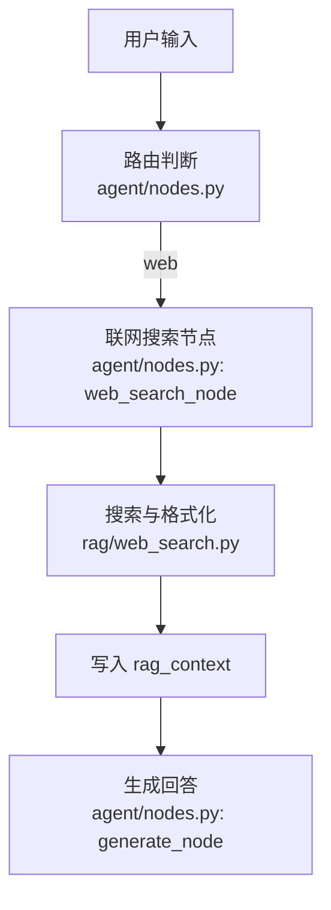
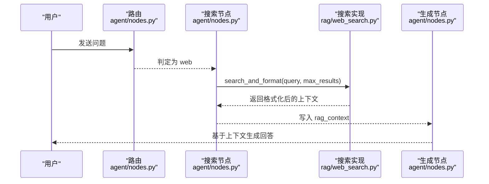
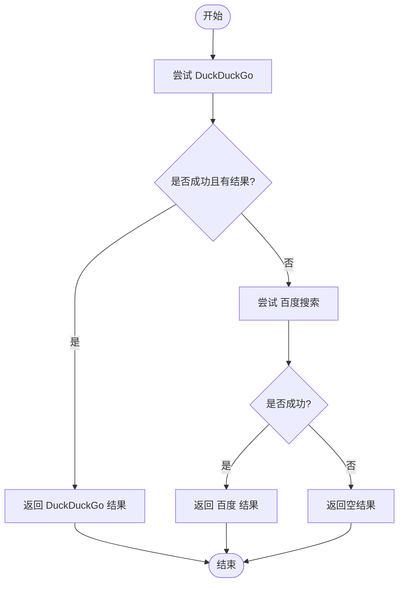
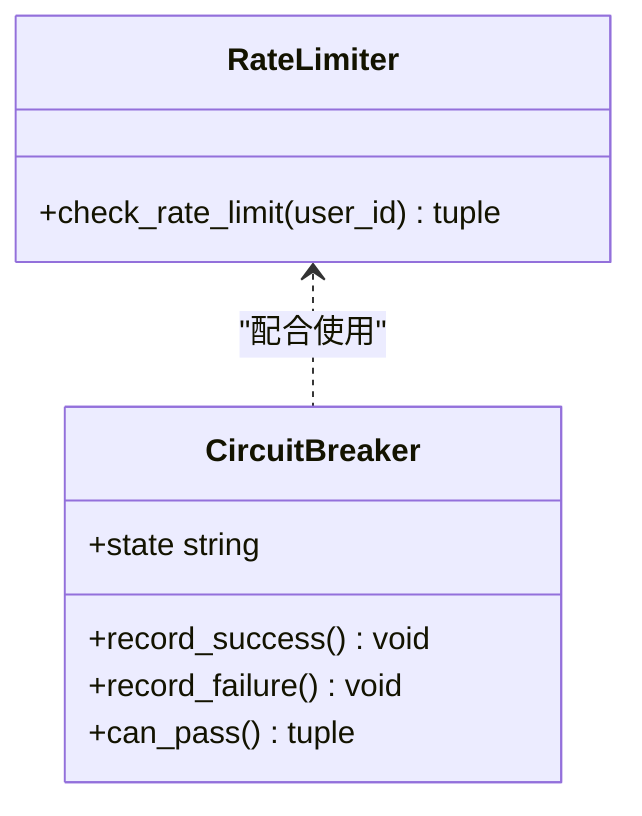
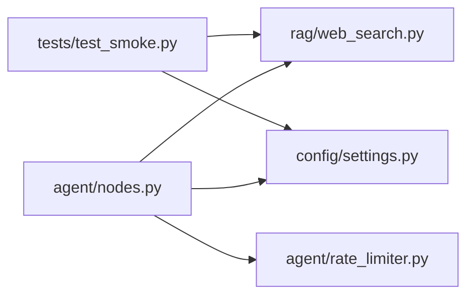

# 联网搜索集成

<cite>
**本文引用的文件**
- [rag/web_search.py](file://rag/web_search.py)
- [agent/nodes.py](file://agent/nodes.py)
- [config/settings.py](file://config/settings.py)
- [agent/rate_limiter.py](file://agent/rate_limiter.py)
- [tests/test_smoke.py](file://tests/test_smoke.py)
</cite>

## 目录
1. [简介](#简介)
2. [项目结构](#项目结构)
3. [核心组件](#核心组件)
4. [架构总览](#架构总览)
5. [详细组件分析](#详细组件分析)
6. [依赖关系分析](#依赖关系分析)
7. [性能与限流](#性能与限流)
8. [故障排查指南](#故障排查指南)
9. [结论](#结论)

## 简介
本章节说明“联网搜索集成”的实现方案，涵盖搜索引擎 API 调用、搜索结果获取与格式化、搜索策略（主备引擎）、结果过滤与质量评估方法、配置项、API 限流处理以及错误重试机制。该能力通过统一节点接入到智能体工作流中，将搜索结果以结构化上下文注入生成环节，提升时效性问题的回答质量。

## 项目结构
联网搜索相关代码主要分布在以下位置：
- 搜索实现与格式化：rag/web_search.py
- 工作流节点与路由：agent/nodes.py
- 全局配置：config/settings.py
- 限流与熔断：agent/rate_limiter.py
- 冒烟测试用例：tests/test_smoke.py

图表来源
- [agent/nodes.py:324-341](file://agent/nodes.py#L324-L341)
- [rag/web_search.py:76-133](file://rag/web_search.py#L76-L133)

章节来源
- [agent/nodes.py:324-341](file://agent/nodes.py#L324-L341)
- [rag/web_search.py:76-133](file://rag/web_search.py#L76-L133)

## 核心组件
- 双引擎搜索：优先 DuckDuckGo，失败或无结果时回退百度，保证可用性。
- 统一结果格式：将不同引擎的结果标准化为 {title, url, snippet}，再格式化为带来源标记的文本块，供生成节点使用。
- 配置开关：支持启用/禁用、最大结果数、超时等参数。
- 工作流集成：通过 agent/nodes.py 中的 web_search_node 执行搜索并写入 rag_context。
- 限流与熔断：提供按用户的滑动窗口限流和熔断器，用于保护外部服务。

章节来源
- [rag/web_search.py:19-73](file://rag/web_search.py#L19-L73)
- [rag/web_search.py:97-133](file://rag/web_search.py#L97-L133)
- [agent/nodes.py:324-341](file://agent/nodes.py#L324-L341)
- [config/settings.py:109-112](file://config/settings.py#L109-L112)
- [agent/rate_limiter.py:22-47](file://agent/rate_limiter.py#L22-L47)
- [agent/rate_limiter.py:51-147](file://agent/rate_limiter.py#L51-L147)

## 架构总览
下图展示了从用户输入到联网搜索再到生成的完整流程，包括路由、搜索、格式化与注入上下文的关键步骤。

图表来源
- [agent/nodes.py:324-341](file://agent/nodes.py#L324-L341)
- [rag/web_search.py:122-133](file://rag/web_search.py#L122-L133)

## 详细组件分析

### 搜索引擎 API 调用与回退策略
- 主引擎 DuckDuckGo：通过 ddgs 库进行文本搜索，捕获异常并记录日志，返回空列表表示失败。
- 备用引擎百度：通过 baidusearch 库进行搜索，兼容对象属性与字典键，确保鲁棒性。
- 回退逻辑：先尝试 DuckDuckGo；若结果为空则自动切换至百度，提高成功率。

图表来源
- [rag/web_search.py:19-44](file://rag/web_search.py#L19-L44)
- [rag/web_search.py:47-73](file://rag/web_search.py#L47-L73)
- [rag/web_search.py:76-94](file://rag/web_search.py#L76-L94)

章节来源
- [rag/web_search.py:19-94](file://rag/web_search.py#L19-L94)

### 搜索结果获取与格式化
- 统一数据结构：每个结果包含 title、url、snippet。
- 格式化输出：将结果拼接为带编号、来源 URL、标题与类型标记的文本块，便于生成节点理解来源与内容。
- 一站式接口：search_and_format 封装搜索与格式化，直接返回可用于上下文的字符串。

章节来源
- [rag/web_search.py:97-133](file://rag/web_search.py#L97-L133)

### 搜索策略与结果过滤
- 搜索策略：优先国际通用且质量较好的 DuckDuckGo；不可用时自动回退百度，兼顾国内网络稳定性。
- 结果过滤：当前模块未对搜索结果做相关性阈值过滤；如需进一步筛选，可在上层根据 snippet 长度、关键词匹配或外部重排序模型进行处理。
- 质量评估建议：
  - 基于 snippet 长度与可读性评分
  - 基于标题与查询的相关度（可使用轻量重排序模型）
  - 去重与来源可信度加权（域名白名单、历史点击率等）

章节来源
- [rag/web_search.py:76-94](file://rag/web_search.py#L76-L94)
- [rag/web_search.py:97-133](file://rag/web_search.py#L97-L133)

### 搜索引擎配置
- 启用开关：web_search_enabled
- 最大结果数：web_search_max_results
- 搜索超时：web_search_timeout
- 这些配置在 agent/nodes.py 的 web_search_node 中被读取并传入搜索函数。

章节来源
- [config/settings.py:109-112](file://config/settings.py#L109-L112)
- [agent/nodes.py:324-341](file://agent/nodes.py#L324-L341)

### API 限流处理
- 滑动窗口限流：按 user_id 维度限制每分钟请求次数，避免外部 API 被滥用。
- 熔断器：连续失败达到阈值后进入熔断状态，冷却期过后半开试探，恢复成功后关闭熔断。
- 使用方式：在调用搜索前可结合 check_rate_limit 与 check_circuit 进行前置检查与状态管理。

图表来源
- [agent/rate_limiter.py:22-47](file://agent/rate_limiter.py#L22-L47)
- [agent/rate_limiter.py:51-147](file://agent/rate_limiter.py#L51-L147)

章节来源
- [agent/rate_limiter.py:22-47](file://agent/rate_limiter.py#L22-L47)
- [agent/rate_limiter.py:51-147](file://agent/rate_limiter.py#L51-L147)

### 错误重试机制
- 当前搜索模块内部对异常进行捕获并返回空结果，未实现指数退避或多次重试。
- 建议在调用层（如 web_search_node 或上游路由）增加重试策略：
  - 针对网络抖动与临时 429 限流，采用指数退避 + 随机抖动
  - 设置最大重试次数与总超时上限
  - 记录重试日志以便定位问题

章节来源
- [rag/web_search.py:19-73](file://rag/web_search.py#L19-L73)
- [agent/nodes.py:324-341](file://agent/nodes.py#L324-L341)

## 依赖关系分析
- 工作流集成：agent/nodes.py 的 web_search_node 调用 rag/web_search.py 的 search_and_format，并将结果写入 rag_context。
- 配置依赖：agent/nodes.py 从 config/settings.py 读取 web_search_* 配置。
- 限流与熔断：agent/rate_limiter.py 提供限流与熔断能力，可与搜索调用结合使用。
- 测试验证：tests/test_smoke.py 验证模块导入与配置项存在性。

图表来源
- [agent/nodes.py:324-341](file://agent/nodes.py#L324-L341)
- [rag/web_search.py:76-133](file://rag/web_search.py#L76-L133)
- [config/settings.py:109-112](file://config/settings.py#L109-L112)
- [agent/rate_limiter.py:22-47](file://agent/rate_limiter.py#L22-L47)
- [tests/test_smoke.py:276-297](file://tests/test_smoke.py#L276-L297)

章节来源
- [agent/nodes.py:324-341](file://agent/nodes.py#L324-L341)
- [rag/web_search.py:76-133](file://rag/web_search.py#L76-L133)
- [config/settings.py:109-112](file://config/settings.py#L109-L112)
- [agent/rate_limiter.py:22-47](file://agent/rate_limiter.py#L22-L47)
- [tests/test_smoke.py:276-297](file://tests/test_smoke.py#L276-L297)

## 性能与限流
- 性能要点：
  - 双引擎回退可能引入额外延迟，建议合理设置超时与最大结果数。
  - 格式化阶段仅字符串拼接，开销较低。
- 限流建议：
  - 开启 rate_limit_per_minute 防止高频请求导致外部 API 限流。
  - 结合熔断器在连续失败时快速拒绝，降低雪崩风险。
- 优化方向：
  - 在上层增加重试与缓存（相同查询短时间复用）。
  - 对搜索结果进行轻量重排序以提升最终答案质量。

[本节为通用指导，不直接分析具体文件]

## 故障排查指南
- 常见问题：
  - 搜索无结果：检查 DuckDuckGo 与百度是否均可用；查看日志中是否有异常信息。
  - 搜索超时：调整 web_search_timeout 与网络环境。
  - 限流触发：检查 rate_limit_per_minute 配置与用户请求频率。
  - 熔断触发：关注连续失败次数与冷却时间，必要时调整 circuit_breaker_threshold 与 recovery。
- 定位方法：
  - 查看 agent/nodes.py 中 web_search_node 的异常打印与日志。
  - 查看 rag/web_search.py 中各引擎的日志输出。
  - 使用 tests/test_smoke.py 验证模块导入与配置项。

章节来源
- [agent/nodes.py:324-341](file://agent/nodes.py#L324-L341)
- [rag/web_search.py:19-73](file://rag/web_search.py#L19-L73)
- [tests/test_smoke.py:276-297](file://tests/test_smoke.py#L276-L297)

## 结论
联网搜索集成为系统提供了时效性问题的回答能力，采用主备双引擎策略保障可用性，并通过统一格式化将结果无缝注入生成环节。结合配置开关、限流与熔断机制，能够在高并发与不稳定网络环境下保持稳健运行。后续可在上层增加重试、缓存与重排序，进一步提升响应速度与答案质量。