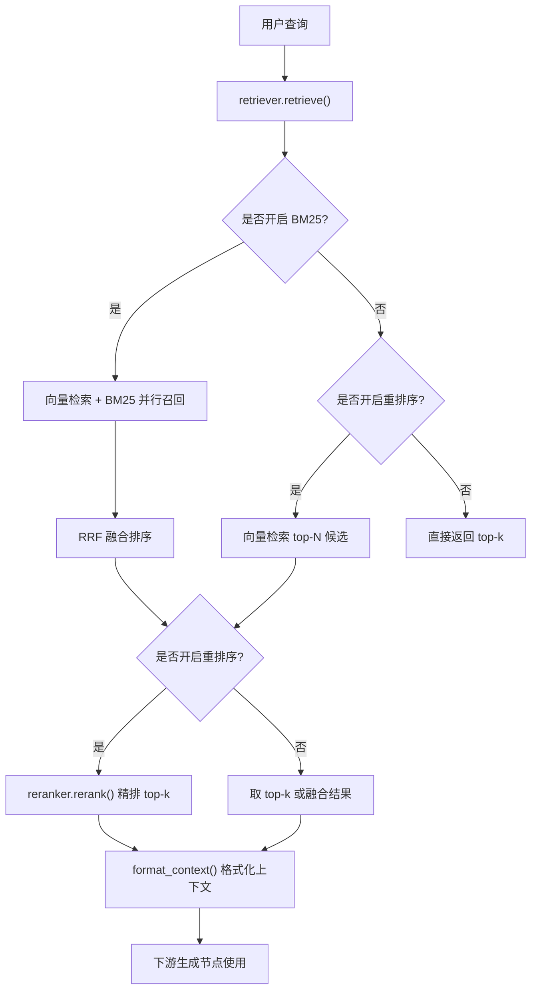
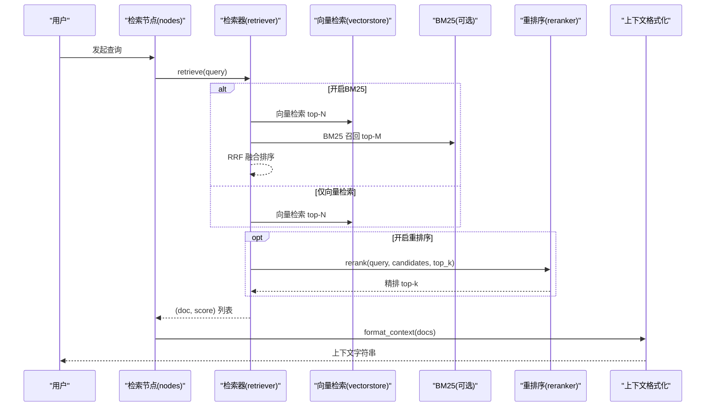
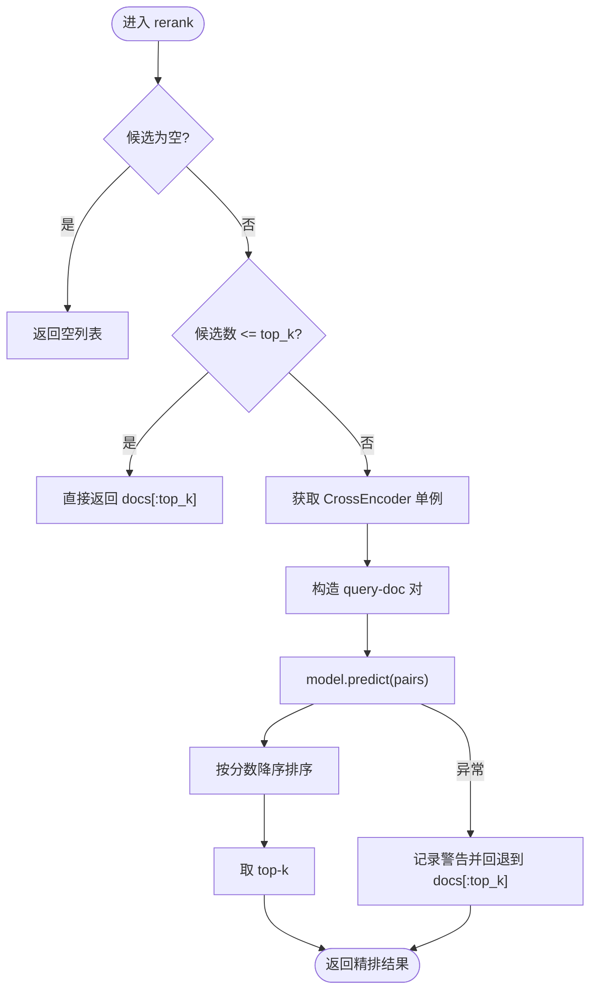
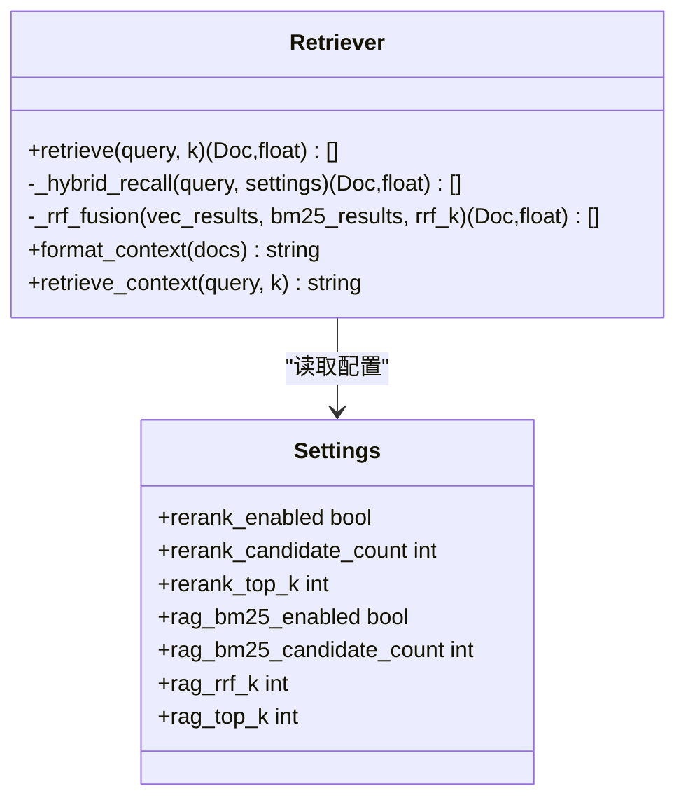
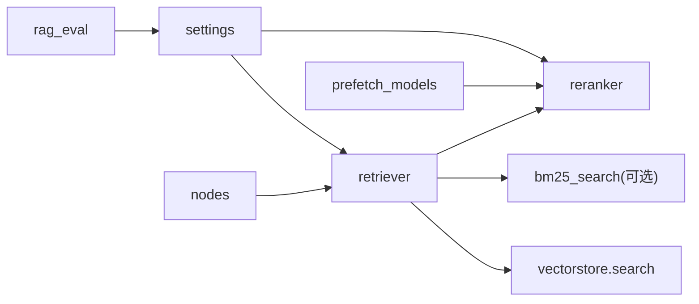

# 重排序模块

<cite>
**本文引用的文件**
- [rag/reranker.py](file://rag/reranker.py)
- [rag/retriever.py](file://rag/retriever.py)
- [config/settings.py](file://config/settings.py)
- [agent/nodes.py](file://agent/nodes.py)
- [scripts/prefetch_models.py](file://scripts/prefetch_models.py)
- [evaluation/rag_eval.py](file://evaluation/rag_eval.py)
</cite>

## 目录
1. [简介](#简介)
2. [项目结构](#项目结构)
3. [核心组件](#核心组件)
4. [架构总览](#架构总览)
5. [详细组件分析](#详细组件分析)
6. [依赖关系分析](#依赖关系分析)
7. [性能考虑](#性能考虑)
8. [故障排查指南](#故障排查指南)
9. [结论](#结论)
10. [附录](#附录)

## 简介
本模块聚焦于 RAG（检索增强生成）中的“重排序”环节：在初步检索召回候选文档后，使用交叉编码器（CrossEncoder）对候选进行精排，从而提升最终注入给大模型的上下文质量。该模块通过可配置开关与参数，灵活组合向量检索、BM25 关键词检索与 CrossEncoder 精排，兼顾召回率与相关性。

## 项目结构
与重排序相关的代码主要分布在以下位置：
- rag/reranker.py：实现 CrossEncoder 单例加载与 rerank 打分排序逻辑
- rag/retriever.py：编排检索流程（多路召回 + 可选重排序），并格式化上下文
- config/settings.py：集中管理重排序相关配置项
- agent/nodes.py：RAG 检索节点，负责调用 retriever 并进行相关度过滤策略控制
- scripts/prefetch_models.py：启动前预下载并校验重排序模型
- evaluation/rag_eval.py：RAG 评估套件，可用于评估重排序对检索质量的影响

图表来源
- [rag/retriever.py:18-52](file://rag/retriever.py#L18-L52)
- [rag/reranker.py:54-97](file://rag/reranker.py#L54-L97)
- [config/settings.py:95-100](file://config/settings.py#L95-L100)

章节来源
- [rag/retriever.py:1-52](file://rag/retriever.py#L1-L52)
- [config/settings.py:95-100](file://config/settings.py#L95-L100)

## 核心组件
- 重排序器（reranker）：基于 CrossEncoder 的 query-doc 成对打分，按分数降序取 top-k；提供失败回退到原始候选的能力
- 检索编排（retriever）：根据配置决定多路召回与是否启用重排序，统一输出 (Document, score) 列表
- 配置中心（settings）：集中定义重排序开关、模型名、设备、候选数与最终 top-k 等关键参数
- 节点集成（nodes）：在 RAG 检索节点中调用 retriever，并在纯向量路径下应用相关度阈值过滤
- 预取脚本（prefetch_models）：启动时预下载并校验重排序模型，避免首次请求冷启动延迟
- 评估套件（rag_eval）：提供检索相关性、忠实度、帮助度、答案相关性等评估维度，用于衡量重排序效果

章节来源
- [rag/reranker.py:26-97](file://rag/reranker.py#L26-L97)
- [rag/retriever.py:18-52](file://rag/retriever.py#L18-L52)
- [config/settings.py:95-100](file://config/settings.py#L95-L100)
- [agent/nodes.py:284-321](file://agent/nodes.py#L284-L321)
- [scripts/prefetch_models.py:40-53](file://scripts/prefetch_models.py#L40-L53)
- [evaluation/rag_eval.py:63-120](file://evaluation/rag_eval.py#L63-L120)

## 架构总览
重排序作为两阶段检索的第二阶段，位于召回之后、上下文格式化之前。其输入为候选文档列表及其分数，输出为重排后的 top-k 文档及新分数。

图表来源
- [rag/retriever.py:18-52](file://rag/retriever.py#L18-L52)
- [rag/reranker.py:54-97](file://rag/reranker.py#L54-L97)
- [agent/nodes.py:284-321](file://agent/nodes.py#L284-L321)

## 详细组件分析

### 重排序器（reranker）
- 模型加载：采用延迟初始化的模块级单例，首次调用时从配置读取模型名与设备，并通过 CrossEncoder 初始化
- 打分流程：将 query 与每个候选文档拼接为 pair，批量 predict 得到分数，按分数降序排序后取 top-k
- 容错机制：若打分异常，记录警告并回退到原始候选的前 top-k
- 长度限制：max_length=512，适用于常见片段长度

图表来源
- [rag/reranker.py:54-97](file://rag/reranker.py#L54-L97)

章节来源
- [rag/reranker.py:26-97](file://rag/reranker.py#L26-L97)

### 检索编排（retriever）
- 多路召回：当开启 BM25 时，并行执行向量检索与 BM25 召回，并使用 RRF（倒数排名融合）合并两路结果
- 重排序开关：若开启重排序，则对融合或向量召回的候选进行精排，否则直接取 top-k
- 上下文格式化：将 (Document, score) 列表转换为带来源、标题与归一化相关度的文本块，便于下游展示与生成

图表来源
- [rag/retriever.py:18-110](file://rag/retriever.py#L18-L110)
- [config/settings.py:83-100](file://config/settings.py#L83-L100)

章节来源
- [rag/retriever.py:18-110](file://rag/retriever.py#L18-L110)
- [config/settings.py:83-100](file://config/settings.py#L83-L100)

### 配置项（settings）
- rerank_enabled：是否启用重排序
- rerank_model：CrossEncoder 模型标识（默认中文优化模型）
- rerank_device：运行设备（cpu/gpu）
- rerank_candidate_count：向量检索召回候选数量（精排前的候选池大小）
- rerank_top_k：精排后返回的 top-k 数量

这些参数直接影响召回范围、精排计算量与最终上下文质量。

章节来源
- [config/settings.py:95-100](file://config/settings.py#L95-L100)

### 节点集成（nodes）
- 在 RAG 检索节点中调用 retriever 获取上下文
- 相关度阈值过滤仅在纯向量检索路径生效（未开启重排序与 BM25），以避免不同分数语义导致的误判
- 若检索失败，降级为空上下文，保证主链路稳定

章节来源
- [agent/nodes.py:284-321](file://agent/nodes.py#L284-L321)

### 预取脚本（prefetch_models）
- 启动时预下载并校验重排序模型，执行一次打分以验证可用性
- 若关闭重排序则跳过，减少不必要的资源占用

章节来源
- [scripts/prefetch_models.py:40-53](file://scripts/prefetch_models.py#L40-L53)

## 依赖关系分析
- retriever 依赖 vectorstore.search 与（可选）bm25_search，以及 reranker.rerank
- reranker 依赖 sentence_transformers.CrossEncoder 与配置中心
- nodes 依赖 retriever 与配置中心，控制过滤策略
- prefetch 脚本依赖配置中心与 CrossEncoder，用于启动前准备
- 评估套件依赖 OpenEvals 与 LLM 评判器，用于量化重排序对检索质量的影响

图表来源
- [rag/retriever.py:18-52](file://rag/retriever.py#L18-L52)
- [rag/reranker.py:26-51](file://rag/reranker.py#L26-L51)
- [config/settings.py:95-100](file://config/settings.py#L95-L100)
- [agent/nodes.py:284-321](file://agent/nodes.py#L284-L321)
- [scripts/prefetch_models.py:40-53](file://scripts/prefetch_models.py#L40-L53)
- [evaluation/rag_eval.py:63-120](file://evaluation/rag_eval.py#L63-L120)

章节来源
- [rag/retriever.py:18-52](file://rag/retriever.py#L18-L52)
- [rag/reranker.py:26-51](file://rag/reranker.py#L26-L51)
- [config/settings.py:95-100](file://config/settings.py#L95-L100)
- [agent/nodes.py:284-321](file://agent/nodes.py#L284-L321)
- [scripts/prefetch_models.py:40-53](file://scripts/prefetch_models.py#L40-L53)
- [evaluation/rag_eval.py:63-120](file://evaluation/rag_eval.py#L63-L120)

## 性能考虑
- 候选规模与延迟：rerank_candidate_count 越大，CrossEncoder 需要处理的 pair 越多，延迟与显存占用越高。建议根据业务 QPS 与延迟预算调优
- 设备选择：rerank_device 设为 gpu 可显著降低推理延迟，但需确保可用显存；cpu 模式更稳健但较慢
- 模型长度限制：max_length=512，过长片段会被截断，影响打分准确性；建议在入库时对 chunk 做合理切分与去噪
- 失败回退：当 CrossEncoder 不可用时自动回退到原始候选，保障服务可用性
- 多路召回与融合：开启 BM25 与 RRF 融合可提升精确匹配召回率，但会增加计算开销；可根据场景权衡
- 预热与缓存：模块级单例与启动预取可减少首次请求冷启动延迟

[本节为通用性能指导，不直接分析具体文件]

## 故障排查指南
- 重排序失败回退：若 CrossEncoder 预测异常，会记录警告并返回原始候选前 top-k；检查日志定位网络或模型加载问题
- 模型预下载失败：使用预取脚本在启动阶段校验模型可用性，必要时重试或切换镜像端点
- 分数语义差异：在纯向量路径下才应用相关度阈值过滤；开启重排序或 BM25 时不适用统一归一化过滤，避免误删
- 配置错误：确认 rerank_enabled、rerank_model、rerank_device、rerank_candidate_count、rerank_top_k 等参数正确设置

章节来源
- [rag/reranker.py:95-97](file://rag/reranker.py#L95-L97)
- [scripts/prefetch_models.py:40-53](file://scripts/prefetch_models.py#L40-L53)
- [agent/nodes.py:304-317](file://agent/nodes.py#L304-L317)
- [config/settings.py:95-100](file://config/settings.py#L95-L100)

## 结论
重排序模块通过 CrossEncoder 对候选文档进行精细打分与排序，显著提升注入上下文的准确性与相关性。结合可配置的候选规模、设备与 top-k，可在精度与延迟之间取得平衡。配合多路召回与 RRF 融合，进一步改善召回质量。通过评估套件可量化重排序带来的收益，持续优化参数与流程。

[本节为总结性内容，不直接分析具体文件]

## 附录

### 重排序效果评估方法
- 评估维度：检索相关性、忠实度（groundedness）、帮助度、答案相关性
- 评估方式：使用 OpenEvals 的 LLM-as-judge 构建评测器，对样本进行自动化评分
- 指标解读：检索相关性反映候选与问题的匹配程度；忠实度衡量答案是否基于上下文；帮助度与答案相关性评估回答质量

章节来源
- [evaluation/rag_eval.py:1-120](file://evaluation/rag_eval.py#L1-L120)

### 关键配置项速查
- rerank_enabled：是否启用重排序
- rerank_model：CrossEncoder 模型标识
- rerank_device：运行设备（cpu/gpu）
- rerank_candidate_count：精排前候选数量
- rerank_top_k：精排后返回数量
- rag_bm25_enabled：是否开启 BM25 多路召回
- rag_rrf_k：RRF 融合常数

章节来源
- [config/settings.py:83-100](file://config/settings.py#L83-L100)