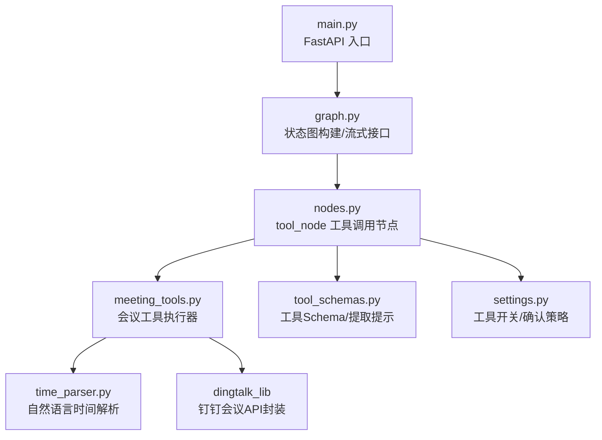
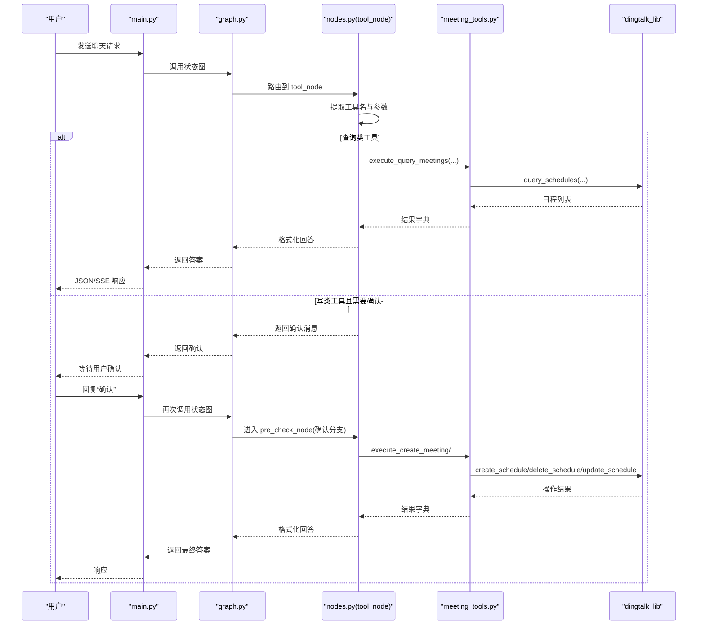
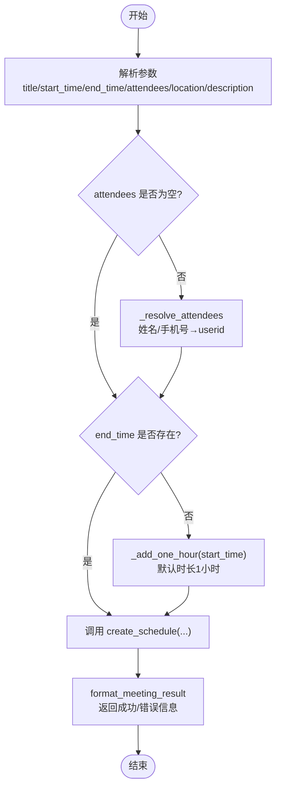
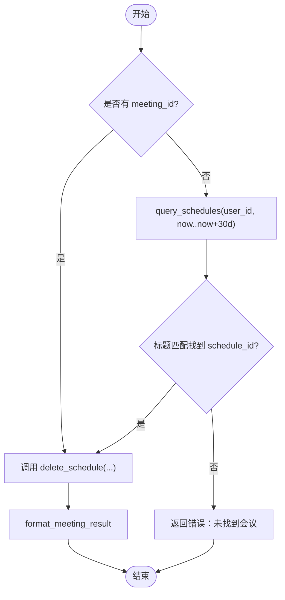
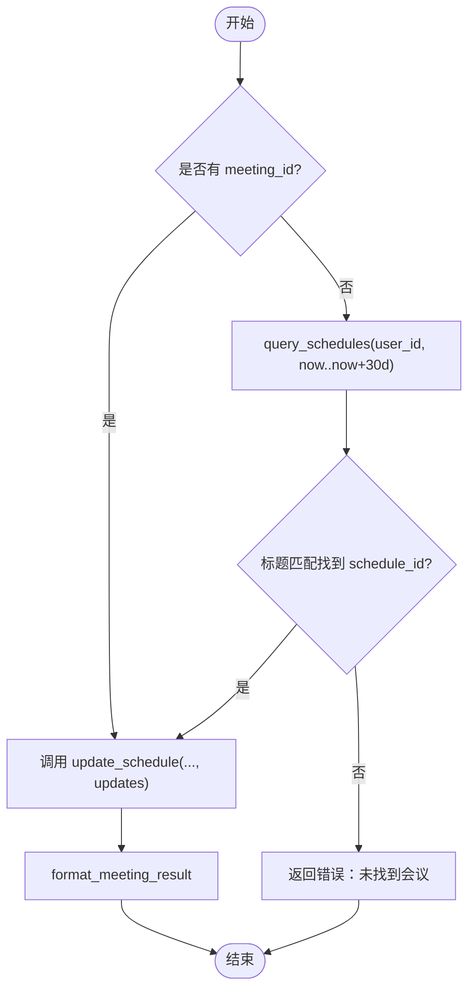
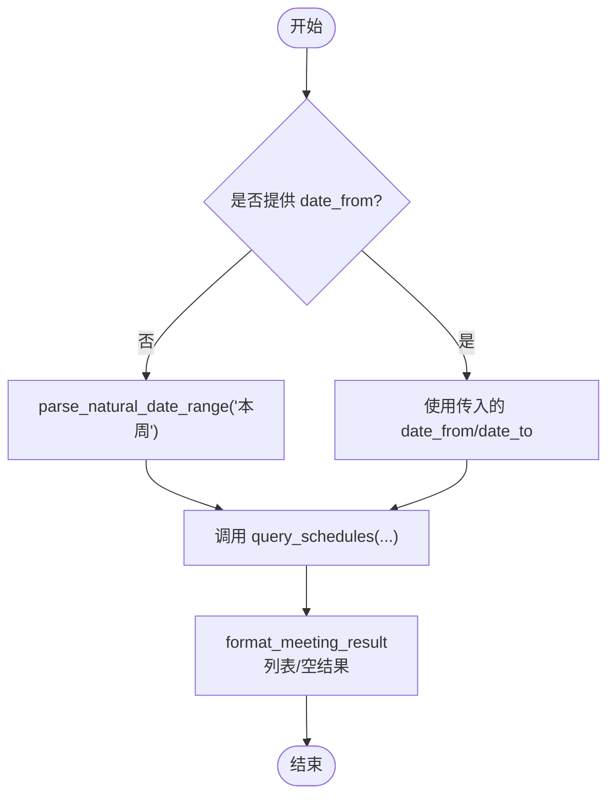
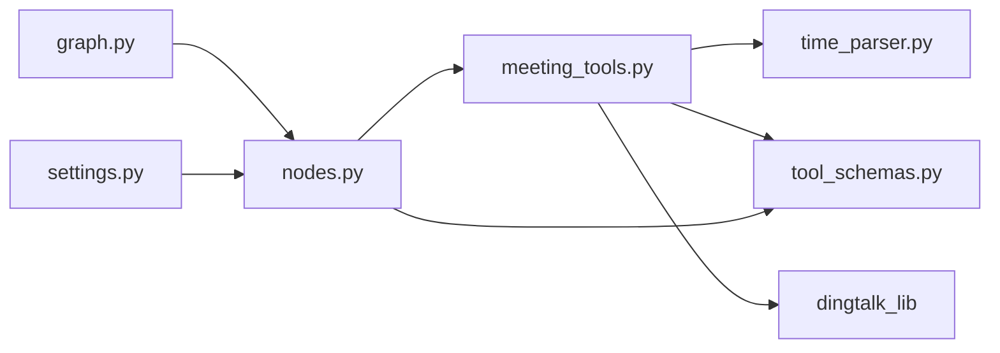
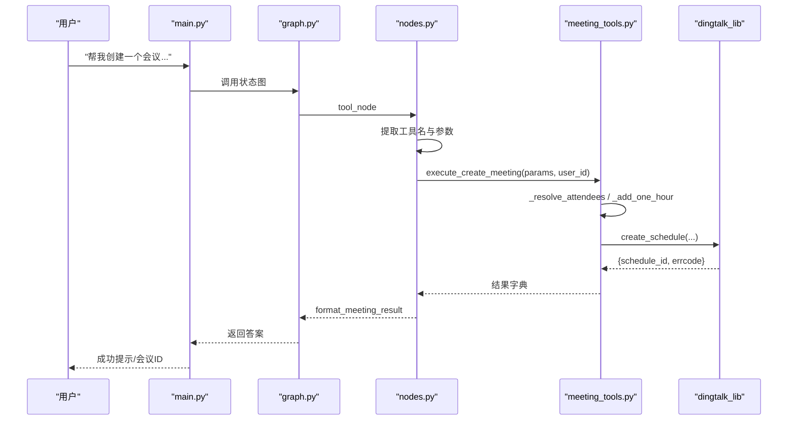
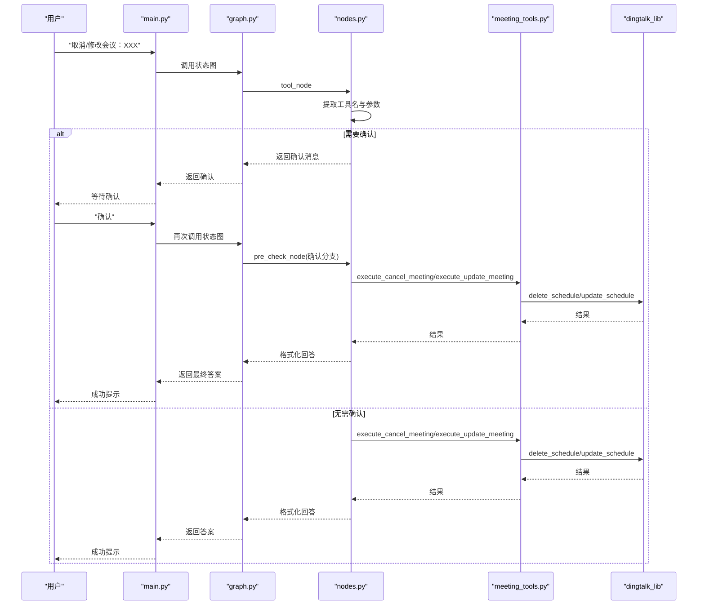
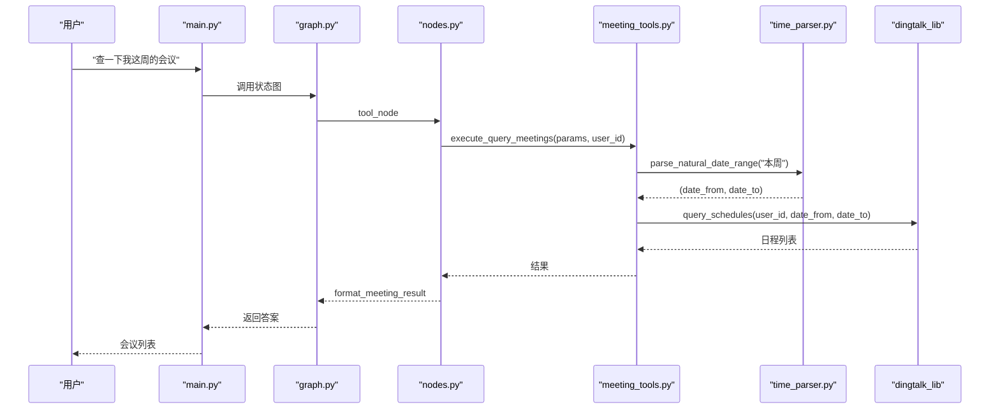

# 会议管理工具

<cite>
**本文引用的文件**
- [meeting_tools.py](file://agent/tools/meeting_tools.py)
- [time_parser.py](file://agent/tools/time_parser.py)
- [tool_schemas.py](file://agent/tools/tool_schemas.py)
- [nodes.py](file://agent/nodes.py)
- [graph.py](file://agent/graph.py)
- [settings.py](file://config/settings.py)
- [main.py](file://main.py)
</cite>

## 目录
1. [简介](#简介)
2. [项目结构](#项目结构)
3. [核心组件](#核心组件)
4. [架构总览](#架构总览)
5. [详细组件分析](#详细组件分析)
6. [依赖关系分析](#依赖关系分析)
7. [性能与可靠性](#性能与可靠性)
8. [故障排查指南](#故障排查指南)
9. [结论](#结论)
10. [附录：API 调用流程与时序图](#附录api-调用流程与时序图)

## 简介
本模块为钉钉AI智能体助手中的“会议管理工具”，提供创建、取消、修改、查询会议等能力。其核心职责包括：
- 将自然语言或结构化参数转换为钉钉日程/会议 API 所需格式
- 解析参会人（姓名/手机号）为钉钉用户ID
- 处理时间范围与默认时长
- 与 dingtalk_lib 集成，完成实际的会议操作
- 对用户进行写操作确认，并格式化结果输出

该工具通过 LangGraph 工作流编排，在路由阶段识别“工具调用”意图后进入 tool_node，再分发到具体会议工具执行器。

## 项目结构
围绕会议管理的代码主要分布在以下位置：
- agent/tools/meeting_tools.py：会议工具执行器（创建/取消/修改/查询）、结果与确认消息格式化、参会人解析、时间补全
- agent/tools/time_parser.py：自然语言时间/日期范围解析（如“本周”）
- agent/tools/tool_schemas.py：工具 Schema 定义与提取提示词，声明会议相关工具的参数结构
- agent/nodes.py：LangGraph 节点实现，包含工具调用入口、确认流程、结果格式化分发
- agent/graph.py：状态图构建与流式接口封装
- config/settings.py：全局配置（是否启用工具调用、是否需要用户确认等）
- main.py：Web 服务入口，健康检查与聊天接口

图表来源
- [main.py:154-209](file://main.py#L154-L209)
- [graph.py:44-102](file://graph.py#L44-L102)
- [nodes.py:647-779](file://nodes.py#L647-L779)
- [meeting_tools.py:17-128](file://meeting_tools.py#L17-L128)
- [time_parser.py:29-63](file://time_parser.py#L29-L63)
- [settings.py:151-155](file://config/settings.py#L151-L155)

章节来源
- [main.py:154-209](file://main.py#L154-L209)
- [graph.py:44-102](file://graph.py#L44-L102)
- [nodes.py:647-779](file://nodes.py#L647-L779)
- [meeting_tools.py:17-128](file://meeting_tools.py#L17-L128)
- [time_parser.py:29-63](file://time_parser.py#L29-L63)
- [settings.py:151-155](file://config/settings.py#L151-L155)

## 核心组件
- 会议工具执行器（meeting_tools.py）
  - 创建会议：参数校验、参会人解析、默认时长补全、调用 create_schedule
  - 取消会议：优先 meeting_id，否则按标题匹配最近30天日程，调用 delete_schedule
  - 修改会议：优先 meeting_id，否则按标题匹配最近30天日程，调用 update_schedule
  - 查询会议：支持自然语言时间范围（默认“本周”），调用 query_schedules
  - 结果格式化：统一错误提示、成功反馈、列表展示
  - 参会人解析：手机号正则匹配 + 姓名搜索，失败保留原值
  - 时间处理：缺省结束时间时自动加1小时
- 时间解析器（time_parser.py）
  - parse_natural_date_range：将“今天/明天/本周/下周/本月”等转为 ISO 起止时间
  - parse_natural_time：将“下午3点/上午10点半/15:30”等转为 ISO 时间
- 工具 Schema（tool_schemas.py）
  - 定义 create_meeting/cancel_meeting/update_meeting/query_meetings 的参数结构与必填项
  - 提供 LLM 参数提取提示词 TOOL_EXTRACT_PROMPT
  - 区分读/写工具集合，用于确认策略
- 工具节点（nodes.py）
  - tool_node：LLM 提取工具名+参数 → 查询类直接执行 → 写操作需确认 → 执行并格式化返回
  - _execute_tool：根据工具名分发到对应执行器
  - _format_tool_result/_format_confirmation：统一结果与确认消息
- 工作流（graph.py）
  - 构建状态图，tool 节点直接到 END，不经过 generate
  - 提供 chat/chat_stream/astream_chat 同步/异步流式入口
- 配置（settings.py）
  - tool_calling_enabled：是否启用工具调用
  - tool_confirmation_required：写操作是否需要用户确认

章节来源
- [meeting_tools.py:17-225](file://meeting_tools.py#L17-L225)
- [time_parser.py:11-120](file://time_parser.py#L11-L120)
- [tool_schemas.py:8-121](file://tool_schemas.py#L8-L121)
- [nodes.py:647-779](file://nodes.py#L647-L779)
- [graph.py:44-102](file://graph.py#L44-L102)
- [settings.py:151-155](file://config/settings.py#L151-L155)

## 架构总览
会议管理工具嵌入在 LangGraph 工作流中，整体流程如下：
- Web 请求进入 main.py 的 /api/chat 或 /api/chat/stream
- graph.py 构建状态图，预检查节点进行缓存命中与路由判断
- 若识别为工具调用，进入 tool_node
- tool_node 使用小模型从用户输入中提取工具名与参数
- 查询类工具直接执行；写类工具在开启确认时先返回确认消息
- 用户回复“确认”后，pre_check_node 再次进入并执行工具
- 执行结果经 format_meeting_result 格式化后返回

图表来源
- [main.py:154-209](file://main.py#L154-L209)
- [graph.py:44-102](file://graph.py#L44-L102)
- [nodes.py:93-128](file://nodes.py#L93-L128)
- [nodes.py:647-779](file://nodes.py#L647-L779)
- [meeting_tools.py:17-128](file://meeting_tools.py#L17-L128)

## 详细组件分析

### 创建会议（create_meeting）
- 参数来源：LLM 从用户输入提取，遵循 tool_schemas 定义的 schema
- 参会人解析：_resolve_attendees 将姓名/手机号转为钉钉用户ID；手机号采用正则匹配，失败则保留原值；姓名通过 search_users_by_name 查找，取第一个 userid
- 时间处理：若未提供 end_time，则基于 start_time 自动加1小时（_add_one_hour）
- API 调用：调用 dingtalk_lib.create_schedule(user_id, title, start_time, end_time, attendees, location, description)
- 结果格式化：format_meeting_result 返回成功提示与 schedule_id（如有）

图表来源
- [meeting_tools.py:17-47](file://meeting_tools.py#L17-L47)
- [meeting_tools.py:185-225](file://meeting_tools.py#L185-L225)

章节来源
- [meeting_tools.py:17-47](file://meeting_tools.py#L17-L47)
- [meeting_tools.py:185-225](file://meeting_tools.py#L185-L225)
- [tool_schemas.py:55-70](file://tool_schemas.py#L55-L70)

### 取消会议（cancel_meeting）
- 参数来源：meeting_id 或 meeting_title（二选一），notify_attendees 默认为 True
- 无 meeting_id 时的回退逻辑：查询当前用户未来30天的日程，按标题模糊匹配获取 schedule_id
- API 调用：delete_schedule(user_id, meeting_id, notify)
- 结果格式化：统一错误提示与成功反馈

图表来源
- [meeting_tools.py:50-80](file://meeting_tools.py#L50-L80)

章节来源
- [meeting_tools.py:50-80](file://meeting_tools.py#L50-L80)
- [tool_schemas.py:71-82](file://tool_schemas.py#L71-L82)

### 修改会议（update_meeting）
- 参数来源：meeting_id 或 meeting_title（二选一），updates 为要更新的字段对象（title/start_time/end_time/location）
- 无 meeting_id 时的回退逻辑：同取消会议，查询未来30天并按标题匹配
- API 调用：update_schedule(user_id, meeting_id, updates)
- 结果格式化：统一错误提示与成功反馈

图表来源
- [meeting_tools.py:83-113](file://meeting_tools.py#L83-L113)

章节来源
- [meeting_tools.py:83-113](file://meeting_tools.py#L83-L113)
- [tool_schemas.py:83-102](file://tool_schemas.py#L83-L102)

### 查询会议（query_meetings）
- 参数来源：date_from/date_to（ISO 8601），未指定时默认查询“本周”
- 时间解析：parse_natural_date_range("本周") 生成起止时间
- API 调用：query_schedules(user_id, date_from, date_to)
- 结果格式化：若无日程返回“暂无会议”，否则列出主题、时间、地点

图表来源
- [meeting_tools.py:116-128](file://meeting_tools.py#L116-L128)
- [time_parser.py:29-63](file://time_parser.py#L29-L63)

章节来源
- [meeting_tools.py:116-128](file://meeting_tools.py#L116-L128)
- [time_parser.py:29-63](file://time_parser.py#L29-L63)
- [tool_schemas.py:103-113](file://tool_schemas.py#L103-L113)

### 参会人 ID 转换与时间处理
- 参会人解析：
  - 手机号匹配：^1\d{10}$，调用 get_user_by_mobile 获取 userid，失败保留原值
  - 姓名搜索：search_users_by_name 返回列表，取第一个 userid，失败保留原值
- 时间处理：
  - 缺省结束时间：start_time + 1 小时（_add_one_hour）
  - 自然语言时间范围：parse_natural_date_range 支持“今天/明天/本周/下周/本月”

章节来源
- [meeting_tools.py:185-225](file://meeting_tools.py#L185-L225)
- [time_parser.py:11-120](file://time_parser.py#L11-L120)

### 用户确认流程
- 写操作（create_meeting/cancel_meeting/update_meeting）在 settings.tool_confirmation_required=True 时需用户确认
- tool_node 返回确认消息（format_meeting_confirmation），设置 pending_confirmation 与 confirmation_context
- 用户回复“确认/确定/yes/y/OK/ok”后，pre_check_node 进入确认分支，执行工具并返回结果
- 读操作（query_meetings）无需确认，直接执行

章节来源
- [nodes.py:93-128](file://nodes.py#L93-L128)
- [nodes.py:647-779](file://nodes.py#L647-L779)
- [settings.py:151-155](file://config/settings.py#L151-L155)
- [tool_schemas.py:116-121](file://tool_schemas.py#L116-L121)

### 结果格式化输出
- 统一错误处理：errcode != 0 时返回“操作失败: ...”
- 创建/取消/更新：简洁成功提示
- 查询：统计数量并逐条显示主题、时间、地点

章节来源
- [meeting_tools.py:131-159](file://meeting_tools.py#L131-L159)
- [nodes.py:749-764](file://nodes.py#L749-L764)

## 依赖关系分析
- 外部依赖
  - dingtalk_lib：钉钉会议 API 封装（create_schedule/delete_schedule/update_schedule/query_schedules/get_user_by_mobile/search_users_by_name）
- 内部依赖
  - time_parser：自然语言时间/日期范围解析
  - tool_schemas：工具 Schema 与提取提示词
  - nodes/graph：LangGraph 工作流编排与流式接口
  - settings：全局配置（工具开关、确认策略）

图表来源
- [meeting_tools.py:17-128](file://meeting_tools.py#L17-L128)
- [nodes.py:647-779](file://nodes.py#L647-L779)
- [graph.py:44-102](file://graph.py#L44-L102)
- [settings.py:151-155](file://config/settings.py#L151-L155)

章节来源
- [meeting_tools.py:17-128](file://meeting_tools.py#L17-L128)
- [nodes.py:647-779](file://nodes.py#L647-L779)
- [graph.py:44-102](file://graph.py#L44-L102)
- [settings.py:151-155](file://config/settings.py#L151-L155)

## 性能与可靠性
- 首请求延迟优化：main.py 启动时预热 LLM 连接（TLS/DNS/连接池），降低首次工具调用延迟
- 流式超时保护：/api/chat/stream 支持整体超时，避免长连接卡死
- 限流与熔断：rate_limiter 对请求进行限流与熔断，防止异常放大
- 降级策略：LLM 路由/生成失败时尝试备用模型，保证可用性
- 工具调用路径短：tool 节点直接到 END，减少不必要的生成步骤

[本节为通用性能讨论，不直接分析具体文件]

## 故障排查指南
- 常见错误
  - 缺少会议ID或标题：取消/修改时未提供 meeting_id 或无法匹配标题
  - 未找到标题包含某关键词的会议：按标题模糊匹配失败
  - 未知工具：工具名不在支持列表中
  - 网络/鉴权错误：dingtalk_lib 调用失败（需检查 API Key、权限、网络）
- 定位方法
  - 查看 nodes.py 中 _execute_tool 的异常日志
  - 查看 meeting_tools.py 中各函数的 errcode/errmsg
  - 检查 settings.py 的 tool_calling_enabled 与 tool_confirmation_required
  - 使用 /health 检查服务状态

章节来源
- [nodes.py:712-746](file://nodes.py#L712-L746)
- [meeting_tools.py:50-113](file://meeting_tools.py#L50-L113)
- [settings.py:151-155](file://config/settings.py#L151-L155)
- [main.py:317-326](file://main.py#L317-L326)

## 结论
会议管理工具通过 LangGraph 工作流与 dingtalk_lib 集成，实现了从自然语言到钉钉会议操作的完整闭环。其关键优势包括：
- 清晰的参数解析与会参人 ID 转换
- 灵活的时间处理与自然语言范围支持
- 安全的写操作确认机制
- 统一的错误处理与结果格式化
- 可配置的开关与降级策略，保障稳定性与可用性

## 附录：API 调用流程与时序图

### 创建会议时序

图表来源
- [main.py:154-209](file://main.py#L154-L209)
- [graph.py:44-102](file://graph.py#L44-L102)
- [nodes.py:647-779](file://nodes.py#L647-L779)
- [meeting_tools.py:17-47](file://meeting_tools.py#L17-L47)

### 取消/修改会议时序

图表来源
- [nodes.py:93-128](file://nodes.py#L93-L128)
- [nodes.py:647-779](file://nodes.py#L647-L779)
- [meeting_tools.py:50-113](file://meeting_tools.py#L50-L113)

### 查询会议时序

图表来源
- [main.py:154-209](file://main.py#L154-L209)
- [graph.py:44-102](file://graph.py#L44-L102)
- [nodes.py:647-779](file://nodes.py#L647-L779)
- [meeting_tools.py:116-128](file://meeting_tools.py#L116-L128)
- [time_parser.py:29-63](file://time_parser.py#L29-L63)